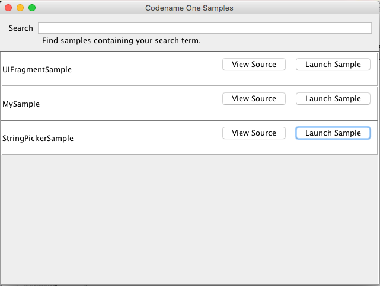

# Codename One Samples

This directory contains a number of runnable code samples that demonstrate the various Codename One APIs.  This is a work in progress.  Currently there is only a small number of samples, but more will be added over time.  It also contains a Netbeans Java project that allows you to launch, view source, and add new samples.

## Usage

**From the Command Line**:

~~~~
git clone https://github.com/codenameone/CodenameOne
cd CodenameOne
ant samples
~~~~

**From NetBeans**

Open the "Samples" project in Netbeans and run it.

## Where are the Samples located

The samples are located inside the "samples" directory.

## Adding Additional Samples

1. Open the Sample Runner (e.g. using `ant run`, or by opening the Samples project in Netbeans and running it).
2. Select "File" > "Create New Sample".
3. Enter a name for the sample in the prompt.

This will create a new directory at "samples/YourSampleName", with a single .java file YourSampleName.java.

You can edit this file with the contents of your sample.

NOTE:  Don't change the package name or the class name of this sample.  Also the enter sample code must be contained inside this file.  You cannot add additional files to this directory, and expect them to work.

## Adding Custom Build Hints

If you are building samples for targets other than the simulator, you may need to provide your own build hints (e.g. android key store, iOS certificates, etc..).  You can add your own build hints both on a global level, and at a per-sample level.

### Editing Global Build Hints

Select "File" > "Edit Global Build Hints"

This will open the global build hints file (located in config/codenameone_settings.properties).  Here you can add any build hints that you need to add to all builds.  

NOTE: Remember to use the full property name for build hints, e.g. include prefix `codename1.arg` for the property keys.

### Editing Per-Sample Build hints

You can specify both public and private build hints for each sample.  A public build hint is considered a necessary part of the sample and will have the same value no matter who is building it.  Private build hints are stored inside the "config" directory, and contain build hints that should not be shared with other users, such as passwords, provisioning profiles, and certificates.

To edit private build hints for a particular sample, press the "More..." button, then select "Edit Private Build Hints".  This will open the build hints file (located in config/SAMPLE_NAME/codenameone_settings.properties).  Similarly, selecting "Edit Public Build Hints" will open the public build hints file for editing.

## Using CSS In Samples

Samples can use CSS for styling also.  You can edit the CSS file for a sample by clicking "More..." > "Edit CSS File" next to the sample.  This will open the CSS file for editing.

You can also "live reload" the styles in your running sample by selecting "More..." > "Refresh CSS" next to the sample.

## Using Libraries (cn1libs) in Samples

Some samples (e.g. [CameraKitSample](https://github.com/codenameone/CodenameOne/blob/master/Samples/samples/CameraKitSample/CameraKitSample.java) depend on cn1libs in order build/run. If the cn1lib is available in the [CodenameOneLibs](https://github.com/codenameone/CodenameOneLibs) project, then it can be added as a sample dependency by adding the following to the beginning of the sample's Java source file:

~~~~
//require TheCN1libName
~~~~

E.g. Check out the [CameraKitSample](https://github.com/codenameone/CodenameOne/blob/master/Samples/samples/CameraKitSample/CameraKitSample.java).  It declares a dependency on the CameraKitCodenameOne.cn1lib with the following directive:

~~~~
//require CameraKitCodenameOne
~~~~

That's all there is to it.  The library will be automatically downloaded into the build project when you do a launch or build.

### Building against Local Library Project

If you are developing a sample that uses a library that you are still developing, then you can tell the SamplesRunner to use your local codename one library project instead of the version in CodenameOneLibs repository.  

In the "More..." menu for the sample, select "Edit Private Build Hints".

Then, add the following: 

~~~~
[LIBRARYNAME].projectDir=/path/to/library/project
~~~~

For example, in my local copy of the [CameraKitSample](https://github.com/codenameone/CodenameOne/blob/master/Samples/samples/CameraKitSample/CameraKitSample.java), I have the following in my private build hints.

~~~~
CameraKitCodenameOne.projectDir=/path/to/CameraKitCodenameOne
~~~~

Where /path/to/CameraKitCodenameOne is where I have the CameraKitCodenameOne library project.

## Exporting a Sample as a Project

You can export any sample as a self-contained Netbeans project by pressing "More..." > "Export" > "Netbeans" in the row for the sample.  This will prompt you for the location to save the project.  You can then open the project in Netbeans.

