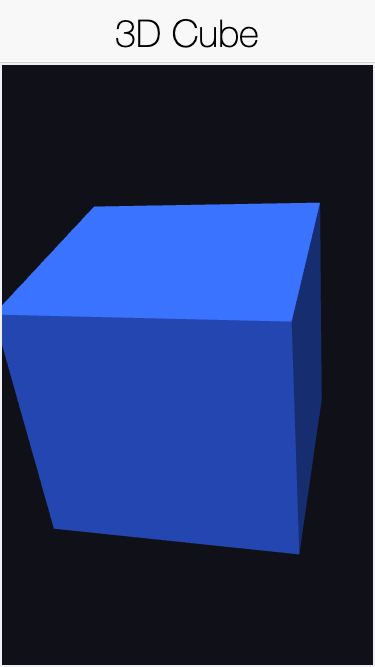
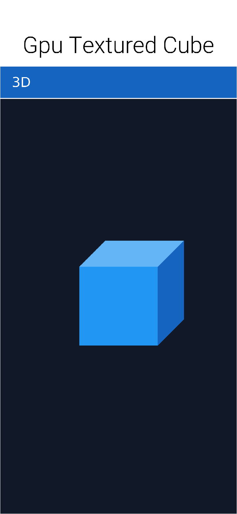
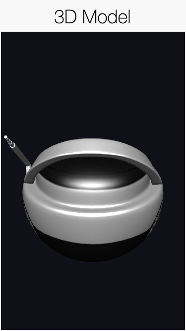
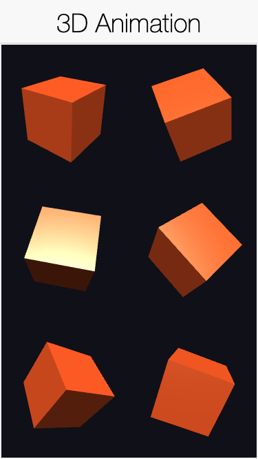

== 3D Graphics and Shaders

The `com.codename1.gpu` package provides a portable, hardware accelerated 3D
graphics API focused on games but useful anywhere you need GPU rendered content.
It runs from one code base on the JavaSE simulator (OpenGL via JOGL), Android
(OpenGL ES 2), iOS and Mac Catalyst (Metal), the native Windows port (Direct3D
11), and the JavaScript port (WebGL). The API integrates with the normal Codename
One UI: a 3D scene lives inside a regular component that you add to a `Form` like
any other.

[IMPORTANT]
====
*Your `Renderer` callbacks run on the native platform render thread -- NOT the
Codename One EDT.* This is the single most important thing to understand before
you write any 3D code.

`onInit`, `onResize`, `onFrame` and `onDispose` are invoked on the underlying
OS/GPU render loop (GL / Metal / Direct3D), not on the event dispatch thread.
From inside them you must *not* touch Codename One UI components, show forms, or
call other EDT-only APIs. To push data back to the UI (for example to update a
HUD label or react to a game event) hop onto the EDT with `CN.callSerially(...)`.
Conversely, treat the `GraphicsDevice` and the objects it hands you as owned by
the render thread.
====

WARNING: 3D is a low-level, GPU dependent feature. Always guard usage with
`CN.isGpuSupported()` (or `RenderView.isSupported()`); on a platform without a
backend the `RenderView` reports unsupported so you can fall back to 2D.

=== Concepts

The API is intentionally "hybrid": a low level command layer (buffers, textures,
render state, draw calls) for full control, plus high level helpers (meshes,
materials, a camera) for common cases. Crucially, *you never write shader source*.
Instead you describe a https://www.codenameone.com/javadoc/com/codename1/gpu/Material.html[Material]
(a lighting model plus color and texture) and the engine generates the matching
platform shader behind the scenes: GLSL ES on OpenGL ES and WebGL, GLSL on the
desktop simulator, Metal Shading Language on iOS and Mac, and HLSL on the native
Windows (Direct3D) port. This "engine-managed shader" approach is what keeps the
same application code rendering identically across a range of different GPUs.

The main types are:

* https://www.codenameone.com/javadoc/com/codename1/gpu/RenderView.html[RenderView] -
 the `Component` that hosts the GPU surface. You give it a `Renderer`.
* https://www.codenameone.com/javadoc/com/codename1/gpu/Renderer.html[Renderer] -
 your callback: `onInit`, `onResize`, `onFrame`, `onDispose`. These run on the
 platform render thread, never the EDT.
* https://www.codenameone.com/javadoc/com/codename1/gpu/GraphicsDevice.html[GraphicsDevice] -
 the command surface passed to your renderer. It creates buffers and textures,
 clears, sets the viewport, the camera and the light, and issues `draw` calls.
* https://www.codenameone.com/javadoc/com/codename1/gpu/Mesh.html[Mesh],
 https://www.codenameone.com/javadoc/com/codename1/gpu/Material.html[Material],
 https://www.codenameone.com/javadoc/com/codename1/gpu/Camera.html[Camera],
 https://www.codenameone.com/javadoc/com/codename1/gpu/Light.html[Light] -
 the high level scene building blocks.

=== A first scene: A spinning cube

The renderer below draws a Phong lit cube. `Primitives.cube` builds the geometry,
a `Material` describes the surface, and a `Camera` supplies the view. Notice there
is no shader code anywhere.

`setContinuous(true)` runs an animation loop. For a static scene leave it off and
call `view.requestRender()` whenever something changes; this conserves battery.

.A Phong lit cube rendered by RenderView in the simulator

=== Materials

A `Material` is a declarative description of a surface. Its `Type` selects the
lighting model:

[options="header"]
|===
| Type | Description
| `UNLIT` | Flat color/texture, no lighting. Ideal for UI, emissive surfaces.
| `LAMBERT` | Diffuse (Lambert) lighting from one directional light.
| `PHONG` | Diffuse + specular highlight (uses `setShininess`).
| `SPRITE` | Unlit, for screen aligned sprites and billboards.
| `SKYBOX` | Unlit background, rendered behind the scene.
|===

A material also carries a base color (`setColor`, packed `0xAARRGGBB`), an
optional `Texture` (`setTexture`), and a `RenderState` controlling depth testing,
alpha blending and face culling. Textures come from a Codename One `Image` or raw
ARGB pixels:

.An UNLIT cube with a checkerboard texture (NEAREST filtering)

=== Meshes and buffers

`Primitives` builds common shapes (`cube`, `quad`). For custom geometry, allocate a
https://www.codenameone.com/javadoc/com/codename1/gpu/VertexBuffer.html[VertexBuffer]
with a `VertexFormat`, fill the interleaved float data, and (optionally) an
https://www.codenameone.com/javadoc/com/codename1/gpu/IndexBuffer.html[IndexBuffer]:

Vertex buffers are allocated through the platform SIMD allocator, which on iOS
(ParparVM) places the data at a fixed, aligned native address so it can be handed
to Metal with no intermediate copy. You don't need to do anything special to get
this; just write into `getData()` and call `setDirty()` when you mutate it.

=== Loading models

Real scenes use authored geometry. `GltfLoader` loads a glTF 2.0 model, both the
binary `.glb` container and the JSON `.gltf` form with embedded buffers.
`loadModel` returns the mesh together with the base-color texture from the model's
own material, so a textured model renders with no extra setup:

The model below is the Khronos "BoomBox" glTF sample (a CC0 model carrying its own
base-color texture), loaded this way and drawn Phong lit:

.The Khronos BoomBox glTF sample loaded with GltfLoader

=== Animation

Drive a value (a rotation angle, a position) over time and redraw. A continuous
`RenderView` calls `onFrame` every frame; an on-demand view redraws when you call
`requestRender()`. The grid below captures six fixed rotation stages of a spinning
cube, each drawn into its own viewport in a single frame:

.Six rotation stages of an animated cube captured in one frame

=== Camera and math

https://www.codenameone.com/javadoc/com/codename1/gpu/Camera.html[Camera] builds
the view and projection matrices from an eye position, a look-at target and lens
settings (`setPerspective` or `setOrthographic`). All matrix helpers live in
https://www.codenameone.com/javadoc/com/codename1/gpu/Matrix4.html[Matrix4]
(column-major `float[16]`): `translation`, `scaling`, `rotation`, `multiply`,
`lookAt`, `perspective`, `ortho`. Pass a model matrix as the third argument to
`draw`, or `null` for the identity.

=== Platform notes

* *JavaSE simulator* - OpenGL through JOGL, loaded from an isolated class so a
 missing or failing GL driver degrades to a built in software rasterizer instead
 of breaking the simulator. Lets you develop and debug 3D without a device.
* *Android* - OpenGL ES 2 via a `GLSurfaceView` hosted as a native peer.
* *iOS and Mac Catalyst* - Metal. Shaders are generated as Metal Shading Language
 and compiled at runtime; vertex/index data is uploaded to `MTLBuffer`s,
 zero-copy where the SIMD allocation permits.
* *Native Windows* - Direct3D 11. Shaders are generated as HLSL and compiled with
 `D3DCompile`; the offscreen render target is read back and composited into the UI.
* *JavaScript* - WebGL on a `<canvas>` peer; the generated GLSL ES runs unmodified.

Querying capabilities at runtime:

=== Threading

`Renderer` callbacks run on the platform render thread, not the Codename One EDT.
Don't touch UI components from inside them. To move data the other way (for
example to update a HUD label from a game loop), use `CN.callSerially(...)`.
