== Advanced topics/under the hood

=== Sending arguments to the build server

When you send a build to the server, you can provide more parameters. The server incorporates those parameters into the build process as build hints.

These hints are often called "build hints" or "build arguments." They behave like compiler flags that tune the build server's behavior. That makes them useful for fast iteration on new functionality without rebuilding plugin UI for every change. They're also useful when you need to expose low-level behavior such as customizing the Android manifest XML or the iOS plist.

Launch Codename One Settings from the Maven project root, then select *Hints* in the left navigation rail. The hints use the `key=value` style.

[source,shell]
----
include::../demos/common/src/main/snippets/developer-guide/maven-appendix-control-center.sh[tag=maven-appendix-control-center-bash-001,indent=0]
----

.The build hints UI in Codename One Settings
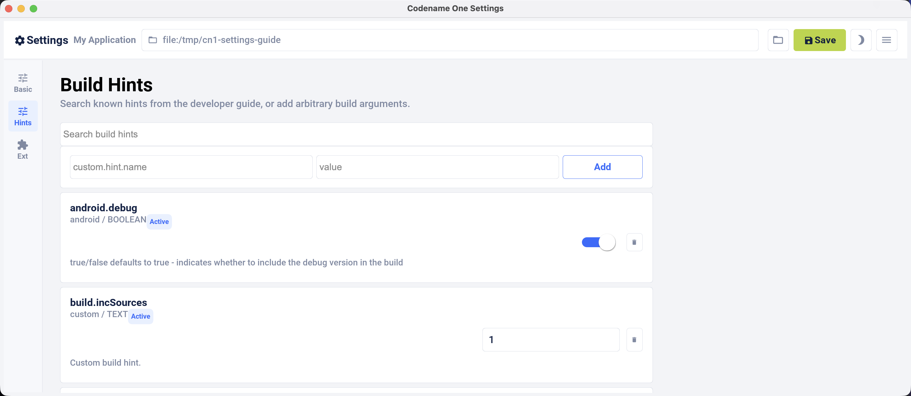

You can also set the build hints directly in the `codenameone_settings.properties` file. When you do that, each setting must start with the `codename1.arg.` prefix. For example, `android.debug=true` becomes `codename1.arg.android.debug=true`.

Application code can read a custom build argument through `Display.getProperty()`:

[source,java]
----
include::../demos/common/src/main/java/com/codenameone/developerguide/advancedtopics/AppArgSnippet.java[tag=appArg,indent=0]
----

Here is the current list of supported arguments. Build hints change over time, so consult the discussion forum if you don't find what you need here:

.Build hints
|===
|Name	|Description

|build.cn1Version
|Pro/Enterprise only. Pins the cloud build to a specific released Codename One version using the Maven release scheme (for example `7.0.182`), or to `master` to build against the current development head. The build server fetches that version's framework artifacts. Pro accounts can target versions published within the last two months; Enterprise within the last six months. Requesting an older version, a version that was never published, or using this hint without a Pro/Enterprise subscription fails the build with an explanatory error. See <<Versioned builds>>.

|android.debug
|true/false defaults to true - indicates whether to include the debug version in the build

|android.release
|true/false defaults to true - indicates whether to include the release version in the build

|android.onDeviceDebug
|Boolean true/false defaults to false. When `true`, the generated `AndroidManifest.xml` is marked `android:debuggable="true"`, R8/proguard is disabled, and the build is pinned to debug-only (`android.release` is forced off and `android.debug` is forced on) so a stray hint can't ship a release-signed APK that's `debuggable="true"`. Pair with the `cn1:android-on-device-debugging` Maven goal (or the bundled IntelliJ run configs) to install, launch, forward JDWP, and stream logcat through adb. Has no effect on builds that don't carry it — release builds are unaffected. See the <<On-Device Debugging (Android),On-Device Debugging (Android) chapter>> for the full flow.

|android.installLocation
|Maps to android:installLocation manifest entry defaults to auto. Can also be set to internalOnly or preferExternal.

|android.xapplication
|defaults to an empty string. Allows developers of native Android code to add text within the application block to define things such as widgets, services etc.

|android.permission.PERMISSION_NAME
|true/false Whether to include a particular permission. Use of these build hints is preferred to `android.xpermissions` since they avoid possible conflicts with libraries. See https://developer.android.com/reference/android/Manifest.permission.html[Android's `Manifest.permission` docs] for a full list of permissions.

|android.permission.PERMISSION_NAME.maxSdkVersion
|Will be translated to the `maxSdkVersion` attribute of the `<uses-permission>` tag for the corresponding `android.permission.PERMISSION_NAME` build hint.  (Optional)

|android.permission.PERMISSION_NAME.required
|true/false Will be translated to the `required` attribute of the `<uses-permission>` tag for the corresponding `android.permission.PERMISSION_NAME` build hint.  (Optional)

|android.xpermissions
|more permissions for the Android manifest

|android.xintent_filter
|Allows adding an intent filter to the main android activity

|android.tv
|true/false (defaults to false). Marks the build as an Android TV / Google TV app. Adds the `LEANBACK_LAUNCHER` intent category to the launcher activity (so the app appears on the TV home screen), declares the `android.software.leanback` feature, makes `android.hardware.touchscreen` optional (so it installs on touchless TVs), and generates a 320×180 launcher banner (`@drawable/tv_banner`) from the app icon. The same APK still installs and runs on phones and tablets, and `CN.isTV()` returns true at runtime on a TV.

|android.activity.launchMode
|Allows explicitly setting the `android:launchMode` attribute of the main activity in android. Default is "singleTop," but for some applications you may need to change this behaviour. In particular, apps that are meant to open a file type will need to set this to "singleTask."  See https://developer.android.com/guide/topics/manifest/activity-element.html[Android docs for the activity element] for more information about the `android:launchMode` attribute.

|android.licenseKey
|The license key for the Android app, this is required if you use in-app purchase on Android

|android.signingV1
|true/false Default true. See https://source.android.com/docs/security/features/apksigning

|android.signingV2
|true/false Default true. See https://source.android.com/docs/security/features/apksigning

|android.signingV3
|true/false Default true. See https://source.android.com/docs/security/features/apksigning

|android.signingV4
|true/false Default true. See https://source.android.com/docs/security/features/apksigning

|android.stack_size
|Size in bytes for the Android stack thread

|android.statusbar_hidden
|true/false defaults to false. When set to true hides the status bar on Android devices.

|android.facebook_permissions
|Permissions for Facebook used in the Android build target, applicable only if Facebook native integration is used.

|android.googleAdUnitId
|Allows integrating admob/google play ads, this is effectively identical to google.adUnitId but only applies to Android

|android.googleAdUnitTestDevice
|Device key used to mark a specific Android device as a test device for Google Play ads defaults to C6783E2486F0931D9D09FABC65094FDF

|android.includeGPlayServices
|*Deprecated, please android.playService.+++*+++!* Indicates whether Google Play Services should be included into the build, defaults to false but that might change based on the functionality of the application and other build hints. Adding Google Play Services support allows you to use a more refined location implementation and invoke some Google specific functionality from native code.

|android.playService.plus, android.playService.auth, android.playService.base, android.playService.identity, android.playService.indexing, android.playService.appInvite, android.playService.analytics, android.playService.cast, android.playService.gcm, android.playService.drive, android.playService.fitness, android.playService.location, android.playService.maps, android.playService.ads, android.playService.vision, android.playService.nearby, android.playService.panorama, android.playService.games, android.playService.safetynet, android.playService.wallet, android.playService.wearable
|Allows including only a specific play services library portion. Notice that this setting conflicts with the deprecated `android.includeGPlayServices` and only works with the Gradle-based Android build pipeline. +

If none of the services are defined to true then plus, auth, base, analytics, gcm, location, maps & ads will be set to true. If one or more of the `android.playService` entries are defined to something then all entries will default to false.

|android.playServicesVersion
| The version number of play services to build against. Experimental.  **Use with caution** as building against versions other than the server default may introduce incompatibilities with some Codename One APIs.

|xxx.minPlayServicesVersion
|This is a special case build hint. You can use any prefix to the build hint and the convention is to use your cn1lib name. It's identical to `android.minPlayServicesVersion` with the exception that the "highest version wins." That way if your cn1lib requires play services 9+ and uses: `myLib.minPlayServicesVersion=9.0.0` and another library has `otherLib.minPlayServicesVersion=10.0.0` then play services will be 10.0.0

|android.multidex
|Boolean true/false defaults to false. Multidex allows Android binaries to reference more than 65536 methods. This slows builds a bit so you have it off by default but if you get a build error mentioning this limit you should turn this on.

|android.headphoneCallback
|Boolean true/false defaults to false. When set to true it assumes the main class has two methods: `headphonesConnected` & `headphonesDisconnected` which it invokes appropriately as needed

|android.gpsPermission
|Indicates whether the GPS permission should be requested, it's autodetected by default if you use the location API. But, some code might want to explicitly define it

|android.asyncPaint
|Boolean true/false defaults to true. Toggles the Android pipeline between the legacy pipeline (false) and new pipeline (true)

|android.stringsXml
|Allows injecting more entries into the strings.xml file using a value that includes something like this `<string name="key1">value1</string><string name="key2">value2</string>`

|android.supportV4
|Boolean true/false defaults to false but that can change based on usage (for example, push implicitly activates this). Indicates whether the android support v4 library should be included in the build

|android.style
|Allows injecting more data into the `styles.xml` file right before the closing resources tag

|android.enableAdaptiveIcons
|Boolean true/false defaults to false. Enables Android adaptive icon generation in Android Gradle builds. When enabled, Codename One generates `mipmap` launcher resources (`ic_launcher`, `ic_launcher_foreground`, and adaptive XML in `mipmap-anydpi-v26`) and uses them in the application manifest (`android:icon` and `android:roundIcon`).

|android.adaptiveIconBackground
|Background color to use for adaptive icons when `android.enableAdaptiveIcons=true` and no background image is supplied. Defaults to `#ffffff` and is written as `@color/ic_launcher_background`.

|android.adaptiveIconBackgroundImage
|Optional path (relative to the root of the native Android project) to an image file to use as the adaptive icon background when `android.enableAdaptiveIcons=true`. If this property is set, it overrides `android.adaptiveIconBackground`.

|android.cusom_layout1
|Applies to any number of layouts as long as they're in sequence (for example, android.cusom_layout2, android.cusom_layout3 etc.). Will write the content of the argument as a layout XML file and give it the name `cusom_layout1.xml` onwards. This can be used by native code to work with XML files

|android.keyboardOpen
|Boolean true/false defaults to true. Toggles the new async keyboard mode that leaves the keyboard open while you move between text components

|android.versionCode
|Allows overriding the auto generated version number with a custom internal version number specifically used for the XML attribute `android:versionCode`

|android.captureRecord
|Indicates whether the `RECORD_AUDIO` permission should be requested. Can be `enabled` or any other value to disable this option

|android.nonconsumable
|Comma delimited string of items that are non-consumable in the in-app purchase API

|android.removeBasePermissions
|Boolean true/false defaults to false. Disables the built-in permissions specifically `INTERNET` permission (that is, no networking...)

|android.blockExternalStoragePermission
|Boolean true/false defaults to false. Disables the external storage (SD card) permission

|android.min_sdk_version
|The least SDK required to run this app, the default value changes based on functionality but can be as low as 7. This corresponds to the XML attribute `android:minSdkVersion`.

|android.manifest.queries
|Embeds XML content into the <queries> section of the Android manifest file. This is https://developer.android.com/training/package-visibility[required in Android 11 for package visibility].  See https://developer.android.com/guide/topics/manifest/queries-element[queries element Android documentation].

|android.mockLocation
|Boolean true/false defaults to true. Toggles the mock location permission which is on by default, this allows easier debugging of Android device location based services

|android.smallScreens
|Boolean true/false defaults to true. Corresponds to the `android:smallScreens` XML attribute and allows disabling the support for small phones

|android.xapplication_attr
|Allows injecting more attributes into the `application`` tag in the Android XML

|android.xactivity
|Allows injecting more attributes into the `activity` tag in the Android XML

|android.streamMode
|The mode in which the volume key should behave, defaults to OS default. Allows setting it to `music` for music playback apps

|android.pushVibratePattern
|Comma delimited long values to describe the push pattern of vibrate used for the `setVibrate` native method

|android.enableProguard
|Boolean true/false defaults to true. Allows disabling the proguard obfuscation even on release builds, notice that this isn't recommended

|android.proguardKeep
|Arguments for the keep option in proguard allowing you to keep a pattern of files for example, `-keep class com.mypackage.ProblemClass { *; }`

|android.shrinkResources
|Boolean true/false defaults to false. Used only in conjunction with android.enableProguard. Strips out unused resources to reduce apk size. Since 7.0

|android.sharedUserId
|Allows adding a manifest attribute for the sharedUserId option

|android.sharedUserLabel
|Allows adding a manifest attribute for the sharedUserLabel option

|android.targetSDKVersion
|Indicates the Android SDK used to compile the Android build defaults to 21. Notice that not all targets will work since the source might have some limitations and not all SDK targets are installed on the build servers.

|android.useAndroidX
|Use Android X instead of support libraries. This will also run a find/replace on all source files to replace support libraries and artifacts with AndroidX equivalents.

|android.rootCheck
|Boolean true/false defaults to false. Indicates whether the app should check for root access on the device. If root access is detected, the app will exit.

|android.fridaDetection
|Boolean true/false defaults to false. Indicates whether the app should check for the presence of the https://www.frida.re/[Frida] dynamic instrumentation toolkit on the device. If Frida is detected, the app will exit. This uses the [frida-blocker](https://github.com/shannah/frida-blocker) library to perform the frida detection.

|android.fridaVersion
|x.y.z  The version of [frida-blocker](https://github.com/shannah/frida-blocker) to use to perform frida detection. This is only relevant if `android.fridaDetection=true`.  If omitted, it will use the latest tested version in the build server.

|android.fridaDebugLogging
|Boolean true/false defaults to false. If true, it will add verbose debug logs during frida detection to show which check if fails on.

|android.theme
|Light or Dark defaults to Light. On Android 4+ the default Holo theme is used to render the native widgets sometimes and this indicates whether holo light or holo dark is used. This doesn't affect the Codename One theme but that might change in the future.

|android.web_loading_hidden
|true/false defaults to false - set to true to hide the progress indicator that appears when loading a web page on Android.

|block_server_registration
|true/false flag defaults to false. By default Codename One applications register with the Codename One server. Setting this to true blocks them from sending information to the Codename One cloud, which is kept for statistical purposes and may be used to provide more installation stats in the future.

|facebook.appId
|The application ID for an app that requires native Facebook login integration, this defaults to null which means native Facebook support shouldn't be in the app

|facebook.clientToken
|The client token for an app that requires native Facebook login integration, this is required if the facebook.appId is set.

|gcm.sender_id
|The Android/chrome push identifier, see the push section for more details

| android.background_push_handling
| Deliver push messages on Android when the app is minimized by setting this to "true."  Default behaviour is to deliver the message only if the app is in the foreground when received, or after the user taps on the notification to open the app, if the app was in the background when the message was received.

| desktop.mac.plist.PLISTKEY
| Set the key `PLISTKEY` in the Info.plist file for desktop mac build. For example, `desktop.mac.plist.LSApplicationCategoryType=public.app-category.business`.  See https://developer.apple.com/library/archive/documentation/General/Reference/InfoPlistKeyReference/Introduction/Introduction.html[Apple Documentation of Info.plist keys and values for a full list of supported keys].
+
Only supported for App Store builds. See https://www.codenameone.com/developer-guide.html#_mac_os_desktop_build_options[macOS Desktop Build Options] for more information.

| desktop.mac.plistInject
| Injects raw XML into the Info.plist file for desktop builds. For example, `desktop.mac.plistInject=<key>LSApplicationCategoryType</key><string>public.app-category.business</string>`
+
Only supported for App Store builds. See https://www.codenameone.com/developer-guide.html#_mac_os_desktop_build_options[macOS Desktop Build Options] for more information.

| windows.arch
| Native Windows (`windows-device`) target CPU: `x64` (default), `arm64`, or `both`. An x64 binary also runs on Windows-on-ARM via the OS's x64 emulation. See <<Working with the native Windows port>>.

| windows.debug
| Native Windows target: `true`/`false` (default `false`). When `false` the `.exe` is optimized and stripped (with the `.pdb` in its own file); `true` keeps symbols (a single x64 build) for crash symbolication. Optimizations stay on either way.

| windows.signing.pkcs12 / windows.signing.password / windows.signing.timestampUrl / windows.signing.digest / windows.signing.name / windows.signing.url
| Native Windows Authenticode signing of the produced `.exe` (via `osslsigncode`). A certificate is taken from `windows.signing.pkcs12` or the build's uploaded certificate; set `windows.signing=false` to skip. Unsigned binaries run but trip SmartScreen / "Unknown publisher."

| linux.arch
| Native Linux (`linux-device`) target CPU: `x64` (default), `arm64`, or `both`. See <<Working with the native Linux port>>.

| linux.debug
| Native Linux target: `true`/`false` (default `false`). When `false` the ELF is optimized and stripped (debug info is split into a separate `.debug`); `true` keeps symbols (`RelWithDebInfo`) for crash symbolication. Optimizations stay on either way.

| linux.libc
| Native Linux target: `glibc` (default) or `musl`. The default compiles against an old glibc so the ELF runs on essentially any mainstream distro; `musl` targets Alpine (where the GTK stack is itself musl-built). A glibc binary and a musl binary aren't interchangeable.

|ios.associatedDomains
|Comma-delimited list of domains associated with this app. Since 6.0.  Note that each domain should be prefixed by a supported prefix. For example, "applinks:" or "webcredentials:." See https://developer.apple.com/documentation/security/password_autofill/setting_up_an_app_s_associated_domains?language=objc[Apple's documentation on Associated domains] for more information.

|ios.bitcode
|true/false defaults to false. Enables bitcode support for the build.

|ios.debug.archs
|Can be set to "armv7" to force iOS debug builds to be 32 bit. By default, debug builds are 64 bit only.

|ios.release.archs
|Can be set to "arm64" to only build iOS release builds for 64 bit. By default, release builds are both 32 and 64 bit.

|ios.distributionMethod
|Specifies distribution type for debug iOS builds. This is used for enterprise or ad-hoc builds (using values "enterprise" and "ad-hoc" respectively).

|ios.debug.distributionMethod
|Specifies distribution type for debug iOS builds only. This is used for enterprise or ad-hoc builds (using values "enterprise" and "ad-hoc" respectively).

|ios.release.distributionMethod
|Specifies distribution type for release iOS builds only. This is used for enterprise or ad-hoc builds (using values "enterprise" and "ad-hoc" respectively).

|ios.keyboardOpen
|Flips between iOS keyboard open mode and autofold keyboard mode. Defaults to true which means the keyboard will remain open and not fold automatically when editing moves to another field.

|ios.uiscene
|true/false (defaults to true). Enables iOS UIScene lifecycle support. UIScene lets iOS manage one or more app UI sessions independently, improving lifecycle handling in modern iOS versions. Apple has indicated UIScene will be required starting with iOS 27, so this is now on by default; set the flag to `false` only if you need to temporarily fall back to the legacy `UIApplicationDelegate` lifecycle.

|ios.urlScheme
|Allows intercepting a URL call using the syntax `<string>urlPrefix<string>`

|ios.useAVKit
|Use AVKit for video components on iOS rather than `MPMoviePlayerController` on iOS versions 8 through 12.  iOS 13 will always use AVKit, and iOS 7 and lower will always use `MPMoviePlayerController`.  Default value `false`

|ios.teamId
|Specifies the team ID associated with the iOS provisioning profile and certificate. Use `ios.debug.teamId` and `ios.release.teamId` to specify different team IDs for debug and release builds respectively.

|ios.debug.teamId
|Specifies the team ID associated with the iOS debug provisioning profile and certificate.

|ios.release.teamId
|Specifies the team ID associated with the iOS release provisioning profile and certificate.

|ios.project_type
|one of ios, ipad, iphone (defaults to ios). Indicates whether the resulting binary is targeted to the iphone only or ipad only. Notice that the IDE plugin has a "Project Type" combo box you *should* use under the iOS section.

|ios.rpmalloc
// vale-skip: write-good.TooWordy — 'minimum' refers to the deployment-target floor; 'least' would change the meaning.
|`true`/`false` Use https://github.com/rampantpixels/rpmalloc[rpmalloc] instead of malloc/free for memory allocation in ParparVM. This will cause the deployment target to be changed to a minimum of iOS 8.0.

|ios.statusbar_hidden
|true/false defaults to false. Hides the iOS status bar if set to true.

|ios.newStorageLocation
|true/false defaults to false but defined on new projects as true by default. This changes the storage directory on iOS from using caches to using the documents directory which is the recommended location but might break compatibility. This is described in https://github.com/codenameone/CodenameOne/issues/1480[this issue]

|ios.prerendered_icon
|true/false defaults to false. The iOS build process adapts the submitted icon for iOS conventions (adding an overlay) that might not be appropriate on some icons. Setting this to true leaves the icon unchanged (only scaled).

|ios.app_groups
|Space-delimited list of app groups that this app belongs to as described in https://developer.apple.com/library/content/documentation/Miscellaneous/Reference/EntitlementKeyReference/Chapters/EnablingAppSandbox.html#//apple_ref/doc/uid/TP40011195-CH4-SW19[Apple's documentation].  These are added to the entitlements file with key `com.apple.security.application-groups`.

|ios.keychainAccessGroup
|Space-delimited list of keychain access groups that this app has access to as described in https://developer.apple.com/library/content/documentation/Security/Conceptual/keychainServConcepts/02concepts/concepts.html#//apple_ref/doc/uid/TP30000897-CH204-SW11[Apple's documentation].  These are added to the entitlements file with the key `keychain-access-groups`.

|ios.application_exits
|true/false (defaults to false). Indicates whether the application should exit on home button press. The default is to exit, leaving the application running is only tested at the moment.

|ios.blockScreenshotsOnEnterBackground
|true/false (defaults to false). Indicates that app should prevent iOS from taking screenshots when app enters background. Described https://shannah.github.io/cn1-recipes/#_hiding_sensitive_data_when_entering_background[here].

|ios.detectJailbreak
|true/false (defaults to false). When true, the iOS app will exit on launch if it detects that it's running on a jailbroken device.

|ios.notificationPermissionAtLaunch
|true/false (defaults to false). Backward-compatibility flag for the pre-issue-#4876 behavior. By default, the iOS notification permission prompt is deferred until the app calls `Push.register()` or schedules a `LocalNotification`, matching the Android flow and giving the developer a chance to display a rationale screen first. Set this hint to `true` to restore the legacy behavior in which the prompt fires automatically inside `application:didFinishLaunchingWithOptions:` as soon as the app launches. Existing apps relying on the prompt being shown at launch should set this to `true`; new apps should leave it disabled and trigger the prompt explicitly when they're ready to ask for permission.

|ios.applicationQueriesSchemes
|Comma separated list of url schemes that `canExecute` will respect on iOS. If the url scheme isn't mentioned here `canExecute` will return false starting with iOS 9. Notice that this collides with `ios.plistInject` when used with the `<key>LSApplicationQueriesSchemes</key>...` value so you should use one or the other. For example, to enable `canExecute` for a url like `myurl://xys` you can use: `myurl,myotherurl`

|ios.themeMode
|`auto` (default), `modern`, `ios7`, `legacy`. `auto` (unset) keeps the existing iOS 7 flat theme so pre-refactor screenshot goldens and apps see no behavior change. `modern` / `liquid` opts in to the CSS-generated iOS Modern (liquid-glass) theme shipped from `native-themes/ios-modern/theme.css`. `ios7` / `flat` is the same as `auto` - pre-liquid iOS 7 flat theme; `legacy` / `iphone` loads the pre-iOS 7 iPhone theme. The `auto` -> modern flip is planned for a future release.

|and.themeMode
|`auto`, `modern` / `material`, `hololight` (default for existing apps), `legacy`. `auto` and `modern` / `material` opt in to the CSS-generated Android Material 3 theme from `native-themes/android-material/theme.css`. `hololight` is Android Holo Light (what the framework shipped on API 14+ before this refactor). `legacy` loads the pre-Holo Android theme. The legacy alias `cn1.androidTheme` is still accepted, and `and.hololight=true` still maps to `hololight`. The default stays on `hololight` for existing apps until you flip in a future release.

|nativeTheme
|`modern`, `legacy`, `custom` (default unset). Cross-platform override that sets both `ios.themeMode` and `and.themeMode` together when those aren't set explicitly. `modern` = liquid glass + Material 3, `legacy` = iOS 7 flat + Holo Light, `custom` disables the framework native theme entirely. The legacy alias `cn1.nativeTheme` is still accepted.

|ios.interface_orientation
|UIInterfaceOrientationPortrait by default. Indicates the  orientation, one or more of (separated by colon :): `UIInterfaceOrientationPortrait`, `UIInterfaceOrientationPortraitUpsideDown`, `UIInterfaceOrientationLandscapeLeft`, `UIInterfaceOrientationLandscapeRight`. Notice that the IDE plugin has an "Interface Orientation" combo box you *should* use under the iOS section.

|ios.xcode_version
|The version of Xcode used on the server. Defaults to 4.5; accepts 5.0 as an option and nothing else.

|ios.multitasking
|Set to true to enable iOS multitasking and split-screen support. This only works if `ios.xcode_verson=9.2`.

|java.version
|Valid values include 5 or 8. Indicates the JVM version that should be used for server compilation, this is defined by default for newly created apps based on the Java 8 mode selection

|javascript.inject_proxy
|true/false (defaults to `true`). The ParparVM builder generates a same-origin proxy bundle and configures the app to use it. Setting this to `false` disables both proxy generation and proxy URL injection.

|javascript.inject.beforeHead
| Content to be injected into the index.html file at the beginning of the `<head>` tag.

|javascript.inject.afterHead
| Content to be injected into the index.html file at the end of the `<head>` tag.

|javascript.minifying
|true/false (defaults to `true`). By default the JavaScript code is minified to reduce file size. You may optionally disable minification by setting `javascript.minifying` to `false`.

|javascript.port
|`parparvm` (default) or `teavm`. Selects the public JavaScript compiler for cloud builds. `teavm` retains the original builder as a compatibility fallback.

|javascript.proxy.allowedTargets
|Comma-separated target origins, host names, or wildcard subdomains that a generated proxy may access, for example `https://api.example.com,*.services.example.org`. If omitted, the proxy accepts any HTTP or HTTPS target and the build emits a warning.

|javascript.proxy.target
|The generated ParparVM proxy deployment platform. Supported values are `jakarta-servlet` (default), `javax-servlet`, `node`, `php`, `aws-lambda`, `google-cloud-functions`, `cloudflare-workers`, and `none`.

|javascript.proxy.url
|The URL of an existing proxy to use for network requests. Setting it suppresses generated proxy packaging unless `javascript.proxy.target` is also set. If `javascript.inject_proxy` is `false`, this build hint is ignored.

|javascript.sourceFilesCopied
|true/false (defaults to `false`). Setting this flag to `true` will cause available java source files to be included in the resulting .zip and .war files. These may be used by Chrome during debugging.

|javascript.stopOnErrors
|true/false (defaults to `true`). Cause JavaScript build to fail if there are warnings during the build. Sometimes build warnings won't affect the running of the app. For example, if the JavaScript port is missing a method that the app depends on, but it isn't used in most of the app. Or if there is multithreaded code detected in static initializers, but that code-path isn't used by the app. Setting this to `false` may allow you to get past some build errors, but it might just result in runtime errors later on, which are much more difficult to debug.  *This build hint is only available in Codename One 3.4 and later.

|javascript.teavm.version
| (Optional)  The version of TeaVM to use for the build.  *Use caution*, only use this property if you know what you're doing!

|google.adUnitId
|Allows integrating Admob/Google Play ads into the application see link:https://www.codenameone.com/blog/adding-google-play-ads.html[this]

|ios.entitlementsInject
|Content to inject into the iOS entitlements file. This should be in the Plist XML format. See https://developer.apple.com/documentation/bundleresources/entitlements?language=objc[Apple Entitlements Documentation].

|ios.plistInject
|entries to inject into the iOS plist file during build.

|ios.includePush
|true/false (defaults to false). Whether to include the push capabilities in the iOS build. Notice that the IDE plugin has an "Include Push" check box you *should* use under the iOS section.

|ios.newPipeline
|Boolean true/false defaults to true. Allows toggling the OpenGL ES 2.0 drawing pipeline off to the older OGL ES 1.0 pipeline.

|ios.headphoneCallback
|Boolean true/false defaults to false. When set to true it assumes the main class has two methods: `headphonesConnected` & `headphonesDisconnected` which it invokes appropriately as needed

|ios.facebook_permissions
|Permissions for Facebook used in the Android build target, applicable only if Facebook native integration is used.

|ios.applicationDidEnterBackground
|Objective-C code that can be injected into the iOS callback method (message) `applicationDidEnterBackground`.

|ios.enableAutoplayVideo
|Boolean true/false defaults to false. Makes videos "autoplay" when loaded on iOS

|ios.googleAdUnitId
|Allows integrating admob/google play ads, this is effectively identical to google.adUnitId but only applies to iOS

|ios.viewDidLoad
|Objective-C code that can be injected into the iOS callback method (message) `viewDidLoad`

|ios.googleAdUnitIdPadding
|Indicates the amount of padding to pass to the Google Ads placed at the bottom of the screen with `google.adUnitId`

|ios.enableBadgeClear
|Boolean true/false defaults to true. Clears the badge value with every load of the app, this is useful if the app doesn't manually keep track of number values for the badge

|ios.glAppDelegateHeader
|Objective-C code that can be injected into the iOS app delegate at the top of the file. For example, if you need to include headers or make special imports for other injected code

|ios.glAppDelegateBody
|Objective-C code that can be injected into the iOS app delegate within the body of the file before the end. This only makes sence for methods that aren't already declared in the class

|ios.beforeFinishLaunching
|Objective-C code that can be injected into the iOS app delegate at the top of the body of the didFinishLaunchingWithOptions callback method

|ios.afterFinishLaunching
|Objective-C code that can be injected into the iOS app delegate at the bottom of the body of the didFinishLaunchingWithOptions callback method

|ios.locationUsageDescription
|This flag is required for iOS 8 and newer if you're using the location API. It needs to include a description of the reason for which you need access to the users location

|ios.NSXXXUsageDescription
|iOS privacy flags for using certain APIs. Starting with Xcode 8, you're required to add usage description strings for certain APIs. Find a full list of the available keys in https://developer.apple.com/library/content/documentation/General/Reference/InfoPlistKeyReference/Articles/CocoaKeys.html[Apple's docs].  Some relevant ones include `ios.NSCameraUsageDescription`, `ios.NSContactsUsageDescription`, `ios.NSLocationAlwaysUsageDescription`, `NSLocationUsageDescription`, `ios.NSMicrophoneUsageDescription`, `ios.NSPhotoLibraryAddUsageDescription`, `ios.NSSpeechRecognitionUsageDescription`, `ios.NSSiriUsageDescription`

|ios.add_libs
|A semicolon separated list of libraries that should be linked to the app to build it

|ios.pods
|A comma separated list of https://cocoapods.org/[Cocoa Pods] that should be linked to the app to build it. For example, `AFNetworking ~> 2.6, ORStackView ~> 3.0, SwiftyJSON ~> 2.3`

|ios.pods.platform
// vale-skip: write-good.TooWordy — 'minimum platform level' is the standard CocoaPods term; 'least platform level' is wrong.
| Sets the Cocoapods 'platform' for the Cocoapods. Some Cocoapods require a minimum platform level. For example, `ios.pods.platform=7.0`.

| ios.deployment_target
// vale-skip: write-good.TooWordy — 'minimum version' is the standard term for a deployment-target floor.
| Sets the deployment target for iOS builds. This is the minimum version of iOS required by a device to install the app. For example, `ios.deployment_target=8.0`.  Default is '6.0'.  Note: This build hint interacts with the `ios.rpmalloc` build hint. If `ios.deployment_target` is 8.0 or higher, ParparVM will use https://github.com/rampantpixels/rpmalloc[rpmalloc] by default. You can disable this default and revert back to using malloc/free by setting the `ios.rpmalloc=false` build hint.

|ios.bundleVersion
|Indicates the version number of the bundle, this is useful if you want to create a minor version number change for the beta testing support

|ios.objC
|Added the `-ObjC` compile flag to the project files which some native libraries require

|ios.testFlight
|Boolean true/false defaults to false and works only for pro accounts. Enables the testflight support in the release binaries for easy beta testing. Notice that the IDE plugin has a "Test Flight" check box you *should* use under the iOS section.

|ios.metal
|Boolean true/false defaults to true. Selects the Metal rendering backend (`CAMetalLayer`) over the legacy OpenGL ES 2 path (`CAEAGLLayer`). Metal is the supported iOS graphics API; OpenGL ES is deprecated. Set to `false` to opt out if you hit a Metal-only rendering regression. See link:#_metal_renderer[Working with iOS / Metal renderer] for details.

|ios.metal.colorSpace
|Selects the `CAMetalLayer.colorspace` for the Metal renderer. Accepts `sRGB` (default), `displayP3`, `deviceRGB`, `linearSRGB`, `extendedSRGB`, `extendedLinearSRGB`, or `none`. Has no effect when `ios.metal=false`. See link:#_choosing_a_color_space_for_the_metal_renderer[Working with iOS / Choosing a color space] for the full table.

|ios.generateSplashScreens
|Boolean true/false defaults to false as of 5.0.  Enable legacy generation of splash screen images for use when launching the app. These have been replaced now by the new launch storyboards.

|ios.onDeviceDebug
|Boolean true/false defaults to false. When `true`, the iOS build links a small JDWP listener thread (`cn1_debugger`) into the binary and the ParparVM translator emits source-line and locals metadata so a desktop proxy can serve the running app to any JDWP-speaking debugger. Has no effect on release builds. See the <<On-Device Debugging (iOS),On-Device Debugging (iOS) chapter>> for the full flow.

|ios.onDeviceDebug.proxyHost
|Hostname or IP address the device-side listener dials to reach the desktop proxy. Default `127.0.0.1` (correct for the native iOS simulator). For a physical device, set this to the developer laptop's LAN IP. Has no effect unless `ios.onDeviceDebug=true`.

|ios.onDeviceDebug.proxyPort
|TCP port on `ios.onDeviceDebug.proxyHost` where the proxy is listening for the device. Default `55333`. Has no effect unless `ios.onDeviceDebug=true`.

|ios.onDeviceDebug.waitForAttach
|Boolean true/false defaults to false. When `true`, the app blocks at startup until the proxy connects and the IDE tells the VM to continue. Useful when the breakpoint to investigate fires during app boot. Has no effect unless `ios.onDeviceDebug=true`.

|ios.wallet.extension
|Boolean true/false defaults to false. Generates an Apple Wallet issuer provisioning extension (the "From apps on your iPhone" flow in the Wallet app) and embeds it in the build. Requires `ios.wallet.appGroup` and `ios.wallet.issuerEndpoint`. See the <<Apple Wallet Extension,Apple Wallet Extension chapter>>.

|ios.wallet.appGroup
|App Group id starting with `group.` shared by the app and the generated Wallet extensions. The app publishes pass entries into this group through `com.codename1.payment.WalletExtension` and the group is added to the app and extension entitlements automatically. Required when `ios.wallet.extension=true`.

|ios.wallet.issuerEndpoint
|HTTPS URL of the issuer backend endpoint that produces the encrypted provisioning payload. The generated extension POSTs Apple's certificates/nonce plus the card identifier and auth token there as JSON. Required when `ios.wallet.extension=true`.

|ios.wallet.includeUI
|Boolean true/false defaults to false. Also generates the Wallet authorization UI extension - a login form shown inside the Wallet app when the app reports that authentication is required. Requires `ios.wallet.authEndpoint`.

|ios.wallet.authEndpoint
|HTTPS URL the generated login UI extension POSTs `{"username","password"}` to; the JSON response's `token` is stored in the App Group for the provisioning request. Required when `ios.wallet.includeUI=true`.

|ios.wallet.nonuiExtensionName / ios.wallet.uiExtensionName
|Names of the generated extension targets, also used as the bundle id suffix (`<package>.<name>`). Default `WalletNonUIExtension` / `WalletUIExtension`. The matching App IDs must be registered with the payment-pass-provisioning entitlement and listed by the card network.

|ios.wallet.nonuiProvisioningProfile / ios.wallet.uiProvisioningProfile
|Cloud device builds only. File name of the extension's `.mobileprovision` placed under `common/src/main/resources`. The profile must match the app's distribution certificate and carry the `com.apple.developer.payment-pass-provisioning` entitlement; the build keeps it out of the app bundle.

|ios.wallet.nonuiProvisioningURL / ios.wallet.uiProvisioningURL
|Cloud device builds only. URL fallback for the extension provisioning profile when it isn't bundled in resources, mirroring `ios.notificationServiceExtensionProvisioningURL`.

|ios.wallet.nonui.buildSettings.SETTING / ios.wallet.ui.buildSettings.SETTING
|Extra Xcode build settings applied to the generated extension targets, for example `ios.wallet.nonui.buildSettings.DEVELOPMENT_TEAM=ABCD123456`. Applied last so they override the generated defaults.

|ios.wallet.nonuiImportsInject, ios.wallet.statusInject, ios.wallet.passEntriesInject, ios.wallet.remotePassEntriesInject, ios.wallet.generateRequestInject, ios.wallet.generateResponseInject, ios.wallet.uiImportsInject, ios.wallet.uiViewDidLoadInject, ios.wallet.uiAuthRequestInject, ios.wallet.uiAuthResponseInject
|Objective-C code injected at the matching marker comment in the generated Wallet extension sources, for custom behavior at each callback (for example adding fields to the issuer endpoint payload in `generateRequestInject`). See the <<Apple Wallet Extension,Apple Wallet Extension chapter>>.

|ios.appext.NAME.provisioningURL
|Cloud device builds only. URL of the provisioning profile for a generic app extension dropped into `ios/app_extensions/NAME/`, used when the extension folder doesn't bundle a `.mobileprovision` itself. The profile is installed on the build machine and added to the export options per bundle id.

|codename1.mac.appid
|Mac Native cloud builds only. The Mac bundle identifier registered in App Store Connect / Apple Developer. Distinct from `codename1.ios.appid` because Apple treats the iOS and Mac App Store records as separate products. Required for cloud Mac builds.

|codename1.mac.certificate
|Mac Native cloud builds only. Path to the `.p12` file containing the Mac signing certificate(s) — _Mac App Distribution_ (3rd Party Mac Developer Application) for App Store builds, _Developer ID Application_ for Developer ID builds, or both bundled into the same P12 when `macNative.distribution=both`. Not interchangeable with the iOS distribution certificate. Required for cloud Mac builds.

|codename1.mac.certificatePassword
|Mac Native cloud builds only. Password to unlock the P12 referenced by `codename1.mac.certificate`. Required for cloud Mac builds.

|codename1.mac.provision
|Mac Native cloud builds only. Path to the Mac provisioning profile (`.provisionprofile`). Apple issues distinct provisioning profiles for Mac App Store and Developer ID distribution — pass the one that matches the chosen channel.

|macNative.distribution
|Mac Native builds only. `appStore` (default), `developerID`, or `both`. Selects which entitlements + ExportOptions plist + signing certificate to emit. `both` emits parallel `*-AppStore.entitlements` / `*-DeveloperID.entitlements` and matching `ExportOptions-*-Mac.plist` files so a single project can be archived to either channel.

|macNative.teamId
|Mac Native builds only. Apple Developer Team ID (alphanumeric). Falls back to `ios.release.teamId` → `ios.teamId` → `ios.debug.teamId` since most apps share a single Apple Developer Team for iOS and Mac.

|macNative.bundleId
|Mac Native builds only. Used only when `macNative.deriveBundleId=false`. Default: `<packageName>.mac`.

|macNative.deriveBundleId
|Mac Native builds only. `true` (default) maps to Xcode's `DERIVE_MACCATALYST_PRODUCT_BUNDLE_IDENTIFIER=YES` (Xcode appends `.maccatalyst` to the iOS bundle ID). Set to `false` to take the bundle ID verbatim from `macNative.bundleId`.

|macNative.minDeploymentTarget
|Mac Native builds only. Minimum macOS version (`MACOSX_DEPLOYMENT_TARGET`). Default `10.15` — earlier versions don't support Mac Catalyst.

|macNative.iosMinDeploymentTarget
|Mac Native builds only. iOS deployment-target floor for the Catalyst slice (`IPHONEOS_DEPLOYMENT_TARGET`). Default `13.1`. The plugin coerces the iOS slice's minimum upward when set.

|macNative.appCategory
|Mac Native builds only. `LSApplicationCategoryType` in the generated Info.plist. Default `public.app-category.utilities`. See https://developer.apple.com/documentation/bundleresources/information_property_list/lsapplicationcategorytype[Apple's category list].

|macNative.copyright
|Mac Native builds only. `NSHumanReadableCopyright` in the Info.plist. Defaults to `Copyright (c) <year> <vendor>`.

|macNative.signing.style
|Mac Native builds only. `automatic` (default) lets Xcode pick the signing certificate; `manual` forces the certificate identity hints below to be respected verbatim.

|macNative.signingIdentity.appStore
|Mac Native builds only. Signing certificate identity for the App Store channel. Default `Apple Distribution`.

|macNative.signingIdentity.developerID
|Mac Native builds only. Signing certificate identity for the Developer ID channel. Default `Developer ID Application`.

|macNative.provisioningProfile.appStore
|Mac Native builds only. Provisioning profile name for App Store distribution — used only when `macNative.signing.style=manual`.

|macNative.provisioningProfile.developerID
|Mac Native builds only. Provisioning profile name for Developer ID distribution — used only when `macNative.signing.style=manual`.

|macNative.entitlements.appSandbox
|Mac Native builds only. `true` enables `com.apple.security.app-sandbox`. Default is `true` for the `appStore` channel (Mac App Store requires the sandbox), `false` for `developerID`.

|macNative.entitlements.network.client
|Mac Native builds only. Toggles `com.apple.security.network.client`. Default `true`.

|macNative.entitlements.network.server
|Mac Native builds only. Toggles `com.apple.security.network.server`. Default `false`.

|macNative.entitlements.files.userSelected
|Mac Native builds only. `readwrite` (default), `readonly`, or `none`. Sets the matching `com.apple.security.files.user-selected.*` entitlement.

|macNative.entitlements.hardenedRuntime
|Mac Native builds only. `true` enables hardened runtime restrictions. Default is `true` for `developerID` (notarization requires it), `false` for `appStore`.

|macNative.entitlements.allowJit
|Mac Native builds only. `true` enables `com.apple.security.cs.allow-jit` for hardened runtime. ParparVM is AOT-compiled so this is `false` by default; flip when bundling a JIT-using cn1lib.

|macNative.entitlements.extra
|Mac Native builds only. Free-form XML inserted verbatim inside the `<dict>…</dict>` of the generated entitlements plist. Use for entitlements Codename One doesn't expose individually.

|macNative.fixedWindowSize
|Mac Native builds only. Opt-in. Format `<width>x<height>` — for example `1024x685`. When set, the Catalyst window's `UISceneSession.sizeRestrictions` minimum and maximum are pinned to the requested size so every launch produces a byte-identical window. Default unset, in which case the window is resizable. The CI screenshot pipeline turns this on to keep the strict-pixel golden comparison stable; production apps should leave it off.

|desktop.width
|Width in pixels for the form in desktop builds, will be doubled for retina grade displays. Defaults to 800.

|desktop.height
|Height in pixels for the form in desktop builds, will be doubled for retina grade displays. Defaults to 600.

|desktop.adaptToRetina
|Boolean true/false defaults to true. When set to true some values will ve implicitly doubled to deal with retina displays and icons etc. Will use higher DPI's

|desktop.resizable
|Boolean true/false defaults to true. Indicates whether the UI in the desktop build is resizable

|desktop.fontSizes
|Indicates the sizes in pixels for the system fonts as a comma delimited string containing 3 numbers for small,medium,large fonts.

|desktop.theme
|Name of the theme res file (without the ".res" extension) to use as the "native" theme. By default this is native indicating iOS theme on Mac and Windows Metro on Windows. If its something else then the app will try to load the file /themeName.res (placed in native/Java SE directory).

|desktop.themeMac
|Same as `desktop.theme` but specific to macOS

|desktop.themeWin
|Same as `desktop.theme` but specific to Windows

|desktop.windowsOutput
|Can be exe or msi depending on desired results

|desktop.win.cef
|Whether to use CEF for media and BrowserComponent instead of JavaFX in windows desktop builds.  true/false. Default value is `false` (Jan 2021), but this will be changed to `true` in a future version.

|desktop.mac.cef
|Whetherto use CEF for media or BrowserComponent instead of JavaFX in Mac desktop builds.  true/false. Default value is `false` (Jan 2021), but this will be changed to `true` in a future version.

|tvNative.enabled
|true/false (defaults to false). Adds an Apple TV (tvOS) application target to the iOS build. The tvOS app is a separate `appletvos` target built from the same Java/Kotlin sources through ParparVM (UIKit + Metal; tvOS has no OpenGL ES). Enabling it doesn't change the iOS app -- in particular it doesn't override the iOS app's `ios.metal` setting. Also turned on implicitly by `codename1.tvMain`.

|tvNative.mainClass (a.k.a. codename1.tvMain)
|Fully-qualified tvOS lifecycle entry class. Setting it auto enables the tvOS target. If omitted while `tvNative.enabled=true`, the tvOS app reuses the phone main class.

|tvNative.bundleId
|Bundle identifier of the tvOS app. Defaults to `<packageName>.tvos`.

|tvNative.minDeploymentTarget
|`TVOS_DEPLOYMENT_TARGET` for the tvOS target. Defaults to `13.0`.

|tvNative.displayName
|The tvOS app name shown on Apple TV. Defaults to the app's display name.

|tvNative.teamId
|Apple Developer Team ID used to sign the tvOS target. Falls back to the iOS team id (`ios.release.teamId` / `ios.teamId` / `ios.debug.teamId`).

|mac.desktop-vm
|The JVM the should be bundled with Mac desktop build. Mac desktop builds only. Supported values: zuluFx8, zulu11, zuluFx11

|win.desktop-vm
|The JVM that should be bundled in the Windows desktop build. Windows desktop builds only. Supported values: zulu8, zuluFx8, zulu8-32bit, zuluFx8-32bit, zulu11, zuluFx11, zulu11-32bit, zuluFx11-32bit

|windows.extensions
|Historical build hint for the discontinued UWP target. It's retained here only for legacy reference and isn't used by current supported build targets.

|win.vm32bit
|true/false (defaults to false). Forces windows desktop builds to use the Win32 JVM instead of the 64 bit VM making them compatible with older Windows Machines. This is off by default at the moment because of a bug in JDK 8 update 112 that might cause this to fail for some cases

|win.installDirName
|Windows desktop builds only. Overrides the default installation folder name suggested by the installer (under `Program Files`). Defaults to the application's main class name for backward compatibility. Use this build hint to set a user-friendly installation folder name (for example, `win.installDirName=My Application`). The application ID used by Windows for upgrade detection is unaffected, so existing installations continue to upgrade.

|win.shortcutName
|Windows desktop builds only. Overrides the name used for the Start Menu shortcut, the Desktop shortcut and (when `win.launchOnStart=true`) the autostart shortcut. Defaults to the application's main class name for backward compatibility. Use this build hint to set a user-friendly shortcut label (for example, `win.shortcutName=My Application`).

|noExtraResources
|true/false (defaults to false). Blocks codename one from injecting its own resources when set to true, the only effect this has is in slightly reducing archive size. This might have adverse effects on some features of Codename One so it isn't recommended.

|windows.arch
|Native Windows port only (the `windows-native` build target -- not the JVM `win.*` desktop hints above). Target CPU architecture for the standalone `.exe`: `x64` (the default) or `arm64`. Accepts the usual synonyms (`x86_64`/`amd64`, `aarch64`). clang-cl cross-compiles to the chosen architecture from either host. See the link:#_working_with_the_native_windows_port[Working with the native Windows port chapter].

|windows.debug
|Native Windows port only. true/false (defaults to false). When `false` the `.exe` is built optimized and *stripped* -- no PDB, dead-stripped unreferenced code (`/OPT:REF`) and folded identical functions (`/OPT:ICF`) -- which is the shipping default. Set `true` to keep debug symbols (a `.pdb` next to the exe, via `RelWithDebInfo` / clang-cl `/Zi` + linker `/DEBUG`) so a native crash address can be symbolized during development. Optimizations stay on in both cases.

|windows.sdkRoot
|Native Windows port only; used when building on a *non-Windows* host (for example a Linux build server). Path to a Windows SDK laid out by https://github.com/Jake-Shadle/xwin[`xwin splat`] (a directory containing `crt/include` and `sdk/include/um`), used to cross-compile the `.exe` with clang-cl + lld-link instead of a Visual Studio environment. If unset, the `CN1_XWIN_SYSROOT` environment variable is used. Ignored on Windows hosts, which build through Visual Studio. The same SDK serves both `windows.arch` targets (its `x86_64` / `aarch64` lib subdirs).

|(signing certificate)
|Native Windows port only. The code-signing certificate itself isn't a build-hint argument; configure it through project settings as `codename1.windows.signing.certificate` (path to a PKCS#12 `.pfx`/`.p12` file holding the certificate + key) and `codename1.windows.signing.password`. The build uses it for both local and cloud builds -- a cloud build uploads it with the build request automatically, exactly like the iOS / Android signing certificates. When a certificate is present the produced `.exe` is Authenticode-signed with `osslsigncode` (which signs Windows PE files on any OS, so it works in the Linux build cloud); without one the exe ships unsigned (it runs, but shows "Unknown publisher" in UAC and trips SmartScreen on download).

|windows.signing.timestampUrl
|Native Windows port only. RFC&#160;3161 timestamp server used when signing, so the signature stays valid after the certificate expires. Default `http://timestamp.digicert.com`; set empty to disable timestamping.

|windows.signing.digest
|Native Windows port only. Signature digest algorithm. Default `sha256`.

|windows.signing.name / windows.signing.url
|Native Windows port only. The description and URL embedded in the signature (the "More info" shown by Windows). Default: the app's display name, and no URL.

|windows.signing
|Native Windows port only. `true`/`false` (default `true`). Set `false` to force an unsigned build even when a certificate is available.

|===

=== Versioned builds

By default a cloud build always uses the current Codename One release. With a _versioned build_ you can instead pin the build to a specific previously released framework version, so you get reproducible output over time. This helps when stabilizing a release, supporting an older app, or isolating a regression: if an app that built correctly in the past starts failing, rebuilding against the last known good version tells you whether the change came from your code or from the framework and build server.

Set the `build.cn1Version` build hint to the version you want to target. Versions use the standard Maven release scheme published to Maven Central, for example `7.0.182`:

----
codename1.arg.build.cn1Version=7.0.182
----

The build server fetches that version's framework artifacts from Maven Central and builds against them. To keep your simulator and local compile classpath aligned with the same release, set the matching `cn1.version` in your project `pom.xml`.

Versioned builds are a Pro and Enterprise feature, and how far back you can target depends on the subscription tier:

[options="header"]
|===
|Tier |Versions you can target
|Pro |Any version released within the last two months
|Enterprise |Any version released within the last six months
|===

If you request a version older than your tier's window, a version that was never published, or you aren't on a Pro or Enterprise plan, the build fails with an explanatory message instead of falling back to the current release.

==== Building against master

Set `build.cn1Version` to `master` to build against the current development head (the latest `master` of the Codename One repository) instead of a released version:

----
codename1.arg.build.cn1Version=master
----

Every push to `master` publishes a fresh set of framework artifacts and the build server always grabs the latest, so this is the quickest way to verify an unreleased fix or feature end to end on a device. Because `master` tracks active development it can be less stable than a release, so use it for verification rather than for shipping production builds. Building against `master` is available to Pro and Enterprise subscribers.

=== Android permissions

One of the annoying tasks when programming native Android applications is tuning all the required permissions
to match your codes requirements, Codename One aims to simplify this. The build server automatically introspects the classes sent to it as part of the build and injects the right set of permissions required by the app.

For example, sometimes developers might find the permissions that come up a bit confusing and might not understand why
a specific permission came up. This maps Android permissions to the methods/classes in Codename One that would trigger them. Notice that this list isn't exhaustive as the API is rather large:

`android.permission.WRITE_EXTERNAL_STORAGE` - included by default (up to Android 13) so file APIs continue to work unless you block it with `android.blockExternalStoragePermission=true`.

`android.permission.INTERNET` - always requested because the networking stack depends on it even for offline features like local web views.

`android.permission.CAMERA` & `android.permission.RECORD_AUDIO` - required when capturing photos, video, or audio. The builder injects them automatically and the Android port prompts the user the first time the API is used.

`android.permission.READ_PHONE_STATE` - used by telephony-aware APIs like `Display.getMsisdn()` and by media integration so audio pauses on calls.

`android.permission.ACCESS_FINE_LOCATION` & `android.permission.ACCESS_COARSE_LOCATION` - requested when using `com.codename1.location` or embedded maps so location fixes can be delivered.

`android.permission.ACCESS_BACKGROUND_LOCATION` - added when background geofencing or fetch tasks are enabled; the Android port verifies the permission on Android 10+.

`android.permission.POST_NOTIFICATIONS` - prompted on Android 13+ for both push registration and local notifications.

`package.permission.C2D_MESSAGE`, `com.google.android.c2dm.permission.RECEIVE`, and `android.permission.RECEIVE_BOOT_COMPLETED` - bundled with the push subsystem so Firebase Cloud Messaging can wake the app after device restarts.

`android.permission.READ_CONTACTS` - requested when accessing the device address book through `Display.getAllContacts()` and related APIs.

==== Permissions under Marshmallow (Android 6+)

Starting with Marshmallow (Android 6+ API level 23) Android shifted to a permissions system that prompts users for permission the first time an API is used for example: when accessing contacts the user will receive a prompt whether to allow contacts access.

NOTE: Permission can be denied and a user can later on revoke/grant a permission through external settings UI

This is great as it allows apps to be installed with a single click and no permission prompt during install which can increase conversion rates!

===== Enabling permissions

// vale-skip: write-good.TooWordy — 'minimum of API 33' is the precise term for the SDK floor.
Codename One's Gradle 8 based Android builder detects the highest Android SDK you've installed and uses that value (with a minimum of API 33) for both the compile and target SDK versions, so the modern runtime permission flow is enabled by default. If you override the target version through the `android.targetSDKVersion` build hint the builder will honour it, but lowering the target may disable some compatibility libraries. Keeping the target current is strongly recommended for Play Store compliance.

===== Permission prompts

To test this API see the following simple contacts app:

[source,java]
----
include::../demos/android/src/main/java/com/codenameone/developerguide/advancedtopics/PermissionSnippets.java[tag=contactsPermission,indent=0]
----

If you explicitly lower the target SDK (for example: `android.targetSDKVersion=21`) and install this app on an Android 6 device you will still see the legacy install prompt with all permissions listed up front:

.Install UI when using the old permissions system
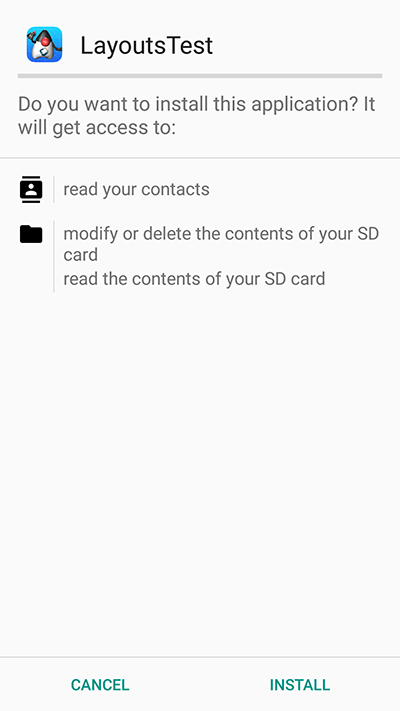

When you keep the default target (API 33+) the installer defers to the runtime permission flow and the installation UI looks like this instead:

.Install UI when using the new permissions system
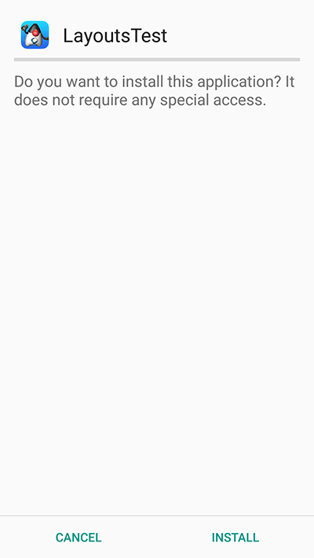

When you launch the UI under the old permissions system you see the contacts instantly. In the new system you're presented with this UI:

.Native permission prompt first time
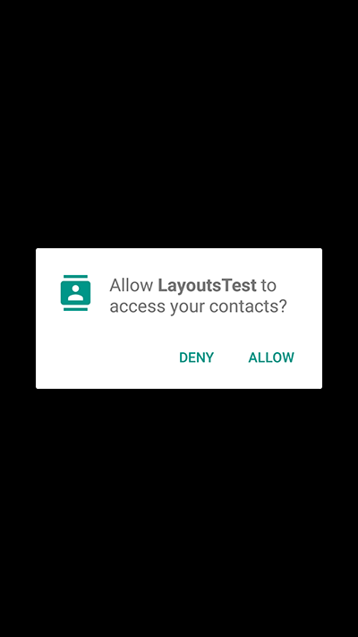

If you accept and allow all is good and the app loads as usual but if you deny then Codename One provides the user another chance to request the permission. Notice that in this case you can customize the prompt string as explained below.

.Codename One permission prompt

If you select don't ask then you will get a blank screen since the contacts will return as a 0 length array. This makes
sense as the user is aware he denied permission and the app will still function as expected on a device where
no contacts are available. For example, if the user realizes his mistake he can double back and ask to re-prompt for
permission in which case he will see this native prompt:

.Native permission prompt second time
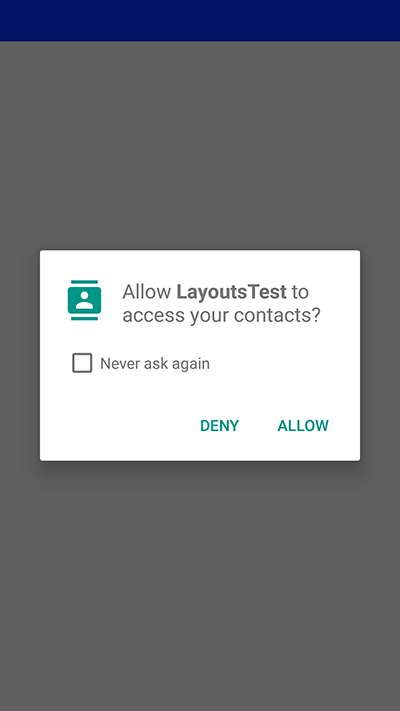

Notice that denying this second request won't trigger another Codename One prompt.

===== Code changes

No explicit code changes needed for this functionality to "work." The respective APIs will work like they always worked and will prompt the user seamlessly for permissions.

TIP: Some behaviors that never occurred on Android but were legal in the past might start occurring with the switch to the new API. For example: the location manager might be null and your app must always be ready to deal with such a situation

When permission is requested a user will be seamlessly prompted/warned. You can customize the permission text through `Display` properties. For example: to customize the rationale text of the contacts permission:

[source,java]
----
include::../demos/android/src/main/java/com/codenameone/developerguide/advancedtopics/PermissionSnippets.java[tag=permissionPrompt,indent=0]
----

The Android port also checks `UIManager.localize()` for localized values before falling back to `Display` properties. You can provide localized strings for the permission body and dialog buttons/title using keys based on the permission name:

[source,java]
----
include::../demos/android/src/main/java/com/codenameone/developerguide/advancedtopics/PermissionSnippets.java[tag=permissionPromptLocalization,indent=0]
----

For example, if the permission key is `android.permission.READ_CONTACTS`, you can localize these keys:

* `android.permission.READ_CONTACTS` (dialog body)
* `android.permission.READ_CONTACTS.title`
* `android.permission.READ_CONTACTS.askAgain`
* `android.permission.READ_CONTACTS.dontAsk`

The same pattern applies to other permissions. `android.permission.ACCESS_BACKGROUND_LOCATION` also supports:
`android.permission.ACCESS_BACKGROUND_LOCATION.settings`,
`android.permission.ACCESS_BACKGROUND_LOCATION.cancel`,
`android.permission.ACCESS_BACKGROUND_LOCATION.explanation_title`,
`android.permission.ACCESS_BACKGROUND_LOCATION.explanation_body`, and
`android.permission.ACCESS_BACKGROUND_LOCATION.ok`.

This is optional as there is a default value defined. You can define this once in the `init(Object)` method but for some extreme cases permission might be needed for different things for example: you might ask for this permission with one reason at one point in the app and with a different reason at another point in the app.

===== Simulating prompts

You can simulate permission prompts by checking that option in the simulator menu.

.Simulate permission prompts menu item in the simulator
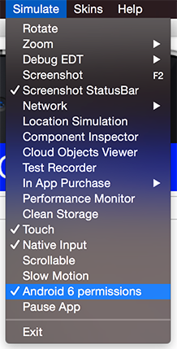

This will produce a dialog to the user whenever this happens in Android and will try to act in a similar way to the device. Notice that you can test it in the iOS simulator too.

===== AndroidNativeUtil's checkForPermission

If you write Android native code using native interfaces you're probably familiar with the `AndroidNativeUtil` class from the `com.codename1.impl.android` package.

This class provides access to many low-level capabilities you would need as a developer writing native code. Since native code might need to request a permission Codename One uses the same underlying logic, namely:
`checkForPermission`.

To get a permission you can use this code as such:

[source,java]
----
include::../demos/android/src/main/java/com/codenameone/developerguide/advancedtopics/PermissionSnippets.java[tag=androidCheckForPermission,indent=0]
----

This will prompt the user with the native UI and later on with the fallback option as described above. Notice that the `checkForPermission` method is a blocking method and it will return when there is a final conclusion on the subject. It uses `invokeAndBlock` and can be invoked on the event dispatch thread without concern.

By default, fallback prompts are displayed using Codename One's `Dialog.show(...)`. If you're writing native Android code and need to use your own prompt implementation, you can install a custom callback:

[source,java]
----
include::../demos/android/src/main/java/com/codenameone/developerguide/advancedtopics/PermissionSnippets.java[tag=androidPermissionPromptCallback,indent=0]
----

Pass `null` to `AndroidNativeUtil.setPermissionPromptCallback()` to restore the default behavior.

=== On device debugging

On-device debugging now has two dedicated chapters, one per platform:

* <<On-Device Debugging (iOS)>> covers attaching a standard Java
  debugger (IntelliJ, jdb, VS Code) to an iOS app running on a device or in the
  native iOS simulator, as well as debugging the generated Xcode project natively.
* <<On-Device Debugging (Android)>> covers the equivalent
  adb/JDWP-based flow for Android devices and emulators, including wireless
  debugging and debugging the generated Gradle project from Android Studio.

=== Native interfaces

Sometimes you may wish to use an API that's unsupported by Codename One or integrate with a 3rd party library/framework that isn't supported. These are achievable tasks when writing native code and Codename One lets you encapsulate such native code using native interfaces.

==== Introduction

Notice that when you say "native" you don't mean C/C++ always but rather the platforms "native" environment. For Android, Java or Kotlin code can be invoked with full access to the Android API. In case of iOS, Objective-C or Swift code can be invoked and so forth.

TIP: You can still access C code under Android either by using JNI from the Android native code or by using a library

Native interfaces are designed to allow primitive types, Strings, arrays of primitive types (single dimension ) & https://www.codenameone.com/javadoc/com/codename1/ui/PeerComponent.html[PeerComponent] values. Any other kind of parameter/return type is prohibited. For example, once in the native layer the native code can act and query the Java layer for more information.

NOTE: The reason for the limits is the disparity between the platforms. Mapping a Java `Object` to an Objective-C `NSObject` is possible but leads to odd edge cases and complexity for example: GC vs. ARC in a disparate object graph

Furthermore, native methods should avoid features such as overloading, varargs (or any Java 5+ feature for that matter) to allow portability for languages that don't support such features.

IMPORTANT: Don't rely on pass by reference/value behavior since they vary between platforms

Implementing a native layer effectively means:

.	Creating an interface that extends https://www.codenameone.com/javadoc/com/codename1/system/NativeInterface.html[NativeInterface] and defines methods with the arguments/return values declared in the previous paragraph.

.	Creating the proper native implementation hierarchy based on the call conventions for every platform within the native directory

For example: to create a simple hello world interface do something like:

[source,java]
----
include::../demos/common/src/main/java/com/mycompany/myapp/MyNative.java[tag=myNativeInterface,indent=0]
----

You now need to right-click the class in the IDE and select the #Generate Native Access# menu item:

.Generating the native code
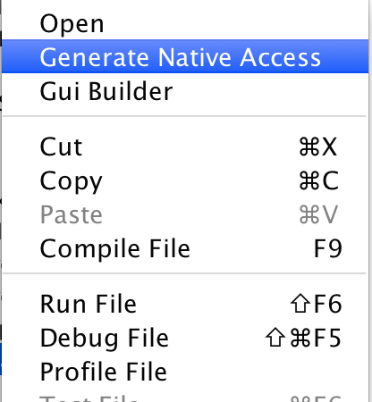

.Once generated you're prompted that the native code is in the "native" directory
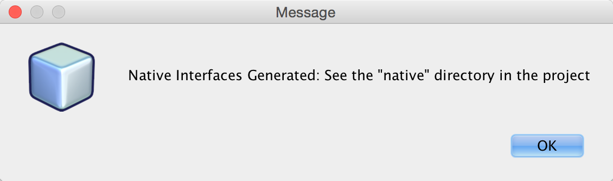

You can now look int the #native# directory in the project root (in NetBeans you can see that in the #Files# tab) and you can see something that looks like this:

.Native directory structure containing stubs for the various platforms
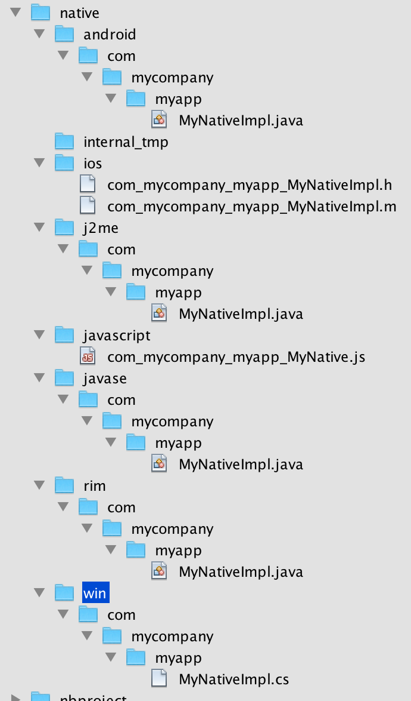

These are effectively stubs you can edit to implement the methods in native code.

TIP: If you re-run the #Generate Native Access# tool you will get this dialog, if you answer yes all the files will be overwritten, if you answer no files you deleted/renamed will be recreated

.Running "Generate Native Access" when some/all the native files exist already
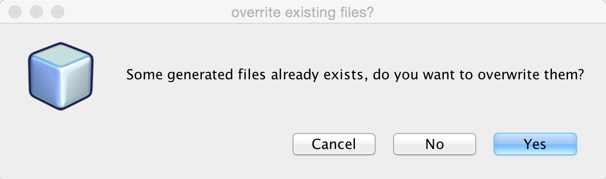

For now lets leave the stubs and come back to them soon. From the Codename One Java code you can call the implementation of this native interface using:

[source,java]
----
include::../demos/common/src/main/java/com/codenameone/developerguide/advancedtopics/NativeInterfaceSnippets.java[tag=nativeLookup,indent=0]
----

Notice that for this to work you must implement the native code on all supported platforms.

You will start with Android which should be familiar and intuitive to many developers. The helper `MyNativeImplStub` class below mirrors the stub that the tooling generates under the `native/android` directory:

[source,java]
----
include::../demos/android/src/main/java/com/mycompany/myapp/MyNativeImplStub.java[tag=myNativeAndroidStub,indent=0]
----

The stub implementation always returns `false`, `null` or `0` by default. The `isSupported` also defaults to `false` thus allowing you to implement a `NativeInterface` on some platforms and leave the rest out without knowing anything about these platforms.

You can implement the Android version in Java or Kotlin. Here is the Java version:

[source,java]
----
include::../demos/android/src/main/java/com/mycompany/myapp/MyNativeImpl.java[tag=myNativeAndroidImpl,indent=0]
----

<1> Notice that you're using the Android native `android.util.Log` class which isn't accessible from standard Codename One code

<2> The impl class doesn't physically implement the `MyNative` interface! +
This is intentional and due to the `PeerComponent` functionality mentioned below. You don't need to add an implements clause.

<3> Notice that there is no constructor and the class is public. It's crucial that the system will be able to assign the class without obstruction. You can use a constructor but it can't have any arguments and you shouldn't rely on semantics of construction.

<4> You implemented the native method and that you set `isSupported` to true.

IMPORTANT: The IDE won't provide completion suggestions and will claim that there are errors in the code! +
Codename One doesn't include the native platforms in its bundle for example: the full Android SDK or the full Xcode Objective-C runtime. For example, since the native code is compiled on the servers (where these runtimes are present) this shouldn't be a problem

TIP: When implementing a non-trivial native interface, send a server build with the "Include Source" option checked. Implement the native interface in the native IDE then copy and paste the native code back into Codename One

The implementation of this interface is identical for Android (Java/Kotlin) & Java SE.

===== Swift (iOS) and Kotlin (Android) options

For iOS native interfaces you can implement the generated `...Impl` class in Objective-C _or_ Swift. +
For Android native interfaces you can implement the generated `...Impl` class in Java _or_ Kotlin.

[cols="1,3",options="header"]
|===
| Platform
| Typical file locations for native interface implementations

| Android (Java/Kotlin)
| `android/src/main/java/com/mycompany/myapp/MyNativeImpl.java` +
`android/src/main/java/com/mycompany/myapp/MyNativeImpl.kt`

| iOS (Objective-C/Swift)
| `ios/src/main/objectivec/com_mycompany_myapp_MyNativeImpl.h` +
`ios/src/main/objectivec/com_mycompany_myapp_MyNativeImpl.m` +
`ios/src/main/objectivec/com_mycompany_myapp_MyNativeImpl.swift`

| Native Windows (win32, C)
| `win/src/main/c/com/mycompany/myapp/MyNativeImplCodenameOne.c`

| Native Linux (C)
| `linux/src/main/c/com/mycompany/myapp/MyNativeImplCodenameOne.c`

| JavaScript
| `javascript/src/main/javascript/com_mycompany_myapp_MyNative.js`
|===

NOTE: The native Windows and native Linux ports compile your app to C (no JVM), so
their native interface implementations are plain C, generated alongside the others
by the "Generate Native Sources" tool. The native Mac target reuses the iOS
Objective-C/Swift implementation, since it rides the same build.

===== Use the Android main thread (native EDT)

iOS, Android & pretty much any modern OS has an EDT like thread that handles events etc. The problem is that they differ in their nuanced behavior. For example: Android will respect calls off of the EDT and iOS will often crash. Some OSes enforce EDT access and will throw an exception when you violate that...

You don't need to know about these things, hidden functionality within your implementation bridges between your EDT and the native EDT to provide consistent cross-platform behavior. However, when you write native code you need awareness.

.Why not Implicitly call Native Interfaces on the Native EDT?
****
Calling into the native EDT includes overhead and it might not be necessary for some features (for example, IO, polling etc.). Furthermore, some calls might work well with asynchronous calls while others might need synchronous results and you can't know in advance which ones you would need.
****

====== How do you access the native EDT

Within your native code in Android do something like:

[source,java]
----
include::../demos/android/src/main/java/com/codenameone/developerguide/advancedtopics/AndroidThreadSnippets.java[tag=androidRunOnUiThread,indent=0]
----

This will execute the block within `run()` asynchronously on the native Android UI thread. If you need synchronous execution you have a special method for Codename One:

[source,java]
----
include::../demos/android/src/main/java/com/codenameone/developerguide/advancedtopics/AndroidThreadSnippets.java[tag=androidRunOnUiThreadAndBlock,indent=0]
----

This blocks in a way that's OK with the Codename One EDT which is unique to your Android port.

===== Gradle dependencies

Integrating a native OS library isn't hard but it sometimes requires some juggling. Most instructions target developers working with Xcode or Android Studio & you need to twist your head around them. In Android the steps for integration in most modern libraries include a Gradle dependency.

For example: you published a library that added support for https://www.codenameone.com/blog/intercom-support.html[Intercom]. The native Android integration instructions for the library looked like this:

Add the following dependency to your app's `build.Gradle` file:

----
dependencies {
    compile 'io.intercom.android:intercom-sdk:3.+'
}
----

Which instantly raises the question: "How do you do that in Codename One"?

Well, it's actually pretty simple. You can add the build hint:

----
android.gradleDep=compile 'io.intercom.android:intercom-sdk:3.+'
----

This would "work" but there is a catch...

You might need to define the specific version of the Android SDK used and specific version of Google Play Services version used. Intercom is pretty sensitive about those and demanded that you also add:

----
android.playServices=9.8.0
android.sdkVersion=25
----

Once those were defined the native code for the Android implementation became trivial to write and the library was easy as there were no jars to include.

==== Objective-C and Swift (iOS)

When generating the Objective-C code the "Generate Native Sources" tool produces two files by default: `com_mycompany_myapp_MyNativeImpl.h` & `com_mycompany_myapp_MyNativeImpl.m`.
If you enable Swift stub generation in the Maven goal, it can also produce `com_mycompany_myapp_MyNativeImpl.swift`.

The `.m` files are the Objective-C equivalent of `.c` files and `.h` files contain the header/include information. In this case the `com_mycompany_myapp_MyNativeImpl.h` contains:

[source,objective-c]
----
include::../demos/ios/src/main/objectivec/com_mycompany_myapp_MyNativeImpl.h[tag=myNativeHeader,indent=0]
----

And `com_mycompany_myapp_MyNativeImpl.m` contains:

[source,objective-c]
----
include::../demos/ios/src/main/objectivec/com_mycompany_myapp_MyNativeImpl.m[tag=myNativeImplStub,indent=0]
----

IMPORTANT: Objective-C relies on argument names as part of the message (method) signature. `-(NSString*)helloWorld:(NSString*)param` isn't the same as `-(NSString*)helloWorld:(NSString*)iChangedThisName`! +
don't change argument names in the Objective-C native interface!

Here is a simple implementation like above:

[source,objective-c]
----
include::../demos/ios/src/main/objectivec/com_mycompany_myapp_MyNativeImpl.m[tag=myNativeImplExample,indent=0]
----

If you prefer Swift for iOS native interfaces, keep the same class naming convention (`com_mycompany_myapp_MyNativeImpl`) and annotate the class with `@objc(...)` so the runtime can discover it.

===== Using the iOS main thread (native EDT)

iOS has a native thread you should use for all calls like Android. Check out the Native EDT on Android section above for reference.

On iOS this is pretty like Android (if you consider objective-c to be similar). This is used for asynchronous invocation:

[source,objc]
----
include::../demos/ios/src/main/objectivec/DispatchExamples.m[tag=dispatchAsync,indent=0]
----

You can use this for synchronous invocation, notice the lack of the `a` in the dispatch call:

[source,objc]
----
include::../demos/ios/src/main/objectivec/DispatchExamples.m[tag=dispatchSync,indent=0]
----

The problem with the synchronous call is that it will block the caller thread, if the caller thread is the EDT this can cause performance issues and even a deadlock. It's important to be cautious with this call!

===== Use Cocoapods for dependencies

Cocoapods are the iOS equivalent of Gradle dependencies.

CocoaPods allow you to add a native library dependency to iOS far more than Gradle. By default you target iOS 7.0 or newer which is supported by Intercom for older versions of the library. Annoyingly CocoaPods might seem to work but some specific APIs won't work since it fell back to an older version... To solve this you've to explicitly define the build hint `ios.pods.platform=8.0` to force iOS 8 or newer. You might need to force it to even newer versions as some libraries force an iOS 9 least etc.

Including intercom itself required a single build hint: `ios.pods=Intercom` which you can obviously extend by using commas to include many libraries. You can search the https://cocoapods.org/[CocoaPods website] for supported 3rd party libraries which includes everything you would expect. One important advantage when working with CocoaPods is the faster build time as the upload to the Codename One website is smaller and the bandwidth you've to CocoaPods is faster. Another advantage is the ability to keep up with the latest developments from the library providers.

==== C (native Windows and native Linux)

The native Windows (win32) and native Linux ports have no JVM: the "clean" ParparVM
target compiles your whole app to C and then to a native binary. A native interface
on these ports is therefore implemented in plain *C* rather than C#/Objective-C/Java.
The "Generate Native Sources" tool emits one C file per interface:

* `win/src/main/c/com/mycompany/myapp/MyNativeImplCodenameOne.c` (native Windows)
* `linux/src/main/c/com/mycompany/myapp/MyNativeImplCodenameOne.c` (native Linux)

The two files are identical, so a native interface written once works on both ports;
only the directory differs. (The native Mac target reuses the iOS Objective-C/Swift
implementation, because it rides the iOS build.)

The translator emits one C function per interface method. Unlike the Objective-C
stub, the function name is the fully qualified, mangled C symbol the translated app
links against, so *don't rename the functions or change their signatures*; just fill
in the bodies. Each function takes the thread state as its first argument and
`JAVA_*` typed parameters. For example, the interface:

[source,java]
----
include::../demos/common/src/main/java/com/mycompany/myapp/MyNative.java[tag=myNativeInterface,indent=0]
----

This generates the C stub below (returning `JAVA_NULL` until you implement it):

[source,c]
----
include::../demos/linux/src/main/c/com/mycompany/myapp/MyNativeImplCodenameOne.c[tag=advanced-topics-under-the-hood-c-001,indent=0]
----

Type mapping: the primitives (`int`, `long`, `boolean`, `byte`, `short`, `char`,
`float`, `double`) become their `JAVA_INT`/`JAVA_LONG`/`JAVA_BOOLEAN` equivalents;
`String`, arrays and other objects become `JAVA_OBJECT`; a `void` method returns
`JAVA_VOID` and omits the `_R_` suffix in its name; and a
`com.codename1.ui.PeerComponent` is passed and returned as a `JAVA_LONG` native peer
handle. Use the core helpers declared in `cn1_globals.h` (for example
`newStringFromCString` / `stringToUTF8`) to convert between C and Java values. As
with the other ports, you can drop additional `.c`/`.h` sources and prebuilt
libraries into the same `src/main/c` directory and they're compiled into the binary.

==== JavaScript

Native interfaces in JavaScript look a little different than the other platforms since JavaScript doesn't natively support threads or classes. The native implementation should be placed in a file with name matching the name of the package and the class name combined where the "." elements are replaced by underscores.

The default generated stubs for the JavaScript build look like this `com_mycompany_myapp_MyNative`:

[source,JavaScript]
----
include::../demos/javascript/src/main/snippets/developer-guide/advanced-topics-under-the-hood.js[tag=advanced-topics-under-the-hood-javascript-001,indent=0]
----

A simple implementation looks like this:

[source,JavaScript]
----
include::../demos/javascript/src/main/snippets/developer-guide/advanced-topics-under-the-hood.js[tag=advanced-topics-under-the-hood-javascript-002,indent=0]
----

Notice that you use the `complete()` method of the provided callback to pass the return value rather than using the `return` statement. This is to work around the fact that JavaScript doesn't natively support threads. The *Java* thread that's calling your native interface will block until your method calls `callback.complete()`. This allows you to use asynchronous APIs inside your native method while still allowing Codename One to work use your native interface through a synchronous API.

WARNING: Make sure you call either `callback.complete()` or `callback.error()` in your method at some point, or you will cause a deadlock in your app (code calling your native method will sit and "wait" forever for your method to return a value).

The naming conventions for the methods themselves are modeled after the naming conventions shown in the previous examples:

`<method-name>__<param-1-type>_<param-2-type>_...<param-n-type>`

Where `<method-name>` is the name of the method in Java, and the `<param-X-type>`s are a string representing the parameter type. The general rule for these strings are:

1. Primitive types are mapped to their type name. (For example: `int` to "int," `double` to "double," etc.).
2. Reference types are mapped to their fully qualified class name with '.' replaced with underscores. For example: `java.lang.String` would be `java_lang_String`.
3. Array parameters are marked by their scalar type name followed by an underscore and `1ARRAY`. For example: `int[]` would be "int_1ARRAY" and `String[]` would be `java_lang_String_1ARRAY`.

===== JavaScript examples

Java API:

[source,java]
----
include::../demos/common/src/main/java/com/codenameone/developerguide/advancedtopics/JavaScriptNativeApi.java[tag=jsPrintMethod,indent=0]
----

becomes

[source,JavaScript]
----
include::../demos/javascript/src/main/snippets/developer-guide/advanced-topics-under-the-hood.js[tag=advanced-topics-under-the-hood-javascript-003,indent=0]
----

Java API:

[source,java]
----
include::../demos/common/src/main/java/com/codenameone/developerguide/advancedtopics/JavaScriptNativeApi.java[tag=jsAddTwoArgs,indent=0]
----

becomes

[source,JavaScript]
----
include::../demos/javascript/src/main/snippets/developer-guide/advanced-topics-under-the-hood.js[tag=advanced-topics-under-the-hood-javascript-004,indent=0]
----

[source,java]
----
include::../demos/common/src/main/java/com/codenameone/developerguide/advancedtopics/JavaScriptNativeApi.java[tag=jsAddArray,indent=0]
----

becomes

[source,JavaScript]
----
include::../demos/javascript/src/main/snippets/developer-guide/advanced-topics-under-the-hood.js[tag=advanced-topics-under-the-hood-javascript-005,indent=0]
----

==== Native GUI components

https://www.codenameone.com/javadoc/com/codename1/ui/PeerComponent.html[PeerComponent] return values are automatically translated to the platform native peer as an expected return value. For example: for a `NativeInterface` method such as this:

[source,java]
----
include::../demos/common/src/main/java/com/codenameone/developerguide/advancedtopics/PeerComponentExamples.java[tag=peerComponentApi,indent=0]
----

Android native implementation would use:

[source,java]
----
include::../demos/android/src/main/java/com/codenameone/developerguide/advancedtopics/PeerComponentAndroidExamples.java[tag=androidPeerImplementation,indent=0]
----

The iphone would need to return a pointer to a view for example:

[source,objective-c]
----
include::../demos/ios/src/main/objectivec/PeerComponentExamples.m[tag=createPeer,indent=0]
----

TIP: Not all platforms support native peers. Specifically Java SE doesn't support them due to the way the Java SE native interfaces are mapped to their implementation. +
Note that this won't limit the code from running on an unsupported platform. Only that specific method won't work.

JavaScript would expect a DOM Element (for example: a `
` tag to be returned.). For example:

[source,JavaScript]
----
include::../demos/javascript/src/main/snippets/developer-guide/advanced-topics-under-the-hood.js[tag=advanced-topics-under-the-hood-javascript-006,indent=0]
----

Notice that if you want to use a native library (jar,.a file etc.) places it within the appropriate native directory and it will be packaged into the final executable. You would be able to reference it from the native code and not from the Codename One code, which means you will need to build native interfaces to access it.

This is discussed further below.

==== Type mapping & rules

Several rules govern the creation of NativeInterfaces and you covered some of them.

- The implementation class must have a default public constructor or no constructor at all
- Native methods can't throw exceptions, checked or otherwise
- A native method can't have the name `init` as this is a reserved method in Objective-C
- Only the supported types listed below can be used
- Native implementations can't rely on pass by reference/value semantics as those might change between platforms
- `hashCode`, `equals` & `toString` are reserved and won't be mapped to native code

.NativeInterface Supported Types
[cols="5*",options="header"]
|====
| Java | Android | Java SE | Obj-C | C#
|byte | byte | byte | char | sbyte
|boolean | boolean | boolean | BOOL | bool
|char | char | char | int | char
|short | short | short | short | short
|int | int | int | int | int
|long | long | long | long | long
|float | float | float | float | float
|double | double | double | double | double
|String | String | String | NSString* | String
|byte[] | byte[] | byte[] | NSSData* | sbyte[]
|boolean[] | boolean[] | boolean[] | NSData* | bool[]
|char[] | char[] | char[] | NSData | char[]
|short[] | short[] | short[] | NSData* | short[]
|int[] | int[] | int[] | NSData* | int[]
|long[] | long[] | long[] | NSData* | long[]
|float[] | float[] | float[] | NSData* | float[]
|double[] | double[] | double[] | NSData* | double[]
|PeerComponent | android.view.View | PeerComponent | void* | FrameworkElement
|====

TIP: JavaScript is excluded from the table above as it isn't a type safe language and thus has no such type mapping

NOTE: `PeerComponent` on iOS is `void*` but `UIView` is expected as a result

The examples below show the signatures for this method on all platforms:

.NativeInterface definition
[source,java]
----
include::../demos/common/src/main/java/com/codenameone/developerguide/advancedtopics/PeerComponentExamples.java[tag=allTypesSignature,indent=0]
----

.Android Version
[source,java]
----
include::../demos/android/src/main/java/com/codenameone/developerguide/advancedtopics/PeerComponentAndroidExamples.java[tag=androidAllTypesSignature,indent=0]
----

.iOS Version
[source,objective-c]
----
include::../demos/ios/src/main/objectivec/PeerComponentExamples.m[tag=iosAllTypesSignature,indent=0]
----

NOTE: You had to break lines for the print version, the JavaScript version is a long method name that broke the book!

.JavaScript Version
[source,JavaScript]
----
include::../demos/javascript/src/main/snippets/developer-guide/advanced-topics-under-the-hood.js[tag=advanced-topics-under-the-hood-javascript-007,indent=0]
----

.Java SE Version
[source,java]
----
include::../demos/common/src/main/java/com/codenameone/developerguide/advancedtopics/PeerComponentExamples.java[tag=javascriptAllTypesSignature,indent=0]
----

==== Android native permissions

Permissions in Codename One are seamless. Codename One traverses the bytecode and automatically assigns permissions to Android applications based on the API’s used by the developer.

For example, when accessing native functionality this won’t work since native code might require specialized permissions and you don’t/can’t run any serious analysis on it (it can be about anything).

If you require more permissions in your Android native code you need to define them in the build arguments using
`android.permission.<PERMISSION_NAME>=true` for each permission you want to include. A full list of permissions are listed in Android's https://developer.android.com/reference/android/Manifest.permission.html[`Manifest.permission` documentation].

For example:

----
android.permission.ADD_VOICEMAIL=true
android.permission.BATTERY_STATS=true
...
----

// vale-skip: write-good.TooWordy — 'maximum SDK version' matches the `maxSdkVersion` build hint; 'most' would be wrong English.
You can specify the maximum SDK version in which the permission is needed using the `android.permission.<PERMISSION_NAME>.maxSdkVersion` build hint. You can also specify whether the permission is *required* for the app to run using the `android.permission.<PERMISSION_NAME>.required` build hint.

For example:

----
android.permission.ADD_VOICEMAIL=true
android.permission.BATTERY_STATS=true
android.permission.ADD_VOICEMAIL.required=false
android.permission.ADD_VOICEMAIL.maxSdkVersion=18
...
----

You can or use the `android.xpermissions` build hint to inject `<uses-permission>` tags into the manifest file. For example:

----
android.xpermissions=<uses-permission android:name="android.permission.READ_CALENDAR" />
----

NOTE: You need to include the full XML snippet. You can unify many lines into a single line in the GUI as XML allows that.

==== Native AndroidNativeUtil

If you do any native interfaces programming in Android you should be familiar with the `AndroidNativeUtil` class which allows you to access native device functionality more from the native code. For example: many Android APIs need access to the `Activity` which you can get by calling `AndroidNativeUtil.getActivity()`.

The native util class includes a few other features such as:

* `runOnUiThreadAndBlock(Runnable)` - this is such a common pattern that it was generalized into a public static
 method. Its identical to `Activity.runOnUiThread` but blocks until the runnable finishes execution.

* `addLifecycleListener`/`removeLifecycleListener` - These essentially provide you with a callback to lifecycle events:
 `onCreate` etc. which can be pretty useful for some cases.

* `registerViewRenderer` - https://www.codenameone.com/javadoc/com/codename1/ui/PeerComponent.html[PeerComponent]'s are shown on top of the UI since they're rendered within
 their own thread outside of the EDT cycle. When you need to show a https://www.codenameone.com/javadoc/com/codename1/ui/Dialog.html[Dialog] on top of the peer you grab a
 screenshot of the peer, hide it and then show the dialog with the image as the background (the same applies for
 transitions). Some components (specifically the MapView) might not render and require
 custom code to implement the transferal to a native Bitmap, this API allows you to do that.

You can work with `AndroidNativeUtil` using native code such as this:

[source,java]
----
include::../demos/android/src/main/java/com/codenameone/developerguide/advancedtopics/NativeCallsImpl.java[tag=nativeCallsImpl,indent=0]
----

==== Broadcast receiver

A common way to implement features in Android is the `BroadcastReceiver` API. This allows intercepting operating system events for common use cases.

A good example is intercepting incoming SMS which is specific to Android so you'd need a broadcast receiver to implement that. This is often confusing to developers who sometimes derive the impl class from broadcast receiver. That's a mistake...

The solution is to place any native Android class into the `native/android` directory. It will get compiled with the rest of the native code and "works." You can therefore place this class under `native/android/com/codename1/sms/intercept`:

[source,java]
----
include::../demos/android/src/main/java/com/codename1/sms/intercept/SMSListener.java[tag=smsListener,indent=0]
----

The code above is pretty standard native Android code, it's a callback in which most of the logic is like the native Android code mentioned in this https://stackoverflow.com/questions/39526138/broadcast-receiver-for-receive-sms-is-not-working-when-declared-in-manifeststat[stackoverflow question].

However, there is still more you need to do. To implement this natively you need to register the permission and the receiver in the `manifest.xml` file as explained in that question. This is how their native manifest looked:

[source,xml]
----
include::../demos/common/src/main/snippets/developer-guide/advanced-topics-under-the-hood.xml[tag=advanced-topics-under-the-hood-xml-001,indent=0]
----

You need the broadcast permission XML and the permission XML. Both are doable through the build hints. The former is pretty easy:

[source,xml]
----
include::../demos/common/src/main/snippets/developer-guide/advanced-topics-under-the-hood.xml[tag=advanced-topics-under-the-hood-xml-002,indent=0]
----

The latter isn't much harder; notice that many lines have been merged into a single line for convenience:

[source,xml]
----
include::../demos/common/src/main/snippets/developer-guide/advanced-topics-under-the-hood.xml[tag=advanced-topics-under-the-hood-xml-003,indent=0]
----

Here it's formatted for readability:

[source,xml]
----
include::../demos/common/src/main/snippets/developer-guide/advanced-topics-under-the-hood.xml[tag=advanced-topics-under-the-hood-xml-004,indent=0]
----

===== Listening & permissions

You will notice that these don't include the actual binding or permission prompts you would expect for something like this. To do this you need a native interface.

The native sample in stack overflow bound the listener in the activity but here you want the app code to decide when you should bind the listening:

[source,java]
----
include::../demos/common/src/main/java/com/codename1/sms/intercept/NativeSMSInterceptor.java[tag=nativeSmsInterceptor,indent=0]
----

That's easy!

Notice that `isSupported()` returns false for all other OSes so you won't need to ask whether this is "Android" you can use `isSupported()`.

The implementation is pretty easy too:

[source,java]
----
include::../demos/android/src/main/java/com/codename1/sms/intercept/NativeSMSInterceptorImpl.java[tag=nativeSmsInterceptorImpl,indent=0]
----

<1> This will trigger the permission prompt on Android 6 and newer. Even though the permission is declared in XML this isn't enough for 6+. Notice that even when you run on Android 6 you still need to declare permissions in XML!

<2> Here you actually bind the listener, this allows you to grab one SMS and not listen in on every SMS coming through

==== Native code callbacks

Native interfaces standardize the invocation of native code from Codename One, but it doesn't standardize the reverse of callbacks into Codename One Java code. The reverse is more complicated since its platform specific and more error prone.

A common "trick" for calling back is to define a static method and then trigger it from native code. This works
for Android & Java SE since those platforms use Java for their "native code." Mapping this to iOS requires some basic understanding of how the iOS VM works.

For this explanation lets pretend you have a class called NativeCallback in the src hierarchy under
the package `com.mycompany` that has the method: `public static void callback()`:

[source,java]
----
include::../demos/common/src/main/java/com/mycompany/NativeCallback.java[tag=nativeCallback,indent=0]
----

If you want to call it from Android or all the Java based platforms you can write this in the "native" code:

[source,java]
----
include::../demos/common/src/main/java/com/mycompany/NativeCallbackUsage.java[tag=nativeCallbackUsage,indent=0]
----

You can also pass an argument as you do later on:

[source,java]
----
include::../demos/common/src/main/java/com/mycompany/NativeCallbackUsage.java[tag=nativeCallbackUsage,indent=0]
----

===== Accessing callbacks from Objective-C

If you want to invoke that method from Objective-C you need to do the following.

Add an include statement as such:

[source,objc]
----
include::../demos/ios/src/main/objectivec/NativeCallbackSnippets.m[tag=nativeCallbackIncludes,indent=0]
----

Notice that the `CodenameOne_GLViewController.h` include defines various macros such as `CN1_THREAD_STATE_PASS_SINGLE_ARG`.

Then when you want to trigger the method do:

[source,objc]
----
include::../demos/ios/src/main/objectivec/NativeCallbackSnippets.m[tag=nativeCallbackInvoke,indent=0]
----

TIP: For most callbacks you should use the macro `CN1_THREAD_GET_STATE_PASS_SINGLE_ARG` instead of `CN1_THREAD_STATE_PASS_SINGLE_ARG` also make sure to add `#include "cn1_globals.h" in the file

The VM passes the thread context along method calls to save on API calls (thread context is used in Java for synchronization, gc and more).

You can pass arguments like:

[source,java]
----
include::../demos/common/src/main/java/com/mycompany/NativeCallback.java[tag=nativeCallbackInt,indent=0]
----

Which maps to native as (notice the extra _ before the int):

[source,objc]
----
include::../demos/ios/src/main/objectivec/NativeCallbackSnippets.m[tag=nativeCallbackInvokeInt,indent=0]
----

Notice that there is no comma between the CN1_THREAD_GET_STATE_PASS_ARG and the value!

.Why No Comma?
****
The comma is included as part of the macro which makes for code that isn't as readable.

The reason for this dates to the migration from XMLVM footnote:[The old Codename One VM] to the current ParparVM implementation. CN1_THREAD_GET_STATE_PASS_ARG
is defined as nothing in XMLVM since it didn't use that concept. Yet under ParparVM it will include the necessary comma.
****

A common use case is passing string values to the Java side, or NSString* which is iOS equivalent.
Assuming a method like this:

[source,java]
----
include::../demos/common/src/main/java/com/mycompany/NativeCallback.java[tag=nativeCallbackString,indent=0]
----

You would need to convert the `NSString*` value you already have to a `java.lang.String` which the callback expects.

The `fromNSString` function also needs this special argument so you will need to change the method as such:

[source,objc]
----
include::../demos/ios/src/main/objectivec/NativeCallbackSnippets.m[tag=nativeCallbackInvokeString,indent=0]
----

And you might want to return a value from callback as such:

[source,java]
----
include::../demos/common/src/main/java/com/mycompany/NativeCallback.java[tag=nativeCallbackReturn,indent=0]
----

This is tricky since the method name changes to support covariant return types and so the signature would be:

[source,objc]
----
include::../demos/ios/src/main/objectivec/NativeCallbackSnippets.m[tag=nativeCallbackInvokeReturn,indent=0]
----

The upper case R allows you to differentiate between void `callback(int,int)` and `int callback(int)`.

TIP: Covariant return types are a little known Java 5 feature. For example: the method `Object getX()` can be overridden by `MyObject getX()`. For example, in the VM level they can both exist side by side.

===== Accessing callbacks from JavaScript

The mechanism for invoking static callback methods from JavaScript (for the JavaScript port ) is like Objective-C's. The `this` object in your native interface method contains a property named `$GLOBAL$` that provides access to static Java methods. This object will contain JavaScript mirror objects for each Java class (though the property name is mangled by replacing "." with underscores). Each mirror object contains a wrapper method for its underlying class's static methods where the method name follows the same naming convention as is used for the JavaScript native methods themselves (and like the naming conventions used in Objective-C).

For example, the Google Maps project includes the static callback method:

[source,java]
----
include::../demos/common/src/main/java/com/codename1/googlemaps/MapContainerCallbacks.java[tag=fireMapChangeEvent,indent=0]
----

It's defined in the `com.codename1.googlemaps.MapContainer` class.

This method is called from JavaScript inside a native interface using the following code:

[source,JavaScript]
----
include::../demos/javascript/src/main/snippets/developer-guide/advanced-topics-under-the-hood.js[tag=advanced-topics-under-the-hood-javascript-008,indent=0]
----

In this example you first get a reference to the `fireMapChangeEvent` method, and then call it later. For example, you could have called it directly also.

WARNING: Your code *MUST* contain the full string path `this.$GLOBAL$.your_class_name.your_method_name` or the build server won't be able to recognize that your code requires this method. The `$GLOBAL$` object is populated by the build server with those classes and methods that are used inside your native methods. If the build server doesn't recognize that the methods are being used (through this pattern) it won't generate the necessary wrappers for your JavaScript code to access the Java methods.

===== Callbacks of the SMS receiver

The SMS Broadcast Receiver code from before also used callbacks such as this:

[source,java]
----
include::../demos/common/src/main/java/com/codename1/sms/intercept/SMSCallback.java[tag=smsCallback,indent=0]
----

<1> Notice that the package is the same as the native code and the other classes. This allows the callback class to be package protected so it isn't exposed through the API (the class doesn't have the public modifier)

<2> You wrap the callback in call serially to match the Codename One convention of using the EDT by default. The call will probably arrive on the Android native thread so it makes sense to normalize it and not expose the Android native thread to the user code

===== Asynchronous callbacks & threading

One of the problematic aspects of calling back into Java from JavaScript is that JavaScript has no notion of multi-threading. If the method you're calling uses Java's threads at all (for example: It includes a `wait()`, `notify()`, `sleep()`, `callSerially()`, etc.) you need to call it asynchronously from JavaScript. You can call a method asynchronously by appending `$async` to the method name. For example: With the Google Maps example above, you would change :

[source,JavaScript]
----
include::../demos/javascript/src/main/snippets/developer-guide/advanced-topics-under-the-hood.js[tag=advanced-topics-under-the-hood-javascript-009,indent=0]
----

to

[source,JavaScript]
----
include::../demos/javascript/src/main/snippets/developer-guide/advanced-topics-under-the-hood.js[tag=advanced-topics-under-the-hood-javascript-010,indent=0]
----

This will cause the call to be wrapped in the appropriate bootstrap code to work with threads - and it's necessary in cases where the method *may* use threads of any kind. The side-effect of calling a method with the `$async` suffix is that you can't use return values from the method.

TIP: Usually you should use the *async* version of a method when calling it from your native method. Only use the synchronous (default) version if you're sure that the method doesn't use any threading primitives.

=== Libraries - cn1lib

Support for JAR files in Codename One has been a source of confusion so its probably a good idea to revisit this subject again and clarify all the details.

The first source of confusion is changing the classpath. You should NEVER change the classpath or add an external JAR through the IDE classpath UI. The reasoning here is simple, these IDEs don't package the JARs into the final executable and even if they did these JARs would probably use features unavailable or inappropriate for the device (for example: `java.io.File` etc.).

.Don't change the classpath, this is how it should look for a typical Java 8 Codename One application
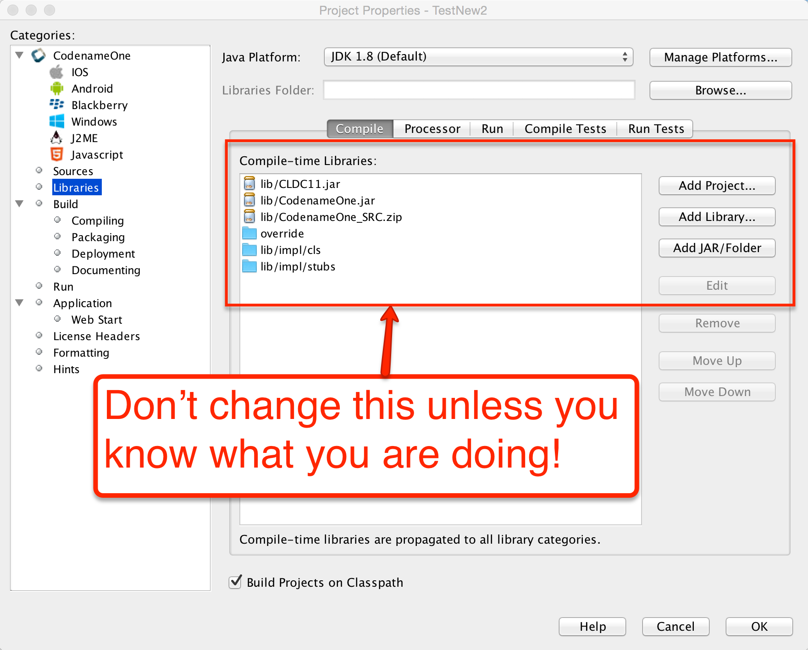

Cn1libs are Codename One's file format for 3rd party extensions. It's physically a zip file containing other zip files and some meta-data.

==== Why not use JAR

A jar can be compiled with usage of any Java API that might not be supported, it can be compiled with a Java target version that isn't tested.

Jars don't include support for writing native code; you could use JNI in jars but that doesn't match Codename One's needs for native support (see section above).

Jars don't support "proper" code completion, a common developer trick is to stick source code into the jar but that prevents usage with proprietary code. Cn1libs provide full IDE code completion (with JavaDoc hints) without exposing the sources.

There are two use cases for wanting JARs and they both have different solutions:

. Modularity
. Working with an existing JARs

Cn1lib’s address the modularity aspect allowing you to break that down. Existing jars can sometimes be used native code settings but you would want to adapt the code to abide by Codename One restrictions.

==== How to use cn1libs

Codename One has a large repository of https://www.codenameone.com/cn1libs.html[3rd party cn1libs]. With the Maven build tool, you consume a cn1lib the same way you consume any other Maven dependency: by adding it to the `<dependencies>` section of your application's `common/pom.xml` file. A typical entry looks like:

[source,xml]
----
include::../demos/common/src/main/snippets/developer-guide/advanced-topics-under-the-hood.xml[tag=advanced-topics-under-the-hood-xml-005,indent=0]
----

Add the dependency *before* the `<!-- INJECT DEPENDENCIES -->` comment in `common/pom.xml`. The `-lib` suffix on the `artifactId` and the `<type>pom</type>` declaration are both important - they tell Maven to pull in the library's "lib" aggregator module rather than a plain jar. See <<creating-cn1libs>> for the full library-consumption guide.

TIP: Some cn1libs require additional configuration such as build hints. Always read the library author's instructions when integrating a 3rd party library.

.Legacy Ant projects
****
If you're still maintaining an Ant-based project, you can install a cn1lib by dropping its `.cn1lib` file into the project's `lib` directory and then right-clicking the project and selecting #Codename One# -> #Refresh cn1lib files# (which invokes the `refresh-libs` Ant task). This unpacks classes and stub sources into `lib/impl/cls` and `lib/impl/stubs`, and native sources into `lib/impl/native`. New projects should use Maven instead - see <<maven-project-workflow>>.
****

==== Creating a simple cn1lib

Codename One libraries are generated from the `cn1lib-archetype` Maven archetype, which creates a multi-module project containing a `common` module for your cross-platform Java sources and one module per native platform (iOS, Android, Java SE, JavaScript) for any native interfaces. The detailed walkthrough - command-line, IntelliJ IDEA, NetBeans, and Eclipse - lives in <<creating-cn1libs>>.

The quickest path from a shell:

[source,bash]
----
include::../demos/common/src/main/snippets/developer-guide/advanced-topics-under-the-hood.sh[tag=advanced-topics-under-the-hood-bash-001,indent=0]
----

Once the project is generated, add your cross-platform Java sources under `common/src/main/java`, CSS under `common/src/main/css`, and run `mvn install` from the project root to build. The build produces both a Maven artifact for pom-style consumption and a legacy `.cn1lib` file in `common/target` for users still on Ant.

==== Build hints in cn1libs

Some cn1libs are pretty simple to install - just add them as a Maven dependency in `common/pom.xml`. For example, many of the more elaborate cn1libs need some pretty complex configurations. This is the case when native code is involved where you need to add permissions or plist entries for the various native platforms to get everything to work. This makes the cn1lib's helpful but less than seamless which is where you want to go.

Codename One cn1libs include two files that can be placed into the root: `codenameone_library_required.properties` & `codenameone_library_appended.properties`.

In these files you can write a build hint as `codename1.arg.ios.plistInject=...` for the various hints.

TIP: Notice the usage of the properties syntax for the build hint with the `codename1.arg` prefix you would also need to escape reserved characters for properties files. +
The best way to discover the right syntax for such build hints is to set them through the build hints GUI in a regular project and copy/paste them from `codenameone_settings.properties` into the cn1lib file.

The obvious question is why do you need two files?

There are two types of build hints: required and appended.

Required build hints can be something like `ios.objC=true`
which you want to always work. For example: if a cn1lib defines `ios.objC=true` and another cn1lib defines `ios.objC=false`
things won't work since one cn1lib won't get what it needs... +
In this case you'd want the build to fail so you can remove the faulty cn1lib.

NOTE: If two cn1libs define `ios.objC=true` there will be no collision as the value would be identical

An appended property would be something like `ios.plistInject=<key>UIBackgroundModes</key><array><string>audio</string> </array>`

Notice that this can still collide for example: if a different cn1lib defines its own background mode. For example, there are many valid cases where `ios.plistInject` can be used for other things. In this case you will append the content of the `ios.plistInject` into the build hint if it isn't already there.

Keep these things in mind:

- Properties are merged with every "refresh libs" call not dynamically on the server. This means it should be pretty simple
for the developer to investigate issues in this process.

- Changing flags is problematic - there is no "uninstall" process. Since the data is copied into the
`codenameone_settings.properties` file. If you need to change a flag later on you might need to alert users to make changes to their properties essentially negating the value of this feature... +
be careful when adding properties here.

It's your responsibility as a library developer to decide which build hint goes into which file! +
Codename One can't automate this process as the whole process of build hints is by definition an ad hoc process.

The rule of thumb is that a build hint with a numeric or boolean value is always a required property. If an entry has a string that you can append with another string then its probably an appended entry.

These build hints are probably of the "required" type:

[source,properties]
----
include::../demos/common/src/main/snippets/developer-guide/advanced-topics-under-the-hood.properties[tag=advanced-topics-under-the-hood-properties-001,indent=0]
----

These build hints should probably be appended:

[source,properties]
----
include::../demos/common/src/main/snippets/developer-guide/advanced-topics-under-the-hood.properties[tag=advanced-topics-under-the-hood-properties-002,indent=0]
----

.cn1lib Structure/File Format
****
The cb1lib file format is quite simple, it's a zip file containing zip files within it with fixed names to support the various features.

The table below covers the files that can/should be a part of a cn1lib file:

.cn1lib structure
[cols="<2,^1,<3",options="header"]
|====
<| File Name
<| Required
<| Purpose
| main.zip             | &#10003; | Contains the bytecode and the library binary data. This is effectively the portable portion of the jar
| stubs.zip            | &#10003; | Stub source files (autogenerated) containing javadocs to provide code completion
| manifest.properties  | &#215;   | General properties of the library, this isn't used for much at the moment
| codenameone_ library_ appended.properties  | &#215;   | Discussed above
| codenameone_ library_ required.properties  | &#215;   | Discussed above
| nativeios.zip        | &#215;   | Native iOS sources if applicable
| nativeand.zip        | &#215;   | Native Android sources if applicable
| nativejavascript.zip | &#215;   | Native JavaScript sources if applicable
| nativese.zip         | &#215;   | Native Java SE sources if applicable
| nativewin.zip        | &#215;   | Native Windows sources if applicable
// vale-skip: Microsoft.FirstPerson: "ME" in "Java ME" is the Java Micro Edition platform abbreviation, not a first-person pronoun.
| nativeme.zip         | &#215;   | Native Java ME sources if applicable
|====

****

=== Integrating Android 3rd party libraries & JNI

While its pretty easy to use native interfaces to write Android native code some things aren't necessarily as
obvious. For example: if you want to integrate a 3rd party library, specifically one that includes native C JNI code this
process isn't as straightforward.

If you need to integrate such a library into your native calls you have the following options:

. The first option (and the easiest one) is to place a Jar file in the native/android directory. This will link
your binary with the jar file. Just place the jar under the native/android and the build server will pick it up and will
add it to the classpath. +
Notice that Android release apps are obfuscated by default which might cause issues with such libraries if they
reference APIs that are unavailable on Android. You can work around this by adding a build hint to the proguard
obfuscation code that blocs the obfuscation of the problematic classes using the build hint: +
`android.proguardKeep=-keep class com.mypackage.ProblemClass { *; }``

. Another option is the `aar` file is a binary format Google introduced to represent an Android Library project (similarly to the cn1lib format). One of the problem with the Android Library projects was the fact that it required the project sources which made it difficult for 3rd party vendors to publish libraries. +
As a result so android introduced the `aar` file which is a binary format that represents a Library project. To learn more about arr you can read link:https://developer.android.com/studio/projects/android-library.html#aar-contents[this]. +
+
You can link an `aar` file by placing it under the native/android and the build server will link it to the project.

. Another *obsolete approach* exists that you're mentioning for legacy purposes (for example: if you need to port code written with this legacy option). This predated the `aar` option from Google... Not all 3rd party tools can be packaged as a simple jar, some 3rd party tools need to declare activities add permissions, resources, assets, and/or even add native code (`.so` files). +
To link a Library project to your Codename One project open the Library project in Eclipse or Android Studio and make sure the project builds, after the project was built successfully remove the bin directory from the project and zip the whole project. +
+
Rename the extension from `.zip` to `.andlib` and place the andlib file under the `native/android` directory. The build server will pick it up and will link it to the project.

=== Drag & drop

Unlike other platforms that tried to create overly generic catch all APIs Codename One tried to make things as simple as possible.

In Codename One components can be dragged and drop targets are always components. The logic of actually performing the operation indicated by the drop is the responsibility of the person implementing the drop.

NOTE: Some platforms for example: AWT allow dragging abstract concepts such as mime type elements. This allows dragging things like a text file into the app, but that use case isn't realistic in mobile

The code below allows you to rearrange the items based on a sensible order. Notice it relies on the default `Container` drop behavior:

[source,java]
----
include::../demos/common/src/main/java/com/codenameone/developerguide/advancedtopics/RearrangeableItemsDemo.java[tag=rearrangeableItems,indent=0]
----

.Drag demo

To enable dragging a component it must be flagged as draggable using `setDraggable(true)`, to allow dropping the component onto another component you must first enable the drop target with `setDropTarget(true)` and override some methods (more on that later).

When dragging on top of a child component of a drop target the code recursively searches for a drop target parent. Dropping a component on the child will automatically find the right drop target, hence there is no need to make "everything" into a drop target.

You can override these methods in the draggable components:

* `getDragImage` - this generates an image preview of the component that will be dragged. This automatically generates a sensible default so you don't need to override it.

* `drawDraggedImage` - this method will be invoked to draw the dragged image at a given location, it might be useful to override it if you want to display some drag related information such as an icon based on location etc. (for example: a move/copy icon).

In the drop target you can override the following methods:

* `draggingOver` - returns true if a drop operation at this point is permitted. Otherwise releasing the component will have no effect.

* `dragEnter/Exit` - useful to track and cleanup state related to dragging over a specific component.

* `drop` - the logic for dropping/moving the component must be implemented here!

=== Android Lollipop ActionBar customization

When running on Android Lollipop (5.0 or newer) the native action bar will use the Lollipop design. This isn't applicable
if you use the https://www.codenameone.com/javadoc/com/codename1/ui/Toolbar.html[Toolbar] or https://www.codenameone.com/javadoc/com/codename1/ui/SideMenuBar.html[SideMenuBar] this will be used in the task switcher.

To customize the colors of the native `ActionBar` on Lollipop define a `colors.xml` file in the `native/android` directory
of your project. It should look like this:

[source,xml]
----
include::../demos/common/src/main/snippets/developer-guide/advanced-topics-under-the-hood.xml[tag=advanced-topics-under-the-hood-xml-006,indent=0]
----

=== Intercepting URLs on iOS & Android

A common trick in mobile application development, is communication between two unrelated applications.

In Android you can use intents which are pretty elaborate and can be used through `Display.execute`, but what if you would like to expose the functionality of your application to a different application running on the device. This would allow that application to launch your application.

This isn't something built into Codename One, but it does expose enough of the platform capabilities to enable that functionality rather on Android.

On Android you need to define an intent filter which you can do using the `android.xintent_filter` build hint, this accepts the XML to filter whether a request is relevant to your application:

[source,xml]
----
include::../demos/common/src/main/snippets/developer-guide/advanced-topics-under-the-hood.xml[tag=advanced-topics-under-the-hood-xml-007,indent=0]
----

You can read more about it in link:http://stackoverflow.com/questions/11421048/android-ios-custom-uri-protocol-handling[this stack overflow question].

To bind the `myapp://` URL to your application. As a result typing `myapp://x` into the Android browser will launch the application.

==== Passing launch arguments to the app

You can access the value of the URL that launched the app using:

[source,java]
----
include::../demos/common/src/main/java/com/codenameone/developerguide/advancedtopics/RearrangeableItemsDemo.java[tag=rearrangeableItems,indent=0]
----

This value would be null if the app was launched through the icon.

==== Android App-to-App contracts (Wallet/Issuer style flows)

Some integrations (wallet provisioning, issuer verification, secure step-up) need more than a URL launch. They require:

- a custom Android intent action,
- caller validation,
- asynchronous app logic (login/back end verification),
- a native `setResult(...)` response back to the caller.

In Codename One, keep this flow in two layers:

. *Android bridge activity* for contract lifecycle and `setResult(...)`.
. *Codename One app code* for business logic in `start()`.

===== Why this isn't implicitly generated by AndroidGradleBuilder

A generic bridge can't infer:

- expected caller package(s),
- required result extra names,
- approval/decline mapping rules,
- timeout/failure policy.

Those are contract-specific, so the bridge activity is intentionally app-defined.

===== Registering the bridge activity

Use `android.xapplication` to inject a dedicated bridge activity and bind the action it should receive:

[source,properties]
----
include::../demos/common/src/main/snippets/developer-guide/advanced-topics-under-the-hood.properties[tag=advanced-topics-under-the-hood-properties-003,indent=0]
----

Keep `codename1.arg.android.activity.launchMode=singleTask` on your main CN1 activity so app resume behavior is predictable.

===== Bridge activity responsibilities

A minimal bridge activity should:

. Receive and parse the incoming intent.
. Capture caller identity using `getCallingPackage()`.
. Launch or resume the CN1 app activity.
. Hold contract state until CN1 completes verification.
. Return `setResult(...)` and `finish()`.

IMPORTANT: For payment/wallet trust decisions, treat only `getCallingPackage()` as verified identity.
Don't rely on referrer extras for caller authentication because callers can spoof those values.
This implies the contract should be launched with `startActivityForResult(...)` so caller identity is available.

[sidebar]
.Wallet Contract Security Guidelines
****
Use this checklist when the integration can activate payment credentials or accounts:

. **Fail closed on missing verified caller**. If `android.intent.caller` is empty (or `android.intent.caller.verified` isn't `true`), reject the request and return a failure/cancel result. +
  _Where_: CN1 `start()` guard before any business logic.
. **Use an allow-list** of trusted caller package names and reject everything else. +
  _Where_: CN1 `start()` (or native bridge) before network calls.
. **Verify signing certificate fingerprints natively** for each allowed package. Package name checks alone aren't enough in high-trust wallet scenarios. +
  _Where_: native Android code (bridge activity/native interface), because this requires Android `PackageManager` APIs.
. **Check payload freshness** (nonce/timestamp/challenge) before approving. +
  _Where_: back end/API service as the source of truth.
. **Bind response to request** (request ID / correlation ID) and reject mismatched or replayed responses. +
  _Where_: back end first, then enforce in CN1/native completion flow.
. **Time-box bridge activity state** and fail closed on timeout, process death, or missing bridge instance. +
  _Where_: native Android bridge + CN1 timeout handling.
. **Audit log** caller package, request ID, decision, and failure reason (without storing full PAN/token data). +
  _Where_: back end and security telemetry pipeline.
****

Optional native Android example for certificate fingerprint verification (called from bridge/native layer before trusting caller):

[source,java]
----
include::../demos/android/src/main/java/com/example/wallet/WalletBridgeSecurity.java[tag=walletTrustedCallerSignature,indent=0]
----

[source,java]
----
include::../demos/android/src/main/java/com/example/wallet/WalletBridgeActivity.java[tag=walletBridgeActivity,indent=0]
----

===== Reading contract data in `start()`

Codename One exposes launch metadata through `AppArg` and `Display` properties. Read these in `start()`:

- `AppArg` (primary launch payload)
- `android.intent.action`
- `android.intent.data`
- `android.intent.type`
- `android.intent.caller`
- `android.intent.caller.verified`
- `android.intent.extra.<KEY>`

[source,java]
----
include::../demos/android/src/main/java/com/example/wallet/WalletLaunchHandlerSnippet.java[tag=walletLaunchStart,indent=0]
----

===== Returning results to the wallet API

Implement a small native interface method (Android implementation) that:

. gets `WalletBridgeActivity.getActive()`,
. verifies `getActive()` is non-null and fails closed if the bridge timed out/canceled,
. builds caller-specific result extras,
. calls `setResult(Activity.RESULT_OK, resultIntent)`,
. calls `finish()` on the bridge activity.

This is where you bind to the wallet contract's exact response schema. Keep these extra names in one place so upgrades are manageable.

===== Foreground behavior on Android 14/15

Foreground transitions are best-effort because Android may block background launches in some states. Build for:

- immediate resume when allowed,
- notification fallback when blocked.

iOS is practically identical to Android with some small caveats, iOS's equivalent of the manifest is the plist.

You can inject more data into the plist by using the `ios.plistInject` build hint.

The equivalent on the iOS side would be:

[source,xml]
----
include::../demos/common/src/main/snippets/developer-guide/advanced-topics-under-the-hood.xml[tag=advanced-topics-under-the-hood-xml-008,indent=0]
----

For example, that can conflict with the Facebook integration if you use `FacebookConnect` which needs access to the schemes. To work around this you can use the build hint `ios.urlScheme` for example:

[source,xml]
----
include::../demos/common/src/main/snippets/developer-guide/advanced-topics-under-the-hood.xml[tag=advanced-topics-under-the-hood-xml-009,indent=0]
----

[[native-peer-components]]
=== Native peer components

Many Codename One developers don't truly grasp the reason for the separation between peer (native) components and Codename One components. This is a crucial thing you need to understand if you plan on working with native widgets for example: Web Browser, native maps, text input, media and native interfaces (which can return a `PeerComponent`).

Codename One draws all its widgets on its own, this is a concept which was modeled in part after Swing. This
allows functionality that can't be achieved in native widget platforms:

. The Codename One GUI builder & simulator are almost identical to the device - notice that this also enables the build cloud, otherwise device specific bugs would overwhelm development and make the build cloud redundant.

. Ability to override everything - paint, pointer, key events are all overridable and replaceable. Developers can also paint
over everything for example: glasspane and layered pane.

. Consistency - provides identical functionality on all platforms.

This all contributes to your ease of working with Codename One and maintaining Codename One. More than 95%
of Codename One's code is in Java hence its portable and pretty easy to maintain!

==== Why does Codename One need native widgets at all

You need the native device to do input, html rendering etc. These are too big and too complex tasks for Codename One to
do from scratch.

They're sometimes impossible to perform without the native platform. For example: the virtual keyboard input on the devices is tied directly to the native text input. It's impractical to implement everything from scratch for all languages, dictionaries etc. The result would be sub-par.

A web browser can't be implemented in this age without a JavaScript JIT and including a JIT within an iOS app is prohibited by Apple.

==== Problems with native widgets

Codename One does pretty much everything on the EDT (Event Dispatch Thread), this provides a lot of cool features
for example: modal dialogs, invokeAndBlock etc.

For example native widgets have to be drawn on the devices native UI thread. +
This means that drawing looks something like this:

. Loop over all Codename One components and paint them.

. Loop over all native peer components and paint them.

This means that all peer components are drawn on top of the Codename One components.

NOTE: This was also the case in AWT/Swing to one degree or another...

==== Showing dialogs on top of peer components

Codename One grabs a screenshot of the peer, hide it and then you can show the screenshot. Since the screenshot is static it can be rendered through the standard UI. You can't do that always since grabbing a screenshot is an expensive process on all platforms and must be performed on the native device thread.

==== Why can't you combine peer component scrolling and Codename One scrolling

Since the form title/footer etc. Are drawn by Codename One the peer component might paint itself on top of them.
Clipping a peer component is often pretty difficult. Furthermore, if the user drags his finger within the peer
component he might trigger the native scroll within the might collide with your scrolling?

==== Native components in the first Form

Another problem might be counterintuitive. iOS has screenshot images representing the first form. If your first page is an HTML or a native map (or other peer widget) the screenshot process on the build server will show fallback code instead of the real thing thus providing sub-par behavior.

Its impractical to support something like HTML for the screenshot process since it would also look different from the web component running on the device.

// HTML_ONLY_START
TIP: You can read more about the screenshot process https://www.codenameone.com/manual/appendix-ios.html#section-ios-screenshots[here].
// HTML_ONLY_END
////
//PDF_ONLY
TIP: You can read more about the screenshot process <<section-ios-screenshots, here>>.
////

=== Integrating 3rd party native SDKs

The following is a description of the procedure that was used to create the
http://shannah.github.io/cn1-freshdesk/[Codename One FreshDesk library]. This process can be adapted
to wrap any native SDK on Android and iOS.

==== Step 1 : Review the FreshDesk SDKs

Before you begin, you will need to review the Android and iOS SDKs.

. *FreshDesk Android SDK*: http://developer.freshdesk.com/mobihelp/android/integration_guide/[Integration Guide] | http://developer.freshdesk.com/mobihelp/android/api/reference/com/freshdesk/mobihelp/package-summary.html[API Docs]
. *FreshDesk iOS SDK*: http://developer.freshdesk.com/mobihelp/ios/integration_guide/[Integration Guide] | http://developer.freshdesk.com/mobihelp/ios/api/[API Docs]

In reviewing the SDKs, you're looking for answers to two questions:

. What should your Codename One FreshDesk API look like?
. What will be involved in integrating the native SDK in your app or lib?

==== Step 2: Designing the Codename One public API

When designing the Codename One API, you should begin by looking at the
http://developer.freshdesk.com/mobihelp/android/api/reference/com/freshdesk/mobihelp/package-summary.html[Javadocs]
for the native Android SDK. If the class hierarchy doesn't look too elaborate, you may decide to model your Codename One
public API on the Android API. But, if you need a small part of the SDK's functionality,
you may choose to create your abstractions around the functionality that you need.

For the FreshDesk SDK, it looks like most of the functionality is handled by one central class `Mobihelp`,
with a few other POJO classes for passing data to and from the service. This is a good candidate for a comprehensive
Codename One API.

Before proceeding, you also need to look at the iOS API to see if there are any features that aren't included.
While naming conventions in the iOS API are a little different than those in the Android API, it looks like they're
functionally the same.

The chosen approach therefore creates a class hierarchy and API that mirrors the Android SDK.

==== Step 3: The architecture and internal APIs

A Codename One library that wraps a native SDK, will consist of the following:

1. *Public Java API*, consisting of pure Java classes that are intended to be used by the outside world.
2. *Native Interface(s)*. The Native Interface(s) act as a conduit for the public Java API to communicate to the
native SDK. Parameters in native interface methods are limited to primitive types, arrays of primitive types, and
Strings, as are return values.
3. *Native code*. Each platform must include an implementation of the Native Interface(s). These implementations
are written in the native language of the platform (for example: Java for Android, and Objective-C for iOS).
4. *Native dependencies*. Any 3rd party libraries required for the native code to work, need to be included for
each platform. On android, this may mean bundling.jar files,.aar files, or.andlib files. On iOS, this may mean
bundling `.h` files, `.a` files, `.framework`, and `.bundle` files.
5. *Build hints*. Some libraries will require you to add some extra build hints to your project. For example: On Android you
may need to add permissions to the manifest, or define services in the `<Application>` section of the manifest.
On iOS, this may mean specifying more core frameworks for inclusion, or adding build flags for compilation.

The following diagram shows the dependencies in a native library:

[[fc8a77d2-61e0-11e5-9ecf-bf381d4ac966]]
.Relationship between native & Codename One API UML Diagram
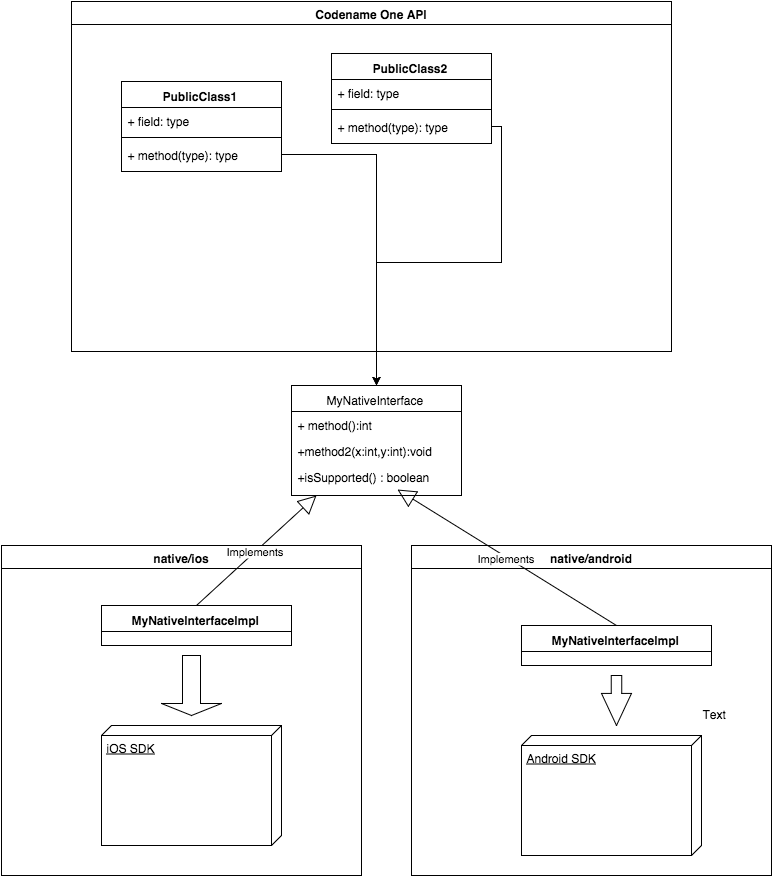

In the specific case of your FreshDesk API, the public API and classes will look like:

[[a5fe88406-61e4-11e5-951e-e09bd28a93c9]]
.Freshdesk API Integration
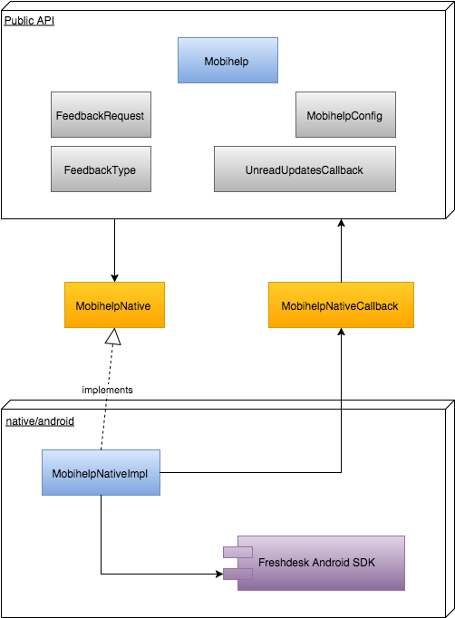

===== Things to notice

1. The public API consists of the main class (https://github.com/shannah/cn1-freshdesk/blob/master/cn1-freshdesk-demo/src/com/codename1/freshdesk/Mobihelp.java[`Mobihelp`]), and a few supporting classes (https://github.com/shannah/cn1-freshdesk/blob/master/cn1-freshdesk-demo/src/com/codename1/freshdesk/FeedbackRequest.java[`FeedbackRequest`], https://github.com/shannah/cn1-freshdesk/blob/master/cn1-freshdesk-demo/src/com/codename1/freshdesk/FeedbackType.java[`FeedbackType`], https://github.com/shannah/cn1-freshdesk/blob/master/cn1-freshdesk-demo/src/com/codename1/freshdesk/MobihelpConfig.java[`MobihelpConfig`], https://github.com/shannah/cn1-freshdesk/blob/master/cn1-freshdesk-demo/src/com/codename1/freshdesk/MobihelpCallbackStatus.java[`MobihelpCallbackStatus`]), which were copied almost directly from the Android SDK.
2. The way for the public API to communicate with the native SDK is through the https://github.com/shannah/cn1-freshdesk/blob/master/cn1-freshdesk-demo/src/com/codename1/freshdesk/MobihelpNative.java[`MobihelpNative`] interface.
3. You introduced the https://github.com/shannah/cn1-freshdesk/blob/master/cn1-freshdesk-demo/src/com/codename1/freshdesk/MobihelpNativeCallback.java[`MobihelpNativeCallback`] class to ease native code calling back into the public API. This was necessary for a few methods that used asynchronous callbacks.

==== Step 4: Implement the public API and native interface

You've already looked at the final product of the public API in the previous step. Back up and walk through the process step-by-step.

The goal is to model your API around the Android API. The central class that includes all the functionality of the SDK is the http://developer.freshdesk.com/mobihelp/android/api/reference/com/freshdesk/mobihelp/Mobihelp.html[com.freshdesk.mobihelp.Mobihelp class], so you begin there.

You will start by creating your own package (`com.codename1.freshdesk`) and your own `Mobihelp` class inside it.

===== Adapting method signatures

====== The `Context` parameter

In a first glance at the http://developer.freshdesk.com/mobihelp/android/api/reference/com/freshdesk/mobihelp/Mobihelp.html[com.freshdesk.mobihelp.Mobihelp API] you see that many of the methods take a parameter of type http://developer.android.com/reference/android/content/Context.html[`android.content.Context`]. This class is part of the core Android SDK, and won't be accessible to any pure Codename One APIs. Your public API therefore can't include any such references. You will be able to access a suitable context in the native layer, so you will omit this parameter from your public API, and inject them in your native implementation.

Hence, the method signature `public static final void setUserFullName (Context context, String name)` will become `public static final void setUserFullName (String name)` in your public API.

====== Non-Primitive parameters

Although your public API isn't constrained by the same rules as your Native Interfaces about parameter and return types, you need to be cognizant of the fact that parameters you pass to your public API will be funnelled through your native interface. You should pay attention to any parameters or return types that can't be passed directly to a native interface, and start forming a strategy for them. For example: consider the following method signature from the Android `Mobihelp` class:

----
public static final void showSolutions (Context activityContext, ArrayList<String> tags)
----

You've already decided to omit the `Context` parameter in your API, so that's a non-issue. However, what about the `ArrayList<String>` tags parameter? Passing this to your public API is no problem, but when you implement the public API, how will you pass this `ArrayList` to your native interface, since native interfaces don't allow you to arrays of strings as parameters?

One of three strategies applies in such cases:

. Encode the parameter as either a single `String` (for example: using JSON or some other parseable format) or a byte[] array (in some known format that can be parsed in native code).
. Store the parameter on the Codename One side and pass some ID or token that can be used on the native side to retrieve the value.
. If the data structure can be expressed as a finite number of primitive values, then design the native interface method to take the individual values as parameters instead of a single object. For example: If there is a https://www.codenameone.com/javadoc/com/codename1/facebook/User.html[User] class with properties `name` and `phoneNumber`, the native interface can have `name` and `phoneNumber parameters rather than a single `user` parameter.

In this case, because an array of strings is such a simple data structure, the right approach is a variation on strategy number 1: Merge the array into a single string with a delimiter.

In any case, you don't have to come up with the specifics right now, as you're still on the public API, but it will pay dividends later if you think this through ahead of time.

===== Callbacks

It's often the case that native code needs to call back into Codename One code when an event occurs. This may be connected directly to an API method call (for example: as the result of an asynchronous method invocation), or due to something initiated by the operating system or the native SDK on its own (for example: a push notification, a location event, etc.).

Native code will have access to both the Codename One API and any native APIs in your app, but on some platforms, accessing the Codename One API may be a little tricky. For example: on iOS you'll be calling from Objective-C back into Java which requires knowledge of Codename One's java-to-goal C conversion process. In general, the easiest way to ease callbacks is to provide abstractions that involve static Java methods (in Codename One space) that accept and return primitive types.

For your `Mobihelp` class, the following method hints at the need to have a "callback plan":

----
public static final void getUnreadCountAsync (Context context, UnreadUpdatesCallback callback)
----

The interface definition for `UnreadUpdatesCallback` is:

[source,java]
----
include::../demos/common/src/main/java/com/codenameone/support/mobihelp/UnreadUpdatesCallback.java[tag=unreadUpdatesCallback,indent=0]
----

The callback status enum is also mirrored in common code:

[source,java]
----
include::../demos/common/src/main/java/com/codenameone/support/mobihelp/MobihelpCallbackStatus.java[tag=mobihelpCallbackStatus,indent=0]
----

In other words: if you were to implement this method (planned for a later section), you need to have a way for the native code to call the `callback.onResult()` method of the passed parameter.

You've two issues that will need to be solved here:

1. How to pass the `callback` object through the native interface.
2. How to *call* the `callback.onResult()` method from native code at the right time.

For the first issue, you will use strategy #2 that you mentioned earlier: (Store the parameter on the Codename One side and pass some ID or token that can be used on the native side to retrieve the value).

For the second issue, you will create a static method that can take the token generated to solve the first issue, and call the stored `callback` object's `onResult()` method. You abstract both sides of this process using the https://github.com/shannah/cn1-freshdesk/blob/master/cn1-freshdesk-demo/src/com/codename1/freshdesk/MobihelpNativeCallback.java[`MobihelpNativeCallback` class]:

[source,java]
----
include::../demos/common/src/main/java/com/codenameone/support/mobihelp/MobihelpNativeCallback.java[tag=mobihelpNativeCallback,indent=0]
----

*Things to notice here:*

1. This class uses a static `Map<Integer,UnreadUpdatesCallback>` member to keep track of all callbacks, mapping a unique integer ID to each callback.
2. The `registerUnreadUpdatesCallback()` method takes an `UnreadUpdatesCallback` object, places it in the `callbacks` map, and returns the integer *token* that can be used to fire the callback later. This method would be called by the public API inside the `getUnreadCountAsync()` method implementation to convert the `callback` into an integer, which can then be passed to the native API.
3. The `fireUnreadUpdatesCallback()` method would be called later from native code. Its first parameter is the token for the callback to call.
4. You wrap the `onResult()` call inside a `Display.callSerially()` invocation to ensure that the callback is called on the EDT. This is a general convention that's used throughout Codename One, and you'd be well-advised to follow it. *Event handlers* should be run on the EDT unless there is a good reason not to - and in that case your documentation and naming conventions should make this clear to avoid stepping into multithreading hell!

===== Initialization

Most Native SDKs include some sort of initialization method where you pass your developer and application credentials to the API. After filling in FreshDesk's web-based form to create a new application, it generated an application ID, an app "secret," and a "domain." The SDK requires you to pass all three of these values to its `init()` method through the `MobihelpConfig` class.

[source,java]
----
include::../demos/common/src/main/java/com/codenameone/support/mobihelp/MobihelpConfig.java[tag=mobihelpConfig,indent=0]
----

Note, but, that FreshDesk (and most other service provides that have native SDKs) requires you to create different Apps for each platform. This means that your App ID and App secret will be different on iOS than they will be on Android.

Your public API therefore needs to enable you to provide many credentials in the same app, and your API needs to know to use the correct credentials depending on the device that the app is running on.

Many solutions to this problem exist, but the chosen approach provides two different `init()` methods:

[source,java]
----
include::../demos/common/src/main/java/com/codenameone/support/mobihelp/Mobihelp.java[tag=mobihelpInitAndroid,indent=0]
----

and

[source,java]
----
include::../demos/common/src/main/java/com/codenameone/support/mobihelp/Mobihelp.java[tag=mobihelpInitIOS,indent=0]
----

Then you can set up the API with code like:

[source,java]
----
include::../demos/common/src/main/java/com/codenameone/support/mobihelp/MobihelpUsage.java[tag=mobihelpUsage,indent=0]
----

===== The resulting public API

[source,java]
----
include::../demos/common/src/main/java/com/codenameone/support/mobihelp/Mobihelp.java[tag=mobihelpClassOverview,indent=0]
----

===== The native interface

The final native interface is identical to your public API, except in cases where the public API included non-primitive parameters:

[source,java]
----
include::../demos/common/src/main/java/com/codenameone/support/mobihelp/MobihelpNative.java[tag=mobihelpNative,indent=0]
----

Notice also, that the native interface includes a set of methods with names prefixed with `config__`. This naming convention identifies methods that map to the `MobihelpConfig` class. A separate native interface for these would have been possible, but keeping all the native stuff in one class is simpler and easier to maintain.

===== Connecting the public API to the native interface

You've a public API, and you have a native interface. The idea is that the public API should be a thin wrapper around the native interface to smooth out rough edges that are likely to exist due to the strict set of rules involved in native interfaces. You will, so, use delegation inside the `Mobihelp` class to provide it a reference to an instance of `MobihelpNative`:

[source,java]
----
include::../demos/common/src/main/java/com/codenameone/support/mobihelp/Mobihelp.java[tag=mobihelpClassOverview,indent=0]
----

You will initialize this `peer` inside the `init()` method of the `Mobihelp` class. Notice, though that `init()` is `private` since you've provided distinct abstractions for the Android and iOS apps:

[source,java]
----
include::../demos/common/src/main/java/com/codenameone/support/mobihelp/Mobihelp.java[tag=mobihelpInitMethods,indent=0]
----

*Things to Notice*:

1. The `initAndroid()` and `initIOS()` methods include a check to see if they're running on the correct platform. They both call `init()`.
2. The `init()` method, uses the https://www.codenameone.com/javadoc/com/codename1/system/NativeLookup.html[NativeLookup] class to instantiate your native interface.

===== Implementing the glue between public API and native interface

For most of the methods in the `Mobihelp` class, you can see that the public API will be a thin wrapper around the native interface. For example: the public API implementation of `setUserFullName(String)` is:

[source,java]
----
include::../demos/common/src/main/java/com/codenameone/support/mobihelp/Mobihelp.java[tag=mobihelpSetUserFullNameMethod,indent=0]
----

For some other methods, the public API needs to break apart the parameters into a form that the native interface can accept. For example: the `init()` method, shown above, takes a `MobihelpConfig` object as a parameter, but it passed the properties of the `config` object individually into the native interface.

// vale-skip: Microsoft.Foreign: "i.e.," is the precise abbreviation here; "that is" would read awkwardly inside the parenthetical clause. LanguageTool requires the comma after "i.e.".
Another example, is the `showSupport(ArrayList<String> tags)` method. The corresponding native interface method that's wraps is `showSupport(String tags, `String` separator)` - i.e., it needs to merge all tags into a single delimited string, and pass then to the native interface along with the delimiter used. The implementation is:

[source,java]
----
include::../demos/common/src/main/java/com/codenameone/support/mobihelp/Mobihelp.java[tag=mobihelpShowSupportWithTags,indent=0]
----

The other non-trivial wrapper is the `getUnreadCountAsync()` method that you discussed before:

[source,java]
----
include::../demos/common/src/main/java/com/codenameone/support/mobihelp/Mobihelp.java[tag=mobihelpGetUnreadCountAsync,indent=0]
----

==== Step 5: Implementing the native interface in Android

Now that you've set up your public API and your native interface, it's time to work on the native side of things. You can generate stubs for all platforms in your IDE (Netbeans in your case), by right clicking on the `MobihelpNative` class in the project explorer and selecting `Generate Native Access`.

[[c9d4b9cc-61f6-11e5-8b67-4691600188cd]]
.Generate Native Access Menu Item
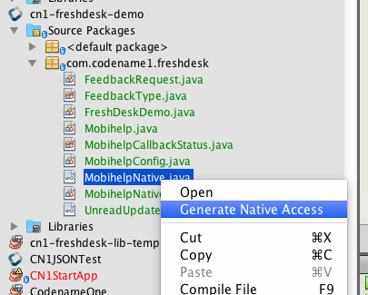

This will generate a separate directory for each platform inside your project's `native` directory:

[[eef6d078-61f6-11e5-91cd-2e1836916359]]
.Native generated sources directory view
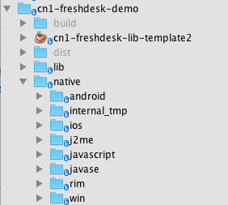

Inside the `android` directory, this generates a `com/codename1/freshdesk/MobihelpNativeImpl` class with stubs for each method.

Your implementation will be a thin wrapper around the native Android SDK. See the source https://github.com/shannah/cn1-freshdesk/blob/master/cn1-freshdesk-demo/native/android/com/codename1/freshdesk/MobihelpNativeImpl.java[here].

*Some highlights:*

1. `Context` : The native API requires you to pass a *context* object as a parameter on many methods. This should be the context for the current activity. It will allow the FreshDesk API to know where to return to after it has done its thing. Codename One provides a class called `AndroidNativeUtil` that allows you to retrieve the app's Activity (which includes the Context). You will wrap this with a convenience method in your class as follows:
+
[source,java]
----
include::../demos/common/src/main/java/com/codenameone/support/mobihelp/Mobihelp.java[tag=mobihelpGetUnreadCountAsync,indent=0]
----
+
This will enable you to wrap the freshdesk native API. For example:
+
[source,java]
----
include::../demos/android/src/main/java/com/codenameone/support/mobihelp/MobihelpNativeImpl.java[tag=mobihelpNativeContext,indent=0]
----
2. `runOnUiThread()` - Many of the calls to the FreshDesk API may have been made from the Codename One EDT. For example, Android has its own event dispatch thread that should be used for interacting with native Android UI. Any API calls that look like they start some sort of native Android UI process should therefore be wrapped inside Android's `runOnUiThread()` method which is like Codename One's `Display.callSerially()` method. For example: see the `showSolutions()` method:
+
[source,java]
----
include::../demos/android/src/main/java/com/codenameone/support/mobihelp/MobihelpNativeImpl.java[tag=mobihelpNativeShowSolutions,indent=0]
----
+
(Note here that the `activity()` method is another convenience method to retrieve the app's current `Activity` from the `AndroidNativeUtil` class).
3. *Callbacks*. You discussed, in detail, the mechanisms you put in place to enable your native code to perform callbacks into Codename One. You can see the native side of this by viewing the `getUnreadCountAsync()` method implementation:
+
[source,java]
----
include::../demos/android/src/main/java/com/codenameone/support/mobihelp/MobihelpNativeImpl.java[tag=mobihelpNativeGetUnreadCountAsync,indent=0]
----

==== Step 6: Bundling the native SDKs

The last step (at least on the Android side) is to bundle the FreshDesk SDK. For Android, there are a few different scenarios you'll run into for embedding SDKs:

. *The SDK includes Java classes* - NO XML UI files, assets, or resources that aren't included inside a simple.jar file. In this case, you can place the.jar file inside your project's `native/android` directory.
. *The SDK includes some XML UI files, resources, and assets.* In this case, the SDK is distributed as an Android project folder that can be imported into an Eclipse or Android studio workspace. In general, in this case, you would need to zip the entire directory and change the extension of the resulting.zip file to `.andlib`, and place this in your project's `native/android` directory.
. *The SDK is distributed as an `.aar` file* - In this case you can copy the `.aar` file into your `native/android` directory.

===== The FreshDesk SDK

The FreshDesk (aka Mobihelp) SDK is distributed as a project folder (that's: scenario 2 from the above list). Your procedure is therefore to download the SDK (https://s3.amazonaws.com/assets.mobihelp.freshpo.com/sdk/mobihelp_sdk_android.zip[download link]), and rename it from `mobihelp_sdk_android.zip` to `mobihelp_sdk_android.andlib`, and copy it into your `native/android` directory.

===== Dependencies

In this case there is a catch. The Mobihelp SDK includes a dependency:

> Mobihelp SDK depends on AppCompat-v7 (Revision 19.0+) Library. You will need to update project.properties to point to the Appcompat library.

If you look inside the `project.properties` file (inside the Mobihelp SDK directory--- that's: you'd need to extract it from the zip to view its contents), you'll see the dependency listed:

----
android.library.reference.1=../appcompat_v7
----

In other words, the Mobihelp SDK expects to find the `appcompat_v7` library located in the same parent directory as the Mobihelp SDK project. After a little bit of research (if you're not yet familiar with the Android AppCompat support library), you find that the `AppCompat_v7` library is part of the Android Support library, which can installed into your local Android SDK using Android SDK Manager. https://developer.android.com/tools/support-library/setup.html[Installation processed specified here].

After installing the support library, you need to retrieve it from your Android SDK. You can find that.aar file inside the `ANDROID_HOME/sdk/extras/android/m2repository/com/android/support/appcompat-v7/19.1.0/` directory (for version 19.1.0). The contents of that directory on your system are:

----
appcompat-v7-19.1.0.aar		appcompat-v7-19.1.0.pom
appcompat-v7-19.1.0.aar.md5	appcompat-v7-19.1.0.pom.md5
appcompat-v7-19.1.0.aar.sha1	appcompat-v7-19.1.0.pom.sha1
----

There are two files of interest here:

. appcompat-v7-19.1.0.aar - This is the actual library that you need to include in your project to meet the MobiSDK dependency.
. appcompat-v7-19.1.0.pom - This is the Maven XML file for the library. It will show you any dependencies that the appcompat library has. You will also need to include these dependencies:
+
----
  <dependencies>
    <dependency>
      <groupId>com.android.support</groupId>
      <artifactId>support-v4</artifactId>
      <version>19.1.0</version>
      <scope>compile</scope>
    </dependency>
  </dependencies>
----
+
In other words: you need to include the `support-v4` library version 19.1.0 in your project. This is also part of the Android Support library. If you back up a couple of directories to: `ANDROID_HOME/sdk/extras/android/m2repository/com/android/support`, you will see it listed there:
+
----
appcompat-v7			palette-v7
cardview-v7			recyclerview-v7
gridlayout-v7			support-annotations
leanback-v17			support-v13
mediarouter-v7			support-v4
multidex			test
multidex-instrumentation
----
+ And if you look inside the appropriate version directory of `support-v4` (in `ANDROID_HOME/sdk/extras/android/m2repository/com/android/support/support-v4/19.1.0`), you see:
+
----
support-v4-19.1.0-javadoc.jar		support-v4-19.1.0.jar
support-v4-19.1.0-javadoc.jar.md5	support-v4-19.1.0.jar.md5
support-v4-19.1.0-javadoc.jar.sha1	support-v4-19.1.0.jar.sha1
support-v4-19.1.0-sources.jar		support-v4-19.1.0.pom
support-v4-19.1.0-sources.jar.md5	support-v4-19.1.0.pom.md5
support-v4-19.1.0-sources.jar.sha1	support-v4-19.1.0.pom.sha1
----
+
Looks like this library is pure Java classes, so you need to include the `support-v4-19.1.0.jar` file into your project. Checking the `.pom` file you see that there are no more dependencies you need to add.

To summarize your findings, you need to include the following files in your `native/android` directory:

. appcompat-v7-19.1.0.aar
. support-v4-19.1.0.jar

And since your Mobihelp SDK lists the appcompat_v7 dependency path as "../appcompat_v7" in its project.properties file, you're going to rename `appcompat-v7-19.1.0.aar` to `appcompat_v7.aar`.

When all is said and done, your `native/android` directory should contain the following:

----
appcompat_v7.aar	mobihelp.andlib
com			support-v4-19.1.0.jar
----

==== Step 7: Injecting Android manifest and proguard config

The final step on the Android side is to inject necessary permissions and services into the project's AndroidManifest.xml file.

You can find the manifest file injections required by opening the `AndroidManifest.xml` file from the MobiHelp SDK project. Its contents are as follows:

[source,xml]
----
include::../demos/common/src/main/snippets/developer-guide/advanced-topics-under-the-hood.xml[tag=advanced-topics-under-the-hood-xml-010,indent=0]
----

You will need to add the `<uses-permission>` tags and all the contents of the `<application>` tag to your manifest file. Codename One provides the following build hints for these:

. `android.xpermissions` - For your `<uses-permission>` directives. Add a build hint with name `android.xpermissions`, and for the value, paste the actual `<uses-permission>` XML tag.
. `android.xapplication` - For the contents of your `<application>` tag.

===== Proguard config

For the release build, you will also need to inject some proguard configuration so that important classes don't get stripped out at build time. The FreshDesk SDK instructions state:

> If you use Proguard, please make sure you have the following included in your project's proguard-project.txt
>
> ----
> -keep class android.support.v4.** { *; }
> -keep class android.support.v7.** { *; }
> ----

Also, if you look at the `proguard-project.txt` file inside the Mobihelp SDK, you'll see the rules:

----
-keep public class * extends android.app.Service
-keep public class * extends android.content.BroadcastReceiver
-keep public class * extends android.app.Activity
-keep public class * extends android.preference.Preference
-keep public class com.freshdesk.mobihelp.exception.MobihelpComponentNotFoundException

-keepclassmembers class * implements android.os.Parcelable {
  public static final android.os.Parcelable$Creator *;
}
----

You will want to merge this and then paste them into the build hint `android.proguardKeep` of your project.

===== Troubleshooting Android stuff

If, after doing all this, your project fails to build, you can enable the "Include Source" option of the build server, then download the source project, open it in Eclipse or Android Studio, and debug from there.

=== Part 2: Implementing the iOS native code

Part 1 of this tutorial focused on the Android native integration. Now you will shift your focus to the iOS implementation.

After selecting "Generate Native Interfaces" for your "MobihelpNative" class, you'll find a `native/ios` directory in your project with the following files:

. https://github.com/shannah/cn1-freshdesk/blob/master/cn1-freshdesk-demo/native/ios/com_codename1_freshdesk_MobihelpNativeImpl.h[`com_codename1_freshdesk_MobihelpNativeImpl.h`]
. https://github.com/shannah/cn1-freshdesk/blob/master/cn1-freshdesk-demo/native/ios/com_codename1_freshdesk_MobihelpNativeImpl.m[`com_codename1_freshdesk_MobihelpNativeImpl.m`]

These files contain stub implementations corresponding to your `MobihelpNative` class.

You make use of the http://developer.freshdesk.com/mobihelp/ios/api/[API docs] to see how the native SDK needs to be wrapped. The method names aren't the same. For example: instead of a method `showFeedback()`, it has a message `-presentFeedback:`

You more-or-less follow the http://developer.freshdesk.com/mobihelp/ios/integration_guide/#getting-started[iOS integration guide] for wrapping the API. Some key points include:

. Remember to import the `Mobihelp.h` file in your header file:
+
[source]
----
include::../demos/ios/src/main/objectivec/com_codename1_freshdesk_MobihelpNativeImpl.m[tag=mobihelpImport,indent=0]
----
. Like your use of `runOnUiThread()` in Android, you will wrap all your API calls in either `dispatch_async()` or `dispatch_sync()` calls to ensure that you're interacting with the Mobihelp API on the app's main thread rather than the Codename One EDT.
. Some methods/messages in the Mobihelp SDK require you to pass a `UIViewController` as a parameter. In Codename One, the entire application uses a single UIViewController: `CodenameOne_GLViewController`. You can get a reference to this using the `[CodenameOne_GLViewController instance]` message. You need to import its header file:
+
----
include::../demos/ios/src/main/objectivec/com_codename1_freshdesk_MobihelpNativeImpl.m[tag=mobihelpControllerImport,indent=0]
----
+
As an example, look at the `showFeedback()` method:
+
----
include::../demos/ios/src/main/objectivec/com_codename1_freshdesk_MobihelpNativeImpl.m[tag=mobihelpShowFeedback,indent=0]
----

==== Using the MobihelpNativeCallback

You described earlier how you created a static method on the `MobihelpNativeCallback` class so that native code could fire a callback method. Now take a look at how this looks from the iOS side of the fence. Here is the implementation of `getUnreadCountAsync()`:

----
include::../demos/ios/src/main/objectivec/com_codename1_freshdesk_MobihelpNativeImpl.m[tag=mobihelpGetUnreadCountAsync,indent=0]
----

In your case the iOS SDK version of this method is `+unreadCountWithCompletion:` which takes a block (which is like an anonymous function) as a parameter.

The callback to your Codename One function occurs on this line:

----
com_codename1_freshdesk_MobihelpNativeCallback_fireUnreadUpdatesCallback___int_int_int(
    CN1_THREAD_GET_STATE_PASS_ARG param, 3 /*SUCCESS*/, count);
----

**Some things worth mentioning here:**

. The method name is the result of taking the FQN (`MobihelpNativeCallback.fireUpdateUnreadUpdatesCallback(int, int, int)` in the package `com.codename1.freshdesk`) and replacing all `.` characters with underscores, suffixing two underscores after the end of the method name, then appending `_int` once for each of the `int` arguments.
. You also need to import the header file for this class:
+
----
include::../demos/ios/src/main/objectivec/com_codename1_freshdesk_MobihelpNativeImpl.m[tag=mobihelpCallbackImport,indent=0]
----

==== Bundling native iOS SDK

Now that you've implemented your iOS native interface, you need to bundle the Mobihelp iOS SDK into your project. A few different scenarios you may face when looking to include a native SDK:

. The SDK includes `.bundle` resource files. In this case, copy the `.bundle` file(s) into your `native/ios` directory.
. The SDK includes `.h` header files. In this case, copy the `.h` file(s) into your `native/ios` directory.
. The SDK includes `.a` files. In this case, copy the `.a` file(s) into your `native/ios` directory.
. The SDK includes `.framework` files. In this case, you'll need to zip up the framework, and copy it into your `native/ios` directory. For example: If the framework is named, `MyFramework.framework`, then the zip file should be named MyFramework.framework.zip, and should be located at `native/ios/MyFramework.framework.zip`.

The FreshDesk SDK doesn't include any `.framework` files, so you don't need to worry about that last scenario. You https://s3.amazonaws.com/assets.mobihelp.freshpo.com/sdk/mobihelp_sdk_ios.zip[download the iOS SDK], copy the `libFDMobihelpSDK.a`, `Mobihelp.h`. `MHModel.bundle`, `MHResources.bundle`, and `MHLocalization/en.proj/MHLocalizable.strings` into `native/ios`.

==== Troubleshooting iOS

If you run into problems with the build, you can select "Include Sources" in the build server to download the resulting Xcode Project. You can then debug the Xcode project locally, make changes to your iOS native implementation files, and copy them back into your project once it's building.

==== Adding required core libraries and frameworks

The iOS integration guide for the FreshDesk SDK lists the following core frameworks as dependencies:

[[IOSlinkoptions]]
.IOS link options
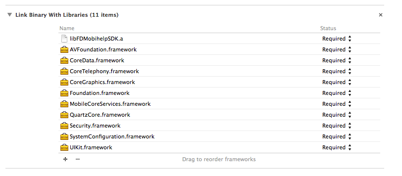

You can add these dependencies to your project using the `ios.add_libs` build hint. For example:

[[a65e31df8-620c-11e5-87ff-6b926a3f2090]]
.iOS's "add libs" build hint

In short: you list the framework names separated by semicolons. Notice that your list in the above image doesn't include all the frameworks that they list because many of the frameworks are already included by default (I obtained the default list by building the project with "include sources" checked, then looked at the frameworks that were included).

=== Part 3 : Packaging as a cn1lib

During the initial development, you find it easier to use a regular Codename One application project so that you can run and test as you go. However, once it's stabilized and you want to distribute the library to other developers, transfer it over to a Codename One library project. This general process involves:

. Generate a Maven cn1lib project using the `cn1lib-archetype` (see <<creating-cn1libs>>).
. Copy the Java files from your original application project into the new library project's `common/src/main/java` directory.
. Copy any native source directories from your original project into the matching platform module (`ios/src/main/objectivec`, `android/src/main/java`, etc.).
. Copy the *relevant* build hints from the original project's `codenameone_settings.properties` file into the library project's `common/codenameone_library_appended.properties` file.

For the FreshDesk.cn1lib, the original project's build script was modified to generate and build a library project automatically. However, that's beyond the scope of this tutorial.

=== Building your own Layout manager

A https://www.codenameone.com/javadoc/com/codename1/ui/layouts/Layout.html[Layout] contains all the logic for positioning Codename One components. It essentially traverses a Codename One https://www.codenameone.com/javadoc/com/codename1/ui/Container.html[Container] and positions components based on internal logic.

When you build the layout you need to take margin into consideration and make sure to add it into the position/size calculations. Building a layout manager involves two simple methods: `layoutContainer` & `getPreferredSize`.

`layoutContainer` is invoked whenever Codename One decides the container needs rearranging, Codename One tries to avoid calling this method and invokes it at the last possible moment. Since this method is expensive (imagine the recursion with nested layouts). Codename One marks a flag indicating layout is "dirty" when something important changes and tries to avoid "reflows."

`getPreferredSize` allows the layout to determine the size desired for the container. This might be a difficult call to make for some layout managers that try to provide both flexibility and simplicity.

Most of `FlowLayout` bugs stem from the fact that this method is impossible to implement efficiently for all the use cases of a nested `FlowLayout`. The size of the final layout won't necessarily match the requested size (it probably won't) but the requested size is taken into consideration, when scrolling and also when sizing parent containers.

This is a layout manager that arranges components in a center column aligned to the middle. You then show the proper usage of margin to create a stair like effect with this layout manager:

[source,java]
----
include::../demos/common/src/main/java/com/codenameone/developerguide/advancedtopics/CenterLayoutDemo.java[tag=centerLayout,indent=0]
----

.Center layout staircase effect with margin
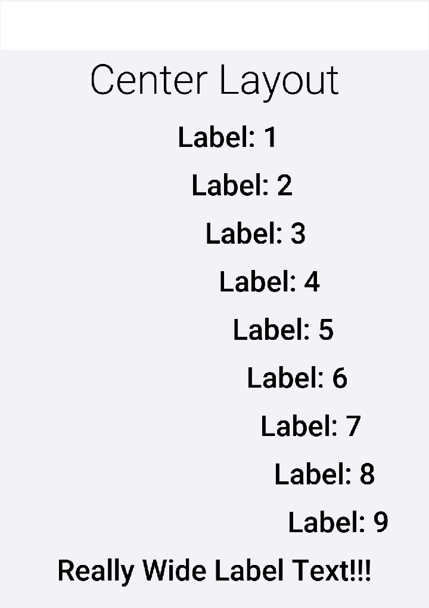

==== Porting a Swing/AWT Layout manager

The https://www.codenameone.com/javadoc/com/codename1/ui/layouts/GridBagLayout.html[GridBagLayout] was ported to Codename One considering the complexity of that specific layout manager. Here are some tips you should consider when porting a Swing/AWT layout manager:

. Codename One doesn't have `Insets`, but adds some support for them to port GridBag but components in Codename One have a margin they need to consider instead of the `Insets` (the padding is in the preferred size and is thus hidden from the layout manager).
. AWT layout managers also synchronize a lot on the AWT thread. This is no longer necessary since Codename One is single threaded, like Swing.
. AWT considers the top left position of the `Container` to be 0,0 whereas Codename One considers the position based on its parent `Container`. The top left position in Codename One is `getX()`, `getY()`.

Other than those things it’s fixing method and import statements, which are slightly different. Pretty trivial stuff.

=== Port a language to Codename One

As you may have already read, you've added support for Kotlin in Codename One. This is something that you can achieve without the help of Codename One. You could port a 3rd party language like Scala, Ruby, Python etc. to Codename One.

==== What's a JVM language

A JVM Language is any programming language that can be compiled to byte-codes that will run on the JVM (Java Virtual Machine). Java was the original JVM language, but many others have sprung up over the years. https://kotlinlang.org/[Kotlin], https://www.scala-lang.org/[Scala], http://groovy-lang.org/[Groovy], and http://jruby.org/[JRuby] come to mind as well-established and mature languages, but there are https://en.wikipedia.org/wiki/List_of_JVM_languages[many others].

==== How hard is it to port a JVM language to Codename One

The difficulty of porting a particular language to Codename One will vary depending on such factors as:

. Does it require a runtime library?
.. How complex is the runtime library? (For example: Does it require classes that aren't offered in Codename One's subset of the java standard libraries?)
. Does it need reflection?
.. Codename One doesn't support reflection because it would result in a large application size. If a JVM language requires reflection to get off the ground then adding it to Codename one would be tricky.
. Does it perform any runtime byte-code manipulation?
.. Some dynamic languages may perform byte-code manipulation at runtime. This is problematic on iOS (and possibly other platforms) which prohibits such runtime behavior.

===== Step 1: Assess the language

The more similar a language, and its build outputs are to Java, the easier it will be to port (probably). Most JVM languages have two parts:

1. A compiler, which compiles source files to JVM byte-code (usually as `.class` files).
2. A runtime library.

One language (other than Java) doesn't require a runtime library: http://www.mirah.org/[Mirah].

NOTE: Codename One also supports https://www.codenameone.com/blog/mirah-for-codename-one.html[Mirah]

====== Assessing the Byte-Code

The first thing to do is take a look at the byte-code that's produced by the compiler. Use `javap` to print out a nice version.

Consider a sample Kotlin class that extends `Form`, creates a `Label` and `Button`, and updates the label from the button's listener.

Take a look at the bytecode that Kotlin produced for this class:

----
$ javap -v com/codename1/hellokotlin2/KotlinForm.class
----

[source,bytecode]
----
include::../demos/common/src/main/snippets/developer-guide/advanced-topics-under-the-hood.txt[tag=advanced-topics-under-the-hood-bytecode-001,indent=0]
----

That's a big mess of stuff, but it's pretty easy to pick through it when you know what you're looking for. The layout of this output is pretty straight forward. The beginning shows that this is a class definition:

[source,java]
----
include::../demos/common/src/main/java/com/codename1/hellokotlin2/KotlinForm.java[tag=kotlinForm,indent=0]
----

Even comparing this line with the class definition from the source file you've learned something about the Kotlin compiler. It has made the class `final` by default. That observation shouldn't affect your assessment here, but it's kind of interesting.

After the class definition, it shows the internal classes:

[source,bytecode]
----
include::../demos/common/src/main/snippets/developer-guide/advanced-topics-under-the-hood.txt[tag=advanced-topics-under-the-hood-bytecode-002,indent=0]
----

**The Constant Pool**

And the constants that are used in the class:

[source,bytecode]
----
include::../demos/common/src/main/snippets/developer-guide/advanced-topics-under-the-hood.txt[tag=advanced-topics-under-the-hood-bytecode-003,indent=0]
----

The constant pool will consist of class names, and strings. You'll want to peruse this list to see if the compiler has added any classes that aren't in the source code. In the example above, it looks like Kotlin is pretty faithful to the original source's dependencies. It didn't inject any classes that aren't in the original source.

Even if the compiler does inject other dependencies into the bytecode, it might not be a problem. It's a problem if those classes aren't supported by Codename One. Watch for anything in the `java.lang.reflect` package or unsolicited use of `java.net`, `java.nio`, or any other package that aren't part of the Codename One standard library. If you're not sure if a class or package is available in the Codename One standard library, check https://www.codenameone.com/javadoc/[the javadocs].

**The ByteCode Instructions**:

After the constant pool, you see each of the methods of the class written out as a list of bytecode instructions. For example:

[source,bytecode]
----
include::../demos/common/src/main/snippets/developer-guide/advanced-topics-under-the-hood.txt[tag=advanced-topics-under-the-hood-bytecode-004,indent=0]
----

In the above snippet, the first instruction is `aload_0` (which adds `this` to the stack). The 2nd instruction is `ldc`, (which loads constant #8 -- the string "Hello Kotlin" to the stack). The 3rd instruction is `invokestatic` which calls the static method define by Constant #14 from the constant pool, with the two parameters that had been added to the stack.

NOTE: You don't need to understand what all these instructions do. You need to look for instructions that may be problematic.

The instruction that *might* be problematic is "invokedynamic." All other instructions should work fine in Codename One. (It isn't certain that invokedynamic won't work - it might not work on some platforms.)

**Summary of Byte-code Assessment**

To summarize, the byte-code assessment phase, you're basically looking to make sure that the compiler doesn't tend to add dependencies to parts of the JDK that Codename One doesn't support. And you want to make sure that it doesn't use invokedynamic.

If you find that the compiler does use invokedynamic or add references to classes that Codename One doesn't support, don't give up yet. You might be able to create your own "porting" runtime library that will provide these dependencies at runtime.

====== Assessing the runtime library

The process for assessing the runtime library is pretty like the process for the bytecodes. You'll want to get your hands on the language's runtime library, and use `javap` to inspect the `.class` files. You're looking for the same things as you were looking for in the compiler's output: "invokedynamic" and classes that aren't supported in Codename One.

===== Step 2: Convert the runtime library into a CN1Lib

Once you've assessed the language and are optimistic that it's a good candidate for porting, you can proceed to port the runtime library into Codename One. That language's runtime library will be distributed in.jar format. You need to convert this into a cn1lib so that it can be used in a Codename One project. If you can get your hands on the source code for the runtime library then the best approach is to paste the source files into a Maven cn1lib project generated with the `cn1lib-archetype` (see <<creating-cn1libs>>) and try to build it. This has the advantage that it will check the source during compile to ensure that it doesn't depend on any classes that Codename One doesn't support.

If you can't find the sources of the runtime library or they don't seem to be "buildable," then the next best thing is to get the binary distribution's jar file and convert it to a cn1lib. This is what you did for the https://github.com/shannah/codenameone-kotlin[Kotlin runtime library].

This procedure exploits the fact that a cn1lib file is a zip file with a specific file structure inside it. The cross-platform Java `.class` files are all contained inside a file named `main.zip`, inside the zip file. This is the *mandatory* file that must be inside a cn1lib.

To make the library easier to use the cn1lib file can also contain a file named "stubs.zip" which includes stubs of the Java sources. When you build a cn1lib using a Maven cn1lib project, it will automatically generate stubs of the source so that the IDE will have access to nice things like Javadoc when using the library. The Kotlin distribution includes a separate jar file with the runtime sources, named `kotlin-runtime-sources.jar`, so you used this as the "stubs." It contains full sources, which isn't necessary, but it also doesn't hurt.

Now that you had your two jar files: kotlin-runtime.jar and kotlin-runtime-sources.jar, create a new empty directory and copy them inside. Rename the jars "main.zip" and "stubs.zip" respectively. Then zip up the directory and rename the zip file `kotlin-runtime.cn1lib`.

IMPORTANT: Building cn1libs manually in this way is a ** bad habit, as it bypasses the API verification step that occurs when building a library project. It's possible, even likely, that the jar files that you convert depend on classes that aren't in the Codename One library, so your library will fail at runtime in unexpected ways. The reason you could do this with kotlin's runtime (with some confidence) is because the bytecodes were already analyzed to ensure that they didn't include anything problematic.

===== Step 3: Hello world

For your "Hello World" test you will need to create a separate project in your JVM language and produce class files that you will *manually* copy into an appropriate location of your project. You will want to use the *normal* tools for the language and not worry about how it integrates with Codename One. For Kotlin, the steps follow the getting started tutorial on the Kotlin site to create a new Kotlin project in IntelliJ. When Steve ported Mirah, he used a text editor and the mirahc command-line compiler to create your Hello World class. The tools and process will depend on the language.

Create a minimal "hello world" class in the external language runtime you are evaluating.

After building this, the build produces a directory that contains `com/mycompany/myapp/HelloKotlin.class`.

It also produced a.jar file that contains this class.

The easiest way to integrate external code into a Codename One project is to wrap it as a cn1lib and consume it as a Maven dependency. Generate a cn1lib project with the `cn1lib-archetype` (see <<creating-cn1libs>>), drop the external class files into the `common` module, install it locally with `mvn install`, then add a `pom`-typed `<dependency>` entry to your application's `common/pom.xml`. Using the same procedure as you used to create the kotlin-runtime.cn1lib, wrap your hellokotlin.jar as a cn1lib that exposes the same classes to the application project.

NOTE: If you're maintaining a legacy Ant project, you can still drop the `.cn1lib` file into the project's `lib` directory and select "Codename One" -> "Refresh CN1Libs" to pick it up - but new projects should use the Maven dependency mechanism described above.

Finally, call your library from the start() method of your app:

[source,java]
----
include::../demos/common/src/main/java/com/codename1/hellokotlin2/KotlinForm.java[tag=kotlinForm,indent=0]
----

If you run this in the Simulator, it should print "Hello from Kotlin" in the output console. If you get an error, then you can dig in and try to figure out what went wrong using your standard debugging techniques. *EXPECT* an error on the first run. The error will probably be a missing import or something simple.

===== Step 4: A more complex hello world

For Kotlin, the hello world example app would actually run without the runtime library because it was so simple. It was necessary to add a more complex example to prove the need for the runtime library. It doesn't matter what you do with your more complex example, as long as it doesn't require classes that aren't in Codename One.

If you want to use the Codename One inside your project, you should add the CodenameOne.jar (found inside any Codename One project) to your classpath so that it will compile.

===== Step 5: Automation and integration

At this point you already have a manual process for incorporating files built with your alternate language into a Codename One project. The process looks like:

1. Use standard tools for your JVM language to write your code.
2. Use the JVM language's standard build tools (for example: command-line compiler, etc.) to compile your code so that you've`.class` files (and optionally a `.jar` file).
3. Wrap your `.class` files in a cn1lib by dropping them into a Maven cn1lib project generated from the `cn1lib-archetype` (see <<creating-cn1libs>>).
4. Install the cn1lib locally with `mvn install` and add it as a `pom`-typed dependency to your Codename One application's `common/pom.xml`.
5. Use your library from the Codename One project.

When Steve first developed Mirah support he automated this process using an https://github.com/shannah/CN1MirahNBM/blob/master/src/ca/weblite/codename1/mirah/build.xml[ANT script]. He also automatically generated some bootstrap code so that he could develop the whole app in Mirah and he wouldn't have to write any Java. For example, this level of integration has limitations.

For example, with this approach alone, you couldn't have two-way dependencies between Java source and Mirah source. Yes, Mirah code could use Java libraries (and it did depend on CodenameOne.jar), and your Java code could use your Mirah code. For example, Mirah *source* code couldn't depend on the Java *source* code in your project. This has to do with the order in which code is compiled. It's a bit of a chicken-and-egg issue. If you're building a project that has Java source code and Mirah source code, you're using two different compilers: mirahc to compile the Mirah files, and javac to compile the Java files. If you're starting from a clean build, and you run mirahc first, then the `.java` files haven't yet been compiled to `.class` files - and thus mirahc can't *reference* them - and any mirah code that depends on those uncompiled Java classes will fail. If you compile the `.java` files first, then you have the opposite problem.

Steve worked around this problem in Mirah by writing https://github.com/shannah/mirah-ant/blob/master/src/ca/weblite/asm/JavaExtendedStubCompiler.java[your own pseudo-compiler] that produced stub class files for the java source that would be referenced by mirahc when compiling the Mirah files. In this way he was able to have two-way dependencies between Java and Mirah in the same project.

Kotlin also supports two-way dependencies, probably using a similar mechanism.

====== How seamless can you make it

For both the Kotlin and Mirah support, you wanted integration to be seamless. You didn't want users to have to create a separate project for their Kotlin/Mirah code. You wanted them to add a Kotlin/Mirah file into their project and have it * work*. Achieving this level of integration in Kotlin was easy, since they provide an https://kotlinlang.org/docs/reference/using-ant.html[ANT plugin] that essentially allowed you to add one tag inside your `<javac/>` tags:

[source,xml]
----
include::../demos/common/src/main/snippets/developer-guide/advanced-topics-under-the-hood.xml[tag=advanced-topics-under-the-hood-xml-011,indent=0]
----

And it would automatically handle Kotlin and Java files together: Seamlessly. A few places in a Codename One's build.xml file where you call "javac" so you needed to inject these tags in those places. This injection is performed automatically by the Codename One IntelliJ plugin.

For Mirah, Steve developed his own https://github.com/shannah/mirah-ant[ANT plugins] and https://github.com/shannah/mirah-nbm[Netbeans module] that do something similar in Netbeans.

=== Update framework

When Codename One launched in 2012 there was a need to ship updates and fixes faster than the plugin update system, leading to the client lib update system. There was also a need to update the designer tool (resource editor), the GUI builder, and the skins, as well as the built-in builder code (`CodeNameOneBuildClient.jar`).

The https://github.com/codenameone/UpdateCodenameOne[Update Framework] solves many problems in the old systems:

- Download once - if you have many projects the library will download once to the `.codenameone` directory. All the projects will update from local storage

- Skins update automatically - this is hugely important. When you change a theme you need to update it in the skins and if you don't update the skin you might see a difference between the simulator and the device

- Update of designer tools without an IDE plugin update - The IDE plugin update process is slow and tedious. This way a GUI builder fix can ship without a new IDE plugin release. The standalone Settings artifact is versioned with the Maven plugin instead.

This framework should be seamless. You should no longer see the "downloading" message whenever you push an update after your build client is updated. Your system would poll for a new version daily and update when new updates are available.

To force an update check, run `mvn cn1:update` from the project root.

==== How does it work

// vale-skip: Microsoft.Contractions: "of it is simple" parses as the prepositional phrase "of it" plus the predicate "is simple"; collapsing it to "of it's" would read as a possessive ("of its simple") and lose the meaning.
You can see the full code https://github.com/codenameone/UpdateCodenameOne[here] the gist of it is simple. You create a jar called `UpdateCodenameOne.jar` under `~/.codenameone` (`~` represents the users home directory).

An update happens by running this tool with a path to a Codename One project for example:

[source,bash]
----
include::../demos/common/src/main/snippets/developer-guide/advanced-topics-under-the-hood.sh[tag=advanced-topics-under-the-hood-bash-002,indent=0]
----

For example:

----
java -jar ~/.codenameone/UpdateCodenameOne.jar ~/dev/AccordionDemo
Checking: JavaSE.jar
Checking: CodeNameOneBuildClient.jar
Checking: CLDC11.jar
Checking: CodenameOne.jar
Checking: CodenameOne_SRC.jar
Checking: designer_1.jar
Checking: guibuilder_1.jar
Updating the file: /Users/shai/dev/AccordionDemo/JavaSE.jar
Updating the file: /Users/shai/dev/AccordionDemo/CodeNameOneBuildClient.jar
Updating the file: /Users/shai/dev/AccordionDemo/lib/CLDC11.jar
Updating the file: /Users/shai/dev/AccordionDemo/lib/CodenameOne.jar
Updated project files
----

Notice that no download happened since the files were up-to-date. You can also force a check against the server by adding the force argument as such:

[source,bash]
----
include::../demos/common/src/main/snippets/developer-guide/advanced-topics-under-the-hood.sh[tag=advanced-topics-under-the-hood-bash-003,indent=0]
----

The way this works under the hood is thought a `Versions.properties` within your directory that lists the versions of local files. That way you know what should be updated.

TIP: Exclude `Versions.properties` from Git

Under the `~/.codenameone` directory you have a more detailed `UpdateStatus.properties` file that includes versions of the locally downloaded files. Notice you can delete this file and it will be recreated as all the jars get downloaded over again.

==== What isn't covered

You will notice 3 big things that aren't covered in this unified framework:

- You don't update cn1libs - whether you would like to update them automatically is unclear

- Versioned builds - a lot of complexity exists in the versioned build system. This might be something you address in the future but for now the framework stays simple.
