== Advanced topics/under the hood

=== Sending arguments to the build server

When you send a build to the server, you can provide more parameters. The server incorporates those parameters into the build process as build hints.

These hints are often called "build hints" or "build arguments." They behave like compiler flags that tune the build server's behavior. That makes them useful for fast iteration on new functionality without rebuilding plugin UI for every change. They're also useful when you need to expose low-level behavior such as customizing the Android manifest XML or the iOS plist.

Launch Codename One Settings from the Maven project root, then select *Hints* in the left navigation rail. The hints use the `key=value` style.

[source,shell]
----
include::../demos/common/src/main/snippets/developer-guide/maven-appendix-control-center.sh[tag=maven-appendix-control-center-bash-001,indent=0]
----

.The build hints UI in Codename One Settings
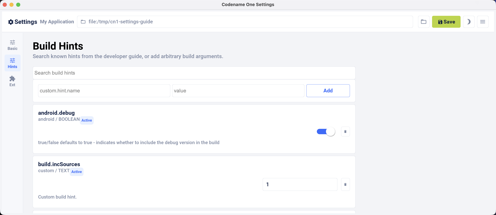

You can also set the build hints directly in the `codenameone_settings.properties` file. When you do that, each setting must start with the `codename1.arg.` prefix. For example, `android.debug=true` becomes `codename1.arg.android.debug=true`.

Application code can read a custom build argument through `Display.getProperty()`:

[source,java]
----
include::../demos/common/src/main/java/com/codenameone/developerguide/advancedtopics/AppArgSnippet.java[tag=appArg,indent=0]
----

Here is the current list of supported arguments, rendered from the annotations
and the catalog that declare them:

Most of the commonly used hints also have a compiler-checked form: an annotation
in `com.codename1.annotations.buildhints` that you put on the application's main
class. Written that way a misspelled name is an unknown symbol and an
unsupported value is an unknown enum constant, instead of a properties line that
is accepted, never read, and has no effect. The Annotation column below
names that form where one exists. Setting the same hint both ways fails the
build.

Each annotation groups the hints of one platform, and the attribute names match
the part of the hint name after the prefix, so `codename1.arg.ios.pods` is
`@Ios(pods = ...)`:

[source,java]
----
include::../demos/common/src/main/java/com/codenameone/developerguide/advancedtopics/BuildHintAnnotationSnippet.java[tag=buildHintAnnotations,indent=0]
----

That's the same as writing these lines in `codenameone_settings.properties`:

[source,properties]
----
include::../demos/common/src/main/snippets/developer-guide/advanced-topics-under-the-hood.properties[tag=advanced-topics-under-the-hood-properties-004,indent=0]
----

Three things in that example are worth calling out.

A hint whose value is a list takes a Java array, and the build joins it with the
separator that hint uses -- a comma for `ios.pods`, so you never have to
remember which hint wants which delimiter.

A boolean hint takes `Toggle`, not `boolean`. `Toggle.ON` and `Toggle.OFF` say
what you want, and leaving the attribute out entirely means you have said
nothing, so the build service applies whatever it applies today. That's why the
Default column reads _(set by the build)_ for these hints: the annotation
records no default of its own, by design: a value compiled into your app can't
follow the build service when the service changes it.

A hint with a closed set of values takes an enum, so `@Ios(themeMode = ...)`
offers you the four themes that exist and rejects anything else at compile time.
Hints whose accepted values are open-ended stay `String`.

The long tail of hints has no annotation, and neither do the open-ended families
such as `android.permission.<NAME>`, because a Java annotation can't express a
map. Set those in `codenameone_settings.properties` exactly as before. You can mix
the two forms in one project, as long as no single hint is declared in both.

[IMPORTANT]
====
Build hints are the one part of Codename One that doesn't promise source
compatibility, and that's deliberate.

Everywhere else, code that compiles against one release keeps compiling against
the next. Here, a hint that changes its name, its type or its accepted values is
meant to stop compiling, so you find out at your desk. The alternative is what
the properties file has always done: accept the line, never read it, and leave
you with a build that succeeds and an app that doesn't do what you asked.

The failure is always on the client side, never on the build service. A hint
reaches the service as a name and a string, and the service goes on accepting
the strings it always did -- an app already built keeps building, and an older
Codename One keeps talking to a newer service. A changed hint breaks a compile
in your project, with the attribute named.

If a release does take an annotation away, the properties form of the same hint
still works, so the upgrade costs a line in `codenameone_settings.properties`
rather than being one you can't take.
====

.Build hints
include::_generated-build-hints.adoc[]
=== Versioned builds

By default a cloud build always uses the current Codename One release. With a _versioned build_ you can instead pin the build to a specific previously released framework version, so you get reproducible output over time. This helps when stabilizing a release, supporting an older app, or isolating a regression: if an app that built correctly in the past starts failing, rebuilding against the last known good version tells you whether the change came from your code or from the framework and build server.

Set the `build.cn1Version` build hint to the version you want to target. Versions use the standard Maven release scheme, for example `7.0.182`:

----
codename1.arg.build.cn1Version=7.0.182
----

The build server fetches that version's framework artifacts from the Codename One Maven repository and builds against them, falling back to Maven Central for releases published before the move. To keep your simulator and local compile classpath aligned with the same release, set the matching `cn1.version` in your project `pom.xml`.

Versioned builds are a Pro and Enterprise feature, and how far back you can target depends on the subscription tier:

[options="header"]
|===
|Tier |Versions you can target
|Pro |Any version released within the last two months
|Enterprise |Any version released within the last six months
|===

If you request a version older than your tier's window, a version that was never published, or you aren't on a Pro or Enterprise plan, the build fails with an explanatory message instead of falling back to the current release.

==== Building against master

Set `build.cn1Version` to `master` to build against the current development head (the latest `master` of the Codename One repository) instead of a released version:

----
codename1.arg.build.cn1Version=master
----

Every push to `master` publishes a fresh set of framework artifacts and the build server always grabs the latest, so this is the quickest way to verify an unreleased fix or feature end to end on a device. Because `master` tracks active development it can be less stable than a release, so use it for verification rather than for shipping production builds. Building against `master` is available to Pro and Enterprise subscribers.

=== Android permissions

One of the annoying tasks when programming native Android applications is tuning all the required permissions
to match your codes requirements, Codename One aims to simplify this. The build server automatically introspects the classes sent to it as part of the build and injects the right set of permissions required by the app.

For example, sometimes developers might find the permissions that come up a bit confusing and might not understand why
a specific permission came up. This maps Android permissions to the methods/classes in Codename One that would trigger them. Notice that this list isn't exhaustive as the API is rather large:

`android.permission.WRITE_EXTERNAL_STORAGE` - included by default (up to Android 13) so file APIs continue to work unless you block it with `android.blockExternalStoragePermission=true`.

`android.permission.INTERNET` - always requested because the networking stack depends on it even for offline features like local web views.

`android.permission.CAMERA` & `android.permission.RECORD_AUDIO` - required when capturing photos, video, or audio. The builder injects them automatically and the Android port prompts the user the first time the API is used.

`android.permission.READ_PHONE_STATE` - used by telephony-aware APIs like `Display.getMsisdn()` and by media integration so audio pauses on calls.

`android.permission.ACCESS_FINE_LOCATION` & `android.permission.ACCESS_COARSE_LOCATION` - requested when using `com.codename1.location` or embedded maps so location fixes can be delivered.

`android.permission.ACCESS_BACKGROUND_LOCATION` - added when background geofencing or fetch tasks are enabled; the Android port verifies the permission on Android 10+.

`android.permission.POST_NOTIFICATIONS` - prompted on Android 13+ for both push registration and local notifications.

`package.permission.C2D_MESSAGE`, `com.google.android.c2dm.permission.RECEIVE`, and `android.permission.RECEIVE_BOOT_COMPLETED` - bundled with the push subsystem so Firebase Cloud Messaging can wake the app after device restarts.

`android.permission.READ_CONTACTS` - requested when accessing the device address book through `Display.getAllContacts()` and related APIs.

`android.permission.READ_MEDIA_VIDEO` & `android.permission.READ_MEDIA_AUDIO` - added on API 33 and above when the app plays a URI through `MediaManager.createMedia(String, boolean)` or `createMediaAsync(String, boolean, Runnable)`, since that URI can point at the shared media store. The `InputStream` overloads don't add them: the Android port copies the stream into app private storage and reads nothing shared. Block them with `android.blockReadMediaPermissions=true`.

`android.permission.READ_MEDIA_IMAGES` - never added by media playback, because no Codename One API requests it at runtime. Declaring it alongside `READ_MEDIA_VIDEO` places the app under Google Play's Photo and Video Permissions policy, so ask for it only when you need it, with `android.requestReadMediaPermissions=true`.

==== Permissions under Marshmallow (Android 6+)

Starting with Marshmallow (Android 6+ API level 23) Android shifted to a permissions system that prompts users for permission the first time an API is used for example: when accessing contacts the user will receive a prompt whether to allow contacts access.

NOTE: Permission can be denied and a user can later on revoke/grant a permission through external settings UI

This is great as it allows apps to be installed with a single click and no permission prompt during install which can increase conversion rates!

===== Enabling permissions

// vale-skip: write-good.TooWordy — 'minimum of API 36' is the precise term for the SDK floor.
By default, Codename One's Gradle 8 based Android builder uses the highest Android SDK you've installed, with a minimum of API 36, for both the compile and target SDK versions. If you override the target through the `android.targetSDKVersion` build hint, the builder honors it while keeping the compile SDK at least as high as the target SDK. Lowering the target may disable some compatibility libraries. Keeping the target current is strongly recommended for Play Store compliance.

===== Permission prompts

To test this API see the following simple contacts app:

[source,java]
----
include::../demos/android/src/main/java/com/codenameone/developerguide/advancedtopics/PermissionSnippets.java[tag=contactsPermission,indent=0]
----

If you explicitly lower the target SDK (for example: `android.targetSDKVersion=21`) and install this app on an Android 6 device you will still see the legacy install prompt with all permissions listed up front:

.Install UI when using the old permissions system
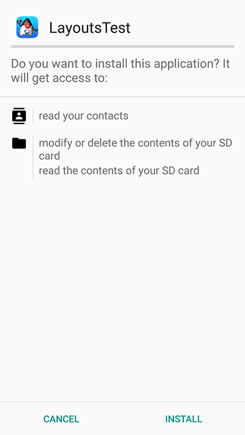

When you keep the default target (API 36+) the installer defers to the runtime permission flow and the installation UI looks like this instead:

.Install UI when using the new permissions system
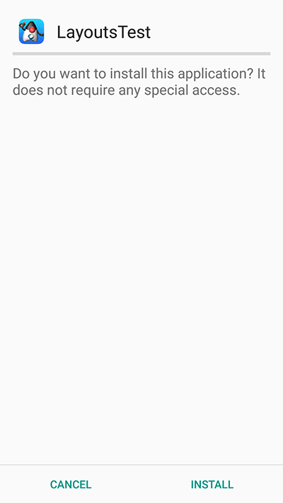

When you launch the UI under the old permissions system you see the contacts instantly. In the new system you're presented with this UI:

.Native permission prompt first time
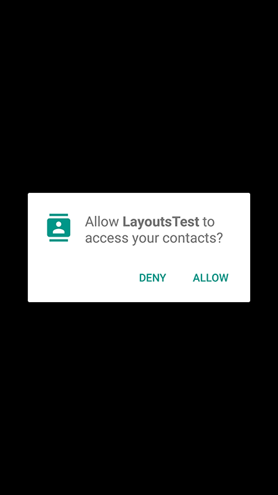

If you accept and allow all is good and the app loads as usual but if you deny then Codename One provides the user another chance to request the permission. Notice that in this case you can customize the prompt string as explained below.

.Codename One permission prompt

If you select don't ask then you will get a blank screen since the contacts will return as a 0 length array. This makes
sense as the user is aware he denied permission and the app will still function as expected on a device where
no contacts are available. For example, if the user realizes his mistake he can double back and ask to re-prompt for
permission in which case he will see this native prompt:

.Native permission prompt second time
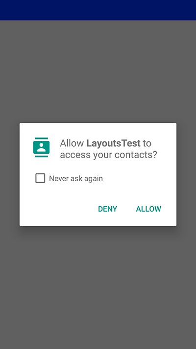

Notice that denying this second request won't trigger another Codename One prompt.

===== Code changes

No explicit code changes needed for this functionality to "work." The respective APIs will work like they always worked and will prompt the user seamlessly for permissions.

TIP: Some behaviors that never occurred on Android but were legal in the past might start occurring with the switch to the new API. For example: the location manager might be null and your app must always be ready to deal with such a situation

When permission is requested a user will be seamlessly prompted/warned. You can customize the permission text through `Display` properties. For example: to customize the rationale text of the contacts permission:

[source,java]
----
include::../demos/android/src/main/java/com/codenameone/developerguide/advancedtopics/PermissionSnippets.java[tag=permissionPrompt,indent=0]
----

The Android port also checks `UIManager.localize()` for localized values before falling back to `Display` properties. You can provide localized strings for the permission body and dialog buttons/title using keys based on the permission name:

[source,java]
----
include::../demos/android/src/main/java/com/codenameone/developerguide/advancedtopics/PermissionSnippets.java[tag=permissionPromptLocalization,indent=0]
----

For example, if the permission key is `android.permission.READ_CONTACTS`, you can localize these keys:

* `android.permission.READ_CONTACTS` (dialog body)
* `android.permission.READ_CONTACTS.title`
* `android.permission.READ_CONTACTS.askAgain`
* `android.permission.READ_CONTACTS.dontAsk`

The same pattern applies to other permissions. `android.permission.ACCESS_BACKGROUND_LOCATION` also supports:
`android.permission.ACCESS_BACKGROUND_LOCATION.settings`,
`android.permission.ACCESS_BACKGROUND_LOCATION.cancel`,
`android.permission.ACCESS_BACKGROUND_LOCATION.explanation_title`,
`android.permission.ACCESS_BACKGROUND_LOCATION.explanation_body`, and
`android.permission.ACCESS_BACKGROUND_LOCATION.ok`.

This is optional as there is a default value defined. You can define this once in the `init(Object)` method but for some extreme cases permission might be needed for different things for example: you might ask for this permission with one reason at one point in the app and with a different reason at another point in the app.

===== Simulating prompts

You can simulate permission prompts by checking that option in the simulator menu.

.Simulate permission prompts menu item in the simulator
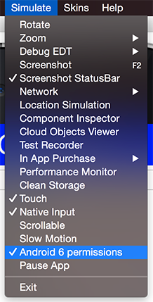

This will produce a dialog to the user whenever this happens in Android and will try to act in a similar way to the device. Notice that you can test it in the iOS simulator too.

===== AndroidNativeUtil's checkForPermission

If you write Android native code using native interfaces you're probably familiar with the `AndroidNativeUtil` class from the `com.codename1.impl.android` package.

This class provides access to many low-level capabilities you would need as a developer writing native code. Since native code might need to request a permission Codename One uses the same underlying logic, namely:
`checkForPermission`.

To get a permission you can use this code as such:

[source,java]
----
include::../demos/android/src/main/java/com/codenameone/developerguide/advancedtopics/PermissionSnippets.java[tag=androidCheckForPermission,indent=0]
----

This will prompt the user with the native UI and later on with the fallback option as described above. Notice that the `checkForPermission` method is a blocking method and it will return when there is a final conclusion on the subject. It uses `invokeAndBlock` and can be invoked on the event dispatch thread without concern.

By default, fallback prompts are displayed using Codename One's `Dialog.show(...)`. If you're writing native Android code and need to use your own prompt implementation, you can install a custom callback:

[source,java]
----
include::../demos/android/src/main/java/com/codenameone/developerguide/advancedtopics/PermissionSnippets.java[tag=androidPermissionPromptCallback,indent=0]
----

Pass `null` to `AndroidNativeUtil.setPermissionPromptCallback()` to restore the default behavior.

=== On device debugging

On-device debugging now has two dedicated chapters, one per platform:

* <<On-Device Debugging (iOS)>> covers attaching a standard Java
  debugger (IntelliJ, jdb, VS Code) to an iOS app running on a device or in the
  native iOS simulator, as well as debugging the generated Xcode project natively.
* <<On-Device Debugging (Android)>> covers the equivalent
  adb/JDWP-based flow for Android devices and emulators, including wireless
  debugging and debugging the generated Gradle project from Android Studio.

=== Native interfaces

Sometimes you may wish to use an API that's unsupported by Codename One or integrate with a 3rd party library/framework that isn't supported. These are achievable tasks when writing native code and Codename One lets you encapsulate such native code using native interfaces.

==== Introduction

Notice that when you say "native" you don't mean C/C++ always but rather the platforms "native" environment. For Android, Java or Kotlin code can be invoked with full access to the Android API. In case of iOS, Objective-C or Swift code can be invoked and so forth.

TIP: You can still access C code under Android either by using JNI from the Android native code or by using a library

Native interfaces are designed to allow primitive types, Strings, arrays of primitive types (single dimension ) & https://www.codenameone.com/javadoc/com/codename1/ui/PeerComponent.html[PeerComponent] values. Any other kind of parameter/return type is prohibited. For example, once in the native layer the native code can act and query the Java layer for more information.

NOTE: The reason for the limits is the disparity between the platforms. Mapping a Java `Object` to an Objective-C `NSObject` is possible but leads to odd edge cases and complexity for example: GC vs. ARC in a disparate object graph

Furthermore, native methods should avoid features such as overloading, varargs (or any Java 5+ feature for that matter) to allow portability for languages that don't support such features.

IMPORTANT: Don't rely on pass by reference/value behavior since they vary between platforms

The shape is always the same, whether you are reaching one platform API or
wrapping a whole third party SDK. Portable Java sits on one side, your
per-platform implementation class on the other, and between them a narrow
interface carrying only the types listed above: primitives, strings, single
dimension primitive arrays and `PeerComponent` values. Nothing calls the vendor's
SDK except that implementation class.

.The native interface round trip
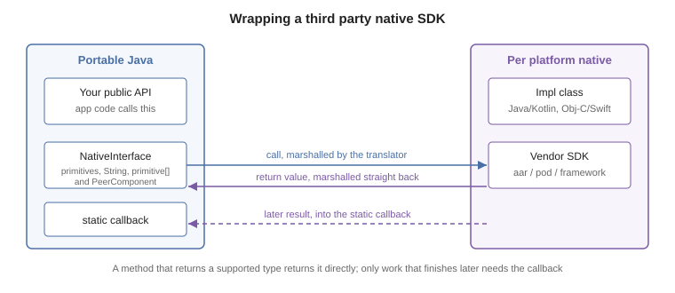

A method that returns one of those types returns it directly -- the value is
marshalled back the same way the arguments went out. The return path only gets
interesting when the work finishes later: a native SDK that answers through its
own callback has nothing to return by then, so it calls a `static` method on the
Java class instead, and that method resolves whatever the caller was waiting on. <<Integrating Android 3rd party libraries & JNI>>
covers bundling the vendor binary on Android, `ios.pods` does the same for iOS,
and <<Libraries - cn1lib>> covers shipping the result as a library.

Implementing a native layer effectively means:

.	Creating an interface that extends https://www.codenameone.com/javadoc/com/codename1/system/NativeInterface.html[NativeInterface] and defines methods with the arguments/return values declared in the previous paragraph.

.	Creating the proper native implementation hierarchy based on the call conventions for every platform within the native directory

For example: to create a simple hello world interface do something like:

[source,java]
----
include::../demos/common/src/main/java/com/mycompany/myapp/MyNative.java[tag=myNativeInterface,indent=0]
----

You now need to right-click the class in the IDE and select the #Generate Native Access# menu item:

.Generating the native code
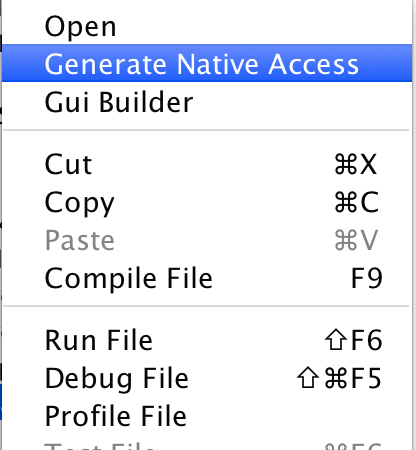

.Once generated you're prompted that the native code is in the "native" directory
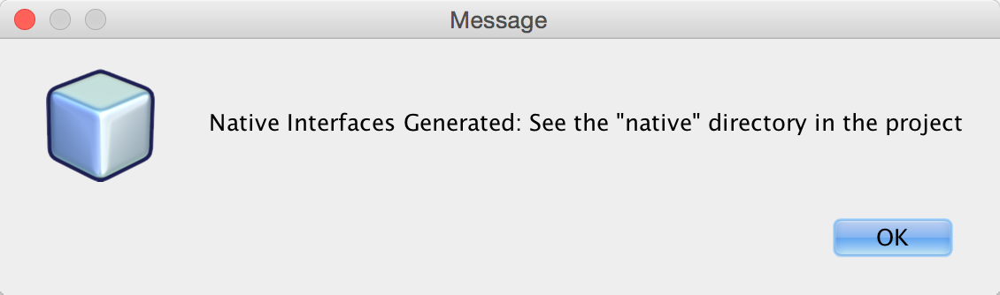

You can now look int the #native# directory in the project root (in NetBeans you can see that in the #Files# tab) and you can see something that looks like this:

.Native directory structure containing stubs for the various platforms
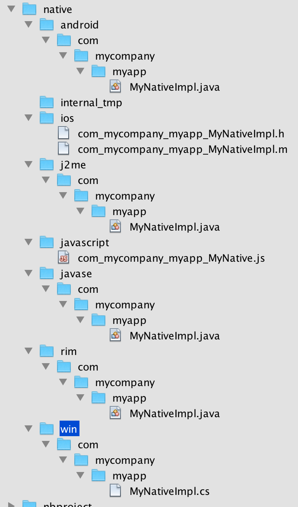

These are effectively stubs you can edit to implement the methods in native code.

TIP: If you re-run the #Generate Native Access# tool you will get this dialog, if you answer yes all the files will be overwritten, if you answer no files you deleted/renamed will be recreated

.Running "Generate Native Access" when some/all the native files exist already
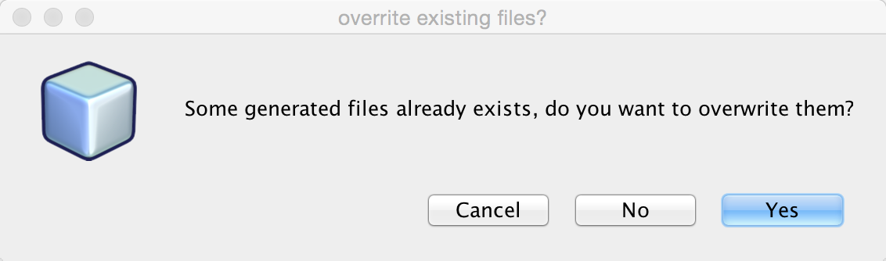

For now lets leave the stubs and come back to them soon. From the Codename One Java code you can call the implementation of this native interface using:

[source,java]
----
include::../demos/common/src/main/java/com/codenameone/developerguide/advancedtopics/NativeInterfaceSnippets.java[tag=nativeLookup,indent=0]
----

Notice that for this to work you must implement the native code on all supported platforms.

You will start with Android which should be familiar and intuitive to many developers. The helper `MyNativeImplStub` class below mirrors the stub that the tooling generates under the `native/android` directory:

[source,java]
----
include::../demos/android/src/main/java/com/mycompany/myapp/MyNativeImplStub.java[tag=myNativeAndroidStub,indent=0]
----

The stub implementation always returns `false`, `null` or `0` by default. The `isSupported` also defaults to `false` thus allowing you to implement a `NativeInterface` on some platforms and leave the rest out without knowing anything about these platforms.

You can implement the Android version in Java or Kotlin. Here is the Java version:

[source,java]
----
include::../demos/android/src/main/java/com/mycompany/myapp/MyNativeImpl.java[tag=myNativeAndroidImpl,indent=0]
----

<1> Notice that you're using the Android native `android.util.Log` class which isn't accessible from standard Codename One code

<2> The impl class doesn't physically implement the `MyNative` interface! +
This is intentional and due to the `PeerComponent` functionality mentioned below. You don't need to add an implements clause.

<3> Notice that there is no constructor and the class is public. It's crucial that the system will be able to assign the class without obstruction. You can use a constructor but it can't have any arguments and you shouldn't rely on semantics of construction.

<4> You implemented the native method and that you set `isSupported` to true.

IMPORTANT: The IDE won't provide completion suggestions and will claim that there are errors in the code! +
Codename One doesn't include the native platforms in its bundle for example: the full Android SDK or the full Xcode Objective-C runtime. For example, since the native code is compiled on the servers (where these runtimes are present) this shouldn't be a problem

TIP: When implementing a non-trivial native interface, send a server build with the "Include Source" option checked. Implement the native interface in the native IDE then copy and paste the native code back into Codename One

The implementation of this interface is identical for Android (Java/Kotlin) & Java SE.

===== Swift (iOS) and Kotlin (Android) options

For iOS native interfaces you can implement the generated `...Impl` class in Objective-C _or_ Swift. +
For Android native interfaces you can implement the generated `...Impl` class in Java _or_ Kotlin.

[cols="1,3",options="header"]
|===
| Platform
| Typical file locations for native interface implementations

| Android (Java/Kotlin)
| `android/src/main/java/com/mycompany/myapp/MyNativeImpl.java` +
`android/src/main/java/com/mycompany/myapp/MyNativeImpl.kt`

| iOS (Objective-C/Swift)
| `ios/src/main/objectivec/com_mycompany_myapp_MyNativeImpl.h` +
`ios/src/main/objectivec/com_mycompany_myapp_MyNativeImpl.m` +
`ios/src/main/objectivec/com_mycompany_myapp_MyNativeImpl.swift`

| Native Windows (win32, C)
| `win/src/main/c/com/mycompany/myapp/MyNativeImplCodenameOne.c`

| Native Linux (C)
| `linux/src/main/c/com/mycompany/myapp/MyNativeImplCodenameOne.c`

| JavaScript
| `javascript/src/main/javascript/com_mycompany_myapp_MyNative.js`
|===

NOTE: The native Windows and native Linux ports compile your app to C (no JVM), so
their native interface implementations are plain C, generated alongside the others
by the "Generate Native Sources" tool. The native Mac target reuses the iOS
Objective-C/Swift implementation, since it rides the same build.

===== Use the Android main thread (native EDT)

iOS, Android & pretty much any modern OS has an EDT like thread that handles events etc. The problem is that they differ in their nuanced behavior. For example: Android will respect calls off of the EDT and iOS will often crash. Some OSes enforce EDT access and will throw an exception when you violate that...

You don't need to know about these things, hidden functionality within your implementation bridges between your EDT and the native EDT to provide consistent cross-platform behavior. However, when you write native code you need awareness.

.Why not Implicitly call Native Interfaces on the Native EDT?
****
Calling into the native EDT includes overhead and it might not be necessary for some features (for example, IO, polling etc.). Furthermore, some calls might work well with asynchronous calls while others might need synchronous results and you can't know in advance which ones you would need.
****

====== How do you access the native EDT

Within your native code in Android do something like:

[source,java]
----
include::../demos/android/src/main/java/com/codenameone/developerguide/advancedtopics/AndroidThreadSnippets.java[tag=androidRunOnUiThread,indent=0]
----

This will execute the block within `run()` asynchronously on the native Android UI thread. If you need synchronous execution you have a special method for Codename One:

[source,java]
----
include::../demos/android/src/main/java/com/codenameone/developerguide/advancedtopics/AndroidThreadSnippets.java[tag=androidRunOnUiThreadAndBlock,indent=0]
----

This blocks in a way that's OK with the Codename One EDT which is unique to your Android port.

===== Gradle dependencies

Integrating a native OS library isn't hard but it sometimes requires some juggling. Most instructions target developers working with Xcode or Android Studio & you need to twist your head around them. In Android the steps for integration in most modern libraries include a Gradle dependency.

For example: you published a library that added support for https://www.codenameone.com/blog/intercom-support.html[Intercom]. The native Android integration instructions for the library looked like this:

Add the following dependency to your app's `build.Gradle` file:

----
dependencies {
    compile 'io.intercom.android:intercom-sdk:3.+'
}
----

Which instantly raises the question: "How do you do that in Codename One"?

Well, it's actually pretty simple. You can add the build hint:

----
android.gradleDep=compile 'io.intercom.android:intercom-sdk:3.+'
----

This would "work" but there is a catch...

You might need to define the specific version of the Android SDK used and specific version of Google Play Services version used. Intercom is pretty sensitive about those and demanded that you also add:

----
android.playServices=9.8.0
android.sdkVersion=25
----

Once those were defined the native code for the Android implementation became trivial to write and the library was easy as there were no jars to include.

==== Objective-C and Swift (iOS)

When generating the Objective-C code the "Generate Native Sources" tool produces two files by default: `com_mycompany_myapp_MyNativeImpl.h` & `com_mycompany_myapp_MyNativeImpl.m`.
If you enable Swift stub generation in the Maven goal, it can also produce `com_mycompany_myapp_MyNativeImpl.swift`.

The `.m` files are the Objective-C equivalent of `.c` files and `.h` files contain the header/include information. In this case the `com_mycompany_myapp_MyNativeImpl.h` contains:

[source,objective-c]
----
include::../demos/ios/src/main/objectivec/com_mycompany_myapp_MyNativeImpl.h[tag=myNativeHeader,indent=0]
----

And `com_mycompany_myapp_MyNativeImpl.m` contains:

[source,objective-c]
----
include::../demos/ios/src/main/objectivec/com_mycompany_myapp_MyNativeImpl.m[tag=myNativeImplStub,indent=0]
----

IMPORTANT: Objective-C relies on argument names as part of the message (method) signature. `-(NSString*)helloWorld:(NSString*)param` isn't the same as `-(NSString*)helloWorld:(NSString*)iChangedThisName`! +
don't change argument names in the Objective-C native interface!

Here is a simple implementation like above:

[source,objective-c]
----
include::../demos/ios/src/main/objectivec/com_mycompany_myapp_MyNativeImpl.m[tag=myNativeImplExample,indent=0]
----

If you prefer Swift for iOS native interfaces, keep the same class naming convention (`com_mycompany_myapp_MyNativeImpl`) and annotate the class with `@objc(...)` so the runtime can discover it.

===== Using the iOS main thread (native EDT)

iOS has a native thread you should use for all calls like Android. Check out the Native EDT on Android section above for reference.

On iOS this is pretty like Android (if you consider objective-c to be similar). This is used for asynchronous invocation:

[source,objc]
----
include::../demos/ios/src/main/objectivec/DispatchExamples.m[tag=dispatchAsync,indent=0]
----

You can use this for synchronous invocation, notice the lack of the `a` in the dispatch call:

[source,objc]
----
include::../demos/ios/src/main/objectivec/DispatchExamples.m[tag=dispatchSync,indent=0]
----

The problem with the synchronous call is that it will block the caller thread, if the caller thread is the EDT this can cause performance issues and even a deadlock. It's important to be cautious with this call!

===== Use Cocoapods for dependencies

Cocoapods are the iOS equivalent of Gradle dependencies.

CocoaPods allow you to add a native library dependency to iOS far more than Gradle. By default you target iOS 7.0 or newer which is supported by Intercom for older versions of the library. Annoyingly CocoaPods might seem to work but some specific APIs won't work since it fell back to an older version... To solve this you've to explicitly define the build hint `ios.pods.platform=8.0` to force iOS 8 or newer. You might need to force it to even newer versions as some libraries force an iOS 9 least etc.

Including intercom itself required a single build hint: `ios.pods=Intercom` which you can obviously extend by using commas to include many libraries. You can search the https://cocoapods.org/[CocoaPods website] for supported 3rd party libraries which includes everything you would expect. One important advantage when working with CocoaPods is the faster build time as the upload to the Codename One website is smaller and the bandwidth you've to CocoaPods is faster. Another advantage is the ability to keep up with the latest developments from the library providers.

==== C (native Windows and native Linux)

The native Windows (win32) and native Linux ports have no JVM: the "clean" ParparVM
target compiles your whole app to C and then to a native binary. A native interface
on these ports is therefore implemented in plain *C* rather than C#/Objective-C/Java.
The "Generate Native Sources" tool emits one C file per interface:

* `win/src/main/c/com/mycompany/myapp/MyNativeImplCodenameOne.c` (native Windows)
* `linux/src/main/c/com/mycompany/myapp/MyNativeImplCodenameOne.c` (native Linux)

The two files are identical, so a native interface written once works on both ports;
only the directory differs. (The native Mac target reuses the iOS Objective-C/Swift
implementation, because it rides the iOS build.)

The translator emits one C function per interface method. Unlike the Objective-C
stub, the function name is the fully qualified, mangled C symbol the translated app
links against, so *don't rename the functions or change their signatures*; just fill
in the bodies. Each function takes the thread state as its first argument and
`JAVA_*` typed parameters. For example, the interface:

[source,java]
----
include::../demos/common/src/main/java/com/mycompany/myapp/MyNative.java[tag=myNativeInterface,indent=0]
----

This generates the C stub below (returning `JAVA_NULL` until you implement it):

[source,c]
----
include::../demos/linux/src/main/c/com/mycompany/myapp/MyNativeImplCodenameOne.c[tag=advanced-topics-under-the-hood-c-001,indent=0]
----

Type mapping: the primitives (`int`, `long`, `boolean`, `byte`, `short`, `char`,
`float`, `double`) become their `JAVA_INT`/`JAVA_LONG`/`JAVA_BOOLEAN` equivalents;
`String`, arrays and other objects become `JAVA_OBJECT`; a `void` method returns
`JAVA_VOID` and omits the `_R_` suffix in its name; and a
`com.codename1.ui.PeerComponent` is passed and returned as a `JAVA_LONG` native peer
handle. Use the core helpers declared in `cn1_globals.h` (for example
`newStringFromCString` / `stringToUTF8`) to convert between C and Java values. As
with the other ports, you can drop additional `.c`/`.h` sources and prebuilt
libraries into the same `src/main/c` directory and they're compiled into the binary.

==== JavaScript

Native interfaces in JavaScript look a little different than the other platforms since JavaScript doesn't natively support threads or classes. The native implementation should be placed in a file with name matching the name of the package and the class name combined where the "." elements are replaced by underscores.

The default generated stubs for the JavaScript build look like this `com_mycompany_myapp_MyNative`:

[source,JavaScript]
----
include::../demos/javascript/src/main/snippets/developer-guide/advanced-topics-under-the-hood.js[tag=advanced-topics-under-the-hood-javascript-001,indent=0]
----

A simple implementation looks like this:

[source,JavaScript]
----
include::../demos/javascript/src/main/snippets/developer-guide/advanced-topics-under-the-hood.js[tag=advanced-topics-under-the-hood-javascript-002,indent=0]
----

Notice that you use the `complete()` method of the provided callback to pass the return value rather than using the `return` statement. This is to work around the fact that JavaScript doesn't natively support threads. The *Java* thread that's calling your native interface will block until your method calls `callback.complete()`. This allows you to use asynchronous APIs inside your native method while still allowing Codename One to work use your native interface through a synchronous API.

WARNING: Make sure you call either `callback.complete()` or `callback.error()` in your method at some point, or you will cause a deadlock in your app (code calling your native method will sit and "wait" forever for your method to return a value).

The naming conventions for the methods themselves are modeled after the naming conventions shown in the previous examples:

`<method-name>__<param-1-type>_<param-2-type>_...<param-n-type>`

Where `<method-name>` is the name of the method in Java, and the `<param-X-type>`s are a string representing the parameter type. The general rule for these strings are:

1. Primitive types are mapped to their type name. (For example: `int` to "int," `double` to "double," etc.).
2. Reference types are mapped to their fully qualified class name with '.' replaced with underscores. For example: `java.lang.String` would be `java_lang_String`.
3. Array parameters are marked by their scalar type name followed by an underscore and `1ARRAY`. For example: `int[]` would be "int_1ARRAY" and `String[]` would be `java_lang_String_1ARRAY`.

===== JavaScript examples

Java API:

[source,java]
----
include::../demos/common/src/main/java/com/codenameone/developerguide/advancedtopics/JavaScriptNativeApi.java[tag=jsPrintMethod,indent=0]
----

becomes

[source,JavaScript]
----
include::../demos/javascript/src/main/snippets/developer-guide/advanced-topics-under-the-hood.js[tag=advanced-topics-under-the-hood-javascript-003,indent=0]
----

Java API:

[source,java]
----
include::../demos/common/src/main/java/com/codenameone/developerguide/advancedtopics/JavaScriptNativeApi.java[tag=jsAddTwoArgs,indent=0]
----

becomes

[source,JavaScript]
----
include::../demos/javascript/src/main/snippets/developer-guide/advanced-topics-under-the-hood.js[tag=advanced-topics-under-the-hood-javascript-004,indent=0]
----

[source,java]
----
include::../demos/common/src/main/java/com/codenameone/developerguide/advancedtopics/JavaScriptNativeApi.java[tag=jsAddArray,indent=0]
----

becomes

[source,JavaScript]
----
include::../demos/javascript/src/main/snippets/developer-guide/advanced-topics-under-the-hood.js[tag=advanced-topics-under-the-hood-javascript-005,indent=0]
----

==== Native GUI components

https://www.codenameone.com/javadoc/com/codename1/ui/PeerComponent.html[PeerComponent] return values are automatically translated to the platform native peer as an expected return value. For example: for a `NativeInterface` method such as this:

[source,java]
----
include::../demos/common/src/main/java/com/codenameone/developerguide/advancedtopics/PeerComponentExamples.java[tag=peerComponentApi,indent=0]
----

Android native implementation would use:

[source,java]
----
include::../demos/android/src/main/java/com/codenameone/developerguide/advancedtopics/PeerComponentAndroidExamples.java[tag=androidPeerImplementation,indent=0]
----

The iphone would need to return a pointer to a view for example:

[source,objective-c]
----
include::../demos/ios/src/main/objectivec/PeerComponentExamples.m[tag=createPeer,indent=0]
----

TIP: Not all platforms support native peers. Specifically Java SE doesn't support them due to the way the Java SE native interfaces are mapped to their implementation. +
Note that this won't limit the code from running on an unsupported platform. Only that specific method won't work.

JavaScript would expect a DOM Element (for example: a `
` tag to be returned.). For example:

[source,JavaScript]
----
include::../demos/javascript/src/main/snippets/developer-guide/advanced-topics-under-the-hood.js[tag=advanced-topics-under-the-hood-javascript-006,indent=0]
----

Notice that if you want to use a native library (jar,.a file etc.) places it within the appropriate native directory and it will be packaged into the final executable. You would be able to reference it from the native code and not from the Codename One code, which means you will need to build native interfaces to access it.

This is discussed further below.

==== Type mapping & rules

Several rules govern the creation of NativeInterfaces and you covered some of them.

- The implementation class must have a default public constructor or no constructor at all
- Native methods can't throw exceptions, checked or otherwise
- A native method can't have the name `init` as this is a reserved method in Objective-C
- Only the supported types listed below can be used
- Native implementations can't rely on pass by reference/value semantics as those might change between platforms
- `hashCode`, `equals` & `toString` are reserved and won't be mapped to native code

.NativeInterface Supported Types
[cols="5*",options="header"]
|====
| Java | Android | Java SE | Obj-C | C#
|byte | byte | byte | char | sbyte
|boolean | boolean | boolean | BOOL | bool
|char | char | char | int | char
|short | short | short | short | short
|int | int | int | int | int
|long | long | long | long | long
|float | float | float | float | float
|double | double | double | double | double
|String | String | String | NSString* | String
|byte[] | byte[] | byte[] | NSSData* | sbyte[]
|boolean[] | boolean[] | boolean[] | NSData* | bool[]
|char[] | char[] | char[] | NSData | char[]
|short[] | short[] | short[] | NSData* | short[]
|int[] | int[] | int[] | NSData* | int[]
|long[] | long[] | long[] | NSData* | long[]
|float[] | float[] | float[] | NSData* | float[]
|double[] | double[] | double[] | NSData* | double[]
|PeerComponent | android.view.View | PeerComponent | void* | FrameworkElement
|====

TIP: JavaScript is excluded from the table above as it isn't a type safe language and thus has no such type mapping

NOTE: `PeerComponent` on iOS is `void*` but `UIView` is expected as a result

The examples below show the signatures for this method on all platforms:

.NativeInterface definition
[source,java]
----
include::../demos/common/src/main/java/com/codenameone/developerguide/advancedtopics/PeerComponentExamples.java[tag=allTypesSignature,indent=0]
----

.Android Version
[source,java]
----
include::../demos/android/src/main/java/com/codenameone/developerguide/advancedtopics/PeerComponentAndroidExamples.java[tag=androidAllTypesSignature,indent=0]
----

.iOS Version
[source,objective-c]
----
include::../demos/ios/src/main/objectivec/PeerComponentExamples.m[tag=iosAllTypesSignature,indent=0]
----

NOTE: You had to break lines for the print version, the JavaScript version is a long method name that broke the book!

.JavaScript Version
[source,JavaScript]
----
include::../demos/javascript/src/main/snippets/developer-guide/advanced-topics-under-the-hood.js[tag=advanced-topics-under-the-hood-javascript-007,indent=0]
----

.Java SE Version
[source,java]
----
include::../demos/common/src/main/java/com/codenameone/developerguide/advancedtopics/PeerComponentExamples.java[tag=javascriptAllTypesSignature,indent=0]
----

==== Android native permissions

Permissions in Codename One are seamless. Codename One traverses the bytecode and automatically assigns permissions to Android applications based on the API’s used by the developer.

For example, when accessing native functionality this won’t work since native code might require specialized permissions and you don’t/can’t run any serious analysis on it (it can be about anything).

If you require more permissions in your Android native code you need to define them in the build arguments using
`android.permission.<PERMISSION_NAME>=true` for each permission you want to include. A full list of permissions are listed in Android's https://developer.android.com/reference/android/Manifest.permission.html[`Manifest.permission` documentation].

For example:

----
android.permission.ADD_VOICEMAIL=true
android.permission.BATTERY_STATS=true
...
----

// vale-skip: write-good.TooWordy — 'maximum SDK version' matches the `maxSdkVersion` build hint; 'most' would be wrong English.
You can specify the maximum SDK version in which the permission is needed using the `android.permission.<PERMISSION_NAME>.maxSdkVersion` build hint. You can also specify whether the permission is *required* for the app to run using the `android.permission.<PERMISSION_NAME>.required` build hint.

For example:

----
android.permission.ADD_VOICEMAIL=true
android.permission.BATTERY_STATS=true
android.permission.ADD_VOICEMAIL.required=false
android.permission.ADD_VOICEMAIL.maxSdkVersion=18
...
----

You can or use the `android.xpermissions` build hint to inject `<uses-permission>` tags into the manifest file. For example:

----
android.xpermissions=<uses-permission android:name="android.permission.READ_CALENDAR" />
----

NOTE: You need to include the full XML snippet. You can unify many lines into a single line in the GUI as XML allows that.

==== Native AndroidNativeUtil

If you do any native interfaces programming in Android you should be familiar with the `AndroidNativeUtil` class which allows you to access native device functionality more from the native code. For example: many Android APIs need access to the `Activity` which you can get by calling `AndroidNativeUtil.getActivity()`.

The native util class includes a few other features such as:

* `runOnUiThreadAndBlock(Runnable)` - this is such a common pattern that it was generalized into a public static
 method. Its identical to `Activity.runOnUiThread` but blocks until the runnable finishes execution.

* `addLifecycleListener`/`removeLifecycleListener` - These essentially provide you with a callback to lifecycle events:
 `onCreate` etc. which can be pretty useful for some cases.

* `registerViewRenderer` - https://www.codenameone.com/javadoc/com/codename1/ui/PeerComponent.html[PeerComponent]'s are shown on top of the UI since they're rendered within
 their own thread outside of the EDT cycle. When you need to show a https://www.codenameone.com/javadoc/com/codename1/ui/Dialog.html[Dialog] on top of the peer you grab a
 screenshot of the peer, hide it and then show the dialog with the image as the background (the same applies for
 transitions). Some components (specifically the MapView) might not render and require
 custom code to implement the transferal to a native Bitmap, this API allows you to do that.

You can work with `AndroidNativeUtil` using native code such as this:

[source,java]
----
include::../demos/android/src/main/java/com/codenameone/developerguide/advancedtopics/NativeCallsImpl.java[tag=nativeCallsImpl,indent=0]
----

==== Broadcast receiver

A common way to implement features in Android is the `BroadcastReceiver` API. This allows intercepting operating system events for common use cases.

A good example is intercepting incoming SMS which is specific to Android so you'd need a broadcast receiver to implement that. This is often confusing to developers who sometimes derive the impl class from broadcast receiver. That's a mistake...

The solution is to place any native Android class into the `native/android` directory. It will get compiled with the rest of the native code and "works." You can therefore place this class under `native/android/com/codename1/sms/intercept`:

[source,java]
----
include::../demos/android/src/main/java/com/codename1/sms/intercept/SMSListener.java[tag=smsListener,indent=0]
----

The code above is pretty standard native Android code, it's a callback in which most of the logic is like the native Android code mentioned in this https://stackoverflow.com/questions/39526138/broadcast-receiver-for-receive-sms-is-not-working-when-declared-in-manifeststat[stackoverflow question].

However, there is still more you need to do. To implement this natively you need to register the permission and the receiver in the `manifest.xml` file as explained in that question. This is how their native manifest looked:

[source,xml]
----
include::../demos/common/src/main/snippets/developer-guide/advanced-topics-under-the-hood.xml[tag=advanced-topics-under-the-hood-xml-001,indent=0]
----

You need the broadcast permission XML and the permission XML. Both are doable through the build hints. The former is pretty easy:

[source,xml]
----
include::../demos/common/src/main/snippets/developer-guide/advanced-topics-under-the-hood.xml[tag=advanced-topics-under-the-hood-xml-002,indent=0]
----

The latter isn't much harder; notice that many lines have been merged into a single line for convenience:

[source,xml]
----
include::../demos/common/src/main/snippets/developer-guide/advanced-topics-under-the-hood.xml[tag=advanced-topics-under-the-hood-xml-003,indent=0]
----

Here it's formatted for readability:

[source,xml]
----
include::../demos/common/src/main/snippets/developer-guide/advanced-topics-under-the-hood.xml[tag=advanced-topics-under-the-hood-xml-004,indent=0]
----

===== Listening & permissions

You will notice that these don't include the actual binding or permission prompts you would expect for something like this. To do this you need a native interface.

The native sample in stack overflow bound the listener in the activity but here you want the app code to decide when you should bind the listening:

[source,java]
----
include::../demos/common/src/main/java/com/codename1/sms/intercept/NativeSMSInterceptor.java[tag=nativeSmsInterceptor,indent=0]
----

That's easy!

Notice that `isSupported()` returns false for all other OSes so you won't need to ask whether this is "Android" you can use `isSupported()`.

The implementation is pretty easy too:

[source,java]
----
include::../demos/android/src/main/java/com/codename1/sms/intercept/NativeSMSInterceptorImpl.java[tag=nativeSmsInterceptorImpl,indent=0]
----

<1> This will trigger the permission prompt on Android 6 and newer. Even though the permission is declared in XML this isn't enough for 6+. Notice that even when you run on Android 6 you still need to declare permissions in XML!

<2> Here you actually bind the listener, this allows you to grab one SMS and not listen in on every SMS coming through

==== Native code callbacks

Native interfaces standardize the invocation of native code from Codename One, but it doesn't standardize the reverse of callbacks into Codename One Java code. The reverse is more complicated since its platform specific and more error prone.

A common "trick" for calling back is to define a static method and then trigger it from native code. This works
for Android & Java SE since those platforms use Java for their "native code." Mapping this to iOS requires some basic understanding of how the iOS VM works.

For this explanation lets pretend you have a class called NativeCallback in the src hierarchy under
the package `com.mycompany` that has the method: `public static void callback()`:

[source,java]
----
include::../demos/common/src/main/java/com/mycompany/NativeCallback.java[tag=nativeCallback,indent=0]
----

If you want to call it from Android or all the Java based platforms you can write this in the "native" code:

[source,java]
----
include::../demos/common/src/main/java/com/mycompany/NativeCallbackUsage.java[tag=nativeCallbackUsage,indent=0]
----

You can also pass an argument as you do later on:

[source,java]
----
include::../demos/common/src/main/java/com/mycompany/NativeCallbackUsage.java[tag=nativeCallbackUsage,indent=0]
----

===== Accessing callbacks from Objective-C

If you want to invoke that method from Objective-C you need to do the following.

Add an include statement as such:

[source,objc]
----
include::../demos/ios/src/main/objectivec/NativeCallbackSnippets.m[tag=nativeCallbackIncludes,indent=0]
----

Notice that the `CodenameOne_GLViewController.h` include defines various macros such as `CN1_THREAD_STATE_PASS_SINGLE_ARG`.

Then when you want to trigger the method do:

[source,objc]
----
include::../demos/ios/src/main/objectivec/NativeCallbackSnippets.m[tag=nativeCallbackInvoke,indent=0]
----

TIP: For most callbacks you should use the macro `CN1_THREAD_GET_STATE_PASS_SINGLE_ARG` instead of `CN1_THREAD_STATE_PASS_SINGLE_ARG` also make sure to add `#include "cn1_globals.h" in the file

The VM passes the thread context along method calls to save on API calls (thread context is used in Java for synchronization, gc and more).

You can pass arguments like:

[source,java]
----
include::../demos/common/src/main/java/com/mycompany/NativeCallback.java[tag=nativeCallbackInt,indent=0]
----

Which maps to native as (notice the extra _ before the int):

[source,objc]
----
include::../demos/ios/src/main/objectivec/NativeCallbackSnippets.m[tag=nativeCallbackInvokeInt,indent=0]
----

Notice that there is no comma between the CN1_THREAD_GET_STATE_PASS_ARG and the value!

.Why No Comma?
****
The comma is included as part of the macro which makes for code that isn't as readable.

The reason for this dates to the migration from XMLVM footnote:[The old Codename One VM] to the current ParparVM implementation. CN1_THREAD_GET_STATE_PASS_ARG
is defined as nothing in XMLVM since it didn't use that concept. Yet under ParparVM it will include the necessary comma.
****

A common use case is passing string values to the Java side, or NSString* which is iOS equivalent.
Assuming a method like this:

[source,java]
----
include::../demos/common/src/main/java/com/mycompany/NativeCallback.java[tag=nativeCallbackString,indent=0]
----

You would need to convert the `NSString*` value you already have to a `java.lang.String` which the callback expects.

The `fromNSString` function also needs this special argument so you will need to change the method as such:

[source,objc]
----
include::../demos/ios/src/main/objectivec/NativeCallbackSnippets.m[tag=nativeCallbackInvokeString,indent=0]
----

And you might want to return a value from callback as such:

[source,java]
----
include::../demos/common/src/main/java/com/mycompany/NativeCallback.java[tag=nativeCallbackReturn,indent=0]
----

This is tricky since the method name changes to support covariant return types and so the signature would be:

[source,objc]
----
include::../demos/ios/src/main/objectivec/NativeCallbackSnippets.m[tag=nativeCallbackInvokeReturn,indent=0]
----

The upper case R allows you to differentiate between void `callback(int,int)` and `int callback(int)`.

TIP: Covariant return types are a little known Java 5 feature. For example: the method `Object getX()` can be overridden by `MyObject getX()`. For example, in the VM level they can both exist side by side.

===== Accessing callbacks from JavaScript

The mechanism for invoking static callback methods from JavaScript (for the JavaScript port ) is like Objective-C's. The `this` object in your native interface method contains a property named `$GLOBAL$` that provides access to static Java methods. This object will contain JavaScript mirror objects for each Java class (though the property name is mangled by replacing "." with underscores). Each mirror object contains a wrapper method for its underlying class's static methods where the method name follows the same naming convention as is used for the JavaScript native methods themselves (and like the naming conventions used in Objective-C).

For example, the Google Maps project includes the static callback method:

[source,java]
----
include::../demos/common/src/main/java/com/codename1/googlemaps/MapContainerCallbacks.java[tag=fireMapChangeEvent,indent=0]
----

It's defined in the `com.codename1.googlemaps.MapContainer` class.

This method is called from JavaScript inside a native interface using the following code:

[source,JavaScript]
----
include::../demos/javascript/src/main/snippets/developer-guide/advanced-topics-under-the-hood.js[tag=advanced-topics-under-the-hood-javascript-008,indent=0]
----

In this example you first get a reference to the `fireMapChangeEvent` method, and then call it later. For example, you could have called it directly also.

WARNING: Your code *MUST* contain the full string path `this.$GLOBAL$.your_class_name.your_method_name` or the build server won't be able to recognize that your code requires this method. The `$GLOBAL$` object is populated by the build server with those classes and methods that are used inside your native methods. If the build server doesn't recognize that the methods are being used (through this pattern) it won't generate the necessary wrappers for your JavaScript code to access the Java methods.

===== Callbacks of the SMS receiver

The SMS Broadcast Receiver code from before also used callbacks such as this:

[source,java]
----
include::../demos/common/src/main/java/com/codename1/sms/intercept/SMSCallback.java[tag=smsCallback,indent=0]
----

<1> Notice that the package is the same as the native code and the other classes. This allows the callback class to be package protected so it isn't exposed through the API (the class doesn't have the public modifier)

<2> You wrap the callback in call serially to match the Codename One convention of using the EDT by default. The call will probably arrive on the Android native thread so it makes sense to normalize it and not expose the Android native thread to the user code

===== Asynchronous callbacks & threading

One of the problematic aspects of calling back into Java from JavaScript is that JavaScript has no notion of multi-threading. If the method you're calling uses Java's threads at all (for example: It includes a `wait()`, `notify()`, `sleep()`, `callSerially()`, etc.) you need to call it asynchronously from JavaScript. You can call a method asynchronously by appending `$async` to the method name. For example: With the Google Maps example above, you would change :

[source,JavaScript]
----
include::../demos/javascript/src/main/snippets/developer-guide/advanced-topics-under-the-hood.js[tag=advanced-topics-under-the-hood-javascript-009,indent=0]
----

to

[source,JavaScript]
----
include::../demos/javascript/src/main/snippets/developer-guide/advanced-topics-under-the-hood.js[tag=advanced-topics-under-the-hood-javascript-010,indent=0]
----

This will cause the call to be wrapped in the appropriate bootstrap code to work with threads - and it's necessary in cases where the method *may* use threads of any kind. The side-effect of calling a method with the `$async` suffix is that you can't use return values from the method.

TIP: Usually you should use the *async* version of a method when calling it from your native method. Only use the synchronous (default) version if you're sure that the method doesn't use any threading primitives.

=== Libraries - cn1lib

Support for JAR files in Codename One has been a source of confusion so its probably a good idea to revisit this subject again and clarify all the details.

The first source of confusion is changing the classpath. You should NEVER change the classpath or add an external JAR through the IDE classpath UI. The reasoning here is simple, these IDEs don't package the JARs into the final executable and even if they did these JARs would probably use features unavailable or inappropriate for the device (for example: `java.io.File` etc.).

.Don't change the classpath, this is how it should look for a typical Java 8 Codename One application
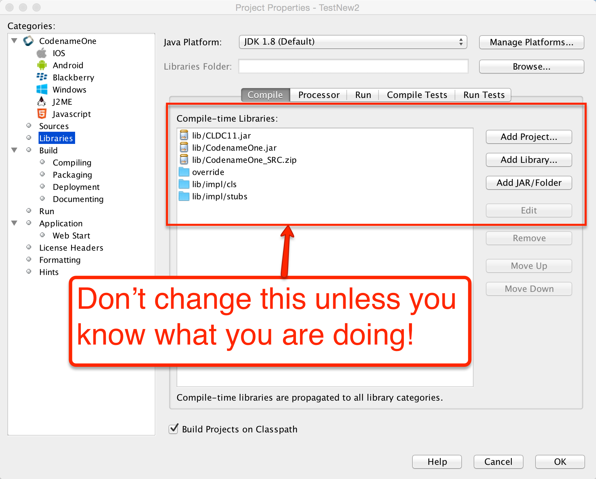

Cn1libs are Codename One's file format for 3rd party extensions. It's physically a zip file containing other zip files and some meta-data.

==== Why not use JAR

A jar can be compiled with usage of any Java API that might not be supported, it can be compiled with a Java target version that isn't tested.

Jars don't include support for writing native code; you could use JNI in jars but that doesn't match Codename One's needs for native support (see section above).

Jars don't support "proper" code completion, a common developer trick is to stick source code into the jar but that prevents usage with proprietary code. Cn1libs provide full IDE code completion (with JavaDoc hints) without exposing the sources.

There are two use cases for wanting JARs and they both have different solutions:

. Modularity
. Working with an existing JARs

Cn1lib’s address the modularity aspect allowing you to break that down. Existing jars can sometimes be used native code settings but you would want to adapt the code to abide by Codename One restrictions.

==== How to use cn1libs

Codename One has a large repository of https://www.codenameone.com/cn1libs.html[3rd party cn1libs]. With the Maven build tool, you consume a cn1lib the same way you consume any other Maven dependency: by adding it to the `<dependencies>` section of your application's `common/pom.xml` file. A typical entry looks like:

[source,xml]
----
include::../demos/common/src/main/snippets/developer-guide/advanced-topics-under-the-hood.xml[tag=advanced-topics-under-the-hood-xml-005,indent=0]
----

Add the dependency *before* the `<!-- INJECT DEPENDENCIES -->` comment in `common/pom.xml`. The `-lib` suffix on the `artifactId` and the `<type>pom</type>` declaration are both important - they tell Maven to pull in the library's "lib" aggregator module rather than a plain jar. See <<creating-cn1libs>> for the full library-consumption guide.

TIP: Some cn1libs require additional configuration such as build hints. Always read the library author's instructions when integrating a 3rd party library.

.Legacy Ant projects
****
If you're still maintaining an Ant-based project, you can install a cn1lib by dropping its `.cn1lib` file into the project's `lib` directory and then right-clicking the project and selecting #Codename One# -> #Refresh cn1lib files# (which invokes the `refresh-libs` Ant task). This unpacks classes and stub sources into `lib/impl/cls` and `lib/impl/stubs`, and native sources into `lib/impl/native`. New projects should use Maven instead - see <<maven-project-workflow>>.
****

==== Creating a simple cn1lib

Codename One libraries are generated from the `cn1lib-archetype` Maven archetype, which creates a multi-module project containing a `common` module for your cross-platform Java sources and one module per native platform (iOS, Android, Java SE, JavaScript) for any native interfaces. The detailed walkthrough - command-line, IntelliJ IDEA, NetBeans, and Eclipse - lives in <<creating-cn1libs>>.

The quickest path from a shell:

[source,bash]
----
include::../demos/common/src/main/snippets/developer-guide/advanced-topics-under-the-hood.sh[tag=advanced-topics-under-the-hood-bash-001,indent=0]
----

Once the project is generated, add your cross-platform Java sources under `common/src/main/java`, CSS under `common/src/main/css`, and run `mvn install` from the project root to build. The build produces both a Maven artifact for pom-style consumption and a legacy `.cn1lib` file in `common/target` for users still on Ant.

==== Build hints in cn1libs

Some cn1libs are pretty simple to install - just add them as a Maven dependency in `common/pom.xml`. For example, many of the more elaborate cn1libs need some pretty complex configurations. This is the case when native code is involved where you need to add permissions or plist entries for the various native platforms to get everything to work. This makes the cn1lib's helpful but less than seamless which is where you want to go.

Codename One cn1libs include two files that can be placed into the root: `codenameone_library_required.properties` & `codenameone_library_appended.properties`.

In these files you can write a build hint as `codename1.arg.ios.plistInject=...` for the various hints.

TIP: Notice the usage of the properties syntax for the build hint with the `codename1.arg` prefix you would also need to escape reserved characters for properties files. +
The best way to discover the right syntax for such build hints is to set them through the build hints GUI in a regular project and copy/paste them from `codenameone_settings.properties` into the cn1lib file.

The obvious question is why do you need two files?

There are two types of build hints: required and appended.

Required build hints can be something like `ios.objC=true`
which you want to always work. For example: if a cn1lib defines `ios.objC=true` and another cn1lib defines `ios.objC=false`
things won't work since one cn1lib won't get what it needs... +
In this case you'd want the build to fail so you can remove the faulty cn1lib.

NOTE: If two cn1libs define `ios.objC=true` there will be no collision as the value would be identical

An appended property would be something like `ios.plistInject=<key>UIBackgroundModes</key><array><string>audio</string> </array>`

Notice that this can still collide for example: if a different cn1lib defines its own background mode. For example, there are many valid cases where `ios.plistInject` can be used for other things. In this case you will append the content of the `ios.plistInject` into the build hint if it isn't already there.

Keep these things in mind:

- Properties are merged with every "refresh libs" call not dynamically on the server. This means it should be pretty simple
for the developer to investigate issues in this process.

- Changing flags is problematic - there is no "uninstall" process. Since the data is copied into the
`codenameone_settings.properties` file. If you need to change a flag later on you might need to alert users to make changes to their properties essentially negating the value of this feature... +
be careful when adding properties here.

It's your responsibility as a library developer to decide which build hint goes into which file! +
Codename One can't automate this process as the whole process of build hints is by definition an ad hoc process.

The rule of thumb is that a build hint with a numeric or boolean value is always a required property. If an entry has a string that you can append with another string then its probably an appended entry.

These build hints are probably of the "required" type:

[source,properties]
----
include::../demos/common/src/main/snippets/developer-guide/advanced-topics-under-the-hood.properties[tag=advanced-topics-under-the-hood-properties-001,indent=0]
----

These build hints should probably be appended:

[source,properties]
----
include::../demos/common/src/main/snippets/developer-guide/advanced-topics-under-the-hood.properties[tag=advanced-topics-under-the-hood-properties-002,indent=0]
----

.cn1lib Structure/File Format
****
The cb1lib file format is quite simple, it's a zip file containing zip files within it with fixed names to support the various features.

The table below covers the files that can/should be a part of a cn1lib file:

.cn1lib structure
[cols="<2,^1,<3",options="header"]
|====
<| File Name
<| Required
<| Purpose
| main.zip             | &#10003; | Contains the bytecode and the library binary data. This is effectively the portable portion of the jar
| stubs.zip            | &#10003; | Stub source files (autogenerated) containing javadocs to provide code completion
| manifest.properties  | &#215;   | General properties of the library, this isn't used for much at the moment
| codenameone_ library_ appended.properties  | &#215;   | Discussed above
| codenameone_ library_ required.properties  | &#215;   | Discussed above
| nativeios.zip        | &#215;   | Native iOS sources if applicable
| nativeand.zip        | &#215;   | Native Android sources if applicable
| nativejavascript.zip | &#215;   | Native JavaScript sources if applicable
| nativese.zip         | &#215;   | Native Java SE sources if applicable
| nativewin.zip        | &#215;   | Native Windows sources if applicable
// vale-skip: Microsoft.FirstPerson: "ME" in "Java ME" is the Java Micro Edition platform abbreviation, not a first-person pronoun.
| nativeme.zip         | &#215;   | Native Java ME sources if applicable
|====

****

=== Integrating Android 3rd party libraries & JNI

While its pretty easy to use native interfaces to write Android native code some things aren't necessarily as
obvious. For example: if you want to integrate a 3rd party library, specifically one that includes native C JNI code this
process isn't as straightforward.

If you need to integrate such a library into your native calls you have the following options:

. The first option (and the easiest one) is to place a Jar file in the native/android directory. This will link
your binary with the jar file. Just place the jar under the native/android and the build server will pick it up and will
add it to the classpath. +
Notice that Android release apps are obfuscated by default which might cause issues with such libraries if they
reference APIs that are unavailable on Android. You can work around this by adding a build hint to the proguard
obfuscation code that blocs the obfuscation of the problematic classes using the build hint: +
`android.proguardKeep=-keep class com.mypackage.ProblemClass { *; }``

. Another option is the `aar` file is a binary format Google introduced to represent an Android Library project (similarly to the cn1lib format). One of the problem with the Android Library projects was the fact that it required the project sources which made it difficult for 3rd party vendors to publish libraries. +
As a result so android introduced the `aar` file which is a binary format that represents a Library project. To learn more about arr you can read link:https://developer.android.com/studio/projects/android-library.html#aar-contents[this]. +
+
You can link an `aar` file by placing it under the native/android and the build server will link it to the project.

. Another *obsolete approach* exists that you're mentioning for legacy purposes (for example: if you need to port code written with this legacy option). This predated the `aar` option from Google... Not all 3rd party tools can be packaged as a simple jar, some 3rd party tools need to declare activities add permissions, resources, assets, and/or even add native code (`.so` files). +
To link a Library project to your Codename One project open the Library project in Eclipse or Android Studio and make sure the project builds, after the project was built successfully remove the bin directory from the project and zip the whole project. +
+
Rename the extension from `.zip` to `.andlib` and place the andlib file under the `native/android` directory. The build server will pick it up and will link it to the project.

=== Integrating iOS 3rd party libraries

Reach for `ios.pods` first. CocoaPods resolves the dependency and its own
dependencies for you, keeps the upload small, and is described in
<<Using Cocoapods>>.

Not every SDK is published as a pod, though, and a vendor shipping a static
library and headers can't be installed that way. Those files go into the `ios`
module, which packages two directories into the native archive: put anything you
would compile or `#import` beside your own native sources in
`ios/src/main/objectivec`, and the vendor's binaries in `ios/src/main/resources`.

* `.h` headers go with the sources, in `ios/src/main/objectivec`.
* `.a` static libraries and `.bundle` resource directories go in
  `ios/src/main/resources`.
* A `.framework` has to be zipped first, keeping its name, so
  `MyFramework.framework` is placed as
  `ios/src/main/resources/MyFramework.framework.zip`.

NOTE: Those are the Maven paths. A legacy Ant project put every one of those in
`native/ios` instead, which is the layout older material refers to.

An SDK usually also expects a handful of the platform's own frameworks to be
linked. Name those in the `ios.add_libs` build hint, separated by semicolons. A
good many are linked by default already, so start with the vendor's list, build,
and add only what the linker actually asks for.

=== Drag & drop

Unlike other platforms that tried to create overly generic catch all APIs Codename One tried to make things as simple as possible.

In Codename One components can be dragged and drop targets are always components. The logic of actually performing the operation indicated by the drop is the responsibility of the person implementing the drop.

NOTE: Some platforms for example: AWT allow dragging abstract concepts such as mime type elements. This allows dragging things like a text file into the app, but that use case isn't realistic in mobile

The code below allows you to rearrange the items based on a sensible order. Notice it relies on the default `Container` drop behavior:

[source,java]
----
include::../demos/common/src/main/java/com/codenameone/developerguide/advancedtopics/RearrangeableItemsDemo.java[tag=rearrangeableItems,indent=0]
----

.Drag demo

To enable dragging a component it must be flagged as draggable using `setDraggable(true)`, to allow dropping the component onto another component you must first enable the drop target with `setDropTarget(true)` and override some methods (more on that later).

When dragging on top of a child component of a drop target the code recursively searches for a drop target parent. Dropping a component on the child will automatically find the right drop target, hence there is no need to make "everything" into a drop target.

You can override these methods in the draggable components:

* `getDragImage` - this generates an image preview of the component that will be dragged. This automatically generates a sensible default so you don't need to override it.

* `drawDraggedImage` - this method will be invoked to draw the dragged image at a given location, it might be useful to override it if you want to display some drag related information such as an icon based on location etc. (for example: a move/copy icon).

In the drop target you can override the following methods:

* `draggingOver` - returns true if a drop operation at this point is permitted. Otherwise releasing the component will have no effect.

* `dragEnter/Exit` - useful to track and cleanup state related to dragging over a specific component.

* `drop` - the logic for dropping/moving the component must be implemented here!

=== Android Lollipop ActionBar customization

When running on Android Lollipop (5.0 or newer) the native action bar will use the Lollipop design. This isn't applicable
if you use the https://www.codenameone.com/javadoc/com/codename1/ui/Toolbar.html[Toolbar] or https://www.codenameone.com/javadoc/com/codename1/ui/SideMenuBar.html[SideMenuBar] this will be used in the task switcher.

To customize the colors of the native `ActionBar` on Lollipop define a `colors.xml` file in the `native/android` directory
of your project. It should look like this:

[source,xml]
----
include::../demos/common/src/main/snippets/developer-guide/advanced-topics-under-the-hood.xml[tag=advanced-topics-under-the-hood-xml-006,indent=0]
----

=== Intercepting URLs on iOS & Android

A common trick in mobile application development, is communication between two unrelated applications.

In Android you can use intents which are pretty elaborate and can be used through `Display.execute`, but what if you would like to expose the functionality of your application to a different application running on the device. This would allow that application to launch your application.

This isn't something built into Codename One, but it does expose enough of the platform capabilities to enable that functionality rather on Android.

On Android you need to define an intent filter which you can do using the `android.xintent_filter` build hint, this accepts the XML to filter whether a request is relevant to your application:

[source,xml]
----
include::../demos/common/src/main/snippets/developer-guide/advanced-topics-under-the-hood.xml[tag=advanced-topics-under-the-hood-xml-007,indent=0]
----

You can read more about it in link:http://stackoverflow.com/questions/11421048/android-ios-custom-uri-protocol-handling[this stack overflow question].

To bind the `myapp://` URL to your application. As a result typing `myapp://x` into the Android browser will launch the application.

==== Passing launch arguments to the app

You can access the value of the URL that launched the app using:

[source,java]
----
include::../demos/common/src/main/java/com/codenameone/developerguide/advancedtopics/RearrangeableItemsDemo.java[tag=rearrangeableItems,indent=0]
----

This value would be null if the app was launched through the icon.

==== Android App-to-App contracts (Wallet/Issuer style flows)

Some integrations (wallet provisioning, issuer verification, secure step-up) need more than a URL launch. They require:

- a custom Android intent action,
- caller validation,
- asynchronous app logic (login/back end verification),
- a native `setResult(...)` response back to the caller.

In Codename One, keep this flow in two layers:

. *Android bridge activity* for contract lifecycle and `setResult(...)`.
. *Codename One app code* for business logic in `start()`.

===== Why this isn't implicitly generated by AndroidGradleBuilder

A generic bridge can't infer:

- expected caller package(s),
- required result extra names,
- approval/decline mapping rules,
- timeout/failure policy.

Those are contract-specific, so the bridge activity is intentionally app-defined.

===== Registering the bridge activity

Use `android.xapplication` to inject a dedicated bridge activity and bind the action it should receive:

[source,properties]
----
include::../demos/common/src/main/snippets/developer-guide/advanced-topics-under-the-hood.properties[tag=advanced-topics-under-the-hood-properties-003,indent=0]
----

Keep `codename1.arg.android.activity.launchMode=singleTask` on your main CN1 activity so app resume behavior is predictable.

===== Bridge activity responsibilities

A minimal bridge activity should:

. Receive and parse the incoming intent.
. Capture caller identity using `getCallingPackage()`.
. Launch or resume the CN1 app activity.
. Hold contract state until CN1 completes verification.
. Return `setResult(...)` and `finish()`.

IMPORTANT: For payment/wallet trust decisions, treat only `getCallingPackage()` as verified identity.
Don't rely on referrer extras for caller authentication because callers can spoof those values.
This implies the contract should be launched with `startActivityForResult(...)` so caller identity is available.

[sidebar]
.Wallet Contract Security Guidelines
****
Use this checklist when the integration can activate payment credentials or accounts:

. **Fail closed on missing verified caller**. If `android.intent.caller` is empty (or `android.intent.caller.verified` isn't `true`), reject the request and return a failure/cancel result. +
  _Where_: CN1 `start()` guard before any business logic.
. **Use an allow-list** of trusted caller package names and reject everything else. +
  _Where_: CN1 `start()` (or native bridge) before network calls.
. **Verify signing certificate fingerprints natively** for each allowed package. Package name checks alone aren't enough in high-trust wallet scenarios. +
  _Where_: native Android code (bridge activity/native interface), because this requires Android `PackageManager` APIs.
. **Check payload freshness** (nonce/timestamp/challenge) before approving. +
  _Where_: back end/API service as the source of truth.
. **Bind response to request** (request ID / correlation ID) and reject mismatched or replayed responses. +
  _Where_: back end first, then enforce in CN1/native completion flow.
. **Time-box bridge activity state** and fail closed on timeout, process death, or missing bridge instance. +
  _Where_: native Android bridge + CN1 timeout handling.
. **Audit log** caller package, request ID, decision, and failure reason (without storing full PAN/token data). +
  _Where_: back end and security telemetry pipeline.
****

Optional native Android example for certificate fingerprint verification (called from bridge/native layer before trusting caller):

[source,java]
----
include::../demos/android/src/main/java/com/example/wallet/WalletBridgeSecurity.java[tag=walletTrustedCallerSignature,indent=0]
----

[source,java]
----
include::../demos/android/src/main/java/com/example/wallet/WalletBridgeActivity.java[tag=walletBridgeActivity,indent=0]
----

===== Reading contract data in `start()`

Codename One exposes launch metadata through `AppArg` and `Display` properties. Read these in `start()`:

- `AppArg` (primary launch payload)
- `android.intent.action`
- `android.intent.data`
- `android.intent.type`
- `android.intent.caller`
- `android.intent.caller.verified`
- `android.intent.extra.<KEY>`

[source,java]
----
include::../demos/android/src/main/java/com/example/wallet/WalletLaunchHandlerSnippet.java[tag=walletLaunchStart,indent=0]
----

===== Returning results to the wallet API

Implement a small native interface method (Android implementation) that:

. gets `WalletBridgeActivity.getActive()`,
. verifies `getActive()` is non-null and fails closed if the bridge timed out/canceled,
. builds caller-specific result extras,
. calls `setResult(Activity.RESULT_OK, resultIntent)`,
. calls `finish()` on the bridge activity.

This is where you bind to the wallet contract's exact response schema. Keep these extra names in one place so upgrades are manageable.

===== Foreground behavior on Android 14/15

Foreground transitions are best-effort because Android may block background launches in some states. Build for:

- immediate resume when allowed,
- notification fallback when blocked.

iOS is practically identical to Android with some small caveats, iOS's equivalent of the manifest is the plist.

You can inject more data into the plist by using the `ios.plistInject` build hint.

The equivalent on the iOS side would be:

[source,xml]
----
include::../demos/common/src/main/snippets/developer-guide/advanced-topics-under-the-hood.xml[tag=advanced-topics-under-the-hood-xml-008,indent=0]
----

For example, that can conflict with the Facebook integration if you use `FacebookConnect` which needs access to the schemes. To work around this you can use the build hint `ios.urlScheme` for example:

[source,xml]
----
include::../demos/common/src/main/snippets/developer-guide/advanced-topics-under-the-hood.xml[tag=advanced-topics-under-the-hood-xml-009,indent=0]
----

[[native-peer-components]]
=== Native peer components

Many Codename One developers don't truly grasp the reason for the separation between peer (native) components and Codename One components. This is a crucial thing you need to understand if you plan on working with native widgets for example: Web Browser, native maps, text input, media and native interfaces (which can return a `PeerComponent`).

Codename One draws all its widgets on its own, this is a concept which was modeled in part after Swing. This
allows functionality that can't be achieved in native widget platforms:

. The Codename One GUI builder & simulator are almost identical to the device - notice that this also enables the build cloud, otherwise device specific bugs would overwhelm development and make the build cloud redundant.

. Ability to override everything - paint, pointer, key events are all overridable and replaceable. Developers can also paint
over everything for example: glasspane and layered pane.

. Consistency - provides identical functionality on all platforms.

This all contributes to your ease of working with Codename One and maintaining Codename One. More than 95%
of Codename One's code is in Java hence its portable and pretty easy to maintain!

==== Why does Codename One need native widgets at all

You need the native device to do input, html rendering etc. These are too big and too complex tasks for Codename One to
do from scratch.

They're sometimes impossible to perform without the native platform. For example: the virtual keyboard input on the devices is tied directly to the native text input. It's impractical to implement everything from scratch for all languages, dictionaries etc. The result would be sub-par.

A web browser can't be implemented in this age without a JavaScript JIT and including a JIT within an iOS app is prohibited by Apple.

==== Problems with native widgets

Codename One does pretty much everything on the EDT (Event Dispatch Thread), this provides a lot of cool features
for example: modal dialogs, invokeAndBlock etc.

For example native widgets have to be drawn on the devices native UI thread. +
This means that drawing looks something like this:

. Loop over all Codename One components and paint them.

. Loop over all native peer components and paint them.

This means that all peer components are drawn on top of the Codename One components.

NOTE: This was also the case in AWT/Swing to one degree or another...

==== Showing dialogs on top of peer components

Codename One grabs a screenshot of the peer, hide it and then you can show the screenshot. Since the screenshot is static it can be rendered through the standard UI. You can't do that always since grabbing a screenshot is an expensive process on all platforms and must be performed on the native device thread.

==== Why can't you combine peer component scrolling and Codename One scrolling

Since the form title/footer etc. Are drawn by Codename One the peer component might paint itself on top of them.
Clipping a peer component is often pretty difficult. Furthermore, if the user drags his finger within the peer
component he might trigger the native scroll within the might collide with your scrolling?

==== Native components in the first Form

Another problem might be counterintuitive. iOS has screenshot images representing the first form. If your first page is an HTML or a native map (or other peer widget) the screenshot process on the build server will show fallback code instead of the real thing thus providing sub-par behavior.

Its impractical to support something like HTML for the screenshot process since it would also look different from the web component running on the device.

TIP: The launch storyboard replaced the build server's screenshot generator. See <<ios-launch-storyboard,launch screen storyboard best practices>>.

=== Building your own Layout manager

A https://www.codenameone.com/javadoc/com/codename1/ui/layouts/Layout.html[Layout] contains all the logic for positioning Codename One components. It essentially traverses a Codename One https://www.codenameone.com/javadoc/com/codename1/ui/Container.html[Container] and positions components based on internal logic.

When you build the layout you need to take margin into consideration and make sure to add it into the position/size calculations. Building a layout manager involves two simple methods: `layoutContainer` & `getPreferredSize`.

`layoutContainer` is invoked whenever Codename One decides the container needs rearranging, Codename One tries to avoid calling this method and invokes it at the last possible moment. Since this method is expensive (imagine the recursion with nested layouts). Codename One marks a flag indicating layout is "dirty" when something important changes and tries to avoid "reflows."

`getPreferredSize` allows the layout to determine the size desired for the container. This might be a difficult call to make for some layout managers that try to provide both flexibility and simplicity.

Most of `FlowLayout` bugs stem from the fact that this method is impossible to implement efficiently for all the use cases of a nested `FlowLayout`. The size of the final layout won't necessarily match the requested size (it probably won't) but the requested size is taken into consideration, when scrolling and also when sizing parent containers.

This is a layout manager that arranges components in a center column aligned to the middle. You then show the proper usage of margin to create a stair like effect with this layout manager:

[source,java]
----
include::../demos/common/src/main/java/com/codenameone/developerguide/advancedtopics/CenterLayoutDemo.java[tag=centerLayout,indent=0]
----

.Center layout staircase effect with margin
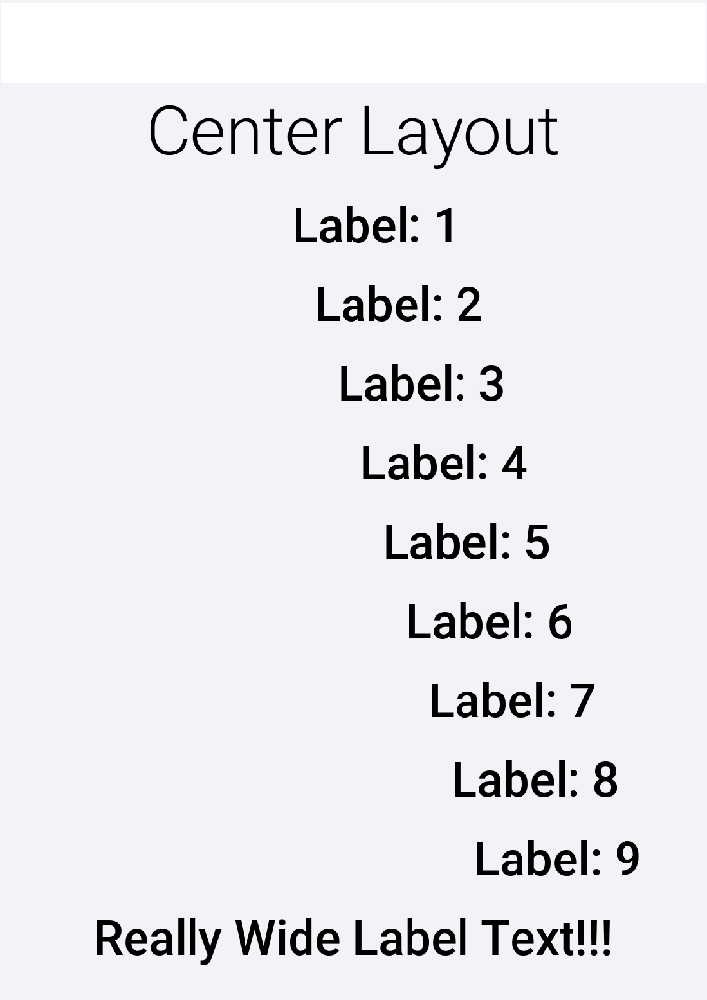

==== Porting a Swing/AWT Layout manager

The https://www.codenameone.com/javadoc/com/codename1/ui/layouts/GridBagLayout.html[GridBagLayout] was ported to Codename One considering the complexity of that specific layout manager. Here are some tips you should consider when porting a Swing/AWT layout manager:

. Codename One doesn't have `Insets`, but adds some support for them to port GridBag but components in Codename One have a margin they need to consider instead of the `Insets` (the padding is in the preferred size and is thus hidden from the layout manager).
. AWT layout managers also synchronize a lot on the AWT thread. This is no longer necessary since Codename One is single threaded, like Swing.
. AWT considers the top left position of the `Container` to be 0,0 whereas Codename One considers the position based on its parent `Container`. The top left position in Codename One is `getX()`, `getY()`.

Other than those things it’s fixing method and import statements, which are slightly different. Pretty trivial stuff.

=== Update framework

When Codename One launched in 2012 there was a need to ship updates and fixes faster than the plugin update system, leading to the client lib update system. There was also a need to update the designer tool (resource editor), the GUI builder, and the skins, as well as the built-in builder code (`CodeNameOneBuildClient.jar`).

The https://github.com/codenameone/UpdateCodenameOne[Update Framework] solves many problems in the old systems:

- Download once - if you have many projects the library will download once to the `.codenameone` directory. All the projects will update from local storage

- Skins update automatically - this is hugely important. When you change a theme you need to update it in the skins and if you don't update the skin you might see a difference between the simulator and the device

- Update of designer tools without an IDE plugin update - The IDE plugin update process is slow and tedious. This way a GUI builder fix can ship without a new IDE plugin release. The standalone Settings artifact is versioned with the Maven plugin instead.

This framework should be seamless. You should no longer see the "downloading" message whenever you push an update after your build client is updated. Your system would poll for a new version daily and update when new updates are available.

To force an update check, run `mvn cn1:update` from the project root.

==== How does it work

`mvn cn1:update` does two separate things.

First it makes sure `~/.codenameone/UpdateCodenameOne.jar` is there -- installed
from a resource bundled in the plugin, or downloaded if that resource is missing
-- and runs it. That's what keeps the shared tooling and the device skins under
`~/.codenameone` current, and it's why the download happens once per machine
rather than once per project. It no longer runs against your project directory,
which is why a Maven project has no jars of its own to update: the plugin hands it
a synthetic directory under `common/target/codenameone/update-dummy`, seeded with
the project's `codenameone_settings.properties`. It's under `common` because that
module holds `codenameone_settings.properties` and is therefore the one the plugin
treats as the Codename One project; run from the root, the aggregator skips itself
and `common` does the work.

Then it reads the plugin's Maven metadata, resolves the newest published release
and rewrites the `cn1.version` and `cn1.plugin.version` properties in the pom.

Which metadata it reads depends on the project. Releases are published to
https://repo.codenameone.com/maven2[the Codename One repository], and the mojo
uses it only when the project declares that host in BOTH `<repositories>` and
`<pluginRepositories>`. A project that declares it in one section only, or in
neither, is offered what Maven Central holds instead -- and Central keeps every
version published before the cutover but receives no new ones, so such a project
is told it's up-to-date at the last pre-cutover release however long it waits. The build log says so
when it happens. Adding the repository to both sections is the fix. The framework and plugin artifacts for that version then
resolve on the next build like any other dependency. The Resource Editor doesn't:
it's a separate artifact of around 43MB that's fetched when you run
`mvn cn1:designer`.

A project pinned to a `-SNAPSHOT` keeps its version, because a snapshot already
tracks the newest build. To move to a particular release rather than the newest
one, name it: `mvn cn1:update -DnewVersion=X.Y.Z`.

==== What isn't covered

You will notice 3 big things that aren't covered in this unified framework:

- You don't update cn1libs - whether you would like to update them automatically is unclear

- Versioned builds - a lot of complexity exists in the versioned build system. This might be something you address in the future but for now the framework stays simple.
