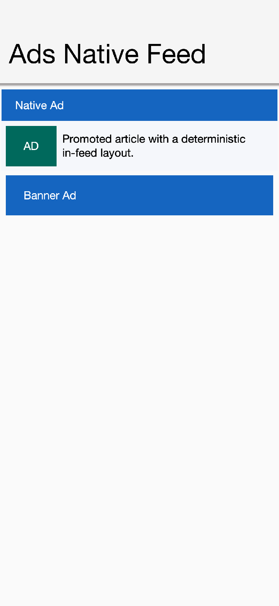

== Advertising

Codename One provides a pluggable advertising API under `com.codename1.ads`. The
framework defines the formats, the consent flow and the app/UI lifecycle
integration; an ad network is supplied by a separate library that implements the
provider interface. The reference implementation is the Google AdMob library
(`cn1-admob`), but the design is network agnostic - AdMob, AppLovin MAX, Unity
LevelPlay or a custom mediation layer all plug in the same way, with no changes
to the framework or the build.

The supported formats are:

* *Banner* - a small inline ad that lives in the component hierarchy
  (`com.codename1.ads.BannerAd`).
* *Interstitial* - a full screen ad shown at a natural break, such as between
  game levels (`com.codename1.ads.InterstitialAd`).
* *Rewarded* - an opt-in full screen ad that grants a reward for watching
  (`com.codename1.ads.RewardedAd`).
* *Rewarded interstitial* - an incentivized transition ad
  (`com.codename1.ads.RewardedInterstitialAd`).
* *App open* - shown when the app is brought to the foreground
  (`com.codename1.ads.AppOpenAd`).
* *Native* - assets you render with your own components
  (`com.codename1.ads.NativeAd`).

The screenshot below is the advertising sample running in the simulator against
the deterministic mock provider (`cn1-ads-mock`): a news feed with an in-feed
native ad (the "Sponsored" row, rendered with the app's own components) and an
anchored banner at the bottom.

.The advertising sample in the simulator: an in-feed native ad and a banner

=== Ad provider cn1libs

Several provider libraries ship with the framework. They're released to Maven
Central together with the core and the AI cn1libs, sharing the same version
(`${cn1.version}`), so you never mix versions. Each declares its own native SDK
dependencies (Pods / Gradle dependencies / permissions), applied automatically
when the library is on the classpath; you don't edit build hints by hand,
except for the per-app id described under <<_configuring_the_admob_application_id>>.

[cols="1,1,2", options="header"]
|===
| cn1lib | Provider class | Provides

| `cn1-admob` | `com.codename1.ads.admob.AdMobProvider` | Google AdMob on the
Google Mobile Ads SDK (banner, interstitial, rewarded, rewarded interstitial,
app open), with AdMob mediation behind it.
| `cn1-applovin` | `com.codename1.ads.applovin.AppLovinProvider` | AppLovin MAX
mediation (banner, interstitial, rewarded, app open).
| `cn1-unity-levelplay` | `com.codename1.ads.levelplay.LevelPlayProvider` |
Unity LevelPlay (ironSource) mediation (banner, interstitial, rewarded).
| `cn1-ads-mock` | `com.codename1.ads.mock.MockAdProvider` | A deterministic,
network-free provider that renders fixed labelled ads - for unit tests,
screenshot tests and trying the API in the simulator.
|===

Add the matching dependency to your project's `common/pom.xml`. The provider
libraries use a `-lib` aggregator with `<type>pom</type>` so Maven pulls in the
per-platform classifier jars:

[source,xml]
----
include::../demos/common/src/main/snippets/developer-guide/advertising.xml[tag=advertising-xml-001,indent=0]
----

`cn1-ads-mock` is a single cross-platform jar, so it needs no classifier:

[source,xml]
----
include::../demos/common/src/main/snippets/developer-guide/advertising.xml[tag=advertising-xml-002,indent=0]
----

=== Enabling a provider

Enable a provider once at startup. Each library exposes a static `install()`
method that registers its provider with `AdManager`:

[source,java]
----
include::../demos/common/src/main/snippets/developer-guide/advertising.java[tag=advertising-java-001,indent=0]
----

That single call binds the provider; the rest of your code uses only the
framework API in `com.codename1.ads`. If no provider is registered the API
stays safe: format support reports `false` and loads fail with
`AdError.CODE_UNSUPPORTED` instead of throwing, so a build without an ad library
still runs.

=== Initialization and consent

Collecting privacy consent is mandatory on modern platforms before personalized
ads can be served: in the EEA/UK the GDPR consent form must be shown (providers
wrap Google's User Messaging Platform or an equivalent), and on iOS the App
Tracking Transparency prompt must be presented to access the advertising
identifier. The recommended order is to initialize, gather consent, then load:

[source,java]
----
include::../demos/common/src/main/snippets/developer-guide/advertising.java[tag=advertising-java-002,indent=0]
----

`AdConfig` also carries the global compliance flags every network requires:
test mode, test device ids, child directed treatment, under-age-of-consent
treatment and a maximum ad content rating.

WARNING: Never ship a release build with `testMode` on, and never click live ads
during development - both violate ad network program policies. Use the test ad
unit ids while developing.

=== Banner ads

`BannerAd` is a regular Codename One component. Add it to a form (typically
anchored at the top or bottom) and call `load()`:

[source,java]
----
include::../demos/common/src/main/snippets/developer-guide/advertising.java[tag=advertising-java-003,indent=0]
----

The default `SIZE_ADAPTIVE` requests an anchored adaptive banner sized to the
available width, which is the recommended modern banner type.

=== Interstitial ads

Interstitials are event driven - load, then show when loaded, and preload the
next one when the current ad is dismissed:

[source,java]
----
include::../demos/common/src/main/snippets/developer-guide/advertising.java[tag=advertising-java-004,indent=0]
----

You can also let Codename One show an interstitial automatically on screen
transitions, no more often than a given interval:

[source,java]
----
include::../demos/common/src/main/snippets/developer-guide/advertising.java[tag=advertising-java-005,indent=0]
----

=== Rewarded and rewarded interstitial ads

Register a reward listener and grant the reward when it fires. For valuable
rewards, verify server side rather than trusting the client:

[source,java]
----
include::../demos/common/src/main/snippets/developer-guide/advertising.java[tag=advertising-java-006,indent=0]
----

`RewardedInterstitialAd` has the same API but is shown on a transition rather
than opt-in.

=== App open ads

App open ads are shown while the app is brought to the foreground. Let the
manager and provider handle the foreground hook and freshness window for you:

[source,java]
----
include::../demos/common/src/main/snippets/developer-guide/advertising.java[tag=advertising-java-007,indent=0]
----

=== Native ads

Native ads let you render the advertiser's assets with your own components, so
the ad matches the look and feel of the surrounding content. This is the format
to reach for in content driven apps - a news or social feed, a store listing, a
chat or a search results screen - where a banner feels bolted on but a row
styled like the others fits in. The ad must still be clearly labelled
(for example "Sponsored"):

[source,java]
----
include::../demos/common/src/main/snippets/developer-guide/advertising.java[tag=advertising-java-008,indent=0]
----

`NativeAd` exposes the headline, body, call-to-action, advertiser and rating
that you bind to your own components. Native ad support is an optional provider
capability; when the active provider doesn't support it, `NativeAdLoader`
reports the format as unsupported.

=== Configuring the AdMob application id

The GMA SDK requires your per-app AdMob application id in the native project.
Because it differs per app it's not baked into the library; set it with the
standard build hints in your project's `codenameone_settings.properties`:

[source,properties]
----
include::../demos/common/src/main/snippets/developer-guide/advertising.properties[tag=advertising-properties-001,indent=0]
----

The SDK dependencies themselves (the GMA pod / Gradle dependency and the
INTERNET permission) are declared by the `cn1-admob` library, so they're added
automatically when the library is on the classpath.

=== Implementing a provider

Third party networks plug in by implementing `com.codename1.ads.spi.AdProvider`
(and the optional `NativeAdProvider` capability) and calling
`AdManager.registerProvider(...)` - conventionally from a static `install()`
method. No framework or build-tool changes are required.

For tests and screenshots the framework ships a deterministic, network-free
provider, `MockAdProvider` (in `cn1-ads-mock`), that renders fixed, labelled ads
with stable sizes and colours. Enable it the same way:

[source,java]
----
include::../demos/common/src/main/snippets/developer-guide/advertising.java[tag=advertising-java-009,indent=0]
----
