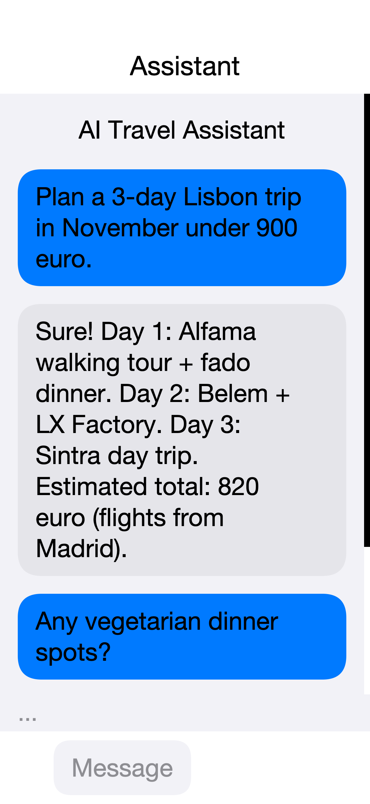

== AI, Chat UI, and Speech

[[ai-and-speech-section,AI And Speech Section]]
Codename One ships a portable LLM client, a streaming chat component,
speech-to-text and text-to-speech APIs, and a family of cn1lib bridges
that wire ML Kit into iOS and Android builds. All the public surface
lives next to the rest of the framework: the simulator, the cloud
builder, and your CI pipeline all run the same code.

This chapter introduces every piece in turn:

* `com.codename1.ai` -- provider-agnostic chat, embeddings, tool calls,
  and image generation.
* `com.codename1.components.ChatView` -- a theme-aware chat surface that
  streams tokens in place.
* `com.codename1.media.SpeechRecognizer` and
  `com.codename1.media.TextToSpeech` -- on-device speech-to-text and
  speech synthesis.
* `com.codename1.security.SecureStorage` non-prompting overloads --
  silent reads for secrets the network layer needs on every call, such
  as LLM API keys.
* The `cn1-ai-mlkit-*` cn1libs -- ML Kit barcode, document, and face
  detection bridges with the native build-time scanner already wired up.

NOTE: Each async call in this chapter returns an
`com.codename1.util.AsyncResource`. Use `.ready(...)` for the success
path, `.except(...)` for errors, and `.cancel()` to abort an in-flight
request. The streaming chat call also dispatches deltas through a
`StreamingListener`; both listener callbacks and `ready` callbacks fire
on the EDT.

=== The `com.codename1.ai` package

The `LlmClient` class is the single entry point. Static factories return
a configured client for each supported provider. Every client speaks the
same `ChatRequest` and `ChatResponse` value types, so the call site does
not change when you swap providers:

[source,java]
----
include::../demos/common/src/main/snippets/developer-guide/ai-and-speech.java.txt[tag=ai-and-speech-java-001,indent=0]
----

All five factories return the same `LlmClient` API. OpenAI, Ollama,
vLLM, and `llama.cpp` share the canonical wire format. Anthropic's
`https://api.anthropic.com/v1/chat/completions` and Google's
`https://generativelanguage.googleapis.com/v1beta/openai/chat/completions`
implement the same shape, so the framework speaks to all three through
one network layer. Default models pick a sensible production-grade
target per provider (`gpt-4o-mini`, `claude-sonnet-4-5`,
`gemini-2.0-flash`, `llama3.2`); override per request with
`ChatRequest.builder().model(...)`.

==== A first chat

`ChatRequest` is a builder. The bare minimum is a model identifier and
one user message:

[source,java]
----
include::../demos/common/src/main/snippets/developer-guide/ai-and-speech.java.txt[tag=ai-and-speech-java-002,indent=0]
----

`ChatResponse.getText()` concatenates every text part of the assistant
message. `getFinishReason()` returns one of `"stop"`, `"length"`,
`"tool_calls"`, `"content_filter"`, or `"error"`. `getUsage()` returns
prompt, completion, and total token counts when the provider reports
them; the fields return -1 when the provider omits them.

==== Streaming tokens

`chatStream(...)` opens an SSE connection and dispatches deltas through
a `StreamingListener` on the EDT. The returned `AsyncResource` resolves
to the final aggregated `ChatResponse` when the stream completes;
calling `cancel()` on the resource closes the underlying socket:

[source,java]
----
include::../demos/common/src/main/snippets/developer-guide/ai-and-speech.java.txt[tag=ai-and-speech-java-003,indent=0]
----

The decoder reassembles fragmented SSE deltas before invoking the
listener, so `onContentDelta` always receives a complete token chunk.
Tool-call fragments are reassembled the same way and surfaced through
`onToolCallDelta(index, id, name, argumentsFragment)`; `name` is non-null
on the first fragment and `id` is present on the first call.

==== Tool calling

`Tool` describes a callable function with a JSON schema. Pass a
`ToolHandler` to make it executable; the model can then call the tool
and the handler returns the JSON result that gets fed back into the
conversation:

[source,java]
----
include::../demos/common/src/main/snippets/developer-guide/ai-and-speech.java.txt[tag=ai-and-speech-java-004,indent=0]
----

`ToolChoice` covers the four standard modes:

* `ToolChoice.AUTO` -- the model picks at will (default).
* `ToolChoice.NONE` -- the model must not call any tool.
* `ToolChoice.REQUIRED` -- the model must call exactly one tool.
* `ToolChoice.named("get_weather")` -- force a specific tool.

==== Structured output

Constrain a response to JSON with `ResponseFormat.JSON_OBJECT`. The
client adds the provider-specific flag, and `ChatResponse.getText()`
returns a string the runtime can hand to `JSONParser`:

[source,java]
----
include::../demos/common/src/main/snippets/developer-guide/ai-and-speech.java.txt[tag=ai-and-speech-java-005,indent=0]
----

==== Multi-modal messages

Attach an image to a user message by adding an `ImagePart`. The part
accepts either inline bytes plus a MIME type or a remote HTTPS URL:

[source,java]
----
include::../demos/common/src/main/snippets/developer-guide/ai-and-speech.java.txt[tag=ai-and-speech-java-006,indent=0]
----

==== Embeddings

`embed(EmbeddingRequest)` returns one `Embedding` vector per input. Use
the vectors for semantic search, deduplication, or downstream
clustering:

[source,java]
----
include::../demos/common/src/main/snippets/developer-guide/ai-and-speech.java.txt[tag=ai-and-speech-java-007,indent=0]
----

==== Image generation

`ImageGenerator` mirrors the LLM client shape. The OpenAI factory drives
DALL-E 3 today; the on-device factory routes through the optional
`cn1-ai-stablediffusion` cn1lib (when present in the consumer project):

[source,java]
----
include::../demos/common/src/main/snippets/developer-guide/ai-and-speech.java.txt[tag=ai-and-speech-java-008,indent=0]
----

DALL-E 3 supports `count = 1` only. Larger batches require a different
underlying model; pass it via `setModel(...)`.

==== Conversation persistence

`ConversationStore` wraps `Storage` to serialize a list of
`ChatMessage` values to JSON under a named key:

[source,java]
----
include::../demos/common/src/main/snippets/developer-guide/ai-and-speech.java.txt[tag=ai-and-speech-java-009,indent=0]
----

`Tokenizer.estimateMessages(history)` returns a rough token count so you
can trim the oldest turns before the conversation outgrows the model's
context window.

==== Prompt templates

`PromptTemplate` does simple `{placeholder}` substitution. Unknown
placeholders pass through unchanged so partially-filled templates are
safe to log:

[source,java]
----
include::../demos/common/src/main/snippets/developer-guide/ai-and-speech.java.txt[tag=ai-and-speech-java-010,indent=0]
----

==== Retry policy

`RetryPolicy.exponentialBackoff()` returns a sensible default (four
attempts, 500ms initial delay, 30s cap, jitter). Wrap any chat call in a
retry loop yourself, or attach the policy to a higher-level wrapper.
`LlmException.getRetryAfterSeconds()` returns the provider's
`Retry-After` header value when present, or -1, so the policy can honor
rate-limit hints.

==== Simulator redirect for offline development

The JavaSE simulator pings `localhost:11434` at startup. When Ollama is
running, the simulator exports the flag `cn1.ai.ollamaDetected=true`. A
second system property, `cn1.ai.simulatorRedirect`, controls whether the
simulator transparently routes `LlmClient.openai(...)` calls to the
local Ollama endpoint instead:

[cols="1,3", options="header"]
|===
| Value | Behavior

| `disabled` | The default on a device. Calls go to the configured
provider, even in the simulator.
| `auto` | The default in the simulator. If Ollama is reachable, route
OpenAI calls through it. Otherwise behave like `disabled`.
| `ollama` | Force redirect to Ollama. Use this in offline-only
development environments.
|===

The redirect target is also configurable: `cn1.ai.ollamaUrl` defaults to
`http://localhost:11434/v1`, and `cn1.ai.ollamaModel` defaults to
`llama3.2`. Unchanged production code therefore runs offline against a
local model without any conditional wiring at the call site.

==== Storing the API key

WARNING: Never hard-code a provider API key in source, ship it in a
bundled resource, or commit it to git. Mobile binaries are trivially
reverse-engineered; any key embedded in the app is a key your users
can extract. Fetch the key from a server endpoint that the user
authenticates against, then cache it locally with the non-prompting
`SecureStorage` overloads:

[source,java]
----
include::../demos/common/src/main/snippets/developer-guide/ai-and-speech.java.txt[tag=ai-and-speech-java-011,indent=0]
----

=== The `ChatView` component

`ChatView` is a scrollable, theme-aware chat surface that handles the
list of bubbles, the streaming append, the typing indicator, and the
input strip in one component. Drop it into a `Form` with a single
`BorderLayout.CENTER`:

.`ChatView` rendered in the JavaSE simulator under the iOS Modern theme

The component exposes thread-safe `addMessage`, `appendToLastMessage`,
and `setTypingIndicatorVisible` methods, so background callbacks from
`chatStream(...)` can mutate the view directly:

[source,java]
----
include::../demos/common/src/main/snippets/developer-guide/ai-and-speech.java.txt[tag=ai-and-speech-java-012,indent=0]
----

`ChatBubble` and `ChatInput` are public, so subclass them for custom
rendering. Override `ChatView.createBubble(message)` to swap in a
custom subclass when the view builds the message list.

==== Theming

`ChatView` exposes the following UIIDs out of the box:

[cols="1,2", options="header"]
|===
| UIID | Applies to
| `ChatView` | The outer container.
| `ChatViewMessages` | The scrollable message column.
| `ChatBubbleUser` | The container for a user message.
| `ChatBubbleAssistant` | The container for an assistant message.
| `ChatBubbleSystem` | The container for a system message.
| `ChatBubbleText` | The inner `TextArea` of every bubble.
| `ChatTypingIndicator` | The animated typing dots.
| `ChatInput` | The input strip.
| `ChatInputField` | The text field inside the strip.
| `ChatSendButton` | The send button.
| `ChatAttachButton` | The attach button.
| `ChatVoiceButton` | The voice button.
|===

Style them from `theme.css` to align with the rest of the app. Hide the
voice or attach button by leaving its listener unset; the corresponding
`Button` instance is hidden when no `ActionListener` is registered.

==== One-call binding to an LLM

`LlmChatBinding.bind(view, client, baseRequest)` wires the input bar
directly to `chatStream(...)`. Every send replays the conversation
history, dispatches the response into the view, and updates the typing
indicator. Use it for prototypes, or as a reference implementation when
you need a custom send pipeline:

[source,java]
----
include::../demos/common/src/main/snippets/developer-guide/ai-and-speech.java.txt[tag=ai-and-speech-java-013,indent=0]
----

=== Speech recognition and TextToSpeech

The new media APIs route through `Display` and into the implementation
hooks on `CodenameOneImplementation`, so the call surface is identical
on every platform. The default implementation returns `false` from
`isSupported()` and is a no-op for `recognize`/`speak`.

==== `SpeechRecognizer`

[source,java]
----
include::../demos/common/src/main/snippets/developer-guide/ai-and-speech.java.txt[tag=ai-and-speech-java-014,indent=0]
----

iOS uses `SFSpeechRecognizer`, Android uses `android.speech.SpeechRecognizer`,
and the JavaSE simulator stays unsupported unless the optional
`cn1-ai-whisper` cn1lib is on the classpath. Call `stop()` to end an
active session early; partial results stop firing immediately.

==== `TextToSpeech`

[source,java]
----
include::../demos/common/src/main/snippets/developer-guide/ai-and-speech.java.txt[tag=ai-and-speech-java-015,indent=0]
----

iOS uses `AVSpeechSynthesizer`, Android uses
`android.speech.tts.TextToSpeech`, and the JavaSE simulator falls back
to `say` on macOS, `espeak` on Linux, and the platform `SAPI` bridge on
Windows.
`getAvailableVoices()` returns the platform-specific voice identifiers
when the OS exposes them; `setVoiceId(...)` accepts any of those
strings, or `null` to use the default voice for the configured
language.

=== ML Kit cn1libs

Three cn1libs ship with the framework today, each backed by ML Kit on
both platforms. The build-time scanner picks up the `com.codename1.ai.*`
class references in your code and injects the matching Pods, Swift
Packages, Gradle dependencies, `Info.plist` usage strings, and Android
permissions; you don't edit build hints by hand.

[cols="1,1,2", options="header"]
|===
| cn1lib | Public API | Provides

| `cn1-ai-mlkit-barcode` | `BarcodeScanner.scan(byte[])` | Decode QR,
EAN, Code 128, and the other ML Kit-supported barcode formats from an
image.
| `cn1-ai-mlkit-docscan` | `DocumentScanner.scanToFile(byte[])` |
Capture and crop document photos. On iOS this routes through `VisionKit`
and on Android through the Google Play Services document scanner.
| `cn1-ai-mlkit-face` | `FaceDetector.detect(byte[])` | Detect faces and
return packed `int[]` bounding rectangles (four ints per face: x, y,
width, height).
|===

==== Adding a cn1lib

Add the dependency to `common/pom.xml` with `<type>pom</type>` so Maven
pulls in the per-platform classifier jars:

[source,xml]
----
include::../demos/common/src/main/snippets/developer-guide/ai-and-speech.xml[tag=ai-and-speech-xml-001,indent=0]
----

==== Example: Scanning a barcode

[source,java]
----
include::../demos/common/src/main/snippets/developer-guide/ai-and-speech.java.txt[tag=ai-and-speech-java-016,indent=0]
----

==== Example: Face detection

[source,java]
----
include::../demos/common/src/main/snippets/developer-guide/ai-and-speech.java.txt[tag=ai-and-speech-java-017,indent=0]
----

NOTE: ML Kit barcode and face detection ship as small Pods or Gradle
dependencies that add a few megabytes to the binary. The document
scanner depends on Google Play Services on Android; on devices without
Play Services the call returns an error through `AsyncResource.except`.

==== Putting it all together

The pieces compose well. The following loop captures a photo,
extracts text with the multi-modal `gpt-4o` model, speaks the result,
and streams the same text into a `ChatView`:

[source,java]
----
include::../demos/common/src/main/snippets/developer-guide/ai-and-speech.java.txt[tag=ai-and-speech-java-018,indent=0]
----

The same code runs unchanged in the simulator when Ollama is detected,
on Android with the multi-modal native client, and on iOS through the
cloud build pipeline.
