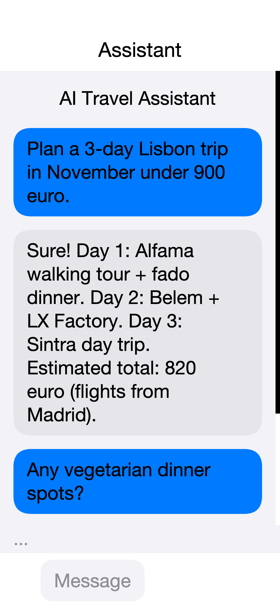

== AI, Chat UI, and Speech

[[ai-and-speech-section,AI And Speech Section]]
Codename One ships a portable LLM client, a streaming chat component,
speech-to-text and text-to-speech APIs, built-in vision and language
services, and a portable LiteRT inference API. The builders add native
frameworks and dependencies when application bytecode references the
corresponding entry point.

This chapter introduces every piece in turn:

* `com.codename1.ai` -- provider-agnostic chat, embeddings, tool calls,
  and image generation.
* `com.codename1.components.ChatView` -- a theme-aware chat surface that
  streams tokens in place.
* `com.codename1.media.SpeechRecognizer` and
  `com.codename1.media.TextToSpeech` -- on-device speech-to-text and
  speech synthesis.
* `com.codename1.security.SecureStorage` non-prompting overloads --
  silent reads for secrets the network layer needs on every call, such
  as LLM API keys.
* `com.codename1.ai.vision` -- OCR, barcode, face, labeling, pose,
  segmentation, document correction, and camera-frame pipelines.
* `com.codename1.ai.inference` -- reusable LiteRT sessions for
  `.tflite` models.
* `com.codename1.ai.language` -- language identification, translation,
  and smart reply.

NOTE: Each async call in this chapter returns an
`com.codename1.util.AsyncResource`. Use `.ready(...)` for the success
path, `.except(...)` for errors, and `.cancel()` to abort an in-flight
request. The streaming chat call also dispatches deltas through a
`StreamingListener`; both listener callbacks and `ready` callbacks fire
on the EDT.

=== The `com.codename1.ai` package

The `LlmClient` class is the single entry point. Static factories return
a configured client for each supported provider. Every client speaks the
same `ChatRequest` and `ChatResponse` value types, so the call site does
not change when you swap providers:

[source,java]
----
include::../demos/common/src/main/java/com/codenameone/developerguide/snippets/generated/AiAndSpeechJava001Snippet.java[tag=ai-and-speech-java-001,indent=0]
----

All five factories return the same `LlmClient` API. OpenAI, Ollama,
vLLM, and `llama.cpp` share the canonical wire format. Anthropic's
`https://api.anthropic.com/v1/chat/completions` and Google's
`https://generativelanguage.googleapis.com/v1beta/openai/chat/completions`
implement the same shape, so the framework speaks to all three through
one network layer. Default models pick a sensible production-grade
target per provider (`gpt-4o-mini`, `claude-sonnet-4-5`,
`gemini-2.0-flash`, `llama3.2`); override per request with
`ChatRequest.builder().model(...)`.

==== A first chat

`ChatRequest` is a builder. The bare minimum is a model identifier and
one user message:

`ChatResponse.getText()` concatenates every text part of the assistant
message. `getFinishReason()` returns one of `"stop"`, `"length"`,
`"tool_calls"`, `"content_filter"`, or `"error"`. `getUsage()` returns
prompt, completion, and total token counts when the provider reports
them; the fields return -1 when the provider omits them.

==== Streaming tokens

`chatStream(...)` opens an SSE connection and dispatches deltas through
a `StreamingListener` on the EDT. The returned `AsyncResource` resolves
to the final aggregated `ChatResponse` when the stream completes;
calling `cancel()` on the resource closes the underlying socket:

The decoder reassembles fragmented SSE deltas before invoking the
listener, so `onContentDelta` always receives a complete token chunk.
Tool-call fragments are reassembled the same way and surfaced through
`onToolCallDelta(index, id, name, argumentsFragment)`; `name` is non-null
on the first fragment and `id` is present on the first call.

==== Tool calling

`Tool` describes a callable function with a JSON schema. Pass a
`ToolHandler` to make it executable; the model can then call the tool
and the handler returns the JSON result that gets fed back into the
conversation:

`ToolChoice` covers the four standard modes:

* `ToolChoice.AUTO` -- the model picks at will (default).
* `ToolChoice.NONE` -- the model must not call any tool.
* `ToolChoice.REQUIRED` -- the model must call exactly one tool.
* `ToolChoice.named("get_weather")` -- force a specific tool.

==== Structured output

Constrain a response to JSON with `ResponseFormat.JSON_OBJECT`. The
client adds the provider-specific flag, and `ChatResponse.getText()`
returns a string the runtime can hand to `JSONParser`:

==== Multi-modal messages

Attach an image to a user message by adding an `ImagePart`. The part
accepts either inline bytes plus a MIME type or a remote HTTPS URL:

==== Embeddings

`embed(EmbeddingRequest)` returns one `Embedding` vector per input. Use
the vectors for semantic search, deduplication, or downstream
clustering:

==== Image generation

`ImageGenerator` mirrors the LLM client shape. The OpenAI factory drives
DALL-E 3 today; the on-device factory routes through the optional
`cn1-ai-stablediffusion` cn1lib (when present in the consumer project):

DALL-E 3 supports `count = 1` only. Larger batches require a different
underlying model; pass it via `setModel(...)`.

==== Conversation persistence

`ConversationStore` wraps `Storage` to serialize a list of
`ChatMessage` values to JSON under a named key:

`Tokenizer.estimateMessages(history)` returns a rough token count so you
can trim the oldest turns before the conversation outgrows the model's
context window.

==== Prompt templates

`PromptTemplate` does simple `{placeholder}` substitution. Unknown
placeholders pass through unchanged so partially-filled templates are
safe to log:

==== Retry policy

`RetryPolicy.exponentialBackoff()` returns a sensible default (four
attempts, 500ms initial delay, 30s cap, jitter). Wrap any chat call in a
retry loop yourself, or attach the policy to a higher-level wrapper.
`LlmException.getRetryAfterSeconds()` returns the provider's
`Retry-After` header value when present, or -1, so the policy can honor
rate-limit hints.

==== Simulator redirect for offline development

The JavaSE simulator pings `localhost:11434` at startup. When Ollama is
running, the simulator exports the flag `cn1.ai.ollamaDetected=true`. A
second system property, `cn1.ai.simulatorRedirect`, controls whether the
simulator transparently routes `LlmClient.openai(...)` calls to the
local Ollama endpoint instead:

[cols="1,3", options="header"]
|===
| Value | Behavior

| `disabled` | The default on a device. Calls go to the configured
provider, even in the simulator.
| `auto` | The default in the simulator. If Ollama is reachable, route
OpenAI calls through it. Otherwise behave like `disabled`.
| `ollama` | Force redirect to Ollama. Use this in offline-only
development environments.
|===

The redirect target is also configurable: `cn1.ai.ollamaUrl` defaults to
`http://localhost:11434/v1`, and `cn1.ai.ollamaModel` defaults to
`llama3.2`. Unchanged production code therefore runs offline against a
local model without any conditional wiring at the call site.

==== Storing the API key

WARNING: Never hard-code a provider API key in source, ship it in a
bundled resource, or commit it to git. Mobile binaries are trivially
reverse-engineered; any key embedded in the app is a key your users
can extract. Fetch the key from a server endpoint that the user
authenticates against, then cache it locally with the non-prompting
`SecureStorage` overloads:

=== The `ChatView` component

`ChatView` is a scrollable, theme-aware chat surface that handles the
list of bubbles, the streaming append, the typing indicator, and the
input strip in one component. Drop it into a `Form` with a single
`BorderLayout.CENTER`:

.`ChatView` rendered in the JavaSE simulator under the iOS Modern theme

The component exposes thread-safe `addMessage`, `appendToLastMessage`,
and `setTypingIndicatorVisible` methods, so background callbacks from
`chatStream(...)` can mutate the view directly:

`ChatBubble` and `ChatInput` are public, so subclass them for custom
rendering. Override `ChatView.createBubble(message)` to swap in a
custom subclass when the view builds the message list.

==== Theming

`ChatView` exposes the following UIIDs out of the box:

[cols="1,2", options="header"]
|===
| UIID | Applies to
| `ChatView` | The outer container.
| `ChatViewMessages` | The scrollable message column.
| `ChatBubbleUser` | The container for a user message.
| `ChatBubbleAssistant` | The container for an assistant message.
| `ChatBubbleSystem` | The container for a system message.
| `ChatBubbleText` | The inner `TextArea` of every bubble.
| `ChatTypingIndicator` | The animated typing dots.
| `ChatInput` | The input strip.
| `ChatInputField` | The text field inside the strip.
| `ChatSendButton` | The send button.
| `ChatAttachButton` | The attach button.
| `ChatVoiceButton` | The voice button.
|===

Style them from `theme.css` to align with the rest of the app. Hide the
voice or attach button by leaving its listener unset; the corresponding
`Button` instance is hidden when no `ActionListener` is registered.

==== One-call binding to an LLM

`LlmChatBinding.bind(view, client, baseRequest)` wires the input bar
directly to `chatStream(...)`. Every send replays the conversation
history, dispatches the response into the view, and updates the typing
indicator. Use it for prototypes, or as a reference implementation when
you need a custom send pipeline:

=== Speech recognition and TextToSpeech

The new media APIs route through `Display` and into the implementation
hooks on `CodenameOneImplementation`, so the call surface is identical
on every platform. The default implementation returns `false` from
`isSupported()` and is a no-op for `recognize`/`speak`.

==== `SpeechRecognizer`

iOS uses `SFSpeechRecognizer`, Android uses `android.speech.SpeechRecognizer`,
and the JavaSE simulator stays unsupported unless the optional
`cn1-ai-whisper` cn1lib is on the classpath. Call `stop()` to end an
active session early; partial results stop firing immediately.

==== `TextToSpeech`

[source,java]
----
include::../demos/common/src/main/java/com/codenameone/developerguide/snippets/generated/AiAndSpeechJava015Snippet.java[tag=ai-and-speech-java-015,indent=0]
----

iOS uses `AVSpeechSynthesizer`, Android uses
`android.speech.tts.TextToSpeech`, and the JavaSE simulator falls back
to `say` on macOS, `espeak` on Linux, and the platform `SAPI` bridge on
Windows.
`getAvailableVoices()` returns the platform-specific voice identifiers
when the OS exposes them; `setVoiceId(...)` accepts any of those
strings, or `null` to use the default voice for the configured
language.

=== On-device vision

The vision API is three layers deep, and most applications only need the
first one. Start with the finished screen, drop to a component when the
screen has to look like your own, and drop to a single analyzer when you
are working on one image at a time.

==== Scanning a barcode or QR code

`CodeScanner` is an entire scanner screen in one call. It opens the
camera, decodes, restores the form you came from, and hands back the
code. This is the replacement for the `cn1-codescan` cn1lib:

[source,java]
----
include::../demos/common/src/main/java/com/codenameone/developerguide/snippets/VisionSnippets.java[tag=vision-code-scanner,indent=0]
----

The result completes with `null` when the user backs out -- the cn1lib's
`scanCanceled()` -- and fails through `except` when the camera can't be
opened, which is its `scanError()`. There is no third callback to
implement.

`CodeScannerOptions` rewords the screen and restricts which symbologies
end the scan, so a stray product barcode in the frame doesn't complete a
QR scan:

[source,java]
----
include::../demos/common/src/main/java/com/codenameone/developerguide/snippets/VisionSnippets.java[tag=vision-code-scanner-options,indent=0]
----

The `BarcodeFormat` constants are the portable symbology names every
backend maps onto, so no format literals are needed.

IMPORTANT: Three classes share the name `CodeScanner`. Import
`com.codename1.ai.vision.CodeScanner`. The other two are the
`cn1-codescan` cn1lib's `com.codename1.ext.codescan.CodeScanner` and the
long-deprecated `com.codename1.codescan.CodeScanner` in core, whose
`getInstance()` returns `null` on current targets.

==== Analyzing the live camera

`VisionCameraView` is a component that owns the camera and runs an
analyzer over its frames. It handles the session, the frame conversion,
the dropping of frames that inference has fallen behind, and the hop
back to the EDT; the
application implements one listener. It works with every analyzer, not
just barcodes:

[source,java]
----
include::../demos/common/src/main/java/com/codenameone/developerguide/snippets/VisionSnippets.java[tag=vision-camera-view,indent=0]
----

The analyzer is constructed by the application rather than named by a
feature constant. That's deliberate: the builders decide which native
vision dependency to package from the analyzer classes an application
references, so building the analyzer in your own code is what keeps a
face-detection app from also carrying the barcode and pose models.

The camera opens when the view is shown and is released when the user
navigates away, so a form transition can't leave the hardware held.
`close()` additionally releases the analyzer, for a screen that's
finished with for good.

NOTE: `setScaleType(...)`, and the mirroring a front camera asks for, are
honored in the simulator. The iOS and Android previews render fixed at
fill-and-crop and unmirrored, because neither port implements the
preview-scaling hook on `CameraImpl` yet. Treat both as requests rather
than guarantees on a device.

WARNING: The preview is a native view, and Codename One components can't
be painted over it on every platform -- iOS renders native peers behind
the Codename One layer, Android renders them in front. Put a reticle,
hints, and buttons around the preview rather than on top of it. Result
geometry can still be drawn over a *still* image, as below.

==== The analyzers

Each analyzer takes a `VisionImage` and returns a typed result. Create
one, reuse it across a sequence of images, and close it when finished.
Check `isSupported()` before offering the feature: availability depends
on the target, the linked backend, and the OS version.

`VisionImage` accepts JPEG, PNG, NV21, or RGBA8888 data.
`VisionImage.fromFile(path)` reads a gallery or captured photo,
`VisionImage.fromImage(image)` takes one already in memory -- passing an
`EncodedImage`'s original bytes straight through rather than re-encoding
-- and `VisionImage.fromCameraFrame(frame)` copies a live frame's
callback-owned buffers and preserves its rotation.

`BarcodeScanner` decodes codes from a still image:

[source,java]
----
include::../demos/common/src/main/java/com/codenameone/developerguide/snippets/VisionSnippets.java[tag=vision-still-barcode,indent=0]
----

`TextRecognizer` reads text. Over a file:

[source,java]
----
include::../demos/common/src/main/java/com/codenameone/developerguide/snippets/VisionSnippets.java[tag=vision-text,indent=0]
----

Or from the live camera, stopping at the first block that looks like the
value being hunted for:

[source,java]
----
include::../demos/common/src/main/java/com/codenameone/developerguide/snippets/VisionSnippets.java[tag=vision-text-live,indent=0]
----

`FaceDetector` returns bounds, head angles, and named landmarks. Cropping
a photo to the face it contains:

[source,java]
----
include::../demos/common/src/main/java/com/codenameone/developerguide/snippets/VisionSnippets.java[tag=vision-face-still,indent=0]
----

Read individual landmarks with `face.getLandmark(...)` and the
`FaceLandmarks` constants. Not every backend fills in every field:
`getSmilingProbability()` and `getTrackingId()` are negative when
unavailable, and Apple Vision reports neither.

`ImageLabeler` classifies what an image contains:

[source,java]
----
include::../demos/common/src/main/java/com/codenameone/developerguide/snippets/VisionSnippets.java[tag=vision-labels,indent=0]
----

The label text is the portable part. `ImageLabel.getIndex()` is a model
class index that differs between backends and is `-1` on Apple Vision, so
branch on `getText()`.

`PoseDetector` locates body joints. Backends detect different subsets of
the skeleton, so look joints up by name and handle a missing one:

[source,java]
----
include::../demos/common/src/main/java/com/codenameone/developerguide/snippets/VisionSnippets.java[tag=vision-pose,indent=0]
----

`SelfieSegmenter` separates a person from the background.
`SegmentationMask.cutOut(...)` applies the mask to the source image and
rescales it, since the mask has the model's resolution rather than the
frame's:

[source,java]
----
include::../demos/common/src/main/java/com/codenameone/developerguide/snippets/VisionSnippets.java[tag=vision-segmentation,indent=0]
----

`SegmentationMask.toMaskImage(rgb)` renders the mask itself as a
translucent tint, for highlighting the subject rather than cutting it out.

`DocumentScanner` flattens a photographed page:

[source,java]
----
include::../demos/common/src/main/java/com/codenameone/developerguide/snippets/VisionSnippets.java[tag=vision-document,indent=0]
----

==== Drawing the results

Bounds and points are normalized to the range 0 through 1 rather than
pixels, so one observation maps onto an image of any size.
`VisionRect.toBounds(component)` and `VisionPoint.toPoint(component)`
convert them into the absolute coordinates a `paint` method draws in:

[source,java]
----
include::../demos/common/src/main/java/com/codenameone/developerguide/snippets/VisionSnippets.java[tag=vision-overlay,indent=0]
----

The mapping stretches the whole normalized range across the destination,
which is right when the destination has the same aspect ratio as the analyzed
image. A live preview scaled with `ScaleType.CROP` doesn't, which is the
other half of why overlays belong on still images.

==== Scripting results in the simulator

The desktop has no on-device vision models. Rather than report every
analyzer as unsupported -- which would leave a scanner screen impossible
to build without a device -- the simulator returns whatever you script
under *Simulate > Vision*:

* *Vision Supported* turns the whole API off, so the `isSupported()`
  branch can be exercised.
* *Analysis outcome* switches between the scripted result, an empty
  result, `VisionException.UNSUPPORTED`, and a backend error. Every
  screen needs the "nothing found" and "it failed" paths, and this is how
  to reach them.
* The remaining items set the scripted values: the decoded code and its
  format, the recognized text, the image labels, how many faces are found
  and whether they're smiling, and whether a body pose is detected.

The scripted results carry plausible geometry, so overlay and debounce
code can be written and debugged before the app ever reaches a device.
Nothing in this section applies to a device build.

==== Backends and options

An image whose stored pixels aren't already upright needs its rotation
declared: `VisionImage.encoded(bytes, rotationDegrees)`. The one-argument
overload, and `fromFile(...)`, assume the pixels are upright and don't
inspect EXIF metadata; `fromCameraFrame(...)` takes the rotation from the
frame. `VisionOptions.minimumConfidence(...)` clamps finite and infinite
values to the range 0 through 1 and rejects NaN.

Android uses ML Kit. iOS and Mac native builds default to Apple Vision
and Core Image. iOS can select ML Kit explicitly:

[source,java]
----
include::../demos/common/src/main/java/com/codenameone/developerguide/snippets/generated/AiAndSpeechOnDeviceSnippet.java[tag=ai-and-speech-on-device-vision,indent=0]
----

==== Reading non-Latin text

`TextRecognizer` reads the Latin script by default. Select a writing
system with `VisionOptions.textScript(...)` to read Chinese, Devanagari,
Japanese, or Korean:

[source,java]
----
include::../demos/common/src/main/java/com/codenameone/developerguide/snippets/generated/AiAndSpeechOnDeviceSnippet.java[tag=ai-and-speech-on-device-vision-script,indent=0]
----

The selector names a script rather than a language, because that's what
the underlying recognizers are organized by. One script covers every
language written in it, and each script model also reads the Latin
characters mixed into the same page. Recognize one script per analyzer;
create a second analyzer when a screen needs both.

Android maps each script to the matching ML Kit recognizer. Apple
platforms map it to the Vision recognition languages for that script,
asking the OS which languages it supports rather than assuming a list.
When the OS recognizes none of them, the analysis fails with
`VisionException.UNSUPPORTED` rather than returning Latin OCR of the
page. Select `VisionBackends.mlKitTextRecognition()` to use ML Kit's
model for that script on iOS instead.

Each script is a separate model, and referencing `TextScript.japanese()`
is what adds it: the ML Kit script bundle on Android, and on iOS the
matching pod when the ML Kit backend was also selected. An application
that never names a script carries only the Latin model, and one that
names Japanese doesn't carry the Korean or Devanagari models.

On an iOS simulator, the Apple barcode backend uses Vision barcode
request revision 1. Newer simulator runtimes can otherwise complete a
barcode request without reporting valid QR codes. Physical devices use
the latest revision supplied by the OS. Test newer symbologies such as
Micro QR on a device, or select the matching ML Kit backend.

Create and reuse an analyzer when processing a sequence. Call `close()`
when the analyzer is no longer needed. Before showing a feature, call
its `isSupported()` method: availability can depend on the target,
linked backend, and OS version.

`VisionPipeline` attaches an analyzer to a `CameraSession` frame stream
and keeps only the newest pending frame. Live OCR and pose detection
therefore can't build an unbounded queue when inference is slower than
the camera. While an analysis is busy, the pipeline reuses the pending
buffer when newer same-sized frames replace it. Results and errors are
delivered on the Codename One EDT.

`CameraFrame.getRawBytes()` can be `null` even after requesting NV21 or
RGBA8888 when a port can't expose that format. JPEG bytes remain available;
`VisionImage.fromCameraFrame(...)` automatically selects that fallback.

`DocumentScanner` currently performs still-image rectangle correction on
Apple platforms. Google's Android document scanner is an interactive
camera flow rather than an analyzer for an existing `VisionImage`, so the
Android backend reports it as unsupported rather than launching a UI flow.

==== Vision feature and dependency selection

The Java package is always part of core. The builders scan the concrete
analyzer classes and retain only the native adapter and dependency for
each class the application actually uses:

[cols="2,2,3",options="header"]
|===
| API | Android | Apple default / optional backend

| `TextRecognizer`
| ML Kit text recognition
| Vision / `GoogleMLKit/TextRecognition`

| `TextScript` (non-Latin)
| ML Kit bundle for that script
| Vision recognition languages / `GoogleMLKit/TextRecognition<Script>`

| `BarcodeScanner`, `CodeScanner`
| ML Kit barcode scanning
| Vision / `GoogleMLKit/BarcodeScanning`

| `FaceDetector`
| ML Kit face detection
| Vision / `GoogleMLKit/FaceDetection`

| `ImageLabeler`
| ML Kit image labeling
| Vision / `GoogleMLKit/ImageLabeling`

| `PoseDetector`
| ML Kit pose detection
| Vision / `GoogleMLKit/PoseDetection`

| `SelfieSegmenter`
| ML Kit selfie segmentation
| Vision / `GoogleMLKit/SegmentationSelfie`

| `DocumentScanner`
| Unsupported for still images
| Core Image perspective correction
|===

`CodeScanner` selects the same barcode dependency `BarcodeScanner` does,
because it builds one internally; an application that references only the
ready-made screen still gets the decoder. `CodeScanner` and
`VisionCameraView` additionally select the camera natives, so neither has
to be paired with a `com.codename1.camera` reference to work.

The optional iOS ML Kit pod is added only when both the analyzer and its
feature-specific selector are referenced. For example,
`VisionBackends.mlKitBarcodeScanning()` adds only the barcode pod.
Current Google ML Kit iOS pods require iOS 15.5. Selecting one of these
optional backends automatically raises the effective application and
CocoaPods deployment target to 15.5 when the configured target is lower.
Referencing one Android analyzer doesn't compile or package the other
five adapters.

=== Portable LiteRT inference

`InferenceSession` loads `.tflite` data from bytes, a bundled resource,
or a private file. Android uses LiteRT and can request NNAPI. iOS uses
TensorFlow Lite Objective-C and may request the Core ML delegate. Both
mobile implementations fall back to CPU unless
`allowFallback(false)` is set. Android and iOS reject strict
`Accelerator.NPU` sessions: NNAPI can mix delegated and CPU operations,
and the Core ML delegate can schedule work across the Neural Engine, GPU,
and CPU. Neither reports that the entire graph ran on the requested NPU.
With fallback enabled, NPU selection is a best-effort accelerator
preference.
On iOS, strict `Accelerator.CORE_ML` sessions are also rejected because
the delegate doesn't report whether unsupported model operations remained
on LiteRT's CPU path.
The JavaSE simulator and targets without
a native LiteRT runtime, including Mac native, return `false` from
`InferenceSession.isSupported()`.

[source,java]
----
include::../demos/common/src/main/java/com/codenameone/developerguide/snippets/generated/AiAndSpeechOnDeviceSnippet.java[tag=ai-and-speech-on-device-inference,indent=0]
----

Open is asynchronous because model initialization can allocate native
resources. A session is reusable and supports multiple named inputs,
multiple outputs, and `resizeInput(...)`. A session serializes its mutable
native interpreter: while `run(...)` is pending, another run, input resize,
or input/output metadata query throws `IllegalStateException`. Tensor data is
copied across the port boundary. Always close the session.

Bundle small models as resources. For larger models use
`ModelCache.fetch(url, cacheKey, sha256)`, which downloads over HTTPS,
verifies the supplied SHA-256 digest, and reuses the app-private cached
file. The initial URL must use HTTPS. Ports that expose redirect responses
reject a redirect to HTTP and discard the temporary download. iOS follows
redirects below the portable network layer, so iOS requires the SHA-256
argument and rejects the unpinned two-argument overload. Supply the digest
on every platform for every third-party or remotely mutable model.
Interrupted downloads restart through a temporary `.download` file and are
never promoted to the cache until verification succeeds. Concurrent calls for
the same cache key and content identity share one download but receive
independent asynchronous resources. Canceling one caller suppresses only that
caller's notification; it doesn't cancel the shared download or the other
callers. When a cache key already has an active download, a request with a
conflicting URL or digest fails instead of sharing the temporary file.

=== On-device language services

`LanguageIdentifier`, `Translator`, and `SmartReply` share
`LanguageOptions`. Its minimum-confidence threshold clamps to 0 through 1 and
rejects NaN. Translation models are downloaded and cached by ML Kit when a
language pair is first used. Android and iOS builders
select `language-id`, `translate`, and `smart-reply` independently, so
using language identification alone doesn't package the other two
SDKs.

[source,java]
----
include::../demos/common/src/main/java/com/codenameone/developerguide/snippets/generated/AiAndSpeechOnDeviceSnippet.java[tag=ai-and-speech-on-device-language,indent=0]
----

`LanguageBackends.auto()` selects ML Kit on Android and Apple's Natural
Language framework for language identification on iOS. The Apple default
keeps arm64 simulator builds native and adds no third-party dependency.
`LanguageBackends.mlKitLanguageIdentification()` opts identification into
the ML Kit iOS pod. iOS translation and Smart Reply are explicit opt-ins:
use `LanguageBackends.mlKitTranslation()` or
`LanguageBackends.mlKitSmartReply()` respectively. Merely referencing
`Translator` or `SmartReply` doesn't add a pod or exclude the arm64
simulator. Selecting one of those ML Kit backends requires the x86_64
simulator slice and raises an iOS deployment target below 15.5.

The static language methods are convenient for one operation and close their
temporary backend after either success or failure. For repeated work, call
`LanguageIdentifier.open(...)`, `Translator.open(...)`, or
`SmartReply.open(...)`, reuse the returned feature session, and close it when
the last pending operation completes. Reusable sessions retain backend state
and, on Android, cache ML Kit clients and translation clients per language
pair.
Mac native and the other unsupported targets return `false` from the
language service `isSupported()` checks. Completion and failure callbacks
arrive on the EDT.

=== Platform availability

The public API and the unsupported fallback are present on every
Codename One target. Vision has native implementations on Android, iOS,
and macOS; Apple Vision is the default on Apple
targets and Android uses ML Kit. Language services and LiteRT inference
have native implementations on Android and iOS. JavaSE, JavaScript,
native Windows, native Linux, watchOS, and tvOS report unsupported for
these new APIs; Mac native reports unsupported for language and LiteRT.
No target sends data to a cloud inference service. Large
portable runtimes or model payloads for the remaining targets remain
appropriate opt-in libraries.

No build hints or cn1lib coordinates are required for the built-in
mobile implementations. The local Maven plugin and BuildDaemon use the
same `PlatformFeatureCatalog`, so local and cloud builds make the same
dependency decisions.

=== Migrating from the AI cn1libs

The old `com.codename1.ai.mlkit.*` and `com.codename1.ai.tflite`
packages aren't compatibility aliases. Remove those dependencies and
move directly to `com.codename1.ai.vision`,
`com.codename1.ai.language`, or `com.codename1.ai.inference`. Result
coordinates are normalized floats rather than packed
platform-specific integer arrays. `cn1-ai-whisper` and
`cn1-ai-stablediffusion` remain cn1libs because their native payloads
and models are intentionally large.

Remove the retired cn1lib dependency before adding the built-in class.
During migration, the builders deduplicate identical CocoaPods names and
preserve an explicitly declared user version constraint. Removing the old
library is still required because compatibility aliases would keep its old
native-interface and packaging contracts alive.

==== Putting it all together

The pieces compose well. The following loop captures a photo,
extracts text with the multi-modal `gpt-4o` model, speaks the result,
and streams the same text into a `ChatView`:

The same code runs unchanged in the simulator when Ollama is detected,
on Android with the multi-modal native client, and on iOS through the
cloud build pipeline.
