== Running Android applications

A classic Android application -- activities, XML layouts, `res/values`,
drawables and the framework widgets -- can build and run as a Codename One
application without changes to its Java code or its resources. The Android
sources go into the Codename One project, the build compiles them against a
Codename One implementation of the `android.*` API, and the result runs on
every Codename One target: iOS, Android, the JavaScript port, the desktop
ports and the simulator.

There is no Android runtime involved. Views are Codename One components,
layouts follow Android's measure and layout rules, text fields are the
platform's native text fields, and resources are compiled into a compact table
at build time.

=== Quick start

Create a Codename One application project (for example from
https://start.codenameone.com[the initializr]), then import the Android
Studio project into it:

[source,bash]
----
include::../demos/common/src/main/snippets/developer-guide/android-interop.sh[tag=android-interop-bash-001,indent=0]
----

The goal copies the module's `src/main` (the `app` module unless
`-Dcn1.android.module` names another) into `common/src/main/android`, makes
the Codename One main class start the Android application, and lists the
module's Gradle dependencies the compatibility runtime covers and the ones it doesn't
cover. After that, run and build as usual:

[source,bash]
----
include::../demos/common/src/main/snippets/developer-guide/android-interop.sh[tag=android-interop-bash-002,indent=0]
----

You can also copy the files by hand. The directory mirrors an Android Studio
module's `src/main`:

----
common/src/main/android/
    AndroidManifest.xml
    res/          layouts, values, drawables, menus, fonts...
    assets/
    java/         the Android application's Java (and Kotlin) sources
    kotlin/       Kotlin sources, if the module keeps them apart
----

Kotlin sources compile with the application's Kotlin support, which the import
goal switches on when the module has any.

When the manifest declares no `package` (an Android Gradle plugin `namespace`
replaces it), add `package="..."` to the manifest or set the
`cn1.android.namespace` Maven property; the import goal does this for you.

=== How the build works

Three steps run as part of the normal build of the `common` module:

. *`compile-android-res`* (in `generate-sources`) compiles the manifest and
  `res/` tree. It writes the `R` class for the application package, a
  generated class with `new` for every activity in the manifest and every view
  class the layouts use, and a binary resource table with every value, style
  and compiled XML file. Images, fonts and assets are copied next to it.
. The Java compiler builds the application against the
  `codenameone-android-compat` artifact, which provides the `android.*` API.
  This is why the sources need no changes.
. *`remap-android`* (in `process-classes`) moves the compiled `android.*`
  references and the runtime classes under `com.codename1.androidcompat`, so
  nothing in the application uses a name the real Android framework owns. The
  application therefore also builds for Android without conflicts. This step
  also generates the dispatcher for `android:onClick` attributes from the
  methods that exist in the compiled classes.

Nothing is created by reflection: layouts are inflated from the compiled
table by calling constructors the build generated, which is what lets the
same code run on iOS.

The `codenameone-android-compat` dependency is added to the `common` module
by the project's `android-compat` profile, which activates when
`src/main/android` exists. Gradle projects get the same tasks
(`compileAndroidRes`) and the dependency automatically.

=== The entry point

If the project has no main class of its own, the build generates one that
starts the activity the manifest marks as the launcher. To customize startup,
write the class yourself; it needs one line:

[source,java]
----
include::../demos/android-interop/src/main/java/com/codenameone/developerguide/androidinterop/MyApp.java[tag=androidInteropEntryPoint,indent=0]
----

=== Resources

Resources resolve the way they do on Android:

* Every value type: strings (with formatting arguments and Android's quoting
  and escaping rules), plurals, string and integer arrays, colors, color state
  lists, dimensions in every unit, integers, booleans, fractions and ids.
* Styles and themes, including parent inheritance through `parent=` and dotted
  names, theme attributes (`?attr/colorPrimary`), `style=` on views, default
  widget styles from the theme and text appearances.
* Configuration qualifiers: locale and region, layout direction, smallest
  width, width and height, orientation, night mode, density buckets and API
  level. The best match for the device is chosen with Android's precedence
  rules and is re-evaluated when the device rotates or switches to dark mode.
* Drawables: PNG and JPEG images scaled from their density bucket,
  nine-patches, vector drawables (`<vector>` with groups, clip paths and theme
  tints), `<shape>`, `<selector>`, `<layer-list>`, `<inset>`, `<ripple>`,
  `<bitmap>` and `<color>`.
* Fonts in `res/font` and files in `res/raw` and `assets/`.

The framework's own resources -- the Material themes, `android.R.id`,
`android.R.color` and the widget styles -- are part of the runtime.

Problems are reported against the resource file and line with a stable code,
for example `src/main/android/res/layout/main.xml:12: <CalendarView> is not a
view class the Codename One Android runtime implements (android2cn1:E0201)`.

=== What's supported

* Activities with the complete lifecycle, explicit intents with extras,
  `startActivityForResult`, the back stack and `finish()`, implicit intents for
  web pages, phone numbers, mail, text messages and sharing, and configuration
  changes: an activity that doesn't declare `android:configChanges` is
  recreated with its saved state, as on Android.
* The action bar with the options menu and its overflow, `PopupMenu`,
  `PopupWindow` and `ListPopupWindow`.
* Fragments: `Fragment`, `FragmentManager` and transactions with the back
  stack, `ListFragment`, `DialogFragment`, `<fragment>` in layouts, child
  fragment managers and fragments' option menus. `ListActivity` is supported
  too.
* Layout inflation with `<include>`, `<merge>`, `<ViewStub>`, custom views
  (constructed with their `AttributeSet`), `android:theme` on views and
  `android:onClick`.
* Views drawn and measured as on Android: `View`, `ViewGroup`, `TextView`,
  `Button`, `EditText`, `AutoCompleteTextView`, `ImageView`, `ImageButton`,
  `LinearLayout`, `RelativeLayout`, `FrameLayout`, `TableLayout`, `GridLayout`,
  `ScrollView`, `HorizontalScrollView`, `Space`, `CheckBox`, `RadioButton` and
  `RadioGroup`, `Switch`, `ToggleButton`, `ProgressBar`, `SeekBar`, `RatingBar`,
  `NumberPicker`, `DatePicker`, `TimePicker`, `WebView`, and custom views that
  override `onMeasure`, `onLayout` and `onDraw` with `Canvas`, `Paint`, `Path`
  and `Matrix`.
* Lists and adapters: `ListView`, `GridView` and `Spinner` with view recycling,
  `ArrayAdapter`, `BaseAdapter`, `SimpleAdapter`, `CursorAdapter` and
  `SimpleCursorAdapter`.
* Touch input dispatched down the view tree, so `onInterceptTouchEvent`,
  `onTouchEvent` and touch listeners behave as written, and the back key.
* Dialogs: `AlertDialog`, `DatePickerDialog`, `TimePickerDialog`,
  `ProgressDialog` and `Toast`.
* Data and files: `SQLiteOpenHelper`, `SQLiteDatabase`, cursors and
  `ContentValues` over the platform's SQLite, `SharedPreferences`, the
  application's private directories (`getFilesDir()`, `getCacheDir()`,
  `openFileOutput()`), and `java.io.File` with the file streams, readers and
  writers.
* `Handler` and `Looper`, `Bundle`, `Uri`, `AssetManager` and `BitmapFactory`.
* Animation: view animations from `res/anim` (`alpha`, `translate`, `scale`,
  `rotate` and `set`) with `startAnimation`, layout animations, the framework
  and XML interpolators, `ViewFlipper` and the switchers, and property
  animation with `view.animate()`, `ValueAnimator`, `ObjectAnimator`,
  `AnimatorSet` and `res/animator` resources.
* XML: `getResources().getXml()` returns a pull parser over the compiled
  resource, and `Xml.newPullParser()` and `Xml.newSerializer()` read and write
  XML text.

=== AndroidX

The runtime includes the AndroidX libraries a classic application most often
depends on, so code written against them builds without changes:

* AppCompat: `AppCompatActivity` with `getSupportActionBar()` and
  `setSupportActionBar()`, the `Toolbar` widget with its navigation button,
  title, subtitle, logo, action buttons and overflow menu, `AlertDialog`,
  `SwitchCompat`, and the AppCompat versions of the framework widgets, which an
  AppCompat activity inflates in place of the framework tags so that
  `app:srcCompat`, `app:tint`, `app:backgroundTint` and `app:buttonTint` apply.
  The `Theme.AppCompat` themes, including the `DayNight`, `NoActionBar` and
  `DarkActionBar` variants and the `ThemeOverlay.AppCompat` overlays, and
  `AppCompatDelegate.setDefaultNightMode()`.
* `androidx.activity`: `ComponentActivity`, `OnBackPressedDispatcher` and
  `OnBackPressedCallback`, and the Activity Result API with the
  `StartActivityForResult`, `RequestPermission`, `RequestMultiplePermissions` and
  `GetContent` contracts.
* `androidx.core`: `ContextCompat`, `ResourcesCompat`, `ViewCompat`,
  `WindowCompat`, `WindowInsetsCompat`, `ActivityCompat`, `DrawableCompat`,
  `TextViewCompat`, `ImageViewCompat` and `HandlerCompat`.
* Fragments: `androidx.fragment.app.Fragment` with its own lifecycle and a
  separate one for its view (`getViewLifecycleOwner()`), `FragmentActivity` and
  `getSupportFragmentManager()`, transactions and the back stack, which the back
  key pops before the activity handles it, `FragmentContainerView` with
  `android:name`, `<fragment>` tags, `DialogFragment`, `ListFragment`, fragment
  results (`setFragmentResult()` and `setFragmentResultListener()`), the Activity
  Result API from a fragment, and `FragmentFactory`. `AppCompatActivity` is a
  `FragmentActivity`.
* `androidx.lifecycle`: `Lifecycle`, `LifecycleOwner`, `LifecycleRegistry`,
  `DefaultLifecycleObserver`, `LifecycleEventObserver` and
  `ProcessLifecycleOwner`; `ViewModel`, `AndroidViewModel` and
  `ViewModelProvider`, with view models of an activity or a fragment surviving a
  configuration change; `LiveData`, `MutableLiveData`, `MediatorLiveData` and
  `Transformations`; and `SavedStateHandle`.
* `androidx.annotation`.
* ConstraintLayout: `ConstraintLayout` with every `layout_constraint`
  attribute -- edges, baselines, circular positioning, bias, chains (spread,
  spread inside, packed and weighted), match-constraint sizes with their
  minimum, maximum and fraction of the parent, dimension ratios and gone margins --
  `Guideline`, `Barrier`, `Group`, `Placeholder`, `Flow`, `Layer` and
  `ConstraintSet`. Layouts are solved by ConstraintLayout's own solver, so
  views land where they do on Android.
* RecyclerView: view recycling with the shared `RecycledViewPool`, the view
  cache and stable ids; `LinearLayoutManager` (vertical and horizontal,
  `reverseLayout`, `stackFromEnd`, `scrollToPositionWithOffset()`),
  `GridLayoutManager` with `SpanSizeLookup`, and `StaggeredGridLayoutManager`,
  also set through `app:layoutManager`; touch scrolling and flings,
  `smoothScrollToPosition()` and `LinearSmoothScroller`; every adapter
  notification, payloads included; `ItemDecoration` and
  `DividerItemDecoration`; `DefaultItemAnimator`; `DiffUtil`, `ListAdapter` and
  `AsyncListDiffer`; `ItemTouchHelper` for swipe-to-dismiss and
  drag-to-reorder; and `LinearSnapHelper` and `PagerSnapHelper`.
* `ViewPager2` with a `RecyclerView.Adapter`, horizontal or vertical,
  `OnPageChangeCallback`, `setCurrentItem()`, page transformers and
  `MarginPageTransformer`.
* Material Components: the `Theme.MaterialComponents` and `Theme.Material3`
  themes (light, dark and `DayNight`, with or without an action bar) with the
  library's default color roles, type scale and corner shapes, and the
  `ThemeOverlay` variants. Under either theme a `<Button>` inflates as a
  `MaterialButton` and a `<CheckBox>`, `<RadioButton>`, `<TextView>` or
  `<AutoCompleteTextView>` as its Material version, as they do on Android. The widgets are `MaterialButton` (icon, corner radius,
  stroke, toggling through `MaterialButtonToggleGroup`), `MaterialCardView` and
  AndroidX `CardView`, `FloatingActionButton` and
  `ExtendedFloatingActionButton`, `TextInputLayout` with `TextInputEditText`
  (floating label, helper text, error, counter, filled and outlined boxes, the
  password toggle and clear-text icons, and the exposed drop-down menu),
  `Chip` and `ChipGroup`, `BottomNavigationView`, `TabLayout` with
  `TabLayoutMediator`, `MaterialToolbar` and `AppBarLayout`, `Snackbar`,
  `MaterialAlertDialogBuilder`, `MaterialSwitch` and `SwitchMaterial`,
  `MaterialCheckBox` and `MaterialRadioButton`, `Slider`,
  `LinearProgressIndicator` and `CircularProgressIndicator`,
  `BottomSheetDialog` with `BottomSheetBehavior`, and `MaterialDivider`.

The libraries' resources -- `Theme.AppCompat`, `?attr/colorPrimary`, `app:`
attributes, the `androidx.appcompat.R` class -- belong to the application's own
namespace, as they do in an Android Gradle build: the application refers to them
without a package, its `R` class lists them, and a resource it defines under a
library resource's name overrides the library's value.

=== Side by side with Android

The gallery in `scripts/android-compat-samples/gallery` is an ordinary Android
Studio module. Each image below shows one of its screens twice, both captured
on the same Android 16 emulator (720 by 1600 pixels at 320 dpi). On the left,
the module is built by Android Studio against the real framework and AndroidX
libraries. On the right, the same unmodified sources are built as a Codename
One application; this is the screen the screenshot tests capture on every
port.

A few differences are expected:

* On the left, the black band at the top is the emulator's display cutout; a
  Codename One application paints its toolbar color under the status bar.
* Codename One's bold face on Android is Roboto Condensed, so bold text sets
  narrower and wraps later.
* The native build targets API 34, so its window keeps the classic layout the
  sample was written for. From API 35, Android draws such an application
  edge-to-edge unless it handles the window insets itself.
* The screenshot test hides the indeterminate progress spinner on the widgets
  screen, because it never stops moving.

.Main screen
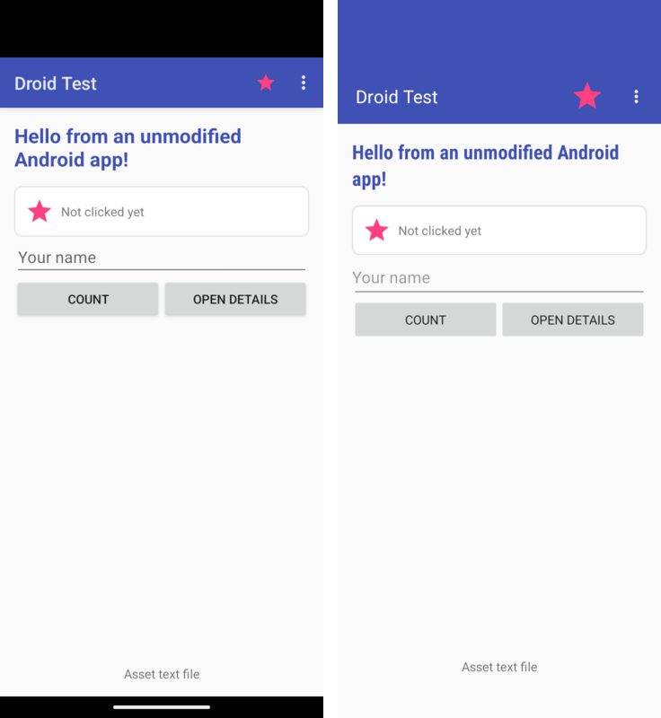

.Second activity
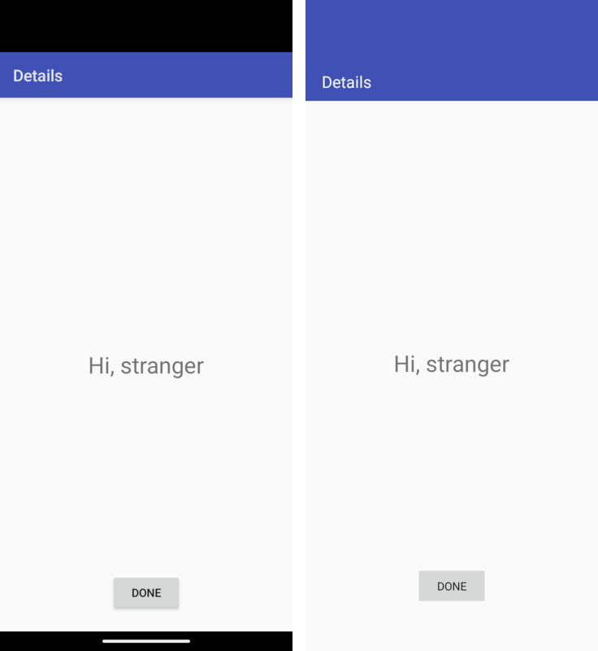

.Framework widgets
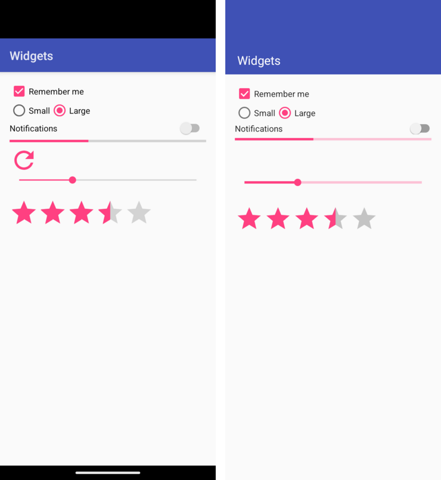

.ListView
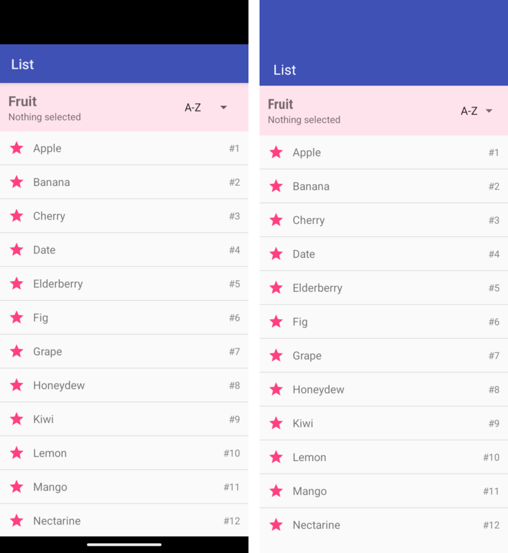

.Fragments
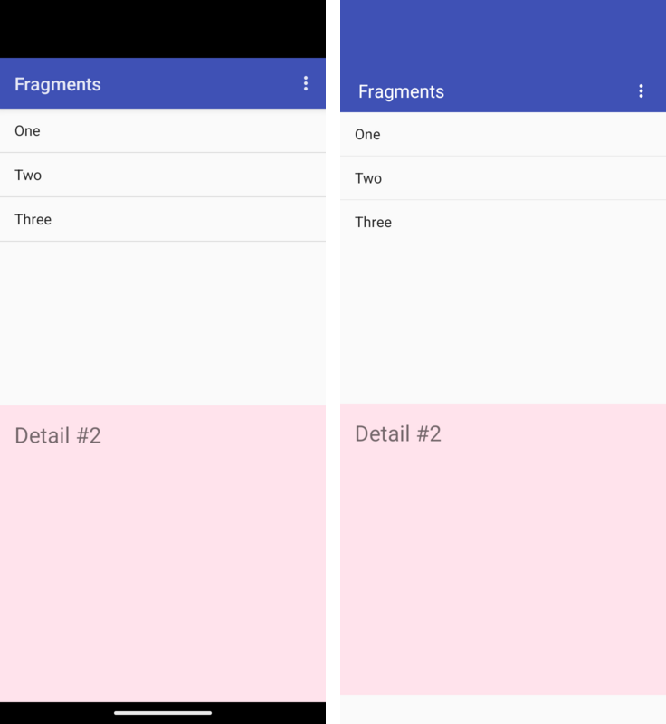

.Input controls
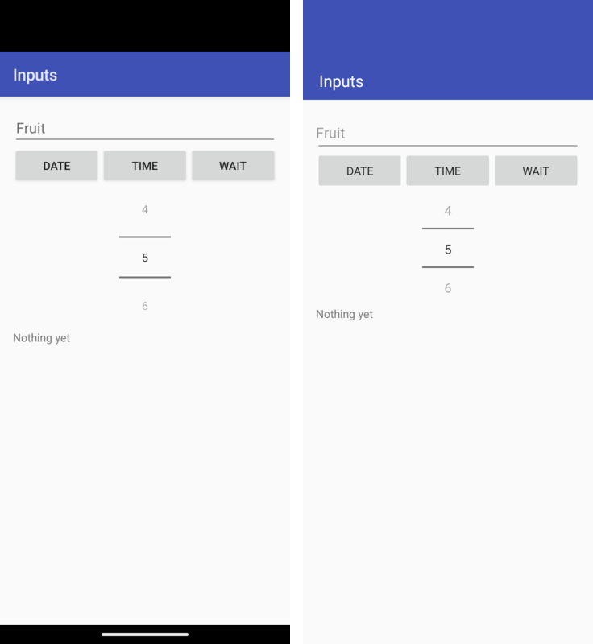

.Files and SQLite
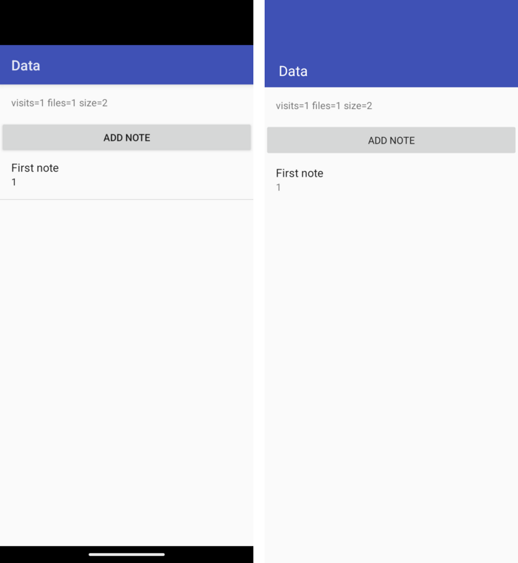

.AppCompat
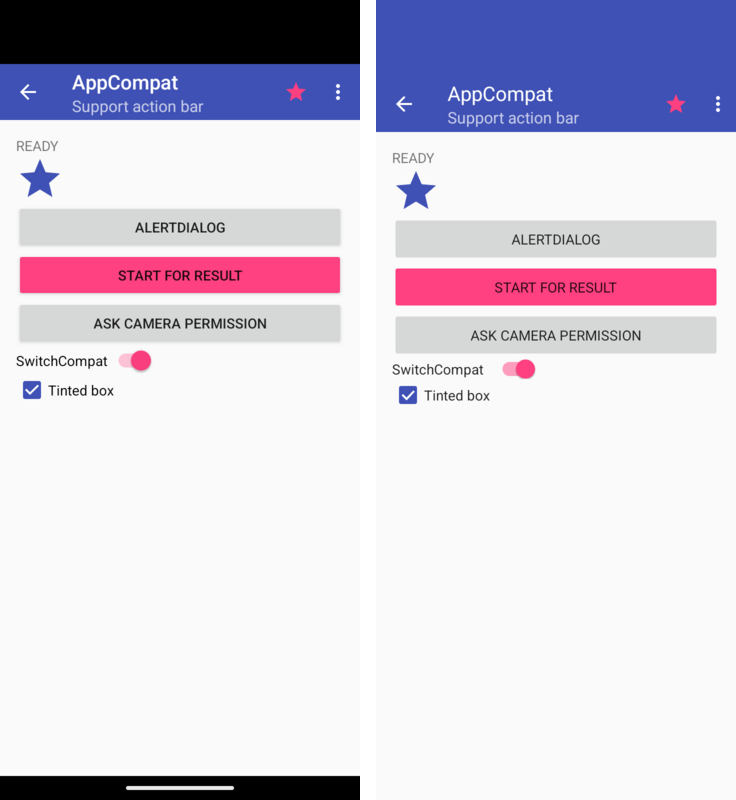

.ConstraintLayout
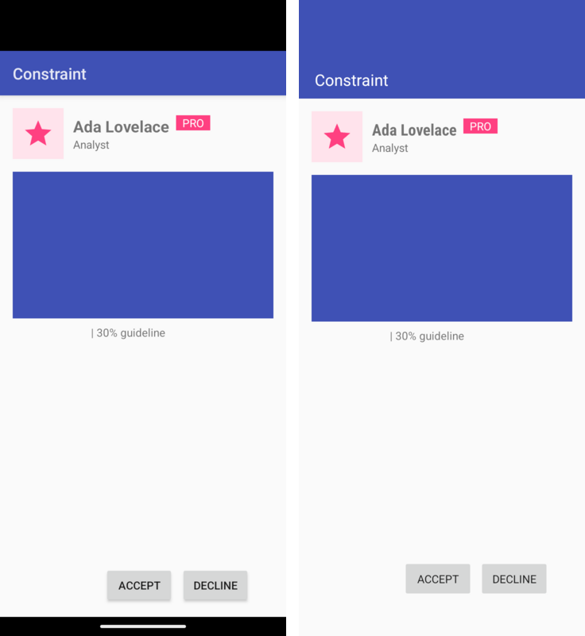

.ViewModel and LiveData
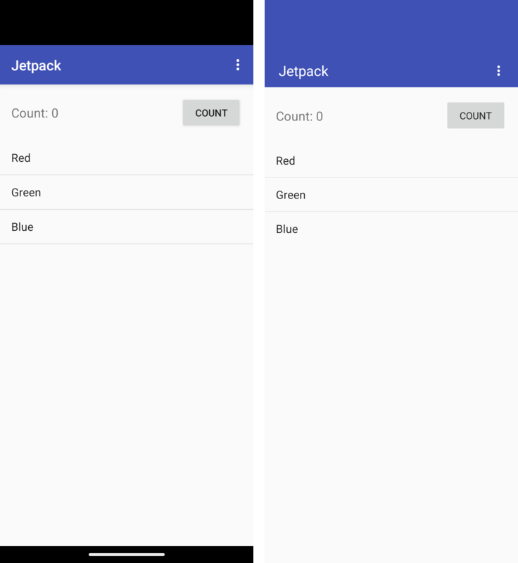

.RecyclerView
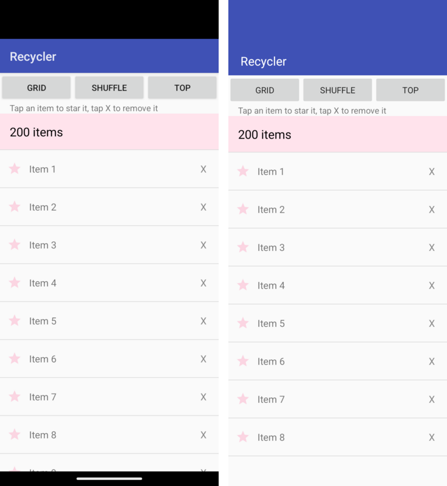

.Material Components
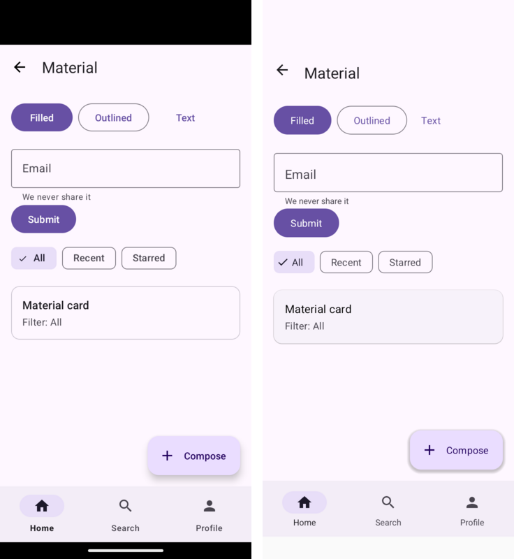

.Kotlin
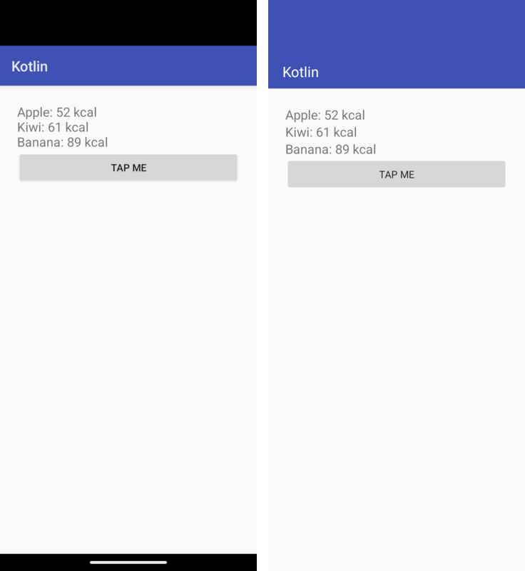

=== Limitations

This is a compatibility layer for classic Android application code using the
APIs described above. It does not promise complete Android framework behavior.
Validate the screens and data flows your application uses on its target ports;
the gallery and automated tests cover a subset of those behaviors.

* `Parcel` is an in-process value container, not Android's serialization or
  IPC format. Positions count values rather than bytes. `writeParcelable()`
  and `readParcelable()` retain and return the same object; they do not invoke
  `writeToParcel()` or `CREATOR`. Typed parcelable lists also retain their
  elements. Code that depends on serialization making a snapshot, creator-side
  validation, or restoring state after process death needs an explicit storage
  or copy implementation.
* SQLite uses one Codename One database connection. A competing thread's
  operations can throw `SQLiteDatabaseLockedException` while a transaction is
  open; Android's connection-pool waiting behavior is not implemented.
  Serialize database work through one worker when sharing a database across
  tasks. Full Android SQLite concurrency parity is outside this release's scope.
* Switching only a locale's script, such as `zh-Hans` to `zh-Hant` with the
  same region, updates resource selection but does not notify or recreate
  existing activities. Already-inflated text and layouts can retain the old
  script until the activity is recreated. Automatic handling of this live
  configuration change is deferred.
* The application's own code must avoid the JDK classes Codename One doesn't
  provide; the build's bytecode check reports them. The runtime provides the
  `java.io` classes Android code uses most (`File`, the file streams, readers
  and writers, the buffered streams and `PrintWriter`).
* Code that loads classes by name (`Class.forName`, reflection-based libraries)
  doesn't run on iOS, with or without this runtime.
* Content providers, services, broadcast intents from the system and
  notifications through `NotificationManager` aren't available; use the
  corresponding Codename One APIs through native interfaces or directly.
* `ViewModelProvider` creates view models without reflection: the build
  registers every public, concrete `ViewModel` class whose public constructor
  takes nothing, an `Application`, a `SavedStateHandle`, or an `Application`
  and a `SavedStateHandle`. A view model with another constructor needs a
  `ViewModelProvider.Factory` of the application's own, as on Android.
* The Kotlin extensions of the `-ktx` libraries (`by viewModels()`,
  `lifecycleScope`, the `commit { }` transaction builder) and coroutines aren't
  provided; use the Java API they wrap.
* An observer added to a `Lifecycle` hears events through
  `DefaultLifecycleObserver` or `LifecycleEventObserver`; methods annotated
  with `@OnLifecycleEvent` aren't called, because there's no reflection.
* System insets are always zero: Codename One lays an application out inside
  the safe area itself, so edge-to-edge drawing has no effect.
* `ObjectAnimator` finds a property by name only on the framework's own
  classes (view transforms, colors, progress, drawable alpha and level), because
  there is no reflection. Animate a property of your own class through an
  `android.util.Property` instead.
* A subclass of `Animation` or `Animator` that the application wrote must
  override `clone()` to be copied, for the same reason.
* `MotionLayout` isn't available. A `ConstraintSet` custom attribute sets
  the standard view and text properties (colors, alpha, rotation, scale,
  translation, text, text size, visibility and similar); a setter on a class of
  the application's own isn't called, because it's found by reflection on
  Android.
* Methods a `WebView` exposes to JavaScript with `addJavascriptInterface`
  return a JavaScript promise rather than the value, and the object is available
  once the page has loaded rather than during its inline scripts.
* `RecyclerView` item animations are the simple kind: items that move slide,
  new items fade in and removed items fade out, but an item that a change
  moves out of view doesn't slide out, and there are no predictive animations.
  `ListAdapter` and `AsyncListDiffer` compute the difference when the list is
  submitted, on the UI thread, and the scroll ends without an overscroll glow
  or a fast-scroll thumb.
* `CoordinatorLayout` isn't available, so a `layout_behavior` (a scrolling app
  bar, a button that hides on scroll) has no effect; a `Snackbar` appears at
  the bottom of the activity's content. `BottomSheetBehavior` drives the sheet
  of a `BottomSheetDialog` only. Material elevation shadows are drawn by the
  runtime and are softer than the platform's, a card doesn't clip its children
  to its rounded corners, and badges, centered toolbar titles and the
  `prefixText` and `suffixText` of a text field aren't shown; the build's
  compatibility report lists the ones an application uses.

=== Mixing Codename One and Android code

Any Android view can be placed in a Codename One form: its peer is an ordinary
Codename One component.

[source,java]
----
include::../demos/android-interop/src/main/java/com/codenameone/developerguide/androidinterop/EmbedAndroidView.java[tag=androidInteropEmbedView,indent=0]
----

Code in the application can also call Codename One APIs directly, which is how
features the Android API surface doesn't cover are added during a port.

A Codename One application can also open the screens of an Android module
without handing it the whole app. Install the runtime once, without launching
it, and start activities from its context:

[source,java]
----
include::../demos/android-interop/src/main/java/com/codenameone/developerguide/androidinterop/HostAndroidActivity.java[tag=androidInteropHostActivity,indent=0]
----

The form that was showing when the first activity started is remembered.
When the last activity finishes, through `finish()`, the back button or
`ActivityThread.finishAllActivities()`, that form is shown again instead of
the application exiting.
