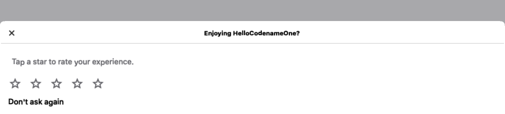

== App Review &amp; Feedback

Both Apple and Google provide an in-app review prompt that lets the user rate your app without leaving it. Asking for a review at the right moment is one of the most effective ways to improve your store rating. Codename One exposes this through the `com.codename1.appreview.AppReview` API, which uses the native review sheet (`SKStoreReviewController` on iOS, the Play In-App Review API on Android) when it's available and falls back to a Codename One drawn rating widget everywhere else (the simulator, desktop, the web target and older OS versions).

The native prompt is the store-sanctioned way to ask for a review, so prefer it over a hand-rolled dialog: the operating system controls how often it appears and throttles excessive prompts, which keeps your app within store policy.

=== Asking for a review

The simplest usage is a single call at a moment that makes sense in your app -- typically right after the user completed something rewarding (finished a level, saved a document, completed an order):

[source,java]
----
include::../demos/common/src/main/snippets/developer-guide/app-review.java[tag=app-review-java-001,indent=0]
----

`requestReview()` shows the native review sheet when the platform supports it. On platforms without a native prompt it shows the built-in rating widget instead. You decide the timing.

=== The engagement scheduler

Rather than picking the moment yourself, you can let `AppReview` decide based on simple engagement heuristics: how many times the app was launched, how long ago it was installed, and how long since it last asked. Configure it once (for example in your app's `init` or `start` method) and call `registerSession()` on every launch:

[source,java]
----
include::../demos/common/src/main/snippets/developer-guide/app-review.java[tag=app-review-java-002,indent=0]
----

`registerSession()` records the launch and, once the thresholds are met and the user hasn't already rated or opted out, prompts. The bookkeeping (launch count, install date, last-prompt time and a completion flag) is stored in https://www.codenameone.com/javadoc/com/codename1/io/Preferences.html[Preferences] so it survives restarts. Once the user rates the app or chooses to stop, `AppReview` stops prompting. Call `reset()` to clear this state.

TIP: You can combine both styles -- use `registerSession()` for the automatic cadence and still call `requestReview()` from a "Rate this app" menu item.

=== Smart feedback split

The fallback widget is presented as a bottom sheet, so the user can swipe it away instead of dismissing a blocking dialog. It asks for a star rating and then routes the user based on the result. A high rating (at or above the threshold set by `setHighRatingThreshold(int)`, four stars by default) sends the user to your store listing. A low rating opens a private feedback step instead, so unhappy users reach you directly rather than posting a one-star public review.

.The Codename One fallback rating sheet, shown when no native review prompt is available

By default the low-rating feedback is collected through an e-mail to the address passed to `setSupportEmail(String)`. To deliver feedback through your own backend, register a `FeedbackListener`:

[source,java]
----
include::../demos/common/src/main/snippets/developer-guide/app-review.java[tag=app-review-java-003,indent=0]
----

=== How the platform decides

`AppReview` checks `CN.isNativeInAppReviewSupported()` to choose between the native prompt and the fallback sheet. On Android the native path is active only when the app references the app-review API -- the build adds the Play In-App Review library in that case, so apps that never ask for a review carry no extra dependency. On iOS the StoreKit review controller is linked the same way, only when the API is used.

The native prompts are drawn by the operating system, so this guide can't show them as Codename One screenshots. On iOS the prompt is the StoreKit rating panel: a star selector the system overlays on your app, submitted without leaving it. On Android it's the Play In-App Review card that slides up from the bottom. Both are styled and rate-limited by the OS -- you can't theme them, force them to appear, or read the outcome, which is why the fallback sheet shown above renders on every other platform.

NOTE: The native review controllers hide whether the user submitted a rating, and may decline to show the prompt at all based on their own quotas. Treat a review request as best-effort; never block your UI waiting for a result.
