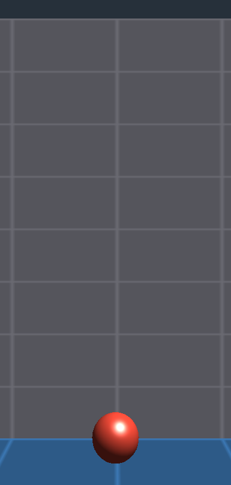

== Augmented Reality

The `com.codename1.ar` package composites virtual 3D content into the live camera image: the session tracks the device's position in the real world, detects surfaces, recognizes registered images and faces, and keeps virtual objects locked to real-world positions as the user moves. It's backed by ARKit on iOS and by ARCore (Google Play Services for AR) on Android, behind one portable API.

Referencing any class in the package is enough to wire the build: the class scanner injects the camera permission, the `NSCameraUsageDescription` plist entry (override the text with the `ios.NSCameraUsageDescription` build hint), links ARKit and SceneKit on iOS and adds the ARCore dependency plus the `com.google.ar.core` manifest entry on Android. Apps that never touch the package pay no size, permission or store-visibility cost. By default the Android manifest marks AR `optional` so the app still installs on devices without ARCore; set the `android.ar.required=true` build hint to make the app AR-only.

[WARNING]
====
Always guard AR functionality behind `AR.isSupported()`. Older devices, tvOS, watchOS, desktop builds and browsers report `false`; feature-specific hardware such as face tracking is gated through `AR.getCapabilities()`.
====

=== Concepts

[cols="1,3"]
|===
|Type |Role

|`AR`
|Static entry point: support and capability checks, permission request, session opening.

|`ARSession`
|The running AR experience. One session may be open at a time; it owns the view, the anchors and the detected planes, and delivers all events.

|`ARView`
|The component that renders the camera image composited with the anchored content. Add it to a form like any other component.

|`ARPose`
|An immutable position + rotation in world space: meters, right-handed, Y up, -Z forward from the initial camera direction. Converts to a `com.codename1.gpu.Matrix4` compatible matrix.

|`ARPlane`
|A detected real-world surface (floor, table, wall) that grows and refines as the session learns the environment.

|`ARHitResult`
|The intersection of a screen-point ray with real-world geometry; the bridge from a tap to a world position.

|`ARAnchor`
|A tracked fixed point in the real world. The attachment point for content; also delivered for recognized images (`ARImageAnchor`) and faces (`ARFaceAnchor`).

|`ARNode` / `ARModel`
|The content placed at an anchor: a small scene graph of nodes carrying glTF models or `com.codename1.gpu.Mesh` geometry.

|`ARLightEstimate`
|The real-world lighting estimate, polled per frame to shade content so it blends in.
|===

=== Getting started: Place a model on the floor

The canonical AR loop is: open a session, show its view, wait for a plane, hit test a tap, anchor content at the hit.

[source,java]
----
if (!AR.isSupported()) {
    ToastBar.showInfoMessage("AR is not supported on this device");
    return;
}
ARSession session = AR.open(new ARSessionOptions());
ARView view = session.createView();

Form f = new Form("AR", new BorderLayout());
f.add(BorderLayout.CENTER, view);
f.show();

byte[] modelBytes = ...; // a .glb asset, e.g. from getResourceAsStream
view.addPointerReleasedListener(e -> {
    float xn = (e.getX() - view.getAbsoluteX()) / (float) view.getWidth();
    float yn = (e.getY() - view.getAbsoluteY()) / (float) view.getHeight();
    session.hitTest(xn, yn).ready(hits -> {
        if (hits.length > 0) {
            ARAnchor anchor = hits[0].createAnchor();
            anchor.setNode(new ARNode(ARModel.fromGltf(modelBytes)));
        }
    });
});
----

`ARSessionOptions` configures the session before it opens: the tracking mode (`WORLD` or `FACE`), which plane orientations to detect, whether to estimate lighting, and the reference images to recognize. The defaults open a world tracking session with horizontal plane detection and light estimation, which suits the place-content-on-a-surface use case above.

=== Plane detection

Planes are delivered through `ARPlaneListener` as immutable snapshots: an `ADDED` event when a new surface is found, `UPDATED` snapshots (sharing the same `getId()`) as the surface grows, and `REMOVED` when a plane merges into another. `ARSession.getPlanes()` always reflects the latest snapshots.

[source,java]
----
session.addPlaneListener(ev -> {
    ARPlane p = ev.getPlane();
    System.out.println(ev.getKind() + " " + p.getType()
            + " " + p.getExtentX() + "x" + p.getExtentZ() + "m");
});
----

The plane's local frame has X/Z spanning the surface and Y along the normal; `getCenterPose()` positions that frame in the world. `ARPlane.Type` distinguishes upward-facing horizontal surfaces (floors, tables), downward-facing ones (ceilings) and vertical surfaces (walls) - request vertical detection with `ARSessionOptions.planeDetection(ARPlaneDetection.HORIZONTAL_AND_VERTICAL)`.

=== Hit testing and anchors

`hitTest(xNorm, yNorm)` shoots a ray from a normalized view coordinate into the world and resolves - on the EDT - with the intersections ordered nearest first. Prefer `ARHitResult.createAnchor()` over `session.createAnchor(pose)` when placing on detected geometry: the platform can then anchor to the exact native raycast, which tracks better as the environment refines.

Anchors survive tracking refinements: the session updates `getPose()` over time and reports the change through `ARAnchorListener`. Remove an anchor (and its content) with `detach()`. Content attaches through `setNode(ARNode)`:

[source,java]
----
ARNode root = new ARNode(ARModel.fromMesh(
        Primitives.sphere(0.15f, 24, 32, false), 0xffdd4433));
root.setLocalPosition(0, 0.15f, 0); // rest on the surface, not in it
anchor.setNode(root);
----

Node transforms are relative to the anchor, in meters. Nodes may nest (`addChild`), carry glTF assets (`ARModel.fromGltf`) or portable meshes (`ARModel.fromMesh`), and any mutation after attachment - position, rotation, scale, visibility, children - re-syncs the platform renderer automatically.

=== Light estimation

`session.getLightEstimate()` returns the latest estimate of the real-world lighting. It refreshes every frame without firing events, so poll it when rendering-relevant decisions are made. The ambient intensity is normalized so `1.0` means neutral indoor lighting; the color correction is a per-channel scale where `{1, 1, 1}` is neutral. Platform renderers already apply the estimate to anchored content; the API exposes it for custom logic such as prompting the user when the room is too dark.

=== Image tracking

Register printed images - posters, game boards, product labels - and the session anchors content to them when the camera sees them:

[source,java]
----
ARSessionOptions opts = new ARSessionOptions().referenceImages(new ARReferenceImage[]{
    new ARReferenceImage("poster", posterPngBytes, 0.42f) // physical width in meters
});
ARSession session = AR.open(opts);
session.addAnchorListener(ev -> {
    if (ev.getKind() == ARAnchorEvent.Kind.ADDED
            && ev.getAnchor() instanceof ARImageAnchor) {
        ARImageAnchor img = (ARImageAnchor) ev.getAnchor();
        System.out.println("Recognized " + img.getReferenceImageName());
        img.setNode(new ARNode(ARModel.fromGltf(overlayModel)));
    }
});
----

The physical width matters: the platform uses it to estimate the image's distance, so measure the real print. The anchor pose is centered on the physical image with local X/Z spanning its surface.

=== Face tracking

Face tracking is a distinct session configuration using the front camera; open it with `ARSessionOptions.trackingMode(ARTrackingMode.FACE)` after checking `AR.getCapabilities().isFaceTrackingSupported()`. Detected faces arrive as `ARFaceAnchor`s through the anchor listener, carrying the head pose plus optional finer geometry:

- `getRegionPose(ARFaceRegion)` returns the pose of a named region. Availability differs per platform (ARCore supplies the nose tip and forehead regions, ARKit supplies the eyes), which is why code must always handle a `null` region.
- `getMeshVertices()` / `getMeshTriangles()` expose the tracked face mesh where the platform provides one, or `null` where it does not.

=== Events and threading

Every listener fires on the EDT and every getter reflects the state as of the events delivered so far, so AR code follows normal Codename One threading rules with no extra synchronization. High-frequency refinements (anchor and plane updates, camera pose, light estimate) are coalesced: a slow EDT sees the latest values rather than a backlog. This contrasts with the `com.codename1.gpu.Renderer` callbacks used by the VR API, which run on the render thread.

=== The simulator and debugging

The Codename One simulator ships a simulated AR backend modeled on the Android emulator's virtual scene, so the full AR loop is debuggable with breakpoints without a device. When a session opens, the simulator "detects" the floor (and, when requested, a wall) of a virtual room after a short startup delay, mimicking real AR initialization. The AR view renders the room and every anchored model; drive the virtual device camera with the mouse (drag to look around) and keyboard (`W`/`A`/`S`/`D` or the arrow keys to move, `Q`/`E` for up and down).

The Simulate menu's *AR Simulation* window drives the paths that are hard to reproduce on demand with real hardware: force degraded tracking states and failure reasons, change the light estimate, re-run plane detection, trigger recognition of a registered reference image, and toggle a simulated face anchor for `FACE` sessions.

On devices, use the standard native tools: the generated Xcode project debugs the ARKit session and SceneKit scene directly (including Instruments), and Android Studio attaches to the Gradle project for ARCore logging. Note that Apple's iOS Simulator has no ARKit support - real ARKit behavior needs a physical device - while the Android emulator can run ARCore against its own virtual scene.

=== Platform notes

- *Dependencies*: injected automatically as described above. The ARCore dependency adds about 2 MB to Android binaries; iOS links the system ARKit/SceneKit frameworks at no size cost.
- *Capabilities*: face tracking requires a capable front camera (a TrueDepth camera on iOS). Check `ARCapabilities` per feature rather than assuming.
- *Face regions*: ARCore supplies `NOSE_TIP`, `FOREHEAD_LEFT` and `FOREHEAD_RIGHT`; ARKit supplies `LEFT_EYE` and `RIGHT_EYE`. Code that uses regions must handle a `null` region.
- *ARCore installation*: on Android, Play Services for AR may need installing or updating; when `AR.open` triggers that flow it throws with a message saying to retry once installation completes.
- *tvOS / watchOS*: AR compiles out entirely; `AR.isSupported()` reports `false`.
