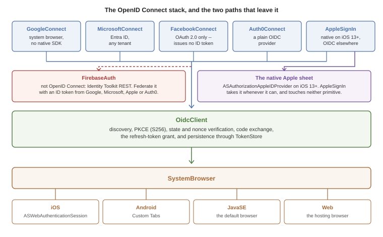
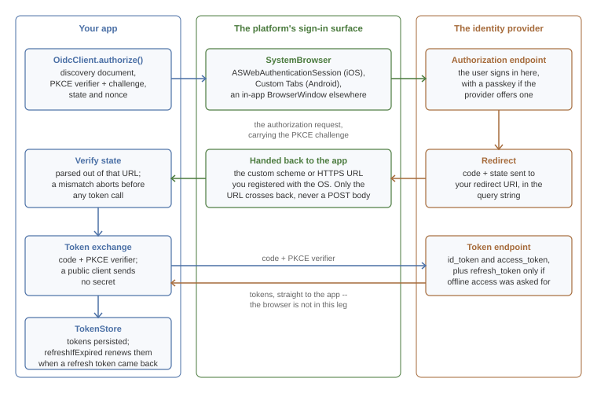

[[authentication-and-identity]]
== Authentication and Identity

This chapter covers Codename One's modern sign-in stack: OpenID Connect, Sign in with Apple, Google, Facebook, Microsoft Entra ID, Auth0 and Firebase Authentication.

The stack is rebuilt around two new primitives:

* `com.codename1.io.oidc.OidcClient` -- a full OpenID Connect / OAuth 2.0 client with PKCE, discovery, refresh and token persistence.
* `com.codename1.io.oidc.SystemBrowser` -- routes the sign-in step through the platform's hardened sign-in surface where one exists: `ASWebAuthenticationSession` on iOS and Android Custom Tabs. Elsewhere it falls back to `BrowserWindow`, and what that means differs: the Web port opens a real top-level browser window, while JavaSE renders a JavaFX `WebView` inside the app. The desktop one is an embedded view, so a provider that blocks those can refuse a simulator sign-in that works on a device. The Web one has a constraint of its own -- it's a `window.open()` call, and it happens after the discovery request comes back rather than inside the click that started the sign-in, so a browser that has already expired the transient activation blocks it. Tell your users to allow popups for the site, or start the flow from an `OidcClient` you configured ahead of time instead of `discover()`. And point the redirect URI at a page on the app's own origin: the port watches the popup by reading its location, the same-origin policy blocks that read once the popup navigates elsewhere, and the fallback reports the authorization URL again -- so a callback hosted anywhere else never gets recognized and `authorize()` simply never completes. That applies to Apple's `form_post` bridge too, which has to live on that origin rather than beside the Services ID.

Every provider-specific class is a thin layer on top of these primitives, so once you learn the underlying client you understand the whole stack.

Two places step outside it, and both are deliberate. `AppleSignIn` calls the native Apple sheet whenever the platform offers one, which on iOS 13+ means neither primitive is involved; the OpenID Connect path is what it falls back to everywhere else. And `FirebaseAuth` isn't an OpenID Connect provider at all -- you reach it by handing it an ID token you already obtained, which `FacebookConnect` can't give you because Facebook's flow issues an access token and nothing else.

WARNING: The legacy `com.codename1.io.Oauth2` class is **deprecated**. It opens an in-app `WebBrowser`, which modern identity providers (Google, Apple, Microsoft, Facebook) now refuse to render -- they detect the embedded view and block the page. The new `OidcClient` works the same on every supported platform without that limitation. See <<migrating-from-oauth2>> for a migration recipe.

=== Why the change

Identity providers tightened their rules in 2023 and 2024:

* **Google** -- the legacy `GoogleSignIn` SDK has been replaced by Google Identity Services (GIS). GIS expects PKCE and discourages embedded WebViews.
* **Apple** -- Sign in with Apple, mandatory for App Store apps that offer any other social login, requires a native ASAuthorizationAppleIDProvider call on iOS 13+ or a web flow with `form_post` `response_mode`.
* **Microsoft** -- Entra ID (formerly Azure AD) requires PKCE for public clients and forwards all browser flows through Microsoft Authenticator when installed.
* **Facebook** -- Facebook Login still supports OAuth 2.0 but its embedded-WebView detection now blocks unknown user agents.

The old `Oauth2` class drove the entire flow through `com.codename1.components.WebBrowser`, which is an embedded view. That model no longer works on a Codename One device build for these providers.

=== Quick start -- any OpenID Connect provider

If your identity provider publishes a standard `.well-known/openid-configuration` document (Google, Microsoft, Apple, Auth0, Okta, Keycloak, AWS Cognito, Authentik, and most others do) you can sign users in with about ten lines of code.

[source,java]
----
include::../demos/common/src/main/java/com/codenameone/developerguide/snippets/generated/AuthenticationAndIdentityJava001Snippet.java[tag=authentication-and-identity-java-001,indent=0]
----

That call:

. Fetches `accounts.google.com/.well-known/openid-configuration`.
. Generates a PKCE pair (S256), a `state`, and a `nonce`.
. Opens the OS system-browser sheet at the discovered authorization endpoint.
. Exchanges the code for tokens on the discovered token endpoint.
. Verifies `state`, the issuer the response names, and the ID token, and persists the tokens via the default `TokenStore`.

The token exchange is the leg worth noticing: it goes straight from your app to the provider's token endpoint, carrying the PKCE verifier, and the browser has already done its job by then. A provider that treats your app as a public client wants no secret on that request, which is the arrangement PKCE exists to make safe. Apple is the exception on its non-native path and wants a `client_secret` JWT your server mints, which is what <<apple-services-id-setup>> is about.

Only the redirect URL crosses back from the browser, which is why Apple's non-iOS path needs a server in front of it: `AppleSignIn` asks for `response_mode=form_post`, so Apple POSTs `code` and `state` to your redirect URI rather than putting them in the query string, and `OidcClient` parses the URL alone. The page at that URI has to turn the POST into a redirect carrying the same parameters, or the sign-in fails with `STATE_MISMATCH`.

Whether the token endpoint hands back a refresh token is up to the request: the quick start above asks for `openid`, `email` and `profile` and nothing more, so Google returns none and there is nothing for `refreshIfExpired` to renew. `GoogleConnect.signIn` adds `access_type=offline` and `prompt=consent` for exactly that reason.

==== What's verified before you get the tokens

`OidcClient` doesn't hand over tokens it hasn't checked. A sign-in that fails one of these checks fails with an `OidcException`, and nothing is stored.

* **The authorization response.** Its `state` has to be the one the request carried. If the response names an issuer with the `iss` parameter, that issuer has to be the provider you configured. A provider whose discovery document sets `authorization_response_iss_parameter_supported` always names itself, so a response without `iss` is refused for that provider. The error is `issuer_mismatch`. This stops an answer from one provider being taken for another's when an app signs in with several.
* **The ID token's claims.** `iss` is the provider, `aud` is your client ID, `exp` hasn't passed, and `nonce` is the one the request carried. When the token has an `at_hash`, it has to match the access token that came with it. The device's clock may be five minutes off, and `setIdTokenClockSkew` changes that.
* **The ID token's signature.** The provider's keys are fetched from its `jwks_uri` once and kept. They're fetched again when a token names a key that isn't among them, but not more than once in 60 seconds. A token that names an unknown key within 60 seconds of the last fetch is refused without another request to the provider. `RS256`, `RS384`, `RS512`, `ES256` and `ES384` are accepted. An unsigned token is refused. A token signed with `HS256` or another shared-secret algorithm is refused too, because an app can't keep the secret that would verify it.

A configuration you build by hand needs a `jwksUri` for the last check. `discover` fills it in.

The signature check has no silent fallback. If the platform the app runs on can't verify a signature of the token's algorithm, the token is refused and the error says so. For a provider whose ID tokens can't be verified on a platform you ship to, or one that signs them with `HS256`, turn the check off explicitly. There is no other way to have such a token accepted:

[source,java]
----
include::../demos/common/src/main/java/com/codenameone/developerguide/snippets/BackendSignInSnippets.java[tag=backend-signin-unverified,indent=0]
----

The claims are still checked then, but they're only as trustworthy as the TLS connection to the token endpoint. Don't make a decision on your server from an ID token the app forwards. Verify it there.

==== Picking a redirect URI

For mobile apps, use a *custom scheme* unique to your app, for example `com.example.app:/oauth2redirect`. Register the scheme with the OS via the build hints below so the system browser can hand the redirect back to your app.

For web / simulator runs, use a normal HTTPS URL pointing at a page you control. The Codename One fallback `BrowserWindow` closes as soon as the URL matches.

===== iOS

Add the URL scheme to your Info.plist via the standard build hint:

----
ios.urlScheme=<key>CFBundleURLTypes</key>\n<array>\n  <dict>\n    <key>CFBundleURLSchemes</key>\n    <array>\n      <string>com.example.app</string>\n    </array>\n  </dict>\n</array>
----

`AuthenticationServices.framework` is added to the linker automatically whenever your app references anything in `com.codename1.io.oidc` or `com.codename1.social.AppleSignIn` -- you don't need to add `ios.add_libs=AuthenticationServices.framework` manually.

===== Android

Add an intent filter for the redirect scheme to the application manifest via the `android.xintent_filter` build hint:

----
android.xintent_filter=<intent-filter>\n  <action android:name="android.intent.action.VIEW"/>\n  <category android:name="android.intent.category.DEFAULT"/>\n  <category android:name="android.intent.category.BROWSABLE"/>\n  <data android:scheme="com.example.app"/>\n</intent-filter>
----

The `androidx.browser:browser:1.8.0` Gradle dependency (for Custom Tabs) is added to your app's Gradle build automatically whenever it references anything in `com.codename1.io.oidc`. Override the version with build hint `android.customTabsVersion=1.x.y` if needed.

==== Saving and restoring tokens

`OidcClient` saves the response under a per-issuer + per-client-ID key using `com.codename1.io.oidc.TokenStore.DefaultStorageTokenStore` (which serializes to `com.codename1.io.Storage`). To restore on next launch:

[source,java]
----
include::../demos/common/src/main/java/com/codenameone/developerguide/snippets/generated/AuthenticationAndIdentityJava016Snippet.java[tag=authentication-and-identity-java-016,indent=0]
----

If the saved access token is within 60 seconds of expiring and a refresh token is available, `refreshIfExpired` performs a refresh-token grant in the background and persists the new tokens.

==== Encrypting tokens at rest

The default token store uses `com.codename1.io.Storage`, which is sandboxed but not encrypted. `SecureStorageTokenStore` keeps the tokens in the platform keychain or keystore instead, through `com.codename1.security.SecureStorage`:

[source,java]
----
include::../demos/common/src/main/java/com/codenameone/developerguide/snippets/BackendSignInSnippets.java[tag=backend-signin-store,indent=0]
----

The first form encrypts the tokens and reads them without asking the user. That's the one to use when a token goes out with every request. The second form puts them behind a biometric prompt. Load the tokens once when the app starts if you choose it, because every read prompts.

A platform without secure storage isn't given a weaker store behind your back. Every operation fails there with an `OidcException` whose code is `storage_unavailable`. The third form is the opt-in: on such a platform, and only there, the tokens go to ordinary storage.

=== Sign in with Apple

`com.codename1.social.AppleSignIn` consolidates the previous `cn1-applesignin` cn1lib into core. On iOS 13+ it uses native ASAuthorizationAppleIDProvider; on Android, JavaSE and the Web port it uses the public Apple OIDC issuer through `OidcClient`.

==== iOS

The iOS port implements the `com.codename1.social.AppleSignInNative` interface. No build hints are required beyond enabling the `Sign in with Apple` capability:

----
ios.signinwithapple=true
----

[source,java]
----
include::../demos/common/src/main/java/com/codenameone/developerguide/snippets/generated/AuthenticationAndIdentityJava003Snippet.java[tag=authentication-and-identity-java-003,indent=0]
----

NOTE: Apple only returns the user's name and email on the *first* authorization. AppleSignIn persists those values in `Preferences` so the result is consistent on subsequent sign-ins.

==== Android, JavaSE, Web

Apple requires a separate *Services ID* (a "web client") for non-iOS environments and a `client_secret` JWT generated by your server. The recipe lives at <<apple-services-id-setup>>.

On Android there is a second thing to arrange. The Services ID callback is an HTTPS URL, and the Android sign-in surface hands control back by matching the scheme of the redirect it's waiting for, so the `com.example.app` custom scheme registered earlier in this chapter does nothing for it. The callback host and path need their own verified App Link: an `android.xintent_filter` carrying an `android:autoVerify="true"` filter for `android:scheme="https"` on that host, and an `assetlinks.json` served from it. <<deep-link-routing-section>> has both, and says how to put that filter and the custom-scheme one in a single hint value -- the hint holds one string, so an app doing both needs them together.

[[apple-services-id-setup]]
==== One-time Apple setup

. In the Apple Developer portal, create a *Services ID* alongside your App ID. Enable "Sign in with Apple" for both.
. Configure the Services ID's *Web Authentication Configuration* with the primary App ID and your redirect URI.
. Generate an *AuthKey* private key in the Apple developer portal (`.p8` file). Apple doesn't allow public mobile clients to mint the `client_secret` JWT themselves; your backend must do it. See https://developer.apple.com/documentation/sign_in_with_apple/generate_and_validate_tokens[Apple's docs] for the JWT recipe.

=== Google Sign-In

`com.codename1.social.GoogleConnect` now offers a modern `signIn(...)` method that runs entirely through `OidcClient`:

[source,java]
----
include::../demos/common/src/main/java/com/codenameone/developerguide/snippets/generated/AuthenticationAndIdentityJava017Snippet.java[tag=authentication-and-identity-java-017,indent=0]
----

`signIn` works on iOS, Android, JavaSE and Web with the same code, against the *Web Application* OAuth 2.0 client ID from Google Cloud Console. The redirect URI you supply must match one of the *Authorized redirect URIs* configured for that client.

The legacy `doLogin()` / `setClientSecret(...)` path is still available for source compatibility but is no longer recommended.

==== Migrating from the legacy Google integration

If you currently rely on `GoogleConnect.doLogin()` with the Google Sign-In SDK on Android or `GIDSignIn` on iOS, you can switch to the modern flow without touching your build:

* On Android, the legacy code uses `com.google.android.gms.auth.api.Auth.GoogleSignInApi` -- this is the part Google deprecated. New code via `signIn(...)` doesn't require the native SDK at all.
* On iOS, the legacy code uses `GIDSignIn` (Google Sign-In SDK). The new code uses `ASWebAuthenticationSession` via `SystemBrowser`, which is what Google now recommends for non-broker apps.

=== Facebook Login

`com.codename1.social.FacebookConnect` exposes both the old SDK-based `doLogin()` and a new SDK-free `signIn(...)` that uses the system browser via `OidcClient`. Use the new method for the simulator, the web port, and for apps that don't want to bundle the Facebook SDK at all:

[source,java]
----
include::../demos/common/src/main/java/com/codenameone/developerguide/snippets/generated/AuthenticationAndIdentityJava018Snippet.java[tag=authentication-and-identity-java-018,indent=0]
----

Facebook doesn't issue OpenID-Connect ID tokens for classic OAuth flows, so `getIdToken()` returns `null`. Read user profile fields via the Graph API.

=== Microsoft / Entra ID

`com.codename1.social.MicrosoftConnect` wraps the same OIDC client against `https://login.microsoftonline.com/{tenant}/v2.0`. The default tenant `common` accepts personal and work / school accounts; pass a tenant GUID, `organizations`, or `consumers` to restrict.

NOTE: Apps that need broker (Microsoft Authenticator) support for Conditional Access can bundle the MSAL SDK manually and bypass `MicrosoftConnect`. For the vast majority of apps the system-browser flow is sufficient and lets the simulator and web port share the same code path.

=== Auth0

`Auth0Connect` is the simplest of the providers because Auth0 is a clean OIDC provider; everything beyond `withDomain` is optional.

=== Firebase Authentication

Firebase Auth isn't an OIDC provider -- it issues Google-Identity-Toolkit-style tokens via REST endpoints. `com.codename1.social.FirebaseAuth` wraps those endpoints:

[source,java]
----
include::../demos/common/src/main/java/com/codenameone/developerguide/snippets/generated/AuthenticationAndIdentityJava200Snippet.java[tag=authentication-and-identity-java-200,indent=0]
----

For federated sign-in (Google / Apple / Microsoft as Firebase providers), first obtain an ID token via the matching `*Connect` class, then swap it for a Firebase session:

[source,java]
----
include::../demos/common/src/main/java/com/codenameone/developerguide/snippets/generated/AuthenticationAndIdentityJava019Snippet.java[tag=authentication-and-identity-java-019,indent=0]
----

Refresh the Firebase session at app launch:

[source,java]
----
include::../demos/common/src/main/java/com/codenameone/developerguide/snippets/generated/AuthenticationAndIdentityJava020Snippet.java[tag=authentication-and-identity-java-020,indent=0]
----

=== Passkeys / WebAuthn

Codename One ships a portable WebAuthn client at `com.codename1.io.webauthn.WebAuthnClient`. It wraps the OS public-key credential APIs (`ASAuthorizationPlatformPublicKeyCredentialProvider` on iOS 16+, `androidx.credentials.CredentialManager` on Android API 28+) behind a JSON-friendly Java surface so you can talk to any relying-party server with the same code on every supported platform.

==== When you actually need this class

If you sign users in via `OidcClient` against Google, Apple, Microsoft Entra ID, Auth0 or Firebase, the *identity provider already supports passkeys*. The user's web browser at the IdP shows the passkey sheet, and OIDC just hands you the resulting ID / access tokens. You don't have to call `WebAuthnClient` at all -- everything in the rest of this chapter that signs users in via `OidcClient` already gets passkey-backed sign-in transparently, with no additional code on your side.

Reach for `WebAuthnClient` when:

* Your app talks to *your own* relying-party server and you want passwordless sign-in / step-up auth backed by a passkey.
* You wire up a direct Auth0 or Firebase passkey ceremony (see <<auth0-passkeys>> and <<firebase-passkeys>>).
* You drive a third-party SDK that emits a WebAuthn challenge.

==== Quick start -- own backend

Pseudo-code (the actual HTTP calls depend on your server library):

[source,java]
----
include::../demos/common/src/main/java/com/codenameone/developerguide/snippets/generated/AuthenticationAndIdentityJava021Snippet.java[tag=authentication-and-identity-java-021,indent=0]
----

`PublicKeyCredential#toJson()` is in the W3C `RegistrationResponseJSON` / `AuthenticationResponseJSON` format, which every WebAuthn server library accepts as-is. On the server, verify the response with one of:

* Java -- https://webauthn4j.github.io/webauthn4j/en/[webauthn4j]
* Node -- https://simplewebauthn.dev/[@simplewebauthn/server]
* Rust -- https://github.com/kanidm/webauthn-rs[webauthn-rs]
* Python -- https://github.com/duo-labs/py_webauthn[py_webauthn]

Do *not* try to verify the attestation or assertion on the device. The relying-party server holds the credential record and the signature counter; only it can detect cloned authenticators.

==== Platform requirements

[cols="1,3"]
|===
| Platform | Notes

| iOS
| iOS 16+. The `AuthenticationServices.framework` library is linked automatically when your app references `com.codename1.io.webauthn.*`. Add an *Associated Domains* entitlement with `webcredentials:<rp.id>` and host an `apple-app-site-association` file at `https://<rp.id>/.well-known/apple-app-site-association` describing your bundle's `webcredentials` app IDs.

| Android
| API 28+ via `androidx.credentials:credentials` (added to your Gradle build automatically; override the version with build hint `android.credentialsVersion=1.x.y`). Publish a Digital Asset Links file at `https://<rp.id>/.well-known/assetlinks.json` declaring your app's SHA-256 certificate fingerprint.

| JavaSE / desktop, Web port
| `WebAuthnClient.isSupported()` returns `false`. Calls fail with `WebAuthnException.NOT_IMPLEMENTED`. Use this to gate the UI -- present a fallback (password sign-in, email magic link) when passkeys are unavailable.
|===

==== Build hints

iOS:

----
ios.entitlements.com.apple.developer.associated-domains=<array>\n  <string>webcredentials:example.com</string>\n</array>
----

Android: nothing beyond the dependency that gets injected automatically. The asset-links file lives on your server; the build doesn't touch it.

[[auth0-passkeys]]
==== Auth0 passkeys

`Auth0Connect` exposes two passkey helpers driven by Auth0's WebAuthn grant (`urn:okta:params:oauth:grant-type:webauthn`). They drive `WebAuthnClient` under the hood, so the same iOS / Android platform requirements apply.

Enable *Passkeys* in the Auth0 dashboard (Authentication &#8594; Database &#8594; your connection &#8594; Authentication Methods &#8594; Passkey), and add *WebAuthn* to the application's *Grant Types*.

[[firebase-passkeys]]
==== Firebase passkeys

`FirebaseAuth` exposes `registerPasskey` (enroll a passkey for the signed-in user) and `signInWithPasskey` (sign in with an existing passkey). Both use Firebase Identity Platform's v2 passkey REST endpoints (`accounts/passkeyEnrollment:start|finalize`, `accounts/passkeySignIn:start|finalize`).

Passkey support requires the *Identity Platform* tier of Firebase Auth (the upgraded plan). The free Firebase Auth tier doesn't expose the passkey endpoints; the calls will fail with an HTTP 403. Check your project plan in the Firebase console under Build &#8594; Authentication &#8594; Settings &#8594; User account linking.

==== Mapping WebAuthn errors

`WebAuthnException.getError()` returns one of the W3C-defined error names:

[cols="1,3"]
|===
| Code | Meaning

| `NotAllowedError`  | User dismissed the OS sheet, no matching credential, or the authenticator denied the request.
| `InvalidStateError`| The credential being created already exists on the authenticator.
| `NotSupportedError`| Platform doesn't support the requested algorithm / transport combo.
| `SecurityError`    | Origin / RP-ID validation failed. Most often an Associated Domain (iOS) or asset-links (Android) misconfiguration.
| `AbortError`       | Caller cancelled the ceremony.
| `ConstraintError`  | A constraint (resident key, user verification) couldn't be satisfied.
| `not_supported`    | The platform has no native WebAuthn implementation at all. Caller should fall back to password sign-in.
| `transport_error`  | Network failure while POSTing to your relying-party server.
| `invalid_options`  | The options JSON received from the relying party couldn't be parsed.
| `invalid_response` | The response returned by the authenticator couldn't be parsed.
|===

[[signing-in-against-a-codename-one-backend]]
=== Signing in against a Codename One backend

A Codename One backend can be its own identity provider. Its authorization server speaks OpenID Connect, so the app signs in with the same `OidcClient` it would use for any other provider. <<backend-security-authorization-server>> covers the server side. This section is the app's half.

==== Signing in

Register the app on the server as a public client: no secret, the authorization code and refresh token grants, and the exact redirect URI the app uses. Then discover the server and authorize:

[source,java]
----
include::../demos/common/src/main/java/com/codenameone/developerguide/snippets/BackendSignInSnippets.java[tag=backend-signin-authorize,indent=0]
----

The issuer you pass to `discover` is the server's `cn1.security.authorizationserver.issuer`, without a trailing slash. The redirect URI has to match the registered one exactly. The server doesn't accept wildcards.

The answer holds an access token, a refresh token and an ID token. The access token is a signed JWT that the server's resource chain verifies. Its `scope` claim becomes the caller's `SCOPE_` authorities there.

==== Sending the token with every request

`OidcRequestAuthorizer` adds the access token to the app's requests and renews it when it expires. Create one for the client, give it the base URL of your API, and load the session a previous run saved:

[source,java]
----
include::../demos/common/src/main/java/com/codenameone/developerguide/snippets/BackendSignInSnippets.java[tag=backend-signin-authorizer,indent=0]
----

From then on every request under that base URL carries `Authorization: Bearer ...`. That includes requests made with `Rest`, with `ConnectionRequest`, and by a generated `@RestClient` client created for that base URL. Tokens the client obtains later reach the authorizer by themselves.

[source,java]
----
include::../demos/common/src/main/java/com/codenameone/developerguide/snippets/BackendSignInSnippets.java[tag=backend-signin-call,indent=0]
----

The base URL is matched by origin and by whole path segments. The origin is the scheme, the host and the port. Scheme and host are compared without regard to case, and a port that's left out is the scheme's own, so `https://api.example.com` and `https://API.example.com:443` are the same base URL. The path is compared exactly and ends where a segment ends, so `/v1` covers `/v1/pets` and doesn't cover `/v10`. When two registrations cover a request, the one with the longer path wins.

A token is never sent to another origin. That holds for a redirect too: a request the server redirects to another host, another port or plain `http` is sent there without the header. A request redirected to a path outside the base URL goes without it too. This is the behavior where Codename One follows the redirect itself. On iOS the system follows redirects before the app sees them, so don't have a token-protected API redirect to a host you don't control.

The authorizer works on the event dispatch thread only. It puts the header on a request when you queue it, and the network thread sends what the request carries. A request you queue from another thread is passed to the event dispatch thread first and queued from there, without making your thread wait. Call the authorizer's own methods, such as `setTokens` and `signOut`, on the event dispatch thread. Called from another thread they wait for it, so don't call them from a thread the event dispatch thread is itself waiting for.

==== Renewing before the token expires

The authorizer renews a token before the server has a chance to refuse it. When you queue a request and the access token is within a minute of its expiry, the refresh token is exchanged first. The request is kept out of the queue until the exchange is done, and is then sent once with the new token. Requests queued in the meantime wait for the same exchange.

Nothing blocks while this happens, because the request hasn't reached a network thread yet. Code that waits for the request gets the one final answer.

Change the minute with `setRefreshLeeway`. A larger value suits a server whose clock runs ahead of the device's. A negative value turns renewing ahead of time off:

[source,java]
----
include::../demos/common/src/main/java/com/codenameone/developerguide/snippets/BackendSignInSnippets.java[tag=backend-signin-leeway,indent=0]
----

If the server refuses that exchange, the session is over, as the next section describes, and the request is sent without a token so that it's answered `401`. If the exchange can't reach the server, the request is sent with the token it has, which might still be good.

A token whose response carried no `expires_in` has no known expiry. It's renewed only when the server refuses it.

==== What happens on a 401

A token can still be refused: the server revoked it, restarted with new keys, or the device's clock is wrong. When the server answers `401` to a request that carried the authorizer's token, the app doesn't see that answer. The request is held, and the refresh token is exchanged for a new set of tokens. The request is then sent again with the new access token, and its answer is delivered as usual.

A few rules keep this predictable:

* A request is renewed once. If the second attempt is also refused, that `401` is delivered.
* Requests refused at the same moment share one exchange. The server replaces the refresh token every time it's used, so a second exchange with the old one would fail.
* Code that waits for a request waits until the end. `getAsString()` and the other blocking methods return the final answer, and so does `addToQueueAndWait`.
* If the server refuses the refresh token, the session is over. The tokens are removed from memory and from the token store, the held requests deliver their `401`, and your sign-in listener runs so you can show the sign-in screen.
* If the exchange fails because the server can't be reached, the tokens are kept. The held request delivers its `401`, and the next request tries again.

When a renewal fails, the refused request is sent one more time as it was first sent. The `401` you receive is that second answer, handled by your error handlers like any other response.

You can also choose the authorizer for one request:

[source,java]
----
include::../demos/common/src/main/java/com/codenameone/developerguide/snippets/BackendSignInSnippets.java[tag=backend-signin-per-request,indent=0]
----

An `Authorization` header that's already on a request always wins. That's true for a header you set on the request and for a default header set with `NetworkManager.addDefaultHeader`. The authorizer isn't asked about such a request, and a `401` to it isn't renewed.

To sign out, revoke the refresh token and clear the stored session:

[source,java]
----
include::../demos/common/src/main/java/com/codenameone/developerguide/snippets/BackendSignInSnippets.java[tag=backend-signin-signout,indent=0]
----

==== The device grant

A television, a watch or a kiosk has no browser to sign in with and no comfortable keyboard. The device grant lets the user approve such a device from a phone or a computer. The app asks for a code, shows it, and waits:

[source,java]
----
include::../demos/common/src/main/java/com/codenameone/developerguide/snippets/BackendSignInSnippets.java[tag=backend-signin-device,indent=0]
----

The user opens the verification address on another device, signs in and types the code. `getVerificationUriComplete()` returns the same address with the code in it, which suits a QR code.

`pollDeviceToken` asks the server at the interval the server chose. It waits five seconds longer each time the server answers `slow_down`. It stops with an `OidcException` when the user refuses (`access_denied`) or the code runs out (`expired_token`), and it stops when you cancel the resource it returned. The tokens are stored the same way `authorize()` stores them, so the authorizer picks them up.

The client needs the `urn:ietf:params:oauth:grant-type:device_code` grant on the server. It needs no redirect URI for this flow.

==== Passkeys

A backend that declares `http.webAuthn(...)` serves the two WebAuthn ceremonies, and `WebAuthnClient` runs the device's side of each. <<backend-security-passkeys>> lists the endpoints.

A signed-in user adds a passkey like this:

[source,java]
----
include::../demos/common/src/main/java/com/codenameone/developerguide/snippets/BackendSignInSnippets.java[tag=backend-signin-passkey-register,indent=0]
----

A user who has one signs in with it:

[source,java]
----
include::../demos/common/src/main/java/com/codenameone/developerguide/snippets/BackendSignInSnippets.java[tag=backend-signin-passkey,indent=0]
----

Both requests of a ceremony have to reach the server with the same cookies, because the server keeps the challenge in the session. `ConnectionRequest` keeps cookies for you unless you turned them off.

Two server settings matter to an app. The chain has to leave the passkey endpoints out of CSRF protection with `csrf.ignoringRequestMatchers("/webauthn/**", "/login/webauthn")`, because an app has no page to read a CSRF token from. An Android app's origin isn't a web address but `android:apk-key-hash:` followed by a hash of its signing certificate, and it has to be in the server's allowed origins.

==== One-time codes

A backend with a second factor expects a six-digit code after the password. The server uses the same `com.codename1.security.Otp` class your app has, so an authenticator screen in your app produces codes the server accepts:

[source,java]
----
include::../demos/common/src/main/java/com/codenameone/developerguide/snippets/BackendSignInSnippets.java[tag=backend-signin-totp,indent=0]
----

A code is good once. The server refuses a code it has already accepted, even inside the same 30 seconds.

[[migrating-from-oauth2]]
=== Migrating from `Oauth2`

A typical legacy snippet:

[source,java]
----
include::../demos/common/src/main/java/com/codenameone/developerguide/snippets/generated/AuthenticationAndIdentityJava015Snippet.java[tag=authentication-and-identity-java-015,indent=0]
----

becomes:

[source,java]
----
include::../demos/common/src/main/java/com/codenameone/developerguide/snippets/generated/AuthenticationAndIdentityJava022Snippet.java[tag=authentication-and-identity-java-022,indent=0]
----

Or, if the provider exposes a discovery document:

[source,java]
----
include::../demos/common/src/main/java/com/codenameone/developerguide/snippets/generated/AuthenticationAndIdentityJava023Snippet.java[tag=authentication-and-identity-java-023,indent=0]
----

`OidcTokens#toAccessToken()` returns a `com.codename1.io.AccessToken`, so callers that already deal in `AccessToken` (most subclasses of `com.codename1.social.Login`) can adopt `OidcClient` without changing their token type.

[[verifying-a-phone-number]]
=== Verifying a phone number

Signing a user in by phone number is a flow of its own rather than an OpenID Connect one: your server sends a code to the number and checks the code the user types back, and the device's part is entering the number, entering the code, and letting the platform offer the code out of the arriving message so the user never types it.

`com.codename1.components.PhoneVerification` is that screen, and `com.codename1.ui.TextArea#ONE_TIME_CODE` is the hint that makes the platform offer the code without any messaging permission. See <<Phone Number Verification>>.

=== A universal sign-in demo

A complete sample is included under `samples/UniversalSignInDemo` in the repository. It renders one button per provider (Apple, Google, Microsoft, Facebook, Auth0, Firebase, generic OIDC) and dumps the resulting tokens to a `TextArea` so you can inspect them. See its `README.md` for the credentials wiring.
