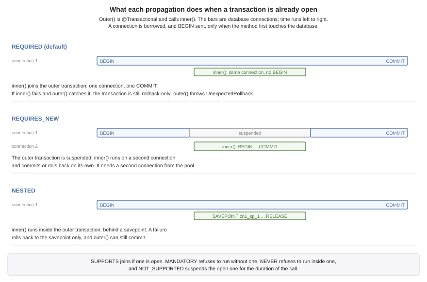

[[backend-data]]
== Backend data access and transactions

A server's data lives in a database, and this chapter is about reaching it: the
connection pool, which speaks to SQLite, PostgreSQL and MySQL with one dialect of
SQL, the object mapping the build generates daos from, and the transactions that
make several statements one unit of work. The last of those gets the most room,
because declarative transactions are where a Spring developer's intuitions are
most likely to be almost right.

=== Talking to a database

`DataSource.open` takes a SQLite path or a PostgreSQL or MySQL URL, pools
connections to it, and returns rows as the same Java types whichever engine
answered:

[source,java]
----
include::../demos/backend/src/main/java/com/codenameone/developerguide/backend/DatabaseSnippets.java[tag=backend-database,indent=0]
----

There is no JDBC driver involved. SQLite is linked into the binary, and the
PostgreSQL and MySQL clients speak their wire protocols directly, and a
`mariadb://` URL is served by the same client. MySQL 8.0 and MariaDB 10.4 and
newer are supported: a string key needs a case-sensitive NO PAD collation, so
`"A"` and `"a"` are two keys and `"token "` keeps its space, and the two server
families spell that collation differently. Which one is used comes from the
server rather than from the URL scheme, so a `mysql://` URL pointed at MariaDB
is still correct.

Statements are written once, in one portable form: `?` for every parameter, and
plain unquoted names. PostgreSQL binds `$1` rather than `?`, and that difference
stops inside `execute` and `query` rather than at every call site. SQL already
written for one engine keeps working, because a statement carrying no `?` at all
is passed through untouched -- so hand-written `$1` is left alone. A literal
question mark that isn't a parameter is written `??`, which matters on
PostgreSQL, whose `jsonb` operators are spelled `?`, `?|` and `?&`.

A parameter count that doesn't match the statement is refused before the
statement is sent. The three engines answer a mismatch three different ways, and
SQLite's answer is to bind the missing parameters to NULL and commit the row.

The other thing the engines disagree about is the key an insert generated.
`insert` asks whichever way this engine answers -- `last_insert_rowid()` on
SQLite, `LAST_INSERT_ID()` on MySQL, and `INSERT ... RETURNING` on PostgreSQL,
which has no last-insert-id concept at all:

[source,java]
----
include::../demos/backend/src/main/java/com/codenameone/developerguide/backend/DatabaseSnippets.java[tag=backend-database-insert,indent=0]
----

Several statements that have to be one go through `inTransaction`, which holds a
single connection for the whole body and rolls back if it throws:

[source,java]
----
include::../demos/backend/src/main/java/com/codenameone/developerguide/backend/DatabaseSnippets.java[tag=backend-database-transaction,indent=0]
----

Everything each engine spells differently is reachable through `db.dialect()`,
which is what code that generates schema needs:

[source,java]
----
include::../demos/backend/src/main/java/com/codenameone/developerguide/backend/DatabaseSnippets.java[tag=backend-database-dialect,indent=0]
----

Quoting every identifier isn't caution. PostgreSQL folds an unquoted name to
lower case while SQLite and MySQL preserve it, so a column called `createdAt`
becomes `createdat` on one engine of the three, and code that reads rows by name
stops finding it there.

A `Database` -- one connection rather than a pool -- is still available through
`Database.open` for code that wants exactly one, and every one of its operations
is synchronized, so sharing one across handlers is safe and serialized. That's the
right shape for a single-file SQLite server and the wrong one for a database
that's a machine across a network: there the single connection isn't a safety
property, it's the bottleneck. The pool is the default for that reason.

=== Storing objects

A class with `@Entity` on it gets a data access object written for it at build
time. The annotations are the ones the SQLite ORM chapter documents, and they
are the same annotations in the same package, because an entity is the one class
both halves of an application own:

[source,java]
----
include::../demos/backend/src/main/java/com/codenameone/developerguide/backend/Reminder.java[tag=backend-orm-entity,indent=0]
----

What differs between the app's copy and the server's is what the build generates
from it: a module compiled against the Codename One core gets a dao over the
local SQLite database, and a module compiled against this runtime gets one whose
statements are built for whichever engine the connection turns out to be. The
class says what the data is; the module says where its rows live.

[source,java]
----
include::../demos/backend/src/main/java/com/codenameone/developerguide/backend/OrmSnippets.java[tag=backend-orm-dao,indent=0]
----

The entity manager comes from the entry point, which opens one when the build
generated at least one entity. A controller asks for it by declaring a
constructor that takes one, and the generated entry point calls that constructor:

[source,java]
----
include::../demos/backend/src/main/java/com/codenameone/developerguide/backend/ReminderApi.java[tag=backend-orm-controller,indent=0]
----

A controller is a bean, so its constructor can take the entity manager, the pool,
or any service built on them, as <<backend-beans>> describes. The generated entry
point holds a `new` with the argument written into it, and a controller that needs
a database nothing configured is refused at start-up rather than handed a null to
fail on later.

The generated entry point is also the only place that registration can live, and
that's a consequence of the build order rather than a preference. This runtime
has no reflection and the translator drops a class nothing references, so the
generated `cn1app.BackendDaoBootstrap` holds a direct reference to every dao and
is what keeps them in the binary. It's written during `process-classes`, AFTER
javac has compiled the module's own sources -- so a `main` you write yourself
can't name it, and a module that sets its own `mainClass` can't reach the
generated daos at all. Use `DataSource` directly there, or let the build write
the entry point and put the startup work in a controller.

Opening an entity manager is otherwise a single call over a pool, which is what
a test does:

[source,java]
----
include::../demos/backend/src/main/java/com/codenameone/developerguide/backend/OrmSnippets.java[tag=backend-orm-open,indent=0]
----

Queries name JAVA FIELDS rather than columns, and the builder quotes the column
each one maps to:

[source,java]
----
include::../demos/backend/src/main/java/com/codenameone/developerguide/backend/OrmSnippets.java[tag=backend-orm-query,indent=0]
----

A name that isn't a field of the entity is refused at once, listing the
ones that are, rather than reaching the server as a column it doesn't have.
`eq`, `ne`, `gt`, `gte`, `lt`, `lte`, `like`, `in`, `isNull` and `isNotNull` are
joined with AND in the order they were added, and `list`, `first`, `count` and
`delete` end the chain. A query the builder can't express takes SQL instead,
through `dao.find(where, params)`, which is the point at which portability
becomes yours to keep.

Transactions take the same shape as everywhere else: the entity manager the body
is handed is pinned to one connection, so every dao reached through it runs inside
the transaction. Called inside a `@Transactional` method, it joins that
transaction instead of starting another.

[source,java]
----
include::../demos/backend/src/main/java/com/codenameone/developerguide/backend/OrmSnippets.java[tag=backend-orm-transaction,indent=0]
----

Three things this doesn't do, on purpose. Relationships aren't supported --
`@OneToMany` and friends don't exist, and a field referencing another entity
fails the build with a message saying to persist the foreign key as a scalar.
`createTable` creates a table that isn't there and does nothing at all to one
that is, so it's a convenience for development and for tests rather than a
migration tool. And a boolean, a date and a char are stored as integers on every
engine -- 0 or 1, epoch milliseconds, and the UTF-16 code unit -- because a
native timestamp comes back as text whose format follows the server's own time
zone and would not round-trip the same way on three engines, and because a char
that was never assigned holds NUL, which PostgreSQL refuses inside a text value.
A field declared as a primitive gets a `NOT NULL` column, because a primitive has
no null to read: a nullable column would load as `0`, `false` or `\0`, which is
indistinguishable from a row that holds those. Declare the field as its boxed
type -- `Integer` rather than `int` -- when the column can be empty.

=== Transactions

A transaction makes several statements succeed or fail together. `@Transactional`
declares one around a method, and the build writes the code that begins, commits
and rolls back the transaction around the method's body:

[source,java]
----
include::../demos/backend/src/main/java/com/codenameone/developerguide/backend/beans/Signups.java[tag=backend-transactional,indent=0]
----

Everything the method does through the server's `DataSource` joins the
transaction without being handed anything, and so does every method it calls on
the same thread. On a class, `@Transactional` applies to each of its public
methods.

==== How a method joins a transaction

The transaction belongs to the thread that began it. When a thread inside one
asks the pool for a connection -- directly, through an entity manager's daos, or
through a `DataSource` method -- it gets the transaction's connection back instead
of a pooled one. That's why a service three calls deep takes part without a
parameter for it, and why the programmatic forms, `DataSource.inTransaction` and
`EntityManager.transaction`, run as part of an open transaction rather than
starting a second one.

The connection is borrowed, and `BEGIN` sent, only when the method first touches
the database. A `@Transactional` method that returns early, or that turns out to
have nothing to write, never takes a connection at all. The same laziness settles
which database a transaction is on: the first pool it touches. Statements through
any other pool run outside it, each committing on its own.

A transaction doesn't follow work to another thread. An `@Async` method, a task
given to `Tasks`, or a scheduled job runs outside the caller's transaction, and
begins its own if it's `@Transactional` itself.

==== Propagation

`propagation` says what a method does when it's called with a transaction already
open. The default, `REQUIRED`, is right for most methods: join the open
transaction, or begin one if there is none.

.What each propagation does when a transaction is already open

[cols="2,2,2", options="header"]
|===
| Propagation | With a transaction open | With none open

| `REQUIRED`
| Joins it.
| Begins one.

| `REQUIRES_NEW`
| Suspends it and begins another, on a second connection.
| Begins one.

| `NESTED`
| Sets a savepoint in it.
| Begins one.

| `SUPPORTS`
| Joins it.
| Runs without one.

| `MANDATORY`
| Joins it.
| Throws `TransactionException.IllegalState`.

| `NOT_SUPPORTED`
| Suspends it and runs without one.
| Runs without one.

| `NEVER`
| Throws `TransactionException.IllegalState`.
| Runs without one.
|===

`REQUIRES_NEW` suits work that must be kept whatever happens to the caller, an
audit record being the usual case:

[source,java]
----
include::../demos/backend/src/main/java/com/codenameone/developerguide/backend/beans/AuditLog.java[tag=backend-tx-requires-new,indent=0]
----

It costs a second connection for as long as it runs, taken from the same pool
while the first one is still held. See the pitfalls at the end of this chapter
before using it on SQLite.

==== Rollback rules

The rules are Spring's. An unchecked exception or an `Error` leaving the method
rolls the transaction back, and a checked exception commits it. `rollbackFor`
adds exception types that roll back, `noRollbackFor` adds types that commit, and
when several listed types match the thrown one the most specific wins. The
decision is written into the method as a chain of `instanceof` tests, so nothing
reads the annotation when the method runs:

[source,java]
----
include::../demos/backend/src/main/java/com/codenameone/developerguide/backend/beans/Orders.java[tag=backend-tx-rules,indent=0]
----

[IMPORTANT]
====
Every `DataSource`, `Database` and dao method throws `IOException`, which is
checked. Under the default rule, a statement that fails and propagates out of a
`@Transactional` method therefore commits whatever the statements before it did.
Spring doesn't have this problem, because its JDBC layer throws unchecked
exceptions. Add `rollbackFor = IOException.class` to every `@Transactional`
method that writes through the pool, as the examples in this chapter do.
====

A method that joined a transaction can't roll back what the method that began it
did before it, so when it fails with an exception that rolls back, it marks the
whole transaction rollback-only instead. The method that began the transaction
then rolls back when it ends. If it ends normally -- because it caught the
exception -- the rollback is reported by throwing
`TransactionException.UnexpectedRollback`, so the caller doesn't take a
rolled-back transaction for a committed one.

`Transactions.setRollbackOnly()` undoes a transaction without an exception. Called
in the method that began the transaction, it lets that method return normally,
and the transaction rolls back without an error when the method ends. Called in a method
that joined the transaction, it counts as that method failing: the transaction
becomes rollback-only, and the method that began it throws
`TransactionException.UnexpectedRollback` when it ends normally.

`Transactions.isActive()` and `Transactions.isRollbackOnly()` answer the obvious
questions about the calling thread.

==== Read-only transactions and timeouts

`readOnly = true` begins a transaction the engine is told only reads. PostgreSQL
and MySQL then refuse any write inside it, which turns a read path that writes by
mistake into an error. SQLite accepts the flag and enforces nothing.

`timeout` is in seconds, counted from the start of the method. It's checked when
the transaction first touches the database, where a transaction already past its
limit fails with an `IOException`, and again at commit, where it's rolled back and
reported with `TransactionException.TimedOut`. It doesn't interrupt a statement
that's running, so it bounds how long a transaction can take to commit rather than
how long any one query may run.

==== Savepoints

`NESTED` runs a method inside the open transaction, behind a savepoint. A failure
rolls back to the savepoint and nothing more, and the outer method can go on and
commit. That suits a batch in which one bad item shouldn't cost the rest:

[source,java]
----
include::../demos/backend/src/main/java/com/codenameone/developerguide/backend/beans/Imports.java[tag=backend-tx-nested,indent=0]
----

The loop calls `importLine` through `this`, which in Spring would bypass the
annotation entirely and run every line in the outer transaction without a
savepoint. Here the annotation is part of the method, so the call gets its
savepoint however it's made.

The savepoints are named by the runtime and released when the method returns
normally. All three engines support them.

==== The transaction's session

A bean can inject `com.codename1.orm.session.Session`, the persistence session of
the ORM, and use it inside a transaction:

[source,java]
----
include::../demos/backend/src/main/java/com/codenameone/developerguide/backend/beans/ReminderService.java[tag=backend-tx-session,indent=0]
----

The injected object stands in for the session of whichever transaction is open on
the calling thread. The session is opened on the transaction's connection the
first time it's used, its pending changes are flushed into the transaction before
it commits, and it's closed when the transaction ends. A savepoint that rolls back
also clears the session, since the rows it had loaded since the savepoint no longer
exist. Used outside a transaction, it throws with a message saying to annotate the
method, or to open a session with `EntityManager.openSession()`.

==== Why a call through this works

Spring applies `@Transactional` with a proxy: a wrapper object stands between a
caller and the bean, and the transaction happens in the wrapper. A call that
doesn't go through the wrapper -- one from the bean to itself, to a private method,
or on an object the application built with `new` -- gets no transaction, and
nothing warns about it.

Here the build rewrites the compiled method. Its body moves to a method of its own
and the method keeps its name, now starting the transaction, calling that body,
and committing, with the rollback decision written in. The transaction is
therefore a property of the method, and every call gets it. The same rewriting
gives `@Async`, `@Timed` and `@Counted` the same property.

==== Pitfalls

* **Checked exceptions commit.** Covered above, and worth repeating: without
  `rollbackFor = IOException.class`, a failed statement that propagates out of the
  method commits the ones before it.
* **`REQUIRES_NEW` needs a second connection.** The outer transaction keeps its
  connection while the inner one borrows another, so on a pool of one -- the
  default for an in-memory SQLite database -- the inner borrow waits for
  `cn1.datasource.pool.borrowTimeoutMillis` and fails.
* **SQLite has one writer.** A transaction that has written holds the database's
  write lock until it ends, so a `REQUIRES_NEW` method that writes while its caller
  holds the lock waits `cn1.datasource.busyTimeoutMillis` and fails. Reading works.
  On SQLite, record the audit row after the outer transaction, or in it.
* **Transactions don't cross threads.** Work handed to `@Async` or `Tasks` isn't
  part of the caller's transaction and can't see its uncommitted rows.
* **A transaction holds a connection.** From its first statement until it ends,
  the connection is out of the pool. An outbound HTTP call inside a transaction
  keeps it there for the length of the call, and enough of those at once starve the
  pool. Make the call before the transaction begins, or after it ends.
