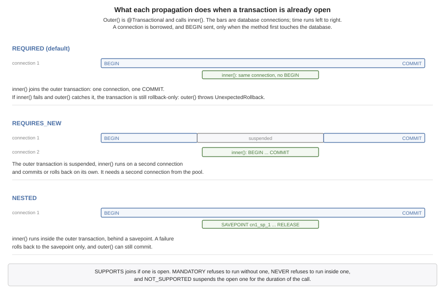

[[backend-data]]
== Backend data access and transactions

A server's data lives in a database, and this chapter is about reaching it: the
connection pool, which speaks to SQLite, PostgreSQL and MySQL with one dialect of
SQL, the object mapping the build generates daos from, and the transactions that
make several statements one unit of work. The last of those gets the most room,
because declarative transactions are where a Spring developer's intuitions are
most likely to be almost right.

=== Talking to a database

The server opens a connection pool from `cn1.datasource.url` -- a SQLite path or
a PostgreSQL or MySQL URL -- and injects it as a `DataSource` into any bean that
asks for one. It returns rows as the same Java types whichever engine answered:

[source,java]
----
include::../demos/backend/src/main/java/com/codenameone/developerguide/backend/DatabaseSnippets.java[tag=backend-database,indent=0]
----

There is no JDBC driver involved. SQLite is linked into the binary, and the
PostgreSQL and MySQL clients speak their wire protocols directly, and a
`mariadb://` URL is served by the same client. MySQL 8.0 and MariaDB 10.4 and
newer are supported: a string key needs a case-sensitive NO PAD collation, so
`"A"` and `"a"` are two keys and `"token "` keeps its space, and the two server
families spell that collation differently. Which one is used comes from the
server rather than from the URL scheme, so a `mysql://` URL pointed at MariaDB
is still correct.

Statements are written once, in one portable form: `?` for every parameter, and
plain unquoted names. PostgreSQL binds `$1` rather than `?`, and that difference
stops inside `execute` and `query` rather than at every call site. SQL already
written for one engine keeps working, because a statement carrying no `?` at all
is passed through untouched -- so hand-written `$1` is left alone. A literal
question mark that isn't a parameter is written `??`, which matters on
PostgreSQL, whose `jsonb` operators are spelled `?`, `?|` and `?&`.

A parameter count that doesn't match the statement is refused before the
statement is sent. The three engines answer a mismatch three different ways, and
SQLite's answer is to bind the missing parameters to NULL and commit the row.

The other thing the engines disagree about is the key an insert generated.
`insert` asks whichever way this engine answers -- `last_insert_rowid()` on
SQLite, `LAST_INSERT_ID()` on MySQL, and `INSERT ... RETURNING` on PostgreSQL,
which has no last-insert-id concept at all:

[source,java]
----
include::../demos/backend/src/main/java/com/codenameone/developerguide/backend/DatabaseSnippets.java[tag=backend-database-insert,indent=0]
----

Several statements that have to be one go through `inTransaction`, which holds a
single connection for the whole body and rolls back if it throws:

[source,java]
----
include::../demos/backend/src/main/java/com/codenameone/developerguide/backend/DatabaseSnippets.java[tag=backend-database-transaction,indent=0]
----

Everything each engine spells differently is reachable through `db.dialect()`,
which is what code that generates schema needs:

[source,java]
----
include::../demos/backend/src/main/java/com/codenameone/developerguide/backend/DatabaseSnippets.java[tag=backend-database-dialect,indent=0]
----

Quoting every identifier isn't caution. PostgreSQL folds an unquoted name to
lower case while SQLite and MySQL preserve it, so a column called `createdAt`
becomes `createdat` on one engine of the three, and code that reads rows by name
stops finding it there.

A `Database` -- one connection rather than a pool -- is still available through
`Database.open` for code that wants exactly one, and every one of its operations
is synchronized, so sharing one across handlers is safe and serialized. That's the
right shape for a single-file SQLite server and the wrong one for a database
that's a machine across a network: there the single connection isn't a safety
property, it's the bottleneck. The pool is the default for that reason.

=== Storing objects

A class with `@Entity` on it gets a data access object written for it at build
time. The annotations are the ones the SQLite ORM chapter documents, and they
are the same annotations in the same package, because an entity is the one class
both halves of an application own:

[source,java]
----
include::../demos/backend/src/main/java/com/codenameone/developerguide/backend/Reminder.java[tag=backend-orm-entity,indent=0]
----

What differs between the app's copy and the server's is what the build generates
from it: a module compiled against the Codename One core gets a dao over the
local SQLite database, and a module compiled against this runtime gets one whose
statements are built for whichever engine the connection turns out to be. The
class says what the data is; the module says where its rows live.

[source,java]
----
include::../demos/backend/src/main/java/com/codenameone/developerguide/backend/OrmSnippets.java[tag=backend-orm-dao,indent=0]
----

The entity manager comes from the entry point, which opens one when the build
generated at least one entity. A controller asks for it by declaring a
constructor that takes one, and the generated entry point calls that constructor:

[source,java]
----
include::../demos/backend/src/main/java/com/codenameone/developerguide/backend/ReminderApi.java[tag=backend-orm-controller,indent=0]
----

A controller is a bean, so its constructor can take the entity manager, the pool,
or any service built on them, as <<backend-beans>> describes. The generated entry
point holds a `new` with the argument written into it, and a controller that needs
a database nothing configured is refused at start-up rather than handed a null to
fail on later.

The build writes the entry point, and the daos are registered there: this
runtime has no reflection and the translator drops a class nothing references,
so the generated code's direct reference to every dao is what keeps them in the
binary. Put start-up work in a bean's `@PostConstruct` method.

Outside the server -- in a unit test, say -- an entity manager is a single call
over a pool:

[source,java]
----
include::../demos/backend/src/main/java/com/codenameone/developerguide/backend/OrmSnippets.java[tag=backend-orm-open,indent=0]
----

Queries name JAVA FIELDS rather than columns, and the builder quotes the column
each one maps to:

[source,java]
----
include::../demos/backend/src/main/java/com/codenameone/developerguide/backend/OrmSnippets.java[tag=backend-orm-query,indent=0]
----

A name that isn't a field of the entity is refused at once, listing the
ones that are, rather than reaching the server as a column it doesn't have.
`eq`, `ne`, `gt`, `gte`, `lt`, `lte`, `like`, `in`, `isNull` and `isNotNull` are
joined with AND in the order they were added, and `list`, `first`, `count` and
`delete` end the chain. A query the builder can't express takes SQL instead,
through `dao.find(where, params)`, which is the point at which portability
becomes yours to keep.

Transactions take the same shape as everywhere else: the entity manager the body
is handed is pinned to one connection, so every dao reached through it runs inside
the transaction. Called inside a `@Transactional` method, it joins that
transaction instead of starting another.

[source,java]
----
include::../demos/backend/src/main/java/com/codenameone/developerguide/backend/OrmSnippets.java[tag=backend-orm-transaction,indent=0]
----

Three things this doesn't do, on purpose. Relationships aren't supported --
`@OneToMany` and friends don't exist, and a field referencing another entity
fails the build with a message saying to persist the foreign key as a scalar.
`createTable` creates a table that isn't there and does nothing at all to one
that is, so it's a convenience for development and for tests rather than a
migration tool; see <<backend-schema-migrations>> for that. And a boolean, a date and a char are stored as integers on every
engine -- 0 or 1, epoch milliseconds, and the UTF-16 code unit -- because a
native timestamp comes back as text whose format follows the server's own time
zone and would not round-trip the same way on three engines, and because a char
that was never assigned holds NUL, which PostgreSQL refuses inside a text value.
A field declared as a primitive gets a `NOT NULL` column, because a primitive has
no null to read: a nullable column would load as `0`, `false` or `\0`, which is
indistinguishable from a row that holds those. Declare the field as its boxed
type -- `Integer` rather than `int` -- when the column can be empty.

[[backend-schema-migrations]]
=== Schema migrations

A schema changes for as long as the application does, and every database the
server has ever run against has to change with it: the production one, the
staging one, the file on a colleague's laptop. A migration is one such change,
written once as a script and applied exactly once to each database, in order.
The server keeps a table recording which ones a database has had, so starting it
is all it takes to bring any database up to the schema the code expects.

The file naming, the commands and the history table are Flyway's, so a schema
that Flyway already manages carries straight over, and the scripts work with
either.

==== Writing migrations

Scripts go in `src/main/resources/db/migration`:

[source]
----
include::../demos/common/src/main/snippets/developer-guide/migrations.txt[tag=migrations-layout-server,indent=0]
----

A file called `V<version>__<description>.sql` is a versioned migration. The
version is digits separated by dots or underscores, so `V2`, `V2_1` and
`V2026_05_21_1` are all valid, and they sort as numbers: 2.10 comes after 2.9.
Two underscores separate it from the description, where a single underscore
reads as a space.

[source,sql]
----
include::../demos/common/src/main/snippets/developer-guide/migrations.sql[tag=migrations-sql-001,indent=0]
----

A change to the schema is always a new file with a higher version. A script that
has already run is never edited, because databases that ran the old text would
no longer match the ones that ran the new text. The server records a checksum of
every script it applies and refuses to start when an applied script has changed.

[source,sql]
----
include::../demos/common/src/main/snippets/developer-guide/migrations.sql[tag=migrations-sql-002,indent=0]
----

A file called `R__<description>.sql` is a repeatable migration. It runs after
the versioned ones, and again whenever its text changes, which suits a view or a
set of reference rows that you want to edit in place.

The build compiles the scripts into the server. A packaged server can't read
files from the classpath, so there's nothing to deploy beside the binary and
nothing that can go missing from it. The build also refuses what could only fail
later: a file whose name doesn't parse, two files with the same version, an empty
script.

==== One schema, several engines

A script directly in `db/migration` runs on every engine, so it has to be SQL
that SQLite, PostgreSQL and MySQL all accept. Where they differ, put one script
per engine in the `sqlite`, `postgresql` and `mysql` directories instead, under
the same file name. MariaDB reads the `mysql` directory. A version needs either
the one common script or a script for each engine the server runs on, never
both.

==== What happens at start-up

Before the server opens its entity manager or accepts a request, it applies every
script the database hasn't had. Each one runs in a transaction together with the
row that records it, so a script that fails leaves no trace and the server
doesn't start.

MySQL and MariaDB are the exception, because they commit every schema change as
it runs and can't take it back. A script that fails there may have left part of
itself behind, so the server records it as failed and refuses to migrate again
until someone has looked. Remove what the script left, fix it, and call
`repair`:

[source,java]
----
include::../demos/backend/src/main/java/com/codenameone/developerguide/backend/MigrationSnippets.java[tag=backend-migrations-repair,indent=0]
----

Several server processes starting at once against one database take a lock in
the database, so each migration still runs exactly once and the others wait
for it.

A script must not open or end a transaction, since the server already runs it
in one. The rare script that has to manage its own, such as a SQLite table
rebuild that switches foreign keys off, says so in a file beside it with the
same name plus `.conf`, containing `executeInTransaction=false`.

==== Adopting an existing database

A database that already has tables and no history is refused, because applying
`V1` to a schema of unknown shape is how a migration runs against the wrong
database. To adopt one, tell the server which version it's already at:

[source,properties]
----
include::../demos/common/src/main/snippets/developer-guide/migrations.properties[tag=migrations-properties-001,indent=0]
----

The server records a baseline at that version and applies only the scripts
above it. Tables whose names start with `cn1_` belong to the framework and
don't count as an existing schema.

==== Settings

The settings mirror Spring Boot's `spring.flyway` properties.

[cols="2,3"]
|===
| Key | What it sets

| `cn1.flyway.enabled`
| Whether pending migrations run at start-up. True unless set.

| `cn1.flyway.table`
| The history table, `flyway_schema_history` unless set.

| `cn1.flyway.baselineOnMigrate`, `cn1.flyway.baselineVersion`, `cn1.flyway.baselineDescription`
| Whether to adopt a database that has tables and no history, at which version,
  and the description recorded for it. Off, and version 1, unless set.

| `cn1.flyway.validateOnMigrate`
| Whether applied scripts are checked against the ones in this build before
  migrating. True unless set.

| `cn1.flyway.outOfOrder`
| Whether a script older than the newest applied one is applied instead of
  refused. A branch merged late is the usual reason to want it.

| `cn1.flyway.target`
| The highest version to migrate to. Every version unless set.

| `cn1.flyway.ignoreFutureMigrations`
| Whether a database migrated by a newer build is tolerated. True unless set,
  because a rolling deployment runs the old build against the new schema for a
  while.

| `cn1.flyway.cleanDisabled`
| Whether dropping the whole schema through `clean()` is refused. True unless
  set.

| `cn1.flyway.installedBy`
| The name recorded against each migration; the database user unless set.

| `cn1.flyway.lockRetryCount`
| How many one-second attempts to wait for another process that's migrating.
  50 unless set.
|===

==== Looking at the schema from the build

The Maven goals run against the database named by `cn1.datasource.url`, with the
project's scripts:

[source,bash]
----
include::../demos/common/src/main/snippets/developer-guide/migrations.sh[tag=migrations-bash-001,indent=0]
----

`migrate-info` lists every migration with its state and changes nothing.
`migrate-validate` fails when the database isn't exactly at this build's
scripts, which makes it a useful check before a deployment. A repeatable
migration that changed since it last ran, or never ran, fails it too. Point any
of them at another database on the command line:

[source,bash]
----
include::../demos/common/src/main/snippets/developer-guide/migrations.sh[tag=migrations-bash-002,indent=0]
----

The same information is available to code:

[source,java]
----
include::../demos/backend/src/main/java/com/codenameone/developerguide/backend/MigrationSnippets.java[tag=backend-migrations-info,indent=0]
----

==== Migrations in Java

A change that SQL can't express, such as recomputing a column, is a class
instead of a script. It runs once, in version order with the scripts, inside the
same transaction a script would get.

[source,java]
----
include::../demos/backend/src/main/java/com/codenameone/developerguide/backend/NormalizeNotes.java[tag=migrations-java,indent=0]
----

A Java migration has no checksum, so editing one after it has run goes
unnoticed. Treat it like a script and leave it alone.

==== Migrations a library brings

A library that keeps tables of its own registers a migration set under its own
name. The set gets its own history table, so its versions never collide with
the application's, and it runs before the application's scripts so they can
refer to its tables.

[source,java]
----
include::../demos/backend/src/main/java/com/codenameone/developerguide/backend/MigrationSnippets.java[tag=backend-migrations-library,indent=0]
----

==== What isn't supported

Undo scripts aren't supported: write a forward migration that reverses the
change. Flyway's placeholders, callbacks and schema management aren't read, and
neither is MySQL's `DELIMITER`, which is a directive of the `mysql` command-line
client and not SQL. Scripts are found when the project is built, so a directory
of scripts added beside a deployed server isn't picked up.

=== Transactions

A transaction makes several statements succeed or fail together. `@Transactional`
declares one around a method, and the build writes the code that begins, commits
and rolls back the transaction around the method's body:

[source,java]
----
include::../demos/backend/src/main/java/com/codenameone/developerguide/backend/beans/Signups.java[tag=backend-transactional,indent=0]
----

Everything the method does through the server's `DataSource` joins the
transaction without being handed anything, and so does every method it calls on
the same thread. On a class, `@Transactional` applies to each public method the
class declares. As in Spring, a method it inherits from a superclass isn't
covered until the class overrides it, and the build warns about each one. The
same holds for `@Async` on a class.

==== How a method joins a transaction

The transaction belongs to the thread that began it. When a thread inside one
asks the pool for a connection -- directly, through an entity manager's daos, or
through a `DataSource` method -- it gets the transaction's connection back instead
of a pooled one. That's why a service three calls deep takes part without a
parameter for it, and why the programmatic forms, `DataSource.inTransaction` and
`EntityManager.transaction`, run as part of an open transaction rather than
starting a second one.

The connection is borrowed, and `BEGIN` sent, only when the method first touches
the database. A `@Transactional` method that returns early, or that turns out to
have nothing to write, never takes a connection at all. The same laziness settles
which database a transaction is on: the first pool it touches. Statements through
any other pool run outside it, each committing on its own.

A transaction doesn't follow work to another thread. An `@Async` method, a task
given to `Tasks`, or a scheduled job runs outside the caller's transaction, and
begins its own if it's `@Transactional` itself.

==== Propagation

`propagation` says what a method does when it's called with a transaction already
open. The default, `REQUIRED`, is right for most methods: join the open
transaction, or begin one if there is none.

.What each propagation does when a transaction is already open

[cols="2,2,2", options="header"]
|===
| Propagation | With a transaction open | With none open

| `REQUIRED`
| Joins it.
| Begins one.

| `REQUIRES_NEW`
| Suspends it and begins another, on a second connection.
| Begins one.

| `NESTED`
| Sets a savepoint in it.
| Begins one.

| `SUPPORTS`
| Joins it.
| Runs without one.

| `MANDATORY`
| Joins it.
| Throws `TransactionException.IllegalState`.

| `NOT_SUPPORTED`
| Suspends it and runs without one.
| Runs without one.

| `NEVER`
| Throws `TransactionException.IllegalState`.
| Runs without one.
|===

`REQUIRES_NEW` suits work that must be kept whatever happens to the caller, an
audit record being the usual case:

[source,java]
----
include::../demos/backend/src/main/java/com/codenameone/developerguide/backend/beans/AuditLog.java[tag=backend-tx-requires-new,indent=0]
----

It costs a second connection for as long as it runs, taken from the same pool
while the first one is still held. See the pitfalls at the end of this chapter
before using it on SQLite.

==== Rollback rules

The rules are Spring's. An unchecked exception or an `Error` leaving the method
rolls the transaction back, and a checked exception commits it -- with the one
addition that keeps the outcome Spring's, described in the note below. `rollbackFor`
adds exception types that roll back, `noRollbackFor` adds types that commit, and
when several listed types match the thrown one the most specific wins. The
decision is written into the method as a chain of `instanceof` tests, so nothing
reads the annotation when the method runs:

[source,java]
----
include::../demos/backend/src/main/java/com/codenameone/developerguide/backend/beans/Orders.java[tag=backend-tx-rules,indent=0]
----

[IMPORTANT]
====
In Spring, a statement that fails throws the unchecked `DataAccessException`, so
it rolls the transaction back. The methods of `DataSource`, `Database` and the daos
declare the checked `IOException`, and the failures they report -- a statement the
engine refused, a connection that couldn't be opened, a query that returned more
than one row where one was expected -- are
`com.codename1.backend.DataAccessException`, a subclass of it. The default rule
rolls back for that type as well, so a failed statement undoes the transaction as
it would in Spring. Any other `IOException` -- a file that couldn't be read, a
mail server that refused a message -- is checked and commits, as it would in
Spring; list it in `rollbackFor` to make it roll back, as the `Signups` example
does. `noRollbackFor = DataAccessException.class` restores plain commit-on-checked.
====

A method that joined a transaction can't roll back what the method that began it
did before it, so when it fails with an exception that rolls back, it marks the
whole transaction rollback-only instead. The method that began the transaction
then rolls back when it ends. If it ends normally -- because it caught the
exception -- the rollback is reported by throwing
`TransactionException.UnexpectedRollback`, so the caller doesn't take a
rolled-back transaction for a committed one.

`Transactions.setRollbackOnly()` undoes a transaction without an exception. Called
in the method that began the transaction, it lets that method return normally,
and the transaction rolls back without an error when the method ends. Called in a method
that joined the transaction, it counts as that method failing: the transaction
becomes rollback-only, and the method that began it throws
`TransactionException.UnexpectedRollback` when it ends normally. Called in a
`NESTED` method, it undoes only that method's work: its savepoint is rolled back
when it returns, and the surrounding transaction carries on.

`Transactions.isActive()` and `Transactions.isRollbackOnly()` answer the obvious
questions about the calling thread.

==== Read-only transactions and timeouts

`readOnly = true` begins a transaction the engine is told only reads. PostgreSQL
and MySQL then refuse any write inside it, which turns a read path that writes by
mistake into an error. SQLite accepts the flag and enforces nothing.

`timeout` is in seconds, counted from the start of the method. It's checked when
the transaction first touches the database, where a transaction already past its
limit fails with an `IOException`, and again at commit, where it's rolled back and
reported with `TransactionException.TimedOut`. It doesn't interrupt a statement
that's running, so it bounds how long a transaction can take to commit rather than
how long any one query may run.

==== Savepoints

`NESTED` runs a method inside the open transaction, behind a savepoint. A failure
rolls back to the savepoint and nothing more, and the outer method can go on and
commit. That suits a batch in which one bad item shouldn't cost the rest:

[source,java]
----
include::../demos/backend/src/main/java/com/codenameone/developerguide/backend/beans/Imports.java[tag=backend-tx-nested,indent=0]
----

The loop calls `importLine` through `this`, which in Spring would bypass the
annotation entirely and run every line in the outer transaction without a
savepoint. Here the annotation is part of the method, so the call gets its
savepoint however it's made.

The savepoints are named by the runtime and released when the method returns
normally. All three engines support them.

==== The transaction's session

A bean can inject `com.codename1.orm.session.Session`, the persistence session of
the ORM, and use it inside a transaction:

[source,java]
----
include::../demos/backend/src/main/java/com/codenameone/developerguide/backend/beans/ReminderService.java[tag=backend-tx-session,indent=0]
----

The injected object stands in for the session of whichever transaction is open on
the calling thread. The session is opened on the transaction's connection the
first time it's used, its pending changes are flushed into the transaction before
it commits, and it's closed when the transaction ends. A savepoint that rolls back
also clears the session, since the rows it had loaded since the savepoint no longer
exist. Used outside a transaction, it throws with a message saying to annotate the
method, or to open a session with `EntityManager.openSession()`.

==== Why a call through this works

Spring applies `@Transactional` with a proxy: a wrapper object stands between a
caller and the bean, and the transaction happens in the wrapper. A call that
doesn't go through the wrapper -- one from the bean to itself, to a private method,
or on an object the application built with `new` -- gets no transaction, and
nothing warns about it.

Here the build rewrites the compiled method. Its body moves to a method of its own
and the method keeps its name, now starting the transaction, calling that body,
and committing, with the rollback decision written in. The transaction is
therefore a property of the method, and every call gets it. The same rewriting
gives `@Async`, `@Timed` and `@Counted` the same property.

==== Pitfalls

* **Checked exceptions other than database failures commit.** A failed statement
  rolls back, but an `IOException` from anything else -- a file, a mail server, an
  outbound HTTP call -- commits unless it's listed in `rollbackFor`.
* **`REQUIRES_NEW` needs a second connection.** The outer transaction keeps its
  connection while the inner one borrows another, so on a pool of one -- the
  default for an in-memory SQLite database -- the inner borrow waits for
  `cn1.datasource.pool.borrowTimeoutMillis` and fails.
* **SQLite has one writer.** A transaction that has written holds the database's
  write lock until it ends, so a `REQUIRES_NEW` method that writes while its caller
  holds the lock waits `cn1.datasource.busyTimeoutMillis` and fails. Reading works.
  On SQLite, record the audit row after the outer transaction, or in it.
* **Transactions don't cross threads.** Work handed to `@Async` or `Tasks` isn't
  part of the caller's transaction and can't see its uncommitted rows.
* **A transaction holds a connection.** From its first statement until it ends,
  the connection is out of the pool. An outbound HTTP call inside a transaction
  keeps it there for the length of the call, and enough of those at once starve the
  pool. Make the call before the transaction begins, or after it ends.
