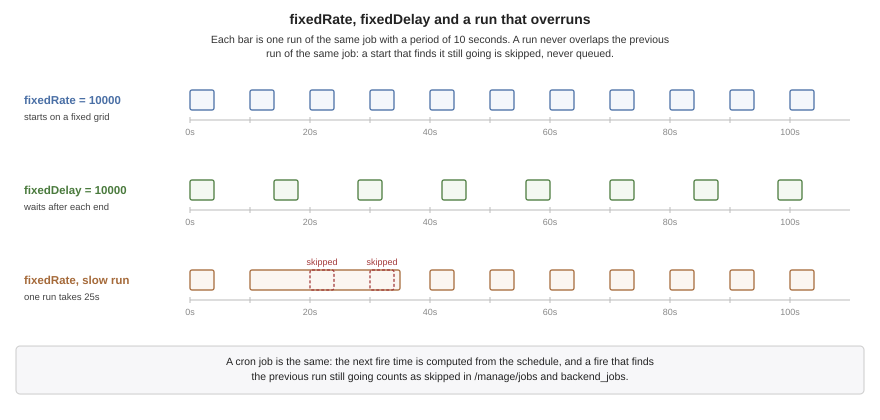

[[backend-scheduling]]
== Backend scheduling and background work

Not everything a server does fits inside a request. A report takes a minute to
build, webhooks go out after the response, a cleanup runs every night. This chapter
covers the three ways to run work outside a request: `@Async` methods, which
return before their work is done; `@Scheduled` methods, which run on a timetable;
and `Tasks`, for a one-off piece of work. All three run on named executors, and
each chooses between platform and virtual threads.

=== Background work

The annotations are Spring's, on ordinary bean methods:

[source,java]
----
include::../demos/backend/src/main/java/com/codenameone/developerguide/backend/beans/Reports.java[tag=backend-background,indent=0]
----

The build rewrites each `@Async` method so that it packages its arguments into a
task, hands the task to an executor and returns. Each `@Scheduled` method is
registered with the server's scheduler, with a literal cron expression already
compiled into bit masks. Neither involves a proxy, so both work however the
method is called.

=== Asynchronous methods

An `@Async` method returns `void` or a `java.util.concurrent.Future`; any other
return type is a build error, because the caller returns before there is anything
to return. The body returns `AsyncResult.of(value)`, and the caller receives,
immediately, a `Future` that completes with that value when the body has run:

* `get()` waits for the body and returns its value. On a virtual thread it yields
  its host while it waits rather than blocking it, so a request handler can wait
  for an `@Async(thread = VIRTUAL)` task without stalling the other connections
  that host serves.
* An exception the body throws comes out of `get()` wrapped in an
  `ExecutionException`.
* `cancel()` succeeds only before the body starts. A running body is never
  interrupted.

A `void` method has no `Future` to deliver a failure through, so an exception it
throws is logged, counted against its executor, and recorded on the task's span.
The task runs in a span of its own whose parent is the caller's, so background work
shows up in a trace under the request that started it.

A `synchronized` `@Async` method holds its monitor while the body runs on the
executor's thread, not merely while it hands the task over, so two calls still
never run the body at once.

Arguments are captured when the method is called, and the body runs later on
another thread. Pass values rather than objects the caller goes on changing, and
remember that the task runs outside the caller's transaction and outside its
request: a request-scoped bean isn't available to it.

=== Executors

Background work runs on named executors, created on first use:

[cols="2,3", options="header"]
|===
| Executor | Used by

| `default`
| `@Async` methods that name no executor, and `Tasks.platform`.

| `default-virtual`
| `@Async(thread = VIRTUAL)` methods that name none, and `Tasks.virtual`.

| `scheduling`, `scheduling-virtual`
| `@Scheduled` methods that name none, by thread kind.

| any other name
| `@Async("reports")`, or `@Scheduled(executor = "reports")`.
|===

Each is configured under its own name:

----
cn1.task.executor.reports.threads=4       # pool size; 8 by default, 2 for scheduling
cn1.task.executor.reports.kind=platform   # platform or virtual; overrides the code
----

A pool's threads start with its first task, so an unused executor costs
nothing. A task submitted while every thread is busy waits in the executor's
queue, and `cn1.task.queue_depth` reports how many are waiting, by executor.

=== Platform or virtual threads

`thread` on `@Async` and `@Scheduled` chooses the kind of thread, from
`ThreadKind`:

[cols="1,3", options="header"]
|===
| Value | Runs on

| `PLATFORM`, the default
| A thread of the executor's pool.

| `VIRTUAL`
| A virtual thread of its own on the server's hosts. Where there are none -- the
  development run on the JVM, a TLS server, Windows -- on the executor's pool
  instead.

| `AUTO`
| A virtual thread where the server runs them, a platform thread otherwise. The
  choice is logged once at start-up.
|===

The choice matters because of how virtual threads work on this runtime, explained
under <<Virtual threads and the request loop>>. A virtual thread parks only on the
socket it serves. An outbound read -- a database query, a call to another service
-- blocks the host thread running it, and with it every connection that host
serves. Work that talks to a database or makes outbound calls belongs on
`PLATFORM`, which is why it's the default. `VIRTUAL` suits work that's cheap to
start and mostly computes, or that there is a great deal of.

`Tasks` runs a single piece of work without a bean method:

[source,java]
----
include::../demos/backend/src/main/java/com/codenameone/developerguide/backend/beans/Digest.java[tag=backend-tasks,indent=0]
----

`Tasks.virtual` does the same on a virtual thread.

=== Scheduled jobs

A `@Scheduled` method takes no arguments and gives exactly one of `cron`,
`fixedRate` or `fixedDelay`. Any of them can come from configuration:

[source,java]
----
include::../demos/backend/src/main/java/com/codenameone/developerguide/backend/beans/Digest.java[tag=backend-scheduled-config,indent=0]
----

==== Cron expressions

A cron expression has Spring's six fields, seconds first, separated by spaces:

[cols="1,1,2", options="header"]
|===
| Field | Values | Examples

| second
| 0-59
| `0`, `*/10`

| minute
| 0-59
| `30`, `0,15,30,45`

| hour
| 0-23
| `9-17`, `*/2`

| day of month
| 1-31, or `L` for the last day
| `1`, `L`, `?`

| month
| 1-12, or `JAN` to `DEC`
| `JAN,JUL`, `*/3`

| day of week
| 0-7, or `SUN` to `SAT`; both 0 and 7 are Sunday
| `MON-FRI`, `?`
|===

Each field is `*` (or `?` for the two day fields), a value, a range `a-b`, a step
`*/n`, `a-b/n` or `a/n`, or a comma-separated list of those. The macros
`@yearly` (or `@annually`), `@monthly`, `@weekly`, `@daily` (or `@midnight`) and
`@hourly` stand for the usual expressions.

When both day fields are restricted, a day has to match both. That's Spring's
rule, and it differs from Unix cron, where matching either is enough:
`0 0 12 13 * FRI` fires on Friday the 13th and not on every Friday.

A literal expression is parsed by the build, so a mistake -- `0 0 25 * * *` names
an hour that doesn't exist -- fails the build with the field at fault, rather than
producing a job that never runs, or runs every second. An expression that reads
configuration, `${digest.cron:...}` above, is parsed at start-up instead, and a
bad one stops the server.

`zone` is the time zone the expression is read in: a zone ID such as
`Europe/Berlin`, a fixed offset such as `+02:00`, or `UTC`. Without one it's UTC,
which is what a server's clock should be set to regardless. The build checks the name,
and a zone on a job that isn't a cron job is an error.

==== Fixed rate and fixed delay

`fixedRate` starts runs a fixed number of milliseconds apart, measured from start
to start. `fixedDelay` waits that long after each run ends. `initialDelay` sets
how long after start-up the first run begins; without it the first run starts as
soon as the server does. The `String` forms, `fixedRateString`,
`fixedDelayString` and `initialDelayString`, accept a placeholder, so a period can
be configured per deployment.

.fixedRate, fixedDelay and a run that overruns

==== Runs never overlap

A run never overlaps the previous run of the same job. A start that finds the
previous run still going is skipped, and the job is next due at its following
time; it doesn't queue up and run twice to catch up. A fixed-rate job that falls
behind resumes on its own grid, without a burst. Each skipped start is counted, so
a job that routinely overruns its period shows up in the job listing rather than
running less often than it says with nobody noticing.

The scheduler itself is one platform thread that keeps the timetable. The runs
happen on the executors, so a slow job delays nothing but its own next run.

==== One instance at a time

With several instances of a server behind a load balancer, each runs every job.
For a job that should happen once -- sending the daily digest, purging old rows --
`lock` names a row it claims first:

----
@Scheduled(fixedDelay = 60000, lock = "purge")
----

Before each run the instance tries to claim the named row in a table called
`cn1_scheduler_lock`, in the server's own database, and skips the run when another
instance holds it. The claim expires after `lockAtMostFor` milliseconds -- ten
minutes when it isn't set -- so an instance that dies mid-run doesn't hold the job
forever. Set it longer than the job's longest run, or two instances can end up
running it at once. A job with a lock needs a database, which the build checks.

A skipped run isn't a failure. A lock that can't be claimed for any other reason --
the database refusing the statement -- is recorded as one, so a broken lock table
doesn't look like a job that's always somebody else's turn.

==== Watching the jobs

`GET /manage/jobs` lists every job with its schedule, its runs, failures and
skipped starts, when it last started, how long that took, the last error, and when
it's next due. The development MCP server has the same as `backend_jobs`, and
`backend_run_job` starts one immediately. The duration of each run is recorded in
the `cn1.scheduler.run.duration` histogram, by job and outcome.

When the server stops, the scheduler stops first so that no run begins during the
drain, and runs that haven't finished get the same grace period as the requests in flight.

=== Pitfalls

* **Database work on a virtual thread** blocks the host thread under it. Leave such
  work on `PLATFORM`.
* **Relying on the caller's context.** An `@Async` body runs outside the caller's
  transaction and request. A transaction it needs, it declares itself.
* **A cron expression read in local time.** Without `zone` it's UTC, so
  `0 0 9 * * *` fires at 09:00 UTC, which is the middle of the night somewhere.
* **`lockAtMostFor` shorter than a run.** Once the claim expires another instance
  may start the job while the first is still running it.
* **Several instances without `lock`.** Every instance runs every job.

