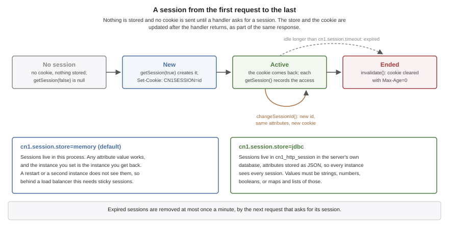

[[backend-sessions]]
== Backend sessions

HTTP is stateless: every request arrives on its own, and nothing in it says the
client has been here before. A session is how a server remembers a client between
requests. The server gives the client an unguessable id in a cookie, the client
sends it back with every request, and the server finds the state it kept under that
id. This chapter covers the session API, the cookie, where sessions are stored, and
session-scoped beans.

.A session from the first request to the last

=== Starting a session at sign-in

A handler reaches the session through the request:

[source,java]
----
include::../demos/backend/src/main/java/com/codenameone/developerguide/backend/beans/Login.java[tag=backend-session,indent=0]
----

`getSession(true)` returns the client's session, creating one if the request
carried no valid cookie. Nothing is stored and no cookie is sent until something
calls it, so a server that never uses sessions -- an API authenticated with
bearer tokens, say -- pays nothing for them and sets no cookie.

The call to `changeSessionId()` isn't optional at sign-in. It gives the session a
new id, keeps its attributes, and sends the client the new cookie. Without it a
session id the client held before signing in stays valid after, and an attacker
who planted that id in the victim's browser beforehand -- a session fixation
attack -- is signed in along with the victim.

=== Reading and ending a session

Most requests want the session only if there is one:

[source,java]
----
include::../demos/backend/src/main/java/com/codenameone/developerguide/backend/beans/Account.java[tag=backend-session-read,indent=0]
----

`getSession(false)` never creates a session, and answers `null` for a client
without a valid one, so a read-only request doesn't create a session as a side
effect. `invalidate()` ends one, and the response clears the client's cookie:

[source,java]
----
include::../demos/backend/src/main/java/com/codenameone/developerguide/backend/beans/Account.java[tag=backend-session-logout,indent=0]
----

[cols="2,3", options="header"]
|===
| `HttpSession` method | What it does

| `getAttribute(name)`, `setAttribute(name, value)`, `removeAttribute(name)`
| Read, set and remove the session's state. Setting `null` removes the attribute.

| `getAttributeNames()`
| A copy of the attribute names.

| `changeSessionId()`
| A new id for the same session, with a new cookie. Call it at sign-in.

| `invalidate()`, `isValid()`
| End the session, and ask whether it has been ended. Reading or writing an
  attribute of an ended session throws `IllegalStateException`.

| `isNew()`
| Whether the current request created the session.

| `getMaxInactiveInterval()`, `setMaxInactiveInterval(seconds)`
| How long the session may go unused before it expires, for this session alone.

| `getCreationTime()`, `getLastAccessedTime()`
| When it was created and last used, in milliseconds since the epoch.

| `getId()`
| The id the cookie carries. It's a credential, so never log it.
|===

A session is saved after the handler returns, and only when the request changed
it. A request that only reads its session writes nothing, apart from the last access
time the database store keeps, which it updates at most once a minute.

=== The cookie

The session id is 192 bits from a cryptographically secure random source,
encoded for a cookie. The cookie is sent with `Path=/` and `HttpOnly`, so
scripts in a page can't read it. `SameSite=Lax` keeps a browser from sending it
with a form another site posts. On a TLS server it's also `Secure`, so a browser
never sends it over plain HTTP. It carries no `Max-Age`, so it lasts until the
browser closes; how long the session lasts is the server's decision.

[cols="2,3", options="header"]
|===
| Key | What it sets

| `cn1.session.cookie`
| The cookie's name, `CN1SESSION` by default.

| `cn1.session.timeout`
| Seconds a session may go unused before it expires, 1800 by default. Zero means
  sessions never expire, and a negative value stops the server at start-up.

| `cn1.session.store`
| `memory`, the default, or `jdbc`. See <<Where sessions are kept>>.

| `cn1.session.same-site`
| `Lax`, `Strict` or `None`. `None` lets other sites send the cookie, and a
  browser accepts it only when it's `Secure`, so the server refuses to start with
  `None` unless the cookie is.

| `cn1.session.secure`
| `auto`, the default, which marks the cookie `Secure` when the server terminates
  TLS; `true` for a server behind a proxy that terminates TLS for it; or `false`.
  Anything else stops the server at start-up.
|===

Every server has its own settings and its own sessions, even when two run in one
process. That matters because cookies aren't scoped by port: a browser sends a
cookie for `localhost` to every port on it, and two servers sharing one store
would accept each other's sessions. `Backend.getSessions()` returns a running
server's sessions, whose `getStore()` answers the store in use.

=== Where sessions are kept

`cn1.session.store=memory` keeps sessions in the server's own memory. It needs
nothing, any object can be an attribute, and the object a request sets is the
object the next one gets. It also means sessions end with the process, and that a
second instance of the server doesn't know about them, so behind a load balancer
it needs the balancer to send each client to the same instance.

`cn1.session.store=jdbc` keeps sessions in the server's own database, in a table
called `cn1_http_session` that the server creates on first use. Every instance of
the server then sees every session, a restart loses nothing, and a deployment can
add or replace instances at will. The price is in what an attribute can be: the
attributes are stored as JSON, so a value must be a string, a number, a boolean, or
a map or list of those. Anything else is written as JSON can write it and read back
as whatever JSON reads, which isn't the object that was stored.

Either way, an expired session is removed at most once a minute, by the next
request that asks for a session, and a request that presents an expired session's
cookie is treated as having no session at all.

=== Session-scoped beans

A bean marked `@SessionScope` exists once per session, which suits state that
belongs to a client and has behaviour of its own:

[source,java]
----
include::../demos/backend/src/main/java/com/codenameone/developerguide/backend/beans/Cart.java[tag=backend-session-bean,indent=0]
----

A singleton that injects it receives a generated stand-in, and each call on the
stand-in reaches the calling client's own instance:

[source,java]
----
include::../demos/backend/src/main/java/com/codenameone/developerguide/backend/beans/CartApi.java[tag=backend-session-bean-api,indent=0]
----

Using the stand-in starts a session if the client has none, as `getSession(true)`
would. The instance is built on the session's first use and kept by the server in
memory for as long as the session lives. It's never written to the session store,
whichever store is configured, so with `cn1.session.store=jdbc` each instance of
the server builds its own copy for a client it serves. State that has to follow the
client from one instance to another belongs in the session's attributes instead.

The bean's `@PreDestroy` method, or its `destroyMethod` for a `@Bean` method, runs
when the session ends. That's at the end of the request that invalidated it, when
the periodic purge finds it expired, or when the server stops.

Two requests from the same client can run at once -- two browser tabs, or an app
that doesn't wait for one answer before sending the next -- and they reach the same
instance. The methods of a session-scoped bean therefore need to be safe to call
concurrently, which is why the `Cart` above synchronizes them.

A session-scoped bean can inject the `HttpSession` it belongs to. It can't inject
the request, because it outlives the request that built it, and the build refuses
that with a message saying so.

=== Pitfalls

* **Skipping `changeSessionId()` at sign-in** leaves the server open to session
  fixation. Call it whenever a session gains a privilege.
* **Storing objects the database store can't write.** A service, a stream or a
  domain object in an attribute works on the memory store and comes back as
  something else from the database store. Store ids and plain values, and load the rest per request.
* **Relying on memory sessions behind a load balancer** without sticky routing
  makes a client appear signed out whenever a request lands on another instance.
* **Holding a lock across the whole session.** Concurrent requests from one client
  share its attributes and its session-scoped beans, so a long `synchronized`
  method serializes that client's requests. Keep critical sections short.

