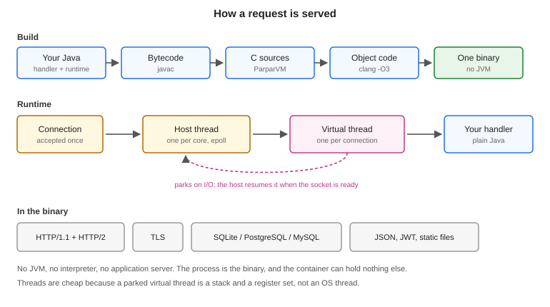
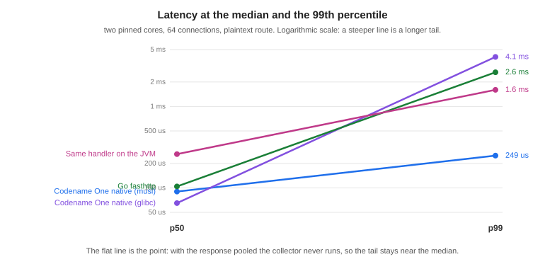

== Server-side backend

The backend compiles a Java HTTP handler into a native executable. It uses the
same ParparVM pipeline as the iOS, Windows and Linux ports: javac produces
bytecode, ParparVM turns that into C, and clang compiles the C together with the
runtime into one binary. Nothing interprets anything at run time, and there is no
JVM underneath.

The measurements in this chapter come from `vm/backend/benchmarks` on two pinned
cores against 64 connections, and the harness is in the repository so you can
disagree with them.

.The build pipeline and the request path

=== What this doesn't replace

Spring Boot, Quarkus, Micronaut and Jakarta EE aren't the competition here.
They carry dependency injection, an ORM, declarative transactions, a security
stack and two decades of operational knowledge, and none of that exists in this
runtime. If you are running a Spring service today and it works, this chapter is
not asking you to move it.

What those frameworks assume is a JVM, and that paying for one is reasonable. For
most server work that assumption holds. This exists for the work where it fails.

=== Why it exists

A JVM charges you twice. It charges start-up on every cold process, and it
charges a baseline heap for as long as the process lives. Both are fine when a
service runs for weeks and handles millions of requests. Neither is fine when the
process exits after 200 milliseconds, when you are billed per invocation, or when
the instance is capped at 128 MB.

That describes a specific and growing slice of server work: serverless functions,
sidecars, edge workers, webhook receivers, small always-on services. Java is thin
on the ground there, and the reason is arithmetic rather than taste. Teams
therefore reach for Go or Node, and a Java shop that does this ends up with two
languages, two toolchains, and two definitions of every object that crosses the
wire.

The point of the backend is to remove the reason to leave Java for that slice. It
doesn't try to take work the JVM already does well.

=== A first server

The archetype and the initializr both generate a `backend` module beside the
client ones:

----
myapp/
  common/    shared app code
  javase/    desktop build
  ios/       iOS build
  android/   Android build
  backend/   the server
    pom.xml
    src/main/java/com/example/myapp/BackendServer.java
----

The generated handler is a working server, not a stub:

----
public class BackendServer {
    public static void main(String[] args) throws Exception {
        Signals.installShutdownHandler();

        int port = envInt("PORT", 8080);
        final HttpServer server = HttpServer.start(null, port, 512, 16,
                new HttpServer.Handler() {
            public HttpServer.Response handle(HttpServer.Request request) {
                if ("/healthz".equals(request.getTarget())) {
                    return HttpServer.Response.json(200, "{\"status\":\"ok\"}");
                }
                return request.respond(200, "text/plain", HELLO);
            }
        }, null);

        Signals.onShutdown(new Runnable() {
            public void run() {
                server.stop(10000);   // stop accepting, drain, close
                System.exit(0);
            }
        });
        server.awaitTermination();
    }
}
----

Three things in that are worth naming. `Signals.installShutdownHandler` turns
SIGTERM into the ordered shutdown below it, so a container stop drains in-flight
requests instead of cutting them. `request.respond` answers from a Response the
connection already owns rather than allocating a new one, which is what keeps the
collector out of the request path. And `awaitTermination` is required: the host
threads are detached, so a `main` that returned would exit the process with no message.

Two commands matter:

----
# the property is not optional: the backend module lives in a profile, and
# without it Maven cannot see it in the reactor at all
mvn -pl backend -Dcodename1.platform=backend cn1:backend           # run it on this JVM
mvn -pl backend -Dcodename1.platform=backend cn1:backend-package   # build the native binary
----

The first is the development loop. Both run the same protocol code -- there is one
copy of `HttpServer`, and only the layer underneath it differs -- so behaviour
can't drift between the loop you develop in and the binary you ship. The local
run doesn't terminate TLS, by design, and therefore doesn't serve HTTP/2:
both refuse with a message that says so, because a second TLS implementation
would have its own bugs rather than production's.

=== Virtual threads and the request loop

The concurrency model is the part most worth understanding, because it's what
makes a handler that blocks acceptable.

Every connection gets a virtual thread. Not a pooled worker that a connection
borrows for one request -- a stack that belongs to that connection until it
closes. The handler can block on a socket read, a database round trip or a file,
and it costs a parked stack rather than an OS thread.

Host threads run those virtual threads, and there is one host per core. A
descriptor is registered in exactly one host's epoll set, so it can only ever be
reported to that host, and only that host ever touches its virtual thread. That
affinity is why the scheduler needs no locks on the hot path.

The loop is: the host polls, a descriptor becomes readable, the host resumes that
connection's virtual thread, the handler runs until it needs bytes that haven't
arrived, and it parks. Parking returns control to the host, which polls again.
When the handler finishes a response the descriptor stays armed, so the next
request on that connection costs no system call to set up.

Host count follows cores rather than the `workers` argument. On two pinned cores,
16 hosts served 117 requests where 2 hosts served 257,297: past one host per core
they compete for the cores the server needs. In this mode `workers` stops meaning
"requests in flight," because the virtual threads supply that.

=== Talking to a database

`Database.open` takes a SQLite path or a PostgreSQL or MySQL URL, and the rows
come back as the same Java types either way:

----
Database db = Database.open(System.getenv("DATABASE_URL"));   // or ":memory:"
db.execute("CREATE TABLE IF NOT EXISTS note (id INTEGER PRIMARY KEY, body TEXT)",
           null);

List rows = db.query("SELECT id, body FROM note WHERE id > ?",
                     new Object[] { Integer.valueOf(10) });
----

There is no JDBC driver involved. SQLite is linked into the binary, and the
PostgreSQL and MySQL clients speak their wire protocols directly. `DbPool` holds
connections when more than one request needs the database at a time.

=== Sharing the contract with the app

This is where having the same language on both ends stops being a slogan. An
interface annotated for the REST client generates the app's client:

----
@RestClient
public interface NotesApi {
    @GET("/notes/{id}")
    void note(@Path("id") String id, OnComplete<Response<Note>> callback);

    @POST("/notes")
    void create(@Body Note note, OnComplete<Response<Note>> callback);
}
----

Building the backend module with `-Dcn1.restServer=true` generates two more types
from that same interface: `NotesApiServer`, a synchronous interface the backend
implements, and `NotesApiDispatcher`, which routes a method, path and body to it
and binds the path and query parameters.

----
public class Notes implements NotesApiServer {
    public Note note(String id) { ... }          // no callback: this IS the server
    public Note create(Note note) { ... }
}
----

The client's methods are asynchronous because a UI can't block; the server's
methods are synchronous because a handler has nothing to call back into. One declaration
produces both shapes, which is what gRPC does and for the same reason.

The payoff is that changing the contract breaks the build on whichever side did
not follow it, instead of producing a response the app fails to parse in the
field. The data transfer objects are shared rather than transcribed, and their
codecs are generated on both sides, so there is no handwritten mapping layer to
drift.

The server half is off by default. Every existing project carries these
interfaces for its client alone, and generating server classes into those builds
would grow them for nothing.

=== What it costs

Same handler, three ways, plus Go for an outside reference. Two pinned cores, 64
connections, medians of three interleaved runs on the plaintext route:

[cols="2,1,1,1,1"]
|===
| Runtime | Requests/sec | p50 | p99 | Cold start

| Codename One native, musl
| 595,610
| 0.090 ms
| 0.249 ms
| 0.77 ms

| Codename One native, glibc
| 547,761
| 0.065 ms
| 4.06 ms
| 2.88 ms

| Go, fasthttp
| 496,293
| 0.104 ms
| 2.63 ms
| 2.39 ms

| The same handler on the JVM
| 187,745
| 0.260 ms
| 1.60 ms
| 82.5 ms
|===

Cold start is the interesting column. It's measured from process spawn to the
first accepted connection, and the static binary reaches it in under a
millisecond -- about a hundred times faster than the same code on a JVM, and
three times faster than Go. That number is the whole serverless argument.

Throughput is the least interesting one. Beating a tuned Go server by a fifth on
a microbenchmark isn't a reason to move a service; it's only evidence that the
translation doesn't cost you anything.

.Latency at the median against the 99th percentile

The slope chart is the one that matters. Every runtime here has a similar
median. What differs is the distance to the 99th percentile, and that distance is
garbage collection. With the response pooled the plaintext route allocates about
0.1 bytes per request, the collector never runs, and the tail stays at 2.8 times
the median. Give the same server a handler that allocates a map per request and
its tail goes to 80 ms, because the collector shares the cores with the server.

The honest rule is that the tail follows your allocation rate, not the runtime
badge. The runtime gives you the tools to allocate nothing on the hot path; it
doesn't do it for you.

==== Memory and size

[cols="2,1,1"]
|===
| Runtime | Binary or artifact | Resident under load

| Codename One native, musl
| 7.95 MB static
| 10-40 MB

| Codename One native, glibc
| 3.19 MB dynamic
| 14 MB

| Go, fasthttp
| 5.63 MB static
| 6.3 MB

| The same handler on the JVM
| 0.13 MB jar, plus a JRE
| 190 MB
|===

The JVM row is the same handler and the same protocol code. Everything it costs
above the native rows is the runtime underneath it.

The resident figures move around more than the latency ones, because the
collector keeps a pool of pages sized to the busiest moment the process has seen
and gives them back gradually. At rest the native builds sit near 3 MB.

==== musl or glibc

Both are supported, and they aren't equivalent. The static musl build starts
faster and has a far shorter tail. The glibc build has a better median, because
its allocator is better under contention, and a smaller binary, because it links
the system libraries instead of carrying them.

The reason to pick musl isn't the median. It's that the artifact is one file
with nothing underneath it, which is what makes the container the binary and the
cold start a process exec.

==== What isn't measured here

GraalVM is missing from these tables on purpose. A fair comparison would have to
run the same handler, and this handler can't run on GraalVM: the runtime's
native methods are ParparVM's, so comparing would mean benchmarking a different
server written against a different framework and reporting it as though the
toolchains had been compared. That's a benchmark worth building, and it isn't
this one.

=== Deploying it

The musl build is a single static file, so the container that carries it can be
empty:

----
FROM scratch
COPY bench-linux-musl-arm64 /server
ENTRYPOINT ["/server"]
----

There is no base image to patch, because there is no base image. `cn1:backend-package`
builds for the machine it runs on; the cross-compiled targets
(`musl-x86_64`, `musl-arm64`, `glibc-x86_64`, `glibc-arm64`) are produced by
`vm/backend/package.sh` in the Codename One repository, which drives one builder
image per target.

For AWS Lambda, `LambdaRuntime` implements the custom runtime loop. The Lambda
Runtime API is a plaintext poll over loopback, so it needs no listening socket and
no TLS, and what it does need is exactly what a translated binary is good at.

=== Limits worth knowing

* The class library is the Codename One runtime, not Java SE. A server dependency
  that assumes the full JDK won't translate, and Maven Central isn't the
  ecosystem this draws on.
* There is no framework structure. Routing, validation and error mapping are
  written by hand or generated from the REST contract.
* The packaging goal compiles Java. It recompiles the module's sources against the
  backend's class library instead of reusing the jar Maven built, which is what
  keeps a server off classes the runtime doesn't have, and is also why Kotlin is
  not wired into this path yet even though the client ports support it.
* Native builds target Linux. Development happens anywhere a JVM runs.

The reasons to choose this are cold start, footprint, deployment shape, and one
language across the app and its server. If none of those matter for the service in
front of you, use a JVM framework.
