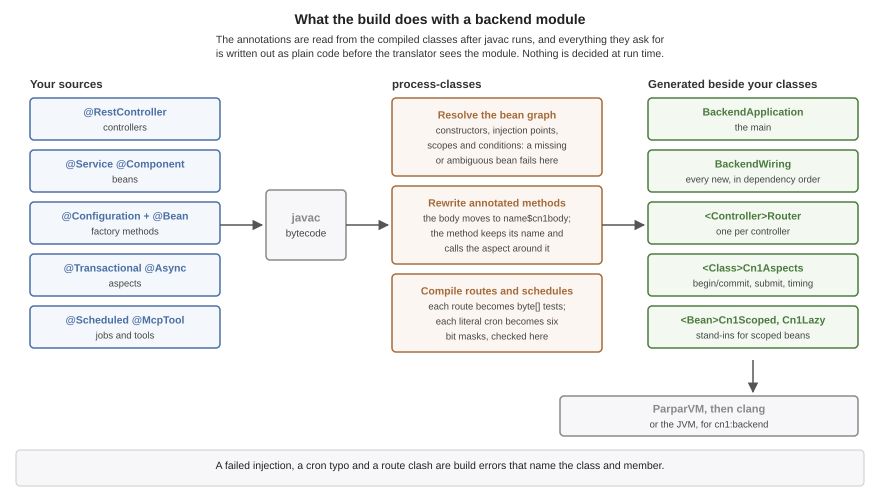
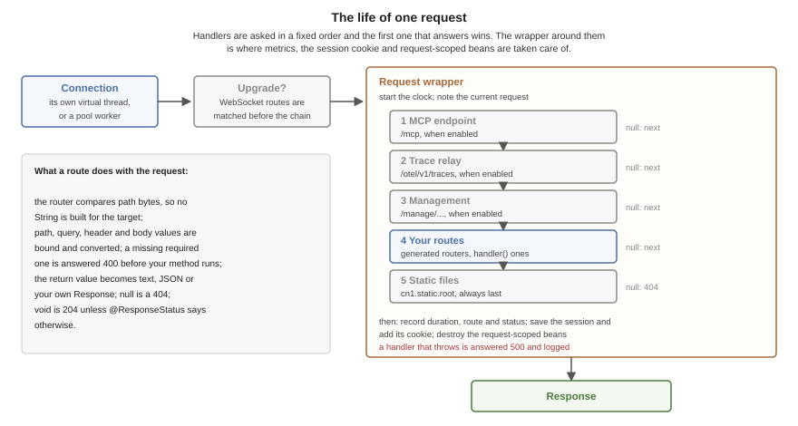

== Server-side backend

The backend compiles a Java HTTP handler into a native executable. It uses the
same ParparVM pipeline as the iOS, Windows and Linux ports: javac produces
bytecode, ParparVM turns that into C, and clang compiles the C together with the
runtime into one binary. Nothing interprets anything at run time, and there is no
JVM underneath.

The measurements in this chapter come from `vm/backend/benchmarks` on two pinned
cores against 64 connections, and the harness is in the repository so you can
disagree with them.

.The build pipeline and the request path
image::img/backend-architecture.svg["Java compiled to C to a native binary, and a request travelling through a host thread and a virtual thread to the handler",scaledwidth=95%]

=== What this doesn't replace

Spring Boot, Quarkus, Micronaut and Jakarta EE aren't the competition here.
They carry a security stack, a starter for every service a company runs, a
container that discovers beans in any jar on the class path, and two decades of
operational knowledge. If you are running a Spring service today and it works,
these chapters aren't asking you to move it.

What this runtime borrows from them is the programming model. Controllers,
services, dependency injection, declarative transactions, scheduled jobs and
managed beans use Spring's annotation names and mean what they mean there, so a
Spring developer can read a Codename One backend without learning it first. What
it doesn't borrow is the container: every one of those annotations is resolved
while the project builds, into ordinary code, and there is nothing left to
interpret when the server runs.

What those frameworks assume is a JVM, and that paying for one is reasonable. For
most server work that assumption holds. This exists for the work where it fails.

=== Why it exists

A JVM charges you twice. It charges start-up on every cold process, and it
charges a baseline heap for as long as the process lives. Both are fine when a
service runs for weeks and handles millions of requests. Neither is fine when the
process exits after 200 milliseconds, when you are billed per invocation, or when
the instance is capped at 128 MB.

That describes a specific and growing slice of server work: serverless functions,
sidecars, edge workers, webhook receivers, small always-on services. Java is thin
on the ground there, and the reason is arithmetic rather than taste. Teams
therefore reach for Go or Node, and a Java shop that does this ends up with two
languages, two toolchains, and two definitions of every object that crosses the
wire.

The point of the backend is to remove the reason to leave Java for that slice. It
doesn't try to take work the JVM already does well.

=== How the backend chapters fit together

This chapter covers what every server needs: the module, the build, the
concurrency model and configuration. The chapters after it each take one part of
a server and go into depth:

* <<backend-web>>: mapping HTTP requests to methods, sharing a typed contract
  with the app, and holding WebSocket connections open.
* <<backend-beans>>: splitting a server into services the build wires together,
  with scopes, conditions and configuration binding.
* <<backend-data>>: the connection pool, the object mapping, and
  `@Transactional` in full, with propagation, rollback rules and savepoints.
* <<backend-sessions>>: keeping state for a client across requests.
* <<backend-scheduling>>: running work later, on a schedule, or on another thread.
* <<backend-observability>>: traces, metrics, managed beans and the management
  endpoints.
* <<backend-mcp>>: letting an AI agent call the server's tools, and giving an agent
  that builds the server a way to inspect and exercise it.
* <<backend-operations>>: the measurements, deployment, and the limits worth
  knowing before choosing this.

=== A first server

The archetype and the initializr both generate a `backend` module beside the
client ones:

----
myapp/
  common/    shared app code
  javase/    desktop build
  ios/       iOS build
  android/   Android build
  backend/   the server
    pom.xml
    src/main/java/com/example/myapp/Notes.java
----

A server is a class with routes on it. The annotations are Spring's, under
Codename One's package names, so this reads the same way to anyone who has
written a Spring controller:

[source,java]
----
include::../demos/backend/src/main/java/com/codenameone/developerguide/backend/Notes.java[tag=backend-first-server,indent=0]
----

There is no `main` here, and that's the point. Every server opens with the same
twenty lines -- start a listener, install a shutdown handler, wait on it -- and
getting any of them wrong produces one that leaks connections on SIGTERM, or one
that ends the moment `main` returns and says nothing about why. The build writes
those lines, from the controllers it finds.

It also writes the router. The obvious hand-written form,
`if ("/healthz".equals(request.getTarget()))`, builds a String for the target,
hashes it and compares it -- for every route it tries before the one that matches,
on every request -- and breaks as soon as a client appends `?probe=1`. The
generated router holds each route as a `byte[]` and asks the request whether its
path bytes are those bytes, so a route with no path variables allocates nothing at
all and a query string can't break it.

The return value decides the response. A `String` is sent as text, anything else as
JSON, `null` is a 404, and `@ResponseStatus` sets the code for the cases where 200
isn't it. A handler that needs something this doesn't model takes the
`HttpServer.Request` itself and answers exactly as it would have before.

Two commands matter:

----
# the property is not optional: the backend module lives in a profile, and
# without it Maven cannot see it in the reactor at all
mvn -pl backend -Dcodename1.platform=backend cn1:backend           # run it on this JVM
mvn -pl backend -Dcodename1.platform=backend cn1:backend-package   # build the native binary
----

The first is the development loop. Both run the same protocol code -- there is one
copy of `HttpServer`, and only the layer underneath it differs -- so behaviour
can't drift between the loop you develop in and the binary you ship. The local
run doesn't terminate TLS, by design, and therefore doesn't serve HTTP/2:
both refuse with a message that says so, because a second TLS implementation
would have its own bugs rather than production's.

=== What the build writes

Every annotation in these chapters is read from the compiled classes, after javac
and before the translator, during the `process-classes` phase. The build works out
everything the annotations ask for and writes it down as plain Java, so the
translator and the dead-code pass see an ordinary program:

.What the build does with a backend module

* `BackendApplication` is the `main`. It builds the configuration, opens the
  database, starts the server and installs the shutdown handler.
* `BackendWiring` is the whole of dependency injection: a `new` for each bean in
  dependency order, the calls that set its injected fields, and its
  `@PostConstruct` method. <<backend-beans>> describes what goes into it.
* A `Router` per controller holds each route as a `byte[]` and binds each
  parameter with code written for its type.
* A `Cn1Aspects` class per annotated class carries what `@Transactional`,
  `@Async`, `@Timed` and `@Counted` add around a method. The method keeps its name
  and signature, its body moves to a method of its own, and the method calls the
  aspect around that body.

That has three consequences worth knowing from the start. A dependency that
can't be satisfied, a route claimed twice and a cron expression with a typo are
build errors, each naming the class and member at fault, rather than failures the
first request finds. Starting a server with fifty beans costs what the fifty
constructors cost, because there is no scan and no lookup. And a feature the
application skips isn't in the binary at all: the translator drops every
class nothing references, and the generated code references only what the
annotations asked for.

The generated classes land in `target/classes` beside the module's own. To see
what the build decided about the beans without reading bytecode, ask a running
development server: the `backend_beans` tool described in <<backend-mcp>> lists
every bean, its scope and what was injected into it.

=== Virtual threads and the request loop

The concurrency model is the part most worth understanding, because it's what
makes a handler that blocks acceptable.

Every connection gets a virtual thread. Not a pooled worker that a connection
borrows for one request -- a stack that belongs to that connection until it
closes. The handler can block on a socket read, a database round trip or a file,
and it costs a parked stack rather than an OS thread.

Host threads run those virtual threads, and there is one host per core. A
descriptor is registered in exactly one host's epoll set, so it can only ever be
reported to that host, and only that host ever touches its virtual thread. That
affinity is why the scheduler needs no locks on the hot path.

The loop is: the host polls, a descriptor becomes readable, the host resumes that
connection's virtual thread, the handler runs until it needs bytes that haven't
arrived, and it parks. Parking returns control to the host, which polls again.
When the handler finishes a response the descriptor stays armed, so the next
request on that connection costs no system call to set up.

Host count follows cores rather than the `workers` argument. On two pinned cores,
16 hosts served 117 requests where 2 hosts served 257,297: past one host per core
they compete for the cores the server needs. In this mode `workers` stops meaning
"requests in flight," because the virtual threads supply that.

=== The life of a request

A server's handlers are arranged in a chain, and each one either answers a request or
passes it on by answering `null`. The order is fixed, so which handler wins
never depends on registration order or on what happens to be in a directory:

.The life of one request

. A WebSocket upgrade is matched first, against the `@WebSocketMapping` routes,
  and never reaches the chain.
. The server's own endpoints come next, each only when it's turned on: MCP at
  `/mcp`, the trace relay at `/otel/v1/traces`, and the management endpoints
  under `/manage`. They come before the application's routes so a catch-all
  route can't answer a health check.
. Then the application's routes.
. Static files from `cn1.static.root` are always last, so a file can't shadow a
  route by being named like one.
. A request nothing answered is a 404.

Around the chain sits one wrapper, and it's where the per-request features
live. It starts the clock for the request duration metric, makes the request
available to request-scoped beans, and records the request for the development
tools. After the chain answers it saves the session and adds its cookie, destroys
the request's request-scoped beans, and records the duration under the route that
matched. A handler that throws is answered with a 500 whose body says only
`internal error`, and the exception goes to the log rather than to the client.

=== Configuration and profiles

A server runs against a file on a laptop and a managed database in production,
and the difference between those two can't live in the source. It lives in
properties files beside the binary and in the environment:

`application.properties`, committed:

[source,properties]
----
include::../demos/backend/src/main/resources/application.properties[tag=backend-config-base,indent=0]
----

`application-dev.properties`, also committed:

[source,properties]
----
include::../demos/backend/src/main/resources/application-dev.properties[tag=backend-config-dev,indent=0]
----

----
CN1_PROFILE=dev ./server                         # SQLite, nothing installed
DATABASE_URL=postgres://app:secret@db/app ./server   # production
----

A key is resolved in one order, and the first layer that has it wins: a system
property of that exact name, then the environment variable it maps to
(`cn1.datasource.url` becomes `CN1_DATASOURCE_URL`), then the environment
variable a platform already sets for it, then
`application-<profile>.properties`, then `application.properties`.

The third layer is worth spelling out. `PORT` and `DATABASE_URL` are set for you
by every platform-as-a-service worth the name, and a server that ignored them
would need a wrapper script to start at all, so they're read where those two
keys are read.

A value may name an environment variable as `${NAME}` or `${NAME:fallback}`, and
that reference resolves when the value is READ rather than when the file loads.
That's what lets the committed `application.properties` above name a variable
only production sets: the development profile overrides the key, so the unset
variable is never read. A reference that's read and can't be resolved fails
with a message naming it, because the alternative is a server that opens a SQLite file
called `${DATABASE_URL}` and finds it empty.

Nothing here is required. A binary with no properties file beside it reads its
whole configuration from the environment, which is the normal shape for a
container built `FROM scratch`: there is no file next to the binary because
there is nothing next to the binary.

[cols="2,3", options="header"]
|===
| Key | What it sets

| `cn1.profile`
| The active profile. `dev`, `development`, `test` and `local` are development
  profiles, which changes two defaults and nothing else.

| `cn1.datasource.url`
| A SQLite path, or a `postgres://` or `mysql://` URL. Also read from
  `DATABASE_URL`. On a development profile an unset value means an in-memory
  SQLite database; on any other profile it's an error, because a service that
  writes into a database inside its own process, with nothing saying so, loses
  everything at the next deploy.

| `cn1.datasource.pool.size`
| How many connections to hold. The default is eight for a server engine, four
  for a SQLite file and one for an in-memory database.

| `cn1.server.port`
| The port. Also read from `PORT`.

| `cn1.server.workers`
| The size of the request thread pool, 16 by default. Under virtual threads it
  no longer bounds the requests in flight; see <<Virtual threads and the request loop>>.

| `cn1.server.tls.certificate`, `cn1.server.tls.key`
| A PEM certificate and key to terminate TLS with. One without the other is
  refused rather than serving plaintext under a name that promises otherwise.

| `cn1.static.root`
| A directory to serve files from, after every route.

| `cn1.orm.createTables`
| Whether the generated daos create their tables at start-up. True on a
  development profile, false everywhere else.

| `cn1.config.location`
| The directory the properties files are read from; the working directory by
  default. Read only from a system property or the environment, since it
  decides where the files are.

| `cn1.server.backlog`
| The listen backlog, 512 by default.

| `cn1.server.shutdownTimeoutMillis`
| How long a stop waits for the requests in flight, 10 seconds by default. Zero
  means don't wait.

| `cn1.server.tls.http2`
| Whether a TLS server offers HTTP/2 through ALPN. True by default.

| `cn1.static.prefix`, `cn1.static.index`, `cn1.static.cacheControl`
| Where static files are served (`/static`), the file a directory answers with
  (`index.html`), and their `Cache-Control` header (`public, max-age=3600`).

| `cn1.datasource.pool.borrowTimeoutMillis`
| How long a request waits for a free connection before it fails, 10 seconds by
  default.

| `cn1.datasource.busyTimeoutMillis`
| How long SQLite waits on a locked database file, 5 seconds by default.
|===

The chapters that follow add their own keys -- `cn1.session.*`,
`cn1.task.executor.*`, `cn1.management.*`, `cn1.mcp.*` and `cn1.otel.*` -- and
list each one where it's described.

Handlers that need any of this get it from the entry point the build writes.
Only a server that writes its own `main` names the builder behind it:

[source,java]
----
include::../demos/backend/src/main/java/com/codenameone/developerguide/backend/ServerSnippets.java[tag=backend-builder,indent=0]
----

`run()` reads the configuration, opens the database, binds, installs a shutdown
handler that drains what's in flight, and blocks. Anything the builder is told
is used as given, and anything it isn't told comes from the configuration --
so a port written in the source is the port, and a port that should follow the
deployment is one nobody writes there.
