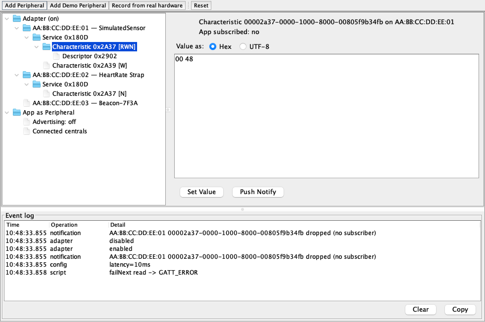
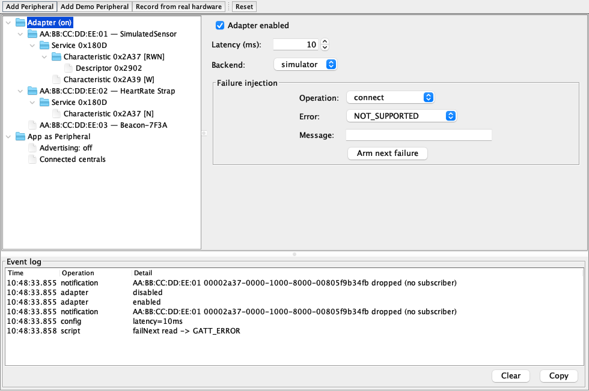

== Bluetooth

Codename One ships a first-class Bluetooth API under `com.codename1.bluetooth` that covers both Bluetooth Low Energy roles and classic Bluetooth: scan for and connect to BLE peripherals (the GATT client), act as a BLE peripheral (a local GATT server plus advertising), stream bytes over L2CAP connection-oriented channels, and exchange RFCOMM streams with classic serial devices.

`Bluetooth.getInstance()` is the single entry point and never returns `null` -- ports without Bluetooth return a fallback whose operations fail fast with `BluetoothError.NOT_SUPPORTED`, so calling code needs no platform-specific `if`. Every callback of the API -- `AsyncResource` results, scan sightings, connection events, notifications, adapter state changes -- is delivered on the EDT; the only exceptions are the blocking RFCOMM/L2CAP streams, which must be consumed off the EDT.

[options="header"]
|===
| Capability | Android | iOS / Mac Catalyst | Simulator (mock) | Simulator (native backend) | JavaScript
| BLE central (scan, GATT client) | yes | yes | yes | yes | browser chooser only
| BLE peripheral (GATT server + advertising) | yes | yes (not tvOS/watchOS) | yes | -- | --
| L2CAP channels | yes (Android 10+) | yes (iOS 11+) | yes | -- | --
| Classic RFCOMM | yes | -- | yes | -- | --
| Bonding | yes | OS-managed | yes | -- | --
|===

On the JavaScript port, Web Bluetooth limits the central role to the browser's device chooser (Chrome-family browsers over HTTPS): `startScan(...)` surfaces the chooser built from the scan filters and delivers the single user-picked device as one `ScanResult`. No further sightings ever arrive, the RSSI is unknown, the MTU is fixed at 512 and peripheral mode, classic Bluetooth and L2CAP are unavailable.

Always branch through the capability queries -- `isLeSupported()`, `isPeripheralModeSupported()`, `isL2capSupported()`, `isClassicSupported()` -- rather than through platform detection.

=== Quick start: Scan and connect

[source,java]
----
include::../demos/common/src/main/java/com/codenameone/developerguide/snippets/generated/BluetoothJava001Snippet.java[tag=bluetooth-java-001,indent=0]
----

`ScanFilter` criteria on one filter are AND-combined; multiple filters added to the same `ScanSettings` are OR-combined, and a scan without filters reports every advertising device. Any number of scans may run concurrently -- each `BleScan` handle only sees advertisements matching its own filters, and the platform scan stops when the last handle stops. On iOS a service-UUID filter is also what keeps scans alive in the background, so prefer filtered scans.

Peripheral addresses returned by `BluetoothDevice.getAddress()` are stable per app install -- the MAC address on Android and desktop, the per-app CoreBluetooth identifier on iOS -- and safe to persist for later reconnection through `BluetoothLE.getPeripheral(String)`. They're not portable across devices or platforms, so never treat them as the peripheral's real hardware address.

`getAdapterState()` reports where the local radio stands (`POWERED_ON`, `POWERED_OFF`, `UNAUTHORIZED`, ...) and `addAdapterStateListener(...)` fires on the EDT whenever it changes -- the natural place to pause scans and gray out UI. `requestEnable()` shows the Android system dialog asking the user to turn the adapter on; on iOS there is no programmatic enable flow, so it resolves `false` and the app should direct the user to the Settings app instead.

Connection lifecycle is equally explicit. `connect(ConnectionOptions)` accepts a timeout (iOS connect requests never time out on their own, so set one) and an `autoConnect` flag that asks the platform to re-establish the link whenever the peripheral comes back into range. `addConnectionListener(...)` reports every transition including link loss, and every failure across the API surfaces as a `BluetoothException` whose `getError()` returns a typed `BluetoothError` constant -- no string matching required.

=== Reading and writing characteristics

`discoverServices()` caches the peripheral's GATT database; from there `getService(...)`, `getCharacteristic(...)` and the convenience accessors on `GattCharacteristic` cover the day-to-day operations:

[source,java]
----
include::../demos/common/src/main/java/com/codenameone/developerguide/snippets/generated/BluetoothJava002Snippet.java[tag=bluetooth-java-002,indent=0]
----

All GATT operations return independent `AsyncResource` handles and may be issued concurrently: an internal per-peripheral queue serializes them toward the platform stack (which allows only one in-flight request per connection) and applies a safety timeout, so a lost platform callback can never wedge the queue. Operations on different peripherals run fully concurrently. `writeWithoutResponse(...)` resolves once the value is queued to the controller -- there is no remote acknowledgement.

A default BLE connection carries 23 bytes per attribute operation; `requestMtu(...)` negotiates a larger value and resolves with what was granted (on iOS the OS negotiates by itself, so the request resolves immediately with the current value -- check `getMtu()` before chunking data). `requestConnectionPriority(...)` trades latency against battery on Android and is a successful no-op on iOS. `createBond()` initiates pairing where the peripheral requires an encrypted link; on iOS bonding is OS-managed and triggered automatically by encrypted characteristics, so the call resolves `true` without user interaction.

=== Notifications

[source,java]
----
include::../demos/common/src/main/java/com/codenameone/developerguide/snippets/generated/BluetoothJava003Snippet.java[tag=bluetooth-java-003,indent=0]
----

The Client Characteristic Configuration descriptor (CCCD) is handled automatically: the first listener triggers the descriptor write that arms notifications (indications are used when the characteristic only supports those) and removing the last listener disarms it again. Values stream to the listeners on the EDT until unsubscribed or disconnected.

=== Peripheral mode

When `isPeripheralModeSupported()` returns `true` the device can serve data itself -- open a local GATT server, add service definitions and advertise them:

[source,java]
----
include::../demos/common/src/main/java/com/codenameone/developerguide/snippets/generated/BluetoothJava004Snippet.java[tag=bluetooth-java-004,indent=0]
----

Characteristics with a static value (`setValue(...)`) are served without involving the listener; characteristics without one route every read to `characteristicReadRequest(...)`, which must answer via `respond(...)` or `reject(...)` -- centrals time out unanswered requests.

Two iOS platform notes: CoreBluetooth only broadcasts the local name and service UUIDs, dropping manufacturer data, service data and TX power from advertisements (Android broadcasts everything). And iOS serves descriptors from their static values only -- descriptor read/write requests never reach the listener there, so always give local descriptors a static value for cross-platform behavior.

=== L2CAP channels

L2CAP connection-oriented channels provide a raw bidirectional byte stream -- much higher throughput than chunking data through GATT characteristics. The peripheral side opens a listener and publishes its Protocol/Service Multiplexer (PSM), typically through a GATT characteristic; the central side connects to that PSM:

[source,java]
----
include::../demos/common/src/main/java/com/codenameone/developerguide/snippets/generated/BluetoothJava005Snippet.java[tag=bluetooth-java-005,indent=0]
----

On Android an L2CAP channel establishes its own link and doesn't require `connect()` first; on iOS the peripheral must be connected. The streams throw plain `java.io.IOException` on transport failure and, like all Bluetooth streams, block -- never touch them on the EDT.

=== Classic Bluetooth

Classic (BR/EDR) Bluetooth covers inquiry discovery, bonding and RFCOMM stream connections -- the Serial Port Profile (SPP) world of printers, scanners and industrial equipment. iOS doesn't expose classic Bluetooth to applications, so this role is Android, desktop and simulator only; `isClassicSupported()` is the gate:

[source,java]
----
include::../demos/common/src/main/java/com/codenameone/developerguide/snippets/generated/BluetoothJava006Snippet.java[tag=bluetooth-java-006,indent=0]
----

`startDiscovery(...)` runs an inquiry scan (about 12 seconds) and returns a live `ClassicDiscovery` handle that resolves when the inquiry ends. `getBondedDevices()` lists already-paired devices without a discovery, and `connect(String, BluetoothUuid, boolean)` reconnects to a persisted address directly.

=== Permissions and build hints

The build pipeline scans the application's bytecode and injects only what the referenced packages need -- apps that never touch `com.codename1.bluetooth` see no manifest or plist change, and a central-only app never carries advertise permissions.

[options="header"]
|===
| Detected usage | Android injected (target SDK 31+) | iOS injected
| Any `com.codename1.bluetooth` reference | `BLUETOOTH` (capped at `maxSdkVersion="30"`), `<uses-feature android:name="android.hardware.bluetooth_le">` | `NSBluetoothAlwaysUsageDescription` + `NSBluetoothPeripheralUsageDescription` defaults (only if unset), CoreBluetooth.framework, the CN1 Bluetooth natives
| Scanning (`ScanSettings` / `BleScan` / classic discovery) | `BLUETOOTH_ADMIN` (capped at 30), `BLUETOOTH_SCAN` with `usesPermissionFlags="neverForLocation"`, `ACCESS_FINE_LOCATION` (capped at 30) | --
| Connections (GATT, `BlePeripheral`, RFCOMM, L2CAP) | `BLUETOOTH_CONNECT` | --
| Peripheral mode (`com.codename1.bluetooth.le.server`) | `BLUETOOTH_ADMIN` (capped at 30), `BLUETOOTH_ADVERTISE` | --
| Classic (`com.codename1.bluetooth.classic`) | `<uses-feature android:name="android.hardware.bluetooth">` | not supported
|===

Builds targeting an SDK below 31 receive the legacy permissions uncapped and none of the Android 12 ones. Permissions you declare yourself (via `android.xpermissions`) are never duplicated.

Override the defaults with the matching build hints:

[options="header"]
|===
| Build hint | Default | Notes
| `android.bluetooth.neverForLocation` | `true` | Declares that scan results never derive the user's location, which caps `ACCESS_FINE_LOCATION` at API 30 and flags `BLUETOOTH_SCAN` accordingly
| `android.bluetooth.required` | `false` | Marks the BLE hardware feature required so stores hide the app on devices without it
| `ios.bluetooth.background` | (none) | `central`, `peripheral` or `central,peripheral` -- merged into `UIBackgroundModes` as `bluetooth-central` / `bluetooth-peripheral`
| `ios.NSBluetoothAlwaysUsageDescription` | "Communicates with nearby Bluetooth accessories." | Localise this -- Apple rejects builds that ship generic privacy copy
|===

Beacon and indoor-positioning apps are the one case where the `neverForLocation` default is wrong: an app that derives location from BLE sightings must set `android.bluetooth.neverForLocation=false`, otherwise Android 12+ filters beacon advertisements out of its scan results. With the hint set to `false` the location permission stays uncapped and the app keeps prompting for it on Android 12+.

=== Simulator support

The JavaSE simulator implements the whole API against a scriptable virtual Bluetooth stack. `Simulate -> Bluetooth Simulation` opens a window with a tree of the simulated adapter, the virtual peripherals and the app's own peripheral role; selecting a node opens its detail editor (hex value editors on characteristics), a toolbar stages demo devices, failure injection arms the next operation of a chosen kind (`connect`, `read`, `write`, `discover`, `subscribe`, `scan` and the rest) to fail with a chosen `BluetoothError`, a latency spinner delays every asynchronous completion and a live event log shows what the stack does. All settings persist between simulator runs.

The window's backend selector switches the simulator between the virtual stack and a native backend that drives the host machine's real Bluetooth radio through a bundled btleplug helper process (CoreBluetooth on macOS, BlueZ on Linux, WinRT on Windows). The native backend is central-only -- real scanning, connections and GATT operations against physical devices, without leaving the simulator. The initial backend comes from the `cn1.bluetooth.backend` system property (default `simulator`).

The `Simulate -> Bluetooth` menu exposes the same operations as one-click hooks; every item is also callable from cross-platform code via `CN.execute("bluetooth:itemN")`:

[options="header"]
|===
| Hook | Menu label | Effect
| `bluetooth:item1` | Toggle Adapter | Flips the simulated adapter between `POWERED_ON` and `POWERED_OFF`
| `bluetooth:item2` | Add Demo Peripheral | Registers the canonical demo device: `AA:BB:CC:DD:EE:01` "SimulatedSensor" with service `0x180D`, a read/write/notify characteristic `0x2A37` (carrying a CCCD) and a writable `0x2A39`
| `bluetooth:item3` | Push Demo Notification | Pushes a rolling one-byte notification from the demo peripheral's `0x2A37` characteristic
| `bluetooth:item4` | Disconnect All | Drops every live connection from the remote side
| `bluetooth:item5` | Clear Peripherals | Removes every registered virtual peripheral
| `bluetooth:item6` | Use Simulator Backend | Switches back to the virtual stack
| `bluetooth:item7` | Use Native Backend | Switches to the host machine's real radio
| `bluetooth:item8` | (API only) | Arms the next GATT read to fail with `GATT_ERROR`
|===

Everything the window does goes through the scriptable `BluetoothSimulator` API in `com.codename1.impl.javase.bluetooth`, so tests and sample apps can stage the same devices programmatically. This code runs against the JavaSE port only -- it isn't part of the cross-platform API and won't compile in a portable code base, so keep it in your test or debug scaffolding:

[source]
----
BluetoothSimulator.addPeripheral(
        new VirtualPeripheral("AA:BB:CC:DD:EE:10")
                .setName("Thermometer")
                .addAdvertisedServiceUuid(BluetoothUuid.fromShort(0x1809))
                .withService(new VirtualService(BluetoothUuid.fromShort(0x1809))
                        .withCharacteristic(new VirtualCharacteristic(
                                BluetoothUuid.fromShort(0x2A1C),
                                GattCharacteristic.PROPERTY_READ
                                        | GattCharacteristic.PROPERTY_INDICATE,
                                new byte[] {0, 0, 0, 98})
                                .withDescriptor(new VirtualDescriptor(
                                        BluetoothUuid.CCCD, new byte[] {0, 0})))));
BluetoothSimulator.setLatencyMillis(50);
BluetoothSimulator.failNext("connect",
        BluetoothError.CONNECTION_FAILED, "Injected for testing");
----

==== Record and replay

Fixtures bridge the two backends: the window's "Record from real hardware" button (or `scripts/bluetooth/capture-fixture.sh`) scans the host machine's real radio through the native backend for a chosen duration, captures device identities, RSSI timelines, advertisement payloads and GATT databases, scrambles the trace deterministically so committed fixtures never carry real device identities, and writes it as JSON. `BluetoothSimulator.loadFixture(InputStream)` replays the trace into the virtual stack -- devices appear at their recorded first-sighting times and their RSSI timelines replay on the stack's scheduler, so a scan against messy real-world radio traffic becomes a reproducible test input.

=== Testing

Cross-platform test code drives the simulation through the hooks: `CN.execute("bluetooth:item2")` stages the demo peripheral, the test scans for `SimulatedSensor`, connects and subscribes to `0x2A37`, and `CN.execute("bluetooth:item3")` pushes a notification to assert on -- no simulator-only imports needed, so the same test class compiles for device targets and runs unchanged in the simulator's test runner. Failure paths test the same way: `CN.execute("bluetooth:item8")` arms the next GATT read to fail with `GATT_ERROR`, letting a portable test verify the app's error handling.

For fully deterministic unit tests the JavaSE port also allows constructing a private `SimulatedBluetoothStack` on a `ManualScheduler`, where time only advances when the test pumps it -- no sleeps, no flakiness from real timers; see the Bluetooth tests under the `javase` Maven module for the pattern.

=== Platform behaviour

[options="header"]
|===
| Platform | Address semantics | MTU | Bonding | Notes
| Android | Real MAC address | `requestMtu(...)` negotiates, default 23 | `createBond()` prompts the user | Background scanning is throttled by the OS; use filtered scans and expect slower sightings
| iOS / Mac Catalyst | Per-app CoreBluetooth identifier UUID | Negotiated by the OS; `requestMtu(...)` resolves with the current value | OS-managed, triggered by encrypted characteristics; `getBondedPeripherals()` is empty | Background operation needs `ios.bluetooth.background` plus service-UUID scan filters; advertisements carry only name and service UUIDs
| Simulator (mock) | Synthetic (`AA:BB:CC:DD:EE:01`) | Simulated negotiation | Simulated | Timestamps come from a monotonic counter -- treat them as ordered, not as wall-clock times
| Simulator (native backend) | Host-OS device identifier | Real negotiation | Not supported | Central role only; requires the bundled helper binary and OS Bluetooth permission for the terminal/IDE
| JavaScript | Per-origin Web Bluetooth identifier | Fixed at 512 | Browser-managed | One user-picked device per chooser; `startScan` requires a user gesture (call it from a button handler); RSSI unavailable
|===

Persist addresses only for same-install reconnection, branch on the capability queries rather than on `Display.getPlatformName()`, and keep every byte-stream consumer off the EDT -- those three rules keep one code base working across every column of the capability matrix.
