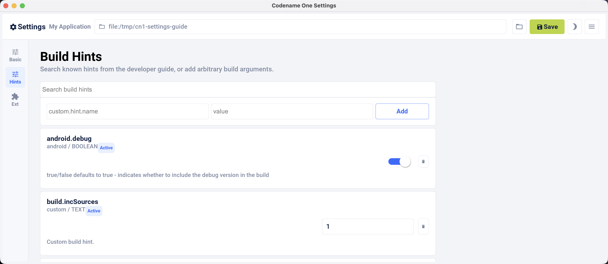

== Build hints reference

=== Sending arguments to the build server

When you send a build to the server, you can provide more parameters. The server incorporates those parameters into the build process as build hints.

These hints are often called "build hints" or "build arguments." They behave like compiler flags that tune the build server's behavior. That makes them useful for fast iteration on new functionality without rebuilding plugin UI for every change. They're also useful when you need to expose low-level behavior such as customizing the Android manifest XML or the iOS plist.

Launch Codename One Settings from the Maven project root, then select *Hints* in the left navigation rail. The hints use the `key=value` style.

[source,shell]
----
include::../demos/common/src/main/snippets/developer-guide/maven-appendix-control-center.sh[tag=maven-appendix-control-center-bash-001,indent=0]
----

.The build hints UI in Codename One Settings

You can also set the build hints directly in the `codenameone_settings.properties` file. When you do that, each setting must start with the `codename1.arg.` prefix. For example, `android.debug=true` becomes `codename1.arg.android.debug=true`.

Application code can read a custom build argument through `Display.getProperty()`:

[source,java]
----
include::../demos/common/src/main/java/com/codenameone/developerguide/advancedtopics/AppArgSnippet.java[tag=appArg,indent=0]
----

The table below consolidates build hints across platforms from the annotations
and build-hint catalog. It includes names, types, defaults, annotation forms,
and descriptions, including aliases and open-ended hint families.

Most of the commonly used hints also have a compiler-checked form: an annotation
in `com.codename1.annotations.buildhints` that you put on the application's main
class. Written that way a misspelled name is an unknown symbol and an
unsupported value is an unknown enum constant, instead of a properties line that
is accepted, never read, and has no effect. The Annotation column below
names that form where one exists. Setting the same hint both ways fails the
build.

Each annotation groups the hints of one platform, and the attribute names match
the part of the hint name after the prefix, so `codename1.arg.ios.pods` is
`@Ios(pods = ...)`:

[source,java]
----
include::../demos/common/src/main/java/com/codenameone/developerguide/advancedtopics/BuildHintAnnotationSnippet.java[tag=buildHintAnnotations,indent=0]
----

That's the same as writing these lines in `codenameone_settings.properties`:

[source,properties]
----
include::../demos/common/src/main/snippets/developer-guide/advanced-topics-under-the-hood.properties[tag=advanced-topics-under-the-hood-properties-004,indent=0]
----

Three things in that example are worth calling out.

A hint whose value is a list takes a Java array, and the build joins it with the
separator that hint uses -- a comma for `ios.pods`, so you never have to
remember which hint wants which delimiter.

A boolean hint takes `Toggle`, not `boolean`. `Toggle.ON` and `Toggle.OFF` say
what you want, and leaving the attribute out entirely means you have said
nothing, so the build service applies whatever it applies today. That's why the
Default column reads _(set by the build)_ for these hints: the annotation
records no default of its own, by design: a value compiled into your app can't
follow the build service when the service changes it.

A hint with a closed set of values takes an enum, so `@Ios(themeMode = ...)`
offers you the four themes that exist and rejects anything else at compile time.
Hints whose accepted values are open-ended stay `String`.

The long tail of hints has no annotation, and neither do the open-ended families
such as `android.permission.<NAME>`, because a Java annotation can't express a
map. Set those in `codenameone_settings.properties` exactly as before. You can mix
the two forms in one project, as long as no single hint is declared in both.

[IMPORTANT]
====
Build hints are the one part of Codename One that doesn't promise source
compatibility, and that's deliberate.

Everywhere else, code that compiles against one release keeps compiling against
the next. Here, a hint that changes its name, its type or its accepted values is
meant to stop compiling, so you find out at your desk. The alternative is what
the properties file has always done: accept the line, never read it, and leave
you with a build that succeeds and an app that doesn't do what you asked.

The failure is always on the client side, never on the build service. A hint
reaches the service as a name and a string, and the service goes on accepting
the strings it always did -- an app already built keeps building, and an older
Codename One keeps talking to a newer service. A changed hint breaks a compile
in your project, with the attribute named.

If a release does take an annotation away, the properties form of the same hint
still works, so the upgrade costs a line in `codenameone_settings.properties`
rather than being one you can't take.
====

=== All build hints

.Build hints
include::_generated-build-hints.adoc[]
