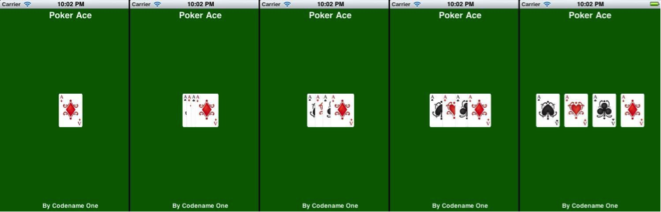
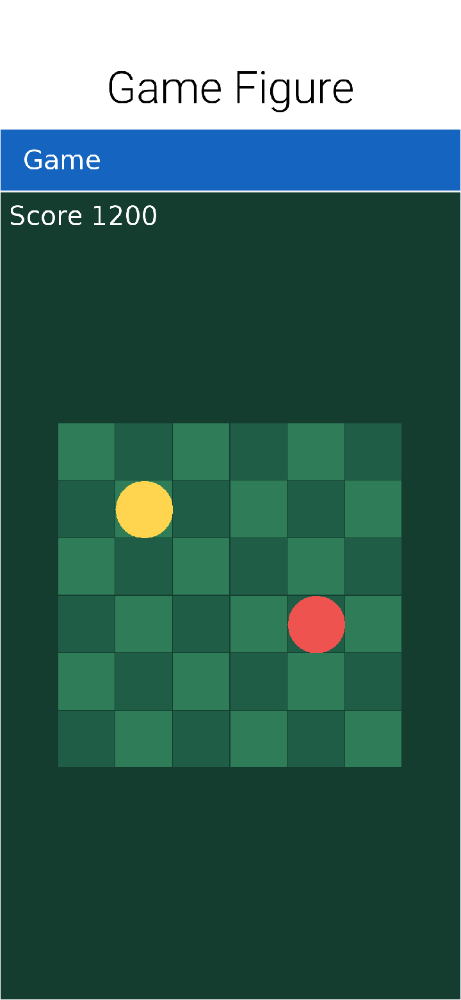

While game developers have traditionally used C/OpenGL to get every bit of performance out of a device, Java offers a unique opportunity for casual game developers. In this section you will build a simple card game in Java that can run unchanged on iOS, Android etc.

Casual games are often the most influential games of all, they cross demographics such as the ubiquitous solitaire or even the chart topping Angry birds. Putting them in the same game category as 3D FPS games doesn't always make sense.

Yes, framerates are important but ubiquity, social connectivity & gameplay are even more important for this sub genre of the game industry. The mobile aspect highlights this point further, the way app stores are built releasing often puts your game at an advantage over its competitor’s. Yet releasing to all platforms and all screen sizes becomes an issue soon enough.

Typically a game comprises a game loop which updates UI status based on game time and renders the UI. But, with casual games constantly rendering is redundant and with mobile games it could put a major drain on the battery life. Instead you will use components to build the game elements and let Codename One do the rendering for you.

=== The game

You will create a poker game for 1 player that doesn't include the betting process or any of the complexities such as AI, card evaluation or validation. This allows you to fit the whole source code in 270 lines of code (more due to comments). The example also intentionally simplifies the UI for touch devices; technically it would be pretty easy to add keypad support but it would complicate the code and require more designs (for focus states).

TIP: You can see the game running on the simulator at http://www.youtube.com/watch?v=4IQGBT3VsSQ[http://www.youtube.com/watch?v=4IQGBT3VsSQ]

The game consists of two forms: Splash screen and the main game UI.

==== Handling multiple device resolutions

In mobile device programming every pixel is crucial because of the small size of the screen, but you can’t shrink down your graphics too much because it needs to be "finger friendly" (big enough for a finger) and readable. The device world has great disparity, even within the iOS family the retina iPad has more than twice the screen density of the iPad mini. This means that an image that looks good on the iPad mini will seem either small or pixelated on an iPad, but an image that looks good on the iPad would look huge (and take up too much RAM) on the iPad mini. The situation is even worse when dealing with phones and Android devices.

Solutions exist, such as using multiple images for every density (DPI). But, this is tedious for developers who need to scale the image and copy it every time for every resolution. Codename One has a feature called `MultiImage` which implicitly scales the images to all the resolutions on the desktop and places them within the res file, in runtime you will get the image that matches your devices density.

A catch exists though... `MultiImage` is designed for applications where you want the density to determine the size. An iPad will have the same density as an iPhone since both share the same amount of pixels per inch. This makes sense for an app since the images will be big enough to touch and clear. Furthermore, since the iPad screen is larger more data will fit on the screen!

Game developers have a different constraint when it comes to game elements. For a game you want the images to match the device resolution and take up as much screen real estate as possible, otherwise your game would be constrained to a small portion of the tablet and look small. A solution exists though: you can determine your own DPI level when loading resources and effectively force a DPI based on screen resolution when working with game images!

To work with such varied resolutions/DPI’s and potential screen orientation changes you need another tool in your arsenal: layout managers.

If you're familiar with AWT/Swing this should be pretty easy, Codename One allows you to codify the logic that flows Components within the UI. You will use the layout managers to ease that logic and preserve the UI flow when the device is rotated.

==== Resources

To save some time/effort use the ready-made resource files linked in the On The Web section below. You can skip this section and move on to the code, but for completeness here is what was done to create these resources:

You will need a gamedata.res file that contains all the 52 cards as multi images using the naming convention of ‘rank suite.png’ example: 10c.png (10 of clubs) or ad.png (Ace of diamonds).

To do this you can create 52 images of 153×217 pixels for all the cards then use the designer tool and select "Quick Add MultiImages" from the menu. When prompted select HD resolution. This effectively created 52 multi-images for all relevant resolutions.

You can also change the default theme that ships with the application in small ways to create the white over green color scheme. Open it in the designer tool by double clicking it and select the theme.

Then press Add and select the `Form` entry with background `NONE`, background color `6600` and transparency `255`.

Add a `Label` style with transparency `0` and foreground `255` and then copy the style to pressed/selected (since its applied to buttons too).

Do the same for the `SplashTitle`/`SplashSubtitle` but there also set the alignment to `CENTER`, the `Font` to bold and for `SplashTitle` to `Large Font` as well.

==== The splash screen

The first step is creating the splash animation as you can see in the screenshots in <<game-figure-2,figure 2>>.

[[game-figure-2]]
.Animation stages for the splash screen opening animation

The animation in the splash screen and most of the following animations are achieved using the simple tool of layout animations. In Codename One components are automatically arranged into position using layout managers, but this isn't implicit unless the device is rotated. A layout animation relies on this fact, it allows you to place components in a position (whether by using a layout manager or by using `setX`/`setY`) then invoke the layout animation code so they will slide into their "proper" position based on the layout manager rules.

You can see how you achieved the splash screen animation of the cards sliding into place in Listing 1 within the `showSplashScreen()` method. After you change the layout to a box X layout you invoke animateHierarchy to animate the cards into place.

Notice that you use the `callSerially` method to start the actual animation. This call might not seem necessary at first until you try running the code on iOS. The first screen of the UI is important for the iOS port which uses a screenshot to speed startup. If you won’t have this callSerially invocation the screenshot rendering process won't succeed and the animation will stutter.

You also have a cover transition defined here; it’s a simple overlay when moving from one form to another.

==== The game UI

Initially when entering the game form you've another animation where all the cards are laid out as you can see in <<game-figure-3>>. You then have a long sequence of animation where the cards unify into place to form a pile (with a cover background falling on top) after which dealing begins and cards animate to the rival (with back showing) or to you with the face showing. Then the instructions to swap cards fade into place.

[[game-figure-3]]
.Game form startup animation and deal animation

This animation is easy to do although it does have several stages. In the first stage you layout the cards within a grid layout (13×4), then when the animation starts (see the https://www.codenameone.com/javadoc/com/codename1/ui/util/UITimer.html[UITimer] code within `showGameUI()`) you change the layout to a layered layout, add the back card (so it will come out on top based on z-ordering) and invoke animate layout.

Notice that here you use `animateLayoutAndWait`, which effectively blocks the calling thread until the animation is completed. This is a important and tricky subject!

Codename One is a single threaded API, it supports working on other threads but it's your responsibility to invoke everything on the EDT (Event Dispatch Thread). Since the EDT does the entire rendering, events etc. If you block it you will effectively stop Codename One in its place! But, a trick exists: invokeAndBlock is a feature that allows you to stop the EDT and do stuff then restore the EDT without "" stopping it. Its tricky and out of scope for this article (this subject deserves an article of its own) but the gist of it's that you can’t invoke Thread.sleep() in a Codename One application (at least not on the EDT) but you can use clever methods such as `Dialog.show()`, `animateLayoutAndWait` etc. and they will block the EDT for you. This is convenient since you can write code serially without requiring event handling for every single feature.

Now that you got that out of the way, the rest of the code is clearer. Now you understand that `animateLayoutAndWait` will wait for the animation to complete and the next lines can do the next animation. Indeed after that you invoke the `dealCard` method that hands the cards to the players. This method is also blocking (using and `wait` methods internally) it also marks the cards as draggable and adds that drag logic which you will later use to swap cards.

In the animation department, you use a method called replace to fade in a component using a transition.

To handle the dealing an action listener is added to the deck button, this action listener is invoked when the cards are dealt and that completes the game:

[source,java]
----
include::../demos/common/src/main/snippets/developer-guide/casual-game-programming.java.txt[tag=casual-game-programming-java-001,indent=0]
----
