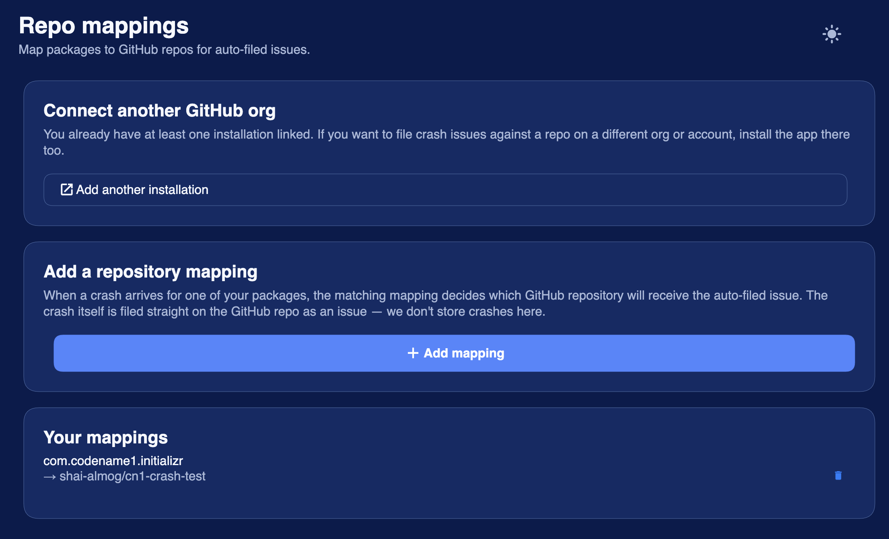

== Crash Protection

Crash Protection is an opt-in service that captures uncaught exceptions in your shipping app and files them as deduplicated issues on your GitHub repository. Symbolicated stack traces, scrubbed messages, and a per-bug counter are all recorded server-side; you triage from GitHub Issues like any other bug.

The service is available on the *Pro* and *Enterprise* subscription tiers. See the link:https://www.codenameone.com/pricing.html[pricing page] for current limits.

=== What gets stored where

Three things move when you opt in:

. *Symbol bundles* (ProGuard `mapping.txt` on Android, dSYM on iOS, debug-info-bearing binaries on Mac/Linux/Win32). Uploaded by the Codename One build server after each successful release build. Stored compressed; subject to per-tier storage quota.
. *Crash reports* (one per device occurrence). Sent by the app at runtime via `CrashProtection.capture(t)` or the automatic EDT error handler. Scrubbed on the device before transmission (see _Privacy_ below).
. *GitHub issues* -- the actual triage surface. One issue per unique crash fingerprint. Subsequent occurrences of the same fingerprint bump a counter on the issue body rather than filing duplicates.

Codename One never reads or persists the unscrubbed message body. The crash data store is the issue tracker on your repository, not a separate database. The service keeps only the minimum lookup state needed to find the right issue on the next occurrence.

=== Opting in

Add this line to your app's `codenameone_settings.properties`:

[source]
----
codename1.arg.crashProtection.enabled=true
----

The `codename1.arg.` prefix marks it as a build hint -- when the property reaches the Codename One build server, it tells the build to upload the symbol bundle (PDB / dSYM / .debug / mapping.txt) to the crash-protection service alongside the normal release artifact.

==== Runtime hook

In your `Lifecycle.init`:

[source,java]
----
public void init(Object context) {
    CrashProtection.install();
    CrashProtection.setEnabled(true);  // default is false; user-controlled opt-in
}
----

`install()` registers the EDT error handler and (on Android) wires `Thread.UncaughtExceptionHandler`. It's idempotent and a no-op on the simulator. `setEnabled(boolean)` controls whether captured crashes actually get sent to the server -- the captured payload is always persisted locally first, so `setEnabled(true)` after the fact drains the buffer.

You can also report a caught-but-noteworthy exception with `CrashProtection.capture(e)`.

=== Per-platform opt-out

Sometimes one platform's symbols are noisy or you don't ship that target. Disable a platform with:

[source]
----
codename1.arg.crashProtection.and.enabled=false
codename1.arg.crashProtection.ios.enabled=false
codename1.arg.crashProtection.mac.enabled=false
codename1.arg.crashProtection.linux.enabled=false
codename1.arg.crashProtection.win.enabled=false
----

Setting one of these to `false` makes `CrashProtection.install()` a no-op at runtime on that platform AND skips the build-time symbol upload for it. Setting to `true` (or leaving unset) keeps the platform enabled.

The runtime check uses `Display.getInstance().getPlatformName()`. Supported values: `and`, `ios`, `mac`, `linux`, `win`, `javascript`, `javase`.

=== Tier limits

[options="header",cols="1,1,1"]
|===
| Tier        | Storage quota   | Symbol retention
| Pro         | 100 MB compressed | 3 weeks
| Enterprise  | 500 MB compressed | 6 weeks
|===

Symbol bundles are gzipped before storage. `mapping.txt` files typically compress ~10x; dSYMs ~2x. The quota admits several recent builds per app for a typical developer.

When a new symbol upload would push you over the quota, the build's symbol step is rejected with HTTP 413 (the build itself succeeds). You can free space from the *Tracked apps* tab in the console -- delete an old build's symbols or remove a whole app's enrollment.

=== Privacy

==== What's PII

PII is short for _personally identifiable information_: any field in a crash payload that could be traced back to a specific user. The pieces of a Java exception message that are typically PII are email addresses, account numbers, phone numbers, IP addresses, full URLs to authenticated endpoints (with session tokens in the query string), and the contents of user input fields that ended up in the message via string concatenation. Stack trace frames are class / method / file / line -- they describe code paths, not users, so they're not PII.

The Codename One crash-protection client runs incoming messages through a scrubber before transmission. The scrubber can be replaced with a stricter rule set if your application's exception messages routinely carry data you don't want to leave the device.

==== What gets sent

`CrashReportPayload` carries these fields. The marked one goes through `PiiScrubber` before transmission.

- `eventId` (UUID, used for idempotent dedup)
- `buildKey` (anti-spoofing token; matched against the uploaded symbol bundle)
- `packageName`, `appVersion`, `platform`, `osVersion`, `locale`
- `exceptionClass`
- `messageScrubbed` -- *scrubbed*
- `frames[]` -- class / method / file / line / `native` flag per frame
- `deviceMeta` -- free memory + locale only; not device IDs
- `clientTs`

==== Default scrubber rules

`PiiScrubber` applies these by default:

- Email addresses: redacted to the first 3 characters of the local part. `joe.smith@example.com` becomes `joe***@example.com` (the full domain is preserved so the issue still tells you _which_ provider was involved).
- Long digit runs: any run of 6 or more consecutive digits collapses to `[num]`. Catches phone numbers, order IDs, account numbers, ZIP+suffix, etc.
- URLs aren't scrubbed by default. Override the scrubber if your app's URLs carry session tokens.

Override `scrubMessage(String)` or `scrubFrame(String, String)` on a `PiiScrubber` subclass and register via `CrashProtection.setScrubber(myScrubber)` if you need stricter rules.

=== Mapping packages to repositories

In the console at https://cloud.codenameone.com/console/index.html, open *Repo mappings*:

Click *Add mapping* and supply:

. *Package name* -- the exact value from `codenameone_settings.properties`.
. *Installation* -- which authorized GitHub App installation should file the issue. Only shown if you have more than one installation linked.
. *Repository* -- pick from the dropdown of the installation's repos.

You must have authorized the Codename One Crash Protection GitHub App for at least one of your repositories first. The mapping page renders a button labeled *Connect on GitHub* that opens the App install flow on github.com. The post-install redirect brings you back to the same page with the installation already loaded; if you already have one installation and want to add another (for example a second GitHub org), the *Connect another GitHub org* card lets you link an additional one without disturbing the existing mapping.

=== Setup checklist

. Pro or Enterprise subscription.
. Add `codename1.arg.crashProtection.enabled=true` to `codenameone_settings.properties`.
. Call `CrashProtection.install()` in `Lifecycle.init`. Call `CrashProtection.setEnabled(true)` once you have the user's consent.
. Build your app for release. The Codename One build server uploads the symbol bundle automatically.
. Open the console, go to *Repo mappings*, click *Connect on GitHub*, and install the App on the repo you want crashes to land in.
. Add a mapping for your package -> repo.
. Crashes from your release builds will now appear as GitHub issues on the mapped repo.
