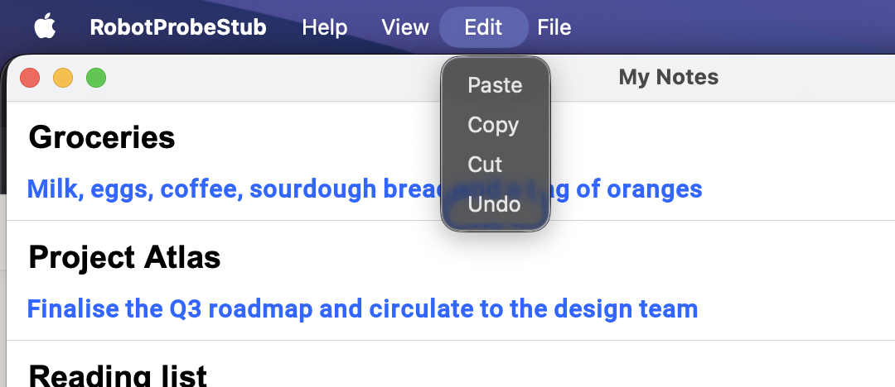
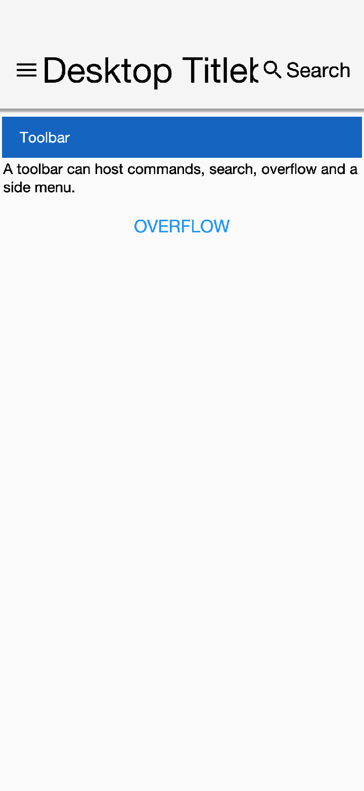

== Desktop Integration

Codename One is mobile-first, but the same app can run on the desktop: as a Java SE
"`Run as desktop app`" / executable jar, and as a native macOS app via the local
`mac-source` (Mac Catalyst) build target. By default a desktop build looks like a phone
app in a window - a mobile-style `Toolbar` at the top of every `Form`, fading touch
scrollbars, and commands tucked into a hamburger side menu.

The desktop integration features make a desktop build *feel* like a desktop app:

* A native window title bar that shows the `Form` title (instead of the in-app `Toolbar`).
* A native menu bar populated from your `Command` objects, with per-command placement hints
  (About, File, Edit, Quit, ...).
* Interactive scrollbars - a draggable thumb that highlights on hover and while dragged,
  click-to-page on the track, a minimum thumb size so it stays easy to grab on long content, a
  reserved gutter so content isn't drawn under the bar, and an always-visible (rather than
  fading) scrollbar.
* Keyboard accelerators on the native menu items (Cmd+S / Ctrl+S, ...).
* Native desktop notifications driven by the standard `LocalNotification` API.

These behaviors are *opt-in*. They're switched on by default for newly generated projects
(both the Maven archetype and the start.codenameone.com initializr) and stay completely
inert on phones/tablets - all the new behavior is gated on `CN.isDesktop()`, so a mobile
build of the same project is unaffected.

=== Title-bar modes

The window chrome is selected by the `desktop.titleBar` setting, which takes one of three values:

[cols="1,4"]
|===
|`native` |Hide the CN1 `Toolbar`. The `Form` title goes into the OS window title bar and the
toolbar's commands are bridged to a native menu bar. This is the default for newly generated apps.
|`custom` |Undecorated window (no OS title bar) where the CN1 `Toolbar` itself acts as the window's
title bar: it shows the `Form` title and side menu, dragging it moves the window, and the window is
resized by dragging its edges. The commands are bridged to the native menu bar *and* remain in the
toolbar's side menu.
|`toolbar`|Legacy behavior - the in-app CN1 `Toolbar` is shown exactly as on mobile.
|===

The screenshots below show the same notes app, with File / Edit / View / Help commands, in each
mode on macOS.

.`native` mode: the `Form` title is in the OS window title bar, the commands populate the native menu bar, and there is no in-app `Toolbar`

.`custom` mode: the window is undecorated and the CN1 `Toolbar` (title + hamburger side menu) is the window's title bar; the commands are also in the native menu bar

.`toolbar` mode: the legacy look - the in-app `Toolbar` sits below a generic OS title bar and the commands live in the hamburger side menu
image::img/desktop-titlebar-toolbar.png[Desktop legacy toolbar mode,scaledwidth=60%]

==== Enabling it on the Java SE desktop build

For the desktop (Java SE) target the mode is a build hint that the generated desktop launcher
applies for you. In `codenameone_settings.properties`:

[source,properties]
-----
codename1.arg.desktop.titleBar=native
codename1.arg.desktop.interactiveScrollbars=true
-----

Newly generated projects already contain these lines. The generated `<MainName>Stub` reads them
at startup, so no code is required. Because the stub is the desktop entry point, the settings only
ever take effect on the desktop.

==== Enabling it on the macOS (Mac Catalyst) build

The local `mac-source` build runs through ParparVM and the iOS port, where the chrome is provided
by native `UIWindowScene` / `UIMenuBuilder` code. There it's read as a runtime property and
defaults to `toolbar`, so existing Catalyst apps are unaffected. Opt in from your app before the
first `Form` is shown:

[source,java]
-----
Display.getInstance().setProperty("desktop.titleBar", "native");
Display.getInstance().setProperty("desktop.interactiveScrollbars", "true");
-----

NOTE: The native title bar and native menu bar on macOS require iOS 13 / macOS 10.15 (Catalyst)
or newer. On a phone/tablet iOS build these properties are ignored.

=== Native menu bar and command placement hints

When the `Toolbar` is hidden (`native` or `custom` mode), the commands you add through the
`Toolbar` / `Form` command API are bridged to the platform's native menu bar - a Swing `JMenuBar`
(which becomes the macOS screen menu) on the Java SE build, and a `UIMenuBuilder` menu on Catalyst.
Selecting a menu item runs the command's `actionPerformed` on the Codename One EDT, exactly as a
button press would.

By default every command lands under a single *Commands* menu. To place commands into the
conventional desktop menus, tag them with a desktop-menu hint using `Command.setDesktopMenu(String)`
and the `Command.DESKTOP_MENU_*` constants:

[source,java]
-----
Form hi = new Form("My App", BoxLayout.y());

Command about = new Command("About My App");
about.setDesktopMenu(Command.DESKTOP_MENU_ABOUT);   // application menu

Command open = new Command("Open File...");
open.setDesktopMenu(Command.DESKTOP_MENU_FILE);     // File menu

Command quit = new Command("Quit");
quit.setDesktopMenu(Command.DESKTOP_MENU_QUIT);     // application menu

hi.addCommand(about);
hi.addCommand(open);
hi.addCommand(quit);
hi.show();
-----

The recognised values are (case-insensitive):

[cols="1,3"]
|===
|`DESKTOP_MENU_APP`, `DESKTOP_MENU_ABOUT`, `DESKTOP_MENU_PREFERENCES`, `DESKTOP_MENU_QUIT`
|Placed in the application menu (the macOS app menu / a leading menu).
|`DESKTOP_MENU_FILE`, `DESKTOP_MENU_EDIT`, `DESKTOP_MENU_VIEW`, `DESKTOP_MENU_WINDOW`, `DESKTOP_MENU_HELP`
|Placed in the matching standard top-level menu.
|Any other string |Becomes a top-level menu with that literal title.
|Unset |Grouped under a default *Commands* menu.
|===

Each port maps the hint to its native structure: on Catalyst the command is inserted into the real
`UIMenuApplication` / `UIMenuFile` / `UIMenuEdit` / ... menus; on the Java SE build a top-level
`JMenu` is created per hint group.

TIP: The hint is a plain client property (`Command.DESKTOP_MENU`), so it's inert on platforms that
don't have a native menu bar - it's safe to set it unconditionally in shared code.

==== Keyboard accelerators

Give a command a keyboard accelerator with `Command.setDesktopShortcut(...)`. The shortcut is shown
next to the menu item and triggers the command from the keyboard:

[source,java]
-----
Command save = new Command("Save");
save.setDesktopMenu(Command.DESKTOP_MENU_FILE);
save.setDesktopShortcut('S');   // Cmd+S on macOS, Ctrl+S on Windows/Linux

Command saveAs = new Command("Save As...");
saveAs.setDesktopMenu(Command.DESKTOP_MENU_FILE);
saveAs.setDesktopShortcut('S',
        Command.DESKTOP_SHORTCUT_MODIFIER_PRIMARY | Command.DESKTOP_SHORTCUT_MODIFIER_SHIFT);
-----

The single-argument form uses the platform's *primary* modifier - Command on macOS, Control on
Windows/Linux - which is the right default for most menu shortcuts. The
two-argument form takes a bit-mask of `Command.DESKTOP_SHORTCUT_MODIFIER_PRIMARY`,
`Command.DESKTOP_SHORTCUT_MODIFIER_SHIFT` and `Command.DESKTOP_SHORTCUT_MODIFIER_ALT`. On the
Java SE build the accelerator becomes a Swing `KeyStroke`; on Catalyst it becomes a `UIKeyCommand`.
Like the placement hint, the accelerator is inert on platforms without a native menu bar, so it's
safe to set unconditionally.

=== Interactive scrollbars

Enabling `desktop.interactiveScrollbars` turns the scrollbar from a fading touch indicator into a
desktop-style control:

* The thumb can be grabbed and dragged, and it *highlights* while the pointer hovers it and while
  it's being dragged (the `DesktopScrollThumb` selected / pressed styles).
* Clicking the track pages toward the pointer by about one viewport.
* The thumb has a *minimum size* so it stays easy to grab even when the content is far taller than the
  viewport. The minimum (in pixels) is the `scrollThumbMinSizeInt` theme constant; when unset it
  defaults to the equivalent of 4mm.
* A *gutter* is reserved for the scrollbar so content isn't laid out underneath it. The gutter width
  comes from the `DesktopScroll` / `DesktopHorizontalScroll` UIID padding (see below).
* The scrollbar stays visible rather than fading out.

This is a cross-platform core feature driven by the `interactiveScrollBool` theme constant, which
the desktop ports inject only when `CN.isDesktop()` is true. Mouse-wheel scrolling continues to work
as before.

[#desktop-theme-uiids]
=== Theme UIIDs

When interactive scrollbars are active, the desktop scrollbar is styled through dedicated UIIDs so the
mobile `Scroll` / `ScrollThumb` styling is never affected:

[cols="1,3"]
|===
|`DesktopScroll`, `DesktopScrollThumb`, `DesktopHorizontalScroll`, `DesktopHorizontalScrollThumb`
|The interactive desktop scrollbar track and thumb. The horizontal-/vertical-scroll UIID's padding
sets the scrollbar gutter width. The thumb UIID's `.selected` and `.pressed` styles render the
hover and drag highlight respectively.
|===

The modern native themes ship platform-conventional defaults for these UIIDs (macOS-style in the iOS
theme, Material-style in the Android theme), including the `.selected` / `.pressed` thumb highlight
states; see <<native-modern-themes>>. Override them in your app's `theme.css` like any other UIID.
The minimum thumb length is the `scrollThumbMinSizeInt` theme constant (pixels). In `custom` mode the
title bar is just the regular CN1 `Toolbar`, so it's themed through the usual `Toolbar` / `Title`
UIIDs.

=== Desktop notifications

The standard `com.codename1.notifications.LocalNotification` API works on the desktop. On the
Java SE desktop build a scheduled notification surfaces as a native OS notification through the
system tray (Notification Center on macOS, the notification area on Windows/Linux); on the
macOS / Mac Catalyst build it goes through the same `UNUserNotificationCenter` path as iOS. Clicking
the notification delivers it to your app's `LocalNotificationCallback`, exactly as on mobile, so the
same scheduling and handling code is shared across phone and desktop:

[source,java]
-----
LocalNotification n = new LocalNotification();
n.setId("reminder-1");
n.setAlertTitle("Reminder");
n.setAlertBody("Your export has finished.");

// fire in 5 seconds, no repeat
Display.getInstance().scheduleLocalNotification(
        n, System.currentTimeMillis() + 5000, LocalNotification.REPEAT_NONE);
-----

NOTE: On the Java SE build desktop notifications require an OS with system-tray support
(`java.awt.SystemTray`); where it's unavailable the notification is logged and skipped.
