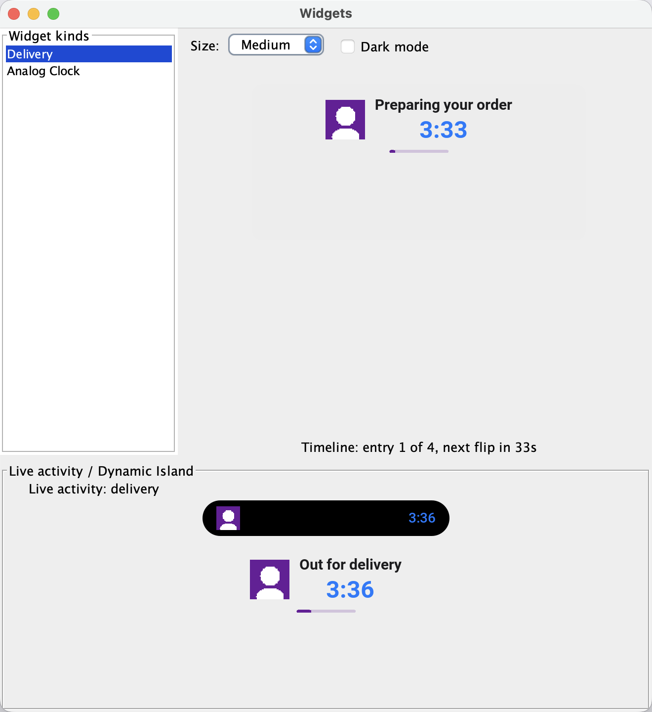
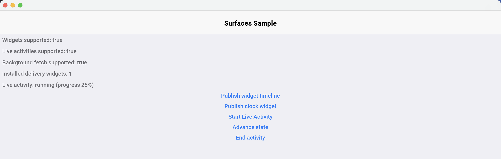
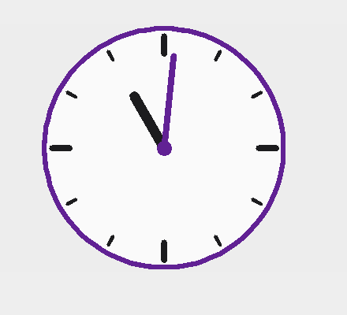
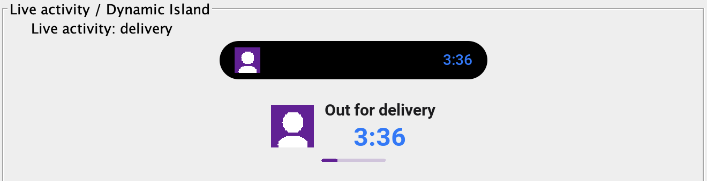

== External Surfaces: Widgets and Live Activities

Home-screen widgets and live activities answer the same developer question: how to keep a live piece of information outside the app. Codename One models both as one concept -- an external surface -- under the `com.codename1.surfaces` package. A *widget* is persistent, user-placed and content-driven: the weather, the next meeting, the delivery status on the home screen. A *live activity* is transient, app-started and progress-driven: the delivery that's out right now, a running timer, a live score on the iOS lock screen and Dynamic Island, an ongoing Android notification, a floating desktop pill. Both share the same layout model, serialization, state mechanism, and action model.

The simulator renders every surface you publish in a dedicated preview window, so the full loop runs on your desktop with no device:

=== The dead-process rule

Surfaces render while your app process may not be running. Everything you hand this API is therefore turned into plain data at publish time: layouts serialize to a compact JSON descriptor, images are encoded to named PNG blobs, and "callbacks" are string action ids that open the app and reach your handler on the EDT. Layout text embeds `${key}` placeholders resolved from a per-entry state map, so a content change is a cheap re-publish of data, not a new layout.

This rule explains everything unusual about the API. You can't attach a listener to a widget -- the process that renders it may have nothing to call back into. You can't hand it a `Component` -- there is no Codename One renderer on the other side. What you can do is describe the surface declaratively and let each platform's native renderer (SwiftUI on iOS, `RemoteViews` on Android, a rasterizer on desktop) draw it.

=== Getting started

The build injects the native plumbing (a WidgetKit extension and App Group on iOS, widget receivers on Android) when your bytecode references `com.codename1.surfaces`. Apps that never touch the package get none of it, and on ports without surface support every entry point is an inert no-op.

Platform widget galleries are compiled into the native app, so widget kinds must be known at build time. Declare them in a `surfaces.json` resource (in `src/main/resources` of a Maven project, next to your icons):

[source,json]
----
include::../demos/common/src/main/snippets/developer-guide/external-surfaces.json[tag=external-surfaces-json-001,indent=0]
----

The `id` values must match `[a-z][a-z0-9_]*`. The `families` list accepts the portable names (`small`, `medium`, `large`, `lockscreen`, and the four `watch*` complication families) as well as the WidgetKit spellings (`systemSmall`, `systemMedium`, `systemLarge`, `accessoryRectangular`); when omitted, all three home-screen sizes are offered. `iosFamilies` is the older spelling of the same key and still works -- it predates there being a second platform that cared -- and is read only when `families` is absent. The `androidMinWidthDp` / `androidMinHeightDp` / `androidResizeMode` fields fill the Android provider metadata. An optional top-level `appGroup` pins the iOS App Group id, and `"liveActivities": true` enables the live activity plumbing.

At runtime, mirror the manifest by registering each kind in your app's `init()`:

[source,java]
----
include::../demos/common/src/main/java/com/codenameone/developerguide/surfaces/SurfacesSnippets.java[tag=registerKind,indent=0]
----

A widget renders a *timeline*: a shared layout plus dated entries whose state maps fill the layout's `${key}` placeholders. The OS flips entries on schedule without waking your app. This publishes a delivery tracker that advances through four states:

[source,java]
----
include::../demos/common/src/main/java/com/codenameone/developerguide/surfaces/SurfacesSnippets.java[tag=publishTimeline,indent=0]
----

The layout itself is a small tree of nodes with shared styling (padding, background, corner radius, alignment, weight, size, action):

[source,java]
----
include::../demos/common/src/main/java/com/codenameone/developerguide/surfaces/SurfacesSnippets.java[tag=deliveryLayout,indent=0]
----

Three things in this layout carry the model's weight. `SurfaceText` renders `${status}` from the entry state, so updates ship a tiny state map instead of a layout. `SurfaceDynamicText` with `STYLE_TIMER_DOWN` is a countdown the OS animates on its own clock -- the ETA ticks every second with zero app wake-ups. `SurfaceProgress` reads its value from the `progress` state key. The `setAction` call at the root makes a tap anywhere on the widget open the app and deliver the `open_order` action.

`Surfaces.publish(...)` is callable from any thread and never blocks on the EDT, which matters for background refresh later in this chapter.

A complete runnable example lives in `Samples/samples/SurfacesSample` together with its `surfaces.json`:

==== Previewing in the simulator

Open *Widgets > Widgets Preview* in the simulator. The window lists your registered kinds, renders the published timeline of the selected kind at any size in light or dark mode, flips timeline entries on schedule, and ticks countdowns exactly as a home-screen widget would. The four watch complication families are listed too, at the accessory families' own sizes and clipped round where a watch face clips them -- worth seeing, because a face shows nothing a circular complication draws into its corners. What it previews is the node tree, not the per-platform lowering, so a complication that looks right there can still arrive on a Wear OS face as one number. The mock Dynamic Island at the bottom renders running live activities. Clicks map through to your action handler, and a desktop (non-simulator) build renders the same publishes as floating widget windows pinned from a tray icon.

=== The node catalog

The catalog is kept small: a set of nodes every platform can render natively. Android app widgets (`RemoteViews`) are the constrained platform, so the catalog is designed to that floor and degrades as follows:

[options="header"]
|===
| Node | iOS (SwiftUI) | Android (RemoteViews) | Notes
| `SurfaceColumn` / `SurfaceRow` | `VStack` / `HStack` | `LinearLayout` | Weight maps to `layout_weight`
| `SurfaceBox` | `ZStack` | `FrameLayout` | Child alignment via a 9-way enum
| `SurfaceText` | `Text` | `TextView` | Android maps light/regular/medium weights to regular, semibold/bold to bold
| `SurfaceDynamicText` timer | `Text(date, style:)` | `Chronometer` | Ticks natively on both
| `SurfaceDynamicText` time | `Text(date, style: .time)` | `TextClock` | Native on both
| `SurfaceDynamicText` date/relative | Native | Static text | Android refreshes it on the next update only
| `SurfaceImage` | `Image` | `ImageView` | Named PNG blobs, content-hash dedup
| `SurfaceProgress` linear | `ProgressView` | `ProgressBar` | Value 0..1 or a state key
| `SurfaceProgress` circular | `Gauge` | Falls back to linear | Android widgets lack determinate circular progress
| `SurfaceProgress` date interval | Native animation | Frozen at each refresh | iOS-only nicety
| `SurfaceVector` | SwiftUI `Canvas` | Bitmap rendered in-process | Large vector nodes cost bitmap budget on Android
| `SurfaceSpacer` | `Spacer` | Weighted `View` | Flexible gap
| Corner radius | `clipShape` | Background drawable | May render square below Android 12
| Node action | `Link` / `widgetURL` | `setOnClickPendingIntent` | Small iOS widgets honor only the root action
|===

Descriptors are limited to 8 nesting levels. Keep payloads (JSON plus images) comfortably under 200kb -- the iOS widget extension runs in about 30mb of memory, and Android parcels rendered widgets over a 1mb binder transaction.

=== Vector widgets

`SurfaceVector` covers the widgets the template catalog can't express -- clocks, gauges, dials -- with a retained list of vector drawing operations (fills, strokes, lines, arcs, text, rotation groups) replayed natively by every renderer. Rotation groups can read their angle from a state key, which turns a static drawing into a data-driven one.

The classic example is an analog clock. The face is resolution independent -- the `200x200` view box scales to whatever size the widget gets:

[source,java]
----
include::../demos/common/src/main/java/com/codenameone/developerguide/surfaces/SurfacesSnippets.java[tag=clockFace,indent=0]
----

Angles use the clock convention: degrees, 0 at 12 o'clock, clockwise positive. The face publishes once; 60 per-minute timeline entries carry only the two angle values, and the OS flips them on schedule. The clock stays correct for an hour with zero app wake-ups:

[source,java]
----
include::../demos/common/src/main/java/com/codenameone/developerguide/surfaces/SurfacesSnippets.java[tag=clockTimeline,indent=0]
----

=== Live activities

A live activity is started explicitly from the app and updated by pushing fresh state. The descriptor carries the main content (the lock screen presentation on iOS, the notification layout on Android) plus the Dynamic Island regions: `setCompactLeading` / `setCompactTrailing` for the pill shown around the camera cutout, `setMinimal` for the detached circle when several activities run, and `setExpandedLeading` / `setExpandedTrailing` / `setExpandedCenter` / `setExpandedBottom` for the long-press expanded card.

[source,java]
----
include::../demos/common/src/main/java/com/codenameone/developerguide/surfaces/SurfacesSnippets.java[tag=liveActivity,indent=0]
----

The returned handle is inert (`isActive()` returns `false`) on platforms without live activity support, so no platform checks are needed. Updates and the final state are plain state maps interpolated into the descriptor persisted at start time:

[source,java]
----
include::../demos/common/src/main/java/com/codenameone/developerguide/surfaces/SurfacesSnippets.java[tag=liveActivityUpdate,indent=0]
----

The simulator preview renders the running activity as a mock Dynamic Island pill plus the expanded card:

On iOS the activity appears on the lock screen and, on supported devices, inside the Dynamic Island (ActivityKit requires iOS 16.1 or newer). On Android it lowers to an ongoing notification that renders the same content; on Android 13 and newer the first `start(...)` prompts for the notification permission, which the build declares for you, and `isSupported()` reports false once the user has turned that prompt down twice or has switched notifications off for the app. On desktop it appears in the simulator preview or as a floating window.

=== Actions and cold start

Every interactive node carries a string action id plus an optional parameter map, set with `setAction(id, params)`. Tapping the surface opens the app and delivers a `SurfaceActionEvent` to the single handler registered with `Surfaces.setActionHandler(...)`:

[source,java]
----
include::../demos/common/src/main/java/com/codenameone/developerguide/surfaces/SurfacesSnippets.java[tag=actionHandler,indent=0]
----

Actions are delivered on the EDT. When the tap launches a dead app, the event is queued across the cold start and delivered once your handler registers -- which is why the registration belongs in `init()`. `SurfaceActionEvent.isColdStart()` tells you which path you are on, `getSource()` identifies the surface (widget kind or activity type), and `getParams()` returns the parameter map serialized with the action.

=== Updating from the background

Surfaces are updated from the running app in this release; push-driven updates are planned. Three mechanisms keep content fresh without keeping the app open:

*Timelines carry the future with them.* Publish entries covering the hours ahead and the OS flips them on schedule -- the clock above stays correct for an hour without a single wake-up. `WidgetTimeline.RELOAD_AT_END` (the default) asks the platform to request fresh content when the entries run out.

*Background fetch re-publishes data.* Implement `com.codename1.background.BackgroundFetch`, register with `Display.setPreferredBackgroundFetchInterval(int)`, and re-publish inside the callback -- publishing is data-only file IO, safe from any thread and from a UI-less process:

[source,java]
----
include::../demos/common/src/main/java/com/codenameone/developerguide/surfaces/SurfacesSnippets.java[tag=backgroundFetch,indent=0]
----

The completion callback must be invoked, or iOS stops granting fetch time. On iOS, background fetch also needs the `fetch` background mode:

[source,properties]
----
include::../demos/common/src/main/snippets/developer-guide/external-surfaces.properties[tag=external-surfaces-properties-001,indent=0]
----

*On Android, the widget pulls the app.* When a provider renders an exhausted `RELOAD_AT_END` timeline (or no timeline at all) it starts the background fetch service directly -- throttled to once per 15 minutes per kind, and only when the app declares background fetch. The iOS widget extension can't wake the app arbitrarily: an exhausted timeline makes WidgetKit re-read the persisted document, so publish timelines with enough future entries to bridge the gap between fetches. The simulator simulates background fetch with a timer that fires while the app is paused (*Simulate > Pause App*).

=== Per-platform notes

==== iOS

The build generates a `CN1Widgets` WidgetKit extension target into the Xcode project and shares published timelines with it through an App Group container. The App Group id defaults to `group.<your package name>`; override it with the `appGroup` field in `surfaces.json` or the `ios.surfaces.appGroup` build hint. The extension's deployment target defaults to 16.1 (ActivityKit's floor) without raising your app's own deployment target -- on older iOS versions the extension never runs and `Surfaces.areWidgetsSupported()` returns `false`.

Signing follows the generic app extension rules: the extension needs its own App ID (`<your package>.CN1Widgets`) with the App Groups capability and, for cloud device builds with manual signing, its own provisioning profile. Either place the `.mobileprovision` under `common/src/main/resources` or supply a URL with the `ios.appext.CN1Widgets.provisioningURL` build hint. With automatic (managed) signing and in local `ios-source` builds no extra configuration is needed -- Xcode provisions the extension target as usual.

Like the app itself (`codename1.ios.debug.provision` / `codename1.ios.release.provision`), the extension needs a _development_ profile for debug device builds and a _distribution_ profile for release builds. Qualify any extension provisioning key with `debug` or `release` after the `ios.` segment and the build picks the variant matching the build target, falling back to the unqualified key when no matching variant is set:

* Build hints: `codename1.arg.ios.debug.appext.CN1Widgets.provisioningURL` and `codename1.arg.ios.release.appext.CN1Widgets.provisioningURL`
* Local profile paths in `codenameone_settings.properties`: `codename1.ios.debug.appext.CN1Widgets.provision` and `codename1.ios.release.appext.CN1Widgets.provision`

The Certificate Wizard populates both `provision` variants automatically when it sets up widget extension signing (the development profile requires at least one registered device). An unqualified key alone still works and is used for both build types.

Widget taps deep link back into the app through the `cn1surface://` URL scheme, which the build registers automatically.

==== Android

Widgets are rendered through `RemoteViews` by generated per-kind providers; no Android-specific build hints are needed, and the per-kind sizing metadata comes from `surfaces.json`. Timeline entry flips are scheduled with inexact alarms (a 30-second window) to avoid the exact-alarm permission by default; apps that need to-the-second flips can opt in with the `android.surfaces.exactAlarms` build hint. Second-precision countdowns still tick natively through `Chronometer`. Live activities lower to ongoing notifications, which on Android 13 and newer require the `POST_NOTIFICATIONS` runtime permission: the build declares it for you when `surfaces.json` sets `"liveActivities": true`, and the first `LiveActivity.start(...)` raises the system prompt, blocking the calling thread until the user answers. Codename One raises it at most twice across an install -- Android stops showing the dialog after two refusals anyway -- and spends an attempt only on a request it managed to issue. Android reports a dismissed dialog exactly as it reports a refusal, so dismissing one does cost an attempt, but one rather than the whole budget. Start the first activity while your app is in the foreground: there is no UI to prompt from in a background service or push handler, so a start from one before the permission is granted is refused without spending an attempt. `LiveActivity.isSupported()` is the programmatic signal once the answer has settled -- a spent budget or, for an app that never declared the permission, a missing manifest entry -- and `adb logcat -s CN1Surfaces` explains every refusal, reporting each settled reason once. A grant from anywhere counts -- these prompts, push registration, `Display.requestNotificationPermission(...)` or the system settings -- because the live permission state is always checked first. The approximations listed in the node catalog table apply: font weights collapse to regular/bold, circular progress falls back to linear, relative dates refresh only on entry flips, and vector nodes render as bitmaps.

==== Apple Watch

A kind declaring a `WATCH_*` family gets a second WidgetKit extension,
`CN1WatchWidgets`, embedded in the watch app rather than the phone app. It needs
watchOS 10 (`watchNative.surfaces.deploymentTarget` overrides the floor), and it
shares the App Group identifier with the phone -- though the container behind it
is watch-local, which is why the watch publishes its own timelines. Under manual
signing the extension's bundle id, `<your.package>.watchkitapp.CN1WatchWidgets`,
needs its own provisioning profile; the generic
`ios.appext.CN1WatchWidgets.provisioningURL` hint supplies it.

==== Wear OS

A watch-bearing kind gets a `ComplicationDataSourceService`, and the
`WATCH_RECTANGULAR` family additionally gets a `TileService`. Both are generated
into the Wear module -- the single APK in a standalone build, the `wear` module
in a companion one -- and pull in the `androidx.wear` complication and Tile
libraries, which are AndroidX-only and raise that module's `minSdkVersion` to 26.
The phone module's floor is untouched.

The node catalog maps as follows. A complication is the lossy one: the face asks
for a typed value and composes it itself.

[cols="1,2,2"]
|===
|Node |Complication |Tile

|`SurfaceText` / `SurfaceDynamicText`
|First two nodes only, as text and title
|Rendered, but a countdown is frozen and refreshed on timeline flips

|`SurfaceImage` / `SurfaceVector`
|First node only, as a monochrome glyph the face tints
|Rendered as an inline image resource

|`SurfaceProgress`
|Becomes the ranged value
|**Renders natively as an arc** -- better than the phone widget, which degrades a circular bar to linear

|`SurfaceRow` / `SurfaceColumn` / `SurfaceBox`
|Traversal order only; there is no layout to honour
|Rendered

|Padding, background, alignment, weight, colour
|Dropped -- the face owns its design
|Rendered

|Actions
|Root action only, as the complication tap
|**Per-node actions work** -- better than a small iOS widget
|===

Everything a complication drops is logged once per render; `adb logcat -s
CN1Surfaces` shows what a face is actually displaying.

==== Desktop, Windows, and Linux

In a desktop build the app shows a tray icon whose menu pins a floating widget per kind: a frameless, always-on-top window rendering the published timeline, with clicks dispatched to your action handler. Window positions and the pinned set persist across runs, and a running live activity docks a pill window at the top of the primary screen. Desktop widgets are process-bound in this release -- they exist while the app process runs. On Windows the plain signed executable ships these layered floating widgets with zero packaging; setting `windows.msix=true` additionally wraps the build in an MSIX package that declares a Windows 11 Widgets Board provider, so your kinds appear in the Win+W board rendered as Adaptive Cards. The MSIX channel is opt-in because it has real distribution prerequisites: a certificate the target machine trusts, the Windows App Runtime redistributable on the target machine, and Windows 11 for the board itself. On Linux the widgets are frameless GTK applet windows; on Wayland compositors that support the layer-shell protocol (KDE Plasma, Sway and the rest of the `wlroots` family) a runtime-loaded `gtk-layer-shell` places widgets above the wallpaper as real desktop applets with persistent positions and drag-to-move, and on GNOME Wayland they degrade to plain floating windows because the compositor controls global positioning and keep-above.

=== Build hints

[options="header"]
|===
| Hint | Default | Purpose
| `ios.surfaces.extension` | `true` | Set to `false` to skip the whole iOS lowering: no extension, no App Group, and the surfaces API reports unsupported at runtime
| `ios.surfaces.appGroup` | `group.<package>` | The shared App Group id; the `appGroup` field in `surfaces.json` takes precedence
| `ios.surfaces.deploymentTarget` | `16.1` | Deployment target of the widget extension (the host app is unaffected)
| `ios.surfaces.frequentUpdates` | `false` | Adds `NSSupportsLiveActivitiesFrequentUpdates` for high-frequency live activity updates
| `ios.appext.CN1Widgets.provisioningURL` | | URL of the extension's provisioning profile for cloud manual-signing builds; used for both debug and release builds unless a qualified variant is set
| `ios.debug.appext.CN1Widgets.provisioningURL` / `ios.release.appext.CN1Widgets.provisioningURL` | | Build-type-specific variants: the URL of the development profile used by debug device builds and the URL of the distribution profile used by release builds. The variant matching the build target overrides the unqualified hint
| `ios.background_modes` | | Add `fetch` so background fetch can re-publish timelines on device
| `android.surfaces.exactAlarms` | `false` | Schedule widget timeline entry flips with exact alarms; declares `SCHEDULE_EXACT_ALARM` and falls back to the inexact 30-second window when the user revokes the special app access
| `watchNative.surfaces.deploymentTarget` | `10.0` | Deployment target of the watchOS complication extension. Can't go below 10.0: the container background every generated widget applies is watchOS 10, so a lower floor fails the build rather than losing the background
| `ios.appext.CN1WatchWidgets.provisioningURL` | | URL of the watch complication extension's provisioning profile, for cloud manual-signing builds. The `ios.debug.` / `ios.release.` variants work as they do for `CN1Widgets`
| `android.surfaces.complicationUpdateSeconds` | `0` | How often the system polls a Wear complication data source. Zero means never: the timeline model is push-driven, so a poll spends watch battery asking a question the app has already answered
| `android.wear.complicationsVersion` / `android.wear.tilesVersion` / `android.wear.protoLayoutVersion` | pinned | Override the `androidx.wear` library versions the generated complication and Tile services compile against
| `android.watchModule` | `true` | Set to `false` to keep the wearable link without generating a companion Wear module; the phone build is then unchanged
| `android.watchVersionCode` / `android.watchVersionCodeOffset` | `+100000000` | The Wear artifact's version code, which must outrank the phone's for Play to pick it on a watch. The offset is wide so the phone's next release can't catch up to a watch code already published
| `windows.msix` | `false` | Wrap the Windows build in an MSIX package with a Widgets Board provider
| `windows.msix.identityName` | package name | MSIX package identity name
| `windows.msix.publisher` | `CN=<display name>` | MSIX identity publisher; must match the signing certificate subject
| `windows.msix.version` | `1.0.0.0` | MSIX package version
| `windows.msix.pfx` / `windows.msix.password` | executable signing configuration | Certificate used to sign the MSIX package
|===

=== Current limitations

* Updates originate from the app (timelines, background fetch, live activity updates). Server-pushed widget content and ActivityKit push tokens are planned; the wire format already accommodates them.
* The node catalog is intentionally the lowest common denominator -- there is no arbitrary per-pixel drawing beyond `SurfaceVector`, and no embedding of regular Codename One components.
* `WidgetSize.LOCKSCREEN` maps to the iOS `accessoryRectangular` family and is ignored on Android in this release.
* A kind declaring only `WATCH_*` families produces no phone surface on either platform -- those kinds are hosted by the watch. Declare a phone family alongside them if you want both.
* What a watch face shows is narrower than what you laid out, and on Wear OS much narrower. See the wearables chapter for the per-family mapping and what gets dropped.
* The Widgets Board provider requires the `windows.msix` opt-in and its distribution prerequisites; without it, Windows desktop widgets are floating windows.
