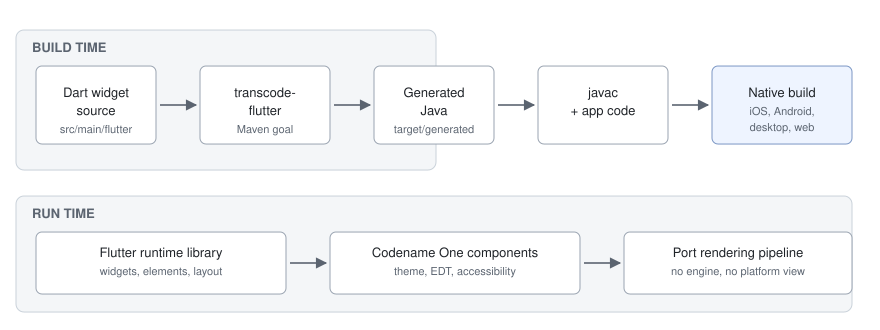
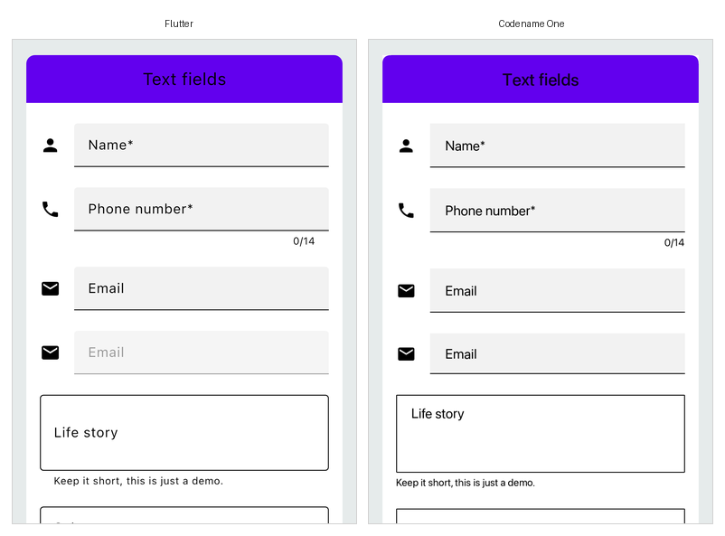

[[flutter-interop]]
== Running Flutter widget code

Codename One can compile Dart widget source into a Codename One UI at build
time. The Dart is translated to Java, the Java is compiled by the normal
toolchain, and the resulting widgets render through Codename One's own
pipeline on every port the framework supports.

There is no Dart VM in the application, no embedded rendering engine, and no
platform view. A screen written as Dart widgets becomes ordinary Codename One
components, so it inherits the theme, the event thread, the accessibility
tree and the native build at no extra cost -- and it can sit in the same `Form` as
hand-written Codename One code.

Two things follow from that, and they're the reason to reach for this at all:

* An existing Dart UI can be reused without adopting a second runtime, a
  second build system or a second set of platform plugins.
* An existing Codename One application can adopt a Dart screen without being
  rewritten.

=== How it fits together

The pipeline has three stages, and each is an ordinary build step you can run
and inspect on its own.

Dart widget source in `src/main/flutter` is read by the `transcode-flutter`
goal during `generate-sources`. It emits Java into
`target/generated-sources/flutter`, which the normal compile phase picks up.
At runtime those generated classes call into the Flutter runtime library,
which implements the widget, element and render-object model on top of
Codename One containers.

The key design point is where the boundary sits. The runtime reimplements
Flutter's *layout and composition* model -- constraints down, sizes up,
elements reconciled against widgets -- but it doesn't reimplement Flutter's
*rasterizer*. Painting is Codename One's, which is what makes the output a
real Codename One component tree rather than a texture.

=== Enabling it in a project

Add the runtime dependency to the `common` module. Projects generated from the
archetype already contain it, commented out:

[source,xml]
----
include::../demos/common/src/main/snippets/developer-guide/flutter-interop.xml[tag=flutter-interop-xml-001,indent=0]
----

Then put Dart files under `common/src/main/flutter`. The goal is already bound
in the generated `pom.xml` and is a silent no-op while that directory doesn't
exist, so nothing changes for projects that don't use it.

No Dart SDK is required. The transpiler is Java and runs as part of the Maven
build; the Dart source is input, not something that gets executed.

The generated package defaults to `com.codename1.generated.flutter` and the
paths are configurable:

[cols="1,2", options="header"]
|===
|Property |Meaning

|`cn1.flutter.sourceDir`
|Where the Dart lives. Defaults to `src/main/flutter`.

|`cn1.flutter.outputDir`
|Where the generated Java is written. Defaults to
`target/generated-sources/flutter`.

|`cn1.flutter.package`
|The package the generated classes are emitted into.
|===

=== Use case: One screen inside an existing application

This is the incremental path, and the one to start with. `FlutterUI.wrap`
inflates a widget into a plain `Container` that can be added anywhere an
ordinary component can:

[source,java]
----
include::../demos/common/src/main/java/com/codenameone/developerguide/flutter/FlutterInteropSnippets.java[tag=flutter-interop-java-001,indent=0]
----

The wrapped subtree is a component like any other: it participates in the
parent's layout, scrolls with it, and is styled by the same theme. An embedded
subtree does *not* install the Material base theme, so dropping a
widget into an existing screen won't restyle the rest of it.

That makes this the right shape for reusing a piece of design work -- a chart,
a card, an onboarding pane -- without committing the rest of the application to
anything.

=== Use case: Porting an application wholesale

When the Dart source *is* the application, `FlutterUI.runApp` mounts the tree
as the root of a new `Form` and shows it, which is the direct analog of
Flutter's own `runApp`:

[source,java]
----
include::../demos/common/src/main/java/com/codenameone/developerguide/flutter/FlutterInteropSnippets.java[tag=flutter-interop-java-002,indent=0]
----

Unlike `wrap`, this path installs the Material base theme, because the widget
tree is expected to be the whole UI and to look the way its author intended.

A wholesale port is mostly a question of how much of the Dart language and of
the Flutter libraries the application actually uses. The transpiler reports
what it can't handle rather than guessing: a construct outside the supported
subset fails the build with a milestone code identifying the feature, so the
gap is a list you can work through rather than a runtime surprise.

At runtime the same principle applies. Widgets that aren't implemented are
recorded through the error inventory rather than drawing nothing,
so a screen that's missing something says so.

=== What to expect from the result

The transpiled UI is a Codename One application in every respect that matters
for shipping it: it builds for the same targets, it's signed and packaged the
same way, and it has no additional runtime to install on the device.

That last point is what the size and start-up differences come from, and it
cuts both ways -- a Flutter application carries an engine that's good at
what it does, while a transpiled one carries Codename One's. The benchmark
described in <<flutter-benchmark>> measures both sides of the same application
on each platform and publishes the result rather than asserting a direction.

The screen above is the gallery's text-field demo, rendered by Flutter on the
left and by the transpiled build on the right, from one Dart source file.

[[flutter-benchmark]]
=== Measuring it against Flutter

The project keeps a benchmark that builds *one* application both ways -- the
Flutter toolchain's own release build, and the identical Dart source
transpiled and built by Codename One -- and measures both on the same machine.
It lives in `scripts/flutter-bench` and runs in CI, publishing its numbers to
the pull request and to the port status page.

What it reports, per platform:

[cols="1,3", options="header"]
|===
|Metric |What it means

|Installed size
|The sum of the artifact's file lengths, which is what the user's device gives
up. Not `du`, which rounds every file up to a block.

|Executable code
|Every compiled binary in the artifact, added together. Counting only the main
executable is wrong on iOS, where a Flutter application's own code isn't in
the executable at all -- it's in the frameworks beside it.

|Download size
|The artifact compressed, because that's what a store ships.

|Cold start
|Wall time from launching the process to the first frame being on screen,
measured from outside so neither runtime is trusted to time itself.

|Memory at rest
|The platform's own accounting for a settled, idle application.
|===

Three rules keep the numbers honest, and each exists because the obvious
alternative produced a flattering result:

* *Interleaved runs, best of N.* One run of each side, alternating. A machine
  that gets busier halfway through then penalizes both sides equally instead
  of whichever happened to run second, and the load average is recorded with
  every result so a surprising ratio can be checked against it.

* *Start-up is a bracket, not a point.* The two runtimes don't expose the
  same event. Flutter's post-frame callback runs before that frame is
  rasterized, while Codename One's marker fires once the form is on the
  screen, so comparing them directly charges one runtime for rasterizing its
  first screen and not the other. The benchmark therefore reports Flutter's
  figure as a range and computes the ratio from the end least favorable to
  Codename One.

* *A platform that can't be measured says so.* iOS start-up and memory are
  reported as not measured rather than taken from a simulator, because Dart
  can't compile ahead-of-time for the simulator -- a simulator comparison
  would time Flutter's debug build against a Codename One release build.
  iOS sizes come from release device bundles, which need no signing to measure.

To run it locally against builds you already have:

[source,bash]
----
include::../demos/common/src/main/snippets/developer-guide/flutter-interop.sh[tag=flutter-interop-bash-001,indent=0]
----

`--list` also reports which platform adapters have been exercised end to end,
which isn't the same question as which ones exist.
