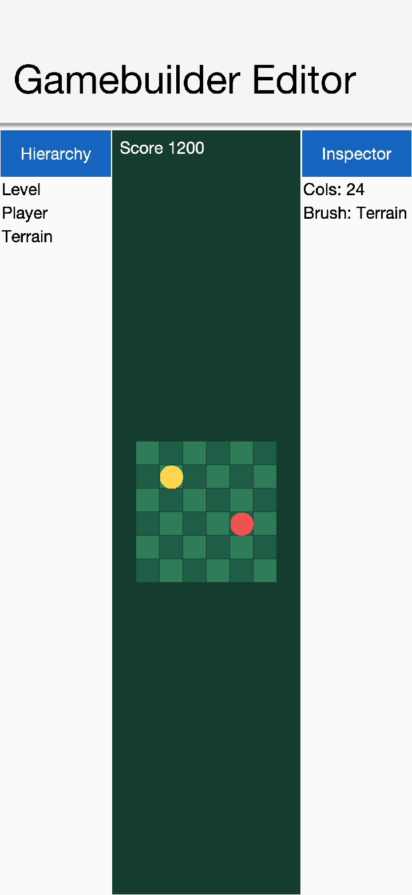
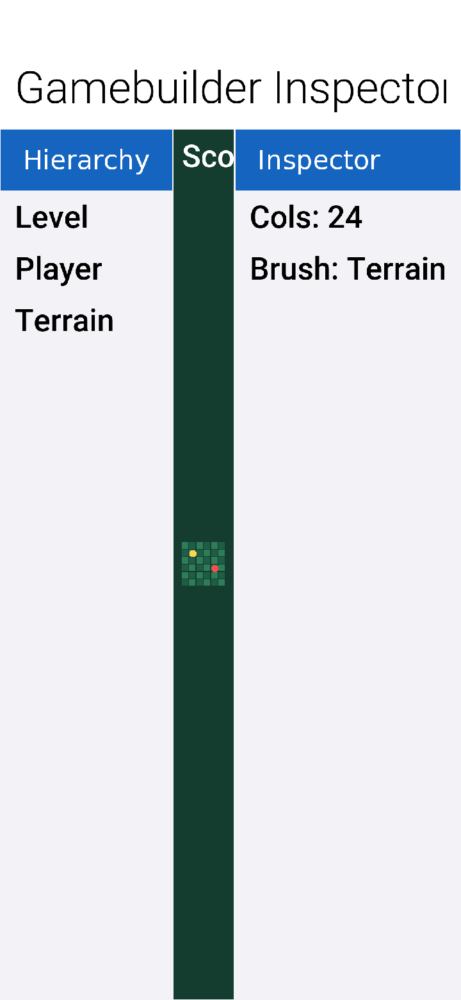
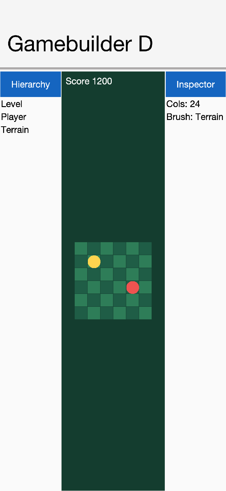
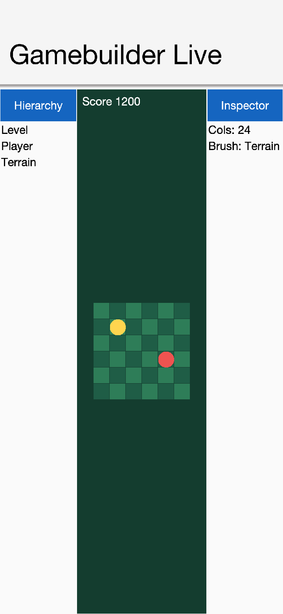
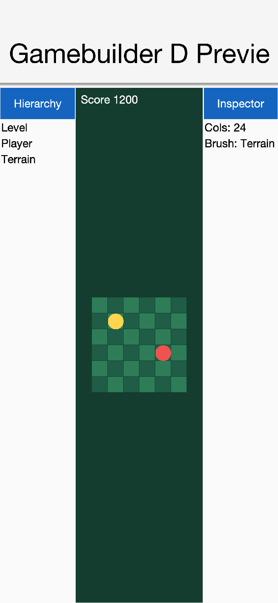
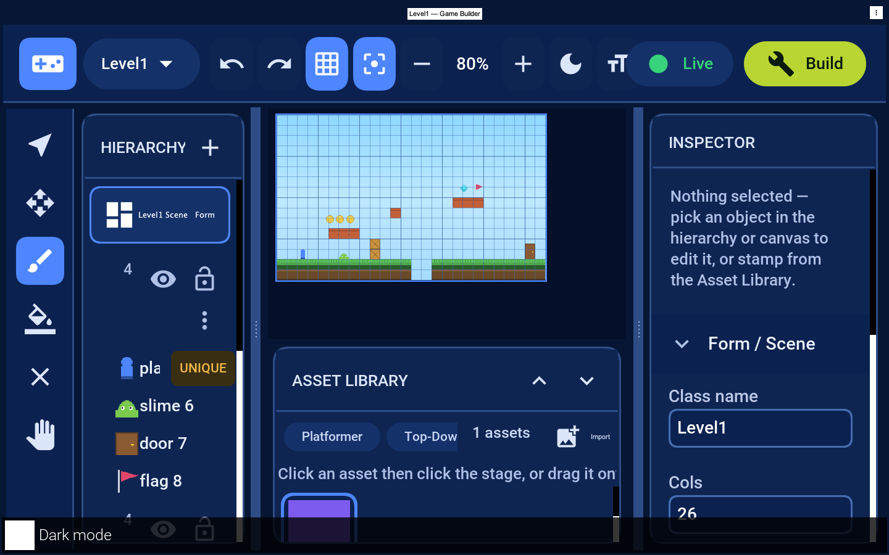

== The Game Builder

The *Game Builder* is a visual level / map editor for the
<<Game Development,`com.codename1.gaming`>> API. You lay out a game world -- tiles,
characters, items, the camera -- set per-object behavior values, preview it live, and
*Build* it into your project as a data file plus a small Java companion that the runtime
plays. It's to games what the GUI builder is to forms.

This chapter covers the whole feature: the underlying model, the editor UI, building a
level, _defining game rules_, the supported _game types_, and the Maven workflow.

=== How it fits together

A game built with this tool has three layers:

[cols="1,3,2", options="header"]
|===
| Layer | Role | Who authors it
| Level data (`+*.game+`)
| A JSON description of the scene: grid, layers, placed elements + their properties,
camera, lights.
| The Game Builder (visual)
| Companion class (`+*.java+`)
| A thin `GameSceneView` subclass that loads the data and holds your game logic.
| Generated once, then *you* edit the `onUpdate` body
| Gaming engine (`com.codename1.gaming`)
| Renders and runs the scene on the GPU, with pollable input, sound and optional Box2D
physics.
| The framework
|===

The key idea: *the editor produces data, your companion adds rules, the engine runs
it.* Because the level is data you can re-edit it any time without touching your code,
and your `onUpdate` logic is preserved across regeneration.

==== The level model -- `com.codename1.gaming.level`

[cols="1,3", options="header"]
|===
| Class | Purpose
| `GameLevel`
| The saveable level: `getMode()` (`MODE_2D` / `MODE_3D` / `MODE_BOARD`), grid,
`layers()`, `elements()`, camera, `lights()`, `getTerrain()`. `load(json)` / `toJson()`.
| `GameElement`
| A placed thing: `id`, `name`, `assetId`, `layer`, a transform and a typed _property
bag_ (`getInt`/`getDouble`/`getString`/`getBoolean`). It's not a `Sprite`, so the same
model works in 2D and 3D.
| `Layer`
| A named band: `KIND_TILE` (an `assetId`-per-cell grid), `KIND_ENTITY`, `KIND_MODEL`;
plus `isVisible()` / `isLocked()`.
| `AssetCatalog` / `AssetPack` / `AssetDef`
| Resolve an `assetId` to artwork and default properties. Packs ship as JSON.
| `GameSceneView`
| A turnkey `GameView` that _plays a level_: it realizes 2D/board sprites and, in 3D,
sets up the perspective camera, lights and a `Model` per element. Put game logic in
`onUpdate(double dt)`.
| `IsoProjection`, `TileLayer`, `LevelLight`, `TerrainGrid`
| Board isometric math, fast single-tileset grids, and 3D lighting / terrain data.
|===

Loading and playing a level at runtime is three lines:

=== Getting started

Create a scene from a *Java 17* Codename One project:

[source,bash]
----
include::../demos/common/src/main/snippets/developer-guide/game-builder.sh[tag=game-builder-bash-001,indent=0]
----

`-Dmode` is `2d` (default), `3d` or `board`. This writes
`common/src/main/resources/games/Level1.game` (an empty level of that type) and
`common/src/main/java/com/example/game/Level1.java` (the `GameSceneView` companion).

Open the editor bound to the project -- the same way `cn1:guibuilder` launches the GUI
builder:

[source,bash]
----
include::../demos/common/src/main/snippets/developer-guide/game-builder.sh[tag=game-builder-bash-002,indent=0]
----

The editor itself is delivered through Maven: the goal resolves the
`com.codenameone:codenameone-gamebuilder` artifact from Maven Central (the same mechanism
that ships the Designer / CSS-compiler jar with the plugin), so there is no separate
install step. The `cn1:gamebuilder` goal only applies to Java 17 Codename One projects.

=== The editor at a glance

* *Top bar* -- the project / scene dropdown (switch scenes, rename, or start a *new
scene of any game type*), undo / redo, the *grid* and *snap* toggles, zoom, a *text-size*
toggle (Small / Medium / Large), the `</>` button (*opens the scene's Java in your IDE*),
*Live* (play in place) and *Build* (save into the project).
* *Tool rail* (left) -- Select, Move, Brush, Fill, Erase, Pan.
* *Resizable panels* -- drag the thin divider on the inner edge of the left panel or the
inspector to resize it.
* *Hierarchy* -- the scene card plus the layers. Each layer shows its item *count*, a
visibility *eye* (hides the layer), a *lock* (prevents edits) and a *⋮* menu to *rename or
delete* it; drag a placed object onto another layer (or above/below a sibling) to move or
reorder it. Placed objects nest under
their layer, and unique objects (the player) carry a *UNIQUE* badge.
* *Canvas* -- the editable _stage_ is the bright-bordered rectangle with the grid;
painting only happens inside it.
* *Asset Library* (center-bottom) -- pick a *pack* tab, then click a thumbnail to select
an asset. Selecting a tile asset switches to a tile layer; selecting an actor switches
to an entity layer, so the brush always works on the next click. *Import* (top-right)
brings in your own artwork as a new asset.
* *Inspector* (right) -- scene settings when nothing is selected, or the selected
object's properties.

Because it's a desktop application, *every command is also available from the native
menu bar* (drawn by the OS), grouped by convention: *File* (New 2D / 3D / Board, Open
Scene, Save), *Edit* (Undo, Redo, Delete Selection), *View* (Toggle Grid / Snap, Zoom
In / Out, Show Generated Code), *Tools* (Select / Move / Brush / Fill / Erase / Pan),
*Layer* (Add Layer) and *Game* (Play / Stop). The standard accelerators work too --
`Cmd/Ctrl+Z` undo, `Cmd/Ctrl+S` save, `Cmd/Ctrl+R` play, `Cmd/Ctrl+=` / `Cmd/Ctrl+-`
zoom. Every on-screen control also has a tooltip.

=== Building a level

. *Choose a game type* -- scene dropdown -> _New scene_ -> *2D Platformer*, *3D Map* or
*Board* (or scaffold with `-Dmode`).
. *Paint terrain* -- pick the *Brush*, click a tile in the Asset Library, then
click/drag inside the stage. *Fill* flood-fills a region; *Erase* clears cells.
. *Place characters and items* -- click an actor asset and click on the stage to stamp
it. With *Snap* on, actors land on grid cells. The *Player* is unique -- stamping it
again moves it.
. *Organize with layers* -- placed objects nest under their layer in the hierarchy, so
you can always see which band each one is on. The *eye* hides a layer while you work
(its name dims), the *lock* prevents edits to it, the chevron collapses its children, and
*+* adds a layer. To move a selected object to a different layer (changing its draw
order), use the *Layer* picker in the Inspector's _Transform_ section.
. *Undo / redo* every change with the toolbar arrows.
. *Save* with *Build* -- it writes `Level1.game` and, the first time, the companion
`Level1.java`.

=== Defining game rules

Game rules live in two complementary places.

==== Data -- set in the Inspector

Select an object to edit its *Transform* (name, position, *Layer* dropdown) and its
*Behavior* properties -- the typed values that parameterize how it acts:

[cols="1,2", options="header"]
|===
| Object | Behavior properties
| Player / Hero | `lives`, `jumpHeight`
| Coin / Gem | `value`
| Enemy (slime) | `speed`, `patrol`
| Door / Goal | `target` (next scene)
| Torch | `lightRadius`
| Card / Token / Dice | `suit`/`rank`, `player`/`cell`, `sides`
|===

These defaults come from the *asset* -- the Inspector's read-only *Asset* section shows
the id, kind, size and `unique` flag, and *Edit asset defaults…* lets you change an
asset's default size and properties (for example, tune `ground`/`coin`). Use *Add property…* to
attach your own game metadata (`hitPoints`, `value`, …) to a single object, readable at
runtime via `el.getInt(...)` / `el.getDouble(...)`. *This is the player* marks
which element the preview and arrow keys drive (otherwise a `player`/`hero`/`spawn` asset
is used).

Scene-wide rules are set in the Inspector when nothing is selected: *gravity*,
*background* theme, grid *Cols / Rows / Tile size* and the *Mode*. These are saved
into the `.game` file and are available at runtime on each `GameElement`.

==== Logic -- written in the companion

The behavior _values_ are data; the behavior _itself_ is code you write in the generated
companion's `onUpdate(double dt)`. `GameSceneView` realizes every element into a sprite
whose `getUserData()` is the source `GameElement`, so you read the properties you set in
the editor:

Win/lose conditions, scoring, enemy AI and level transitions (using a door's `target`)
are all decided here. For rigid-body games use
<<Physics,`com.codename1.gaming.physics`>> inside `onUpdate`. In short: *the editor decides the layout and the numbers; your companion
decides the behavior; the engine runs it.*

=== Game types

The *mode* (chosen per scene) plus the *asset pack* determine how the same level model
is realized:

[cols="1,2,1,2", options="header"]
|===
| Mode | Realized as | Packs | Use for
| `MODE_2D` | `Sprite`s in pixel space, tile grids | Platformer, Top-Down RPG | platformers, shooters, top-down adventures
| `MODE_BOARD` | `Sprite`s placed through an isometric `IsoProjection` | Board & Card | board games, strategy, card games
| `MODE_3D` | `Model`s under a perspective `GameCamera`, with `LevelLight`s and a `TerrainGrid` | 3D Kit | 3D maps, arena / tycoon layouts
|===

Switch type from the scene dropdown's _New scene_ buttons or scaffold with
`-Dmode=2d|3d|board`. In 3D mode the Inspector also exposes the camera rig, lighting and
terrain; placed elements become meshes (import your own glTF via `GltfLoader` from the
companion's `buildModels` hook).

In *3D mode* the board is edited top-down (placement, terrain and lighting), and the
grid autofits the canvas so it stays usable at any size and zoom. Each placed element
reads as a single object on the grid rather than a flat sprite filling the board.

=== Live preview

Press *Live* to play the level in place inside a device frame with a HUD. The preview
ships *default behaviors* so common cases work without any code: in a 2D platformer the
*arrow keys* move the player and *Up / Space* jumps (gravity and tile collision are
simulated), coins/gems are *collected for score*, and enemies *patrol* and cost a life on
contact. The on-screen hint shows the controls, and the *SCORE / LIVES* HUD is live.
Press *Stop* to return to editing -- playing never mutates the level.

For a *3D map* the preview switches to a true perspective view -- a receding ground grid
with the placed meshes rendered as depth-sorted objects under an orbiting camera -- so
you see 3D gameplay rather than a flat top-down board:

The in-editor preview is for quick iteration; for full-fidelity play on device, run the
companion in your app, where the scene is rendered by the GPU-accelerated
`GameSceneView`.

=== Build, save and run

*Build* writes the level to `src/main/resources/games/<Scene>.game` and (once) the
companion `<Scene>.java`. To show the scene in your app, instantiate the companion and
`start()` it:

The level is plain data, so you can ship many `.game` files and load whichever level the
player selects.

=== Maven goals

[cols="2,3", options="header"]
|===
| Goal | Purpose
| `cn1:create-game-scene -DclassName=… -Dmode=2d\|3d\|board` | Scaffold a `.game` + companion (Java 17 projects only).
| `cn1:gamebuilder` | Launch the editor bound to the current project.
|===

=== Extending

* *Asset packs* are JSON
(`+{"packs":[{"id","name","assets":[{"id","kind","w","h","color","unique","source","defaults"}]}]}+`)
loaded by `AssetCatalog.load`. Add your own pack with real art.
* *Asset art* follows the SVG/Lottie approach: reference source art per asset and let the
build translate it to code/raster; where no art is supplied the catalog draws a
recognizable placeholder so a level always renders.
* *Behaviors* can be factored into reusable helpers driven entirely from the property
bag, keeping levels data-only.

==== Importing your own art

To bring in custom artwork, click *Import* in the Asset Library header and pick an image.

The image is added to a *Custom* pack as a new asset (a *tile* when a tile layer is
active, otherwise an *actor*), selected and ready to paint or stamp immediately. When the
editor is bound to a project, the picture is copied into
`src/main/resources/games/assets/` and recorded in `games/custompack.json`, so it
survives reloading and ships with the project -- the generated game resolves it through
the same `AssetCatalog`.
