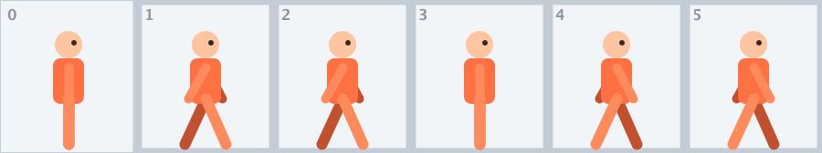
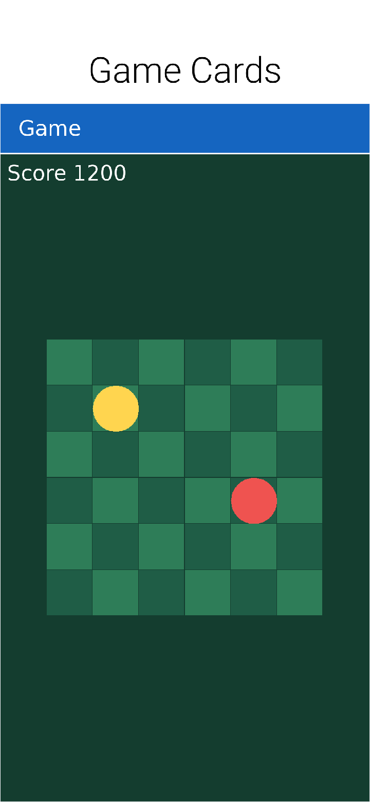
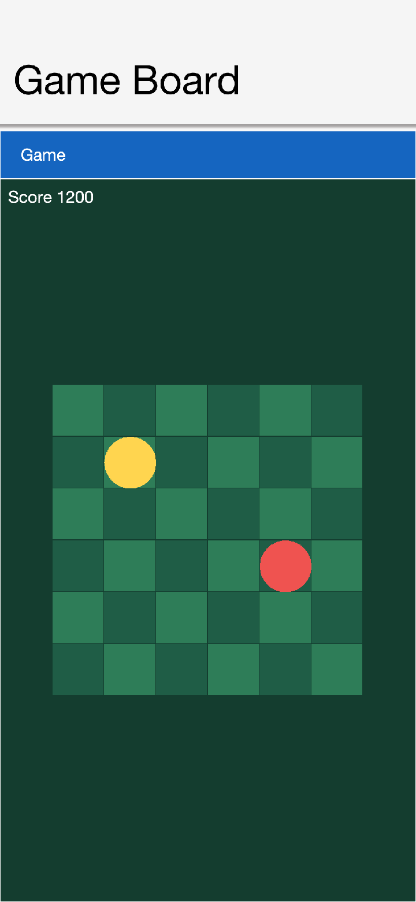
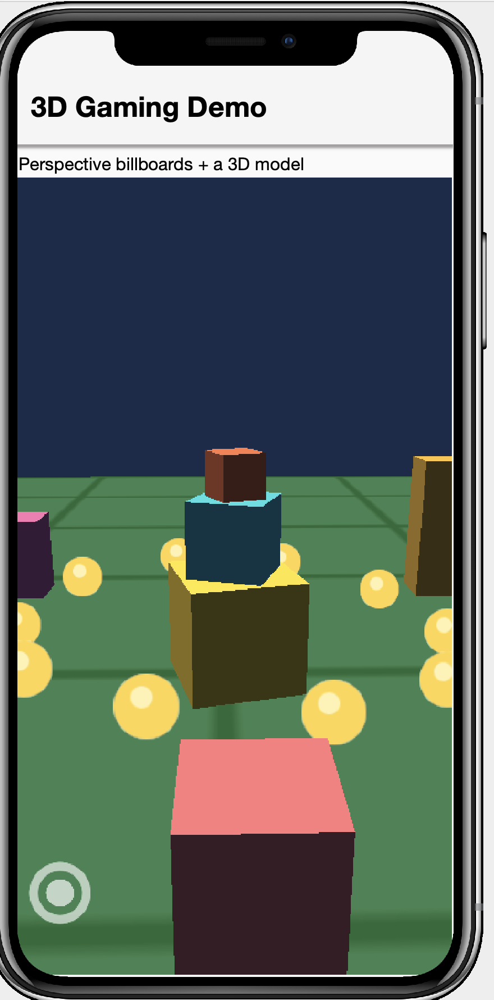

== Game Development

Codename One is a general purpose UI toolkit, but it ships with a package built
specifically for games: https://www.codenameone.com/javadoc/com/codename1/gaming/package-summary.html[`com.codename1.gaming`].
It gives you the things games need -- a tight update loop, sprite primitives,
pollable input, low latency sound effects and rigid body physics -- and renders on
the GPU through the <<3D Graphics and Shaders,`com.codename1.gpu`>> package.
Everything written here runs unchanged on every Codename One target, including iOS.

TIP: This chapter covers the real time game surface. For the "casual game"
approach -- building game elements out of regular `Component`s and letting the
layout system render them -- the techniques in the <<Animations>> chapter are
often a better fit. Reach for `com.codename1.gaming` when you want a frame driven
loop and GPU sprite rendering.

=== Sample games

The samples project ships several runnable starting points. Each is a single file
built entirely from art generated at runtime -- no asset files -- so you can copy
one and start changing it immediately. The rest of this chapter draws on them to
show how the pieces fit together.

[cols="1a,1a,1a", frame=none, grid=none]
|===
| image::img/game-casual.png[Casual arena demo,240]
| image::img/game-scroller.png[Side scroller demo,240]
| image::img/game-3d.png[3D world demo,240]

| *`CasualGameSample`* +
A top-down arena: fly a thruster ship with the on-screen joystick, scoop up
spinning gems and dodge drifting asteroids. Many sprites in a `Scene`, per-sprite
animation, collision, particle bursts and a twinkling starfield.
| *`ScrollerGameSample`* +
A side-scroller: an `AnimatedSprite` runner with a walk cycle that flips to face
its direction, a sun/cloud/hill parallax backdrop, hand-rolled jump physics, and a
joystick + JUMP button.
| *`Gaming3DDemoSample`* +
A 3D world: a spinning multi-cube monument on a textured grid ground, ringed by
colored `Model` buildings and billboarded coins, lit and orbited by a perspective
camera.
|===

Two more samples show how far the same 2D primitives stretch -- one flat, one faked
into 3D:

* *`CardGameSample`* -- a 2D Memory (Concentration) match. Each card is a `Sprite`
in a grid; flipping one animates its horizontal scale through zero and swaps the
image at the thin point, and taps are hit-tested against sprite bounds through
`GameInput`. A compact illustration of flat 2D play with no camera tricks at all.
Dissected in <<Case study: The card game (flat 2D)>>.
* *`BoardGameSample`* -- *faux-3D* checkers on an isometric board. Every tile and
piece is still a flat `Sprite`, but laying them out in an isometric (2:1 diamond)
projection and raising the pieces off their tiles with a drop shadow gives a
convincing 3D look without any GPU 3D, perspective camera or models. The screen
pixel-to-board-cell mapping (and its inverse, for picking) is the same math behind
any isometric strategy or tycoon game; it also implements the full move/jump/chain
/crown rules and a small AI so you can play it solo. Dissected in
<<Case study: Faux-3D checkers (isometric projection)>>.

The action samples are driven by the joystick and buttons in
<<On-screen touch controls>>, so they're equally playable on a touch device and in
the desktop simulator (where the arrow keys and mouse stand in for the stick); the
card and board games are pure tap.

=== The game loop: `GameView`

https://www.codenameone.com/javadoc/com/codename1/gaming/GameView.html[`GameView`]
is the heart of the package. It's a GPU surface (a
https://www.codenameone.com/javadoc/com/codename1/gpu/RenderView.html[`RenderView`])
that runs the frame loop for you -- a display link on device, the dependency-free
software rasterizer in the simulator -- so there's no EDT busy loop and no frame
rate to manage. You build your world by adding `Sprite`s to its `Scene`, advance
the game in `update(double)`, and the view draws the scene every frame.

[source,java]
----
include::../demos/common/src/main/snippets/developer-guide/game-development.java[tag=game-development-java-001,indent=0]
----

The `dt` passed to `update` is the wall clock time since the previous frame.
Multiplying movement by it keeps the game running at the same speed regardless of
the actual frame rate ("delta timing"). Notice there's no draw method -- positioning
sprites is all you do; the GPU renderer handles the rest (see <<Sprites>>).

==== Lifecycle

`start()` begins continuous rendering, `stop()` halts it, and `pause()`/`resume()`
suspend `update` while the view keeps drawing the last frame. `start()` is safe to
call before or after the form is shown.

[source,java]
----
include::../demos/common/src/main/snippets/developer-guide/game-development.java[tag=game-development-java-002,indent=0]
----

`setClearColor(int argb)` sets the background the view is cleared to each frame.

==== Fixed timestep and interpolation

Variable time steps are simple but make physics nondeterministic. Call
`setFixedTimestep(seconds)` to have `update` invoked at a fixed interval instead;
the loop accumulates real time and may call `update` several times in one frame to
catch up (capped to avoid a "spiral of death" after a long pause). The leftover
fraction is available from `getInterpolationAlpha()` (0 to 1) so you can interpolate
rendered positions between physics states:

[source,java]
----
include::../demos/common/src/main/snippets/developer-guide/game-development.java[tag=game-development-java-003,indent=0]
----

==== Threading

`update(double)` runs on the render thread, together with drawing. Keep it
non-blocking -- offload asset loading, networking or other long work to a background
thread and hand the result back with
https://www.codenameone.com/javadoc/com/codename1/ui/CN.html#callSerially-java.lang.Runnable-[`CN.callSerially`].

=== Input: `GameInput`

Games usually want to ask "is the left key down right now?" rather than handle a
stream of events. https://www.codenameone.com/javadoc/com/codename1/gaming/GameInput.html[`GameInput`],
obtained from `GameView.getInput()`, captures the view's key and pointer events
and exposes them as state. There are two flavors:

* *Level* state, true for as long as the input is held: `isKeyDown(int)`,
`isGameKeyDown(int gameAction)`, `isPointerDown()`.
* *Edge* state, true only during the single frame the transition happened:
`wasKeyPressed(int)`, `wasKeyReleased(int)`, `wasPointerPressed()`,
`wasPointerReleased()`. Edges are cleared at the end of each frame, after `update`
has run.

`isGameKeyDown` works with the device independent game actions `Display.GAME_UP`,
`GAME_DOWN`, `GAME_LEFT`, `GAME_RIGHT` and `GAME_FIRE`, so directional input works
the same across keyboards and devices. Pointer coordinates are reported relative
to the `GameView`'s top left.

[source,java]
----
include::../demos/common/src/main/snippets/developer-guide/game-development.java[tag=game-development-java-004,indent=0]
----

=== On-screen touch controls

A keyboard is fine in the simulator, but a phone has no arrow keys. Every
`GameView` comes with a https://www.codenameone.com/javadoc/com/codename1/gaming/TouchControls.html[`TouchControls`]
(from `getControls()`) that draws an on-screen *virtual joystick* and *buttons* and
feeds them into the same `GameInput` -- so the input code you already wrote for
the keyboard works untouched on touch devices.

* The *joystick* reports analog direction through `GameInput#getAxisX()` /
`getAxisY()` (each -1 to 1), and at the same time presses the digital game actions
`GAME_LEFT` / `GAME_RIGHT` / `GAME_UP` / `GAME_DOWN` once it crosses its dead zone,
so `isGameKeyDown(...)` keeps working.
* A *button* holds down a key code while it's pressed, so `isKeyDown(int)` and
`wasKeyPressed(int)` report it exactly like a hardware key. Map it to a game action
with `Display.getInstance().getKeyCode(Display.GAME_FIRE)`, or to any key code of
your own.

Anchor controls to a corner of the view's *safe area* with the alignment constants
(`TouchControls.LEFT` / `CENTER` / `RIGHT` and `TOP` / `CENTER` / `BOTTOM`) and a
margin. The framework keeps them clear of notches and home indicators and
repositions them automatically when the view resizes or the device rotates -- you
never recompute coordinates:

[source,java]
----
include::../demos/common/src/main/snippets/developer-guide/game-development.java[tag=game-development-java-005,indent=0]
----

The joystick (bottom-left) and JUMP button (bottom-right) are visible in the
<<Sample games,sample screenshots>> above. There are also absolutely
positioned overloads (`addJoystick(centerX, centerY, radius)`), and
`setVisible(false)` hides the overlay -- handy when a real keyboard is attached.
Multi-touch is supported, so the player can steer and press a button at once.

=== Sprites

A https://www.codenameone.com/javadoc/com/codename1/gaming/Sprite.html[`Sprite`]
is a lightweight data holder: an image plus position, rotation, scale, a normalized
anchor and an ARGB tint. It describes *what* and *where*; a
https://www.codenameone.com/javadoc/com/codename1/gaming/SpriteRenderer.html[`SpriteRenderer`]
turns it into a GPU textured quad each frame using the `com.codename1.gpu` package
-- an orthographic camera mapping one world unit to one pixel, a
`com.codename1.gpu.Material.Type#SPRITE` material and alpha blending. Because a
sprite never touches the GPU directly you create one with just an
`com.codename1.ui.Image`; the renderer uploads and caches the matching texture on
demand.

`getX()`/`getY()` is the location of the anchor point (the image center by
default), and rotation and scale pivot around that anchor.

[source,java]
----
include::../demos/common/src/main/snippets/developer-guide/game-development.java[tag=game-development-java-006,indent=0]
----

`getBounds()` returns the axis aligned bounding box and `intersects(Sprite)` does a
quick box overlap test, handy for broad phase collision before you involve physics.

==== Scenes

A https://www.codenameone.com/javadoc/com/codename1/gaming/Scene.html[`Scene`] is a
z-ordered collection of sprites with an optional camera offset, drawn for you by
the renderer. Sprites are drawn from lowest to highest `zOrder`, so higher z-order
sprites appear on top; the camera offset (`setCamera(int, int)`) scrolls the whole
scene. `GameView.getScene()` is the scene the view draws.

You don't need a `GameView` to render sprites: a `SpriteRenderer` is itself a
`com.codename1.gpu.Renderer`, so you can host one in a plain `RenderView`.

[source,java]
----
include::../demos/common/src/main/snippets/developer-guide/game-development.java[tag=game-development-java-007,indent=0]
----

==== Sprite sheets and animation

https://www.codenameone.com/javadoc/com/codename1/gaming/SpriteSheet.html[`SpriteSheet`]
slices one atlas image into a grid of equally sized frames, cutting and caching
each frame on first use (cutting a sub image copies pixels, so caching matters).

https://www.codenameone.com/javadoc/com/codename1/gaming/AnimatedSprite.html[`AnimatedSprite`]
is a `Sprite` that cycles through a sequence of frames over time; the scene advances
it every frame, so adding it to the scene is all you need.

[source,java]
----
include::../demos/common/src/main/snippets/developer-guide/game-development.java[tag=game-development-java-008,indent=0]
----

A sprite sheet is just a strip (or grid) of frames like the run cycle above: the
arms and legs swing a little further each frame, and playing them in sequence reads
as motion. `AnimatedSprite` also accepts a plain `com.codename1.ui.Image[]` when you
build the frames yourself, which is what `ScrollerGameSample`'s runner does:

[source,java]
----
include::../demos/common/src/main/snippets/developer-guide/game-development.java[tag=game-development-java-009,indent=0]
----

Setting a *negative scale* flips the sprite horizontally, so a single set of frames
faces both ways -- no mirrored art needed (sprites are drawn double-sided for
exactly this reason). `play()`, `pause()`, `stop()`, `setLooping(boolean)` and
`setCurrentFrame(int)` control playback.

=== Case study: The card game (flat 2D)

`CardGameSample` is Memory (Concentration): sixteen face-down cards in a four-by-four
grid, tap two and they stay up when they match, flip back when they don't. It's
the smallest complete example of turn-based 2D play with `com.codename1.gaming`
-- no joystick, no physics, no camera -- which makes the three techniques it does
use easy to see in isolation.

*One sprite per card.* Each card is a `Sprite` positioned at its grid slot. There
are exactly two images at any moment: the shared card-back image and the card's
own face (all generated at runtime with `Image.createImage` and `Graphics` calls,
so the sample needs no assets). Changing what a card shows is just
`sprite.setImage(...)`.

*A flip you can fake with scale.* A real card flip is a 3D rotation, but
squeezing the sprite's horizontal scale through zero and swapping the image at
the thin point reads exactly the same to the eye:

[source,java]
----
include::../demos/common/src/main/snippets/developer-guide/game-development.java[tag=game-development-java-010,indent=0]
----

This is the same negative/positive scale trick the scroller uses to flip its
runner, driven over time to play as an animation.

*Polled taps against sprite bounds.* There are no buttons to wire up;
`update(double)` polls the `GameInput` edge state and hit-tests the tap against
each card's bounding box:

[source,java]
----
include::../demos/common/src/main/snippets/developer-guide/game-development.java[tag=game-development-java-011,indent=0]
----

The rest of the sample is a small state machine living in plain fields: the
first and second face-up cards, a `mismatchTimer` that counts down in `update`
before flipping a failed pair back, and a moves counter surfaced through the
form title. Note the timer: in a game loop you don't schedule callbacks, you
subtract `dt` from a countdown field each frame and act when it crosses zero.

=== Case study: Faux-3D checkers (isometric projection)

`BoardGameSample` plays a full game of checkers -- moves, forced captures, chained
jumps, crowning, and a small AI opponent -- on a board that looks convincingly 3D --
yet there is no perspective camera and no `Model` anywhere: every tile and piece
is a flat `Sprite`. The 3D impression comes entirely from *where* the flat art is
placed, a technique (isometric or "2.5D" projection) that powered decades of
strategy and tycoon games and still works just as well on a GPU sprite pipeline.

*The projection.* Board cell `(r, c)` maps to screen pixels by laying the grid out
as 2:1 diamonds -- columns step right-and-down, rows step left-and-down:

[source,java]
----
include::../demos/common/src/main/snippets/developer-guide/game-development.java[tag=game-development-java-012,indent=0]
----

*Picking is the inverse.* Because the mapping is linear it inverts with two
divisions, turning a tap back into a board cell -- no per-tile hit testing
required:

[source,java]
----
include::../demos/common/src/main/snippets/developer-guide/game-development.java[tag=game-development-java-013,indent=0]
----

*Depth from z-order.* Cells further down the screen must draw over the cells
behind them, and within one cell the stacking is tile, then shadow, then
selection/move markers, then the piece. Both rules collapse into a single
number -- `(r + c)` strides the cells from back to front, and a small offset
layers the sprites within a cell:

[source,java]
----
include::../demos/common/src/main/snippets/developer-guide/game-development.java[tag=game-development-java-014,indent=0]
----

That pair of lines is also the whole "3D height" illusion: the piece is drawn
raised off its tile while its shadow stays put, and the eye reads the gap as
elevation. The piece art helps -- an elliptical top face over a darker side rim,
again just `fillArc` calls on a runtime-generated image.

*Rebuild, don't mutate.* After every move the sample throws away all its dynamic
sprites (pieces, shadows, markers) and recreates them from the `board[][]` array
in one `syncPieces()` pass. With a few dozen sprites this costs nothing, and it
keeps the scene a pure function of the game state -- there is no way for the
display to drift out of sync with the rules, which eliminates the whole class of
"the board shows X but the game thinks Y" bugs. The game logic itself
(`destinations`, forced captures, chaining, crowning) never touches a sprite; it
reads and writes the `int[][]` board only.

When fake 3D stops being enough -- you want the camera to move through the world
rather than look at it -- the next section covers the real thing.

=== 3D and perspective

`GameView` renders on the GPU through the <<3D Graphics and Shaders,`com.codename1.gpu`>>
package, so the same scene can be shown in 3D. Every view has a
https://www.codenameone.com/javadoc/com/codename1/gaming/GameCamera.html[`GameCamera`]
that starts in 2D mode; switching it to perspective turns flat sprites into
camera-facing billboards in a 3D world and lets you draw 3D meshes alongside them.
That's the basis for deeper gameplay modes -- an over-the-shoulder racer, an
isometric or top-down view with real depth, a 2.5D shooter.

`Gaming3DDemoSample` (above) is built entirely from the primitives this section
describes -- a textured ground plane, lit cube `Model` meshes, and billboarded
`Sprite` coins and trees, all orbited by a perspective camera.

==== Perspective camera and billboard sprites

Call `GameCamera#setPerspective(float, float, float)` and position the camera with
`setPosition` / `setTarget`. Once in perspective mode a `Sprite` is placed in world
space with `Sprite#setPosition(double, double, double)` and is drawn as a billboard
that always faces the camera, so your existing 2D art keeps working in 3D:

[source,java]
----
include::../demos/common/src/main/snippets/developer-guide/game-development.java[tag=game-development-java-015,indent=0]
----

World coordinates are right-handed with y up (the `com.codename1.gpu` convention),
and a sprite's size is world units rather than pixels -- use `Sprite#setSize(float,
float)` or `Sprite#setScale(float)` to pick a world-space size. Move the camera each
frame in `update(double)` to follow the player.

==== 3D models

https://www.codenameone.com/javadoc/com/codename1/gaming/Model.html[`Model`] draws a
real 3D mesh -- a `com.codename1.gpu.Material` plus a position, rotation, and scale.
Because GPU meshes need the `com.codename1.gpu.GraphicsDevice`, build them in
`GameView#onSetup(com.codename1.gpu.GraphicsDevice)`, the render-thread hook that
runs once before the first frame:

[source,java]
----
include::../demos/common/src/main/snippets/developer-guide/game-development.java[tag=game-development-java-016,indent=0]
----

`onSetup` is also where you load real assets with `com.codename1.gpu.GltfLoader`
(glTF `.glb`/`.gltf` models). Models are drawn opaque and depth-written before the
alpha-blended billboards, and the billboards depth-test against them, so closer
geometry correctly hides what's behind it. `GameView#getLight()` controls the
directional light that shades lit material types.

==== Meshes and textures

The built-in meshes are `com.codename1.gpu.Primitives#cube(GraphicsDevice, float)`
and `Primitives#quad(GraphicsDevice, float)`; a quad rotated flat makes a ground or
a wall. `Model#setScale(float, float, float)` reshapes one cube mesh into crates,
pillars or buildings of any proportion, so a whole skyline can share a single mesh.
Lit materials multiply their base color by a texture, so you can detail a surface --
a grid on the ground for depth, say -- by drawing an `com.codename1.ui.Image` and
uploading it with `com.codename1.gpu.GraphicsDevice#createTexture(com.codename1.ui.Image)`:

[source,java]
----
include::../demos/common/src/main/snippets/developer-guide/game-development.java[tag=game-development-java-017,indent=0]
----

For richer geometry, load glTF (`.glb`/`.gltf`) assets with
`com.codename1.gpu.GltfLoader` from `onSetup`.

=== Low latency audio: `SoundPool`

Music and video use the regular `MediaManager`, but rapid overlapping sound
effects -- gunshots, coins, footsteps -- need a different tool.
https://www.codenameone.com/javadoc/com/codename1/gaming/SoundPool.html[`SoundPool`]
loads short clips once and triggers them with minimal latency, mixing several at
the same time.

[source,java]
----
include::../demos/common/src/main/snippets/developer-guide/game-development.java[tag=game-development-java-018,indent=0]
----

`play` returns a voice id (or `-1` if the pool is momentarily exhausted -- it never
blocks on the hot path). The parameters are: `volume` 0 to 1, `pan` -1 (left) to 1
(right), `rate` playback speed/pitch (1.0 is normal), and `loop` (0 once, -1
forever, n extra repeats). `stop`, `pause`, `resume`, `stopAll`, `autoPause` and
`autoResume` manage playback; `release()` frees the pool.

On platforms with a purpose built low latency audio engine -- Android's `SoundPool`,
iOS `AVAudioEngine`, the desktop `javax.sound.sampled` mixer and `WebAudio` in the
browser -- the pool uses it directly with full volume/pan/pitch support. Where none
exists it falls back to a `MediaManager` based pool that still works everywhere but
has higher latency and ignores pan and rate. `isNativeAccelerated()` tells you which
path is active.

To react as a sound finishes -- chaining clips, recycling a game object when its
effect ends -- register a
https://www.codenameone.com/javadoc/com/codename1/gaming/VoiceListener.html[`VoiceListener`].
It's called on the EDT with the voice id as each voice completes. Not every native
engine can report completion, so guard with `isVoiceCompletionSupported()`:

[source,java]
----
include::../demos/common/src/main/snippets/developer-guide/game-development.java[tag=game-development-java-019,indent=0]
----

NOTE: Load your sounds once, up front -- ideally on a background thread with
`SoundPool.loadAsync(...)` -- and keep the `SoundEffect` references for the life of
the game. Decoding on the fly defeats the purpose.

=== Physics

The https://www.codenameone.com/javadoc/com/codename1/gaming/physics/package-summary.html[`com.codename1.gaming.physics`]
package adds 2D rigid body physics. It's an idiomatic wrapper around a pure Java
port of the well known Box2D engine, so it runs on every platform -- including
iOS, where it's translated to C with no native code.

==== Units: Pixels, meters and the y-axis

Box2D is tuned for objects a few meters across, so the world works in *meters*
internally while exposing *pixels* to you. The conversion is governed by
`setPixelsPerMeter(float)` (default 30). The wrapper also flips the y-axis -- Box2D
points y up, the screen points y down -- so your code stays in screen coordinates.
The practical consequence: a positive gravity y pulls bodies *down* the screen.

==== Worlds and bodies

Create a https://www.codenameone.com/javadoc/com/codename1/gaming/physics/PhysicsWorld.html[`PhysicsWorld`],
populate it with https://www.codenameone.com/javadoc/com/codename1/gaming/physics/PhysicsBody.html[`PhysicsBody`]
objects, and step it once per frame from your `update`:

[source,java]
----
include::../demos/common/src/main/snippets/developer-guide/game-development.java[tag=game-development-java-020,indent=0]
----

Bodies come in three kinds, the
https://www.codenameone.com/javadoc/com/codename1/gaming/physics/BodyType.html[`BodyType`]
values: `STATIC` (immovable -- ground, walls), `KINEMATIC` (moved by you via
velocity, unaffected by forces) and `DYNAMIC` (fully simulated). Bodies can be
boxes, circles or polygons (`createBox`, `createCircle`, `createPolygon`) and
respond to `setLinearVelocity`, `applyForce`, `applyLinearImpulse`, `applyTorque`,
`setBullet` (continuous collision for fast objects), `setFixedRotation` and more.

For an arbitrary outline, `createShape(x, y, shape, type)` takes a Codename One
`com.codename1.ui.geom.Shape` -- typically the same `com.codename1.ui.geom.GeneralPath`
you would draw with -- and builds the collision fixtures from it, flattening any
Bezier curves. Each subpath becomes a fixture (so a figure with several outlines is a
compound body); a closed convex subpath of up to eight points becomes a solid polygon
usable by any body type, while a concave, larger, or open subpath becomes a one-sided
edge chain (ideal for static terrain). This lets the hit-shape and the drawn shape
come from one piece of geometry:

[source,java]
----
include::../demos/common/src/main/snippets/developer-guide/game-development.java[tag=game-development-java-021,indent=0]
----

==== Driving sprites from physics

A body can drive a sprite directly. `Sprite` implements
https://www.codenameone.com/javadoc/com/codename1/gaming/physics/PhysicsLinkable.html[`PhysicsLinkable`],
so linking the two means `world.step(...)` updates the sprite's position and
rotation automatically (in pixels, screen space) -- and the scene draws it there:

[source,java]
----
include::../demos/common/src/main/snippets/developer-guide/game-development.java[tag=game-development-java-022,indent=0]
----

==== Collisions

Register a https://www.codenameone.com/javadoc/com/codename1/gaming/physics/ContactListener.html[`ContactListener`]
to be told when bodies start and stop touching. Callbacks fire from inside
`step(...)` -- on the game loop thread -- so you can read and update game state
directly, but you must not create or destroy bodies during the callback; defer
that until after `step` returns.

[source,java]
----
include::../demos/common/src/main/snippets/developer-guide/game-development.java[tag=game-development-java-023,indent=0]
----

If you need a feature the wrapper doesn't expose, `PhysicsWorld.getNativeWorld()`
and `PhysicsBody.getNativeBody()` give you the underlying engine objects (which
work in meters, y up).

==== Joints

Joints constrain how two bodies move relative to each other -- hinges, ropes, axles,
welds. `PhysicsWorld` creates them in pixel coordinates and returns a
https://www.codenameone.com/javadoc/com/codename1/gaming/physics/PhysicsJoint.html[`PhysicsJoint`]
handle:

[source,java]
----
include::../demos/common/src/main/snippets/developer-guide/game-development.java[tag=game-development-java-024,indent=0]
----

`createWeldJoint` and `createPrismaticJoint` (a sliding axis) round out the set.

==== Debugging physics

When sprites and bodies drift apart it helps to see the raw simulation. Call
`world.debugDraw(Graphics)` to overlay every fixture, joint and contact straight onto
a Codename One `Graphics` -- shapes, centers of mass and bounding boxes -- in pixel
space, with the y-axis flip already applied. Choose what to show with
`setDebugDrawFlags(shapes, joints, boundingBoxes)`, and soften the translucent shape
fill with `setDebugFillAlpha(alpha)`. Because it draws to an ordinary `Graphics` you
can render it over a regular Codename One component, not only a `GameView`.

=== Putting it together: Anatomy of a game

Every sample follows the same shape, which is the recipe for your own game:

. *Subclass `GameView`* and, in its constructor, create your `Sprite` and
`AnimatedSprite` objects and add them to `getScene()`.
. *Allocate GPU resources in `onSetup(GraphicsDevice)`* -- meshes, textures and 3D
`Model` objects -- because those need the device.
. *Add controls* (a joystick and buttons) once the view has a size.
. *Advance the world in `update(double dt)`*: read `getInput()`, move sprites or step
a `PhysicsWorld`, scale all movement by `dt`, and trigger `SoundPool` effects.
. *Show it*: add the view to a `Form` and call `start()`.

The samples project has several runnable examples to copy from:

* *`CasualGameSample`* -- sprites, per-sprite animation, collision and particle bursts
in a top-down arena (see <<Sample games>>).
* *`ScrollerGameSample`* -- an `AnimatedSprite` walk cycle, a parallax backdrop and a
scrolling `Scene` camera.
* *`Gaming3DDemoSample`* -- lit cube `Model` objects, a textured ground and
billboarded sprites under a perspective camera.
* *`GamingDemoSample`* -- the physics tour, built on a `PhysicsWorld` with a floor and walls,
tap-to-drop balls that bounce (each `Sprite` linked to its body) and a `SoundPool`
blip whose pitch varies per drop.
* *`CardGameSample`* -- a flat 2D Memory match: a grid of card `Sprite` objects with a
flip animation and tap hit-testing.
* *`BoardGameSample`* -- faux-3D checkers: flat sprites placed in an isometric
projection, with screen-to-cell picking, full rules and a small AI.

Each is a single self-contained file that generates its art at runtime, so it needs
no assets -- a compact starting point you can copy and reshape.

=== Performance notes

* Keep `update` non-blocking -- it runs on the render thread. Load assets off the
render thread and hand them back with `CN.callSerially`.
* Reuse images: the renderer caches one GPU texture per `Image`, so sharing an image
across many sprites uploads it once. Cache cut sprite frames (use `SpriteSheet`,
which does it for you) rather than re-slicing every frame.
* Load every `SoundEffect` up front and reuse it.
* Tune `setPixelsPerMeter` so your moving bodies are on the order of a meter
(tens of pixels) in size; bodies far larger or smaller than that make the
simulation unstable.

The physics engine in `com.codename1.gaming.physics.box2d` is a derived work of
JBox2D (a Java port of the Box2D engine), used under the BSD 2-Clause license;
see the project `NOTICE` file for attribution.
