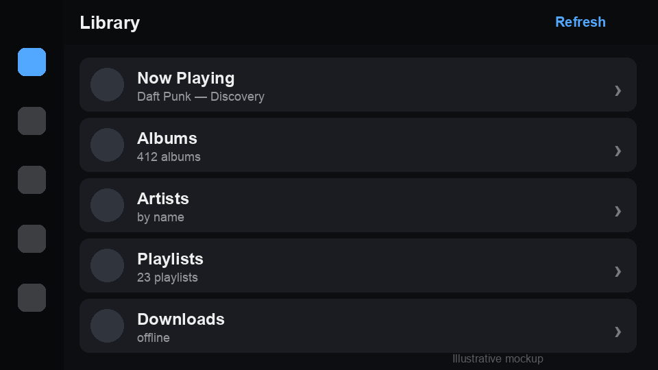
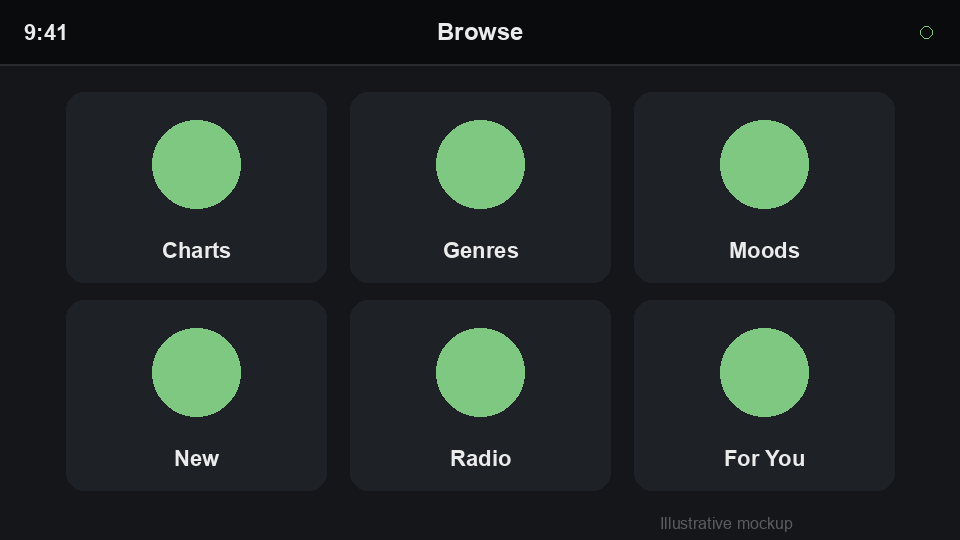
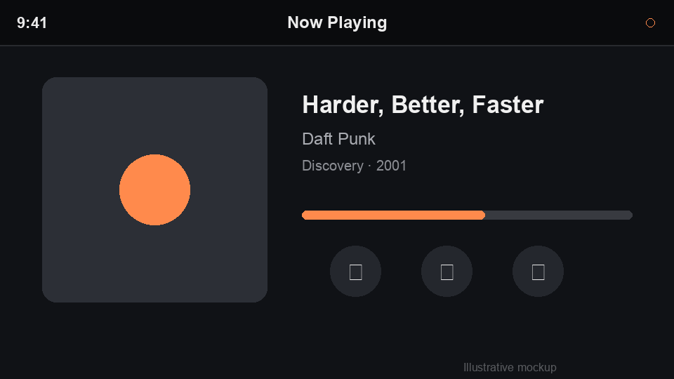

== In-Car Experiences (CarPlay & Android Auto)

Codename One can project a driver-safe UI onto Apple CarPlay and Google Android Auto from a single portable API under the `com.codename1.car` package. You describe the screens once with a small set of cross-platform templates; Codename One renders them as native `CPTemplate`s on CarPlay and `androidx.car.app` templates on Android Auto.

[NOTE]
====
CarPlay and Android Auto are *template-based* UI systems. Unlike the phone, tablet, or even Apple TV/Android TV (which reuse the normal Codename One renderer), the car platforms do **not** let an app draw arbitrary pixels or show a regular Codename One `Form`. To minimise driver distraction the system only renders a fixed catalogue of templates -- lists, grids, info panes, messages, navigation and now-playing -- and grants access per *app category* (audio, communication, navigation, point-of-interest, and so on). The `com.codename1.car` API maps the common in-car use cases onto that catalogue. "Seamless" here means seamless integration, lifecycle and build wiring -- not running your existing phone UI on the dashboard.
====

This API is *zero cost when unused*: simply referencing `com.codename1.car` is what tells the build to wire the native plumbing (the CarPlay scene + entitlement on iOS, the `androidx.car.app` dependency + `CarAppService` on Android). Apps that never touch the package get none of it.

=== Quick start

Register a single `CarApplication` from your app's `init()` -- before a head unit connects -- and return a root `CarScreen` that builds a template:

[source,java]
----
import com.codename1.car.*;

public class MyApp {
    public void init(Object context) {
        // ... normal app init ...
        Car.setApplication(new MyCarApplication());
    }
}

class MyCarApplication extends CarApplication {
    public CarScreen onCreateRootScreen(CarContext context) {
        return new LibraryScreen();
    }
}

class LibraryScreen extends CarScreen {
    protected CarTemplate onCreateTemplate() {
        return new CarListTemplate().setTitle("Library")
            .addRow(new CarRow("Now Playing").setText("Daft Punk — Discovery")
                .setOnAction(ctx -> play()))
            .addRow(new CarRow("Albums").setBrowsable(true)
                .setOnAction(ctx -> ctx.pushScreen(new AlbumsScreen())))
            .addRow(new CarRow("Playlists").setBrowsable(true)
                .setOnAction(ctx -> ctx.pushScreen(new PlaylistsScreen())));
    }
}
----

That single description renders natively on both platforms:

On the simulator and on any port without in-car projection there is no head unit, so the whole API is an inert no-op and `CN.isCarConnected()` returns `false` -- your code never needs platform `if` statements.

=== Templates

A `CarScreen` returns exactly one `CarTemplate`. The catalogue mirrors what the head units allow:

[options="header"]
|===
| Template | Use for | CarPlay | Android Auto
| `CarListTemplate`      | Sectioned scrolling list of rows (browse, settings)   | `CPListTemplate`        | `ListTemplate`
| `CarGridTemplate`      | Image-forward grid (categories, presets, artwork)     | `CPGridTemplate`        | `GridTemplate`
| `CarPaneTemplate`      | Detail pane: label/value rows + up to two actions     | `CPInformationTemplate` | `PaneTemplate`
| `CarMessageTemplate`   | Short message + actions (errors, prompts, messaging)  | `CPInformationTemplate` | `MessageTemplate`
| `CarNavigationTemplate`| Turn-by-turn surface with a drawable map              | `CPMapTemplate`         | `NavigationTemplate`
| `CarNowPlayingTemplate`| System now-playing surface for audio apps             | `CPNowPlayingTemplate`  | media now-playing
|===

Rows (`CarRow`), grid items (`CarGridItem`) and actions (`CarAction`) carry a title, optional secondary text, an optional `com.codename1.ui.Image` icon and a `CarActionListener` invoked on the EDT when the element is selected. Mark a row `setBrowsable(true)` when selecting it drills into a deeper screen.

Head units enforce a hard cap on the number of rows/items they display (driver-distraction rules). Query it and trim accordingly:

[source,java]
----
int max = context.getListRowLimit(); // 0 when unknown
----

=== Screen stack & lifecycle

`CarContext` manages a back stack, mirroring `androidx.car.app`'s `ScreenManager` and CarPlay's `CPInterfaceController`:

[source,java]
----
context.pushScreen(new DetailScreen());  // drill in
context.popScreen();                     // back
screen.invalidate();                     // rebuild this screen's template after a model change
context.showToast("Added to queue");
----

`CarScreen` exposes optional lifecycle hooks -- `onCreate()`, `onResume()`, `onPause()`, `onDestroy()` -- and `CarApplication` is notified of connection changes via `onCarConnected(CarContext)` / `onCarDisconnected()`. You can also observe connection globally:

[source,java]
----
Car.addConnectionListener(new CarConnectionListener() {
    public void carConnected(CarContext ctx) { startLocationStream(); }
    public void carDisconnected()           { stopLocationStream(); }
});
----

=== Now-playing (audio apps)

For audio apps the track metadata, artwork, scrubber and transport controls are driven by the platform media session (the Android background audio service / `MPNowPlayingInfoCenter` on iOS), so `CarNowPlayingTemplate` carries no metadata of its own -- it routes the head unit to the now-playing surface and lets you add a couple of app-specific buttons (shuffle, like).

=== Build configuration

Native wiring is added automatically when your bytecode references `com.codename1.car`. Apple grants CarPlay entitlements -- and Android Auto surfaces categories -- *per app category*, so declare the categories you ship with these build hints:

[options="header"]
|===
| Category | iOS hint | Android hint | Notes
| Audio          | `ios.carplay.audio=true`      | (media browser service) | Default CarPlay entitlement when none specified
| Communication  | `ios.carplay.messaging=true`  | `android.androidAuto.messaging=true` | Read-aloud / voice reply
| Navigation     | `ios.carplay.navigation=true` | `android.androidAuto.navigation=true` | Adds the drawable map surface + `MAP_TEMPLATES` permission
| Point of interest | `ios.carplay.poi=true`     | `android.androidAuto.poi=true` (default) | Browse/POI list apps
|===

Optional: `android.carAppVersion` pins the `androidx.car.app` version; `android.androidAuto.minCarApiLevel` sets the minimum car API level.

[IMPORTANT]
====
CarPlay and the restricted Android Auto categories require approval from Apple/Google before they will run outside the simulator/Desktop Head Unit. The build wiring is automatic, but shipping to real cars still needs the relevant CarPlay entitlement on your Apple App ID (request it at developer.apple.com) and acceptance into the Android Auto programme.
====

=== Testing

* *iOS*: run the app in the iOS Simulator, then *I/O > External Displays > CarPlay* to open the CarPlay window.
* *Android*: install the *Desktop Head Unit (DHU)* from the Android SDK and connect a device/emulator running Android Auto.

A complete runnable example lives in `Samples/samples/CarSample`.

=== Limitations

* The navigation map *surface* (`CarSurfaceCallback`) is scaffolded; live map blitting onto the head-unit surface is a work in progress -- the navigation template's controls, header and ETA strip are wired.
* Android Auto media browsing is driven by the standard media session; `CarNowPlayingTemplate` routes to it.
* You cannot show arbitrary Codename One `Form`s on the head unit -- use the template catalogue above.
