== Introduction

Codename One is a Write Once Run Anywhere mobile development platform for Java/Kotlin developers. It fits naturally into modern Maven-capable IDEs such as IntelliJ IDEA, NetBeans, VS Code, and Eclipse, and you can also drive it entirely from the command line.

Codename One's mission statement is:

[quote]
____
Unify the complex and fragmented task of mobile device programming into a single set of tools, APIs and services. As a result create a more manageable approach to mobile application development without sacrificing the power/control given to developers.
____

This brings that old "Write Once Run Anywhere" (WORA) Java mantra to mobile devices without dumbing it down to the lowest common denominator.

The things that make Codename One stand out from other tools in this field are:

* Write Once Run Anywhere support with no special hardware requirements and 100% code reuse (((Reuse)))
* Compiles Java/Kotlin into native code for iOS, Android and even JavaScript/PWA
* Open Source and Free with commercial backing/support
* Easy to use with 100% portable Drag and Drop GUI builder
* Full access to underlying native OS capabilities using the native OS programming language (for example: Objective-C) without compromising portability
* Provides full control over every pixel on the screen
* Lets you use native widgets (views) and mix them with Codename One components within the same hierarchy (heavyweight/lightweight mixing) (((Widgets)))
* Supports seamless Continuous Integration out of the box

Codename One can trace its roots to the open source LWUIT project started at Sun Microsystem in 2007 by Chen Fishbein (co-founder of Codename One). It has been under constant development for over a decade.

=== Build Cloud

The build cloud approach to mobile development is one of the things that makes Codename One stand out. iOS native development requires a Mac with Xcode. Windows native development requires a Windows machine. To make matters worse, Apple, Google, and Microsoft change their tools regularly.

That makes it hard to keep up.

When you develop an app in Codename One, use the built-in simulator for running and debugging. When you want to build a native app, use the build cloud, where Macs build the native iOS apps and Windows machines build the native Windows apps. This works seamlessly and makes Codename One apps native because the native platform compiles them. For example, iOS builds use Macs running Xcode, the native Apple tool, to build the app.

IMPORTANT: Codename One doesn't send source code to the build cloud, compiled bytecode!

==== Why Build Servers?

The build servers let you build native iOS apps without a Mac and native Windows apps without a Windows machine. They remove the need to install and update complex toolchains and simplify the process of building a native app to a right click.

Even though the build servers streamline delivery, Codename One also supports fully local builds. You can install the toolchain on your own hardware and follow the workflows in <<maven-project-workflow>> and <<working-with-codename-one-sources>> to compile, package, and test apps without leaving your desktop environment.

For example, because native iOS applications require a Mac with a recent version of Xcode, Codename One maintains such machines in the cloud. When developers send an iOS build, that Mac generates C source code using https://github.com/codenameone/CodenameOne/tree/master/vm[ParparVM], then compiles the C source code using Xcode and signs the resulting binary using Xcode. You can install the binary on your device or build a distribution binary for the App Store. Since C code is generated, your app is also future-proof against changes from Apple. You can also inject Objective-C native code into the app while keeping it 100% portable thanks to Codename One's native interfaces capability.

Subscribers can receive the C source code back using the include-sources feature of Codename One and use those sources for benchmarking and debugging on devices.

The same is true for most other platforms. On Android and Java SE, Codename One runs the standard Java code, mostly unchanged.

.Java Language Level Support
****
Historically, Java 8 syntax was supported through https://github.com/orfjackal/retrolambda[Retrolambda] on the Codename One servers. It translated bytecode to Java 5 syntax using a server-based processor built on Retroweaver and custom code. This architecture was transparent to developers because the build servers abstract most of the painful differences between devices.

Today Codename One supports Java 25 level bytecode in https://github.com/codenameone/CodenameOne/tree/master/vm[ParparVM] and Android supports Java 17 level bytecode natively. This lets Codename One support Java 17 seamlessly, and newer versions enable Java 25 level support through client side bytecode mutation.
****

==== How does Codename One Work?

Codename One uses a SaaS-based approach so the information in this appendix might (and probably will) change in the future to accommodate improved architectures. This appendix includes this information for reference, you don't need to understand this in order to follow the content of the book...

Since Android is already based on Java, Codename One is already native to Android and works with the Android VM (ART/Dalvik).

On iOS, Codename One built and open-sourced ParparVM, which is a conservative VM. ParparVM features a concurrent, non-blocking GC and is written entirely in Java/C. ParparVM is a transpiler that generates C source code matching the given Java bytecode. This means that an Xcode project is generated and compiled on the build servers. It's as if you hand-coded a native app and is thus future-proof against changes that Apple introduces. For example, Apple migrated to 64-bit and later introduced bitcode support to iOS. ParparVM needed no modifications to comply with those changes.

NOTE: Codename One translates the bytecode to C, which is faster than Swift/Objective-C. The port code that invokes iOS API's is hand coded in Objective-C

Codename One previously offered a UWP (Universal Windows Platform) target based on iKVM. That target was discontinued in release 7.0.229 and is preserved as historical context in older documentation and blog posts.

JavaScript build targets use TeaVM to do the translation statically. TeaVM supports threading using JavaScript by breaking the app down in a rather elaborate way. To support the complex UI Codename One uses the HTML5 Canvas API which allows absolute flexibility for building applications.

For desktop builds Codename One uses `javapackager`, since both Macs and Windows machines are available in the cloud, the platform-specific nature of `javapackager` isn't a problem.

===== Lightweight Architecture

What makes Codename One stand out is the approach it takes to UI: "`lightweight architecture`".

Lightweight architecture is the "`not so secrete sauce`" to Codename One's portability. Essentially it means all the components/widgets in Codename One are written in Java. Thus their behavior is consistent across all platforms and they are fully customizable from the developer code as they don't rely on OS internal semantics. This allows developers to preview the application accurately in the simulators and GUI builders.

One of the big accomplishments in Codename One is its unique ability to embed "`heavyweight`" widgets into place among the "`lightweights`". This is crucial for apps such as Uber where the cars and widgets on top are implemented as Codename One components yet below them you've the native map component.

Codename One achieves fast performance by drawing using the native gaming API's of most platforms for example: OpenGL ES on iOS. The core technologies behind Codename One are all open source including most of the stuff developed by Codename One itself, for example: ParparVM but also the full library, platform ports, designer tool, device skins etc.

.Lightweight Architecture Origin
****
Lightweight components date back to Smalltalk frameworks, this notion was popularized in the Java world by Swing. Swing was the main source of inspiration to Codename One's predecessor LWUIT. Many frameworks took this approach over the years including JavaFX and most recently Ionic in the JavaScript world.
****

===== Why ParparVM

On iOS, Codename One uses https://github.com/codenameone/CodenameOne/tree/master/vm[ParparVM] which translates Java bytecode to C code and boasts a non-blocking GC as well as 64 bit/bitcode support. This VM is fully open source in the https://github.com/codenameone/CodenameOne/[Codename One git repository]. In the past Codename One used http://www.xmlvm.org/[XMLVM] to generate native code similarly, but the XMLVM solution was too generic for the needs of Codename One. https://github.com/codenameone/CodenameOne/tree/master/vm[ParparVM] boasts a unique architecture of translating code to C (similarly to XMLVM), because of that Codename One is the only solution of its kind that can **guarantee** future iOS compatibility since the officially supported iOS toolchain is always used instead of undocumented behaviors.

NOTE: XMLVM could guarantee that as well, but it's no longer maintained and lacked the API layer support

The key advantages of ParparVM over other approaches are:

- *Truly Native* -- since code is translated to C rather than directly to ARM or LLVM code, the app is "more native". It uses the official tools and approaches from Apple and can benefit from their advancements. For example: bitcode changes or profiling toolchain.

- *Smaller Class Library* -- ParparVM includes a small segment of the full JavaAPI's resulting in final binaries that are smaller than the alternatives by orders of magnitude. This maps directly to performance and memory overhead.

- *Simple and Extensible* -- to work with ParparVM you need a basic understanding of C. Unlike other tools that require deep understanding of ARM assembly and LLVM bitcode. This is crucial for the fast-moving world of mobile development, as Apple changes things left and right, you need a more agile VM.

===== Historical Windows Ports

Codename One experimented with many Windows ports over the years, including the legacy Windows Phone target and a later UWP (Universal Windows Platform) target based on iKVM.

NOTE: The UWP target was discontinued in release 7.0.229 and is no longer part of the supported build targets. Older references to it in historical material are retained for archival context.

===== JavaScript Port

The JavaScript port of Codename One is based on the work of the http://teavm.org:[TeaVM project]. The team behind TeaVM effectively built a JVM that translates Java bytecode into JavaScript source code while maintaining threading semantics with an imaginative approach.

The JavaScript port allows unmodified Codename One applications to run within a desktop or mobile browser. The port itself is based on the HTML5 Canvas API, which provides a pixel-perfect implementation of the Codename One API.

NOTE: The JavaScript port is available for Enterprise grade subscribers of Codename One

===== Desktop and Android

The other ports of Codename One use the VMs available on the host machines and environments to execute the runtime. Historically, https://github.com/orfjackal/retrolambda[Retrolambda] was used to provide Java 8 language features portably.

The Android port uses the native Android tools, including the Gradle build environment, in the latest versions.

The desktop port creates a standard Java SE application, which is packaged with the JRE and an installer.

NOTE: The Desktop port is available to pro grade subscribers of Codename One

=== History

.LWUIT App Screenshot circa 2007
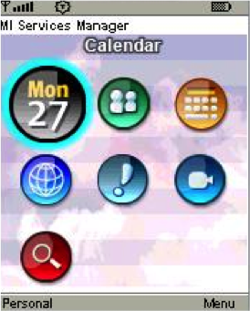

Codename One was started by Chen Fishbein and Shai Almog who authored the Open Source LWUIT project at Sun Microsystems (circa 2007). The LWUIT project aimed to solve the fragmentation within J2ME/Blackberry devices by creating a higher standard of user interface than the common baseline at the time. LWUIT received critical acclaim and traction within many industries but was limited by the declining feature phone market. It was forked by many companies including Nokia. It was used as the base standard for DTV in Brazil. Another fork has brought a LWUIT into high end cars from Toyota and other companies. This fork later adapted Codename One as well.

In 2012 Shai and Chen formed Codename One as they left Oracle. The project has taken many of the basic concepts developed within the LWUIT project and adapted them to the smartphone world which is still experiencing similar issues to the device fragmentation of the old J2ME phones.

=== Core Concepts of Mobile Programming

Before you proceed, I would like to explain some universal core concepts of mobile programming that might not be intuitive. These are universal concepts that apply to mobile programming regardless of the tools you're using.

You can skip this section if you feel you're familiar enough with the core problems/issues in mobile app development.

==== Density

Density is also known as DPI (Dots Per Inch) or PPI (pixels or points per inch). Density is confusing, unintuitive and might collide with common sense. For example, an iPhone 7 plus has a resolution of `1080x1920` pixels and a PPI of `401` for a 5-inch screen. On the other hand, an iPad 4 has `1536x2048` pixels with a PPI of `264` on a `9.7` inch screen... Smaller devices can have higher resolutions!

As the following figure shows, if a Pixel 2 XL had pixels the size of an iPad, it would have been twice the size of that iPad. While in reality, it's nearly half the height of the iPad!

.Device Density vs. Resolution
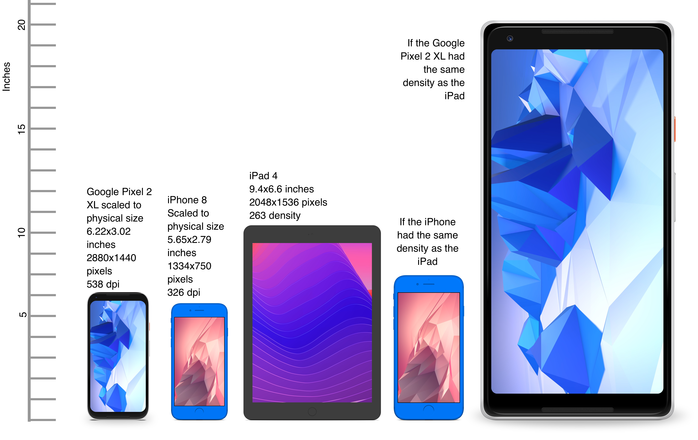

Differences in density can be extreme. A second generation iPad has 132 PPI, where modern phones have PPI that is over 600 dpi.

Low resolution images on high PPI devices will look either small or pixelated. High resolution images on low PPI devices will look huge, overscaled (artifacts) and will consume too much memory.

.How the Same Image Looks in Different Devices
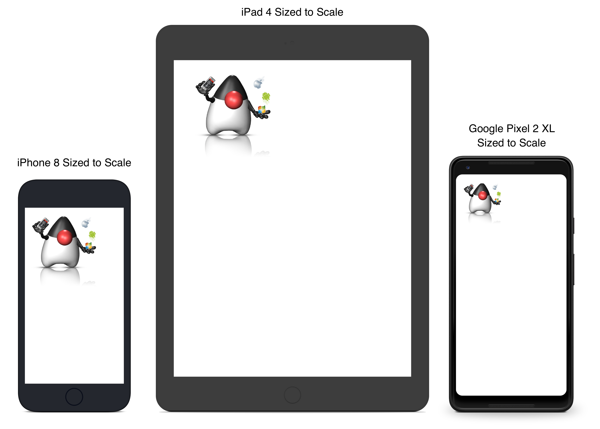

The exact same image will look different on each device, sometimes to a comical effect. One of the solutions for this problem is multi-images. All OS’s support the ability to define different images for various densities. I will discuss multi-images later in Chapter 2.

This also highlights the need for working with measurements other than pixels. Codename One supports millimeters (or dips) as a unit of measurement. This is highly convenient and is a better representation of size when dealing with mobile devices.

But there is a bigger conceptual issue involved. You need to build a UI that adapts to the wide differences in form factors. You might have fewer pixels on an iPad, but because of its physical size, you would expect the app to cram more information into that space so the app won't feel like a blown-up phone application. There are many strategies to address that, but one of the first steps is in the layout managers. (((Layouts, Layout)))

I will discuss the layout managers in depth in Chapter 2, but the core concept is that they decide where a UI element is placed based on generic logic. That way, the user interface can adapt automatically to the huge variance in display size and density.

==== Touch Interface

The fact that mobile devices use a touch interface today isn't news... But the implications of that aren't immediately obvious to some developers.

UI elements need to be finger sized and heavily spaced. Otherwise, you risk the "`fat finger`" effect. That means spacing should be in millimeters and not in pixels due to device density.

Scrolling poses another challenge in touch-based interfaces. In desktop applications, it's common to nest scrollable items. For example, in touch interfaces, the scrolling gesture doesn't allow such a nuance. Furthermore, scrolling on both the horizontal and vertical axis (side scrolling) can be inconvenient in touch-based interfaces.

==== Device Fragmentation

Some developers single out this wide range of resolutions and densities as "`device fragmentation`". While it does contribute to development complexity, for the most part, it isn't a challenging problem to overcome.

Densities aren't the cause of device fragmentation. Device fragmentation is caused by many OS versions with different behaviors. This is clear on Android and for the most part relates to the slow rollout of Android vendor versions compared to Google rollout. For example, 7 months after the Android 8 (Oreo) release in 2018, it was still available on 1.1% of the devices. The damning statistic is that 12% of the devices in mid 2018 run Android 4.4 Kitkat released in 2013! (((Google)))

This makes QA difficult as the disparity between these versions is pretty big. These numbers will be out of date by the time you read this, but the core problem remains. It's hard to get all device manufacturers on the same page, so this problem will probably remain in the foreseeable future despite everything.

==== Performance

Besides the obvious need for performance and smooth animation within a mobile app, there are a couple of performance related issues that might not be intuitive to new developers: size and power.

===== App Size

Apps are installed and managed through stores. This poses some restrictions about what an app can do. But it also creates a huge opportunity. Stores manage automatic update and to some degree the marketing/monetization of the app.

A good mobile app is updated once a month and sometimes even once a week. Since the app downloads automatically from the store, this can be a huge benefit:

* Existing users are reminded of the app and get new features instantly
* New users notice the app featured on a "`what's new`" list

If an app is big, it might not update over a cellular network connection. Google and Apple have restrictions on automatic updates over cellular networks to preserve battery life and data plans. A large app might negatively impact users perception of the app and trigger uninstalls for example, when a phone is low on available space.

===== Power Drain

Desktop developers rarely think about power usage within their apps. In mobile development, this is a crucial concept. Modern device OS's have tools that highlight misbehaving applications, and this can lead to bad reviews.

Code that loops forever while waiting for input will block the CPU from sleeping and slowly drain the battery.

Worse. Mobile OS's kill applications that drain the battery. If the app is draining the battery and is minimized, (for example, during an incoming call) the app could be killed. This will impact app performance and usability.

==== Sandbox and Permissions

Apps installed on the device are "sandboxed" to a specific area so they won’t harm the device or its functionality. The filesystem of mobile applications is restricted so one application can’t access the files of another application. Things that most developers take for granted on the desktop such as a "file picker" or accessing the image folder don’t work on devices!

This means that when your application works on a file, it belongs to your application. To share the file with a different application, you need to ask the operating system to do that for you.

Furthermore, some features require a "permission" prompt and in some cases require special flags in system files. Apps need to request permission to use sensitive capabilities, for example, Camera, Contacts etc. +
 Historically, Android developers declared required permissions for an app and the user was prompted with permissions during installation. Android 6 adopted the approach used by iOS of prompting the user for permission when accessing a feature.

This means that in runtime a user might revoke a permission. A good example in the case of an Uber app is the location permission. If a user revokes that permission, the app might lose its location.

=== Installing Codename One

IMPORTANT: Codename One requires either JDK 11 or JDK 8. Other JDK versions aren't supported at this time.

Codename One projects are built with Maven. Typical Maven targets such as `package`, `clean` and `install` work out of the box, but the Codename One integrations that ship with each IDE provide dedicated Run and Build actions for a smoother workflow.

To create a new Codename One project visit https://start.codenameone.com/ and generate a starter project, or run the Codename One Application Project Archetype (`cn1app-archetype`) directly on the command line:

[source,bash]
----
mvn archetype:generate \
  -DarchetypeGroupId=com.codenameone \
  -DarchetypeArtifactId=cn1app-archetype \
  -DarchetypeVersion=LATEST \
  -DgroupId=YOUR_GROUP_ID \
  -DartifactId=YOUR_ARTIFACT_ID \
  -Dversion=1.0-SNAPSHOT \
  -DmainName=YOUR_MAIN_NAME \
  -DinteractiveMode=false
----

This command generates a project in the current directory. The folder name matches the `artifactId` value. For example, specifying `-DartifactId=myapp` produces a project inside a new `myapp` directory.

Import the generated Maven project into your preferred IDE and use the Codename One Run in Simulator task from the IDE toolbar or Run/Debug buttons:

* *IntelliJ IDEA* – use *File > Open* on the project directory, then choose the Codename One Run in Simulator action from the toolbar or standard Run/Debug controls.
* *NetBeans* – use *File > Open Project*, select the generated Maven project, and rely on the Codename One toolbar actions to run and debug the simulator.
* *VS Code* – install the Java and Codename One extensions, open the folder, and trigger the Run in Simulator task from the command palette or the Run/Debug buttons.
* *Eclipse* – use *File > Import > Existing Maven Projects*, then use the Codename One launch shortcuts provided by the plugin for simulator and build tasks.
* *Command line* – invoke Maven goals directly whenever you need to integrate with CI/CD pipelines or scripting.

For deeper coverage of the Maven goals, project structure, and automation tasks, continue with <<maven-project-workflow>>.

NOTE: Arbitrary Maven dependencies probably won't work for Codename One. Many dependencies assume a full JDK which Codename One can't provide and they often assume functionality that might not be available for example: reflection, Spring, etc.

.Legacy onboarding resources
****
Legacy Ant-based project instructions remain available for teams maintaining older codebases. New projects should follow the Maven workflows described in this guide.
****

==== Important Notes for New Projects

Before you get to the code there are few important things you need to understand about Codename One applications.

* *App Name* - This is the name of the app and the main class, it's important to get this right as it's hard to change this value later
* *Package Name* - it's *crucial* you get this value right. Besides the difficulty of changing this after the fact, once an app is submitted to iTunes/Google Play with a specific package name this can't be changed! See the sidebar "Picking a Package Name".
* *Theme* - There are various types of built-in themes in Codename One, for simplicity recommend `Native` as it's a clean slate starting point

.Picking a Package Name
****
Apple, Google and Microsoft identify applications based on their package names. If you use a domain that you don't own it's possible that someone else will use that domain and collide with you. In fact some developers left the default `com.mycompany` domain in place all the way into production in some cases.

This can cause difficulties when submitting to Apple, Google or Microsoft. Submitting to one of them is no guarantee of success when submitting to another.

To come up with the right package name use a reverse domain notation. So if my website is `goodstuff.co.uk` my package name should start with `uk.co.goodstuff`. I highly recommend the following guidelines for package names:

* *Lower Case* - some OS's are case sensitive and handling a mistake in case is painful. The Java convention is lower case and I would recommend sticking to that although it isn't a requirement

* *Avoid Dash and Underscore* - You can't use a dash character (`-`) for a package name in Java. Underscore (`_`) doesn't work for iOS. If you want more than one word just use a deeper package e.g.: `com.mydomain.deeper.meaningful.name`

* *Obey Java Rules* - A package name can't start with a number so you can't use `com.mydomain.1sler`. You should avoid using Java keywords like `this`, `if` etc.

* *Avoid Top Level* - instead of using `uk.co.goodstuff` use `uk.co.goodstuff.myapp`. That would allow you to have more than one app on a domain
****

==== Runtime

Once Maven is set up you can run the `HelloWorld` application by selecting the Codename One Run in Simulator task from the IDE run menu. The Codename One simulator launches and you can use its menus to control and inspect details related to the device. You can rotate it, determine its location in the world, monitor networking calls etc.

With the `Skins` menu you can download device skins to see how your app will look on different devices.

TIP: Some skins are bigger than the screen size, uncheck the `Scrollable` flag in the `Simulator` menu to handle them more effectively

Use your IDE's Debug button with the Run in Simulator task to launch the simulator under the debugger.

.Simulator vs. Emulator
****
Codename One ships with a simulator similarly to the iOS toolchain which also has a simulator. Android ships with an emulator. Emulators go the extra mile. They create a virtual machine that's compatible with the device CPU and then boot the full mobile OS within that environment. This provides an accurate runtime environment but is **painfully slow**.

Simulators rely on the fact that OS's are similar and so they leave the low-level details in place and just map the API behavior. Since Codename One relies on Java it can start simulating on top of the virtual machine on the desktop. That provides several advantages including fast development cycles and full support for all the development tools/debuggers you can use on the desktop.

Emulators make sense for developers who want to build OS level services e.g. screensavers or low-level services. Standard applications are better served by simulators.
****

==== The Source Code Of The Hello World App

After clicking finish in the new project wizard you've a `HelloWorld` project with a few default settings. I will break the class down to small pieces and explain each piece starting with the enclosing class:

[source,java,title='HelloWorld Class']
----
public class HelloWorld { // <1>
    private Form current; // <2>
    private Resources theme; // <3>

    // ... class methods ...
}
----

<1> This is the main class, it's the entry point to the app, notice it doesn't have a `main` method but rather callback which you will discuss soon

<2> Forms are the "`top level`" UI element in Codename One. Only one `Form` is shown at a time and everything you see on the screen is a child of that `Form`

<3> Every app has a theme, it determines how everything within the application looks for example: colors, fonts etc.

Next let's discuss the first lifecycle method `init(Object)`. I discuss the lifecycle in depth in the <<ApplicationLifecycle,Application Lifecycle Sidebar>>.

[source,java,title='HelloWorld init(Object)']
----
public void init(Object context) { // <1>
    updateNetworkThreadCount(2); // <2>
    theme = UIManager.initFirstTheme("/theme"); // <3>
    Toolbar.setGlobalToolbar(true); // <4>
    Log.bindCrashProtection(true); // <5>
    addNetworkErrorListener(err -> { // <6>
        err.consume(); // <7>
        if(err.getError() != null) { // <8>
            Log.e(err.getError());
        }
        Log.sendLogAsync(); // <9>
        Dialog.show("Connection Error", // <10>
            "There was a networking error in the connection to " +
            err.getConnectionRequest().getUrl(), "OK", null);
    });
}
----

<1> `init` is the first of the four lifecycle methods. it's responsible for initialization of variables and values

<2> By default Codename One has one thread that performs all the networking, you set the default to two which provides better performance

<3> The theme determines the appearance of the application. You will discuss this in the next chapter

<4> This enables the `Toolbar` API by default, it allows finer control over the title bar area

<5> Crash protection automatically sends device crash logs through the cloud

<6> In case of a network error the code in this block would run, you can customize it to handle networking errors effectively

<7> `consume()` swallows the event so it doesn't trigger other alerts, it generally means "`you got this`"

<8> Not all errors include an exception, if you've an exception you can log it with this code

<9> This will email the log from the device to you if you've a pro subscription

<10> This shows an error dialog to the user, in production you might want to remove that code

`init(Object)` works as a constructor to some degree. Recommend avoiding the constructor for the main class and placing logic in the init method instead. This isn't crucial but recommend it since the constructor might happen too early in the application lifecycle.

In a cold start `init(Object)` is invoked followed by the `start()` method. For example, `start()` can be invoked more than once if an app is minimized and restored, see the sidebar <<ApplicationLifecycle,Application Lifecycle>>:

[source,java,title='HelloWorld start()']
----
public void start() {
    if(current != null){ // <1>
        current.show(); // <2>
        return;
    }
    Form hi = new Form("Hi World", BoxLayout.y()); // <3>
    hi.add(new Label("Hi World")); // <4>
    hi.show(); // <5>
}
----

<1> If the app was minimized you usually don't want to do much, show the last `Form` of the application

<2> `current` is a `Form` which is the top most visual element. You can have one `Form` showing and you enforce that by using the `show()` method

<3> You create a new simple `Form` instance. It has the title "`Hello World`" and arranges elements vertically (on the Y axis)

<4> You add another `Label` below the title, see figure <<TitleAndLabelImage>>. You will discuss component hierarchy later

<5> The `show()` method places the `Form` on the screen. Only one `Form` can be shown at a time

.Title and Label in the UI
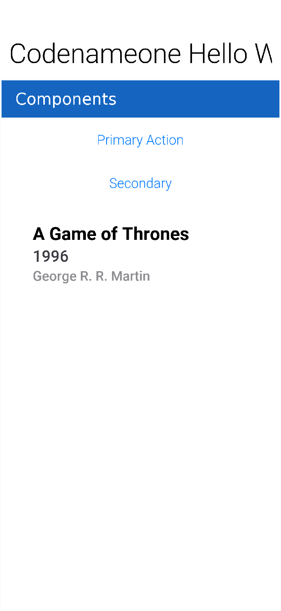

There are some complex ideas within this short snippet which I will address later in this chapter when talking about layout. The gist of it's that you create and show a `Form`. `Form` is the top level UI element, it takes over the whole screen. You can add UI elements to that `Form` object, in this case the `Label`. You use the `BoxLayout` to arrange the elements within the `Form` from top to the bottom vertically.

.Application Lifecycle
****
A few years ago Romain Guy (a senior Google Android engineer) was on stage at the Google IO conference. He asked for a show of hands of people who understand the `Activity` lifecycle (`Activity` is similar to a Codename One main class). He then proceeded to jokingly call the audience members who lifted their hands "`liars`" claiming that after all his years in Google he still doesn't understand it...

Lifecycle seems simple on the surface but hides a lot of nuance. Android's lifecycle is ridiculously complex. Codename One tries to simplify this and also make it portable. Sometimes complexity leaks out and the nuances can be difficult to deal with.

Simply explained an application has three states:

* *Foreground* - it's running and in the foreground which means the user can physically interact with the app
* *Suspended* - the app isn't in the foreground, it's either paused or has a background process running
* *Not Running* - the app was never launched, was killed or crashed

The lifecycle is the process of transitioning between these 3 states and the callbacks invoked when such a transition occurs. The first time we launch the app we start from a "`Cold Start`" (Not Running State) but on subsequent launches the app is usually started from the "Warm Start" (Suspended State).

.Codename One Application Lifecycle
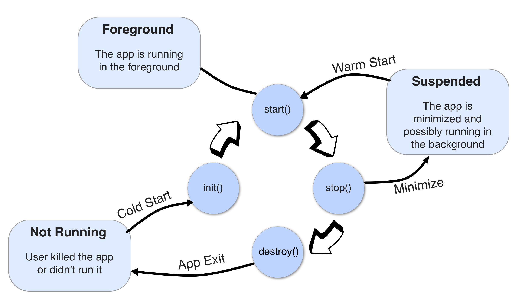

Codename One has four standard callback methods in the lifecycle API:

* `init(Object)` - is invoked when the app is first launched from a _Not Running_ state.
* `start()` - is invoked for two separate cases. After `start()` is finished the app transitions to the _Foreground_ state.
** Following `init(Object)` in case of a cold start. Cold start refers to starting the app from a _Not Running_ state.
** When the app is restored from _Suspended_ state. In this case `init(Object)` isn't invoked
* `stop()` - is invoked when the app is minimized e.g. when switching to a different app. After `stop()` is finished the app transitions to the _Suspended_ state.
* `destroy()` - is invoked when the app is destroyed e.g. killed by a user in the task manager. After `destroy()` is finished the app is no longer running hence it's in the _Not Running_ state.

IMPORTANT: `destroy()` is optional there is no guarantee that it will be invoked. It should be used only as a last resort
****

Now that you've a general sense of the lifecycle lets look at the last two lifecycle methods:

[source,java,title='HelloWorld stop() and destroy()']
----
public void stop() { // <1>
    current = getCurrentForm(); // <2>
    if(current instanceof Dialog) { // <3>
        ((Dialog)current).dispose();
        current = getCurrentForm();
    }
}

public void destroy() { // <4>
}
----

<1> `stop()` is invoked when the app is minimized or a different app is opened

<2> As the app is stopped you save the current `Form` so you can restore it back in `start()` if the app is restored

<3> `Dialog` is a bit of a special case restoring a `Dialog` might block the proper flow of application execution so you dispose them and then get the parent `Form`

<4> `destroy()` is a special case. Under normal circumstances you shouldn't write code in `destroy()`. `stop()` should work for most cases

that's it. Hopefully you've a general sense of the code. it's time to run on the device.

==== Building and Deploying On Devices

.Codename One Control Center
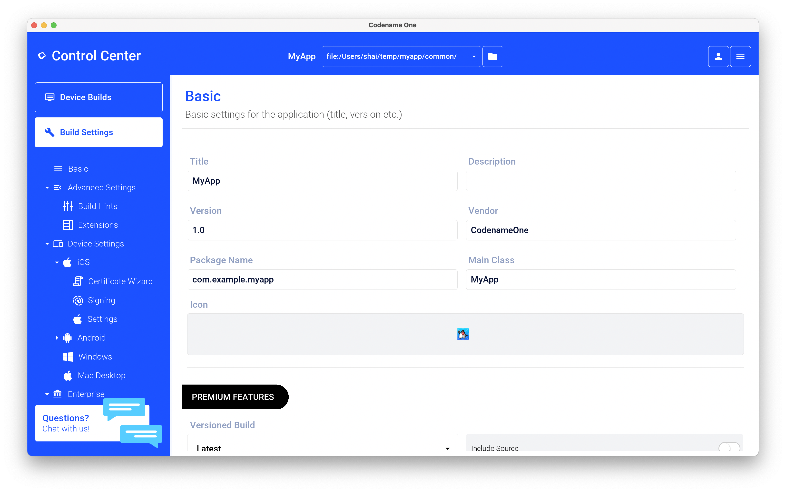

You can use the Control Center to configure almost anything. Specifically, the application title, application version, application icon etc. are all found in the Codename One Settings maven target.

There are many options within this UI that control almost every aspect of the application from signing to basic settings.

Your device builds using the Codename One Cloud can also be found right here as well as subscription information.

.Device Builds in Logged out State
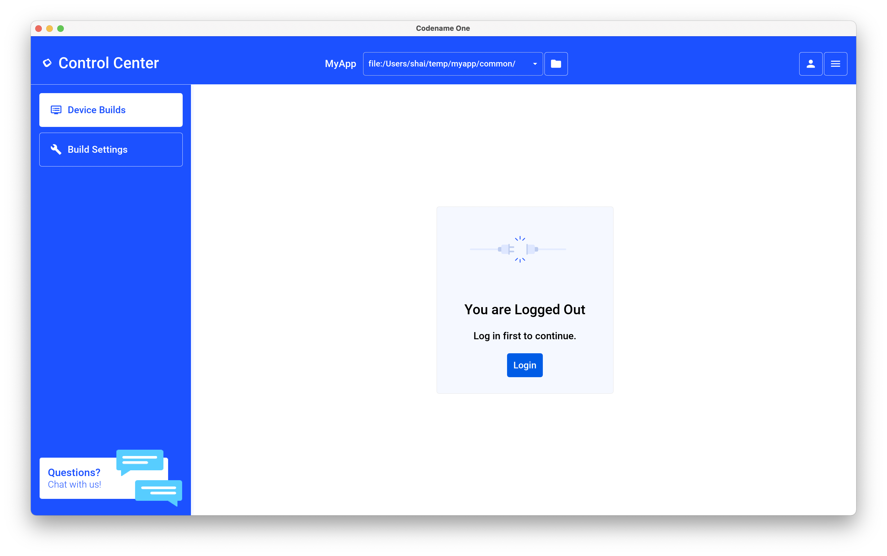

===== Signing/Certificates

All of the modern mobile platforms require signed applications but they all take radically different approaches when implementing it.

Signing is a process that marks your final application for the device with a special value. This value (signature) is a value that you can generate based on the content of the application and your certificate. Effectively it guarantees the app came from you. This blocks a 3rd party from signing their apps and posing as you to the App Store or to the user. it's a crucial security layer.

A certificate is the tool you use for signing. Think of it as a mathematical rubber stamp that generates a different value each time. Unlike a rubber stamp a signature can't be forged!

====== Signing on Android

.Backup your Android certificate and save its password!
WARNING: If you lose your Android certificate you won't be able to update your app

Android uses a self signed certificate approach. You can generate a certificate by describing who you're and picking a password!

Anyone can do that. For example, once a certificate is published it can't be replaced...

If this was not the case someone else could potentially push an "`upgrade`" to your app. Once an app is submitted with a certificate to Google Play this app can't be updated with any other certificate.

With that in mind generating an Android certificate is trivial.

NOTE: The following chart illustrates a process that's identical on all IDE's

.Process of Certificate Generation for Android
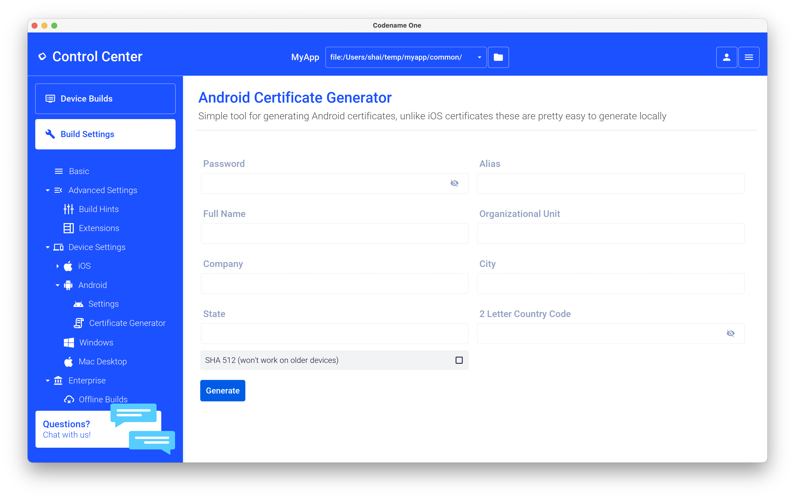

.Your certificate will generate into the file `Keychain.ks` in your home directory
TIP: Make sure to back that up and the password as losing these can have dire consequences

.Should I Use a Different Certificate for Each App?
****
In theory yes. In practice it's a pain... Keeping multiple certificates and managing them is a pain so we often just use one.

The drawback of this approach occurs when you're building an app for someone else or want to sell the app. Giving away your certificate is akin to giving away your house keys. So it makes sense to have separate certificates for each app.
****

====== Signing and Provisioning iOS

Code signing for iOS relies on Apple as the certificate authority. This is something that doesn't exist on Android. iOS also requires provisioning as part of the certificate process and completely separates the process for development/release.

But first let's start with the good news:

* Losing an iOS certificate is no big deal - in fact you revoke them often with no impact on shipping apps
* Codename One has a wizard that hides most of the pain related to iOS signing

In iOS Apple issues the certificates for your applications. That way the certificate is trusted by Apple and is assigned to your Apple iOS developer account. There is one important caveat: You need an iOS Developer Account and Apple charges a 99USD Annual fee for that.

TIP: The 99USD price and requirement have been around since the introduction of the iOS developer program for roughly 10 years at the time of this writing. It might change at some point though

Apple also requires a "`provisioning profile`" which is a special file bound to your certificate and app. This file describes some details about the app to the iOS installation process. One of the details it includes during development is the list of permitted devices.

.The Four Files Required for iOS Signing and Provisioning
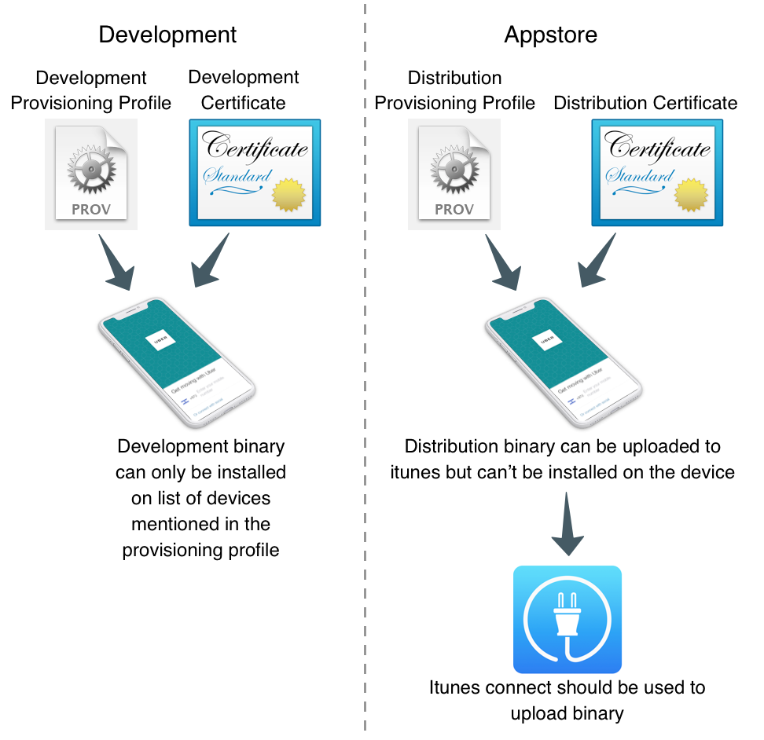

You need 4 files for signing. Two certificates and two provisioning profiles:

. *Production* -- The production certificate/provisioning pair is used for builds that are uploaded to iTunes

. *Development* -- The development certificate/provisioning is used to install on your development devices

The certificate wizard automatically creates these 4 files and configures them for you.

.Using the iOS Certificate Wizard Steps 1 and 2
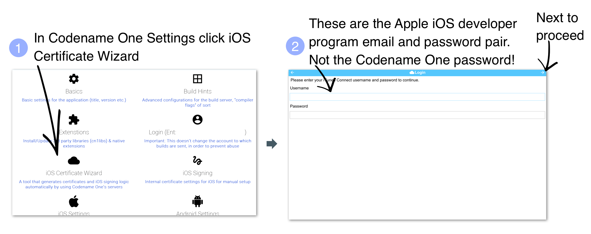

.Using the iOS Certificate Wizard Steps 3 and 4
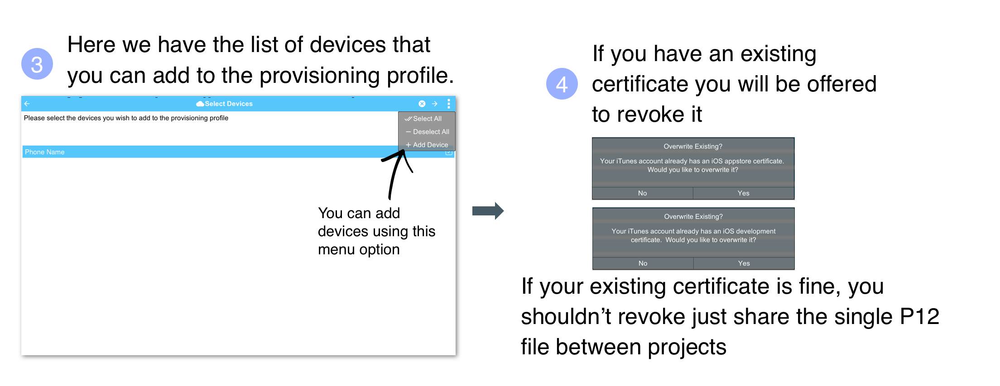

.Using the iOS Certificate Wizard Steps 5 and 6
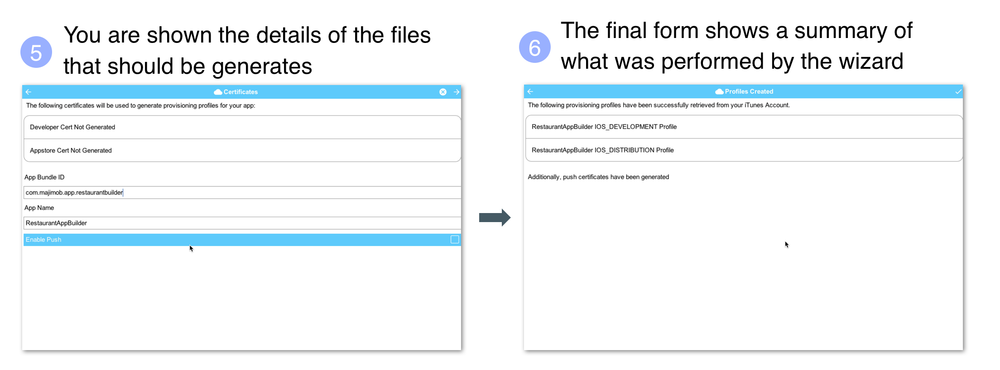

[TIP]
====
If you've more than one project you should use the same iOS P12 certificate files in all the projects and regenerate the provisioning. In this situation the certificate wizard asks you if you want to revoke the existing certificate which you shouldn't revoke in such a case. You can update the provisioning profile in Apple's iOS developer website.
====

One important aspect of provisioning on iOS is the device list in the provisioning step. Apple allows you to install the app on 100 devices during development. This blocks developers from skipping the App Store altogether. it's important you list the correct UDID for the device in the list otherwise install will fail.

WARNING: There are many apps and tools that offer the UDID of the device, they aren't necessarily reliable and might give a fake number!

.Get the UDID of a Device
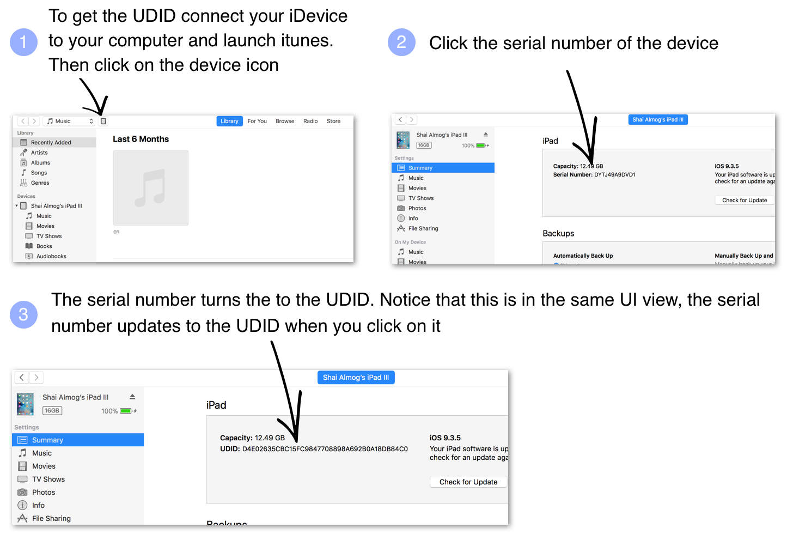

TIP: You can right click the UDID and select #copy# to copy it

The simplest and most reliable process for getting a UDID is through iTunes. I have used other approaches in the past that worked but this approach is guaranteed.

NOTE: Ad hoc provisioning allows 1000 beta testers for your application but it's a more complex process that you won't discuss here although it's supported by Codename One

===== Build and Install

Before you continue with the build you should sign up at https://www.codenameone.com/build-server.html where you can soon follow the progress of your builds. You need a Codename One account in order to build for the device.

Now that you've certificates the process of device builds is literally a right click away for both OS's. You can right click the project and select #Codename One# -> #Send iOS Debug Build# or #Codename One# -> #Send Android Build#.

.Right click menu options for sending device builds
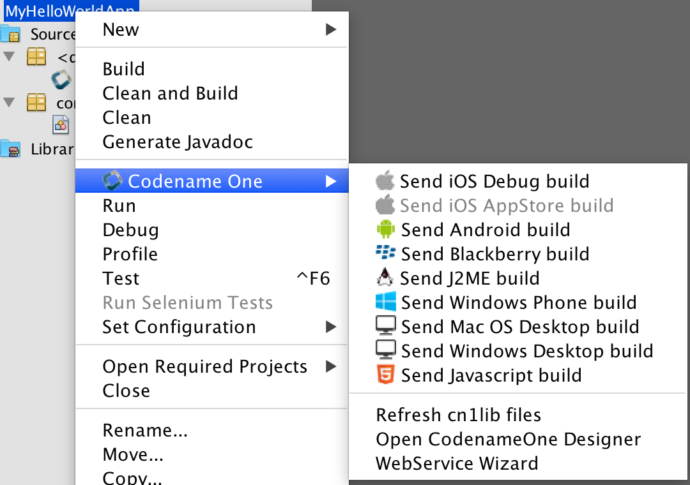

NOTE: The first time you send a build you will be prompted for the email and password you provided when signing up for Codename One

Once you send a build you should see the results in the build server page:

.Build Results
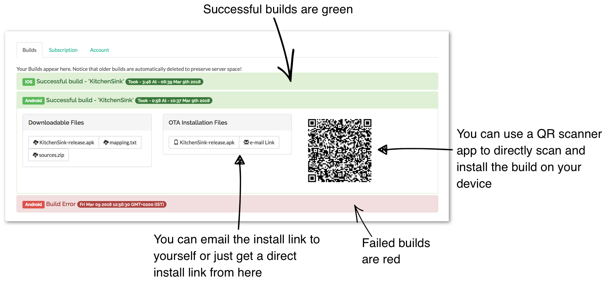

TIP: On iOS make sure you use Safari when installing, as 3rd party browsers might have issues

Once you go through those steps you should have the #HelloWorld# app running on your device. This process is non-trivial when starting so if you run into difficulties don't despair and seek help at the discussion forum (https://www.codenameone.com/discussion-forum.html) or stack overflow (https://stackoverflow/tags/codenameone/). Once you go through signing and installation, it becomes easier.

TIP: You can also install the application either by emailing the install link to your account (using the #e-mail Link#
button)

You can also download the binaries in order to upload them to the appstores.

=== Kotlin

Codename One started before Kotlin became public. Kotlin has since shown itself as an interesting option for developers especially within the Android community. With that in mind you decided to integrate support for Kotlin into Codename One.

To use Kotlin with Codename One you can create a kotlin directory next to the java directory under the `common/src/main` directory. Kotlin code that resides there can work as usual and interact with the Java code.

Please notice the following:

- don't use the project conversion tools or accept the warning that the project isn't a Kotlin project. You do your own build process

- Warnings and errors aren't listed correctly and builds that claim to have errors might pass

==== Hello Kotlin

Due to the way Kotlin works you can create a regular Java project and convert sources to Kotlin. You can mix Java and Kotlin code without a problem and Codename One would "work".

The hello world Java source file looks like this (removed some comments and whitespace):

[source,java]
----
public class MyApplication {
    private Form current;
    private Resources theme;

    public void init(Object context) {
        theme = UIManager.initFirstTheme("/theme");
        Toolbar.setGlobalToolbar(true);
        Log.bindCrashProtection(true);
    }

    public void start() {
        if(current != null){
            current.show();
            return;
        }
        Form hi = new Form("Hi World", BoxLayout.y());
        hi.add(new Label("Hi World"));
        hi.show();
    }

    public void stop() {
        current = getCurrentForm();
        if(current instanceof Dialog) {
            ((Dialog)current).dispose();
            current = getCurrentForm();
        }
    }

    public void destroy() {
    }
}
----

When you select that file and select the menu option #Code# -> #Convert Java file to Kotlin File# you should get this:

[source,kotlin]
----
class MyApplication {
    private var current: Form? = null
    private var theme: Resources? = null

    fun init(context: Any) {
        theme = UIManager.initFirstTheme("/theme")
        Toolbar.setGlobalToolbar(true)
        Log.bindCrashProtection(true)
    }

    fun start() {
        if (current != null) {
            current!!.show()
            return
        }
        val hi = Form("Hi World", BoxLayout.y())
        hi.add(Label("Hi World"))
        hi.show()
    }

    fun stop() {
        current = getCurrentForm()
        if (current is Dialog) {
            (current as Dialog).dispose()
            current = getCurrentForm()
        }
    }

    fun destroy() {
    }
}
----

that's pretty familiar. The problem is that there are two bugs in the automatic conversion... that's the code for Kotlin behaves differently from standard Java.

The first problem is that Kotlin classes are final unless declared otherwise so you need to add the open keyword before the class declaration as such:

[source,kotlin]
----
open class MyApplication
----

This is essential as the build server will fail with weird errors related to instanceof.

NOTE: This applies to the main class of the project, other classes in Codename One can remain `final`

The second problem is that arguments are non-null by default. The `init` method might have a null argument. So this fails with an exception. The solution is to add a question mark to the end of the call: `fun init(context: Any?)`.

So the full working sample is:

[source,kotlin]
----
open class MyApplication {
    private var current: Form? = null
    private var theme: Resources? = null
    fun init(context: Any?) {
        theme = UIManager.initFirstTheme("/theme")
        Toolbar.setGlobalToolbar(true)
        Log.bindCrashProtection(true)
    }

    fun start() {
        if (current != null) {
            current!!.show()
            return
        }
        val hi = Form("Hi World", BoxLayout.y())
        hi.add(Label("Hi World"))
        hi.show()
    }

    fun stop() {
        current = getCurrentForm()
        if (current is Dialog) {
            (current as Dialog).dispose()
            current = getCurrentForm()
        }
    }

    fun destroy() {
    }
}
----

Once all of that's in place Kotlin should work. This should be possible for additional JVM languages in the future.
