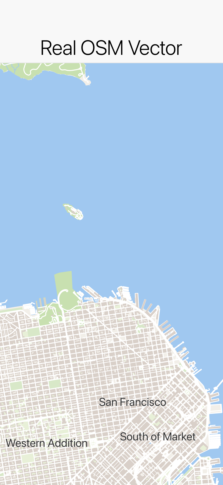
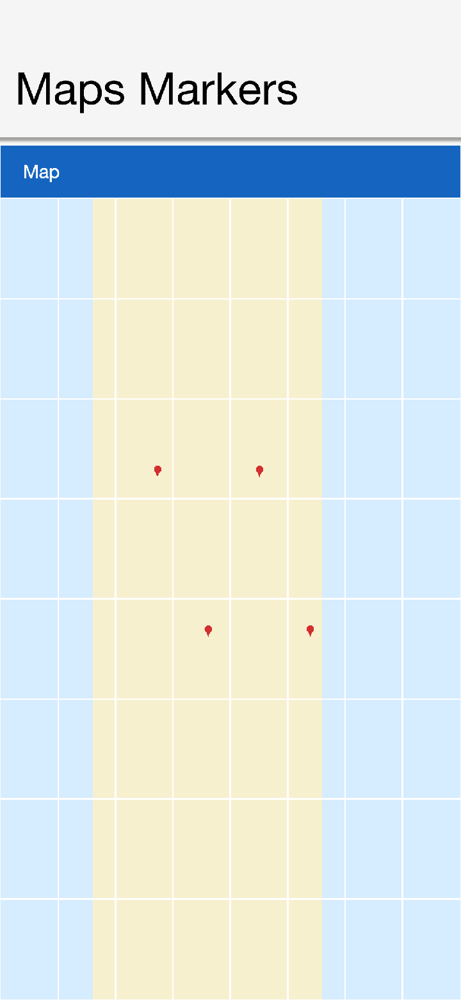
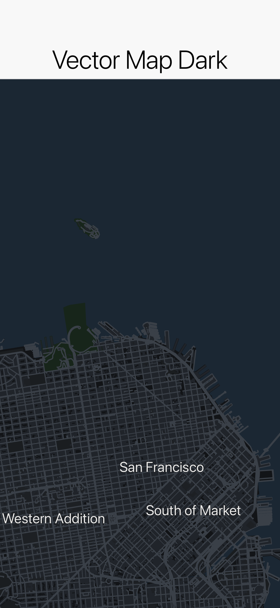
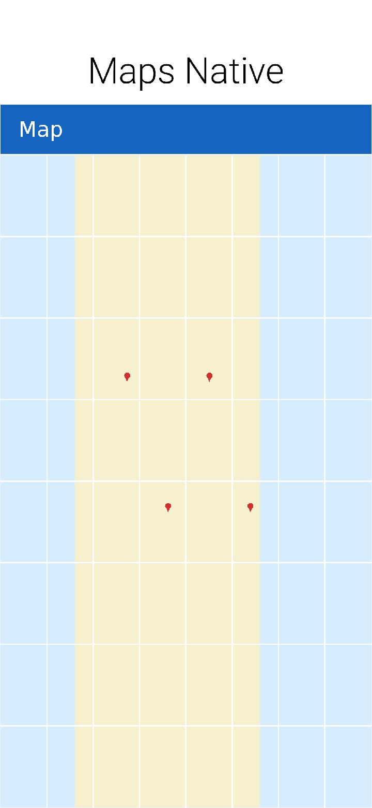
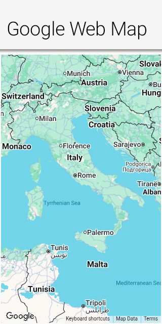

== Maps

Codename One ships a modern mapping API in the `com.codename1.maps` package built around two components:

* `MapView` -- a *pure-vector* map drawn entirely through the Codename One `Graphics` pipeline. It never embeds a native peer, so it composes cleanly with the rest of your UI (dialogs, lists and overlays draw over it) and behaves identically on every platform, including the simulator and the web.
* `NativeMap` -- a map backed by a *native provider* (Apple MapKit, Google Maps, ...) when one is wired into the build, and which transparently *falls back to a `MapView`* when no provider is available (the simulator, devices without the selected provider, or builds that didn't opt in).

Both components implement the same `MapSurface` interface, so application code is identical regardless of which one -- or which provider -- is backing the map.

NOTE: The legacy tile-based `MapComponent` and the external `codenameone-google-maps` cn1lib are deprecated in favor of this API.

=== A first map

The pure-vector `MapView` renders real maps with zero configuration and no API key -- by default it shows the free, keyless https://openfreemap.org[OpenFreeMap] vector basemap (real OpenStreetMap data):

[source,java]
----
MapView map = new MapView();
map.moveCamera(new LatLng(37.7749, -122.4194), 12);
form.add(BorderLayout.CENTER, map);
----

`LatLng` is the immutable WGS84 coordinate value type used throughout the API. The camera is described by a center `LatLng` and a fractional zoom level (the standard slippy-map scale where each whole increment doubles the scale).

=== The MapSurface API

Every map -- vector or native -- exposes the same operations through `MapSurface`:

[source,java]
----
// Camera
map.setCameraPosition(new CameraPosition(new LatLng(48.8566, 2.3522), 11));
map.moveCamera(new LatLng(48.8566, 2.3522), 11);
map.setZoom(13);
map.fitBounds(new MapBounds(new LatLng(48.8, 2.2), new LatLng(48.9, 2.4)), 24);

// Markers
Marker m = map.addMarker(new MarkerOptions(new LatLng(48.8584, 2.2945))
        .icon(pinImage)
        .title("Eiffel Tower")
        .anchor(0.5f, 1.0f)
        .onClick(e -> showDetails()));
map.removeMarker(m);

// Shapes
map.addPolyline(new Polyline(routePoints).setStrokeColor(0xff5722).setStrokeWidth(6));
map.addPolygon(new Polygon(areaPoints).setFillColor(0x803f51b5).setStrokeColor(0x3f51b5));
map.addCircle(new Circle(new LatLng(48.85, 2.35), 500).setFillColor(0x804caf50));
map.clearMapObjects();

// Coordinate conversion and bounds
Point pixel = map.latLngToScreen(new LatLng(48.85, 2.35));
LatLng coord = map.screenToLatLng(120, 240);
MapBounds visible = map.getVisibleRegion();

// Events
map.addTapListener((surface, location, x, y) -> placeMarker(location));
map.addLongPressListener((surface, location, x, y) -> contextMenu(location));
map.addCameraChangeListener((surface, camera) -> persist(camera));
----

Marker icons are supplied as `EncodedImage` and anchored in normalized `(u, v)` image space (`0.5, 1.0` puts the pin tip on the location). When no icon is given, a marker draws the standard Material Design map pin. Polygon and circle fills accept an `0xAARRGGBB` color so you can make them translucent.

=== Tile sources and styles (MapView)

`MapView` pulls its tiles from a pluggable `com.codename1.maps.vector.TileSource`:

* `MvtTileSource` -- networked Mapbox Vector Tiles (`.pbf`/`.mvt`). `MvtTileSource.openFreeMap()` is the free, keyless OpenStreetMap-based default (its tile URLs are versioned, so it resolves them from OpenFreeMap's TileJSON automatically). Most other hosted vector basemaps require an API key supplied via `setApiKey(...)` and referenced as `{key}` in the URL template; a TileJSON endpoint (a URL with no `{z}` token) is resolved automatically.
* `RasterTileSource` -- networked XYZ image tiles. `RasterTileSource.openStreetMap()` is a keyless raster alternative.
* `BundledTileSource` -- tiles bundled into the app as resources, for fully offline maps.
* `DemoTileSource` -- a self-contained synthetic tile set (no network), handy for demos and deterministic tests.

[source,java]
----
MapView vector = new MapView(
        new MvtTileSource("https://tiles.example.com/{z}/{x}/{y}.pbf?key={key}", 0, 16)
                .setApiKey(apiKey),
        MapStyle.dark());
----

Vector tiles are painted according to a `MapStyle`. The built-in `MapStyle.light()` and `MapStyle.dark()` cover a usable basemap; `MapStyle.fromJson(json)` parses a subset of the MapLibre GL style specification (`background`/`fill`/`line`/`symbol` layers, zoom-stop interpolation, simple `["==", key, value]` filters).

=== Native maps and providers

`NativeMap` renders through a native map SDK when the build wires one in:

[source,java]
----
NativeMap map = new NativeMap(new LatLng(37.7749, -122.4194), 12);
map.addMarker(new MarkerOptions(new LatLng(37.7749, -122.4194)).title("San Francisco"));
form.add(BorderLayout.CENTER, map);

if (!map.isNativeMap()) {
    // Running on the simulator (or a build without a provider) -> vector fallback.
}
----

Which provider (if any) backs the map is decided entirely by *build hints* -- the public API never names a provider, so unused providers add nothing to your app's size. Select one with the `maps.provider` build hint (or the per-platform `ios.maps.provider` / `android.maps.provider`):

[source]
----
# iOS uses Apple MapKit (a free system framework, no API key, no pod):
codename1.arg.ios.maps.provider=apple

# Android uses Google Maps (pulls Google Play Services Maps):
codename1.arg.android.maps.provider=google
----

When a provider is selected the build server injects that provider's implementation into your app and wires it in; with no provider selected (or when the provider is unavailable at runtime, for example when Google Play Services is missing) `NativeMap` simply renders the vector `MapView` fallback. You can configure the fallback basemap explicitly:

[source,java]
----
NativeMap map = new NativeMap(new LatLng(0, 0), 4, fallbackTileSource, MapStyle.light());
----

==== Provider API keys

Apple MapKit needs no key. Google Maps requires the usual keys, supplied as build hints:

[source]
----
codename1.arg.android.xapplication=<meta-data android:name="com.google.android.maps.v2.API_KEY" android:value="YOUR_ANDROID_API_KEY"/>
codename1.arg.ios.afterFinishLaunching=[GMSServices provideAPIKey:@"YOUR_IOS_API_KEY"];
----

==== Cross-platform web maps

A native provider only renders on the platforms that ship its SDK. To show a provider's map *everywhere* -- including platforms with no native SDK for it -- register a `WebMapProvider`, which hosts the provider's JavaScript SDK inside a `BrowserComponent`:

[source,java]
----
// Render Google Maps through its JavaScript SDK on any platform with a browser:
MapProviderRegistry.register(WebMapProvider.google("YOUR_MAPS_JS_API_KEY"));
NativeMap map = new NativeMap(new LatLng(41.0, 13.0), 5);
----

Because it needs only a web view, the web provider (id `web`) is the natural last step before the pure-vector fallback in a provider chain. The order is fully customizable from code, so you can express per-platform preferences -- for example "try the native Google SDK, then the web map, then the vector `MapView`":

[source,java]
----
MapProviderRegistry.setProviderOrder(new String[]{"google", "web", "vector"});
----

=== Choosing between MapView and NativeMap

Use `MapView` when you want a lightweight, dependency-free map that looks the same everywhere and composes with CN1 components. Use `NativeMap` when you want the platform's native map look, gestures and performance, and are willing to opt a provider in through build hints -- with the guarantee that it still works (as a vector map) where the provider is unavailable.
