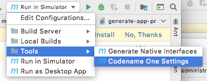
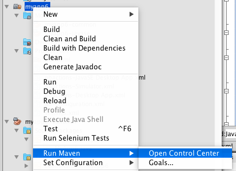
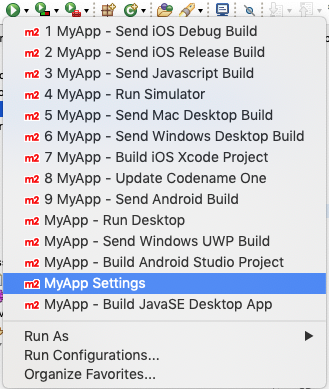

[appendix]
[#settings]
== Codename One Settings

The Codename One Settings app (aka Codename One Preferences, aka Control Center) allows you to configure many aspects of your application.  This is where you can generate certificates, browse/install add-ons, monitor the status of your cloud builds, configure build hints, and more.

=== Opening Codename One Settings

==== Opening Codename One Settings from Command-line

Use the `run.sh` (or run.bat, if on Windows) to open Codename One settings:

[source,bash]
----
./run.sh settings
----

==== Opening Codename One Settings from IntelliJ

Click on the "Configuration" menu in the upper right of the toolbar, and select "Tools" > "Codename One Settings" as shown below.

==== Opening Codename One Settings from NetBeans

Right-click on the project in the project inspector, and select "Maven" > "Open Control Center" as shown below:

==== Opening Codename One Settings from Eclipse

Press the  button, and select the "_My Project_ Settings" option. (Where _My Project_ is the name of your project).  E.g.

[#dashboard]
=== The Dashboard

Once inside Codename One Settings, you'll see a dashboard like the following:

image::img/control-center-dashboard.png[]
