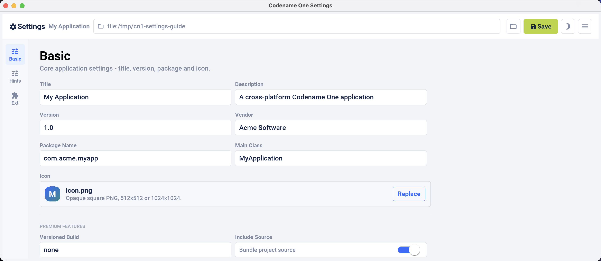

[appendix]
[#settings]
== Codename One Settings

Codename One Settings is a standalone editor for the current Maven project. Use it to edit the application's basic properties, manage build hints, and browse, install, update, or uninstall extensions. Signing assets are managed by the separate <<certificate-wizard,Certificate Wizard>>, and cloud builds are monitored on the Codename One website.

=== Opening Codename One Settings

Run the following command from the root directory of a Codename One Maven project:

[source,shell]
----
include::../demos/common/src/main/snippets/developer-guide/maven-appendix-control-center.sh[tag=maven-appendix-control-center-bash-001,indent=0]
----

Maven downloads the Settings artifact that matches the Codename One Maven plugin version and opens it as a desktop application bound to the current project. The same command works in a terminal or an IDE's Maven runner.

=== Basic settings

The *Basic* view edits the application title, description, version, vendor, package name, main class, icon, versioned-build selection, and include-source option. Changes are written to `common/codenameone_settings.properties` when you click *Save*.

=== Build hints

The *Build Hints* view searches the build-hint catalog from this guide. It provides a control appropriate to each known hint and also accepts arbitrary key/value hints. The editor adds and removes the `codename1.arg.` prefix when reading and writing `codenameone_settings.properties`.

image::img/codename-one-settings-build-hints.png[Codename One Settings Build Hints view,scaledwidth=85%]

=== Extensions

The *Extensions* view searches the Codename One library catalog. Depending on how an extension is distributed, installation either adds a Maven dependency to `common/pom.xml` or installs a legacy cn1lib. Click the action for an installed extension to uninstall it. Settings displays a compatibility warning before installing a catalog entry known to target an older Codename One release.

image::img/codename-one-settings-extensions.png[Codename One Settings Extensions view,scaledwidth=85%]
