[#creating-cn1libs]
== Codename One libraries

A Codename One Library (cn1lib) is a module that can be distributed and added to Codename One applications to add functionality. It can be distributed as a self-contained bundle (a file with the.cn1lib extension), or deployed on Maven central to be included in application projects as a pom dependency.

A cn1lib may contain any of the following:

. Cross-platform Java classes.
. Native code that targets specific platforms.
. Build hints, which will affect how projects will be built that include this library. These can contain things like Gradle dependencies on Android, Cocoapods dependencies on iOS, and other hints to affect the build-server process.
. CSS files.

.`.cn1lib` vs `.jar`
[sidebar]
****
You may be wondering why the .cn1lib format is even necessary. Why not just distribute libraries as .jar files? The .cn1lib format offers several advantages over the plain .jar format:

. *cn1libs can contain platform-specific native sources* that make use of native APIs on the various platforms. For example, they can contain Objective-C code which will be compiled on the build server when deploying on iOS.
. *Codename One library projects perform a compliance check* at the time that the library is compiled to ensure it only uses supported Codename One APIs. This provides a sort of "certification" that the library will be compatible with Codename One application projects.
. *Codename One libraries can include CSS files and build hints* which will be appended to the build hints of application projects when they're built.

// vale-skip: Microsoft.ComplexWords/TooWordy — 'an additional compliance check' reads correctly; 'an more compliance check' is ungrammatical.
All that said, you *can* still distribute libraries as plain old jars and include them in your Maven Codename One projects as *jar* dependencies. Codename One application projects will perform an additional compliance check to ensure that the jar is compatible, and the build will fail if it uses APIs that aren't available in Codename One.

TIP: Codename One supports a subset of JavaSE8, as well as addition APIs for accessing device functionality and building beautiful user interfaces. See https://www.codenameone.com/javadoc/[the Codename One javadocs] for a definitive list of supported APIs.

****

=== Creating a library project

Use the `cn1lib-archetype` for generating a new Codename One library project as follows:

==== Command line

[source,bash]
----
include::../demos/common/src/main/snippets/developer-guide/maven-creating-cn1libs.sh[tag=maven-creating-cn1libs-bash-001,indent=0]
----

NOTE: This command is formatted for the bash prompt (for example, Linux or Mac). It will work on Windows also if you use bash. If you're on Windows and are using PowerShell or the regular command prompt, then you'll need to modify the command slightly. In particular, the entire command would need to be on a single line. (Remove the '\' at the end of each line, and merge lines together, with space between the command-line flags)

In the above snippet you would change the `groupId`, `artifactId`, and `version` properties to reflect your project settings.

[TIP]
====
You can run the `archetype:generate` goal with as many or few properties as you like, and it will prompt you to enter any properties that are required. For example, You could enter:

[source,bash]
----
include::../demos/common/src/main/snippets/developer-guide/maven-creating-cn1libs.sh[tag=maven-creating-cn1libs-bash-002,indent=0]
----

And then follow the prompts. Or you could enter:

[source, bash]
----
include::../demos/common/src/main/snippets/developer-guide/maven-creating-cn1libs.sh[tag=maven-creating-cn1libs-bash-003,indent=0]
----

NOTE: This command is formatted for the bash prompt (for example, Linux or Mac). It will work on Windows also if you use bash. If you're on Windows and are using PowerShell or the regular command prompt, then you'll need to modify the command slightly. In particular, the entire command would need to be on a single line. (Remove the '\' at the end of each line, and merge lines together, with space between the command-line flags)

And follow the prompts. This will, result in fewer prompts because you've already specified the archetype to use.
====

This will create a new project for you in the current directory, in a newly created directory named after the `artifactId` that you entered.

==== IntelliJ IDEA

. Select "File" > "New Project"...
+
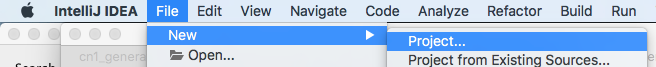
. Select "Maven" in the left menu.
+
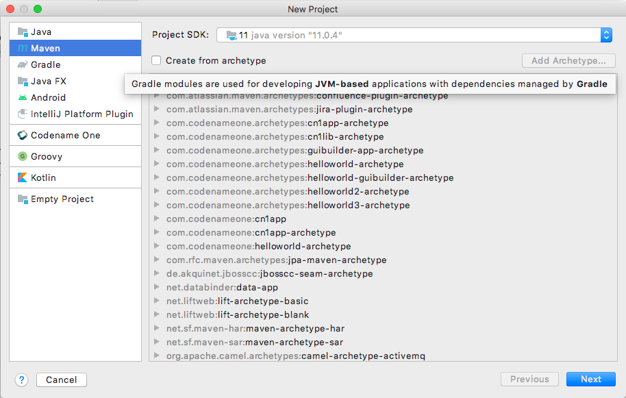
. Check the "Create from Archetype" checkbox. . This should allow you to choose from of archetypes that are already known to IntelliJ.
. If you don't see an option for `com.codenameone:cn1lib-archetype`, then IntelliJ doesn't know about it yet. If, but you *do* see this option, you can skip to the next step. Press the "Add Archetype..." button. This will display a dialog for you to enter the details of the archetype.
+
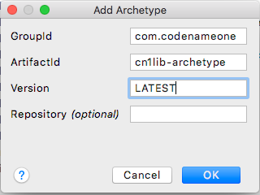
+
Fill in this dialog as shown in the above image. Specifically `groupId`=`com.codenameone`, `artifactId`="cn1lib-archetype," and `version`="LATEST"
+
Then press `OK`.
. Select the option that says "com.codenameone:cn1lib-archetype"
+
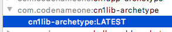
+
Then press "Next"
. This will display a form where you can enter the details of your project such as its location (where you want to create the project folder), the name, the artifact ID, and the groupID. Fill in this form as you see fit.
+
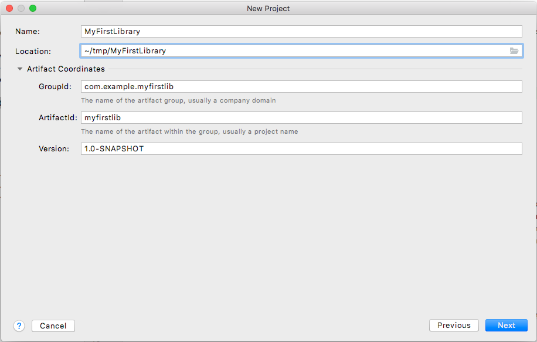
+
Then click "Next"
. The final form in this wizard summarizes the project details and gives you an opportunity to add more properties to pass to the `archetype:generate` goal. In your case you don't need to add any more properties. If the information looks correct, you can press `Next`.
+
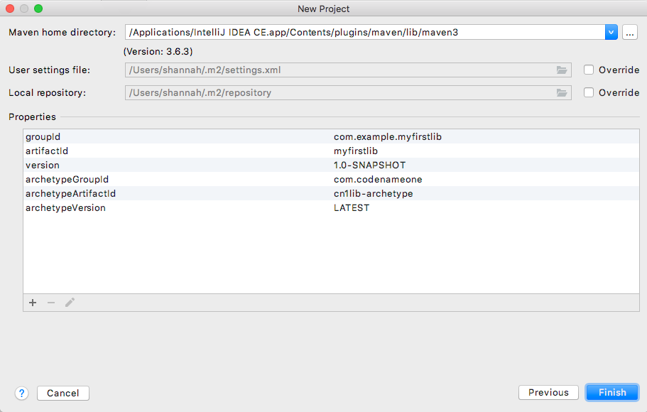

At this point you will be prompted to open the project.

==== NetBeans

. Select "File" > "New Project..."
+
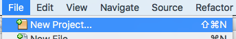
. In the "New Project" dialog, select "Java with Maven" in the left panel, and "Project from Archetype" in the right panel, as shown below.
+
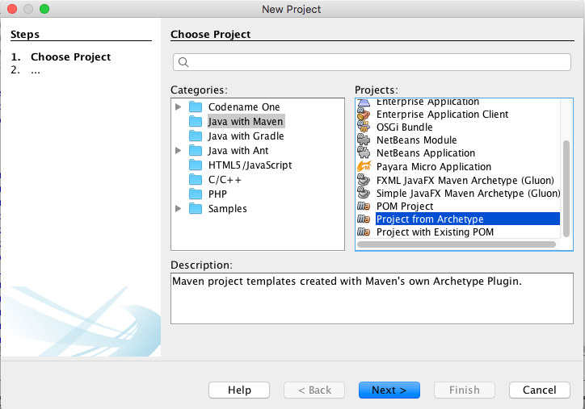
+
Then press "Next"
. This will bring you to the "Maven Archetype" dialog as shown below:
+
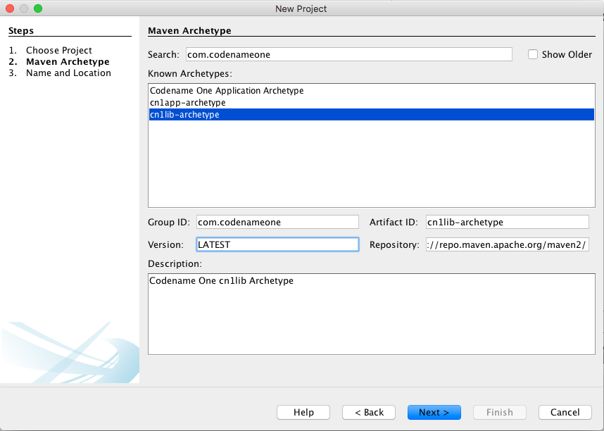
+
Enter "com.codenameone" or "cn1lib-archetype" into the search field. Then select "cn1lib-archetype" in the "Known archetypes:" panel. This will prefill the *Group ID*, *Artifact ID* and *Version* fields for you. You may want to change *Version* to LATEST to ensure that it tries to use the latest available version of the archetype.
+
Then click "Next"
. This will bring you to the "Name and Location" panel of the wizard.
+
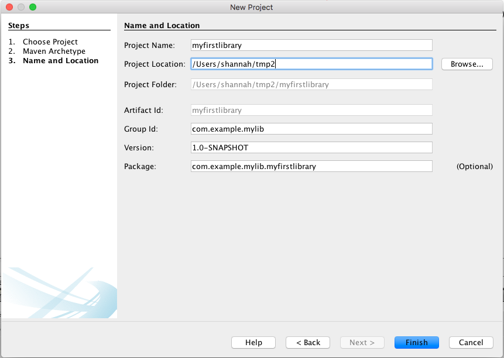
+
Enter in the project name (which you'll be forced to use as the artifact ID also), project location, groupId,
version, and package. The "Package" is unimportant here as it isn't used anywhere in the project.
+
Once you've entered the information to your liking press the "Finish" button.

This will create a new library project for you at the location you specified.

==== Eclipse IDE

. Select "File" > "New Project..."
. In the _New Project_ dialog, expand the _Maven_ item, and select _Maven Project_
+
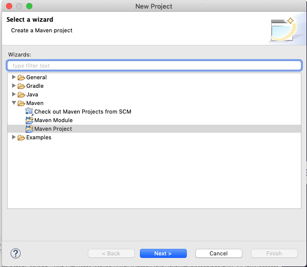
+
Then press "Next"
. The next panel will look like the below image. The default settings on this panel should be fine. Press _Next_
+
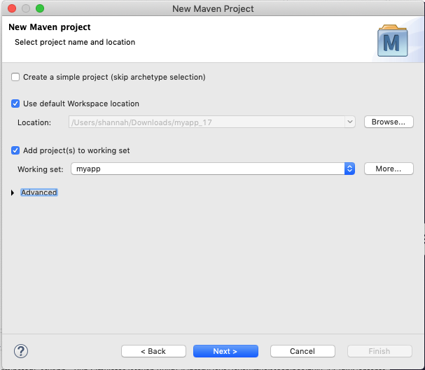
. In the next panel, enter "cn1lib" in the _Filter_ field. After a moment the _cn1lib-archetype_ should appear in the area below as shown here:
+
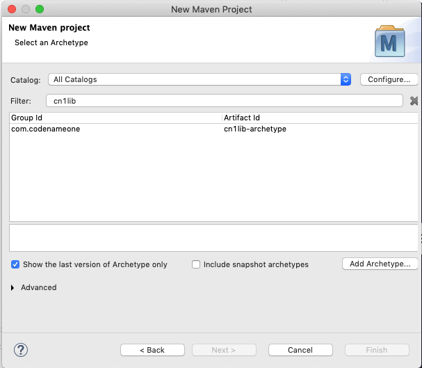
+
Select that option, and press _Next_
. The next panel, allows you to enter your project details, such as group ID, and artifact ID. Your project information here and then press _Finish_.
+
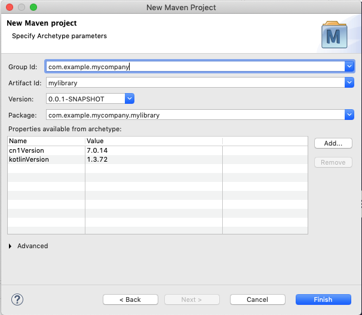

This will create a new library project for you at the location you specified.

==== Project structure

Take a look at the project that was created. It's a multi-module Maven project with the following modules:

common::
The module where you'll add all your cross-platform code and CSS, and build hint configuration. This module is in the "common" directory of the main project.
Java SE::
The module where you can implement native interfaces for the Java SE platform. This module is in the "Java SE" directory of the main project.
ios::
The module where you can implement native interfaces for the iOS platform. This module is in the "ios" directory of the main project.
android::
The module where you can implement native interfaces for the Android platform. This module is in the "android" directory of the main project.
JavaScript::
The module where you can implement native interfaces for the JavaScript platform. This module is in the "JavaScript" directory of the main project.
lib::
The library module which includes all the other modules as dependencies, and can be used as a pom dependency in Codename One application projects that wish to use this library. This module is in the "lib" directory of the main project.
tests::
An application project for writing unit tests against your library. This module is in the "tests" directory of the main project.

===== IntelliJ IDEA

The project inspector will look like:

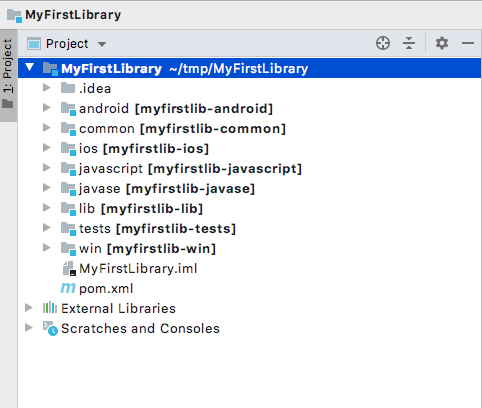

This top-level view of the module structure may seem daunting. Most of your development will occur inside the "common" module. If you expand that module it will look more familiar to developers who have used the old Ant project structure:

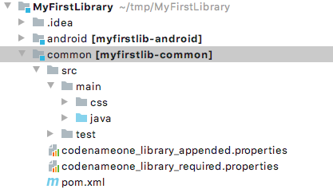

Your cross-platform Java source would go in the `common/src/main/java` directory. Your CSS files go in the `common/src/main/css` directory.

===== NetBeans

The project inspector will look like:

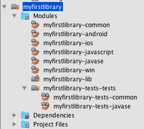

This top-level view of the modules doesn't provide a clear view of the project landscape, but, since 99% of your development will occur inside the `common` submodule. Open that "common" sub-module project as well and take a peek.

Right-click on the "Common" sub-module, and select "Open Project" as shown below:

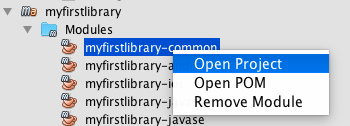

With the common subproject open, the project inspector will look like:

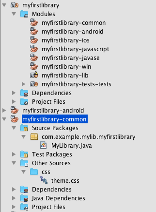

In this screenshot, "Source Packages" and "Other Sources/css" are expanded to highlight where your Java source files and CSS source files will be located.

The project inspector hides a few important files, but, so here is a screenshot of the File inspector for the common project:

// vale-skip: Microsoft.FirstPerson: "my" is part of the literal image filename `netbeans-my-first-library-...`, not author voice.
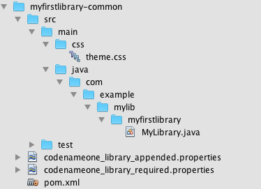

===== Eclipse IDE

The package explorer will look like:

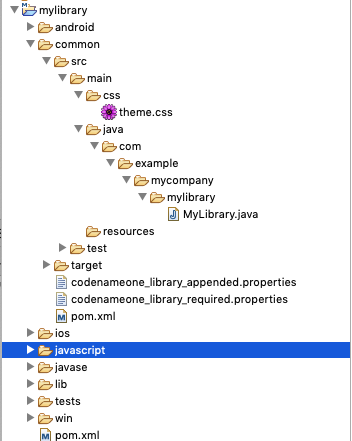

In this screenshot, the _common/src/main/css_ and _common/src/main/java_ directories are expanded since this is where most of your module source will go.

===== Command line

If you do a file listing on the project directory, it shows the following:

[source,listing]
----
include::../demos/common/src/main/snippets/developer-guide/maven-creating-cn1libs.txt[tag=maven-creating-cn1libs-listing-001,indent=0]
----

This may seem daunting at first, but it's important to realize that 99% of the time, you'll be working in the "common" module - most of the other stuff is boilerplate.

===== Important files

A few key files in this project that you'll be using more than the others.

pom.xml::
The maven configuration file of the root module is where you will set project-wide properties such as the `cn1.version` property, which specifies the version of the Codename One libraries that the module should be compiled against. Periodically, you'll want to update the `cn1.version` property to point to the latest version.
+
When/if you decide to deploy your module to Maven central, you'll need to add more deployment-related settings in this file.

common/pom.xml::
The maven configuration file for the "common" module, which will contain most of your cn1lib's source code, CSS files, and properties files. If your library depends on other libraries or jar files, you'll be adding them as dependencies in this file, and not the root pom.xml file.

common/codenameone_library_appended.properties::
This file is where you can specify properties that should be merged with the codenameone_settings.properties of application projects that include this library as a dependency. This is where you would add, for example, Gradle dependencies required for the Android builds, or CocoaPods dependencies that are required for iOS builds.

common/codenameone_library_required.properties::
This file allows you to specific build hints that *must* be present in application projects that include this library. If this library requires a particular android build tools version, or a specific Java version, then those requirements should be specified in this file.

===== Important directories

As mentioned earlier, 99% of all your development will likely occur inside the "common" module. The other modules are for native implementations of Native interfaces.

common/src/main/java::
This is where your cross-platform Java source files will be placed.

common/src/main/css::
If your library uses CSS, this is where all CSS-related files will be placed.

common/src/main/resources::
Other non-java resources that you want to have included in the classpath.

[#building-library]
==== Building the library

===== Command line

To build the library, run the "install" goal on the root module as follows:

[source,bash]
----
include::../demos/common/src/main/snippets/developer-guide/maven-creating-cn1libs.sh[tag=maven-creating-cn1libs-bash-004,indent=0]
----

===== IntelliJ IDEA

Press the "build"  button on the toolbar.

===== NetBeans

Right-click on the "root" module in the project explorer and select `Build`.

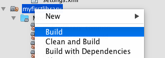

IMPORTANT: You must build the root module and not one of the submodules.

Or you could have selected the "root" module in the project explorer and pressed the "build"  button on the toolbar.

===== Eclipse IDE

Right-click on the "root" module in the project explorer and select _Run as_ > _Maven Install_

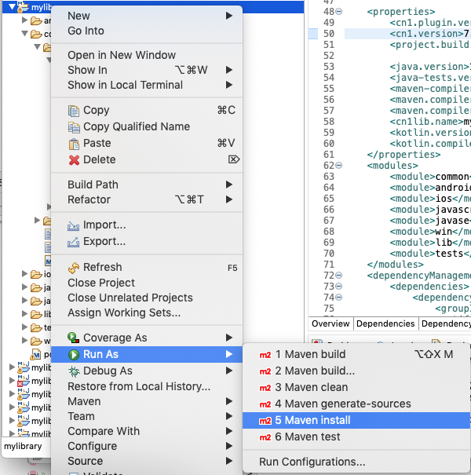

TIP: If the build fails for any reason, check to make sure that your project is using the latest version of the Codename One plugin. You can do this by opening the _pom.xml_ file, and changing the `cn1.version` and `cn1.plugin.version` properties to reference the latest version. Check for the latest version https://search.maven.org/artifact/com.codenameone/codenameone[here].

===== Building the Legacy.cnlib file

When using the Maven build tool, you no longer require the.cn1lib file at all. Your library projects can be handled entirely via Maven's dependency mechanism. The preferred way to distribute your libraries is on Maven central, and the preferred way to add a library to an application is via a Maven "pom" dependency.

That being said, you may still want to distribute your library as a.cn1lib file for the sake of users who are still using Ant as their build tool. For that reason, when you build a library project, the cn1lib is automatically built as well. After running a build, you can look in the common/target directory and find your.cn1lib file ready to be distributed.

==== Editing Java Code

To get acquainted with your project, add a "Hello World" Java class that you want to make available as part of your cn1lib.

Add a new class inside the "common/src/main/java" directory with package `com.example`, and name `HelloWorld`. Enter the following contents into the class:

[source,java]
----
include::../demos/common/src/main/java/com/codenameone/developerguide/snippets/generated/MavenCreatingCn1libsJava001Snippet.java[tag=maven-creating-cn1libs-java-001,indent=0]
----

Now build the library again. (See <<building-library>>).

==== Using the library in an application project

Now that you've built your library and added a Java class, try adding it as a dependency in an application project. If you haven't yet created an application project, do that now. See <<creating-app-project>> for instructions on creating a new application project.

Open the common/pom.xml file of your application project.

IMPORTANT: Make sure you're editing the common/pom.xml file of the *application project* and not the library project.

This file may look a little hairy as there is a lot of configuration in there. You will be looking for the `<dependencies>` section.

The common/pom.xml file will have more than one `<dependencies>` tag, as it includes some profiles handling things like Kotlin support. There will be one particular `<dependencies>` tag that includes a comment like

[source,xml]
----
include::../demos/common/src/main/snippets/developer-guide/maven-creating-cn1libs.xml[tag=maven-creating-cn1libs-xml-001,indent=0]
----

You should add your dependencies before this comment.

For the sake of this example, suppose your library was set up with the following coordinates:

|====
| *groupId:* | `com.example`
| *artifactId:* | `mylib`
| *version:* | `1.0-SNAPSHOT`
|====

In this case you would add the following XML snippet to the `<dependencies>` section of your application's common/pom.xml file:

[source,xml]
----
include::../demos/common/src/main/snippets/developer-guide/maven-creating-cn1libs.xml[tag=maven-creating-cn1libs-xml-002,indent=0]
----

IMPORTANT: Notice that you appended "-lib" to the `artifactId`. This is because you're including the "lib" module of your library project as the dependency, and not the root module. Also the `<type>pom</type>` is important as it indicates that this is a pom dependency - not a regular jar dependency.

Now try it out. Try adding the following code to your application project's main class (or anywhere in the application project, for that matter):

And build the project. The project should build OK, and if you run it, you should see that the `helloWorld()` method works as designed.

=== Adding menus to the simulator

A cn1lib can contribute menu items to the Codename One simulator's menu bar. This is the same affordance the framework itself uses for the Skins / Native Theme / Simulate menus — opened up so library authors can expose backend-specific actions (for example, "Add a simulated peripheral," "Inject a push notification," or "Switch backend") without users having to write any Swing code or instrument their app.

Every menu item is also reachable from CN1 UnitTests (or any app code) through `CN.execute("namespace:itemN")` — the JavaSE port's URL execute is overloaded to recognize a registered hook url and dispatch it on the EDT instead of opening it as a browser URL. On Android, iOS, JavaScript and other production targets no hooks are registered, so a hook-style URL falls through to the normal native execute and (almost always) becomes a no-op; tests should pair `CN.execute` with `CN.canExecute` for that reason. Hooks can also be declared with no menu label, which makes them callable from tests but invisible in the menu — useful for state-priming actions a human wouldn't click.

==== The contract

Each cn1lib ships a properties file at a well-known classpath location. The simulator scans every jar on its classpath for this resource and merges the results, so multiple cn1libs coexist cleanly:

[source,properties]
----
include::../demos/common/src/main/snippets/developer-guide/maven-creating-cn1libs.properties[tag=maven-creating-cn1libs-properties-001,indent=0]
----

Required keys:

`name`:: Menu title shown in the simulator's menu bar. One menu per properties file.
`itemN`:: A `fully.qualified.ClassName#staticMethodName` reference for the Nth menu item. The method must be `public static void` and take no arguments. Items are numbered from 1 upward; the loader stops at the first missing `itemN`, so don't leave gaps.

Optional keys:

`namespace`:: Identifier used for the `CN.execute` lookup (for example, `bluetooth` for a URL like `bluetooth:item1`). Defaults to lowercased, ASCII-slugified `name` (`Push Notifications!` → `push-notifications`). Set this explicitly when you want a different identifier from the display name.
`labelN`:: Display text for the matching `itemN`. Omit entirely to make the hook API-only — registered with `CN.execute` but hidden from the menu.

No groups, no submenus, no priority — flat by design. If you need ordering relative to another cn1lib, you can't have it: discovery order wins, and that's intentional so the contract stays small and the future simulator UX can re-render this metadata however it likes.

==== The action method

The simulator dispatches every action on the Codename One EDT through `Display.callSerially`, so your method can call `Display.getInstance()`, `Form.show()`, `Dialog.show()`, `ToastBar.showInfoMessage()` and any other CN1 API. Reflection uses the same classloader that loaded `Display`, so cn1lib internals (including package-private classes) resolve normally:

The `Display.isInitialized()` guard is a useful pattern when the same static methods are also called from JUnit tests that don't run inside a live CN1 simulator — the state mutation runs in both contexts, only the UI feedback is skipped.

==== Worked example using cn1-bluetooth

The `cn1-bluetooth` cn1lib ships a JavaSE port with two backends: a scriptable in-memory simulator and a real-hardware backend that talks to a native helper (CoreBluetooth on macOS, BlueZ on Linux, WinRT on Windows). Both are useful in different stages of development, and the menu lets the user choose between them and exercise the simulator without writing any test scaffolding.

Its `simulator-hooks.properties` looks like this:

[source,properties]
----
include::../demos/common/src/main/snippets/developer-guide/maven-creating-cn1libs.properties[tag=maven-creating-cn1libs-properties-002,indent=0]
----

When the user runs an app that depends on `cn1-bluetooth`, the simulator's menu bar gets a *Bluetooth* menu with the three labeled items. Clicking *Add demo peripheral* drops a peripheral into the in-memory simulator that the running app can then scan for, connect to, and exchange data with — without any real hardware. `item4` is callable from tests via `CN.execute("bluetooth:item4")` but never shows up in the menu.

==== Calling hooks from CN1 unit tests

CN1 unit tests (`AbstractTest` subclasses run via `mvn cn1:test`) compile under the same restrictions as the rest of the app — no reflection, no JavaSE-only imports. Drive a hook the same way you'd execute any URL — `CN.execute` recognizes registered hook urls and dispatches them on the EDT:

[source,java]
----
include::../demos/common/src/main/java/com/codenameone/developerguide/snippets/generated/MavenCreatingCn1libsJava004Snippet.java[tag=maven-creating-cn1libs-java-004,indent=0]
----

A common pattern: ship label-bearing hooks for actions a developer might want to fire manually (toggle adapter, inject notification), and ship label-less hooks for test-only state setup (`primeReadFailure`, `seedFixture`) that would just clutter the menu.

==== What's intentionally not exposed

* *Swing types.* `JMenu`, `JMenuItem`, `KeyStroke` and friends don't appear in the contract. The simulator UX may change shape (toolbar, command palette, sidebar) and cn1libs shouldn't have to follow.
* *Submenus, separators, priority.* The metadata is a flat list with no hierarchy. If you want grouping, ship multiple `simulator-hooks.properties` files in separate jars — each becomes its own menu.
* *Long-running work on the EDT.* Hook methods run on the CN1 EDT; if you need to do I/O, fire-and-forget a `new Thread(...)` from the method or use `CN.invokeAndBlock` so you don't block the UI.

=== Distributing your library

The recommended way to distribute your library is on Maven central. That way users will be able to install your library by copying and pasting a familiar `<dependency>` snippet into their pom.xml file.

