== Getting Started

[#creating-app-project]
=== Creating a New Project

==== Codename One Initializr

The easiest way to create a new project is to use the  https://start.codenameone.com[Codename One initializr].

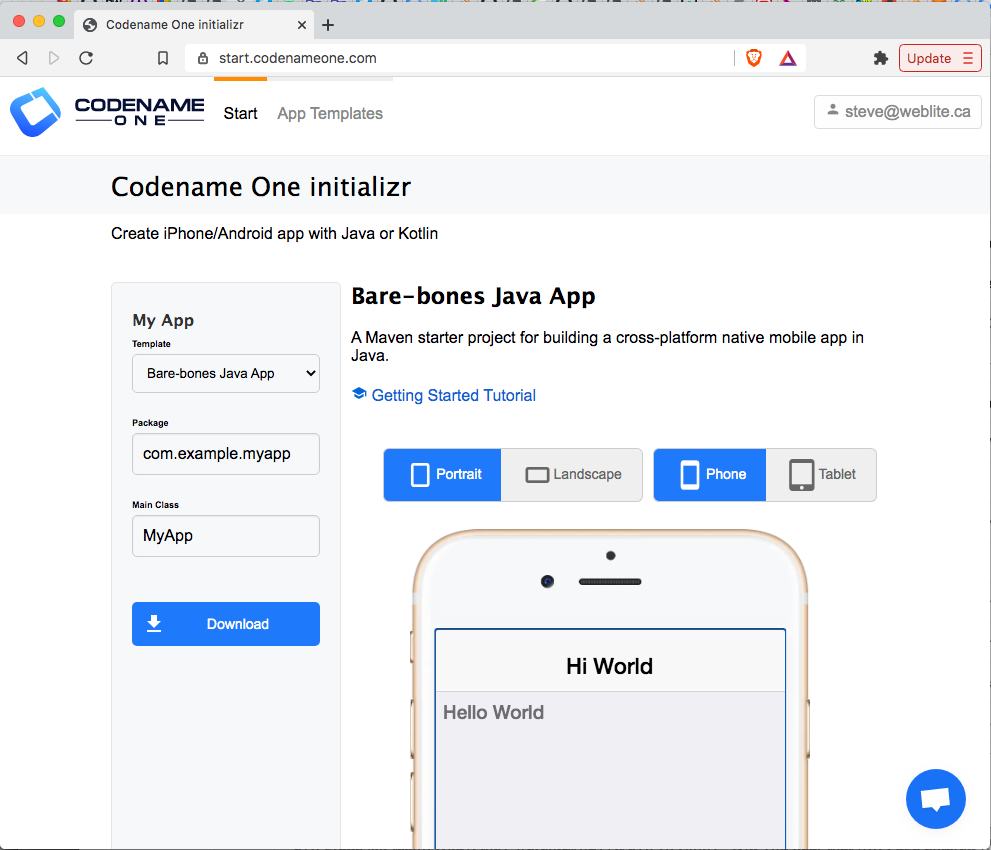

This tool will allow you to choose from a growing selection of project templates, and download a starter project that you can open in your preferred IDE (IntelliJ IDEA, NetBeans, etc..), or build directly on the command-line using Maven.

The starter projects are based on the <<cn1app-archetype>>.

[TIP]
====
The following tutorials provide step-by-step instructions for getting started with bare-bones app templates.  Those tutorials are a better starting place for Codename One development than this manual, as they are written in tutorial form.

**Java Getting Started Tutorial:**

See https://shannah.github.io/cn1-maven-archetypes/cn1app-archetype-tutorial/getting-started.html[Getting Started with the Bare-bones Java App Template].

**Kotlin Getting Started Tutorial:**

See https://shannah.github.io/cn1app-archetype-kotlin-template/getting-started.html[Getting Started with the Bare-bones Kotlin App Template].

====

==== Generating a New Project from the Command-line

[#cn1app-archetype-example]
===== Bare-bones Java Project

If you prefer to generate your projects directly on the command-line, you can use the <<cn1app-archetype>> to generate the project directly on the command-line.

[source,bash]
----
mvn archetype:generate \
  -DarchetypeGroupId=com.codenameone \
  -DarchetypeArtifactId=cn1app-archetype \
  -DarchetypeVersion=LATEST \
  -DgroupId=YOUR_GROUP_ID \
  -DartifactId=YOUR_ARTIFACT_ID \
  -Dversion=1.0-SNAPSHOT \
  -DmainName=YOUR_MAIN_NAME \
  -DinteractiveMode=false
----

This will generate a project in the current directory.  The project's directory will have the same name as the artifact ID you specified here.  E.g. If your command had `-DartifactId=myapp`, then the project will be located in a newly created directory named "myapp".

NOTE: If you haven't used Maven archetypes before, this snippet may be confusing.  See https://maven.apache.org/guides/introduction/introduction-to-archetypes.html[Introduction to Maven Archetypes] to get up to speed.

This command uses the <<#cn1app-archetype>> which has the following Maven coordinates:

[source,xml]
----
<dependency>
  <groupId>com.codenameone</groupId>
  <artifactId>cn1app-archetype</artifactId>
  <version>LATEST</version>
  <type>maven-archetype</type>
</dependency>
----

This archetype generates a bare-bones Java project (the same one described in https://shannah.github.io/cn1-maven-archetypes/cn1app-archetype-tutorial/getting-started.html[Getting Started with the Bare-bones Java App Template]).

TIP: View the source of the the cn1app-archetype project https://github.com/shannah/cn1-maven-archetypes/tree/master/cn1app-archetype[here].

You can learn more about using the archetype in <<cn1app-archetype, the appendix>>.

===== Project Templates

The https://shannah.github.io/cn1app-archetype-kotlin-template/getting-started.html[bare-bones Kotlin App project template] is an alternative starter project that uses Kotlin as the primary language instead of Java.  It is built on the <<cn1app-archetype,cn1app-archetype>> at its core, but it includes some additional configuration settings and sources to modify the template.  You can use such templates as starter projects by using the `generate-app-project` goal of the Codename One Maven plugin.

Here is an example which generates a project based on the bare-bones kotlin template:

[source,bash]
----
mvn com.codenameone:codenameone-maven-plugin:{cn1-plugin-release-version}:generate-app-project \
  -DarchetypeGroupId=$archetypeGroupId \
  -DarchetypeArtifactId=$archetypeArtifactId \
  -DarchetypeVersion=$archetypeVersion \
  -DartifactId=$artifactId \
  -DgroupId=$groupId \
  -Dversion=$version \
  -DmainName=$mainName \
  -DinteractiveMode=false \
  -DsourceProject=/path/to/kotlin-example-app
----

NOTE: This command is formatted for the bash prompt (e.g. Linux or Mac).  It will work on Windows also if you use bash.  If you are on Windows and are using PowerShell or the regular command prompt, then you'll need to modiy the command slightly.  In particular, the entire command would need to be on a single line.  (Remove the '\' at the end of each line, and merge lines together, with space between the command-line flags)

Like the `archetype:generate` goal, this will create the project in a directory named after your specified artifact ID.  E.g. If your command included `-DartifactId=myapp`, then the project would be in a newly-created directory named "myapp".

Some notes here:

. The `com.codenameone:codenameone-maven-plugin:{cn1-plugin-release-version}:generate-app-project` argument is the fully-qualified goal name for the `generate-app-project`.  This is necessary since we aren't running this goal in the context of any existing project.  You should adjust the version number (`{cn1-plugin-release-version}`) to reflect the https://search.maven.org/search?q=a:codenameone-maven-plugin[latest available Codename One version on Maven Central].
. The `archetypeGroupId`, `archetypeArtifactId`, and `archetypeVersion` parameters are the same as when using the `archetype:generate` goal, and they will (almost) always refer to the <<cn1app-archetype>>.
. The `groupId`, `artifactId`, and `version` work the same as for the `archetype:generate` goal.  That is, that they specify the coordinates for your newly created project.
. The `mainName` specifies the Main class name for your app.  This is just the class name, and should not include the full package.  E.g. "MyApp", not "com.example.MyApp"
. The `sourceProject` property is the path to the "template" project.  In this case, we'll assume that you have cloned the https://github.com/shannah/cn1app-archetype-kotlin-template[bare-bones kotlin project template repository] at /path/to/kotlin-example-app.

[TIP]
====
A project template is not much different than a regular project.  The template can be either a legacy Ant project, or a new Maven project.  In fact, this goal is the same one you would use to <<migrate-existing-project, migrate a legacy Ant project>> to use the new Maven project structure.

See <<creating-project-templates>> for instructions on building your own project templates.
====

[#migrate-existing-project]
=== Migrating an Existing Project

If you have an existing Codename One application project that uses the old Ant project structure, you can use the `generate-app-project` goal to migrate the project over to maven.  This goal doesn't make any changes to the Ant project.  It creates a new Maven project and copies over all of the project sources and libraries, reorganized to fit the new project structure.

A minimal invocation of this goal would look like:

[source,bash]
----
# Specify your the version of the codenameone-maven-plugin.
# Find the latest version at
# https://search.maven.org/search?q=a:codenameone-maven-plugin
CN1VERSION={cn1-plugin-release-version}
mvn com.codenameone:codenameone-maven-plugin:$CN1VERSION:generate-app-project \
  -DgroupId=YOUR_GROUP_ID \
  -DartifactId=YOUR_ARTIFACT_ID \
  -DsourceProject=/path/to/your/project \
  -Dcn1Version=$CN1VERSION
----

NOTE: This command is formatted for the bash prompt (e.g. Linux or Mac).  It will work on Windows also if you use bash.  If you are on Windows and are using PowerShell or the regular command prompt, then you'll need to modiy the command slightly.  In particular, the entire command would need to be on a single line.  (Remove the '\' at the end of each line, and merge lines together, with space between the command-line flags)

This will generate the new project in the current directory inside a folder named after the `artifactId` parameter.

After building the project, try running it to make sure that the migration worked.  E.g. Assuming that your artifactId was myapp:

==== Command Line

[source,bash]
----
cd myapp
./run.sh
----

NOTE: On Windows it would be `run.bat` instead of `run.sh`.

If All goes well, your app should open in the Codename One simulator.

==== IntelliJ IDEA

Open the `myapp` folder in IntelliJ.  Then press the "Run"  button in the upper right of the toolbar.

If All goes well, your app should open in the Codename One simulator.

==== NetBeans

IMPORTANT: Before opening the project in NetBeans, be sure to copy the files in the _tools/netbeans_ directory into the root directory.  These are necessary for NetBeans to properly run, build, and debug the project.

Open the `myapp` folder as a project in NetBeans.  Then press the "Run"  button on the toolbar.

If all goes well it should open in the Codename One simulator.

==== Eclipse IDE

Open Eclipse, and select "File" > "Import.."

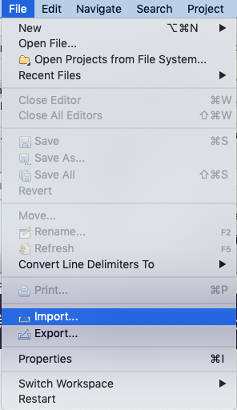

In the _Import_ dialog, expand _Maven_, select  _Existing Maven Projects_, and press _Next_.

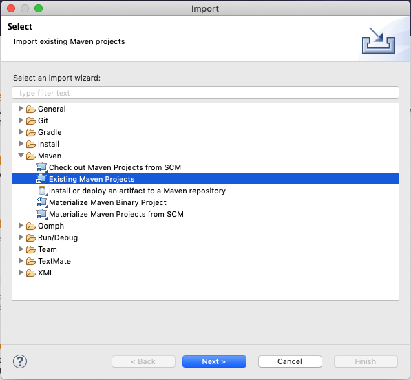

In the next panel, press the _Browse_ button, and, in the file dialog, select the "myapp" directory, and press _Next_.

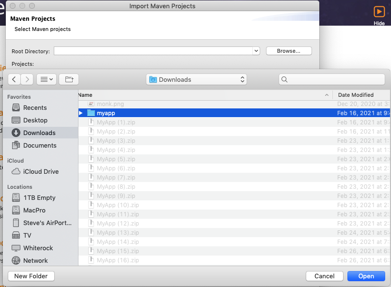

The next panel should look similar to the one below.  Make sure all of the projects are "checked", and press _Finish_.

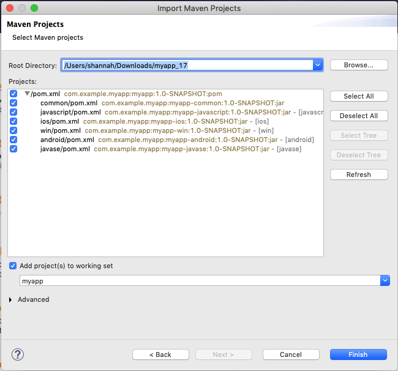

**Almost there, but not quite...**

Next we need to import the Eclipse launch configurations located inside the _tools/eclipse_ directory.

Select _File_ > _Import..._ again, but this time, in the _Import_ dialog, select _Run/Debug_ > _Launch Configurations_ and click _Next_.

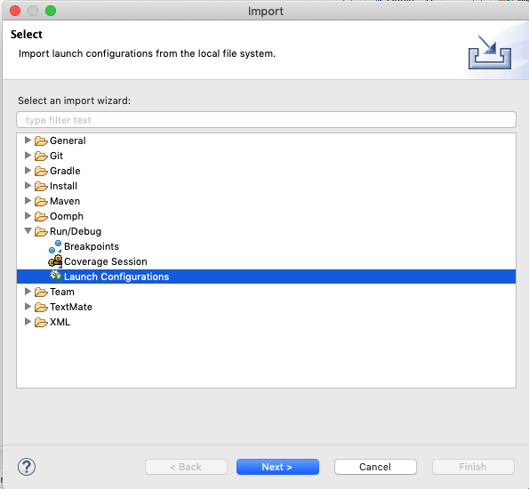

In the next panel, press _Browse..._ then select the _tools/eclipse_ directory.

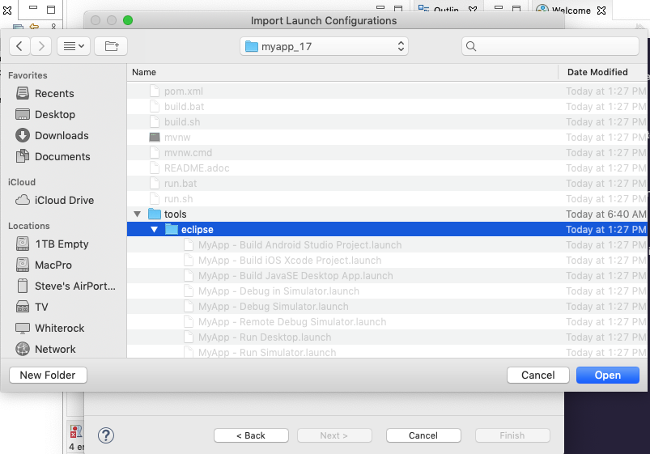

Then check the _eclipse_ option, and press _Finish_

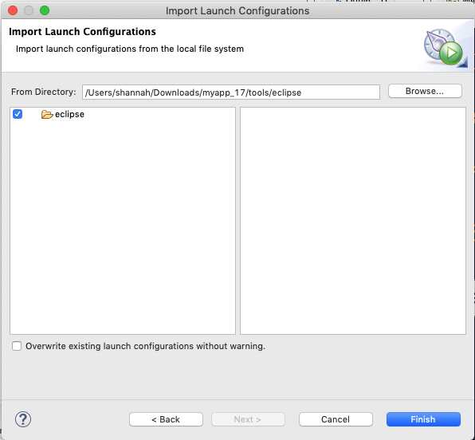

The "Run" button menu should now include options for all of the major build targets.  You can see them by pressing on the _Run_ button in the toolbar:

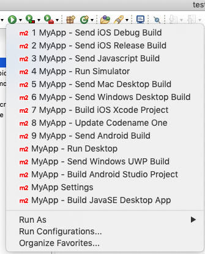

Select the _MyApp - Run Simulator_ option from this menu.

If all goes well it should open in the Codename One simulator.

==== Example: Migrating Kitchen Sink App

Let's consider a concrete example, now.  Download the KitchenSink Ant project from https://github.com/codenameone/KitchenSink/archive/refs/tags/v1.0-cn7.0.11.zip[here] and extract it.

The following is a bash script that uses curl to download this project as a zip file, and then converts it to a fully-functional Maven project.

[source,bash]
----
CN1_VERSION={cn1-plugin-release-version}
curl -L https://github.com/codenameone/KitchenSink/archive/v1.0-cn7.0.11.zip > master.zip
unzip master.zip
rm master.zip
mvn com.codenameone:codenameone-maven-plugin:${CN1_VERSION}:generate-app-project \
  -DarchetypeGroupId=com.codename1 \
  -DarchetypeArtifactId=cn1app-archetype \
  -DarchetypeVersion=${CN1_VERSION} \
  -DartifactId=kitchensink \
  -DgroupId=com.example \
  -Dversion=1.0-SNAPSHOT \
  -DinteractiveMode=false \
  -DsourceProject=KitchenSink-1.0-cn7.0.11
----

NOTE: This command is formatted for the bash prompt (e.g. Linux or Mac).  It will work on Windows also if you use bash.  If you are on Windows and are using PowerShell or the regular command prompt, then you'll need to modiy the command slightly.  In particular, the entire command would need to be on a single line.  (Remove the '\' at the end of each line, and merge lines together, with space between the command-line flags)

This will generate the maven project in a directory named "kitchensink" in the current working directory because of the `-DartifactId=kitchensink` directory.

[#project-dependencies]
=== Adding Project Dependencies

TIP:  For the easiest and recommended approach to adding dependencies to your project, skip to <<managing-addons-in-control-center>>.

One of the reasons to use Maven as the build tool is because it makes the management of project dependencies *almost* trivial.  If the library you want to add is on Maven central, then you can just copy and paste its `<dependency>` snippet into your pom.xml file and you're good to go.  Maven does the rest.

NOTE: See https://maven.apache.org/guides/introduction/introduction-to-dependency-mechanism.html[Introducton to the Dependency Mechanism] on the Maven website for a gentle, but comprehensive introduction to Maven dependencies.

With Codename One projects, there are a few caveats (see <<compliance-check>>), and a few added nicities that make it easier to find and install add-on libraries in your project (see <<managing-addons-in-control-center>>).

==== Which `pom.xml` Do I add the `<dependency>` Snippet to?

Let's assume that you have a Maven `<dependency>` snippet that you've copied from Maven central, and it's burning a hole in your clipboard while you're trying to figure out where to paste it into your project.
Codename One application projects, being multi-module projects, have more than one `pom.xml` file; One per module.

**Question:** Which pom.xml file do I paste my snippet into?

**Answer:** common/pom.xml (almost always).

The "common" module is where nearly all of your Codename One application resides.  It houses your Java and Kotlin files, your CSS files, your GUI builder files, your Codename One configuration files (i.e. `codenameone_settings.properties`).  Pretty much everything.  The only things you'd place in the other modules (e.g. `javase`, `ios`, etc...) are your platform-specific native interface implementations; And in many applications you won't need any of that.

Therefore, when adding dependencies into your app, you'll almost always place them inside the pom.xml file for the "common" module.

TIP: You can add dependencies without needing to modify XML configuration files using the Control Center.  See <<managing-addons-in-control-center>>.

.When to use the "other" pom.xml Files
[sidebar]
****
The instructions say that we *almost* always add dependencies in the common/pom.xml file.  So what are the other modules' pom.xml files for, and when do we need to modify them, or add dependencies to them?

Here's an overview:

%PROJECT_ROOT%/pom.xml::
The root pom.xml file is the parent module of all of other modules.  Anything you add here will be inherited by all of the modules.  It can be helpful to use `<dependencyManagement>` and `<pluginManagement>` sections in this file to consolidate versions for dependencies and plugins project-wide.  This is also a good place to add project meta-data like `<developers>`, `<scm>`.

javase/pom.xml::
Any dependencies that are only required for native implementations on the JavaSE platform can be added here.  Dependencies added to this project are not subject to <<compliance-check, the compliance check>>.
+
Additionally, this module handles the build toolchain for the JavaSE platform.  This includes Mac and Windows Desktop builds, as well as JavaSE desktop builds.  If you want to customize the build workflow for any of these targets, you would do so by adding plugin executions in this pom.xml file.

android, ios, win, and javascript::
These modules don't really use Maven for their dependencies (Android may deserve a small asterisk here, but that's complicated), so the primary thing you'd want to *modify* in these pom.xml files are the build toolchain for those targets.  E.g. You might add plugin executions for your CI workflow on builds targeting these particular platforms.

****

[#maven-dependency-example]
==== Example: Adding Google Maps Dependency via Maven Central

Let's add the GoogleMaps library to our app as a maven dependency.

As described in the https://github.com/codenameone/codenameone-google-maps#maven-dependency[GoogleMaps cn1lib README], the dependency snippet is:

[source,xml]
----
<dependency>
  <groupId>com.codenameone</groupId>
  <artifactId>googlemaps-lib</artifactId>
  <version>1.0.1</version>
  <type>pom</type>
</dependency>
----

You should, however, look on https://search.maven.org/artifact/com.codenameone/googlemaps-lib[Maven central] to see what the latest version number is, and substitute that version into the `<version>` tag of the snippet.

Copy and paste this snippet into the `<dependencies>` section of your common/pom.xml file.  And save it.

[TIP]
====
The common/pom.xml file has *a lot* of existing configuration in it, and it may not be clear, on first glance, where the `<dependencies>` tag is located.  A simple "find" for `<dependencies>` may deliver you a red herring also, since there are a few `<profile>` tags which also include `<dependencies>` sections.

The *correct* `<dependencies>` section, is located near the top of the file.  You can identify it because it will include the following comment:

[source,xml]
----
<!-- INJECT DEPENDENCIES -->
----

This is a special marker that is used by some of the Codename One tooling to help it locate the optimal place to inject dependencies.

**DO NOT REMOVE THIS COMMENT**.  Just add your dependency snippet somewhere before or after it.
====

==== Compatibility with Codename One

You can paste any Maven dependency snippet you like into your project, but libraries that haven't been specifically developed for Codename One might not be compatible.  See <<api>>.  If you are unsure whether a library is compatible, you could just add the dependency and try to use it in your app.  If it isn't compatible, it will fail when you try to build the app, during the <<compliance-check,compliance check>>.

The easiest way to find compatible libraries is to use the <<managing-addons-in-control-center, extensions section of the Control Center>>.  Libraries listed in this section have been build specifically for Codename One and are guaranteed to be compatible.

[#compliance-check]
==== The Compliance Check

All application code in the common module of your Codename One project must be compatible with Codename One.  This includes all dependencies.  When you build your project, it will perform a compliance check to ensure that no code uses unsupported APIs.  (See <<api>>).

If the compliance check fails (i.e. the app uses unsupported APIs), the build will fail.  The error log should provide some clues as to where the offending code resides.

[#managing-addons-in-control-center]
==== Managing Add-Ons in Control Center

As I mention throughout this guide, the best place to find and install add-ons for your project is in the Codename One Control Center (aka Codename One Preferences.  aka Codename One Settings).  See <<settings>>.

From the dashboard, select "Advanced Settings" > "Extensions" in the navigation menu on the left as shown below:

image::img/image-2021-03-08-06-57-26-835.png[Control center navigation menu]

This will bring up a list of available Codename One extensions as shown below:

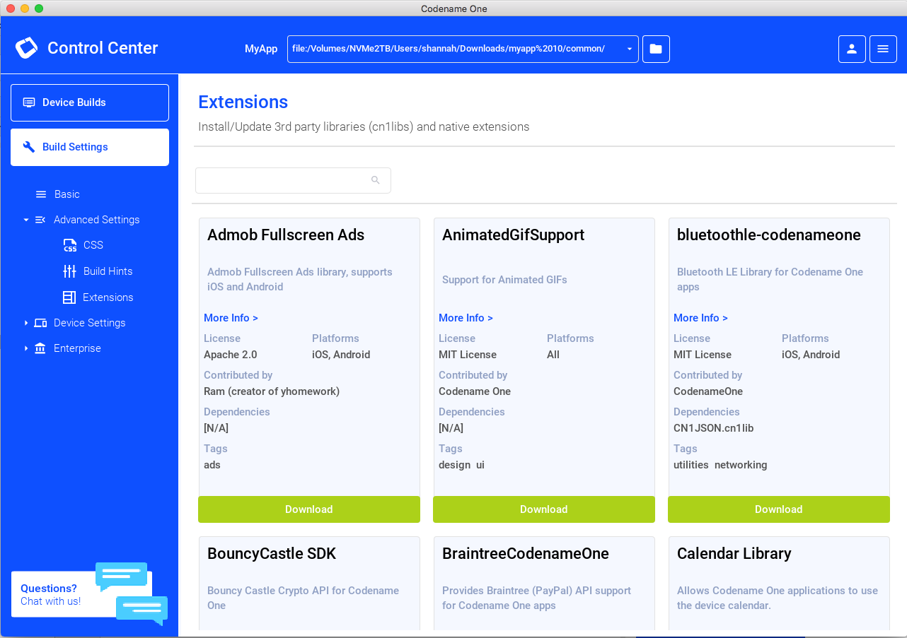

As an example, let's install the "Google Maps" library.

Type in "Maps" into the search box, and it should narrow the options down to three libraries as shown below:

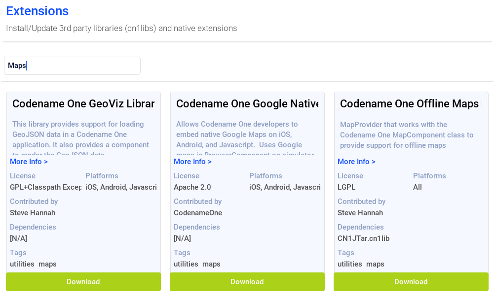

The one in the middle "Codename One Google Native", is the Google maps lib that we want.

Press the "Download" button.

You should see a progress indicator while performs the installation.

.How Control Center Handles Maven Dependencies
[sidebar]
****
Many of the extensions listed in the control center are deployed as cn1lib bundles. Others are deployed on Maven central and *could* simply be installed by adding a snippet into the pom.xml file (as described in <<maven-dependency-example>>).

The control center UI shields you from the details of how it installs the extensions into your app.  For extensions that are deployed on Maven central, it will simply add the Maven dependency for the library directly into your project's common/pom.xml file.  For extensions that are distributed as cn1lib bundles, it uses the `install-cn1lib` Maven goal to install it into your project.

You shouldn't need to worry about this, as it happens seamlessly.  If you are curious, you can look at the `<dependencies>` section of your common/pom.xml file to see the added `<dependency>` tag after you install an extension.
****

==== Installing Legacy cn1libs

The recommended approach for installing add-ons to your project is to use the <<managing-addons-in-control-center, control center>>, or by <<maven-dependency-example, adding the maven dependency to your common/pom.xml file>>.  However, in some situations you may not be able to use those methods.  E.g. If you have a legacy cnlib file that you need to use in your app, and it isn't available on Maven central or the control center.

In cases like this you can use the `install-cn1lib` Maven goal to install it as follows:

[source,bash]
----
mvn cn1:install-cn1lib -Dfile=/path/to/yourlibrary.cn1lib
----

