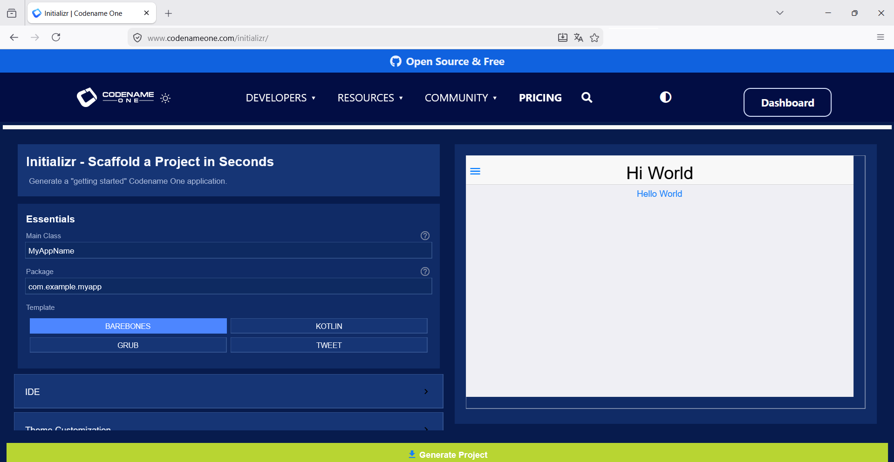
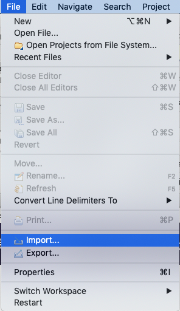
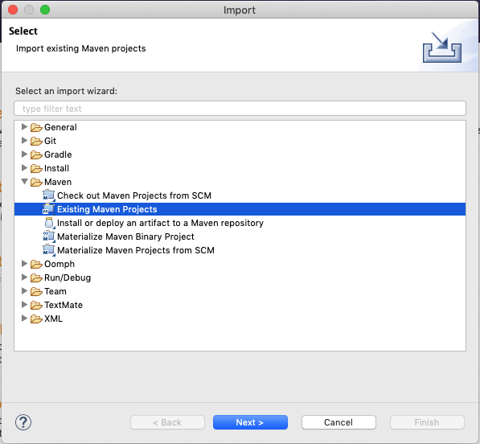
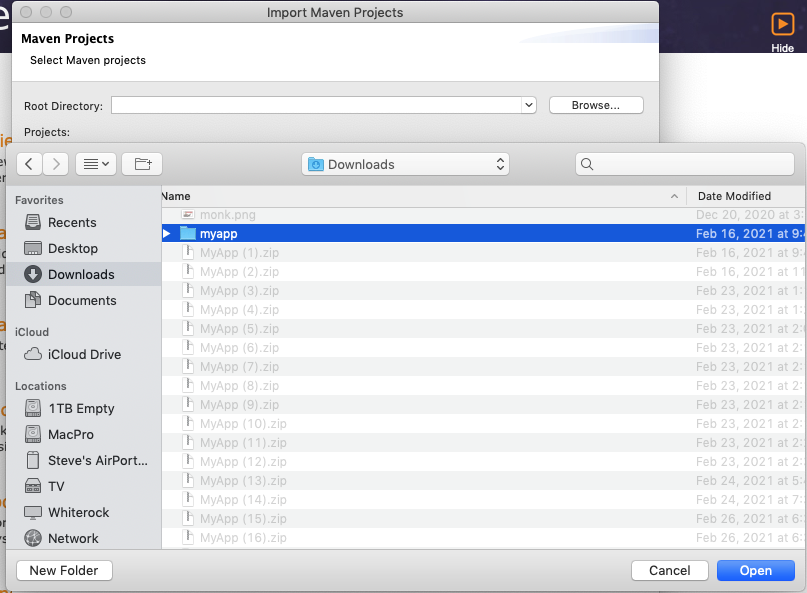
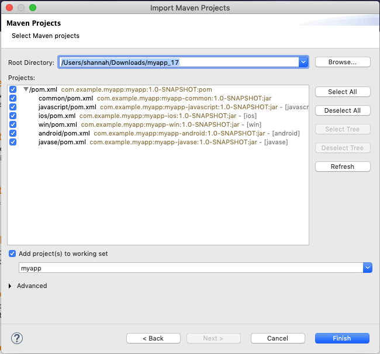
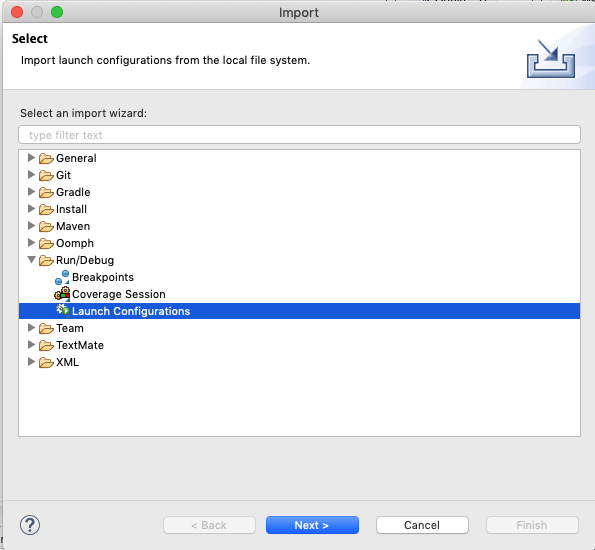
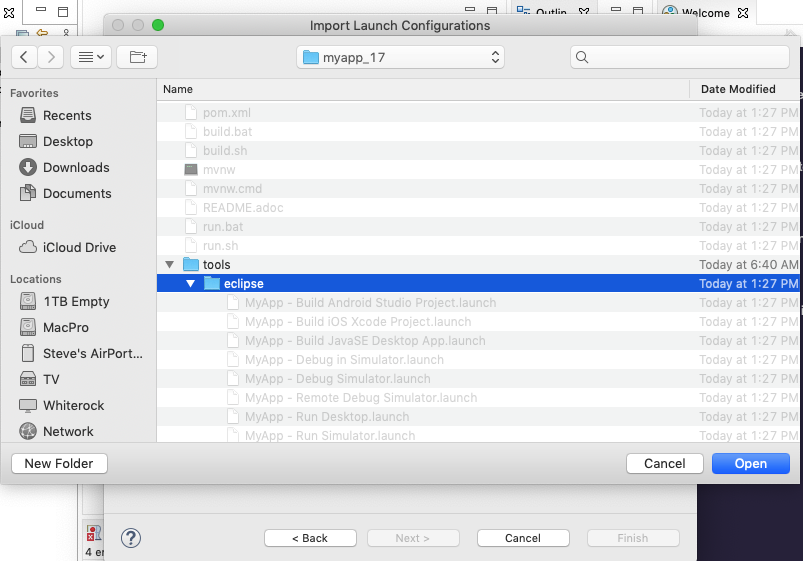
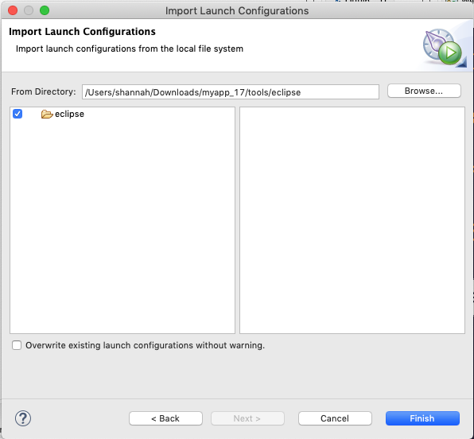
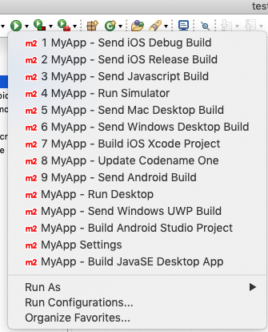
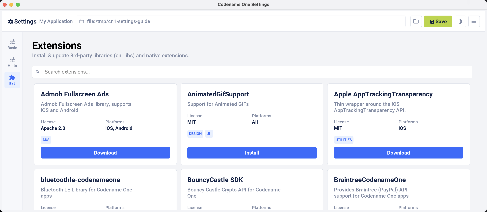

== Getting started

[#prerequisites]
=== Prerequisites

Codename One supports JDK 11 through 25 for running the simulator and the
"Run as desktop app" target. https://adoptium.net[Eclipse Temurin] is the
easiest source of a supported JDK on macOS, Windows, and Linux.

After installing the JDK, point `JAVA_HOME` at it and confirm with:

[source,bash]
----
include::../demos/common/src/main/snippets/developer-guide/maven-getting-started.sh[tag=maven-getting-started-bash-001,indent=0]
----

Both should report Java 11 or newer. The Codename One Maven plugin checks the
runtime JDK version when you invoke `mvn cn1:run` or `mvn cn1:debug` and fails
fast with a friendly message if it's older than 11. Build-only goals (such as
`-Pexecutable-jar`) still work on older JDKs.

[#creating-app-project]
=== Creating a new project

==== Codename One initializr

The easiest way to create a new project is to use the https://www.codenameone.com/initializr[Codename One initializr].

This tool will allow you to choose from a growing selection of project templates, and download a starter project that you can open in your preferred IDE (IntelliJ IDEA, NetBeans, etc.), or build directly on the command-line using Maven.

The starter projects are based on the <<cn1app-archetype>>.

[TIP]
====
The following tutorials provide step-by-step instructions for getting started with bare-bones app templates. Those tutorials are a better starting place for Codename One development than this manual, as they're written in tutorial form.

**Java Getting Started Tutorial:**

See https://shannah.github.io/cn1-maven-archetypes/cn1app-archetype-tutorial/getting-started.html[Getting Started with the Bare-bones Java App Template].

**Kotlin Getting Started Tutorial:**

See https://shannah.github.io/cn1app-archetype-kotlin-template/getting-started.html[Getting Started with the Bare-bones Kotlin App Template].

====

==== Generating a new project from the command-line

[#cn1app-archetype-example]
===== Bare-bones Java project

If you prefer to generate your projects directly on the command-line, you can use the <<cn1app-archetype>> to generate the project directly on the command-line:

[source,bash]
----
include::../demos/common/src/main/snippets/developer-guide/maven-getting-started.sh[tag=maven-getting-started-bash-002,indent=0]
----

This will generate a project in the current directory. The project's directory will have the same name as the artifact ID you specified here. For example, If your command had `-DartifactId=myapp`, then the project will be located in a newly created directory named "myapp."

NOTE: If you haven't used Maven archetypes before, this snippet may be confusing. See https://maven.apache.org/guides/introduction/introduction-to-archetypes.html[Introduction to Maven Archetypes] to get up to speed.

This command uses the <<#cn1app-archetype>> which has the following Maven coordinates:

[source,xml]
----
include::../demos/common/src/main/snippets/developer-guide/maven-getting-started.xml[tag=maven-getting-started-xml-001,indent=0]
----

This archetype generates a bare-bones Java project (the same one described in https://shannah.github.io/cn1-maven-archetypes/cn1app-archetype-tutorial/getting-started.html[Getting Started with the Bare-bones Java App Template]).

TIP: View the source of the cn1app-archetype project https://github.com/shannah/cn1-maven-archetypes/tree/master/cn1app-archetype[here].

You can learn more about using the archetype in <<cn1app-archetype, the appendix>>.

===== Project templates

The https://shannah.github.io/cn1app-archetype-kotlin-template/getting-started.html[bare-bones Kotlin App project template] is an alternative starter project that uses Kotlin as the primary language instead of Java. It's built on the <<cn1app-archetype,cn1app-archetype>> at its core, but it includes some more configuration settings and sources to change the template. You can use such templates as starter projects by using the `generate-app-project` goal of the Codename One Maven plugin.

Here is an example which generates a project based on the bare-bones Kotlin template:

[source,bash,subs="+attributes"]
----
include::../demos/common/src/main/snippets/developer-guide/maven-getting-started.sh[tag=maven-getting-started-bash-003,indent=0]
----

NOTE: This command is formatted for the bash prompt (for example, Linux or Mac). It will work on Windows also if you use bash. If you're on Windows and are using PowerShell or the regular command prompt, then you'll need to modify the command slightly. In particular, the entire command would need to be on a single line. (Remove the '\' at the end of each line, and merge lines together, with space between the command-line flags)

Like the `archetype:generate` goal, this will create the project in a directory named after your specified artifact ID. For example, If your command included `-DartifactId=myapp`, then the project would be in a newly created directory named "myapp."

Some notes here:

. The `com.codenameone:codenameone-maven-plugin:{cn1-plugin-release-version}:generate-app-project` argument is the fully qualified goal name for the `generate-app-project`. This is necessary since you aren't running this goal in the context of any existing project. You should adjust the version number (`{cn1-plugin-release-version}`) to reflect the https://search.maven.org/search?q=a:codenameone-maven-plugin[latest available Codename One version on Maven Central].
. The `archetypeGroupId`, `archetypeArtifactId`, and `archetypeVersion` parameters are the same as when using the `archetype:generate` goal, and they will (almost) always refer to the <<cn1app-archetype>>.
. The `groupId`, `artifactId`, and `version` work the same as for the `archetype:generate` goal. That's, that they specify the coordinates for your newly created project.
. The `mainName` specifies the Main class name for your app. This is the class name, and shouldn't include the full package. For example, `MyApp`, not "com.example.MyApp"
. The `sourceProject` property is the path to the "template" project. In this case, you will assume that you've cloned the https://github.com/shannah/cn1app-archetype-kotlin-template[bare-bones Kotlin project template repository] at /path/to/kotlin-example-app.

[TIP]
====
A project template isn't much different than a regular project. The template can be either a legacy Ant project, or a new Maven project. In fact, this goal is the same one you would use to <<migrate-existing-project, migrate a legacy Ant project>> to use the new Maven project structure.

See <<creating-project-templates>> for instructions on building your own project templates.
====

[#migrate-existing-project]
=== Migrating an existing project

If you have an existing Codename One application project that uses the old Ant project structure, you can use the `generate-app-project` goal to migrate the project over to maven. This goal doesn't make any changes to the Ant project. It creates a new Maven project and copies over all the project sources and libraries, reorganized to fit the new project structure.

A minimal invocation of this goal would look like:

[source,bash,subs="+attributes"]
----
include::../demos/common/src/main/snippets/developer-guide/maven-getting-started.sh[tag=maven-getting-started-bash-004,indent=0]
----

NOTE: This command is formatted for the bash prompt (for example, Linux or Mac). It will work on Windows also if you use bash. If you're on Windows and are using PowerShell or the regular command prompt, then you'll need to modify the command slightly. In particular, the entire command would need to be on a single line. (Remove the '\' at the end of each line, and merge lines together, with space between the command-line flags)

This will generate the new project in the current directory inside a folder named after the `artifactId` parameter.

After building the project, try running it to make sure that the migration worked. For example, Assuming that your artifactId was myapp:

==== Command line

[source,bash,subs="+attributes"]
----
include::../demos/common/src/main/snippets/developer-guide/maven-getting-started.sh[tag=maven-getting-started-bash-005,indent=0]
----

NOTE: On Windows it would be `run.bat` instead of `run.sh`.

If All goes well, your app should open in the Codename One simulator.

==== IntelliJ IDEA

Open the `myapp` folder in IntelliJ. Then press the "Run"  button in the upper right of the toolbar.

If All goes well, your app should open in the Codename One simulator.

==== NetBeans

IMPORTANT: Before opening the project in NetBeans, be sure to copy the files in the _tools/netbeans_ directory into the root directory. These are necessary for NetBeans to run, build, and debug the project.

Open the `myapp` folder as a project in NetBeans. Then press the "Run"  button on the toolbar.

If all goes well it should open in the Codename One simulator.

==== Eclipse IDE

Open Eclipse, and select "File" > "Import..."

In the _Import_ dialog, expand _Maven_, select _Existing Maven Projects_, and press _Next_.

In the next panel, press the _Browse_ button, and, in the file dialog, select the "myapp" directory, and press _Next_.

The next panel should look like the one below. Make sure all the projects are "checked," and press _Finish_.

**Almost there, but not quite...**

Next you need to import the Eclipse launch configurations located inside the _tools/eclipse_ directory.

Select _File_ > _Import..._ again, but this time, in the _Import_ dialog, select _Run/Debug_ > _Launch Configurations_ and click _Next_.

In the next panel, press _Browse..._ then select the _tools/eclipse_ directory.

Then check the _eclipse_ option, and press _Finish_

The "Run" button menu should now include options for all the major build targets. You can see them by pressing on the _Run_ button in the toolbar:

Select the _MyApp - Run Simulator_ option from this menu.

If all goes well it should open in the Codename One simulator.

==== Example: Migrating kitchen sink app

Consider a concrete example, now. Download the KitchenSink Ant project from https://github.com/codenameone/KitchenSink/archive/refs/tags/v1.0-cn7.0.11.zip[here] and extract it.

The following is a bash script that uses curl to download this project as a zip file, and then converts it to a fully functional Maven project:

[source,bash,subs="+attributes"]
----
include::../demos/common/src/main/snippets/developer-guide/maven-getting-started.sh[tag=maven-getting-started-bash-006,indent=0]
----

NOTE: This command is formatted for the bash prompt (for example, Linux or Mac). It will work on Windows also if you use bash. If you're on Windows and are using PowerShell or the regular command prompt, then you'll need to modify the command slightly. In particular, the entire command would need to be on a single line. (Remove the '\' at the end of each line, and merge lines together, with space between the command-line flags)

This will generate the maven project in a directory named "kitchensink" in the current working directory because of the `-DartifactId=kitchensink` directory.

[#project-dependencies]
=== Adding project dependencies

TIP: For the easiest and recommended approach to adding dependencies to your project, skip to <<managing-addons-in-control-center>>.

One of the reasons to use Maven as the build tool is because it makes the management of project dependencies *almost* trivial. If the library you want to add is on Maven central, then you can copy and paste its `<dependency>` snippet into your pom.xml file and you're good to go. Maven does the rest.

NOTE: See https://maven.apache.org/guides/introduction/introduction-to-dependency-mechanism.html[Introduction to the Dependency Mechanism] on the Maven website for a gentle, but comprehensive introduction to Maven dependencies.

With Codename One projects, there are a few caveats (see <<compliance-check>>), and a few added niceties that make it easier to find and install add-on libraries in your project (see <<managing-addons-in-control-center>>).

==== Which `pom.xml` to add the `<dependency>` snippet to

Suppose you have a Maven `<dependency>` snippet that you've copied from Maven central, and it's burning a hole in your clipboard while you're trying to figure out where to paste it into your project.
Codename One application projects, being multi-module projects, have more than one `pom.xml` file; One per module.

**Question:** Which pom.xml file should you paste the snippet into?

**Answer:** common/pom.xml (almost always).

The "common" module is where all your Codename One application resides. It houses your Java and Kotlin files, your CSS files, your GUI builder files, your Codename One configuration files (that is, `codenameone_settings.properties`). Pretty much everything. The things you'd place in the other modules (for example, `Java SE`, `ios`, etc.) are your platform-specific native interface implementations; And in many applications you won't need any of that.

When adding dependencies into your app, you'll therefore almost always place them inside the pom.xml file for the "common" module.

TIP: You can add dependencies without editing XML by launching Codename One Settings with `mvn cn1:settings`. See <<managing-addons-in-control-center>>.

.When to use the "other" pom.xml Files
[sidebar]
****
The instructions say that you *almost* always add dependencies in the common/pom.xml file. What are the other modules' pom.xml files for, and when do you need to change them, or add dependencies to them?

Here's an overview:

%PROJECT_ROOT%/pom.xml::
The root pom.xml file is the parent module of all other modules. Anything you add here will be inherited by all the modules. It can be helpful to use `<dependencyManagement>` and `<pluginManagement>` sections in this file to merge versions for dependencies and plugins project-wide. This is also a good place to add project meta-data like `<developers>`, `<scm>`.

Java SE/pom.xml::
Any dependencies that are only required for native implementations on the Java SE platform can be added here. Dependencies added to this project aren't subject to <<compliance-check, the compliance check>>.
+
Additionally, this module handles the build toolchain for the Java SE platform. This includes Mac and Windows Desktop builds, as well as Java SE desktop builds. If you want to customize the build workflow for any of these targets, you would do so by adding plugin executions in this pom.xml file.

android, ios, win, and JavaScript::
These modules don't use Maven for their dependencies (Android may deserve a small asterisk here, but that's complicated), so the primary thing you'd want to *change* in these pom.xml files are the build toolchain for those targets. For example, You might add plugin executions for your CI workflow on builds targeting these particular platforms.

****

[#maven-dependency-example]
==== Example: Adding Google Maps dependency via Maven central

Add the GoogleMaps library to your app as a maven dependency.

As described in the https://github.com/codenameone/codenameone-google-maps#maven-dependency[GoogleMaps cn1lib README], the dependency snippet is:

[source,xml]
----
include::../demos/common/src/main/snippets/developer-guide/maven-getting-started.xml[tag=maven-getting-started-xml-002,indent=0]
----

You should, but, look on https://search.maven.org/artifact/com.codenameone/googlemaps-lib[Maven central] to see what the latest version number is, and substitute that version into the `<version>` tag of the snippet.

Copy and paste this snippet into the `<dependencies>` section of your common/pom.xml file. And save it.

[TIP]
====
The common/pom.xml file has *a lot* of existing configuration in it, and it may not be clear, on first glance, where the `<dependencies>` tag is located. A simple "find" for `<dependencies>` may also lead you astray, since there are a few `<profile>` tags which also include `<dependencies>` sections.

The *correct* `<dependencies>` section, is located near the top of the file. You can identify it because it will include the following comment:

[source,xml]
----
include::../demos/common/src/main/snippets/developer-guide/maven-getting-started.xml[tag=maven-getting-started-xml-003,indent=0]
----

This is a special marker that's used by some Codename One tooling to help it locate the optimal place to inject dependencies.

**Don't REMOVE THIS COMMENT**. Just add your dependency snippet somewhere before or after it.
====

==== Compatibility with Codename One

You can paste any Maven dependency snippet you like into your project, but libraries that haven't been specifically developed for Codename One might not be compatible. See <<api>>. If you're unsure whether a library is compatible, you could add the dependency and try to use it in your app. If it isn't compatible, it will fail when you try to build the app, during the <<compliance-check,compliance check>>.

The easiest way to find Codename One libraries is to use the <<managing-addons-in-control-center,Extensions view in Codename One Settings>>. These libraries were built specifically for Codename One. Settings warns before installing catalog entries known to target older Codename One releases.

[#compliance-check]
==== The compliance check

All application code in the common module of your Codename One project must be compatible with Codename One. This includes all dependencies. When you build your project, it will perform a compliance check to ensure that no code uses unsupported APIs. (See <<api>>).

If the compliance check fails (that is, the app uses unsupported APIs), the build will fail. The error log should provide some clues about where the offending code resides.

[#managing-addons-in-control-center]
==== Managing add-ons in Codename One Settings

Launch Codename One Settings from the project root, then select *Extensions* in the left navigation rail:

[source,shell]
----
include::../demos/common/src/main/snippets/developer-guide/maven-appendix-control-center.sh[tag=maven-appendix-control-center-bash-001,indent=0]
----

As an example, install the "Google Maps" library.

Type `Maps` in the search field and locate `Codename One Google Native`, the Google Maps library.

Click *Install* or *Download*, depending on how the catalog entry is distributed.

Settings shows progress while it installs the extension. For an installed extension, click the same action area and confirm *Uninstall* to remove it.

.How Codename One Settings handles Maven dependencies
[sidebar]
****
Many extensions listed in Settings are deployed as cn1lib bundles. Others are deployed on Maven Central and *could* be installed by adding a snippet to `pom.xml` (as described in <<maven-dependency-example>>).

Settings shields you from the details of how it installs extensions. For extensions deployed on Maven Central, it adds the dependency directly to your project's `common/pom.xml`. For extensions distributed as cn1lib bundles, it uses the `install-cn1lib` Maven goal.

You shouldn't need to worry about this, as it happens seamlessly. If you're curious, you can look at the `<dependencies>` section of your common/pom.xml file to see the added `<dependency>` tag after you install an extension.
****

==== Installing legacy cn1libs

The recommended approach for installing add-ons is to use <<managing-addons-in-control-center,Codename One Settings>> or <<maven-dependency-example,add the Maven dependency to `common/pom.xml`>>. In some situations neither method is available. For example, you might have a legacy cn1lib file that isn't listed in the extension catalog or deployed to Maven Central.

In cases like this you can use the `install-cn1lib` Maven goal to install it as follows:

[source,bash]
----
include::../demos/common/src/main/snippets/developer-guide/maven-getting-started.sh[tag=maven-getting-started-bash-007,indent=0]
----
