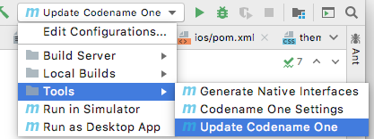
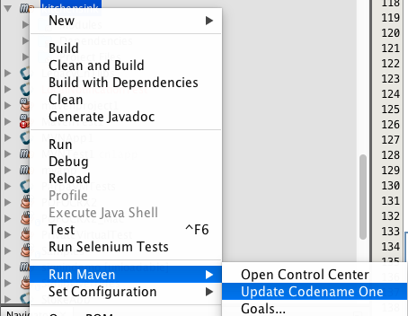

[#updating]
== Updating Codename One
Codename One releases new versions weekly on Maven central.  It is recommended that you stay up to date with the latest version as much as possible to ensure compatibility with the Codename One build server, which is always running the latest version.

You can use the <<update-goal, update goal>> to update both the Codename One libraries, and the Codename One dependencies in your project.

e.g.

[source,bash]
----
mvn cn:update
----

[discrete]
=== CLI

Alternatively you can use the `run.sh/run.bat` script to run this goal as follows:

[source,bash]
----
./run.sh update
----

NOTE: Use `run.bat update` instead on Windows

[discrete]
=== IntelliJ

Alternatively you can click on the "Configuration" menu, and select "Tools" > "Update Codename One" as shown here:

Then press the image:img/intellij-run-icon.png[Run] button.

[discrete]
=== NetBeans

Alternatively you can right click on the project in the project inspector, and select "Run Maven" > "Update Codename One" as shown here:

Then press the image:img/netbeans-run-icon.png[Run] button.

[discrete]
=== Manually Updating the pom.xml file

You can also update your Codename One dependencies manually by modifying the `cn1.version` and `cn1.plugin.version` properties defined in your project's `pom.xml` file.

E.g. Open the `pom.xml` file, and look for the following:

[source,xml]
----
<cn1.plugin.version>{cn1-plugin-release-version}</cn1.plugin.version>
<cn1.version>{cn1-release-version}</cn1.version>
----

Change these values to reflect the latest version of the `codenameone-maven-plugin` found https://search.maven.org/artifact/com.codenameone/codenameone-maven-plugin[here].

NOTE: Updating the `cn1.plugin.version` and `cn1.version` properties manually will update the Maven dependencies for your project but it won't update the other Codename One tools such as the GUI builder, and the Build Server Client, which are managed outside of Maven.  You should use the <<update-goal>> as described at the beginning of <<updating, this section>> to perform a "full" update.

