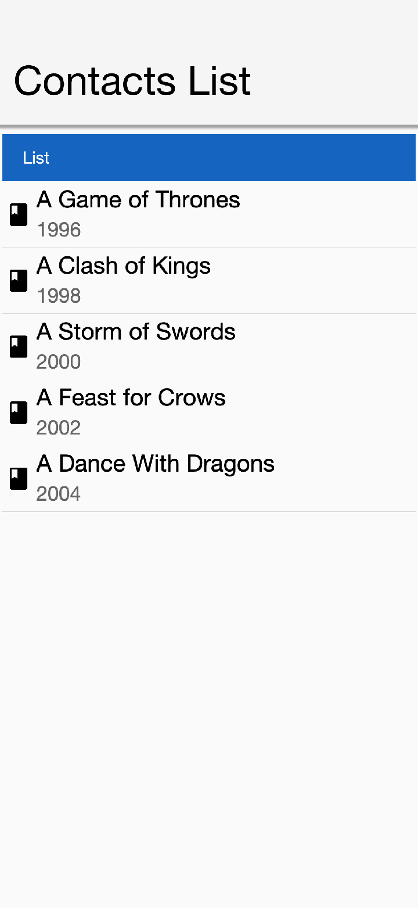
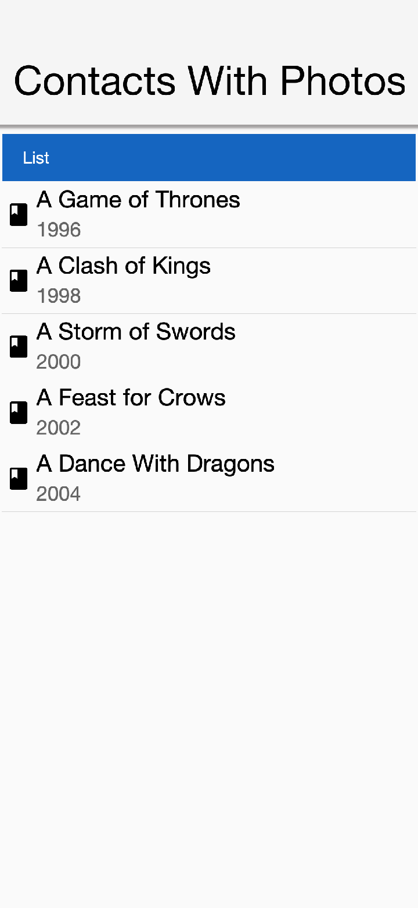
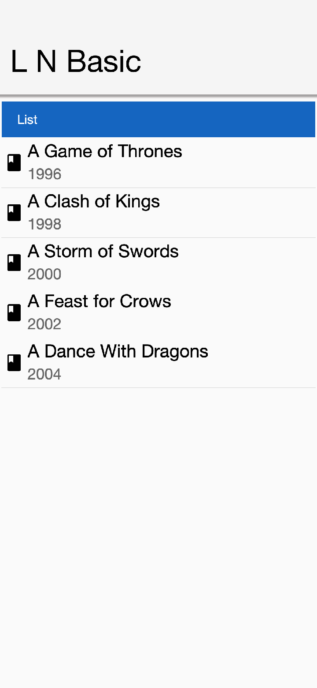
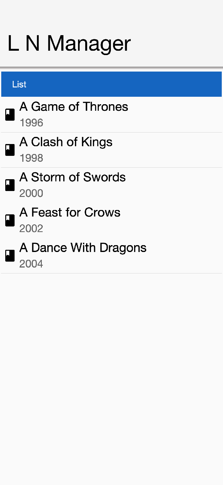
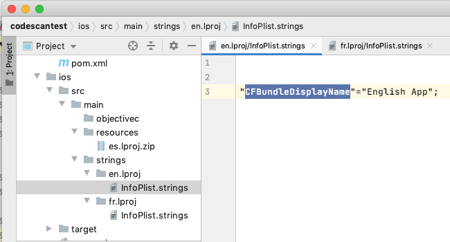
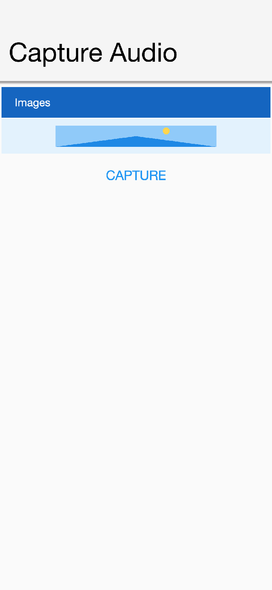
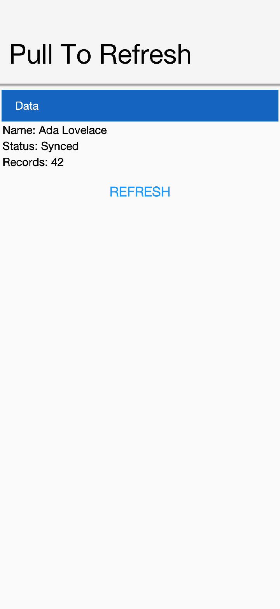

== Miscellaneous features

=== Phone functions

Most of the low-level phone functionality is accessible in the https://www.codenameone.com/javadoc/com/codename1/ui/Display.html[Display] class. Think of it as a global class that covers access to the "system."

==== SMS

Codename One supports sending SMS messages but not receiving them as this functionality isn't portable. You can send an SMS using either the `Display` singleton or the static helper methods on `CN`. Both APIs throw `IOException`, which you should handle in case the native layer reports a failure:

[source,java]
----
include::../demos/common/src/main/java/com/codenameone/developerguide/snippets/generated/MiscellaneousFeaturesJava001Snippet.java[tag=miscellaneous-features-java-001,indent=0]
----

Android supports sending SMS messages in the background without any UI. iOS doesn't provide that ability, so the best it can offer is to launch the native SMS app with your message composed for the user to send. Android supports that interactive flow as well (launching the OS native SMS app).

The default `sendSMS` API ignores that difference and works interactively on iOS while sending
in the background for Android when the platform allows it.

The `getSMSSupport` API returns one of the following options:

- SMS_NOT_SUPPORTED - for desktop, tablet etc.
- SMS_SEAMLESS - `sendSMS` won't show a UI and will send in the background
- SMS_INTERACTIVE - `sendSMS` will show an SMS sending UI
- SMS_BOTH - `sendSMS` can support both seamless and interactive mode, this works on Android

The `sendSMS` can accept an interactive argument: `sendSMS(String phoneNumber, String message, boolean interactive)`

The last argument will be ignored unless `SMS_BOTH` is returned from `getSMSSupport` at which point you
would be able to choose one way or the other. The default behavior (when not using that flag) is the background
sending which is the current behavior on Android.

A typical use of this API would be something like this:

==== Dialing

Dialing the phone is pretty trivial. This should open the dialer UI without physically dialing the phone, as that's discouraged by device vendors.

You can dial the phone by using:

[source,java]
----
include::../demos/common/src/main/java/com/codenameone/developerguide/snippets/generated/MiscellaneousFeaturesJava003Snippet.java[tag=miscellaneous-features-java-003,indent=0]
----

==== Call detection

Codename One includes a generic call detection API through `Display.isCallDetectionSupported()` and `Display.isInCall()`.

This API is intentionally *best effort* and should be used as a UX hint (for example, to defer a non-critical animation while the app is interrupted).

On iOS, `isInCall()` is inferred from app interruption lifecycle events, which means it can report `true` for non-call interruptions (for example: Control Center, app switching, permission sheets), and some call flows may still be missed.

Because iOS toggles this flag during app lifecycle transitions, polling it with a `UITimer` can miss the interruption window entirely (timers are paused while the app is inactive, and the flag is reset when the app becomes active again). If you need to react, check it from lifecycle callbacks such as your app's `stop()`/`start()` flow instead of periodic polling.

On Android, call detection is unsupported because robust detection would require invasive telephony permissions that are intentionally avoided:

[source,java]
----
include::../demos/common/src/main/java/com/codenameone/developerguide/snippets/generated/MiscellaneousFeaturesJava004Snippet.java[tag=miscellaneous-features-java-004,indent=0]
----

==== E-Mail

You can send an email through the platforms native email client with code such as this:

[source,java]
----
include::../demos/common/src/main/java/com/codenameone/developerguide/snippets/generated/MiscellaneousFeaturesJava005Snippet.java[tag=miscellaneous-features-java-005,indent=0]
----

You can add one attachment by using `setAttachment` and `setAttachmentMimeType`.

NOTE: You need to use files from `FileSystemStorage` and *NOT* `Storage` files!

You can add more than one attachment by putting them directly into the attachment map for example:

NOTE: Some features such as attachments etc. Don't work in the simulator but should work on iOS/Android

=== Larger text accessibility

Codename One can adapt to the operating system’s larger text accessibility setting. The https://www.codenameone.com/javadoc/com/codename1/ui/Display.html[Display] APIs expose two signals: `isLargerTextEnabled()` indicates whether the user has enabled larger text, and `getLargerTextScale()` returns the scale factor that should be applied to fonts.

If you want the theme system to automatically scale its fonts when larger text is enabled, enable the https://www.codenameone.com/javadoc/com/codename1/ui/plaf/UIManager.html[UIManager] setting:

[source,java]
----
include::../demos/common/src/main/java/com/codenameone/developerguide/snippets/generated/MiscellaneousFeaturesJava007Snippet.java[tag=miscellaneous-features-java-007,indent=0]
----

You can also enable this behavior in the theme by setting the `useLargerTextScaleBool` theme constant to `true`.

If you need to apply the scale manually for custom fonts or layout calculations, read the values directly:

==== How the scale is computed per platform

* *iOS:* the scale is the ratio between the body text size at the user's current Dynamic Type setting and the iOS standard 17pt body size, that is, `[UIFont preferredFontForTextStyle:UIFontTextStyleBody].pointSize / [UIFont systemFontSize]`. Scales for the standard slider stops range from `0.82×` (Extra Small) through `1.00×` (Large, default) up to `1.35×` (Extra Extra Large). When the user enables _Larger Accessibility Sizes_ in Settings → Accessibility → Display & Text Size → Larger Text, the slider extends with five more stops whose scales reach as high as `3.12×`. These values match what every native iOS app sees from `UIFontMetrics`.
* *Android:* the scale is `Configuration.fontScale`, which is bucketed by Android (typically `0.85`, `1.0`, `1.15`, `1.30`).

NOTE: Because the scale is multiplicative, a base font size that's already larger than the platform default will compound. For example, a `defaultFontSizeInt: 18` in your CSS is 6% larger than iOS's 17pt body, so at iOS Dynamic Type _Extra Extra Large_ (`1.35×`) your text will render at `24.3pt` versus a native iOS app's `23pt`. If you intentionally use a base size larger than the platform default and you also enable `useLargerTextScaleBool`, expect the absolute size at high accessibility settings to be visibly larger than typical native apps. Many native iOS apps cap Dynamic Type via `UIFontMetrics maximumPointSize:` for non-text-heavy UIs to avoid layout breakage.

==== Previewing in the simulator

The JavaSE simulator includes a *Simulate → Larger Text* menu that lets you preview every iOS Dynamic Type stop (Extra Small through Accessibility 5) without leaving your desktop. The simulator returns the same scale factor that the corresponding iOS device would report, so this is the recommended way to verify how your UI behaves at each setting before testing on hardware. The selected stop is persisted across simulator restarts.

TIP: If your app looks correct in the simulator at _Large (default)_ but fonts appear oversized on your iPhone with the Display & Brightness slider near the middle, check whether _Settings → Accessibility → Display & Text Size → Larger Text → Larger Accessibility Sizes_ is enabled on the device. When that toggle is on, the system reports the larger _Accessibility_ size categories whose scales begin at `1.65×` and exceed what the standard slider can reach.

=== Contacts API

The contacts API provides you with the means to query the phone’s address book, delete elements from it and create new entries into it. To get the platform specific list of contacts you can use
`String[] contacts = ContactsManager.getAllContacts();`

Notice that on some platforms this will prompt the user for permissions and the user might choose not to grant that permission. To detect whether this is the case you can invoke `isContactsPermissionGranted()` after invoking `getAllContacts()`. This can help you adapt your error message to the user.

Once you have a https://www.codenameone.com/javadoc/com/codename1/contacts/Contact.html[Contact] you can use the `getContactById` method, but the default method is a bit slow if you want to pull a large batch of contacts. The solution for this is to extract the data that you need through

Here you can specify true for the attributes that actually matter to you.

Another capability of the contacts API is the ability to extract all the contacts. This isn't supported on all platforms but platforms such as Android can get a boost from this API as extracting the contacts one by one is slow on Android.

You can check if a platform supports the extraction of all the contacts through `ContactsManager.isAllContactsFast()`.

IMPORTANT: When retrieving all the contacts, notice that you should probably not retrieve all the data and should set some fields to false to perform a more efficient query

You can then extract all the contacts using code that looks a bit like this, notice that you use a thread so the UI won't be blocked!

.List of contacts

Notice that you didn't fetch the image of the contact as the performance of loading these images might be prohibitive. You can enhance the code above to include images by using slightly more complex code such as this:

TIP: The `scheduleBackgroundTask` method is like `new Thread()` in some regards. It places elements in a queue instead of opening too many threads so it can be good for non-urgent tasks

.Contacts with the default photos on the simulator, on device these will use actual user photos when available

TIP: Notice that the code above uses `callSerially` & `scheduleBackgroundTask` in a liberal nested way. This is important to avoid an EDT violation

You can use `createContact(String firstName, String familyName, String officePhone, String homePhone, String cellPhone, String email)` to add a new contact and deleteContact(String id) to delete a contact.

=== Localization & internationalization (L10N & I18N)

Localization (l10n) means adapting to a locale which is more than translating to a specific language but also to a specific language within environment for example: `en_US!= en_UK`.
Internationalization (i18n) is the process of creating one application that adapts to all locales and regional requirements.

Codename One supports automatic localization and seamless internationalization of an application using Java properties bundles.

Place locale-specific properties files inside an `l10n` directory directly under your module’s `main` directory (for example: `common/src/main/l10n`).
Each file inside this directory is treated as a resource bundle and will be packaged automatically with your app, allowing you to version translations alongside the rest of your source code.

When you're iterating on translations you can also use the simulator to capture bundles automatically.
Open the Simulator menu and enable *Auto Update Default Bundle* so that running your app in the Codename One simulator will create any missing resource bundles on the fly as you interact with the UI, which makes it simple to populate keys without manually editing files during development.
You can install the bundle using code like this:

The device language (as an ISO 639 two-letter code) could be retrieved with this:

[source,java]
----
include::../demos/common/src/main/java/com/codenameone/developerguide/snippets/generated/MiscellaneousFeaturesJava013Snippet.java[tag=miscellaneous-features-java-013,indent=0]
----

Once installed a resource bundle takes over the UI and every string set to a label (and label like components) will be automatically localized based on the bundle. You can also use the localize method of https://www.codenameone.com/javadoc/com/codename1/ui/plaf/UIManager.html[UIManager] to perform localization on your own:

[source,java]
----
include::../demos/common/src/main/java/com/codenameone/developerguide/snippets/generated/MiscellaneousFeaturesJava014Snippet.java[tag=miscellaneous-features-java-014,indent=0]
----

The list of available languages in the resource bundle could be retrieved like this. Notice that this a list that was set by you and doesn't need to confirm to the ISO language code standards:

An exception for localization is the `TextField`/`TextArea` components both of which contain user data, in those cases the text won't be localized to avoid accidental localization of user input.

TIP: You can export and import resource bundles as standard Java properties files, CSV and XML. The formats are pretty standard for most localization shops, the XML format Codename One supports is the one used by Android’s string bundles which means most localization specialists should localize it

The resource bundle is a map between keys and values for example: the code below displays `"This Label is localized"` on the `Label` with the hardcoded resource bundle. It would work the same with a resource bundle loaded from a resource file:

[source,java]
----
include::../demos/common/src/main/java/com/codenameone/developerguide/snippets/generated/MiscellaneousFeaturesJava016Snippet.java[tag=miscellaneous-features-java-016,indent=0]
----

.Localized label

==== Localization manager

The https://www.codenameone.com/javadoc/com/codename1/l10n/L10NManager.html[L10NManager] class includes a multitude of features useful for common localization tasks.

It allows formatting numbers/dates & time based on platform locale. It also provides a great deal of the information you need such as the language/locale information you need to pick the proper resource bundle:

.Localization formatting/parsing and information

==== RTL/Bidi

RTL stands for right to left, in the world of internationalization it refers to languages that are written from right to left (Arabic, Hebrew, Syriac, Thaana).

Most western languages are written from left to right (LTR), but some languages are written from right to left (RTL) speakers of these languages expect the UI to flow in the opposite direction otherwise it seems weird like reading this word would be to most English speakers: "drieW."

The problem posed by RTL languages is known as BiDi (Bi-directional) and not as RTL since the "true" problem isn't the reversal of the writing/UI but rather the mixing of RTL and LTR together. For example: numbers are always written from left to right ( like in English) so in an RTL language the direction is from right to left and once you reach a number or English text embedded in the middle of the sentence (such as a name) the direction switches for a duration and is later restored.

The main issue in the Codename One world is in the layouts, which need to reverse on the fly. Codename One supports this through an RTL flag on all components that's derived from the global `RTL` flag in https://www.codenameone.com/javadoc/com/codename1/ui/plaf/UIManager.html[UIManager].

Resource bundles can also include special case constant @rtl, which indicates if a language is written from right to left. This allows everything to automatically reverse.

When in `RTL` mode the UI will be the exact mirror so `WEST` will become `EAST`, `RIGHT` will become `LEFT` and this would be true for paddings/margins as well.

If you have a special case where you don’t want this behavior you will need to wrap it with an `isRTL` check. You can also use `setRTL` on a per `Component` basis to disable RTL behavior for a specific `Component`.

NOTE: Most UI APIs have special cases for BiDi instead of applying it globally for example: AWT introduced constants such as `LEADING` instead of making `WEST` mean the opposite direction. You think that was a mistake since the cases where you wouldn't want the behavior of automatic reversal are rare.

Codename One's support for bidi includes the following components:

* *Bidi algorithm* - allows converting between logical to visual representation for rendering
* *Global RTL flag* - default flag for the entire application indicating the UI should flow from right to left
* *Individual RTL flag* - flag indicating that the specific component/container should be presented as an RTL/LTR component (for example: for displaying English elements within an RTL UI).
* *RTL text field input*

Most of Codename One's RTL support is under the hood, the https://www.codenameone.com/javadoc/com/codename1/ui/plaf/LookAndFeel.html[LookAndFeel] global RTL flag can be enabled using:

`UIManager.getInstance().getLookAndFeel().setRTL(true);`

Once RTL is activated all positions in Codename One become reversed and the UI becomes a mirror of itself. For example: Adding a `Toolbar` command to the left will actually make it appear on the right. Padding on the left becomes padding on the right. The scroll moves to the left etc.

This applies to the layout managers (except for group layout) and most components. Bidi is seamless in Codename One but a developer still needs to be aware that his UI might be mirrored for these cases.

==== Localizing native iOS strings

Some strings in iOS need to be localized using iOS's native mechanisms - namely providing _*.lproj_ directories with _.strings_ files. For example, if you want the app to have a different bundle display name for each language, or you want to translate the "UsageDescription" strings of your Info.plist into many languages, you would need to use iOS' https://developer.apple.com/localization/[native localization facilities].

===== Example: Localizing the app name

The app name, as it's displayed to the user, is defined in using the _CFBundleDisplayName_ key of the app's Info.plist file., this will be automatically set to your app's display name, as defined in your _codenameone_settings.properties_ file. This works fine if your app will have the same name in every locale, but suppose you want your app to take on a different name in French than in English. For example: You want your app to be called "Hello App" for English-speaking users, and "Bonjour App" for French-speaking users.

In this case, you need to add iOS localization bundles "en.lproj" and `fr.lproj`, each with a file named `InfoPlist.strings`. If you're using Maven, then you can add these directly inside the _ios/src/main/strings_ directory of your project.

TIP: You will need to create the _strings_ directory manually, if it doesn't exist yet.

.Maven project with English, French, and Spanish localizations for Info.plist. English and French language bundles are contained in the _ios/src/main/strings_ directory. The Spanish bundle is included as a zip file in _ios/src/main/resources_. Both methods are supported (zipped in _resources_ and unzipped in _strings_).

.ios/src/main/strings/en.lproj/InfoPlist.strings
[source,strings]
----
include::../demos/common/src/main/snippets/developer-guide/miscellaneous-features.strings[tag=miscellaneous-features-strings-001,indent=0]
----

.ios/src/main/strings/en.lproj/InfoPlist.strings
[source,strings]
----
include::../demos/common/src/main/snippets/developer-guide/miscellaneous-features.strings[tag=miscellaneous-features-strings-002,indent=0]
----

[NOTE]
====
The _strings_ format is like the _properties_ file format, except that both the "key" and the "value" must be wrapped in quotes. And if there are many strings, then they must be delimited by a semi-colon `;`.
====

.Legacy Ant Projects
****
Legacy Ant projects have a different directory structure. They have no equivalent location to the Maven _ios/src/main/strings_ directory, but the legacy `ios/src/main/resources` content can be replicated under _native/ios_. To include native iOS localizations in those projects, place zipped versions of your .lproj directories inside the `native/ios` directory.  For example, _en.lproj.zip_, _fr.lproj.zip_, etc.

TIP: Whenever possible, migrate legacy builds to Maven to take advantage of the modern workflow. See <<maven-project-workflow>> for automated migration options.
****

===== Example: Localization app usage description strings

iOS requires you to supply usage descriptions for many features that will be displayed to the user when the app requests permission to use the feature. For example, the https://developer.apple.com/documentation/bundleresources/information_property_list/nscamerausagedescription?language=objc[NSCameraUsageDescription] string must be provided if your app needs to use the camera. You can specify these values as build hints using the pattern `ios.NSXXXUsageDescription=This feature is needed blah blah`. In the `NSCameraUsageDescription` case, you might include the build hint:

[source,properties]
----
include::../demos/common/src/main/snippets/developer-guide/miscellaneous-features.properties[tag=miscellaneous-features-properties-001,indent=0]
----

These descriptions are embedded in your app's Info.plist file, so they can be localized the same way you localize other Info.plist values - in the localized `InfoPlist.strings` file.

See <<_example_localizing_the_app_name, the above example>> for instructions on localizing values in the Info.plist file. Then add translations to the `InfoPlist.strings` file for your usage descriptions.

.ios/src/main/strings/en.lproj/InfoPlist.strings
[source,strings]
----
include::../demos/common/src/main/snippets/developer-guide/miscellaneous-features.strings[tag=miscellaneous-features-strings-003,indent=0]
----

.ios/src/main/strings/en.lproj/InfoPlist.strings
[source,strings]
----
include::../demos/common/src/main/snippets/developer-guide/miscellaneous-features.strings[tag=miscellaneous-features-strings-004,indent=0]
----

==== Localizing the app icon

Codename One can ship a different launcher icon per locale on iOS and Android by detecting specially named PNG files during the build. Drop your per-locale artwork into `common/src/main/resources` using the convention:

[source,text]
----
include::../demos/common/src/main/snippets/developer-guide/miscellaneous-features.txt[tag=miscellaneous-features-text-001,indent=0]
----

`<lang>` is a two-letter ISO 639-1 language code and the optional `<country>` is a two-letter ISO 3166-1 country code. Language is treated as case-insensitive; the country component is normalized to uppercase. A few valid examples:

* `cn1_icon_fr.png`: French (any region)
* `cn1_icon_en_GB.png`: British English
* `cn1_icon_es_MX.png`: Mexican Spanish

Supply a square source image at least 432×432 pixels (the largest size emitted for Android adaptive icons; 1024×1024 is recommended, matching the main app icon); the build resizes it to every target density. A smaller source would be upscaled and look blurry, so the build now fails with a clear error when it detects an undersized localized icon rather than shipping a soft one. The default app icon continues to be controlled by your `codenameone_settings.properties` file and is used whenever the device locale doesn't match any of the localized variants.

NOTE: These icons live under `src/main/resources` and Maven copies them into `target/classes` incrementally — it *doesn't* delete the copy when you remove or rename the source file. If you replace a localized icon and still see the old (often blurry) one, run `mvn clean` to clear the stale resource from `target/classes` before rebuilding. The build also fails when it finds an undersized `cn1_icon_*.png` in the compiled output that's about to be bundled and sent to the build server.

At runtime the builders look for a `<lang>_<COUNTRY>` match first, then fall back to a bare `<lang>` match. Providing both (for example `cn1_icon_en.png` plus `cn1_icon_en_GB.png`) lets you give British users a country-specific icon while every other English locale still receives the generic English icon.

===== Android behavior

On Android the build generates locale-qualified drawable resources at every density so the platform picks the right icon automatically based on the device's current locale:

* `drawable-<lang>[-r<COUNTRY>][-<dpi>]/icon.png` at 36, 48, 72, 96, 128, 144 and 192 pixels for legacy launchers.
* When `android.enableAdaptiveIcons=true` the same variants are also written as `mipmap-<lang>[-r<COUNTRY>]-<dpi>/ic_launcher.png` and `ic_launcher_foreground.png`. The default adaptive background and the `mipmap-anydpi-v26/ic_launcher.xml` definition are reused as-is.

No code changes are required—Android's resource framework switches icons when the locale changes.

When you supply a region-qualified icon (such as `cn1_icon_ar_AE.png`) without a matching language-only variant, the build also emits the *default* (non-localized) icon into `drawable-<lang>/` and the matching `mipmap-*-<lang>/` directories. This barrier is required because Android's resource resolver (API 24+) walks every child of the parent locale when it can't find an exact or parent-language match, and would otherwise pick `ar-rAE` for, say, an `ar-PK` device. The barrier short-circuits that lookup so only devices whose region matches the supplied variant receive the localized icon. If you also ship a language-only file (for example `cn1_icon_ar.png`) it's used as the barrier instead, so you keep full control of the fallback icon for Arabic speakers outside AE.

===== iOS behavior

iOS doesn't localize launcher icons natively, so Codename One wires up https://developer.apple.com/documentation/uikit/uiapplication/2806818-setalternateiconname[alternate app icons] for you:

* For each detected locale the build generates an `AppIcon_<lang>_<COUNTRY>.appiconset` inside `Images.xcassets` containing the 120×120, 180×180, 152×152 and 167×167 (iPad Pro) PNGs along with a matching `Contents.json`.
* The build adds the matching `ASSETCATALOG_COMPILER_ALTERNATE_APPICON_NAMES` Xcode build setting so `actool` emits a coherent partial `Info.plist` covering both `CFBundlePrimaryIcon` and `CFBundleAlternateIcons`. The user's `Info.plist` is left untouched; injecting `CFBundleIcons` manually would be dropped during the actool merge and is therefore avoided.
* The `CodenameOne_GLAppDelegate` is patched to call `-[UIApplication setAlternateIconName:completionHandler:]` at launch. The delegate reads `[NSLocale preferredLanguages]`, tries the full `<lang>_<COUNTRY>` key first, then falls back to the language-only key, and clears the alternate icon (reverting to the default) if no variant matches.
* The injection is idempotent and runs before the `ios.afterFinishLaunching` hook, so any custom code you supply via that build hint is unaffected.

NOTE: IOS displays a system alert the first time an app switches to an alternate icon. This is platform-standard behavior—Codename One can't suppress it.

===== Tips and troubleshooting

* File names are matched case-insensitively. `cn1_icon_EN_uk.png` is treated the same as `cn1_icon_en_UK.png`.
* Names that don't fit the `<2-letter lang>[_<2-letter country>]` pattern are logged and skipped; the rest of the build continues.
* The original `cn1_icon_*.png` files are removed after processing so they aren't shipped as stray bundle resources.
* To override the default (non-localized) icon, keep using the `Icon` setting in `codenameone_settings.properties` or the `icon` image in `CN1Resource.res`. This feature only adds *alternate* icons for specific locales.

=== Location - GPS

The https://www.codenameone.com/javadoc/com/codename1/location/Location.html[Location] API allows you to track changes in device location or the current user position.

TIP: The Simulator includes a #Location Simulation# tool that you can launch to determine the current position of the simulator and debug location events

The most basic usage for the API allows you to fetch a device Location, notice that this API is blocking and can take a while to return:

[source,java]
----
include::../demos/common/src/main/java/com/codenameone/developerguide/snippets/generated/MiscellaneousFeaturesJava018Snippet.java[tag=miscellaneous-features-java-018,indent=0]
----

IMPORTANT: In order for location to work on iOS you *MUST* define the build hint `ios.locationUsageDescription` and describe why your application needs access to location. Otherwise you won't get location updates!

// vale-skip: Microsoft.Adverbs: "repeatedly" is the precise frequency contrast with "once" here, not authorial padding.
The `getCurrentLocationSync()` method is good for cases where you need to fetch a current location once and not repeatedly query location. It activates the GPS then turns it off to avoid excessive battery usage. For example, if an application needs to track motion or position over time it should use the location listener API to track location as such:

TIP: Notice that there is a method called `getCurrentLocation()` which will return the current state and might not be right for some cases:

[source,java]
----
include::../demos/common/src/main/java/com/codenameone/developerguide/snippets/generated/MiscellaneousFeaturesJava019Snippet.java[tag=miscellaneous-features-java-019,indent=0]
----

IMPORTANT: On Android location maps to low-level APIs if you disable the usage of Google Play Services. By default location should perform well if you leave the Google Play Services on

==== Location in the background - geofencing

Polling location is expensive and requires a special permission on iOS. Its also implemented rather differently both in iOS and Android. Both platforms place restrictions on the location API usage in the background.

Because of the nature of background location the API is non-trivial. It starts with the venerable `LocationManager` but instead of using the standard API you need to use `setBackgroundLocationListener`.

Instead of passing a `LocationListener` instance you need to pass a `Class` object instance. This is important because background location might be invoked when the app isn't running and an object would need to be allocated.

Notice that you *shouldn't* perform long operations in the background listener callback. IOS wake-up time is limited to about 10 seconds and the app could get killed if it exceeds that time slice.

Notice that the listener can also send events when the app is in the foreground, so it's recommended to check the app state before deciding how to process this event. You can use `Display.isMinimized()` to determine if the app is running or in the background.

When implementing this make sure that:

- The class passed to the API is a public class in the global scope. Not an inner class or anything like that!
- The class has a public no-argument constructor
- You need to pass it as a class literal for example: `MyClassName.class`. Don't use `Class.forName("my.package.MyClassName")`! +
Class names are problematic since device builds are obfuscated, you should use literals which the obfuscator detects and handles.

The following code demonstrates usage of the GeoFence API:

===== Android background location permissions (API 30+)

On Android 11 (API level 30) and higher, requesting background location permission requires a two-step process. First, foreground location permissions must be granted. Then, the app must request background location access, which will direct the user to the system settings to select `Allow all the time`. Codename One handles this flow automatically when you use `LocationManager`.

For Android 11+ (API 30+), Codename One detects if background location is needed and presents a dialog explaining the need before redirecting the user to the app settings. You can customize the permission prompt message using the localization key `android.permission.ACCESS_BACKGROUND_LOCATION`:

=== Background music playback

Codename One supports playing music in the background (for example: when the app is minimized) which is useful for developers building a music player style application.

This support isn't totally portable since the Android and iOS approaches for background music playback differ a great deal. To get this to work on Android you need to use the API: `MediaManager.createBackgroundMedia()`.

You should use that API when you want to create a media stream that will work even when your app is minimized.

For iOS you will need to use a special build hint: `ios.background_modes=music`.

Which should allow background playback of music on iOS and would work with the `createBackgroundMedia()` method.

=== Capture - photos, video, audio

The capture API allows you to use the camera to capture photographs or the microphone to capture audio. It even includes an API for video capture. +
The API itself couldn’t be simpler:

[source,java]
----
include::../demos/common/src/main/java/com/codenameone/developerguide/snippets/generated/MiscellaneousFeaturesJava022Snippet.java[tag=miscellaneous-features-java-022,indent=0]
----

Just captures and returns a path to a photo you can either open it using the https://www.codenameone.com/javadoc/com/codename1/ui/Image.html[Image] class or save it somewhere.

IMPORTANT: The returned file is a temporary file, you shouldn't store a reference to it and instead copy it locally or work with the `Image` object

For example: you can copy the `Image` to `Storage` using:

TIP: When running on the simulator the `Capture` API opens a file chooser API instead of physically capturing the data. This makes debugging device or situation specific issues simpler

You can capture an image from the camera using an API like this:

[source,java]
----
include::../demos/common/src/main/java/com/codenameone/developerguide/snippets/generated/MiscellaneousFeaturesJava024Snippet.java[tag=miscellaneous-features-java-024,indent=0]
----

.Captured photos previewed in the ImageViewer

// HTML_ONLY_START
You show video capture in the https://www.codenameone.com/manual/components.html#mediamanager-section[MediaManager section].
// HTML_ONLY_END
////
//PDF_ONLY
You show video capture in the <<mediamanager-section,MediaManager section>>.
////

The sample below captures audio recordings (using the 'Capture' API) and copies them locally under unique names. It also demonstrates the storage and organization of captured audio:

[source,java]
----
include::../demos/common/src/main/java/com/codenameone/developerguide/snippets/generated/MiscellaneousFeaturesJava025Snippet.java[tag=miscellaneous-features-java-025,indent=0]
----

.Captured recordings in the demo

Or, you can use the `Media`, `MediaManager` and `MediaRecorderBuilder` APIs to capture audio, as a more customizable approach than using the Capture API:

==== Capture asynchronous API

The `Capture` API also includes a callback based API that uses the `ActionListener` interface to implement capture. For example: you can adapt the previous sample to use this API as such:

=== Gallery

The gallery API allows picking an image and/or video from the cameras gallery (camera roll).

IMPORTANT: Like the `Capture` API the image returned is a temporary image that should be copied locally, this is due to device restrictions that don't allow direct modifications of the gallery

You can adapt the `Capture` sample above to use the gallery as such:

[source,java]
----
include::../demos/common/src/main/java/com/codenameone/developerguide/snippets/generated/MiscellaneousFeaturesJava028Snippet.java[tag=miscellaneous-features-java-028,indent=0]
----

TIP: No need for a screenshot as it will look identical to the capture image screenshot above

The last value is the type of content picked which can be one of:
`Display.GALLERY_ALL`, `Display.GALLERY_VIDEO` or `Display.GALLERY_IMAGE`.

=== Analytics integration

Analytics now has its own chapter. It covers the provider SPI, consent and privacy handling, the built-in providers (the Codename One first-party service, Google Analytics 4, Matomo, Firebase and a logging provider), and how to write your own. See the <<analytics, Analytics>> chapter.

The `AnalyticsService` class documented here previously is deprecated but still works -- it delegates to the new API. The migration table at the end of the <<analytics, Analytics>> chapter maps each old call to its replacement.

=== Social sign-in (Facebook, Google, ...)

The legacy Facebook and Google OAuth2 sign-in flows that used to live here drove an embedded `WebBrowser`, which the providers no longer permit. The full sign-in stack -- system-browser-based OpenID Connect for any provider, plus Facebook / Google / Microsoft / Apple / Auth0 / Firebase helpers -- now lives in the <<authentication-and-identity, Authentication and Identity>> chapter.

[[lead-component-section]]
=== Lead Component

Codename One has two basic ways to create new components:

1. Subclass a `Component` override `paint`, implement event callbacks etc.

2. Compose many components into a new component, by subclassing a `Container`.

Components such as https://www.codenameone.com/javadoc/com/codename1/ui/Tabs.html[Tabs] subclass `Container` which make a lot of sense for that component since it's physically a `Container`.

For example,
components like https://www.codenameone.com/javadoc/com/codename1/components/MultiButton.html[MultiButton], https://www.codenameone.com/javadoc/com/codename1/components/SpanButton.html[SpanButton] & https://www.codenameone.com/javadoc/com/codename1/components/SpanLabel.html[SpanLabel] don't necessarily seem like the right candidate for compositing but they're all `Container` subclasses.

Using a `Container` provides you a lot of flexibility in layout & functionality for a specific component. `MultiButton`
is a great example of that. It's a `Container` internally that's composed of 5 labels and a `Button`.

Codename One makes the `MultiButton` "feel" like a single button through the use of `setLeadComponent(Component)` which
turns the button into the "leader" of the component.

When a `Container` hierarchy is placed under a leader all events within the hierarchy are sent to the leader, so if a label within the lead component receives a pointer pressed event this event will be sent to the leader.

For example: for the `MultiButton` the internal button will receive that event and send the action performed event, change the state etc.

This creates some potential issues for instance in `MultiButton`:

[source,java]
----
include::../demos/common/src/main/java/com/codenameone/developerguide/snippets/generated/MiscellaneousFeaturesJava029Snippet.java[tag=miscellaneous-features-java-029,indent=0]
----

The leader also determines the style state, so all the elements being lead are in the same state. For example: if the button is pressed all elements will display their pressed states, notice that they will do so with their own styles but
they will each pick the pressed version of that style so a `Label` UIID within a lead component in the pressed state
would return the Pressed state for a `Label` not for the `Button`.

This is convenient when you need to construct more elaborate UI's and the cool thing about it's that you can do this entirely in the designer which allows assembling containers and defining the lead component inside the hierarchy.

For example: the `SpanButton` class is like this code:

[source,java]
----
include::../demos/common/src/main/java/com/codenameone/developerguide/snippets/generated/MiscellaneousFeaturesJava030Snippet.java[tag=miscellaneous-features-java-030,indent=0]
----

==== Blocking lead behavior

The `Component` class has two methods that allow you to exclude a component from lead behavior: `setBlockLead(boolean)` & `isBlockLead()`.

Effectively when you have a `Component` within the lead hierarchy that you would like to treat differently from the rest you can use this method to exclude it from the lead component behavior while keeping the rest in line...

This should have no effect if the component isn't a part of a lead component.

The sample below is based on the `Accordion` component which uses a lead component internally:

[source,java]
----
include::../demos/common/src/main/java/com/codenameone/developerguide/snippets/generated/MiscellaneousFeaturesJava031Snippet.java[tag=miscellaneous-features-java-031,indent=0]
----

This allows you to add/edit entries but it also allows the delete button above to actually work. Without a call to `setBlockLead(true)` the delete button would cat as the rest of the accordion title.

.Accordion with delete button entries that work despite the surrounding lead

=== Pull to refresh

Pull to refresh is the common UI paradigm that Twitter popularized where the user can pull down the form/container to receive an update. Adding this to Codename One couldn’t be simpler!

Just invoke `addPullToRefresh(Runnable)` on a scrollable container (or form) and the runnable method will be invoked when the refresh operation occurs.

TIP: Pull to refresh is implicitly implements in the `InifiniteContainer`

[source,java]
----
include::../demos/common/src/main/java/com/codenameone/developerguide/snippets/generated/MiscellaneousFeaturesJava032Snippet.java[tag=miscellaneous-features-java-032,indent=0]
----

`setPullToRefresh(Runnable)` is provided as a more discoverable alias for the
same single-task slot -- both names route to the same field, and a second
call replaces whatever runnable was previously registered.

.Pull to refresh demo

==== Modern arc-spinner pull-to-refresh

The legacy pull-to-refresh visual is the classic "rotating arrow + text"
stack. Modern Material 3 / iOS apps instead show a thin circular arc
that grows as the user pulls and spins once the task fires. This is
shipped as an opt-in path via the `pullToRefreshModernBool` theme
constant; the iOS Modern and Android Material themes enable it by
default so apps shipping against those themes get the spec-accurate
look without any extra wiring.

To enable in a custom theme:

[source,css]
----
include::../demos/common/src/main/snippets/developer-guide/miscellaneous-features.css[tag=miscellaneous-features-css-001,indent=0]
----

Behavior:

* During the pull gesture the arc sweep grows from 0° to ~330°
 proportional to how far the user has pulled past the threshold.
* When the refresh task fires the arc rotates continuously at ~360°/sec
 until the task completes.
* All sizing is in millimetres so the indicator stays physical-size-accurate
 across device densities; no rasterized images involved.

The legacy `addPullToRefresh` API is unchanged -- the same `Runnable` is
invoked at the same moment; only the visual rendering differs.

=== Running 3rd party apps using display's execute

The https://www.codenameone.com/javadoc/com/codename1/ui/Display.html[Display] class's `execute` method allows you to invoke a URL which is bound to a particular application.

This works rather well assuming the application is installed. For example: link:http://wiki.akosma.com/IPhone_URL_Schemes[this list]
contains a set of valid URLs that can be used on iOS to run common applications and use built-in functionality.

Some URLs might not be supported if an app isn't installed, on Android there isn't much that can be done but iOS has a `canOpenURL` method for Objective-C.

On iOS you can use the `Display.canExecute()` method which returns a `Boolean` instead of a `boolean` which
allows you to support 3 result states:

. `Boolean.TRUE` - the URL can be executed

. `Boolean.FALSE` - the URL isn't supported or the app is missing

. `null` - you've no idea whether the URL will work on this platform.

The sample below launches a "godfather" search on IMDB when this is sure to work ( on iOS currently). You can actually try to search for null as well but this sample plays it safe by using the http link which is sure to work:

[source,java]
----
include::../demos/common/src/main/java/com/codenameone/developerguide/snippets/generated/MiscellaneousFeaturesJava033Snippet.java[tag=miscellaneous-features-java-033,indent=0]
----

=== Automatic build hint configuration

You try to make Codename One "seamless," this expresses itself in small details such as the automatic detection of permissions on Android etc. The build servers go a long way in setting up the environment as intuitive. However, it isn't enough, build hints are often confusing and obscure. It's hard to abstract the mess that's native mobile OSes and the odd policies from Apple/Google...

A good example for a common problem developers face is location code that doesn't work in iOS. This is due to the `ios.locationUsageDescription` build hint that's required. The reason that build hint was added is a need by Apple to provide a description for every app that uses the location service.

To solve this sort of used case you have two APIs in `Display`:

Both of these allow you to detect if a build hint is set and if not (or if it's set incorrectly) set its value...

If you use the location API from the simulator and you didn't define `ios.locationUsageDescription` Codename One will implicitly define a string there. The cool thing is that you will now see that string in your settings and you would be able to customize it.

For example, this gets way better than that trivial example!

The real value is for 3rd party cn1lib authors. For example: Google Maps or Parse. They can inspect the build hints in the simulator and show an error in case of a misconfiguration. They can even show a setup UI. Demos that need special keys in place can force the developer to set them up before continuing.

=== Easy thread

Working with threads is ranked as one of the least intuitive and painful tasks in programming. This is such an error prone task that some platforms/languages took the route of avoiding threads entirely. A typical scenario: you need to convert some code to work on a separate thread but you still want the ability to communicate and transfer data from that thread.

This is possible in Java but non-trivial, the thing is that this is easy to do in Codename One with tools such as `callSerially` that let arbitrary code run on the EDT. Why not offer that to any random thread?

That's why `EasyThread` exists: it takes some concepts of Codename One's threading and makes them more accessible to an arbitrary thread. This way you can move things like resource loading into a separate thread and synchronize the data back into the EDT as needed...

Easy thread can be created like this:

You can send a task to the thread using:

However, it gets better, say you want to return a value:

Lets break that down... You ran the thread with the success callback on the new thread then the callback got invoked on the EDT as a result. This code `(success) -> success.onSuccess(doThisOnTheThread())` ran off the EDT in the thread and when you invoked the `onSuccess` callback it sent it asynchronously to the EDT here: `(myResult) -> onEDTGotResult(myRsult)`.

These asynchronous calls make things a bit painful to wade through, so the API wraps them in a simplified synchronous version:

There are a few other variants like `runAndWait` and there is a `kill()` method which stops a thread and releases its resources.

=== Mouse cursor

Codename one can change the mouse cursor when hovering over specific areas to show resizability, movability etc. For obvious reasons this feature is available in the desktop and JavaScript ports as the other ports rely on touch interaction. The feature is off by default and needs to be enabled on a `Form` by using `Form.setEnableCursors(true);`. If you're writing a custom component that can use cursors such as `SplitPane` you can use:

[source,java]
----
include::../demos/common/src/main/java/com/codenameone/developerguide/snippets/generated/MiscellaneousFeaturesJava039Snippet.java[tag=miscellaneous-features-java-039,indent=0]
----

Once this is enabled you can set the cursor over a specific region using `cmp.setCursor()` which accepts one of the cursor constants defined in `Component`.

=== Working with GIT

Working with GIT for storing Codename One projects isn't a feature but since it's so ubiquitous you think it's important to have a common guideline.

When you first started committing to git you used something like this for NetBeans projects:

----

*.jar
nbproject/private/
build/
dist/
lib/CodenameOne_SRC.zip
----

Removing the jars, build, private folder etc. makes a lot of sense but there are a few nuances that are missing here...

==== cn1lib's

You will notice you excluded the jars which are stored under lib and you exclude the Codename One source zip. However, cn1libs aren't excluded... That was an omission since the original project you committed didn't have cn1libs. However, should you commit a binary file to git?

It's a fair question. Git isn't good with binaries but committing cn1libs can still make sense. In another project that did have a cn1lib the approach was this:

----

*.jar
nbproject/private/
build/
dist/
lib/CodenameOne_SRC.zip
lib/impl/
native/internal_tmp/
----

The important lines are `lib/impl/` and `native/internal_tmp/`. Technically cn1libs are zips. When you run a refresh-libs operation they unzip into the right directories under `lib/impl` and `native/internal_tmp`. By excluding these directories you can remove duplicates that can result in conflicts.

==== Resource files

Committing the res file is a matter of personal choice. It's committed in the git ignore files above but you can remove it. The res file is at risk of corruption and in that case having a history you can refer to, matters a lot.

However, the resource file is a bit of a problematic file. As a binary file if you have a team working with it the conflicts can be a major blocker. This was far worse with the old GUI builder, that was one of the big motivations of moving into the new GUI builder which works better for teams.

Still, if you want to keep an eye of every change in the resource file you can switch on the #File# -> #XML Team Mode# which should be on by default. This mode creates a file hierarchy under the `res` directory to match the res file you opened. For example: if you have a file named `src/theme.res` it will create a matching `res/theme.xml` and also nest all the images and resources you use in the res directory.

That's useful as you can edit the files directly and keep track of every file in git. For example, this has two big drawbacks:

- It's flaky - while this mode works it never reached the stability of the regular res file mode
- It conflicts - the simulator/device are oblivious to this mode. If you fetch an update you also need to update the res file and you might still have conflicts related to that file

Both of these issues shouldn't be a deal-breaker. Even though this mode is a bit flaky it's better than the alternative as you can "see" the content of the resource file. You can revert and reapply your changes to the res file when merging from git, it's tedious but again not a deal-breaker.

==== Eclipse version

Building on the gitignore you've for NetBeans the eclipse version should look like this:

----

.DS_Store
*.jar
build/
dist/
lib/impl/
native/internal_tmp/
.metadata
bin/
tmp/
*.tmp
*.bak
*.swp
*.zip
*~.nib
local.properties
.settings/
.loadpath
.recommenders
.externalToolBuilders/
*.launch
*.pydevproject
.cproject
.factorypath
.buildpath
.project
.classpath
----

==== IntelliJ/IDEA

----

.DS_Store
*.jar
build/
dist/
lib/impl/
native/internal_tmp/
*.zip
.idea/**/workspace.xml
.idea/**/tasks.xml
.idea/dictionaries
.idea/**/dataSources/
.idea/**/dataSources.ids
.idea/**/dataSources.xml
.idea/**/dataSources.local.xml
.idea/**/sqlDataSources.xml
.idea/**/dynamic.xml
.idea/**/uiDesigner.xml
.idea/**/gradle.xml
.idea/**/libraries
*.iws
/out/
atlassian-ide-plugin.xml
----
