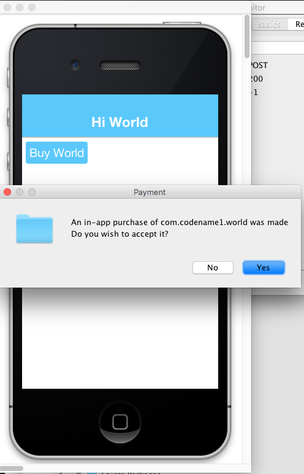
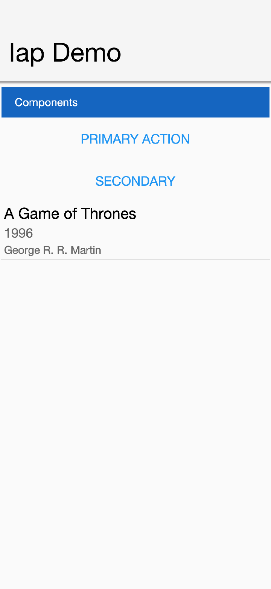
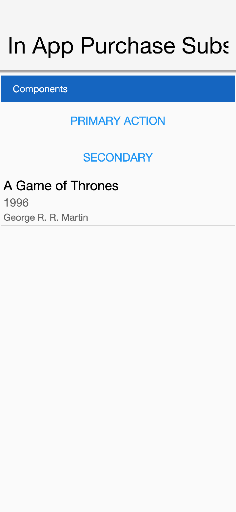
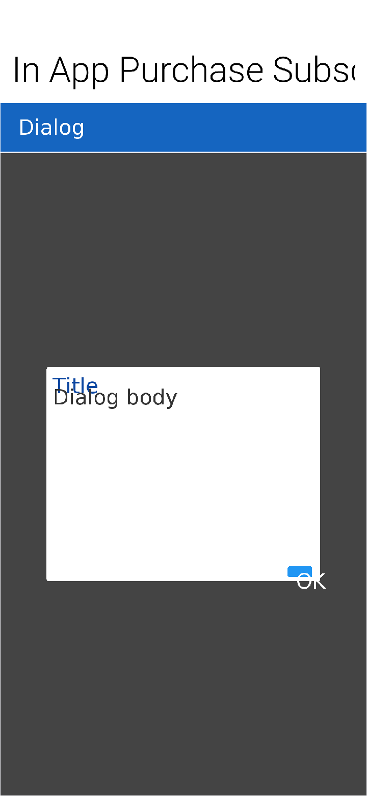
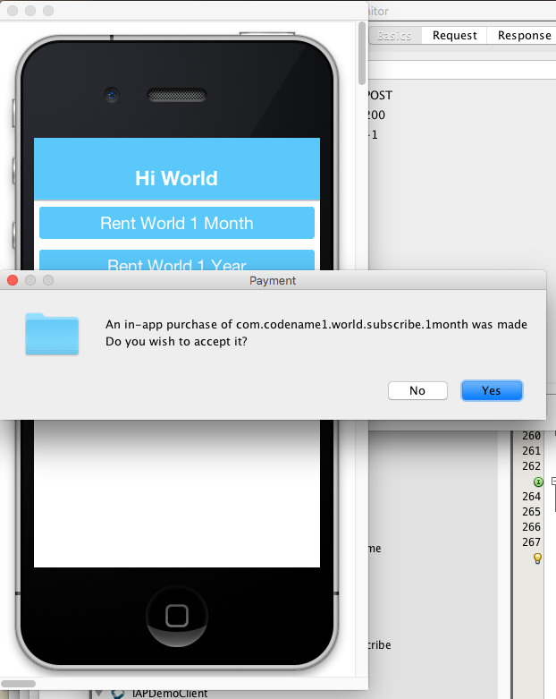
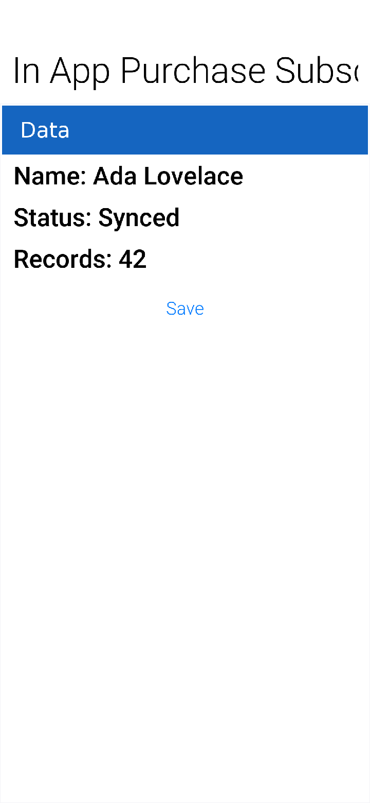

== Monetization

Codename One integrates many built-in monetization options such as in-app purchases and subscriptions. Advertising is covered in its own chapter; see <<_advertising,Advertising>>.

Many monetization options are available as third-party https://www.codenameone.com/cn1libs.html[cn1libs] that you can install through the Codename One website.

=== In-app purchase

In-app purchase is a helpful way to make app development profitable. Codename One supports in-app purchases of consumable and non-consumable products on Android and iOS. It also supports subscriptions. Even though the concept is simple, in-app purchase involves many moving parts, for subscriptions.

==== The SKU

In-app purchase support centers around the set of SKUs you want to sell. Each product, whether it's a one-month subscription, an upgrade to the "Pro" version, or "10 disco credits," has a SKU (stock-keeping unit). Ideally, you can use the same SKU across every store that sells your app.

==== Types of products

Four classifications for products exist:

1. **Non-consumable Product** - This is a product that the user purchases once to "own." They can't re-buy it. One example is a product that upgrades your app to a "Pro" version.
2. **Consumable Product** - This is a product that the user can buy more than once. For example, you might have a product for "10 Credits" that lets the user buy items in a game.
// vale-skip: Microsoft.Auto: "auto-renewed" matches the App Store / Play Store wording for the renewal action; rewriting it as "autorenewed" diverges from Apple and Google's documented terminology.
3. **Non-Renewable Subscription** - A subscription that you buy once, and won't be "auto-renewed" by the app store. These are almost identical to consumable products, except that subscriptions need to be transferable across all the user's devices. This means that non-renewable subscriptions require that you have a server that keeps track of the subscriptions.
4. **Renewable Subscriptions** - A subscription that the app store manages. The user will be automatically billed when the subscription period ends, and the subscription will renew.

NOTE: These subscription categories may not be explicitly supported by a given store, or they may use different names. You can integrate each product type in a cross-platform way using Codename One. For example, Google Play doesn't distinguish between consumable products and non-renewable subscriptions, but iTunes does.

==== The "hello world" of in-app purchase

Start with a simple example of an app that sells `Worlds`. First, pick the SKU for the product. Here you use `com.codename1.world`:

[source,java]
----
include::../demos/common/src/main/java/com/codenameone/developerguide/snippets/generated/MonetizationJava001Snippet.java[tag=monetization-java-001,indent=0]
----

TIP: Although this example uses the package-name convention for a SKU, you can use any name you want, for example `UA8879`.

Next, the app's main class needs to implement the `PurchaseCallback` interface

Using these callbacks, the app receives notifications whenever a purchase changes. For this simple app, only `itemPurchased()` and `itemPurchaseError()` matter. The legacy `itemRefunded()`, `subscriptionStarted()`, and `subscriptionCanceled()` hooks are deprecated in the core API and are no longer dispatched by the stores. Instead of relying on callbacks for long-term entitlement state, query the current receipts at runtime with helpers such as `Purchase.wasPurchased(...)`, `Purchase.isSubscribed(...)`, or `Purchase.getReceipts()`. That keeps the UI aligned with the latest data from the underlying store.

Now in the `start()` method, add a button that lets the user buy the world:

[source,java]
----
include::../demos/common/src/main/java/com/codenameone/developerguide/snippets/generated/MonetizationJava029Snippet.java[tag=monetization-java-029,indent=0]
----

At this point, the app can track the sale of the world. To make it more useful, add `ToastBar` feedback for purchase completion:

[source,java]
----
include::../demos/common/src/main/java/com/codenameone/developerguide/snippets/generated/MonetizationJava030Snippet.java[tag=monetization-java-030,indent=0]
----

NOTE: You can test out this code in the simulator without doing any more setup and it will work. If you want the code to work on Android and iOS, you'll need to set up the app and in-app purchase settings in the Google Play and iTunes stores respectively as explained below

When the app first opens you see your button:

.in-app purchase demo app
image::img/iap-demo-1.png[in-app purchase demo app,scaledwidth=20%]

In the simulator, clicking on the "Buy World" button will bring up a prompt to ask you if you want to approve the purchase.

.Approving the purchase in the simulator

Now if you try to buy the product again, it pops up the dialog to let you know that you already own it.

.In App buy already owned

==== Making it consumable

In the "Buy World" example above, the "world" product was non-consumable, since you could only buy the world once. You could change it to a consumable product by disregarding whether it was purchased before & keeping track of how many times it had been purchased.

You'll use storage to keep track of the number of worlds that the user purchased. You need two methods to manage this count. One method gets the number of worlds that you own, and another adds a world to this count:

[source,java]
----
include::../demos/common/src/main/java/com/codenameone/developerguide/snippets/generated/MonetizationJava005Snippet.java[tag=monetization-java-005,indent=0]
----

Now you'll change your buy code as follows:

[source,java]
----
include::../demos/common/src/main/java/com/codenameone/developerguide/snippets/generated/MonetizationJava031Snippet.java[tag=monetization-java-031,indent=0]
----

And your `itemPurchased()` callback will need to add a world:

[source,java]
----
include::../demos/common/src/main/java/com/codenameone/developerguide/snippets/generated/MonetizationJava032Snippet.java[tag=monetization-java-032,indent=0]
----

NOTE: When you set up the products in the iTunes store you will need to mark the product as a consumable product or iTunes will prevent you from purchasing it more than once

==== Non-Renewable subscriptions

As you discussed before, there are two types of subscriptions:

. Non-renewable
// vale-skip: Microsoft.Auto: "Auto-renewable" matches Apple's documented subscription type.
. Auto-renewable

// vale-skip: Microsoft.Auto: "Auto-renewable" matches Apple's documented subscription type.
Non-renewable subscriptions are the same as consumable products, except that they're shareable across devices. Auto-renewable subscriptions will continue as long as the user doesn't cancel the subscription. They will be re-billed automatically by the appropriate app-store when the chosen period expires, and the app-store handles the management details itself.

// vale-skip: proselint.Annotations: "NOTE" is the asciidoc admonition prefix here, not a TODO marker.
NOTE: The concept of an "Non-renewable" subscription is unique to iTunes. Google Play has no formal similar option. To create a non-renewable subscription SKU that behaves the same in your iOS and Android apps you would create it as a *regular product* in Google play, and a Non-renewable subscription in the iTunes store. You'll learn more about that in a later post when you go into the specifics of app store setup.

IMPORTANT:  The `Purchase` class includes both a `purchase()` method and a `subscribe()` method. On some platforms it makes no difference which one you use, but on Android it matters. If the product is set up as a subscription in Google Play, then you *must* use `subscribe()` to buy the product. If it's set up as a regular product, then you *must* use `purchase()`.  Since you enter "Non-renewable" subscriptions as regular products in the play store, you would use the `purchase()` method.

==== Promotional offers (iOS)

Apple allows you to present discounted introductory pricing to existing subscribers via https://developer.apple.com/documentation/storekit/skpaymentdiscount[promotional offers].  Codename One surfaces this capability through overloads of both `Purchase.purchase(String, PromotionalOffer)` and `Purchase.subscribe(String, PromotionalOffer)`, which forward the promotional context to StoreKit when you start the transaction. Promotional offers are only honoured by iOS, so the overloads fall back to the regular buy flow on other platforms.

To build the signed discount payload required by Apple you can use the `ApplePromotionalOffer` helper:

[source,java]
----
include::../demos/common/src/main/java/com/codenameone/developerguide/snippets/generated/MonetizationJava033Snippet.java[tag=monetization-java-033,indent=0]
----

Apple generates the signature and timestamp from your App Store Connect server notifications endpoint; Codename One passes them to the native StoreKit APIs. For one-time products you can call `purchase(sku, offer)` instead of `subscribe(...)`.

==== Restoring purchases and managing subscriptions

Both Apple and Google provide built-in user interfaces for restoring past purchases and managing subscription billing preferences. Codename One exposes these entry points so you can surface the native flows without reimplementing them yourself.

* Restores: Call `Purchase.isRestoreSupported()` before presenting a "Restore purchases" button. When supported (iOS implements this natively), invoke `Purchase.restore()` to prompt the operating system to re-deliver past transactions. Your app should implement `RestoreCallback` (like how you implement `PurchaseCallback`) so you can respond to individual `itemRestored(...)` events and to the completion or failure of the restore request.
* Subscription management: Use `Purchase.isManageSubscriptionsSupported()` to detect whether the platform can show the subscription management UI.  When it returns `true`, calling `Purchase.manageSubscriptions(null)` opens the store-specific settings screen (Apple's subscription center on iOS and Google Play's subscription management activity on Android). On Android you can optionally pass a SKU to deep-link directly to the plan the user should manage.

Because these flows are handled by the underlying store your UI doesn't need to rebuild any billing screens. Gate the buttons on the capability checks above so that iOS and Android users get the familiar restore/manage dialogs while other platforms can fall back to your own help copy.

==== The Server-Side

Since a subscription purchased on one user device *needs* to be available across the user's devices (Apple's rules for non-renewable subscriptions), your app will need to have a server-component. In this section, you'll gloss over that & "mock" the server interface. You'll go into the specifics of the server-side below.

===== The receipts API

Subscriptions, in Codename One use the "Receipts" API.  It's up to you to register a receipt store with the in-app purchase instance, which allows Codename one to load receipts (from your server), and submit new receipts to your server. A `Receipt` includes information such as:

. Store code  (since you may be dealing with receipts from itunes, google play & Microsoft)
. SKU
. Transaction ID (store specific)
. Expiry Date
. Cancellation date
. Buy date
. Order Data (that you can use on the server-side to verify the receipt and load receipt details directly from the store it originated from).

The `Purchase` provides a set of methods for interacting with the receipt store, such as:

. `isSubscribed([skus])`  - Checks to see if the user is subscribed to any of the provided skus.
. `getExpiryDate([skus])` - Checks the expiry date for a set of skus.
. `synchronizeReceipts()` - Synchronizes the receipts with the receipt store. This will try to submit any pending purchase receipts to the receipt store, and the reload receipts from the receipt store.

In order for any of this to work, you must implement the `ReceiptStore` interface, and register it with the Buy instance. Your receipt store must implement two methods:

. `fetchReceipts(SuccessCallback<Receipt[]> callback)` - Loads all the receipts from your receipt store for the current user.
. `submitReceipt(Receipt receipt, SuccessCallback<Boolean> callback)` - Submits a receipt to your receipt store. This gives you an opportunity to add details to the receipt such as an expiry date.

==== The "hello world" of Non-Renewable subscriptions

You'll expand on the theme of "Buying" the world for this app, except, this time you will "Rent" the world for a period of time. You'll have two products:

. A 1-month subscription
. A 1-year subscription

Notice that you create two separate SKUs for the 1 month and 1-year subscription.  **Each subscription period must have its own SKU**.  The example uses an array (`PRODUCTS`) that contains both of the SKUs. This is handy, as you'll see in the examples ahead, because the APIs for checking status and expiry date of a subscription take the SKUs in a "subscription group" as input.

NOTE: Different SKUs that sell the same service/product but for different periods form a "subscription group."  Conceptually, customers aren't subscribing to a particular SKU, they're subscribing to the subscription group of which that SKU is a member. As an example, if a user purchases  1-month subscription to "the world," they're actually subscribing to "the world" subscription group.

It's up to you to know the grouping of your SKUs. Any methods in the `Purchase` class that check subscription status or expiry date of a SKU should be passed *all* SKUs of that subscription group. For example, If you want to know if the user is subscribed to the `SKU_WORLD_1_MONTH` subscription, it would not be enough to call `iap.isSubscribed(SKU_WORLD_1_MONTH)`, because that wouldn't consider if the user had purchased  1-year subscription. The correct way is to always call `iap.isSubscribed(SKU_WORLD_1_MONTH, SKU_WORLD_1_YEAR)`, or `iap.isSubscribed(PRODUCTS)` since you have placed both SKUs into your PRODUCTS array.

===== Implementing the receipt store

NOTE: The receipt store is intended to interface with a server so that the subscriptions can be synced with multiple devices, as required by Apple's guidelines. For this post you'll just store your receipts on device using internal storage. Moving the logic to a server is a simple matter that this guide covers in a future post when you cover the server-side.

.The Receipt store is a layer between your server and Codename One
image::img/in-app-purchase-receipt-store-diagram.png[The Receipt store is a layer between your server and Codename One]

A basic receipt store needs to implement just two methods:

. `fetchReceipts`
. `submitReceipt`

You'll register it in your app's init() method so that it's always available:

[source,java]
----
include::../demos/common/src/main/java/com/codenameone/developerguide/snippets/generated/MonetizationJava034Snippet.java[tag=monetization-java-034,indent=0]
----

These methods are designed to be asynchronous since real-world apps will always be connecting to some sort of network service. Instead of returning a value, both of these methods are passed instances of the `SuccessCallback` class. It's important to make sure to call `callback.onSuccess()` *ALWAYS* when the methods have completed, even if there is an error, or the Buy class will just assume that you're taking a long time to complete the task, and will continue to wait for you to finish.

Once implemented, your `fetchReceipts()` method will look like:

[source,java]
----
include::../demos/common/src/main/java/com/codenameone/developerguide/snippets/generated/MonetizationJava035Snippet.java[tag=monetization-java-035,indent=0]
----

This is straight forward. You're checking to see if you already have a list of receipts stored. If so you return that list to the callback. If not you return an empty array of receipts.

NOTE: `Receipt` implements `Externalizable` so you are able to write instances directly to Storage.

The `submitReceipt()` method is a little more complex, as it needs to calculate the new expiry date for your subscription:

[source,java]
----
include::../demos/common/src/main/java/com/codenameone/developerguide/snippets/generated/MonetizationJava036Snippet.java[tag=monetization-java-036,indent=0]
----

The main logic of this method involves iterating through all the existing receipts to find the *latest* current expiry date, so that when the user purchases a subscription, it's added onto the end of the current subscription (if one exists) rather than going from today's date. This enables users to renew their subscription before the subscription has expired.

In the real-world, you would implement this logic on the server-side.

NOTE: The iTunes store and Play store have no knowledge of your subscription durations. This is why it's up to you to set the expiry date in the `submitReceipt` method. Non-renewable subscriptions are essentially no different than regular consumable products. It's up to you to manage the subscription logic - and Apple, in particular, requires you to do so using a server.

===== Synchronizing receipts

In order for your app to provide you with current data about the user's subscriptions and expiry dates, you need to synchronize the receipts with your receipt store.  `Purchase` provides a set of methods for doing this. You'll call one of them inside the `start()` method, and you may resynchronize at other strategic times if you suspect that the information may have changed.

The following methods can be used for synchronization:

. `synchronizeReceipts()` - Asynchronously synchronizes receipts in the background. You won't be notified when it's complete.
. `synchronizeReceipts(final long ifOlderThanMs, final SuccessCallback<Boolean> callback)` - Asynchronously synchronizes receipts, but only if they haven't been synchronized in the specified time. For example, In your start() method you might decide that you only want to synchronize receipts once per day. This also includes a callback that will be called when synchronization is complete.
. `synchronizeReceiptsSync(long ifOlderThanMs)` - Synchronously synchronizes receipts, blocking until it's complete, and will only refetch if data is older than the given time (pass `0` to always refetch). This is safe to use on the EDT as it employs `invokeAndBlock` under the covers.

In your hello world app you synchronize the subscriptions in a few places.

At the end of the `start()` method:

[source,java]
----
include::../demos/common/src/main/java/com/codenameone/developerguide/snippets/generated/MonetizationJava037Snippet.java[tag=monetization-java-037,indent=0]
----

And you also provide a button to allow the user to manually synchronize the receipts:

===== Expiry dates and subscription status

Now that you have a receipt store registered, and you have synchronized your receipts, you can query the `Purchase` instance to see if a SKU or set of SKUs is subscribed. Three useful methods in this realm:

. `boolean isSubscribed(String... skus)` - Checks to see if the user is subscribed to any of the provided SKUs.
. `Date getExpiryDate(String... skus)` - Gets the latest expiry date of a set of SKUs.
. `Receipt getFirstReceiptExpiringAfter(Date dt, String... skus)` - This method will return the earliest receipt with an expiry date after the given date. This is needed in cases where you need to decide if the user should have access to some content based on its publication date. For example, If you published an issue of your e-zine on March 1, and the user purchased a subscription on March 15th, then they should get access to the March 1st issue even though it doesn't necessarily fall in the subscription period. Being able to fetch the first receipt after a given date makes it easier to determine if a particular issue should be covered by a subscription.

If you need to know more information about subscriptions, you can always just call `getReceipts()` to get a list of all the current receipts and determine for yourself what the user should have access to.

In the hello world app you'll use this information in a few different places. On your main form you'll include a label to show the current expiry date, and you allow the user to press a button to synchronize receipts manually if they think the value is out of date:

===== Allowing the user to purchase the subscription

You should now have all the background required to implement the Hello World Subscription app. You'll return to the code and see how the user purchases a subscription.

In the main form, you want two buttons to subscribe to the `World`, for one month and one year respectively. They look like:

[source,java]
----
include::../demos/common/src/main/java/com/codenameone/developerguide/snippets/generated/MonetizationJava040Snippet.java[tag=monetization-java-040,indent=0]
----

<1> In the event handler you check if the user is subscribed by calling `isSubscribed(PRODUCTS)`.  Notice that you check it against the array of both the one month and one year subscription SKUs.

<2> You are able to tell the user when the current expiry date is so that they can gauge whether to proceed.

<3> Since this is a non-renewable subscription, you use the `Purchase.purchase()` method. See following note about `subscribe()` vs `purchase()`

==== Subscribe() vs purchase()

The `Purchase` class includes two methods for initiating a purchase:

1. `purchase(sku)`
2. `subscribe(sku)`

Which one you use depends on the type of product that's being purchased. If your product is set up as a subscription in the Google Play Store, then you should use `subscribe(sku)`.  Otherwise, you should use `purchase(sku)`.

===== Handling purchase callbacks

The buy callbacks are like the ones implemented in the regular in-app purchase examples:

[source,java]
----
include::../demos/common/src/main/java/com/codenameone/developerguide/snippets/generated/MonetizationJava041Snippet.java[tag=monetization-java-041,indent=0]
----

Notice that, in `itemPurchased()` you don't need to explicitly create any receipts or submit anything to the receipt store. This is handled for you automatically. You do make a call to `synchronizeReceiptsSync(0)` but this is just to ensure that your toast message has the new expiry date loaded already.

==== Screenshots

.Main form

.Dialog shown when subscribing to a product

.Simulator confirm dialog when purchasing a subscription

.Upon successful buy, the toastbar message is shown

==== Summary

This section demonstrated how to set up an app to use non-renewable subscriptions using in-app purchase. Non-renewable subscriptions are the same as regular consumable products except for the fact that they're shared by all the user's devices, and thus, require a server component. The app store has no knowledge of the duration of your non-renewable subscriptions. It's up to you to specify the expiry date of purchased subscriptions on their receipts when they're submitted. Google play doesn't formally have a "non-renewable" subscription product type. To implement them in Google play, you would just set up a regular product. It's how you handle it internally that makes it a subscription, and not just a regular product.

Codename One uses the `Receipt` class as the foundation for its subscriptions infrastructure. You, as the developer, are responsible for implementing the `ReceiptStore` interface to provide the receipts. The `Purchase` instance will load receipts from your ReceiptStore, and use them to determine whether the user is subscribed to a subscription, and when the subscription expires.

// vale-skip: Microsoft.Auto: "Auto-Renewable" is Apple's documented product type and is reproduced verbatim here.
==== Auto-Renewable subscriptions

// vale-skip: Microsoft.Auto: "Auto-renewable" matches Apple/Google's documented subscription type.
Auto-renewable subscriptions provide, arguably, an easier path to recurring revenue than non-renewable subscriptions because all the subscription stuff is handled by the app store. You defer almost entirely to the app store (iTunes for iOS, and Play for Android) for billing and management.

If there is a down-side, it would be that you are also subject to the rules of each app store - and they take their cut of the revenue.

// vale-skip: Microsoft.Auto: "auto-renewable" matches Apple's documented terminology for the subscription type.
. For more information about Apple's auto-renewable subscription features and rules see https://developer.apple.com/app-store/subscriptions/[this document].
. For more information about subscriptions in Google play, see https://developer.android.com/google/play/billing/billing_subscriptions.html[this document].

// vale-skip: Microsoft.Auto: "Auto-Renewable" matches Apple's documented product type used as a heading anchor.
==== Auto-Renewable vs Non-Renewable: Choosing between them

// vale-skip: Microsoft.Auto: Multiple references to Apple/Google's "auto-renewable" subscription terminology.
When deciding between auto-renewable and non-renewable subscriptions, as always, the answer will depend on your needs and preferences. Auto-renewables are nice because it takes the process out of your hands. You just get paid. On the other hand, there are valid reasons to want to use non-renewables. For example, You can't cancel an auto-renewable subscription for a user. They have to do that themselves. You may also want more control over the subscription and renewal process, in which case a non-renewable might make more sense.

// vale-skip: Microsoft.Auto: References Apple/Google's documented "auto-renewable" subscription type and a third-party blog URL containing the same term.
NOTE: Some developers https://marco.org/2013/12/02/auto-renewable-subscriptions[are opposed to auto-renewable subscriptions]. There isn't enough information to make a solid recommendation on this matter.

// vale-skip: Microsoft.Auto: "auto-renewable" matches Apple's documented subscription type.
On a practical level, if you are using auto-renewable subscriptions (and so subscription products in the Google Play Store) you must use the `Purchase.subscribe(sku)` method for initiating the purchase workflow. For non-renewable subscriptions (and so regular products in the Google Play Store), you must use the `Purchase.purchase(sku)` method.

==== Learning by example

In this section you'll describe the general workflow of subscription management on the server. You also show how use Apple's and Google's web services to check receipts and stay informed of important events (such as when users cancel or renew their subscriptions).

==== Building the IAP demo project

A complete demo exists as two projects: a
https://gist.github.com/shannah/b61b9b6b35ea0eac923a54163f5d4deb[client app] and a
https://github.com/shannah/cn1-iap-demo-server[server app].

*The client.* The link is a single source file rather than a project, so create a
Codename One project and paste it into your main class, adjusting the package and
class name to match. It uses `RESTfulWebServiceClient`, which isn't part of the
core API, so add the
https://github.com/shannah/cn1-generic-webservice-client[Generic Web Service Client]
cn1lib as a dependency -- see <<How to use cn1libs>>.

Two things about reaching the server from a device. The client can't talk to
`http://localhost` -- on a device that name means the phone -- so point it at the
address your machine has on the network:

[source,java]
----
include::../demos/common/src/main/java/com/codenameone/developerguide/snippets/generated/MonetizationJava018Snippet.java[tag=monetization-java-018,indent=0]
----

And iOS refuses unencrypted HTTP by default, so a plain `http://` address needs an
App Transport Security exception through the `ios.plistInject` build hint:

----
<key>NSAppTransportSecurity</key>
<dict>
    <key>NSAllowsArbitraryLoads</key>
    <true/>
</dict>
----

WARNING: That exception turns off transport security for the whole app. It's
here because the demo talks to a development server on your desk; a shipped app
uses HTTPS and needs none of it.

*The server.* It needs a Java EE application server rather than a servlet
container: alongside its JAX-RS endpoints it uses a `@Stateless` bean and a
container-managed `@Schedule` job to revalidate subscriptions, and neither Tomcat
nor Jetty supplies those on its own.

Create a database and a `RECEIPTS` table in it. The shape of that table is the
whole storage contract between the two halves:

[source,sql]
----
include::../demos/common/src/main/snippets/developer-guide/monetization.sql[tag=monetization-sql-001,indent=0]
----

Then point the server's persistence unit at that database, by setting the data
source in its `persistence.xml` to the one your application server exposes for
it. Creating the table isn't enough on its own -- until the persistence unit
names the right data source, the server's `EntityManager` never reaches it.

==== Looking at the source of the app

Now that you've set up and built the app, take a look at the source code so you can see how it all works.

===== Client side

The example uses the https://github.com/shannah/cn1-generic-webservice-client[Generic Webservice Client Library] from inside your `ReceiptStore` implementation to load receipts from the web service, and insert new receipts to the database.

The source for your ReceiptStore is as follows:

Notice that you aren't doing any calculation of expiry dates in your client app, as you did in the previous post (on non-renewable receipts). Since you are using a server now, it makes sense to move all that logic over to the server.

The `createRESTClient()` method shown there creates a `RESTfulWebServiceClient` and configuring it to use basic authentication with a username and password. The idea is that your user would have logged into your app at some point, and you would have a username and password on hand to pass back to the web service with the receipt data so that you can connect the subscription to a user account. The source of that method is listed here:

===== Server-Side

On the server-side, your REST controller is a standard JAX-RS REST interface. The Netbeans web service wizard generated it and then it was modified to suit the purposes here. The methods of the `ReceiptsFacadeREST` class for the REST API are shown here:

The magic happens inside that `validateAndSaveReceipt()` method, which You'll cover in detail soon.

====== Notifications

It's important to note that you won't be notified by apple or google when changes are made to subscriptions. It's up to you to periodically "poll" their web service to find if any changes have been made. Changes you would be interested in are primarily renewals and cancellations. Set up a method to run periodically (once per day might be enough), using the scheduling mechanism on your server stack.

That method finds all the receipts in the database that haven't been validated in some period of time, and validates it. Again, the magic happens inside the `validateAndSaveReceipt()` method which you cover later.

// vale-skip: Microsoft.Auto: "auto-renewing" matches Google Play's documented subscription terminology.
NOTE: This example only checks receipts from the iTunes and Play stores because those are the only stores that support auto-renewing subscriptions in Codename One.

==== The CN1-IAP-Validator library

For this tutorial, the example uses a purpose-built library to handle receipt validation in a way that hides as much of the complexity as possible. It supports both Google Play receipts and iTunes receipts.

The general usage is as follows:

As you can see from this snippet, the complexity of receipt validation has been reduced to entering three configuration strings:

1. `APPLE_SECRET` - This is a "secret" string that you will get from iTunes connect when you set up your in-app products.
2. `GOOGLE_DEVELOPER_API_CLIENT_ID` - A client ID that you'll get from the Google developer API console when you set up your API service credentials.
3. `GOOGLE_DEVELOPER_PRIVATE_KEY` - A PKCS8 encoded string with an RSA private key that you'll receive at the same time as the `GOOGLE_DEVELOPER_API_CLIENT_ID`.

The next section walks through the steps to get these values.

==== The `validateAndSaveReceipt()` method

You are now ready to see the full magic of the `validateAndSaveReceipt()` method in all its glory:

NOTE:  In many of the code snippets for the Server-side code, you'll see references to both a `Receipts` class and a `Receipt` class. This is slightly confusing. The `Receipts` class is a JPA entity the encapsulates a row from the "receipts" table of your SQL database. The `Receipt` class is `com.codename1.payment.Receipt`.  It's used to interface with the IAP validation library.

==== Setting up the stores

Both stores need the same two things from you: the products themselves, and a
credential your server can validate receipts with. The consoles that do it are
Google's and Apple's, and both have been redesigned more than once, so follow
their own documentation for the clicking -- what matters here is what to end up
with.

*Products.* Create one product per SKU your app sells, and use exactly the ids
your code passes to `purchase()` and `subscribe()`. A subscription needs its own
SKU per period, which is why the examples above keep both in a `PRODUCTS` array
and pass the whole group to the status calls.

*Google Play receipt validation.* Server-side validation goes through the Google
Play Developer API. Enable that API for the project, create a service account,
give it access to your Play account, and download its key. The key arrives as
JSON and its `client_email` and `private_key` are what your server
authenticates with:

[source,json]
----
include::../demos/common/src/main/snippets/developer-guide/monetization.json[tag=monetization-json-001,indent=0]
----

*Apple receipt validation.* Apple uses a shared secret generated alongside the
in-app products rather than a service account:

[source,java]
----
include::../demos/common/src/main/java/com/codenameone/developerguide/snippets/generated/MonetizationJava027Snippet.java[tag=monetization-java-027,indent=0]
----

*Testing before either is ready.* Both validations can be switched off so the
receipt store accepts what the device reports, which is how you exercise the
flow before the credentials exist. Turn them back on before you ship, because
with them off the server trusts the client:

[source,java]
----
include::../demos/common/src/main/java/com/codenameone/developerguide/snippets/generated/MonetizationJava026Snippet.java[tag=monetization-java-026,indent=0]
----

[source,java]
----
include::../demos/common/src/main/java/com/codenameone/developerguide/snippets/generated/MonetizationJava028Snippet.java[tag=monetization-java-028,indent=0]
----

*Test accounts.* Both stores let you nominate accounts that can buy without
being charged. Apple's sandbox works against a development-signed build
installed straight onto a device, and Google's license testers can buy from a
sideloaded build once the package name and products match; it's Play's
track-based testing that needs an uploaded artifact. Their docs cover the current
mechanism, and Google's has changed name twice.
