[[native-modern-themes]]
== Native modern themes

Codename One ships an iOS Modern (liquid-glass) theme and an Android
Material 3 theme that you can opt your app into with a single build
hint. Both are fully overridable - their color palettes, type
ramps, and state-specific styles are all reachable from your own
`theme.css` and from runtime API.

The legacy iOS 7 (iOS) and Holo Light (Android) themes remain the
default so existing apps see no behavior change.

=== Selecting a theme

Three build hints control the platform native theme. None of them
are required; with all three unset every app continues to load the
legacy theme it always did.

[cols="1,2,3", options="header"]
|===
|Hint |Values |Description

|`ios.themeMode`
|`auto` (default) +
`modern` / `liquid` +
`ios7` / `flat` +
`legacy` / `iphone`
|`auto` and `ios7` both load the iOS 7 flat theme. `modern` /
`liquid` opts in to the modern theme generated from
`native-themes/ios-modern/theme.css`. `legacy` / `iphone` loads the
pre-iOS 7 theme. The `auto` -> `modern` flip is planned for a
future release.

|`and.themeMode`
|`auto` / `modern` / `material` +
`hololight` (legacy default) +
`legacy`
|`auto` and `modern` / `material` opt in to the modern theme
generated from `native-themes/android-material/theme.css`.
`hololight` is Android Holo Light (the pre-modern default for
existing apps). `legacy` is the pre-Holo theme. The legacy
alias `cn1.androidTheme` is still honored for back-compat.

|`ios.themeGeneration`
|`26` (default) +
`27`
|Which iOS design generation the modern theme targets. Consulted
only when `ios.themeMode` resolves to modern; the iOS 7 and
pre-flat looks have one generation each and ignore it. Unset is
`26`, so an existing project keeps the theme it has. `27` is a
real design change rather than a version bump -- 31 of the 68
native reference tiles differ, concentrated in the Liquid Glass
surfaces and the bar and button chrome built on them, while the
classic form controls are identical.

|`nativeTheme`
|`modern` / `legacy` / `custom`
|Cross-platform shortcut that sets both `ios.themeMode` and
`and.themeMode` together. `modern` = liquid glass + Material 3,
`legacy` = iOS 7 + Holo Light, `custom` disables the framework
theme entirely so your own `theme.css` owns the base layer. The
legacy alias `cn1.nativeTheme` is still honored for back-compat.
|===

The legacy `and.hololight=true` hint still works and maps to
`and.themeMode=hololight`.

=== Desktop themes

Windows, macOS and GNOME have their own native themes, selected with
`desktop.themeMode` on the JavaSE desktop build and with
`macos.themeMode` on the native macOS port.

[cols="1,2,3", options="header"]
|===
|Hint |Values |Description

|`desktop.themeMode`
|`legacy` (default) +
`auto` / `native` +
`fluent` / `aqua` / `adwaita` +
`custom`
|Unset is `legacy`: an existing desktop project keeps the theme it has
always loaded, so upgrading the framework doesn't restyle an application
nobody asked to restyle. `auto` and `native` opt in and both mean
"whatever this machine is" -- Windows 11 Fluent, macOS Aqua or GNOME
Adwaita -- which is the only sensible reading on desktop, where one binary
runs on all three. Naming a theme outright is what a build that wants one
look everywhere asks for. `custom` installs no framework theme so your own
`theme.css` is the only one.

|`macos.themeMode`
|`aqua` (default) / `native` +
`modern` / `liquid` +
`ios7` / `flat`
|The native macOS port. When neither this hint nor the shared `nativeTheme`
hint is set, the default is Aqua. `aqua` and `native` select the macOS theme;
`modern` / `liquid` select the iOS Liquid Glass theme. An explicit shared
hint still applies when `macos.themeMode` is unset: `nativeTheme=modern`
selects the modern theme, while `nativeTheme=legacy` selects `ios7`.
|===

The three desktop themes are generated from `native-themes/windows-fluent`,
`native-themes/macos-aqua` and `native-themes/gnome-adwaita`. They're
separate files rather than one file with per-platform blocks, and they're
held to the same surface by `DesktopNativeThemeParityTest`: the same UIIDs,
the same `#Constants`, and a `$Dark` counterpart for everything that paints
a color. That matters to you and not only to the themes -- an application
retunes a parent theme by redeclaring `#Constants`, so one vocabulary means
the same CSS retunes all three platforms rather than only the one it was
written against.

==== One application on all three

The Codename One Settings tool is built this way. Its main class declares
`@DesktopBuild(themeMode = "native")`, so it opens in Fluent on Windows,
Aqua on macOS and Adwaita on Linux, and its own `theme.css` never names a
color the platform owns:

* Each control derives from the native UIID it's a variant of --
  `cn1-derive: TextField` for a field, `RaisedButton` for the primary
  action, `GroupBox` for a card -- so borders, fills and focus rings are
  the platform's.
* Surfaces and text use the palette variables every desktop theme
  declares, such as `var(--window-bg-color)` and
  `var(--text-secondary-color)`. At runtime the installed theme's values
  replace the ones the compiler baked in.
* Only the brand is fixed: the tool redeclares `--accent-color` in its
  `#Constants`, and the Save button keeps its own green.

.The Settings tool under Windows 11 Fluent
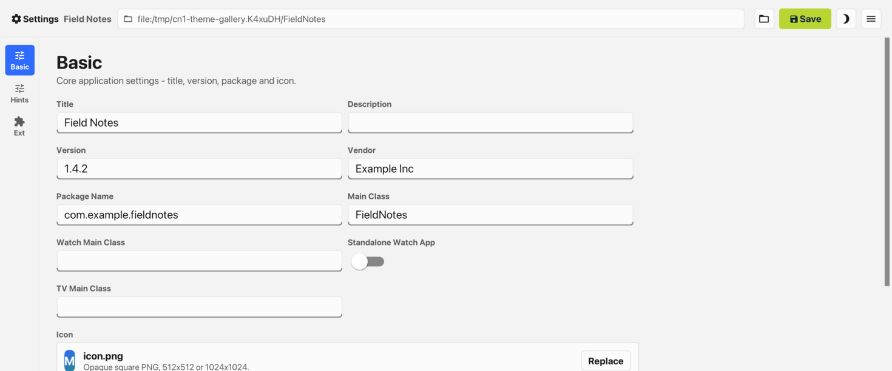
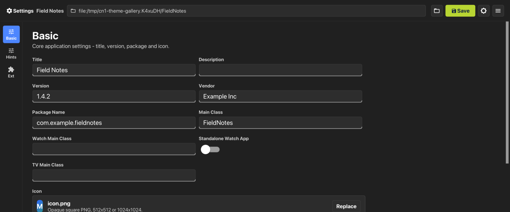

.The Settings tool under macOS Aqua
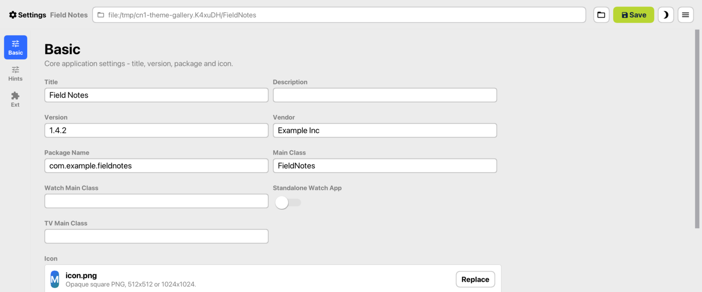
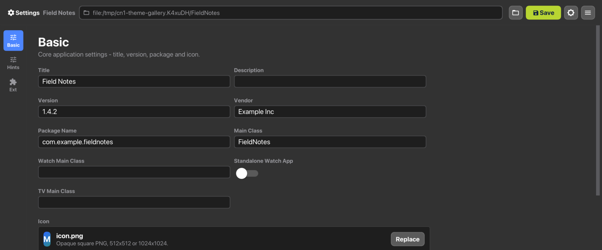

.The Settings tool under GNOME Adwaita
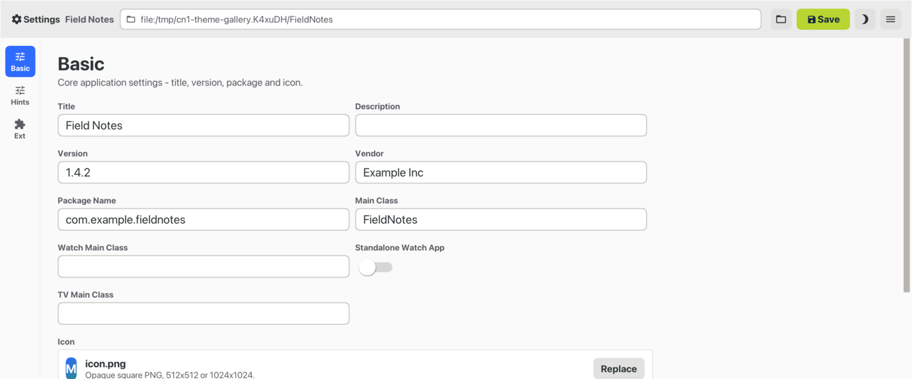
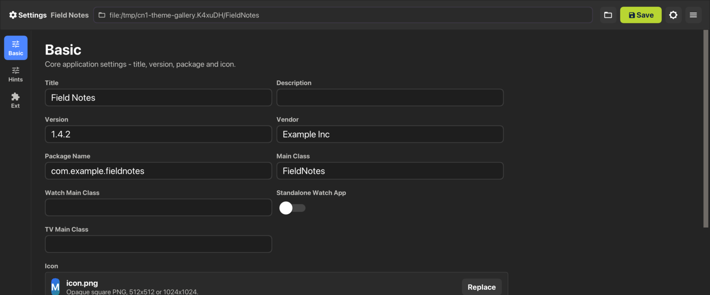

NOTE: All six images were captured on a Mac, not on Windows or Linux.
Colors, borders and spacing come from the theme and are the same on every
host, but each theme draws text in its platform's own typeface -- Segoe UI
Variable, SF or Cantarell -- and the Fluent and Adwaita images fall back to
the Mac's system font. On a real Windows or Linux desktop the text looks
different.

To preview a desktop theme in the simulator, pick the Desktop skin and
choose the theme from the *Native Theme* menu. With *Auto* selected the
Desktop skin follows `desktop.themeMode`, which is what the packaged
application does.

==== Hover

Desktop themes carry a state mobile ones have no use for. A `.hover` rule
styles a component while the pointer is over it:

[source,css]
----
include::../demos/common/src/main/css/guide-snippets-theme.css[tag=native-themes-css-hover,indent=0]
----

It compiles to `hover#` entries the same way `.pressed` compiles to
`press#`, and `Component.getHoverStyle()` returns `null` when the theme
declares none -- so a component with no hover rule keeps its normal style
rather than falling back to a blank one.

Hover has no meaning on a touch device and isn't delivered there. On
desktop it's driven by real pointer motion: the JavaSE, Windows and Linux
ports all report motion with no button held, which is what
`Form.pointerHover` resolves against.

NOTE: macOS is the exception, and the reason belongs to AppKit rather than
to Codename One. AppKit draws no rollover state for buttons, fields,
sliders, switches or popup buttons, so the Aqua theme leaves hover equal to
normal. The
captured native reference says the same, and the fidelity gate holds it
there.

=== Light and dark mode

Both modern themes ship a dark variant via a
`@media (prefers-color-scheme: dark)` block in their CSS. The CSS
compiler rewrites each rule inside that block into a `$Dark<UIID>`
style entry; UIManager picks them up whenever
`CN.isDarkMode() == true`.

.One form under Android Material, rendered in each appearance
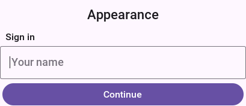
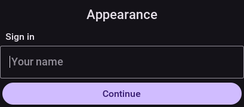

Nothing in that form is styled by hand, so the difference between the two
pictures is entirely what the theme's dark entries supply.

`Display.getInstance().setDarkMode(Boolean)` controls the active
appearance:

* `null` (the default) - follow the device. iOS reads
  `UITraitCollection`, Android reads `Configuration.uiMode`. When
  the user toggles light / dark in system settings the app reflects
  the change. A JavaSE desktop application reads the system appearance
  once, at launch: `AppsUseLightTheme` on Windows, `AppleInterfaceStyle`
  on macOS and the GNOME `color-scheme` setting on Linux. In the
  simulator the *Dark/Light Mode* menu decides instead.
* `true` / `false` - force the app into one mode regardless of
  system setting (useful for theme-preview screens or accessibility
  toggles).

=== Material 3 color palette (Android)

The Android Material 3 theme is built around the Material Design 3
"baseline" palette. Each color is referenced from one or more
UIIDs; if you change a color the change ripples to every UIID that
inherits from it.

[cols="1,1,1,2", options="header"]
|===
|Role |Light |Dark |Used by

|primary
|`#6750a4`
|`#d0bcff`
|Default `Button` fill, `BackCommand` / `TitleCommand` text,
`SelectedTab` text color.

|on-primary
|`#ffffff`
|`#381e72`
|Text printed on top of the primary fill.

|primary-container
|`#eaddff`
|`#4f378b`
|`RaisedButton` (the elevated tone), `Button.pressed` and
`MultiButton.pressed` highlight, `FloatingActionButton`.

|surface
|`#fef7ff`
|`#141218`
|`Form`, `ContentPane`, `Toolbar`, `TitleArea`, `List`, `Tabs`,
`SideNavigationPanel`. The "page" color.

|on-surface
|`#1d1b20`
|`#e6e0e9`
|Body text on surfaces (`Label`, `Title`, `MultiLine1`).

|surface-variant
|`#e7e0ec`
|`#49454f`
|Track of the off-state `Switch`.

|on-surface-variant
|`#49454f`
|`#cac4d0`
|Secondary text (`SecondaryLabel`, `MultiLine2`,
`UnselectedTab` text).

|surface-container
|`#f3edf7`
|`#211f26`
|`TextField` / `TextArea` filled background.

|surface-container-highest
|`#e6e0e9`
|`#211f26`
|`Dialog`, `PopupContent`. Sits one elevation step above
`surface` so dialogs read as raised cards.

|outline / outline-variant
|`#79747e` / `#cac4d0`
|`#938f99` / `#49454f`
|`Separator`, `TertiaryLabel`, disabled-text muting.

|state-pressed
|`#d0bcff`
|`#4f378b`
|All `.pressed` overrides on Button-family UIIDs.

|state-disabled / on-disabled
|`#e0dce4` / `#a5a0ab`
|`#2b2930` / `#5c5967`
|All `.disabled` overrides.
|===

To rebrand the app, override the color at the role level rather
than touching every UIID. The example below layers a teal palette
on top from your app's own `theme.css`; if you want the same
rebrand to apply at *runtime* (for in-app accent toggles, branded
flavours, A/B tests) without recompiling the theme, see
`Runtime accent palette override` further down - a single
`addThemeProps({"@accent-color": ...})` call retunes every
accent-bearing UIID at once:

[source,css]
----
include::../demos/common/src/main/css/guide-snippets-theme.css[tag=native-themes-css-001,indent=0]
----

=== iOS modern color palette

The iOS modern theme follows Apple's system palette.

[cols="1,1,1,2", options="header"]
|===
|Role |Light |Dark |Used by

|accent
|`#007aff`
|`#0a84ff`
|`Button` text, `RaisedButton` fill, `SelectedTab` text,
`BackCommand` / `TitleCommand`, `FloatingActionButton`.

|accent-pressed
|`#0064d1`
|`#64b1ff`
|All `.pressed` accent overrides.

|accent-disabled
|`#b3d4ff`
|`#004a99`
|All `.disabled` accent overrides.

|surface
|`#ffffff`
|`#000000`
|Pure surface used by `Toolbar`, `TitleArea`, `Title`, `List`.

|surface-grouped
|`#f2f2f7`
|`#1c1c1e`
|Form / ContentPane (the iOS "grouped" form bg). `Dialog` /
`Tabs` use this color at reduced opacity for the liquid-glass
look.

|surface-tertiary
|`#e5e5ea`
|`#2c2c2e`
|`Button.pressed` highlight, elevated dark Dialog surface.

|text-primary
|`#000000`
|`#ffffff`
|`Label`, `MultiLine1`, `Title`, primary body text.

|text-secondary
|`#3c3c43`
|`#ebebf5`
|`SecondaryLabel`, `MultiLine2`, unselected tabs.

|text-tertiary / text-disabled
|`#8e8e93` / `#c7c7cc`
|`#8e8e93` / `#48484a`
|`TertiaryLabel`, `MultiLine3-4`, disabled-state text.

|separator
|`#c6c6c8`
|`#38383a`
|`Separator`.

|success
|`#34c759`
|`#30d158`
|`Switch.selected`, `OnOffSwitch.selected`.
|===

To layer a brand color on top, override `RaisedButton` and
accent-driven UIIDs the same way as Android above. The color names
// vale-skip: write-good.So: "So" connects this consequence to the preceding sentence about Apple's UIColor names; replacing it would lose the bridging clause that motivates the next sentence.
match Apple's `UIColor.systemBlue` etc. So you can mirror the SF
Symbols semantics if you want.

=== Accent palette override

Both shipped native themes expose their accent palette as named
constants you can retune from your app's own `theme.css` (or, for
dynamic theming, at runtime). The CSS source uses
`var(--accent-color, fallback)` references so the fallback ships as
the baked-in default (the .res file loads fine with no override)
and the compiler additionally emits a
`@cn1-bind:<UIID>.<key>=accent-color` constant alongside each
affected style key. When the resolved theme constants pick up a new
`@accent-color` value (whether from your CSS or via runtime
`UIManager.addThemeProps`), the framework fans the override out to
every bound UIID at once - no per-UIID rule duplication, no theme
recompile.

.iOS modern (`native-themes/ios-modern/theme.css`)
[cols="2,1,1,3", options="header"]
|===
|Constant |Light default |Dark default |Drives

|`@accent-color`
|`#007aff`
|(see `@accent-color-dark`)
|`Button.fgColor`, `RaisedButton.bgColor`,
`CheckBox.selected`, `RadioButton.selected`, `OnOffSwitch.fgColor`,
`BackCommand`, `TitleCommand`, `FloatingActionButton.bgColor`.

|`@accent-color-dark`
|n/a
|`#0a84ff`
|`$Dark<UIID>` counterparts of the above.

|`@accent-pressed-color` / `@accent-pressed-color-dark`
|`#0064d1`
|`#64b1ff`
|All `.press#fg/bgColor` accent overrides.

|`@accent-disabled-color` / `@accent-disabled-color-dark`
|`#b3d4ff`
|`#004a99`
|All `.dis#fg/bgColor` accent overrides.

|`@accent-on-color`
|`#ffffff`
|(same)
|Text color painted on top of the accent fill.
|===

.Android Material 3 (`native-themes/android-material/theme.css`)
[cols="2,1,1,2", options="header"]
|===
|Constant |Light default |Dark default |Material 3 token

|`@accent-color` / `@accent-color-dark`
|`#6750a4`
|`#d0bcff`
|`primary`

|`@accent-on-color` / `@accent-on-color-dark`
|`#ffffff`
|`#381e72`
|`on-primary`

|`@accent-container-color` / `@accent-container-color-dark`
|`#eaddff`
|`#4f378b`
|`primary-container`

|`@accent-on-container-color` / `@accent-on-container-color-dark`
|`#21005d`
|`#eaddff`
|`on-primary-container`

|`@accent-pressed-color` / `@accent-pressed-color-dark`
|`#d0bcff`
|`#4f378b`
|`state-pressed`
|===

==== Override from your app's `theme.css` (recommended)

Redeclare the accent variable inside the `#Constants` block of your
app's `theme.css`. The framework's CSS compiler exports any
`--name` declaration in `#Constants` as a `@name` theme constant,
so the value flows through the same binding pass that handles
runtime overrides:

[source,css]
----
include::../demos/common/src/main/css/guide-snippets-theme.css[tag=native-themes-css-002,indent=0]
----

Bindings that reference a constant you didn't override stay at
their baked-in default, so a partial override (for example, just
`--accent-color`) is fine.

==== Runtime override

For dynamic theming - in-app accent toggles, branded flavours,
A/B tests - push the same constants through
`UIManager.addThemeProps` after the theme has been installed:

[source,java]
----
include::../demos/common/src/main/java/com/codenameone/developerguide/snippets/generated/NativeThemesJava001Snippet.java[tag=native-themes-java-001,indent=0]
----

Values can be passed with or without the leading `#` and in any
case; the runtime accepts `"ff2d95"`, `"#FF2D95"`, and the 3-digit
shorthand `"#f0a"` interchangeably.

`PaletteOverrideThemeScreenshotTest` in the hellocodenameone test
suite exercises this path against both native themes, light + dark.

==== When the override path doesn't apply

The binding mechanism handles every accent UIID the shipped themes
expose. For other widgets - or when you want to override a color
the native CSS hard-codes (for example, the iOS `success` green on
`Switch.selected`) - either:

* Layer a per-UIID redeclaration in your app's `theme.css` (see
  `Customizing in your own theme` below). Right when you want to
  tweak a UIID the binding vocabulary doesn't already cover.
* Or pass the specific UIID/state key directly into
  `UIManager.addThemeProps` (`Switch.sel#bgColor` etc.). Runtime,
  bypasses the binding system. Right when you need a one-off color
  tweak you can't anchor in CSS.

=== Platform-specific UIIDs

A handful of UIIDs exist only because one platform draws them
differently from the other. They're still safe to override; you
just want to know which platform's screen the override is going to
land on.

iOS-only behavior:

* `Toolbar`, `TitleArea`, `Title` paint over the status-bar area.
  iOS reserves room above for the notch / status bar; in your
  capture this reads as a colored strip at the top of the
  Form. In production the device fills it with system content
  (signal, battery, time).
* `MultiButton` is styled as an iOS Settings row (multi-line text
  ramp + chevron). Compare against Material 3's denser list-item
  pattern.

Android-only behavior:

* `Toolbar` doesn't paint over the system status bar; the native
  Android status bar handles that.
* `Tabs` use Material 3 top tabs (flat, underline-by-color). iOS
  modern renders Tabs as a bottom-anchored pill group via the
  `tabPlacementInt` constant - that constant is intentionally only
  set in the iOS theme so behavior stays consistent on each
  platform.

=== Switching CheckBox / RadioButton glyphs

The default check / radio glyphs are Material icons drawn by
`DefaultLookAndFeel`. The theme can swap them via four optional
constants (Material codepoints):

[cols="1,1,3", options="header"]
|===
|Constant |Default |Notes

|`@checkBoxCheckedIconInt`
|`MATERIAL_CHECK_BOX` (`E834`)
|Override to for example, `MATERIAL_CHECK_CIRCLE` (`E86C` / `59500`) for an
iOS-style filled circle. The iOS modern theme does this.

|`@checkBoxUncheckedIconInt`
|`MATERIAL_CHECK_BOX_OUTLINE_BLANK` (`E835`)
|Match the empty version of whatever you chose above.

|`@radioCheckedIconInt`
|`MATERIAL_RADIO_BUTTON_CHECKED` (`E837`)
|Filled circle with dot.

|`@radioUncheckedIconInt`
|`MATERIAL_RADIO_BUTTON_UNCHECKED` (`E836`)
|Empty circle.
|===

Set these in your `#Constants { ... }` block; the icons rebuild on
the next style refresh.

=== Component-specific tuning constants

[cols="2,3", options="header"]
|===
|Constant |Effect

|`@switchTrackScaleX`, `@switchTrackScaleY`
|Stretches the Switch track. Larger X = longer pill, larger Y =
thicker. iOS uses 2.5 / 1.5; Material uses 3.0 / 0.9.

|`@switchThumbScaleY`
|Scales the Switch thumb relative to the track. iOS 1.4, Material
1.5.

|`@switchThumbPaddingInt`, `@switchThumbInsetMM`
|Pixels of breathing room between thumb and track.

|`@switchTrackOffOutlineWidthMM`, `@switchTrackOffOutlineColor`
|iOS draws a faint ring around the off-state track; Material does
not.

|`@tabPlacementInt`
|`Component.TOP` (`0`), `Component.BOTTOM` (`2`),
`Component.LEFT` (`1`), `Component.RIGHT` (`3`). Where the
`Tabs` widget anchors its tab bar. Set in iOS modern theme to
`2` for the iOS 26 bottom-bar look; unset on Android (Tabs at
top).

|`@tabsFillRowsBool`, `@tabsGridBool`
|Distribute tabs evenly across the bar.

|`@tabsAnimatedIndicatorBool`
|`true` paints a thin colored underline below the currently selected
tab and tweens its `x` / `width` between tabs on selection change. Both
modern themes set this to `true`. Off in the framework default; opt-in
for legacy themes by setting it explicitly.

|`@tabsAnimatedIndicatorDurationInt`
|Duration of the indicator tween in milliseconds (default `200`,
matching Material 3's `NavigationBar` spec).

|`@tabsAnimatedIndicatorThicknessMm`
|Indicator underline thickness in millimetres (default `1`).

|`@pullToRefreshModernBool`
|`true` switches the pull-to-refresh visual from the legacy
rotating-arrow + text Label stack to a thin circular arc spinner
painted directly via `Graphics.drawArc`. The arc sweep grows from 0°
to ~330° proportional to the user's pull, then spins continuously
once the refresh task fires. Both modern themes set this to `true`.
Color comes from the `TabIndicator` UIID's fg (consistent with the
animated tab indicator), falling back to the Title fg if unset.

|`@pullToRefreshIndicatorDiameterMm`
|Outer diameter of the modern arc spinner in millimetres (default `8`).
Drives the gesture threshold too -- the user must pull this distance
plus a small margin to fire the refresh task.

|`@pullToRefreshIndicatorStrokeMm`
|Stroke thickness of the modern arc spinner in millimetres (default
`0.6`).

|`@darkModeBool`
|`true` enables `$DarkUIID` resolution when the app is in dark
mode. Both modern themes set this; user themes that want dark
mode also need to set it.
|===

=== iOS 26 Liquid Glass tab selection morph

When the iOS modern theme renders `Tabs` as a bottom bar
(`tabPlacementInt: 2`) the selected tab is marked by a *Liquid Glass
drop* -- a frosted, magnifying glass capsule painted over the (dark)
icons rather than a flat highlight. On a selection change the drop springs
across to the new tab, elongating while it travels and settling with a
small overshoot. The selected blue is supplied by the drop itself (a
luminance-keyed dark->accent tint of the glyph beneath it), so the color
travels with the drop instead of snapping between tabs.

ifndef::backend-pdf[]
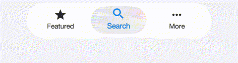
endif::[]
ifdef::backend-pdf[]
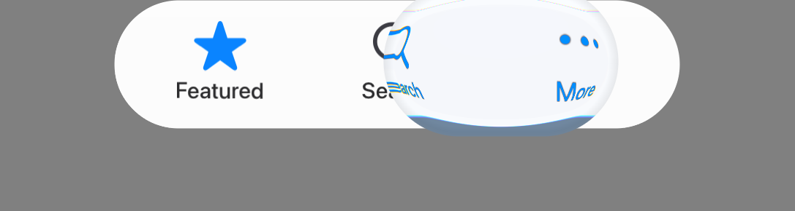
endif::[]

On iOS the drop is rendered live by a Metal fragment shader that samples
the bar beneath it on the GPU, so the morph runs at frame rate with no
screen read-back; other platforms and the simulator use the equivalent CPU
lens. The effect is opt-in: the iOS modern theme sets
`tabsSelectionCapsuleBool: true` and `glassMaterialBool: true`. Without the
glass flag the capsule degrades to a plain translucent pill.

The morph is developed against the real OS control: the frame-by-frame
comparison below shows the native iOS 26 tab bar (left) and the Codename
One render (right) at matching moments of the selection travel.

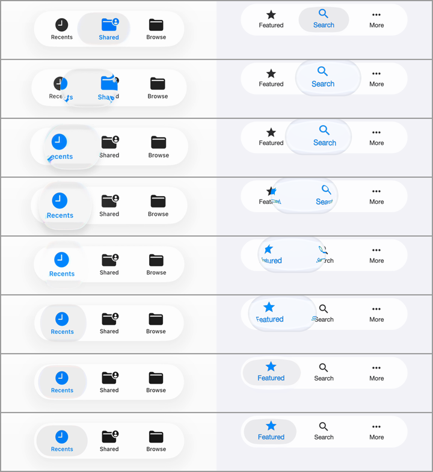

The animation is controlled by a *named motion preset* plus a handful of
high-level knobs. The detailed envelopes (stretch, squash, lift, lens
magnification, aberration, tint timing) live inside the preset in the
motion model (`TabSelectionMorph`), where they're pinned by unit test and
validated frame-by-frame by the fidelity suite -- a theme picks a preset
and scales it rather than tuning a dozen loose constants:

[cols="3,1,4", options="header"]
|===
|Constant |iOS modern |Effect

|`@tabsSelectionCapsuleBool`
|`true`
|Master switch for the selection drop. Off falls back to the legacy
colored underline indicator (`tabsAnimatedIndicatorBool`).

|`@tabsMorphPreset`
|`ios26`
|The named motion preset: `ios26` (the measured Liquid Glass morph) or
`subtle` (half the deformation and optics, for a calmer selection change).

|`@tabsAnimatedIndicatorDurationInt`
|`480`
|Morph duration in milliseconds. Lower is snappier.

|`@tabsMorphLensIntensityPct`
|`100`
|Scales the drop's *optics* (magnification, chromatic aberration, accent
tint) around the preset: `0` is an optically flat drop, `200` doubles the
lens strength. Geometry is unaffected.

|`@tabsMorphSpringPct`
|`100`
|Scales the settle overshoot: `0` stops dead on a plain ease-out, `200`
doubles the bounce.

|`@tabSelLensTintColorInt`
|`0x0a84ff`
|The accent the dark glyph is tinted to inside the drop.
|===

The iOS 27 theme uses a third preset, `ios27`, which is time based rather
than a fixed-duration morph. Its curves are measured from a real
`UITabBarController` on the iOS 27 simulator, frame by frame, and played back
by `TabGlassMotion`:

* on a tap the selection lens *lifts*: it grows, its platter fades so it
  becomes clear glass, and the tab content seen through it magnifies;
* it travels on a spring, stretching while it accelerates and squashing on
  arrival in proportion to the distance, then settles with a second, smaller
  wobble;
* the whole bar -- glass, content and lens -- pulses in scale, and a soft glow
  spreads from the touch point.

The motion follows the gesture, not just the tap, the way UIKit's does:

* holding a press keeps the lens lifted and the bar grown until the finger
  lifts;
* pressing the selected tab lifts and pulses the lens in place;
* dragging along the bar pulls the lens with the finger (a *scrub*), and
  letting go selects the tab under the finger, with the lens settling there;
* every release ends in a small wobble about a second after the finger lifts.

The accent color lives in a second copy of the tab content, visible only
through the lens, so the color travels with the glass. Where the port
supports `Graphics.colorMatrixRegion` (iOS, macOS, the JavaScript port and the
simulator), the tab content is *vibrant* like UIKit's: each glyph pixel is a
color matrix of the glass behind it rather than flat paint, so labels and the
accent pick up the colors under the bar. The selection platter is likewise the
bar's own glass seen through a color matrix, not a translucent fill. With this
preset the tabs are painted with their normal style outside the lens and with
their *pressed* style inside it: the theme's `Tab`/`TabIcon` colors are the
unselected ones and `Tab.pressed`/`TabIcon.pressed` the selected ones. Tab
backgrounds should stay transparent.

The motion reaches past the bar's visible pill, so the bar reserves room for
it inside its own bounds: the theme widens the `TabsContainer` padding by the
slack, narrows its margin by the same amount so the pill stays where it was,
and names the slack in constants. Everything the motion paints then stays
inside the bar's own bounds and repaint region.

[cols="3,1,4", options="header"]
|===
|Constant |iOS 27 |Effect

|`@tabsMorphPreset`
|`ios27`
|Selects the measured time-based motion described above.

|`@tabsGlassSlackXMm` / `@tabsGlassSlackYMm`
|`2` / `1`
|How much of the `TabsContainer` padding is motion slack rather than pill.

|`@tabSelInsetMm`
|`0.66`
|Inset of the resting lens inside the pill.

|`@tabSelPillColorInt` / `@tabSelPillAlphaInt`
|`0` / `35`
|Color and alpha of the resting selection platter on ports without
`colorMatrixRegion`.

|`@tabSelPillColorDarkInt` / `@tabSelPillAlphaDarkInt`
|`0` / `67`
|The same platter in the dark appearance; defaults to the light values.

|`@tabGlassLensLightAlphaInt`
|`28`
|White wash of the lifted lens, which reads brighter than the bar.

|`@tabGlassRimAlphaInt` / `@tabGlassEdgeAlphaInt`
|`150` / `110`
|Alpha of the lifted lens's bright inner rim and dark edge ring, scaled by
the lift.

|`@tabGlassGlowPct`
|`40`
|Strength of the touch glow; `0` turns it off.

|`@tabGlassSpecularAlphaInt` / `@tabGlassSpecularDarkAlphaInt`
|`145` / `90`
|Peak alpha of the bright rim along the bar's top and bottom edges; `0`
(the default) draws none.
|===

Similarly, the *Liquid Glass backdrop materials* themselves are typed,
named recipes (`GlassRecipe`): a theme assigns `chrome` (edge-anchored
bars), `pill` (the floating tab bar) or `panel` (buttons, dialogs, panels
-- the default) per UIID with `<UIID>GlassRecipe` constants, e.g.
`ToolbarGlassRecipe: "chrome"`. Each recipe bundles the measured
saturation/scale/offset color transform and edge optics of one native
material, so similar glass surfaces can't drift apart one constant at a
time.

NOTE: The drop's glass cues (rim shrink, refraction, glare, edge shadow)
fade out as it settles, so a resting selection reads as a calm frosted
pill rather than a distorting lens. Every motion preset is validated
deterministically: the fidelity suite freezes the morph at the fixed
progress points 0, 10, 25, 50, 75, 90 and 100 percent, regression-compares
each frame, and pins the same points numerically against the motion model
in unit tests. The `Switch` thumb uses the same discipline for its liquid
*droplet* morph (`switchLiquidGlassBool`, stretch/squash while sliding,
frame-validated):

ifndef::backend-pdf[]
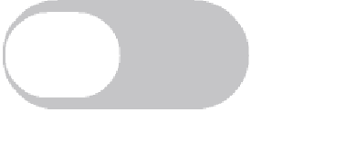
endif::[]
ifdef::backend-pdf[]
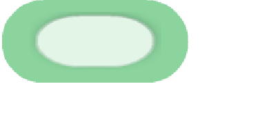
endif::[]

=== Customizing in your own theme

Your app's `theme.css` inherits from the installed native theme:

[source,css]
----
include::../demos/common/src/main/css/guide-snippets-theme.css[tag=native-themes-css-003,indent=0]
----

The user's CSS is layered on top of the native theme at app launch,
so refresh / restart picks the override up.

For a wholesale accent rebrand prefer redeclaring the
`--accent-color` (etc.) variables in your `#Constants` block - see
`Override from your app's theme.css` above. That single declaration
fans out through every UIID bound to the variable in the native
theme, no per-UIID rules required. Per-UIID redeclaration here
remains the right choice for tweaking non-accent properties
(typography, spacing, surface fills) the binding vocabulary doesn't
cover.

=== Inheriting from a native UIID

`cn1-derive` lets a custom UIID start from one of the native
theme's UIIDs and refine it:

[source,css]
----
include::../demos/common/src/main/css/guide-snippets-theme.css[tag=native-themes-css-004,indent=0]
----

`cn1-derive` works best when the relationship is *child refines
parent*. Avoid deriving across unrelated UIIDs (for example, a TitleArea
that derives from Toolbar) - inline the properties instead.

=== Translucency, glass effects, and the test harness

The iOS modern Dialog and Tabs use translucent surfaces (rgba with
alpha < 1) so any backdrop reads through the widget. To exercise
this in screenshot tests, the hellocodenameone fidelity tests
opt-in to a diagonal-stripe textured backdrop on the form
(`useTexturedBackdrop()` in `DualAppearanceBaseTest`). Translucent
widgets show their see-through tint against the stripes; opaque
widgets cover the stripes entirely.

CSS `backdrop-filter: blur(<length>)` and `filter: blur(<length>)` are
now recognized by the compiler and persisted in the theme as the
`backdropFilterBlur` and `filterBlur` Style properties (also reachable
programmatically via `Style#getBackdropFilterBlurRadius()` /
`Style#getFilterBlurRadius()`). Image-level blur is hardware-accelerated
(`CIGaussianBlur` on iOS, `RenderScript` / `RenderEffect` on Android,
JHLabs `GaussianFilter` in the simulator). Painting the blur into the
component framebuffer is still being wired up; until that lands, the
rgba approximation above remains useful for translucent surfaces.
