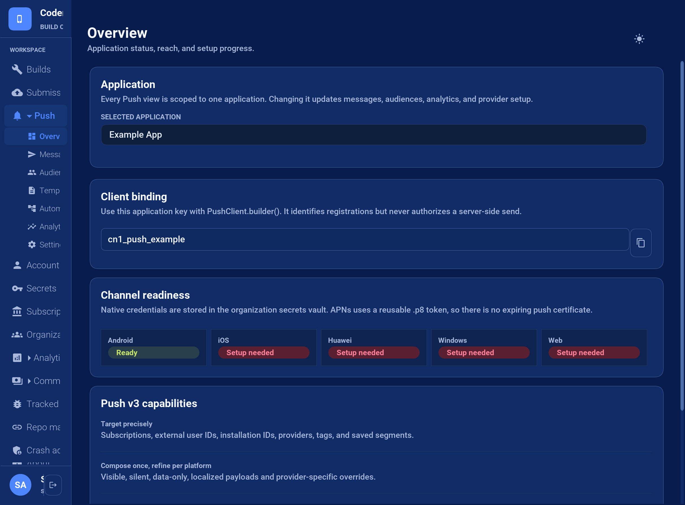
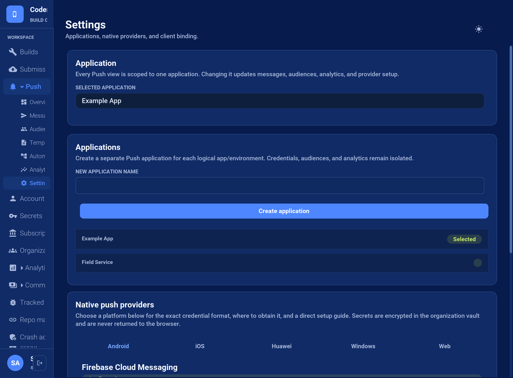
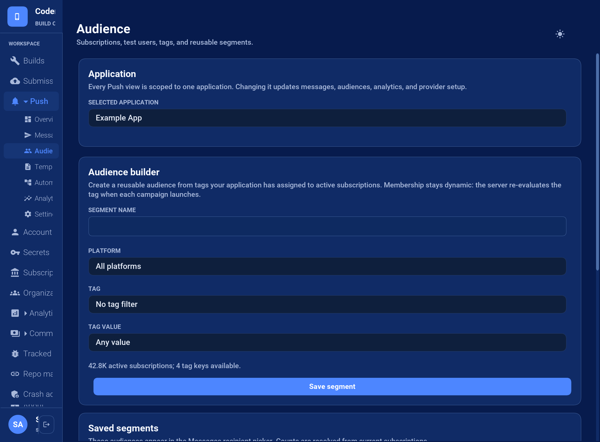
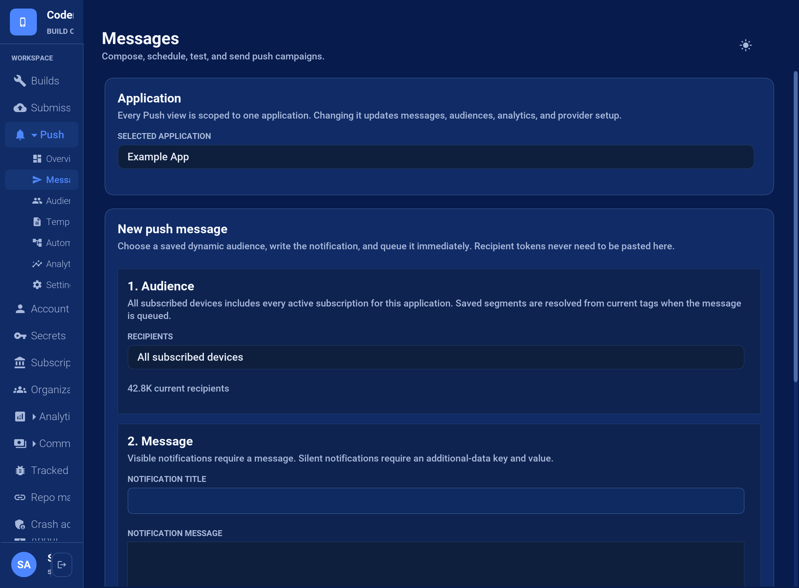

== Push notifications

[[push-notifications-section,Codename One Push Notifications]]
Codename One push uses a typed message envelope and an explicit client binding. Your main application class doesn't implement a push interface. The same application code receives messages from Android, iOS, Huawei devices, and supported web browsers.

You can use the managed BuildCloud service or install an adapter for custom native push. A custom-provider adapter is a low-level escape hatch: it bypasses BuildCloud registration and delivery completely, so your server owns tokens, credentials, targeting, quotas, retries, and provider errors.

=== Create and configure an application

Open the Codename One Console and select *Push*. Create one Push application for each logical application and environment. For example, keep production and staging separate so credentials, audiences, and analytics remain isolated.

The *Overview* page displays the client binding key and one readiness card for every supported provider. Copy the key into `PushClient.builder()`. Select any readiness card, including a green *Ready* card, to open *Settings* on that provider's tab.

.Push Overview shows the copyable application key and actionable provider readiness

Complete the provider setup tabs you need:

* *Android / FCM*: upload the Firebase service-account JSON file. The server uses the FCM HTTP v1 API.
* *iOS / APNs*: save the Apple team ID, key ID, bundle ID, and `.p8` signing key. Token authentication replaces expiring push certificates.
* *Huawei*: save the AppGallery Connect application ID and client secret. Add `agconnect-services.json` to the project and set `android.messagingService=huawei`.
* *Windows / WNS*: save the Package SID and client secret associated with the Store identity.
* *Web Push*: save the VAPID public and private keys and subject.

The managed backend includes WNS delivery for explicit Windows targets. It doesn't revive or generate bindings for the unsupported UWP port.

Credentials are encrypted in the BuildCloud secrets vault and are write-only. The setup UI shows whether each provider is configured but never reads a secret back. Rotate a credential by saving its replacement.

Cloud builds detect `PushClient` usage and generate the typed native bootstrap automatically. Android uses FCM unless `android.messagingService=huawei` selects Huawei Push Kit. iOS enables push support automatically when `PushClient` is referenced; set `ios.includePush=false` only when an installed custom-provider adapter intentionally owns registration.

Huawei Push Kit requires this typed `PushClient` flow. The deprecated classic
push API never supported Huawei device IDs.

The Console displays an application key. This key identifies an application during device registration; it isn't a server API key and doesn't authorize sending messages. Keep send API keys on your server.

.Provider Settings explains each credential and links to the provider console

=== Bind the client

Create one `PushClient`, retain it for the life of the application, and call `register()` after showing any permission rationale required by your UX:

[source,java]
----
include::../demos/common/src/main/java/com/codename1/demos/push/PushNotificationSnippets.java[tag=push-notifications-java-001,indent=0]
----

Registration is asynchronous. With managed delivery, the framework registers the native token with BuildCloud automatically. `PushSubscription` exposes the transport identifier, opaque native token, platform, expiry, and capability list for diagnostics. Application code shouldn't parse or persist the token.

Managed registration and explicit-target delivery are available on every plan.
Server-assigned external identities, tags, saved segments, templates, campaign
history, and analytics are database-backed Pro features. Free and Basic
applications can also provide a `PushRegistrationSink` without installing a
custom-provider adapter when they want to mirror registration material to their
own server.

Callbacks are delivered on the Codename One EDT. A notification received while the app is foregrounded is delivered directly. A notification tapped from a system tray is delivered after the application becomes ready. Silent/background execution remains subject to each OS's power and scheduling rules.

=== Build a message

`PushMessage` is the canonical message model on both sides of the wire:

[source,java]
----
include::../demos/common/src/main/java/com/codename1/demos/push/PushNotificationSnippets.java[tag=push-notifications-java-002,indent=0]
----

Common fields have consistent meanings on every provider. Add provider-specific settings under the `platform` object only when the common model isn't sufficient. Unknown settings are ignored by unrelated providers.

[source,json]
----
include::../demos/common/src/main/snippets/developer-guide/push-notifications.json[tag=push-notifications-json-001,indent=0]
----

Don't place secrets or irreplaceable data in a notification. Providers, operating systems, and lock-screen UI may retain or expose payloads.

=== Send from a server

Create an API key with the `push` scope in the Console. Submit a typed message and one or more provider targets to `POST /api/v3/push/messages`:

[source,bash]
----
include::../demos/common/src/main/snippets/developer-guide/push-notifications.sh[tag=push-notifications-bash-001,indent=0]
----

A successful admission returns HTTP `202` with durable delivery IDs and the current quota snapshot. Accepted recipients consume quota once. Provider retries don't consume more quota. Invalid targets are deactivated when the provider identifies them as permanent failures.

Use the Console for operator-driven messages. Templates, stored subscriptions, audience segments, campaign history, and other database-backed features require Pro. Automations require Enterprise.

=== Build audiences in the Console

Managed audiences are application-scoped. They don't contain copied device tokens. A saved segment stores a dynamic filter, and BuildCloud resolves that filter against active subscriptions when a campaign launches.

Your authenticated server assigns an external user ID and tags to an installation with `PUT /api/v3/push/apps/{appId}/installations/{installationId}`. Tags should be stable application facts such as `plan=pro`, `region=emea`, `role=technician`, or `testUser=true`. Don't let an untrusted client grant itself a privileged tag.

[source,json]
----
include::../demos/common/src/main/snippets/developer-guide/push-notifications.json[tag=push-notifications-json-005,indent=0]
----

Open *Push > Audience*. The tag and value pickers contain values discovered from current active subscriptions for the selected application. Choose an optional platform, choose one tag rule, enter a segment name, and select *Save segment*. The new segment appears immediately under *Saved segments* with its current recipient estimate. It also becomes available in the Messages recipient picker.

.Audience uses discovered tag values and shows every saved segment

Segments are evaluated at send time. Changing a subscription's tags changes future membership without editing the segment. A count is an estimate of the current state; registrations, subscription removals, and tag updates can change it before admission.

For a safe rollout, tag internal devices with `testUser=true`, create a test-user segment, and send the message there first. Create the production segment only from server-controlled tags.

=== Send a message from the Console

Open *Push > Messages* and complete the three numbered sections:

. *Audience*: choose *All subscribed devices* or a saved segment. The Console displays the current recipient estimate. Individual provider tokens aren't entered in this workflow.
. *Message*: enter a notification title and message. A visible notification requires message text. For a silent notification, enable *Silent / data-only notification* and provide an additional-data key and value. The Console builds valid JSON; operators don't paste JSON into the primary composer.
. *Delivery*: choose how long providers may retain an undelivered message. Console messages use safe cross-platform defaults and enter the durable queue immediately.

.The restrictive message composer accepts a saved audience and typed fields

Select *Queue message* only after checking the audience name and estimate. BuildCloud creates the campaign, resolves the segment, applies organization quota and rate limits, and admits the recipients to the durable delivery queue. The provider may accept a notification that the device never displays, so inspect *Push > Analytics* for provider acceptance and failures without treating acceptance as device delivery.

=== Enterprise event automations

An automation is an enabled rule containing `trigger.event`, a schema-3 `message`, an optional `audience`, and an optional `delaySeconds`. If no audience is stored in the rule, the event must identify an `externalUserId` or `installationId`. Text fields in the message can insert event properties with `${event.propertyName}`.

[source,json]
----
include::../demos/common/src/main/snippets/developer-guide/push-notifications.json[tag=push-notifications-json-002,indent=0]
----

Your server triggers enabled rules with `POST /api/v3/push/apps/{appId}/events` using a `push`-scoped API key:

[source,json]
----
include::../demos/common/src/main/snippets/developer-guide/push-notifications.json[tag=push-notifications-json-003,indent=0]
----

Immediate matches enter the durable delivery queue. Delayed matches become scheduled campaigns, so restarts don't lose them. Automations are intentionally push rules, not a general-purpose customer journey or analytics product.

=== Quotas and rate limits

Push allowance is owned by the organization. The monthly allowance is multiplied by purchased seats:

[cols="1,1,1,1"]
|===
|Plan |Recipients per seat/month |Requests/minute |Recipients/minute

|Free |1,000 |30 |100
|Basic |5,000 |120 |1,000
|Pro |1,000,000 |600 |10,000
|Enterprise |10,000,000 |3,000 |100,000
|===

Limits apply across all applications and API keys in the organization. Hot
admission counters are cached per server and flushed in batches. They can
slightly under-count after failover or simultaneous admission on multiple
servers; this is intentional so quota bookkeeping never puts a database lock in
the delivery hot path. Large campaigns are paced by the durable queue and
bounded provider concurrency.

=== Widgets and live surfaces

A push can publish widget content or update a live activity before the regular listener receives the message. The `surface` object uses one of these operations:

[source,json]
----
include::../demos/common/src/main/snippets/developer-guide/push-notifications.json[tag=push-notifications-json-004,indent=0]
----

For a live activity use `live-update` or `live-end` with `id`, serialized `state`, and optional `dismissImmediately`. Unsupported surfaces are ignored. A surface command runs when the Codename One runtime receives the envelope. On platforms that don't start application code for a background push, the native queue preserves the command and applies it on the next start or resume. Applications must therefore refresh stale surface state during foreground activation too.

=== Install a custom native push adapter

A CN1Lib can implement `PushTransport` for a private native push service. It must obtain native registration material and forward incoming messages as the canonical JSON envelope. A matching `PushRegistrationSink` stores and removes the subscription on your server:

[source,java]
----
include::../demos/common/src/main/java/com/codename1/demos/push/PushNotificationSnippets.java[tag=push-notifications-java-003,indent=0]
----

When a `PushTransport` implementation is present, `PushClient` never contacts BuildCloud. The adapter calls its callback's `message()` method with a schema-3 envelope. This API intentionally stays low-level so native provider SDKs aren't coupled to the managed backend.

=== Testing delivery behavior

Hosted CI has no installed application, OS push daemon, permission state, or physical device, so it can't prove provider-to-device delivery. Codename One tests at the lowest controllable boundary instead. `PushClientTransportTest` injects a fake native transport and covers:

* foreground, background, force-stopped, and cold-start delivery;
* notification tap, action, dismissal, and deep-link routing;
* permission granted, denied, and later changed in system settings;
* token rotation, reinstall, expiry, logout, and multiple installations per user;
* silent delivery and simulated constrained-state replay;
* collapse keys, TTL expiry, Unicode, maximum payloads, images, and provider errors;
* queued widget and live-activity updates replayed at the native/runtime seam;
* retry idempotency, dead-letter behavior, quota boundaries, and rate limiting.

The JavaScript contract executes the real service-worker source with mocked browser clients and notification APIs. BuildCloud has a separate local suite using mocked provider HTTP responses for compatibility translation, credentials, quota/rate accounting, durable queue behavior, retries, and automations. Physical-device sends are optional release diagnostics rather than a CI or nightly requirement. Provider acceptance isn't proof of device delivery.
