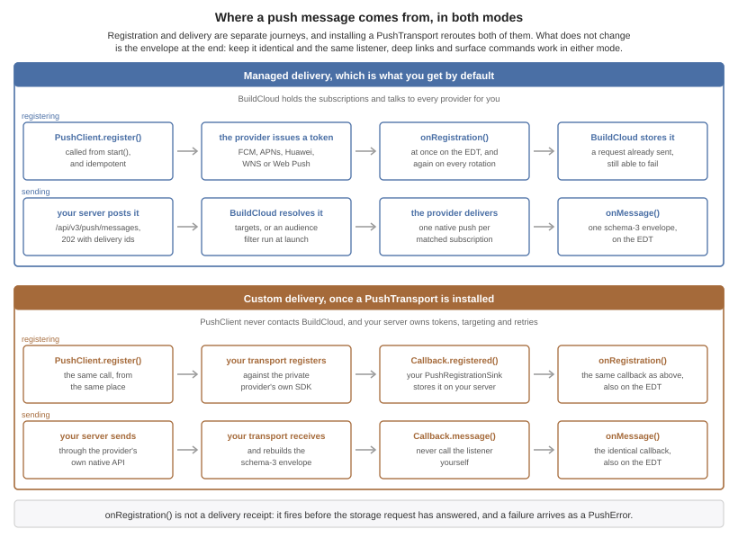
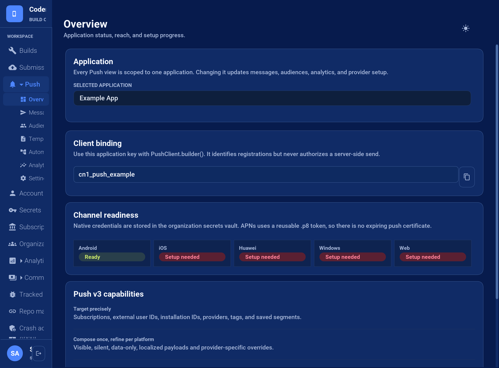
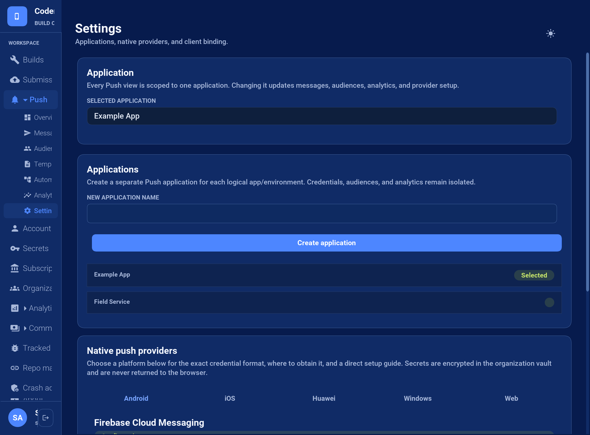
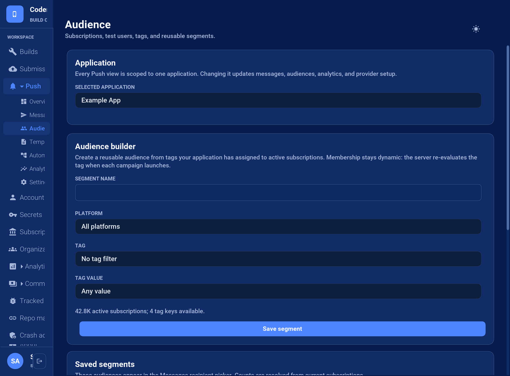
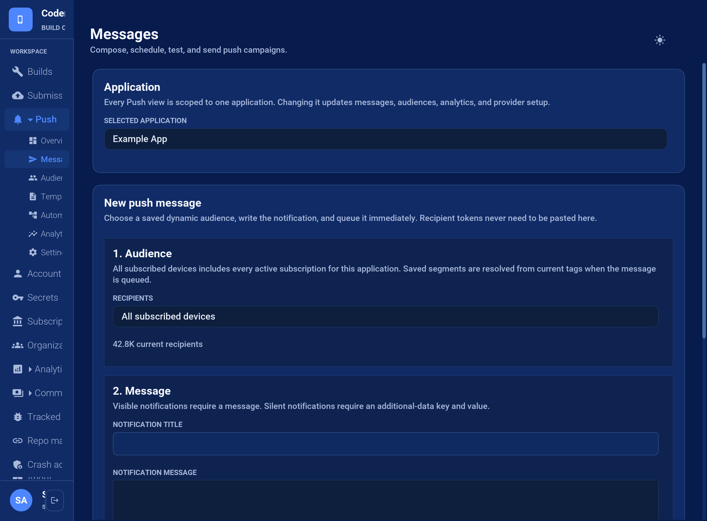

== Push notifications

[[push-notifications-section,Codename One Push Notifications]]
Codename One push uses a typed message envelope and an explicit client binding. Your main application class doesn't implement a push interface. The same application code receives messages from Android, iOS, Huawei devices, and supported web browsers.

You can use the managed BuildCloud service or install an adapter for custom native push. A custom-provider adapter is a low-level escape hatch: it bypasses BuildCloud registration and delivery completely, so your server owns tokens, credentials, targeting, retries, and provider errors.

That choice reroutes both halves of the journey, registration and delivery, and leaves the application code
alone. The rest of this chapter fills in each box.

.Registration and delivery, managed and custom

=== Create and configure an application

Open the Codename One Console and select *Push*. Create one Push application for each logical application and environment. For example, keep production and staging separate so credentials, audiences, and analytics remain isolated.

The *Overview* page displays the client binding key and one readiness card for every supported provider. Copy the key into `PushClient.builder()`. Select any readiness card, including a green *Ready* card, to open *Settings* on that provider's tab.

.Push Overview shows the copyable application key and actionable provider readiness

Complete the provider setup tabs you need:

* *Android / FCM*: upload the Firebase service-account JSON file. The server uses the FCM HTTP v1 API.
* *iOS / APNs*: save the Apple team ID, key ID, bundle ID, and `.p8` signing key. Token authentication replaces expiring push certificates.
* *Huawei*: save the AppGallery Connect application ID and client secret. Add `agconnect-services.json` to the project.
* *Windows / WNS*: save the Package SID and client secret associated with the Store identity.
* *Web Push*: save the VAPID public and private keys and subject.

The managed backend includes WNS delivery for explicit Windows targets. It doesn't revive or generate bindings for the unsupported UWP port.

Credentials are encrypted in the BuildCloud secrets vault and are write-only. The setup UI shows whether each provider is configured but never reads a secret back. Rotate a credential by saving its replacement.

Cloud builds detect `PushClient` usage and generate the typed native bootstrap automatically. On Android, include `google-services.json`, `agconnect-services.json`, or both. A build with both configurations uses FCM when Google Play Services are available on the device and falls back to Huawei Push Kit otherwise. No provider-selection build hint is required. The `android.messagingService=fcm` and `android.messagingService=huawei` hints remain available only when an application intentionally needs to force one provider.

iOS enables push support automatically when `PushClient` is referenced; set `ios.includePush=false` only when an installed custom-provider adapter intentionally owns registration.

The Console displays an application key. This key identifies an application during device registration; it isn't a server API key and doesn't authorize sending messages. Keep send API keys on your server.

.Provider Settings explains each credential and links to the provider console

=== Bind the client

Create one `PushClient` in `init()`, retain it in a field on the main application class, and call `register()` from `start()` after showing any permission rationale required by your UX:

[source,java]
----
include::../demos/common/src/main/java/com/codename1/demos/push/PushNotificationSnippets.java[tag=push-notifications-java-001,indent=0]
----

`start()` can run more than once during one process lifetime. `register()` is idempotent, so the example can call it on every start without creating duplicate native registrations. Don't call `unregister()` from `stop()`: it removes the device subscription. Call it only for an explicit user opt-out or account-removal workflow.

Registration is asynchronous. With managed delivery, the framework registers the native token with BuildCloud automatically. `PushSubscription` exposes the transport identifier, opaque native token, platform, installation ID, expiry, and capability list for diagnostics. Application code shouldn't parse the token or use it as a user identity.

On Android, the native bootstrap can obtain and persist an FCM or Huawei token before `start()` installs the `PushClient` callback. `register()` replays that persisted token after activating the listener and then asks the provider to refresh it, so the documented `init()`/`start()` lifecycle doesn't lose early registration.

==== Listener lifecycle and early messages

`PushClient.Builder.listener()` is mandatory, and `build()` fails immediately if it's missing. The client retains that listener until deregistration completes. Codename One doesn't locate listeners with reflection or `Class.forName()`: the application must build, retain, and register the client explicitly. Only one `PushClient` can be active in a process; a second client reports an `active_client` error instead of replacing the first listener.

Every `PushListener` and `PushRegistrationSink` callback runs on the Codename One EDT:

* `onRegistration()` runs after initial native registration and can run again when a provider rotates its token. Replace the previous server-side token for that installation.
* `onMessage()` receives one parsed schema-3 envelope. A foreground notification can arrive immediately. A visible background notification normally arrives after the user opens it.
* `onError()` reports registration and envelope errors. Use `PushError.getCode()` for decisions; diagnostic text isn't a stable contract.

Native ports preserve a cold-start notification until the runtime can deliver it. If the runtime starts before the application calls `register()`, `PushClient` keeps a bounded process-local queue and replays it after activation. If the application never registers its client, it has provided no listener and can't expect application callbacks. Silent/background execution remains subject to each OS's power and scheduling rules, so refresh authoritative state whenever the application resumes.

=== Build a message

`PushMessage` is the canonical message model on both sides of the wire:

[source,java]
----
include::../demos/common/src/main/java/com/codename1/demos/push/PushNotificationSnippets.java[tag=push-notifications-java-002,indent=0]
----

Common fields have consistent meanings on every provider. Add provider-specific settings under the `platform` object only when the common model isn't sufficient. Unknown settings are ignored by unrelated providers.

[source,json]
----
include::../demos/common/src/main/snippets/developer-guide/push-notifications.json[tag=push-notifications-json-001,indent=0]
----

Don't place secrets or irreplaceable data in a notification. Providers, operating systems, and lock-screen UI may retain or expose payloads.

=== Send from a server

Create an API key with the `push` scope in the Console. Submit a typed message and one or more provider targets to `POST /api/v3/push/messages`:

[source,bash]
----
include::../demos/common/src/main/snippets/developer-guide/push-notifications.sh[tag=push-notifications-bash-001,indent=0]
----

A successful admission returns HTTP `202` with durable delivery IDs. Invalid targets are deactivated when the provider identifies them as permanent failures.

The complete request, response, authentication, error, target, and message schemas are in the https://cloud.codenameone.com/openapi/push-v3.yaml[Push sending OpenAPI 3.0 specification]. Import that file into Swagger UI, an OpenAPI code generator, or an API client instead of reproducing DTOs from this chapter.

Use the Console for operator-driven messages, stored audiences, campaigns, analytics, and automations.

=== Learn which sends failed

A notification is acknowledged when it's admitted, not when it arrives. Both
wire APIs
answer before any provider has been asked -- the classic endpoint replies
`queued` -- so the verdict lands seconds later, after your request has already
returned. Nothing in the response can tell you that a device key is dead, and
a dead key stays in your database being sent to.

Delivery feedback closes that. Configure an HTTPS endpoint and BuildCloud posts
a signed digest of the outcomes since the last one, once a day. It's available
on Pro and above, and it's configured per organization rather than per
application: callers on the classic API register an application per send, so
there is nothing stable there to attach a setting to.

Open *Push > Settings > Delivery feedback*, enter the endpoint, enable the daily
digest, and select *Send test event*. The test posts one synthetic event through
the same signing and sending path as a real digest and reports what your
endpoint answered, so a broken receiver is visible immediately rather than a day
later. The signing secret is on the same card.

==== What arrives

Failures are itemized and successes are counted. A busy application produces
thousands of accepted deliveries a day and nothing can be done about any of
them, so listing them would bury the handful of events that matter.

[source,json]
----
include::../demos/common/src/main/snippets/developer-guide/push-notifications.json[tag=push-notifications-json-006,indent=0]
----

`reason` is the provider-independent verdict, and it decides what you do:

[cols="1,3"]
|===
|`INVALID_TARGET` |The provider rejected the key. Delete it from your database; it will never work again.
|`PERMANENT_FAILURE` |The provider refused the message or the credential. Fix the send, keep the key.
|`TRANSIENT_FAILURE` |Retried until the attempt budget ran out. `status` is `DEAD`. The key may still be good.
|===

Store the canonical provider and bare `token` (or web-push `endpoint`) in
separate columns alongside the original key returned by `Push.getPushKey()`.
The full key has a `cn1-<provider>-` prefix, so comparing it directly with the
digest's bare token matches no row. Normalize `gcm` to `fcm` and `ios` to
`apns` during registration and backfill existing rows before enabling cleanup.
For web push, store the subscription endpoint in its own column.
Match feedback on the provider and this normalized target, scoped to the
organization. Keep the full original key for sending.

==== Semantics to build against

* *A digest is at-least-once.* Deduplicate on `deliveryId` when present. For classic events without it, use a key built from the provider, token or endpoint, and event timestamp `at`. A refused digest is resent, and a network failure can deliver one whose response never arrived.
* *Only 2xx acknowledges the window.* It advances the watermark and that window is never sent again, so answer 2xx after your writes are durable, not before. Anything else, including a timeout, keeps the window for the next attempt.
* *`truncated` means more is waiting.* A digest is capped, and the next page follows in the same run rather than a day later. Expect several digests in quick succession after a bad day.
* *A failing endpoint is retried, then disabled.* Failures are retried on a shorter cadence than the daily digest; after several consecutive failures the endpoint is disabled and the reason appears on the Settings card. Re-enabling it clears the count.
* *`eventsOmitted` counts accepted deliveries*, which appear only in `summary`.
* *One digest can span applications.* The endpoint belongs to the organization, so a receiver that keeps a device store per application correlates on `deliveryId` -- the id the v3 send returned -- or on the device key itself, which providers issue per application. A classic send returns no delivery id, so for those the key is the correlation.

==== Verify the signature

Every request carries `X-CN1-Signature: t=<unix-millis>,v1=<hex>`, where the hex
is HMAC-SHA256 over `<t>.<raw body>` keyed with your signing secret. The
timestamp is inside the signed material, so a captured digest can be rejected
by age as well as shown to come from BuildCloud.

Three things are easy to get wrong, and each one fails without a symptom or
fails open:

. *Sign the bytes you received.* Any middleware that parses JSON and re-serializes it produces a different byte string that never verifies.
. *Compare in constant time.* A comparison that returns on the first differing byte leaks enough timing to recover a valid signature.
. *Reject old timestamps.* Without an age bound the signature alone permits replay forever.

==== A Codename One backend receiver

The <<Server-side backend>> takes the raw request when a handler needs the
exact body, which is what signature verification requires:

[source,java]
----
include::../demos/backend/src/main/java/com/codenameone/developerguide/backend/PushFeedback.java[tag=push-feedback-backend,indent=0]
----

==== A long-running Node server

The same three rules, with the raw-body trap in the form it usually takes:

[source,javascript]
----
include::../demos/javascript/src/main/snippets/developer-guide/push-notifications.js[tag=push-notifications-javascript-003,indent=0]
----

==== A serverless function

A function behind an HTTP gateway differs in two ways that are silent when they
are wrong: the gateway may hand you the body base64-encoded, and there is no
process to keep deduplication state in.

[source,javascript]
----
include::../demos/javascript/src/main/snippets/developer-guide/push-notifications.js[tag=push-notifications-javascript-004,indent=0]
----

==== A Spring server

`byte[]` rather than a mapped type, for the reason above: what Jackson parses
and re-serializes is a different byte string.

[source,java]
----
include::../demos/serverframeworks/src/main/java/com/codenameone/developerguide/serverframeworks/PushFeedbackSpring.java[tag=push-notifications-java-spring,indent=0]
----

==== A MicroProfile or Jakarta REST server

The same shape with `@HeaderParam` and a `byte[]` entity, taking the secret from
MicroProfile Config:

[source,java]
----
include::../demos/serverframeworks/src/main/java/com/codenameone/developerguide/serverframeworks/PushFeedbackMicroProfile.java[tag=push-notifications-java-microprofile,indent=0]
----

==== Any other stack

The contract is a signed JSON POST, so a receiver in Go, Python, PHP, Ruby or a
JVM framework is the same three steps: HMAC-SHA256 over `<t>.<raw body>`,
constant-time compare against `v1`, reject a `t` outside your age window. Then
apply each event no more than once, and answer 2xx after it's stored.

=== Build audiences in the Console

Managed audiences are application-scoped. They don't contain copied device tokens. A saved segment stores a dynamic filter, and BuildCloud resolves that filter against active subscriptions when a campaign launches.

Your authenticated server assigns an external user ID and tags to an installation with `PUT /api/v3/push/apps/{appId}/installations/{installationId}`. Tags should be stable application facts such as `subscription=active`, `region=emea`, `role=technician`, or `testUser=true`. Don't let an untrusted client grant itself a privileged tag.

[source,json]
----
include::../demos/common/src/main/snippets/developer-guide/push-notifications.json[tag=push-notifications-json-005,indent=0]
----

Open *Push > Audience*. The tag and value pickers contain values discovered from current active subscriptions for the selected application. Choose an optional platform, choose one tag rule, enter a segment name, and select *Save segment*. The new segment appears immediately under *Saved segments* with its current recipient estimate. It also becomes available in the Messages recipient picker.

.Audience uses discovered tag values and shows every saved segment

Segments are evaluated at send time. Changing a subscription's tags changes future membership without editing the segment. A count is an estimate of the current state; registrations, subscription removals, and tag updates can change it before admission.

For a safe rollout, tag internal devices with `testUser=true`, create a test-user segment, and send the message there first. Create the production segment only from server-controlled tags.

=== Send a message from the Console

Open *Push > Messages* and complete the three numbered sections:

. *Audience*: choose *All subscribed devices* or a saved segment. The Console displays the current recipient estimate. Individual provider tokens aren't entered in this workflow.
. *Message*: enter a notification title and message. A visible notification requires message text. For a silent notification, enable *Silent / data-only notification* and provide an additional-data key and value. The Console builds valid JSON; operators don't paste JSON into the primary composer.
. *Delivery*: choose how long providers may retain an undelivered message. Console messages use safe cross-platform defaults and enter the durable queue immediately.

.The restrictive message composer accepts a saved audience and typed fields

Select *Queue message* only after checking the audience name and estimate. BuildCloud creates the campaign, resolves the segment, and admits the recipients to the durable delivery queue. The provider may accept a notification that the device never displays, so inspect *Push > Analytics* for provider acceptance and failures without treating acceptance as device delivery.

=== Event automations

An automation is an enabled rule containing `trigger.event`, a schema-3 `message`, an optional `audience`, and an optional `delaySeconds`. If no audience is stored in the rule, the event must identify an `externalUserId` or `installationId`. Text fields in the message can insert event properties with `${event.propertyName}`.

[source,json]
----
include::../demos/common/src/main/snippets/developer-guide/push-notifications.json[tag=push-notifications-json-002,indent=0]
----

Your server triggers enabled rules with `POST /api/v3/push/apps/{appId}/events` using a `push`-scoped API key:

[source,json]
----
include::../demos/common/src/main/snippets/developer-guide/push-notifications.json[tag=push-notifications-json-003,indent=0]
----

Immediate matches enter the durable delivery queue. Delayed matches become scheduled campaigns, so restarts don't lose them. Automations are intentionally push rules, not a general-purpose customer journey or analytics product.

=== Widgets and live surfaces

A push can publish widget content or update a live activity before the regular listener receives the message. The `surface` object uses one of these operations:

[source,json]
----
include::../demos/common/src/main/snippets/developer-guide/push-notifications.json[tag=push-notifications-json-004,indent=0]
----

For a live activity use `live-update` or `live-end` with `id`, serialized `state`, and optional `dismissImmediately`. Unsupported surfaces are ignored. A surface command runs when the Codename One runtime receives the envelope. On platforms that don't start application code for a background push, the native queue preserves the command and applies it on the next start or resume. Applications must therefore refresh stale surface state during foreground activation too.

=== Use an application-owned push server

A custom server is a low-level alternative to managed push; it doesn't reuse the BuildCloud protocol at a different endpoint. A CN1Lib implements `PushTransport` around the private provider's native SDK. It obtains native registration material, reports token rotation, and forwards incoming data as the canonical schema-3 JSON envelope. A matching `PushRegistrationSink` stores and removes the subscription on your server:

[source,java]
----
include::../demos/common/src/main/java/com/codename1/demos/push/PushNotificationSnippets.java[tag=push-notifications-java-003,indent=0]
----

When a `PushTransport` implementation is present, `PushClient` never contacts BuildCloud. Your implementation owns these responsibilities:

* `getId()` returns a stable provider ID that your server understands.
* `isSupported()` checks whether the SDK can operate on this device.
* `register()` invokes `Callback.registered()` with a `PushSubscription`, then reports later token rotations through the same callback.
* `unregister()` removes the provider subscription and invokes `Callback.unregistered()` when complete.
* Incoming native messages call `Callback.message()` with one complete schema-3 envelope. Don't call the application listener directly and don't invent a second payload format.
* Registration or transport failures call `Callback.failed()`. The callback is thread-safe; `PushClient` moves application-facing callbacks to the EDT.

The registration sink should asynchronously insert or update the subscription by `installationId` on your server and replace its token when it rotates. The server then sends through your provider's native API. It must preserve the schema-3 envelope so the same `PushListener`, deep-link handling, and surface commands work in managed and custom-server modes.

The application still follows the normal lifecycle: retain one client, call `register()` from `start()`, and reserve `unregister()` for an actual opt-out. This custom integration doesn't introduce reflection or automatic listener discovery.

=== Testing delivery behavior

Hosted CI has no installed application, OS push daemon, permission state, or physical device, so it can't prove provider-to-device delivery. Codename One tests at the lowest controllable boundary instead. `PushClientTransportTest` injects a fake native transport and covers:

* foreground, background, force-stopped, and cold-start delivery;
* notification tap, action, dismissal, and deep-link routing;
* permission granted, denied, and later changed in system settings;
* token rotation, reinstall, expiry, logout, and multiple installations per user;
* silent delivery and simulated constrained-state replay;
* collapse keys, TTL expiry, Unicode, maximum payloads, images, and provider errors;
* queued widget and live-activity updates replayed at the native/runtime seam;
* retry idempotency and dead-letter behavior.

The JavaScript contract executes the real service-worker source with mocked browser clients and notification APIs. BuildCloud has a separate local suite using mocked provider HTTP responses for compatibility translation, credentials, durable queue behavior, retries, and automations. Physical-device sends are optional release diagnostics rather than a CI or nightly requirement. Provider acceptance isn't proof of device delivery.
