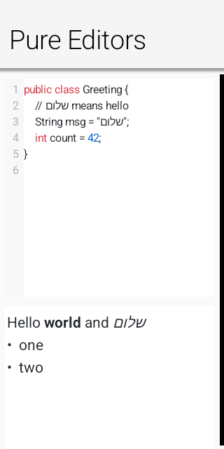
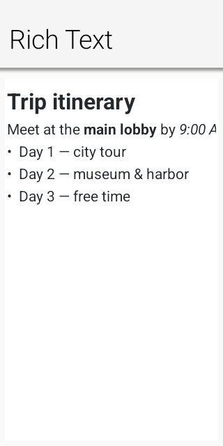
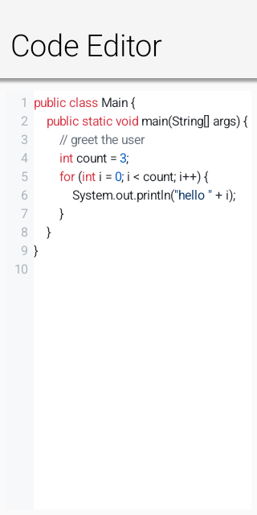

[[text-editing]]
== Rich Text and Code Editing

Codename One includes two full-document editors. Use
https://www.codenameone.com/javadoc/com/codename1/ui/RichTextArea.html[`RichTextArea`] when users
compose formatted prose and the application stores HTML. Use
https://www.codenameone.com/javadoc/com/codename1/ui/CodeEditor.html[`CodeEditor`] for source code,
configuration files, queries, or any text that benefits from syntax highlighting, line numbers,
completion, and diagnostics. Both are lightweight Codename One components and share the same editing,
selection, scrolling, undo, and platform-input infrastructure. When you only need to _display_
formatted text — no editing — use
https://www.codenameone.com/javadoc/com/codename1/ui/RichTextComponent.html[`RichTextComponent`], the
read-only, word-wrapping renderer described later in this chapter; it reuses the same document model
and styling engine.

.The rich-text and code editors rendered by the same lightweight engine

=== Editor architecture and backend selection

Both components extend
https://www.codenameone.com/javadoc/com/codename1/ui/AbstractEditorComponent.html[`AbstractEditorComponent`].
The public components send semantic commands and queries to one of two backends:

* A port can provide a native peer through `CodenameOneImplementation.createNativeEditorPeer(...)`.
* Otherwise the components use the pure Codename One engine in `com.codename1.ui.editor`. It paints
  text, selections, carets, gutters, diagnostics, and completion UI with `Graphics` and `Font`, and
  it drives keyboard and IME input through the low-level text-input contract.

Backend selection is transparent to application code. `isNativeEditor()` reports the native-peer case.
The pure engine is the default renderer on every platform; there is no browser fallback.

Editor initialization can be asynchronous for a native peer. Commands issued immediately after
construction are queued. Use `onReady(Runnable)` or a ready listener when work must run only after the
backend exists. Reads use callbacks (`getHtml(...)`, `getText(...)`, and `getCursorPosition(...)`) so
the same application code works with either backend.

==== The editor package

The `com.codename1.ui.editor` package separates editing mechanics from feature-specific rendering.
`EditorDocument` owns normalized UTF-16 text and line offsets. `EditorView` owns the caret, selection,
composition range, scrolling, hit testing, clipboard commands, and undo transactions. `CodeView` and
`RichView` extend that surface instead of creating independent input implementations.

The code layer adds incremental tokenization, palettes, completion, diagnostics, indentation, and the
line-number gutter. The rich layer keeps `InlineStyles`, `RichBlocks`, hyperlink targets, and image
runs parallel to the text. Every mutation, including undo and redo, updates those parallel models in
the same transaction. `HtmlImporter` and `HtmlSerializer` are model adapters; they don't implement a
second HTML tokenizer. Fragment parsing and entity decoding go through the framework's tolerant
`HTMLParser`, which extends `XMLParser`. The parser's fragment mode retains modern attributes such as
`data-*` while the legacy `HTMLComponent` path keeps its existing validation behavior.

`EditorHost` is the narrow bridge between a view and its owner. It starts and stops platform text
input, pushes updated editing state to the port, and reports semantic editor events. This split lets
the same document and interaction engine run inside the full editors and inside the lightweight
`EditField` component.

=== Focus, change events, and editability

`focusEditor()` moves focus into the editing surface and opens the virtual keyboard when appropriate.
`blurEditor()` relinquishes focus and dismisses the active platform input session. `setEditable(false)`
keeps the document visible while preventing edits; `CodeEditor.setReadOnly(true)` is the code-oriented
equivalent.

Register an `addChangeListener(...)` listener to observe user edits and programmatic mutations. Avoid
saving on every keystroke when serialization or storage is expensive; debounce the listener, then read
the document through the asynchronous callback.

=== Platform text input and input methods

The pure editor doesn't treat a key release as text. Modern input can come from a virtual keyboard,
autocorrect, dictation, handwriting, a hardware keyboard, or an input method editor (IME). The platform
therefore drives a
https://www.codenameone.com/javadoc/com/codename1/ui/TextInputClient.html[`TextInputClient`] with
semantic operations:

* `commitText(...)` inserts final text, including accepted autocorrect and dictation results.
* `setComposingText(...)` replaces the current marked-text range while an IME is still composing.
  `finishComposing()` finalizes that range.
* `deleteSurroundingText(...)` implements soft-keyboard deletion without manufacturing key codes.
* `onKeyCommand(...)` carries navigation, selection, clipboard, undo, and redo commands.
* Geometry methods map UTF-16 offsets to caret and selection rectangles so native candidate windows,
  selection handles, and accessibility UI align with the lightweight rendering.

https://www.codenameone.com/javadoc/com/codename1/ui/TextInputConfig.html[`TextInputConfig`] tells the
port which keyboard constraint, return-key action, autocorrection, capitalization, and multiline
behavior the client needs. Rich prose enables normal language assistance; source editing disables
autocorrection and automatic capitalization. The immutable
https://www.codenameone.com/javadoc/com/codename1/ui/TextInputState.html[`TextInputState`] returns the
authoritative text, selection, and composing range to the port after each edit.

All offsets in this contract are UTF-16 indices, matching Java `String`, Android `Editable`, and Apple
string indices. The document canonicalizes CRLF and bare CR line endings to LF before it updates the
caret, undo history, formatting runs, or platform state. Port authors must deliver composition updates
on the EDT and must stop the input session when the client loses focus.

NOTE: `TextInputClient`, `TextInputConfig`, and `TextInputState` are general port-level APIs. Custom
lightweight editing components can implement the same protocol, but ordinary applications normally use
`RichTextArea` or `CodeEditor` and don't bind an input client directly.

=== Lightweight fields with EditField

`TextArea` and `TextField` keep their established native editing behavior. When an application wants
Codename One to retain control of painting, selection, scrolling, focus, and clipboard handling for a
plain field, use
https://www.codenameone.com/javadoc/com/codename1/ui/EditField.html[`EditField`]. It offers an API
familiar from `TextField` -- hint text, constraint, single-line or multiline mode, rows and columns,
data-change listeners, and action events -- but renders and edits entirely through the pure
`com.codename1.ui.editor` engine, with no native peer. Adoption is opt-in per component; existing
`TextField` and `TextArea` usages are unaffected.

[source,java]
----
include::../demos/common/src/main/java/com/codenameone/developerguide/snippets/generated/RichTextAndCodeEditingJavaSnippet.java[tag=rich-text-and-code-editing-java-lightweight-fields,indent=0]
----

`EditField` extends `EditorView` directly, so selection, caret navigation, arrow-key movement, undo,
and clipboard commands are the same mechanics the full editors use. A single-line `EditField` fires
its action event on the return key and strips embedded newlines; a multiline `EditField` grows to its
configured row count. Because there is no native overlay, the field behaves identically on every
platform that implements the low-level text-input contract.

=== Selection, bidirectional text, and scrolling

On touch devices, a tap places the caret, a long press selects a word, and draggable handles adjust the
selection. The loupe follows a handle or long-press placement gesture. A normal one-finger drag scrolls
the document and doesn't turn the swipe into a selection. On desktop, mouse drag selects text,
double-click selects a word, triple-click selects a line, and the mouse wheel or trackpad scrolls the
document. Standard command/control shortcuts handle copy, cut, paste, select all, undo, and redo.

Hebrew, Arabic, and mixed left-to-right/right-to-left lines use Unicode bidirectional layout. Glyph
painting, hit testing, caret movement, and selection rectangles share the same visual runs. Set the
component's RTL flag to choose the paragraph base direction.

=== RichTextArea

`RichTextArea` accepts and returns an HTML fragment. The importer maps common paragraph, heading,
blockquote, preformatted, list, link, image, bold, italic, underline, strike-through, color, highlight,
and relative-size markup into a document model. `getHtml(...)` emits canonical HTML from that model; it
preserves meaning rather than the input's exact whitespace, tag aliases, or attribute order.

[source,java]
----
include::../demos/common/src/main/java/com/codenameone/developerguide/snippets/generated/TheComponentsOfCodenameOneJava115Snippet.java[tag=the-components-of-codename-one-java-115,indent=0]
----

.RichTextArea rendering headings, inline formatting, and a list

The formatting methods act on the current selection: `bold()`, `italic()`, `underline()`,
`strikeThrough()`, ordered and unordered lists, indentation, alignment, foreground and highlight
colors, block formats, and font sizes. `queryCommandState(...)` keeps toolbar toggles synchronized with
the selection. `removeFormat()` clears inline formatting; `undo()` and `redo()` restore text together
with inline styles, paragraph attributes, links, and image runs.

Use `setHtml(...)` to replace the document and `insertHtml(...)` to insert a fragment at the selection.
Fragment insertion retains its formatting and block structure. `createLink(url)` stores the target in
the model, and `removeLink()` removes it. `insertImage(url)` accepts normal URLs, data URIs, and supported
application resources; the source is retained so `getHtml(...)` can emit an `img` element when the
document is saved and reloaded.

==== HTML, RTF, Markdown, and AsciiDoc

`setContent(...)` and `insertContent(...)` accept a `RichTextFormat`. HTML is parsed directly with the
shared `HTMLParser`. Markdown and AsciiDoc use their own bidirectional model adapters; they never pass
through HTML. Headings, emphasis, inline code, links, images, lists, quotes, and literal blocks are
mapped directly to the rich model and serialized directly back with `getMarkdown(...)` or
`getAsciiDoc(...)`. The RTF importer likewise maps paragraph breaks, Unicode escapes, bold, italic,
underline, strike-through, and skips metadata destinations such as font and color tables.

Editing and reading the same format returns canonical output for that format. Requesting a different
output format performs an explicit model conversion, just as `getHtml(...)` canonicalizes a visual
rich-text document.

[source,java]
----
include::../demos/common/src/main/java/com/codenameone/developerguide/snippets/generated/RichTextAndCodeEditingJavaSnippet.java[tag=rich-text-and-code-editing-java-formats,indent=0]
----

Rich paste uses `ClipboardContent`, a MIME-keyed container exposed by `Display.copyToClipboard(...)`
and `Display.getClipboardContent()`. `RichTextClipboardData` is its convenience subtype for
`text/plain`, `text/html`, `text/rtf`, `text/markdown`, and `text/asciidoc`. A writer publishes all
representations in one operation and a reader selects the richest format it understands; plain
`EditorView` consumers use `text/plain`. Copying a rich selection publishes canonical HTML, RTF,
Markdown, AsciiDoc, and the required plain fallback. Java SE publishes native `DataFlavor` values,
Android publishes native plain and HTML clip data, the JavaScript port uses `ClipboardItem` when the
browser allows it, and iOS publishes pasteboard types. A port that only has a text clipboard still
publishes plain text externally and retains the complete `ClipboardContent` for in-application use.

The negotiation API belongs at the implementation boundary, not inside `RichTextArea`. Port authors
override clipboard handling in `CodenameOneImplementation` and return the formats actually present on
the system clipboard. Applications can use the same API for domain-specific formats without changing
the editor.

RTF is also recognized when a clipboard provider returns it as a string beginning with an RTF header.
Format import is intentionally a practical interchange subset, not a layout-compatible word
processor: unsupported RTF destinations and advanced Markdown or AsciiDoc extensions degrade to the
supported text and structure rather than controlling document layout.

TIP: Treat imported HTML as document data, not as a browser page. The pure importer doesn't execute
scripts. Keep image URLs and link destinations subject to the same trust and validation rules used by
the rest of the application.

=== Read-only rich text with RichTextComponent

`RichTextComponent` (in `com.codename1.ui`) is the read-only counterpart to `RichTextArea`. It renders
multi-styled, word-wrapped text — headings, bold, italic, underline, strike-through, inline code,
colored and highlighted spans, per-paragraph alignment and indentation, ordered and unordered lists,
block quotes, preformatted blocks, inline images, and tappable hyperlinks — without any of the editing
machinery. It sits between a single-style `SpanLabel` (one style for the whole component) and a full
`BrowserComponent` (a native web view): a lightweight native component that keeps a distinct style per
character, measures and paints text directly, and reports an accurate height-for-width preferred size,
so it embeds cleanly inside ordinary layouts. It is the modern replacement for the deprecated
`HTMLComponent`.

It shares the editor's document model and the `RichRunPainter` styling primitive, so styled text
rendered read-only matches what the editor produces for the same content.

Content is supplied in any of the interchange formats the rich model understands, or built up
programmatically from styled runs:

[source,java]
----
RichTextComponent view = new RichTextComponent();

// From Markdown, HTML, or any RichTextFormat:
view.setMarkdown("# Trip summary\n\n"
        + "Departs **09:40**, arrives *11:15*. See the [itinerary](app://itinerary) for details.\n\n"
        + "- Window seat\n"
        + "- Carry-on only");
// view.setHtml("<h1>Trip summary</h1>
Departs <b>09:40</b> ...
");
// view.setContent(source, RichTextFormat.ASCIIDOC);

// Or assembled run by run with editor TextStyle values:
RichTextComponent built = new RichTextComponent();
built.append("Status: ", TextStyle.DEFAULT)
     .append("confirmed", TextStyle.DEFAULT.withBold(true).withForeColor(0x1a7f37));

form.add(view);
----

Hyperlinks in the content fire an `ActionListener` whose event source is the link target string, so the
application decides what a link means:

[source,java]
----
view.addLinkListener(e -> Display.getInstance().execute((String) e.getSource()));
----

Inline images are resolved lazily through an `ImageResolver`, keeping image loading and caching policy
in the application rather than the component. Return `null` to render a placeholder:

[source,java]
----
view.setImageResolver(src -> myImageCache.get(src));
----

By default (`SizeMode.SHRINK`) the component is exactly as tall as its wrapped content at the width it
is given, which is ideal inside a scrollable `Form`. `SizeMode.SCROLL` instead keeps the size the
parent assigns and scrolls the content vertically. `setTextAlign(...)` overrides the alignment of every
paragraph, and `preferredSizeForWidth(width)` is a stateless height-for-width query for custom layout
managers.

TIP: The same trust guidance applies as for `RichTextArea` — imported HTML is document data, not a
browser page; validate link targets and image sources with the application's own rules.

=== CodeEditor

`CodeEditor` provides incremental highlighting for `java`, `kotlin`, `javascript`, `python`, `css`,
`xml`, `json`, and `c`. It includes a line-number gutter, light and dark palettes, automatic bracket and
quote closing, tab expansion, automatic indentation, horizontal and vertical scrolling, and read-only
viewing.

[source,java]
----
include::../demos/common/src/main/java/com/codenameone/developerguide/snippets/generated/TheComponentsOfCodenameOneJava117Snippet.java[tag=the-components-of-codename-one-java-117,indent=0]
----

.CodeEditor with Java syntax highlighting and line numbers

Choose the language with `setLanguage(...)`, select `"light"` or `"dark"` with `setTheme(...)`, toggle
the gutter with `setShowLineNumbers(...)`, and configure indentation with `setTabSize(...)`.
`insertAtCursor(...)` replaces the active selection, while `getCursorPosition(...)` reports the current
UTF-16 caret offset asynchronously.

The Codename One Playground uses `CodeEditor` directly for its Java and CSS source panes. This
uses the same language highlighting, line-number gutter, keyboard navigation, diagnostics, and
diagnostic tooltips available to applications. Compiler diagnostics are passed to
`setDiagnostics(...)` with their source ranges; status messages use lightweight Codename One
components beneath the editor. The Playground doesn't install or bundle a separate editor engine.
Source editing disables platform spelling and autocorrection; the only wavy underlines the editor
draws are diagnostics supplied through `setDiagnostics(...)`.

==== Custom syntax highlighters

Built-in languages use grammar-specific incremental lexical analyzers. JSON doesn't accept single-quoted
strings, CSS doesn't interpret `//` as a comment, XML tracks tags and attributes, Python carries
triple-quoted strings across lines, and C-family numeric prefixes are validated by radix. These rules
are lexical by design; a compiler or language server remains the authority for diagnostics.

Third-party libraries can register a `SyntaxHighlighter` under any language ID. The highlighter
receives one line and the state returned for the preceding line, then returns ordered token spans and
the next state. Tokens can use the built-in semantic kinds or provide explicit light and dark RGB
colors. Registration is global and the pure renderer invokes the Java highlighter directly, so a
custom language needs no platform-specific grammar.

[source,java]
----
include::../demos/common/src/main/java/com/codenameone/developerguide/snippets/generated/RichTextAndCodeEditingJavaSnippet.java[tag=rich-text-and-code-editing-java-highlighter,indent=0]
----

==== Asynchronous code completion

A `CodeCompletionProvider` receives the complete source and caret offset, then delivers proposals
through its callback. The callback can run after a local analysis or network/language-server request;
the editor doesn't block the EDT while proposals are produced.

[source,java]
----
include::../demos/common/src/main/java/com/codenameone/developerguide/snippets/generated/RichTextAndCodeEditingJavaSnippet.java[tag=rich-text-and-code-editing-java-completion,indent=0]
----

Return an empty list or `null` to dismiss the popup. A proposal can use different display and insertion
text, plus a type badge and detail string.

==== Diagnostics

`setDiagnostics(...)` accepts 1-based source ranges. Errors, warnings, and informational entries appear
under only the supplied character range, with a gutter marker for the affected line. Hover the range
or marker on desktop, or tap it on touch devices, to display its message.

[source,java]
----
include::../demos/common/src/main/java/com/codenameone/developerguide/snippets/generated/RichTextAndCodeEditingJavaSnippet.java[tag=rich-text-and-code-editing-java-diagnostics,indent=0]
----

Replace the list whenever a compiler, linter, or language server publishes a newer analysis. Passing an
empty list clears the current diagnostics.

=== Port integration checklist

The pure engine drives the editors on every platform, so a port must implement the low-level
text-input contract: `isTextInputSupported()`, `startTextInput(...)`, `updateTextInputState(...)`, and
`stopTextInput(...)` in `CodenameOneImplementation`. The binding must distinguish committed from
composing text, preserve UTF-16 offsets, map native navigation and clipboard actions to
`TextInputClient.KEY_*`, update native selection state after programmatic edits, and anchor candidate
UI with the supplied caret geometry.

A port with a better platform editor can instead supply a native peer and implement the existing
semantic command/query channel. In both cases application code, change listeners, ready handling, and
asynchronous queries remain the same.
