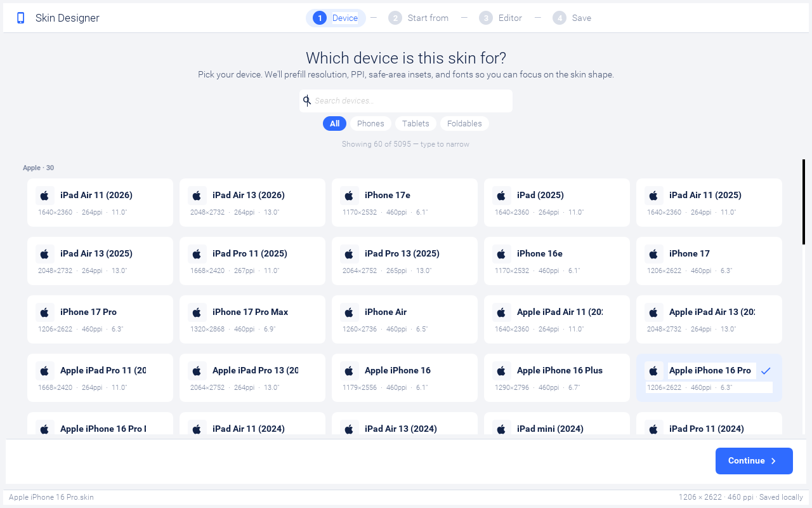
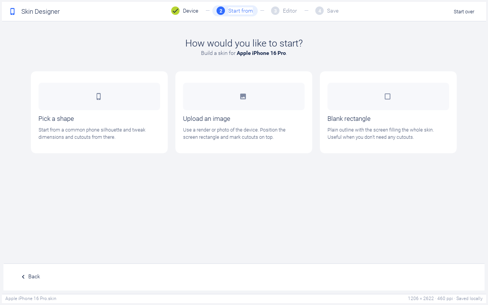
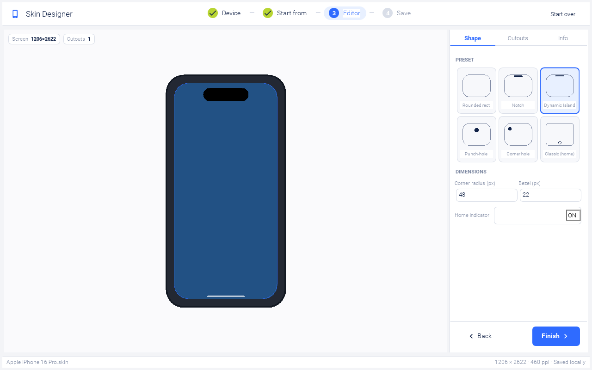
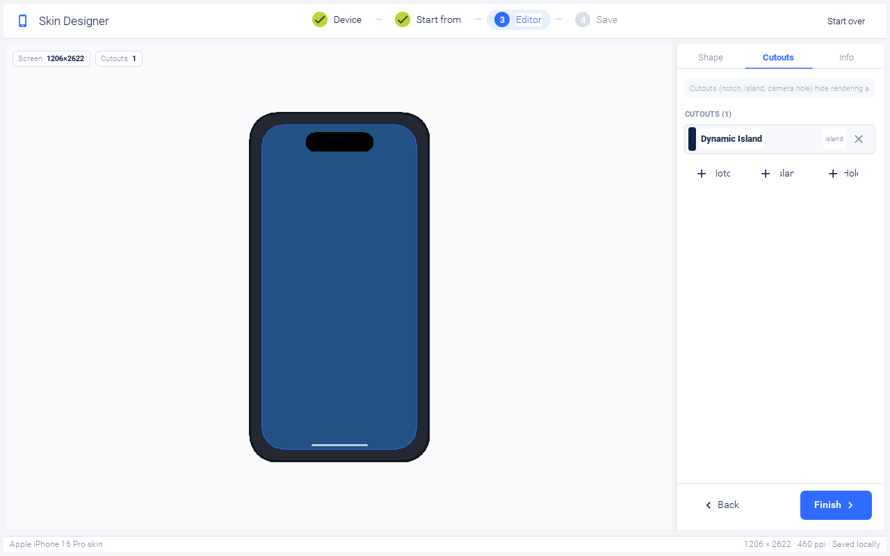
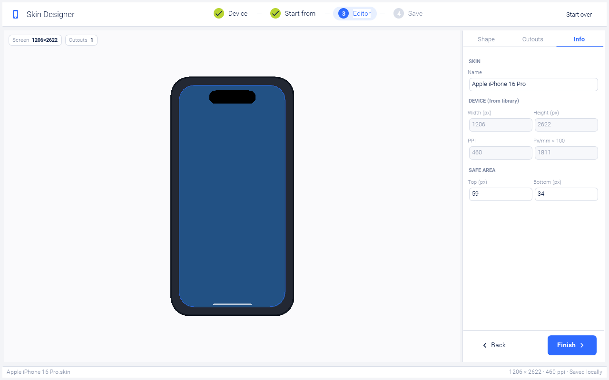
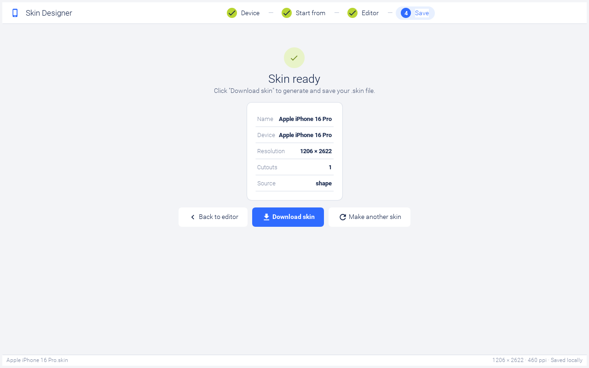

[[skin-designer]]
== Skin Designer

The Skin Designer turns a device specification (resolution, PPI,
fonts, safe-area insets, cutouts) into a `.skin` file that the
JavaSE simulator can load. It runs in your browser at
https://www.codenameone.com/skindesigner — there is nothing to
install.

This chapter walks through the wizard and explains what each step
contributes to the generated `.skin`. If you only want a skin and
don't care how it's built: pick a device, accept the defaults, click
*Finish*, then *Download skin*. The file is ready to load via *Add*
in the simulator's *Skins* menu.

NOTE: The wizard is intentionally opinionated. It ships with a
curated device catalog, generates the device frame procedurally, and
writes a skin layout that matches the `Themes/iPhoneTheme.res`,
`Themes/iOS7Theme.res`, and `Themes/android_holo_light.res` themes
shipped with Codename One. For a custom skin from a hand-painted
device render, jump straight to the
<<skin-designer-source-image, "Upload an image">> source.

=== Stage 1 — pick a device

The first step shows a card per device from the bundled catalog. Use
the search box to filter by name (it matches both the model and the
brand) and the chips below to narrow by form factor: *All / Phones
/ Tablets / Foldables*. Tapping a card selects the device and enables
the *Continue* button in the footer.

Picking a device pulls in its resolution, PPI, screen size, default
safe-area insets, and the iOS / Android system font names from the
device catalog, then seeds a sensible starting frame: notch, island,
or hole presets are applied automatically based on the device's
hardware.

TIP: The catalog is large. The grid is capped to the most recent
matches by default; type into the search field to find older or
less-common devices. The `Showing X of Y` hint between the chips and
the grid tells you when you're looking at a clamped subset.

=== Stage 2 — pick a starting source

There are three ways to seed the skin's body image:

[[skin-designer-source-shape]]
*Pick a shape* — generates the device frame procedurally from a small
preset library (rounded rect, notch, dynamic island, punch-hole,
corner hole, classic home-button). The frame is rendered as a dark
gradient with the screen rect (and any cutouts) carved into it. Best
when you want a generic-looking iPhone or Android frame and don't
care about exact hardware fidelity.

[[skin-designer-source-image]]
*Upload an image* — opens an image picker. The wizard scales the
image into the device's resolution, then carves the screen rect (and
cutouts) on top. Use this when you have a marketing render of the
specific device you're targeting.

*Blank rectangle* — collapses the bezel and corner radius to almost
nothing, drops every cutout, and turns the home indicator off. The
screen fills the entire skin. Useful for desktop / web simulators
where the device frame would just be visual noise.

Hover over a card on desktop to see the blue selection ring; click
to advance to the editor.

=== Stage 3 — the editor

The editor is split into two panes: a live preview on the left that
paints the device frame, screen tint, cutouts, and home indicator,
and a sidebar on the right with three tabs.

==== Shape tab

When you started from *Pick a shape*, the Shape tab shows a preset
grid (*Rounded rect / Notch / Dynamic Island / Punch-hole / Corner
hole / Classic home*) and dimension fields:

* *Corner radius* — the device's outer corner radius in viewbox
  pixels (the design uses a 320 × 620 viewbox; the actual skin image
  is scaled to the device's resolution).
* *Bezel* — frame thickness in viewbox pixels. The screen rect is
  positioned at `(bezel, bezel)` inside the skin image.
* *Home indicator* — toggles the lime pill drawn at the bottom edge.
  iPhones from X onward and most modern Androids should leave this
  on; classic devices with a hardware home button should turn it off.

When you started from *Upload an image*, the Shape tab swaps the
preset grid for a *Replace image* button so you can swap the body
image without restarting the wizard.

==== Cutouts tab

The Cutouts tab lists every cutout currently on the skin. Tap a row
to expand its width / height / offset fields; the X button on the
right removes it. The three add buttons at the bottom seed a sensible
default of each type:

* *Notch* (180 × 30 viewbox px) — physical hardware cutout. Notches
  are drawn in the device frame *above* the screen rect, with the
  bottom edge touching the screen top. Mirrors iPhone X / 11 / 12 /
  13 hardware.
* *Island* (120 × 35) — Dynamic Island. Software-reserved space
  rendered as an opaque pill *inside* the screen rect, floating on
  top of the iOS status bar.
* *Hole* (28 × 28) — Android punch-hole camera. Rendered like the
  island: opaque circle inside the screen rect.

Offsets are relative to the top-center of the screen, in viewbox
pixels. For islands and holes, `Offset Y` is the gap between the
cutout's top edge and the screen top. For notches, `Offset Y` is
ignored (the notch is anchored to the frame).

WARNING: When the wizard generates the `.skin` file, it
automatically extends `safePortraitTop` to cover any in-screen
cutouts (islands, holes), so app content lands below the floating
shape. You don't need to manually adjust safe area for the cutout
itself; only adjust it if you need extra padding above your title
bar.

==== Info tab

The Info tab is mostly read-only and shows what's about to be
written into `skin.properties`:

* *Name* — the only editable field. Determines the saved file name
  (sanitised: spaces become hyphens, special characters dropped,
  appended with `.skin`).
* *Width / Height* — display resolution from the device catalog.
* *PPI / Pixels per millimeter* — the simulator uses
  `pixelMilliRatio = ppi / 25.4` to derive font sizes when none are
  specified in the skin.
* *Safe area Top / Bottom* — the user-editable safe-area insets in
  viewbox pixels. The wizard converts these to display-relative
  pixels at save time.

=== Stage 4 — finish and download

Clicking *Finish* in the editor's footer:

. Renders the portrait skin image (`skin.png`) at the device's
  actual resolution + bezel, with rounded corners, transparent
  screen, opaque cutouts, and a home indicator if enabled.
. Synthesises the landscape skin (`skin_l.png`) by 90° rotation.
. Writes `skin_map.png` / `skin_map_l.png` overlays that mark the
  screen rectangle for the simulator's screen-position detection.
. Bundles the appropriate native theme (`iOS7Theme.res`,
  `android_holo_light.res`, or `winTheme.res`) inside the skin zip.
. Writes `skin.properties` with `roundScreen=true`,
  `displayX/Y/Width/Height`, `safePortrait*` / `safeLandscape*`,
  the platform name, override names, fonts, and PPI.

Clicking *Download skin* on the done page hands the file to the
browser's download dialog. The button is the only reliable trigger
because the browser's user-gesture window expires during the heavy
image-generation step that *Finish* runs.

After the file is on disk, drop it into your simulator's skins
folder (or use the *Add* command in the simulator's *Skins* menu)
and your new device should appear in the picker.

=== File layout of a generated skin

A generated `.skin` is just a renamed zip. Unzip it to see the
layout:

[source,text]
----
Apple-iPhone-16-Pro.skin/
  skin.png            # portrait body (device frame + transparent screen + cutouts)
  skin_l.png          # 90° rotated portrait
  skin_map.png        # black rect = screen, white = frame, used for hit-testing
  skin_map_l.png      # rotated map
  iOS7Theme.res       # bundled native theme (or android_holo_light.res / winTheme.res)
  skin.properties     # platform metadata, safe-area, PPI, display rect
----

The `skin.properties` file is a normal Java `.properties`. The most
important keys the wizard writes:

[source,properties]
----
touch=true
platformName=ios
tablet=false
ppi=460
pixelRatio=18.110236220472443

# roundScreen=true makes the simulator paint skin.png *over* the rendered
# UI rather than clipping the UI to non-frame pixels. That overlay step is
# what makes the Dynamic Island / punch-hole shapes appear "floating" on
# top of the iOS status bar instead of being carved out of the display.
roundScreen=true
displayX=89
displayY=89
displayWidth=1206
displayHeight=2622

# Safe area in display-relative coordinates (origin = screen top-left).
safePortraitX=0
safePortraitY=237
safePortraitWidth=1206
safePortraitHeight=2272
safeLandscapeX=237
safeLandscapeY=0
safeLandscapeWidth=2272
safeLandscapeHeight=1206

# These get composed by overrideNames(device) — they let users layer
# device-specific styling on top of the platform theme via
# UIManager.addThemeProps()-style theme inheritance.
overrideNames=phone,ios,iphone

systemFontFamily=SF Pro
proportionalFontFamily=SF Pro
monospaceFontFamily=SF Mono
----

NOTE: The wizard intentionally does *not* write `smallFontSize`,
`mediumFontSize`, or `largeFontSize`. When those are absent the
simulator auto-derives them from `pixelMilliRatio` (`med = round(2.6
* ppmm)`, `sm = 2 * ppmm`, `la = 3.3 * ppmm`), which is what you
want on high-PPI screens. Writing iOS-style point values (12 / 15 /
22) into the file used to make text render at sub-millimeter sizes
on a 460 PPI device.
