== The components of Codename One

This chapter covers the components of Codename One. It doesn't cover every component, but it goes deeper than the https://www.codenameone.com/javadoc/[Javadocs].

=== Container

The Codename One container is a base class for many high-level components. A container can hold other components.

Every component has a parent container. That parent can be `null` when the component isn't inside another container or when it's a top-level container. A container can have many children.

.Component-Container relationship expressed as UML
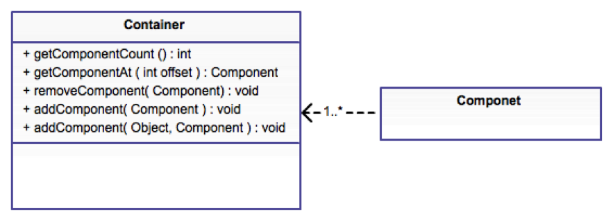

Components are arranged in containers with layout managers. A layout manager decides how to arrange components inside the container.

// HTML_ONLY_START
You can read more about layout managers in the https://www.codenameone.com/manual/basics.html#component-container-hierarchy[basics section].
// HTML_ONLY_END
////
//PDF_ONLY
You can read more about layout managers in the <<component-container-hierarchy,basics section>>.
////

==== Composite components

Codename One components share a generic inheritance hierarchy. For example, https://www.codenameone.com/javadoc/com/codename1/ui/Button.html[Button] derives from https://www.codenameone.com/javadoc/com/codename1/ui/Label.html[Label] and thus receives all its abilities.

Some components are composites and derive from the https://www.codenameone.com/javadoc/com/codename1/ui/Container.html[Container] class. For example, the https://www.codenameone.com/javadoc/com/codename1/components/MultiButton.html[MultiButton] is a composite button that derives from `Container` but behaves like a `Button`. Most of the time this feels seamless, but a few details matter.

- Don't use the `Container`-derived methods on such a composite component (for example, `add` and `remove`).

- You can't cast it to the type it relates to. For example, you can't cast `MultiButton` to `Button`.

- Events can be more nuanced. For example, if you rely on https://www.codenameone.com/javadoc/com/codename1/ui/events/ActionEvent.html#getSource--[ActionEvent.getSource()] or https://www.codenameone.com/javadoc/com/codename1/ui/events/ActionEvent.html#getComponent--[ActionEvent.getComponent()], they may not behave as expected. For a `MultiButton`, they return the underlying `Button`. To work around that, use https://www.codenameone.com/javadoc/com/codename1/ui/events/ActionEvent.html#getActualComponent--[ActionEvent.getActualComponent()].

[[lead-component-sidebar]]
.Lead Component
****
Codename One includes a feature for creating composite components called "lead components." It lets components like `MultiButton` act like a single component while still containing multiple components.

Lead components work by assigning one component as the "leader." That leader determines the style state for every component in the hierarchy. If a `Container` is led by a `Button`, the button determines whether the selected or pressed state applies to the entire hierarchy.

This means a single `Component` can contain multiple nested `UIID`s. For example, `MultiButton` has `UIID`s such as `MultiLine1`, which you can customize with APIs such as https://www.codenameone.com/javadoc/com/codename1/components/MultiButton.html#setUIIDLine1-java.lang.String-[setUIIDLine1].

The lead component also handles events from a single source. Clicking another component in the hierarchy sends the event to the leading `Button`, which can make action events route to a different target than the apparent click target. That's why `getActualComponent()` exists.

// HTML_ONLY_START
You can learn more about lead components in https://www.codenameone.com/manual/misc-features.html#lead-component-section[here].
// HTML_ONLY_END
////
//PDF_ONLY
You can learn more about lead components in <<lead-component-section,here>>.
////
****

=== Form

https://www.codenameone.com/javadoc/com/codename1/ui/Form.html[Form] is the top-level container in Codename One. `Form` derives from `Container` and is the element the app shows. Only one form can be visible at any given time. You can get the visible `Form` with the code:

[source,java]
----
include::../demos/common/src/main/snippets/developer-guide/the-components-of-codename-one.java[tag=the-components-of-codename-one-java-001,indent=0]
----

A form is a container with a title, a content area, and an optional menu or menu-bar area. When you call methods such as `add` or `remove` on a form, you're invoking something that maps to this:

[source,java]
----
include::../demos/common/src/main/snippets/developer-guide/the-components-of-codename-one.java[tag=the-components-of-codename-one-java-002,indent=0]
----

`Form` is effectively a https://www.codenameone.com/javadoc/com/codename1/ui/Container.html[Container] with a border layout. The north section holds the title area, the south section holds the optional menu bar, and the center stretches as the content pane. Place all components in the content pane.

[[form-layout-layers-graphic]]
.Form layout graphic
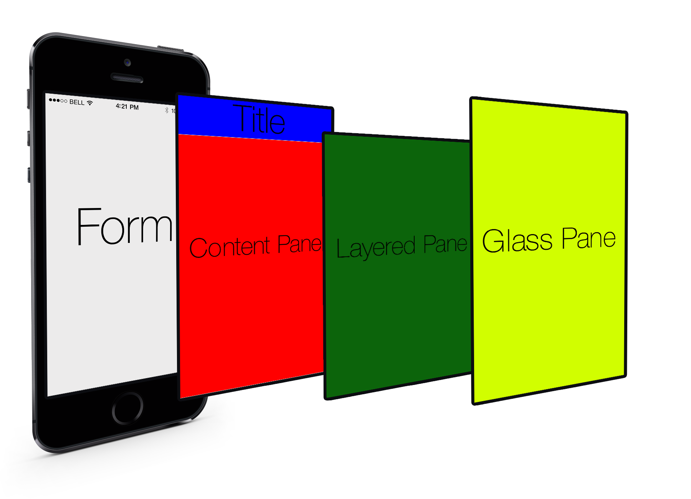

You can see that every `Form` has space allocated for the title area. If you don't set the title, it won't show up, but it will still be there. The same isn't always true for the menu bar, which can vary. Effectively, the section that matters is the content pane, so the form tries to do the right thing by pretending to be the content pane. For example, this isn't always seamless, and sometimes code needs to invoke `getContentPane()` to work directly with the container.

TIP: A good example for such a case is layout animations. Animating the form might not produce the right results. When in doubt, it's easier to use `getContentPane()` instead of working with the `Form` directly.

As you can see from <<form-layout-layers-graphic,the graphic>>, `Form` has two layers that live on top of the content pane/title. The first is the layered pane, which allows you to place "always on top" components. The layered pane is added implicitly when you invoke `getLayeredPane()`.

NOTE: You still need to place components using layout managers to get them to appear in the right place when using the layered pane.

[[safe-areas]]
==== Safe areas

Modern phones often include display cut-outs, rounded corners, or persistent gesture/navigation indicators that overlap the physical screen edges. These intrusions are no longer limited to iOS—many recent Android devices behave the same way—so Codename One provides a "safe area" API to ensure your UI remains visible regardless of the device. The safe area is the portion of the display that's guaranteed to be unobstructed.

.Tabs with safe-area padding enabled
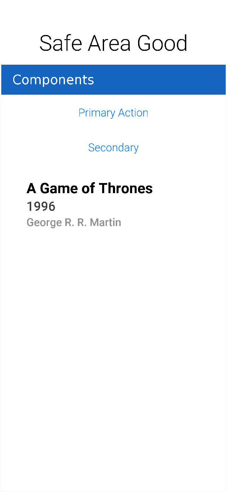

.Tabs without safe-area padding
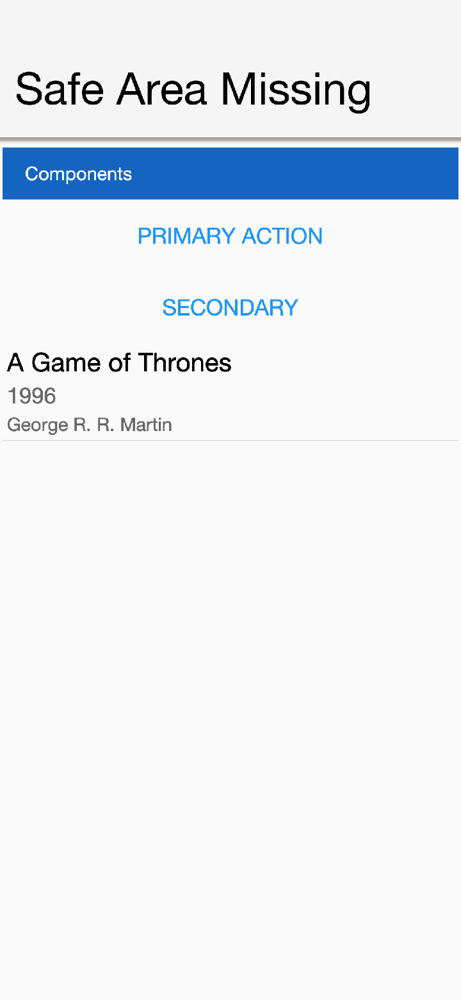

===== Automatic Safe-Area handling

`Form` calculates the safe region automatically, and core UI components that anchor themselves to the screen edges apply that information without more work:

* `Toolbar` and the status bar placeholder respect the top safe margins so that titles and action buttons remain legible around notches.
* `Tabs`, `Sheet`, and `FloatingActionButton` instances mark their internal containers as safe areas so navigation controls are padded above gesture/navigation bars.
* UI fragment templates can opt-in to safe areas declaratively using the `safeArea` flag, ensuring generated components stay within the padded region.

This means that many applications will work on devices such as the iPhone X/14 family or Android devices with edge-to-edge displays. You need to intervene when you use custom containers that you position flush against a screen edge or when you perform your own painting.

===== Marking your own containers as safe

If you create a container that should always stay clear of the unsafe portions of the screen (for example, a bottom navigation bar, an on-screen joystick, or a floating tool palette), enable safe-area padding explicitly:

[source,java]
----
include::../demos/common/src/main/snippets/developer-guide/the-components-of-codename-one.java[tag=the-components-of-codename-one-java-003,indent=0]
----

Safe-area padding is applied when the container **doesn't** have a scrollable parent. For scrollable content, you can assume the user can scroll the component into view instead.

Most layouts never need to know where the safe area begins, but if you draw manually (for example, inside `paint()` or on the glass pane) you can query it directly:

[source,java]
----
include::../demos/common/src/main/snippets/developer-guide/the-components-of-codename-one.java[tag=the-components-of-codename-one-java-004,indent=0]
----

The rectangle returned by `Form#getSafeArea()` is updated automatically whenever the OS reports a change (rotation, multitasking gestures, showing or hiding the system navigation area, etc.). In unusual situations where you adjust the safe-area root yourself (for example, when animating a container in from off-screen) you can force a recalculation by calling `Form#setSafeAreaChanged()`.

===== Safe-Area roots and advanced layouts

Safe-area padding is calculated relative to a "safe-area root." Forms are roots by default, but you can mark any container as a root using `Container#setSafeAreaRoot(true)` when you need precise control, for example, when preparing a side menu that starts off-screen and slides in:

[source,java]
----
include::../demos/common/src/main/snippets/developer-guide/the-components-of-codename-one.java[tag=the-components-of-codename-one-java-005,indent=0]
----

Marking the drawer as both a root and a safe area prevents a jump the moment it becomes visible, because the safe padding is already applied while it's off-screen.

Remember that safe areas apply across platforms. Always verify your screens on actual devices (or in the Codename One simulator with a device skin that exposes cut-outs) to make sure critical UI elements remain inside the padded region.

The second layer is the glass pane which allows you to draw arbitrary things on top of everything. The order in the image is indeed right:

1. `ContentPane` is lowest
2. `LayeredPane` is second
3. `GlassPane` is painted last

NOTE: It's important to notice that a layered pane is on top of the `ContentPane` and doesn't stretch to the title. A `GlassPane` stretches all the way but with a "lightweight" title area, for example, the https://www.codenameone.com/javadoc/com/codename1/ui/Toolbar.html[Toolbar API].

The `GlassPane` allows developers to overlay UI on top of existing UI and paint as they see fit. This is useful for things that provide notification but don't want to intrude with application functionality.

NOTE: In earlier versions of Codename One (pre-3.6), `LayeredPane` & `GlassPane` didn't work with "native" peer components such as media, browser, native maps etc, because peer components were always rendered "in front" of the Codename One UI canvas. For example, current versions now allow for proper layering of peer components and light-weight components so that LayeredPane and GlassPane can be used seamlessly with peer components.

=== Dialog

A https://www.codenameone.com/javadoc/com/codename1/ui/Dialog.html[Dialog] is a special kind of `Form` that can occupy a portion of the screen. It also has the more functionality of the modal `show` method.

When showing a dialog you have two basic options: modeless and modal:

- Modal dialogs (the default) block the current EDT thread until the dialog is dismissed. To understand how they do it, read about `invokeAndBlock`. +
Modal dialogs are a useful way to prompt the user since the code can assume the user responded in the next line of execution. This promotes a linear and intuitive way of writing code.

- Modeless dialogs return, so a call to show such a dialog can't assume anything in the next line of execution. This is useful for features such as progress indicators where you aren't waiting for user input.

For example: a modal dialog can be expressed as such:

[source,java]
----
include::../demos/common/src/main/snippets/developer-guide/the-components-of-codename-one.java[tag=the-components-of-codename-one-java-006,indent=0]
----

Notice that during the `show` call above the execution of the next line was "paused" until you got a response from the user and once the response was returned you could proceed directly.

IMPORTANT: All usage of `Dialog` must be within the Event Dispatch Thread (the default thread of Codename One). This is true for modal dialogs. The `Dialog` class knows how to "block the EDT" without blocking it.

// HTML_ONLY_START
To learn more about `invokeAndBlock` which is the workhorse behind the modal dialog functionality check out https://www.codenameone.com/manual/edt.html[the EDT section].
// HTML_ONLY_END
////
//PDF_ONLY
To learn more about `invokeAndBlock` which is the workhorse behind the modal dialog functionality check out <<edt-section,the EDT section>>.
////

The `Dialog` class contains many static helper methods to show user notifications, but also allows a
developer to create a `Dialog` instance, add information to its content pane and show the dialog.

TIP: Dialogs contain a `ContentPane` like `Form`.

When showing a dialog in this way, you can either ask Codename One to position the dialog in a specific location based on the https://www.codenameone.com/javadoc/com/codename1/ui/layouts/BorderLayout.html[BorderLayout] concept of locations, or position it by spacing it in pixels from the four edges of the screen.

For example: you could do something like this to show a simple modal `Dialog`:

[source,java]
----
include::../demos/common/src/main/snippets/developer-guide/the-components-of-codename-one.java[tag=the-components-of-codename-one-java-007,indent=0]
----

.Custom modal Dialog in the south position
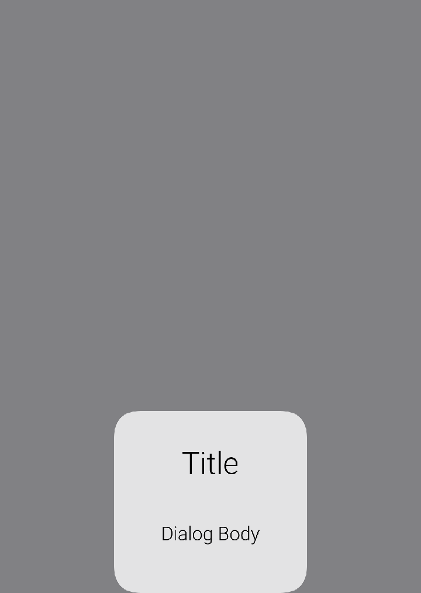

TIP: You can turn the code above to a modless `Dialog` by flipping the boolean `true` argument to `false`.

You can position a `Dialog` by determining the space from the edges for example: with this code you can occupy the bottom portion of the screen:

[source,java]
----
include::../demos/common/src/main/snippets/developer-guide/the-components-of-codename-one.java[tag=the-components-of-codename-one-java-008,indent=0]
----

.Custom Dialog positioned absolutely
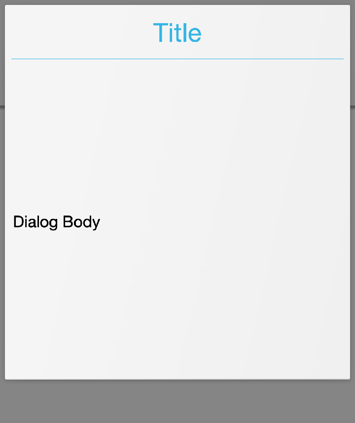

NOTE: `hi` is the name of the parent `Form` in the sample above.

==== Styling dialogs

It's important to style a `Dialog` using https://www.codenameone.com/javadoc/com/codename1/ui/Dialog.html#getDialogStyle--[getDialogStyle()] or
https://www.codenameone.com/javadoc/com/codename1/ui/Dialog.html#setDialogUIID-java.lang.String-[setDialogUIID] methods rather than styling the dialog object directly.

The reason for this is that the `Dialog` is a `Form` that takes up the whole screen. The `Form` that's visible behind the `Dialog` is rendered as a screenshot. Customizing the actual `UIID` of the `Dialog` won't produce the desired results.

==== Tint and blurring

By default a `Dialog` uses a platform specific tint color when it's showing for example: notice the background in the image below is tinted:

[source,java]
----
include::../demos/common/src/main/snippets/developer-guide/the-components-of-codename-one.java[tag=the-components-of-codename-one-java-009,indent=0]
----

.Dialog with tinted background
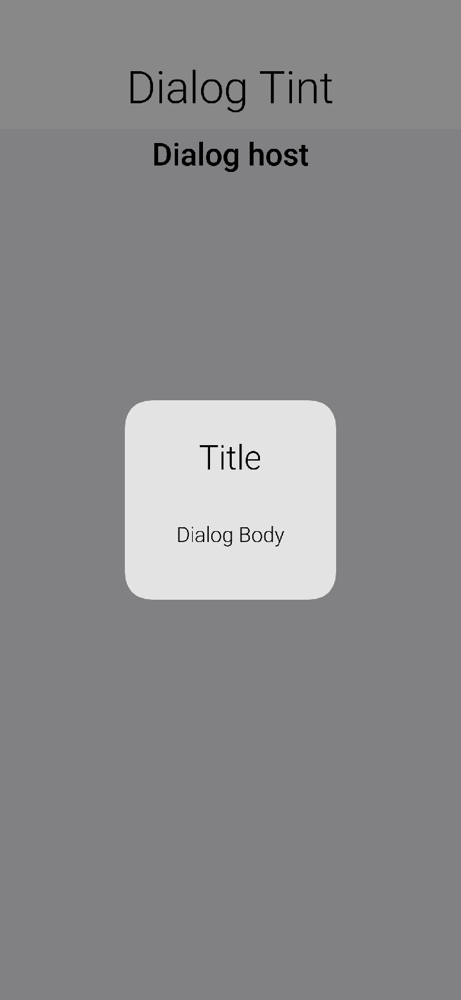

The tint color can be manipulated on the parent form, you can set it to any AARRGGBB value to set any color using the `setTintColor` method. Notice that this is invoked on the parent form and not on the `Dialog`!

IMPORTANT: This is an AARRGGBB value and not an RRGGBB value! This means that 0 will be transparent.

You can also manipulate this default value globally using the theme constant `tintColor`. The sample below tints the background in green:

[source,java]
----
include::../demos/common/src/main/snippets/developer-guide/the-components-of-codename-one.java[tag=the-components-of-codename-one-java-010,indent=0]
----

.Dialog with green tinted background
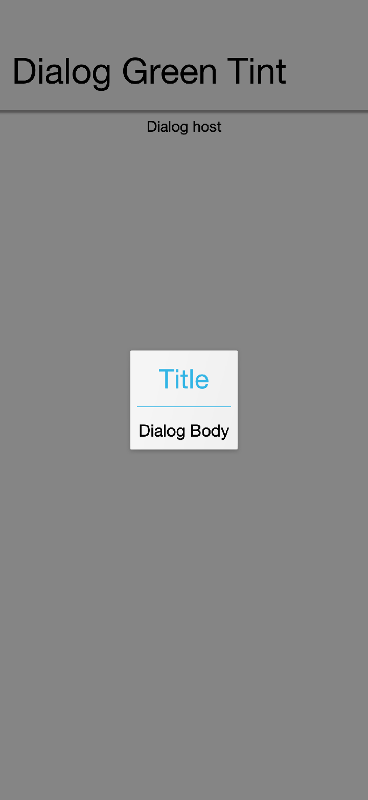

You can apply Gaussian blur to the background of a dialog to highlight the foreground further and produce an attractive effect. You can use the `setDefaultBlurBackgroundRadius` to apply this globally, you can use the theme constant `dialogBlurRadiusInt` to do the same or you can do this on a per `Dialog` basis using `setBlurBackgroundRadius`.

NOTE: Not all device types support blur you can test if your device supports it using `Display.getInstnace().isGaussianBlurSupported()`. If blur isn't supported the blur setting will be ignored:

[source,java]
----
include::../demos/common/src/main/snippets/developer-guide/the-components-of-codename-one.java[tag=the-components-of-codename-one-java-011,indent=0]
----

.The blur effect coupled with the OS default tint
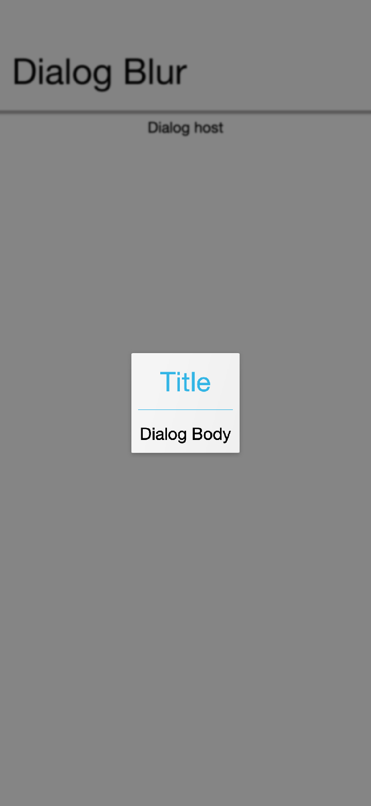

It might be a bit hard to notice the blur effect with the tinting so here is the same code with tinting disabled:

[source,java]
----
include::../demos/common/src/main/snippets/developer-guide/the-components-of-codename-one.java[tag=the-components-of-codename-one-java-012,indent=0]
----

.The blur effect is more pronounced when the tint is disabled
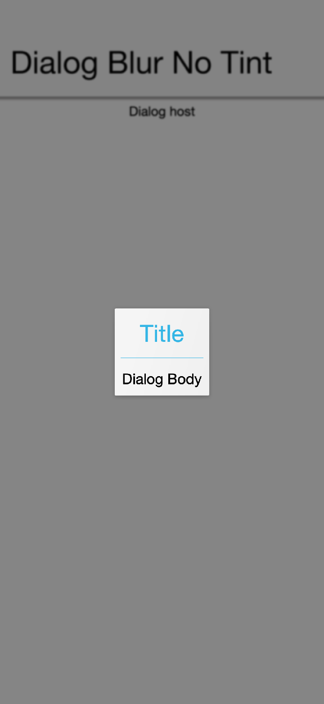

==== Popup dialog

A popup dialog is a common mobile paradigm showing a `Dialog` that points at a specific component. It's a standard `Dialog` that's shown in a unique way:

[source,java]
----
include::../demos/common/src/main/snippets/developer-guide/the-components-of-codename-one.java[tag=the-components-of-codename-one-java-013,indent=0]
----

.Popup Dialog
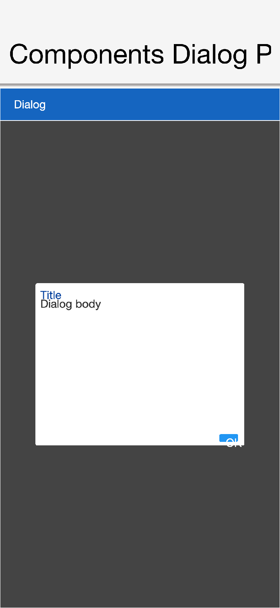

The popup dialog accepts a https://www.codenameone.com/javadoc/com/codename1/ui/Component.html[Component] or https://www.codenameone.com/javadoc/com/codename1/ui/geom/Rectangle.html[Rectangle] to point at and handles the rest.

===== Styling the arrow of the popup dialog

When Codename One was young you needed a popup arrow implementation but your low-level graphics API was pretty basic. As a workaround you created a version of the 9-piece image border that supported pointing arrows at a component.

Today Codename One supports pointing an arrow from the `RoundRectBorder` class. This is implicit for the `PopupDialog` UI. This allows for better customization of the border (color etc.) and it looks better on newer displays. It also works on all OSs. Right now the iOS theme has the old image border approach.

NOTE: This will change with a future update where all OSes will align and iOS will use the lightweight popup too

TIP: You can make all OSes act the same way by overriding the `PopupDialog` UIID and defining its style to `RoundRectBorder`

The new `RoundRectBorder` support works by setting the track component property on border. When that’s done the border implicitly points to the right location.

If you still need deeper customization of the arrow you can still use the old 9-piece border functionality illustrated below.

====== Legacy 9-Piece Border arrow

One of the harder aspects of a popup dialog is the construction of the theme elements required for arrow styling. To get that sort of behavior you will need a custom image border and 4 arrows pointing in each direction that will be overlaid with the border.

NOTE: The sizes of the arrow images should be similarly proportioned and fit within the image borders whitespace.
The block image of the dialog should have empty pixels in the sides to reserve space for the arrow. For example: if the arrows are all 32×32 pixels then the `PopupDialog` image should have 32 pixels of transparent pixels around it.

You will need to define the following theme constants for the arrow to work:

[source,java]
----
include::../demos/common/src/main/snippets/developer-guide/the-components-of-codename-one.java[tag=the-components-of-codename-one-java-014,indent=0]
----

Then style the `PopupDialog` UIID with the image for the `Dialog` itself.

=== InteractionDialog

Dialogs in Codename One can be modal or modeless, the former blocks the calling thread and the latter doesn't.
For example, there is another definition to those terms: A modal dialog blocks access to the rest of the UI while a
modeless dialog "floats" on top of the UI.

In that sense, all dialogs in Codename One are modal; they block the parent form since they're effectively forms
that show the "parent" in their background. https://www.codenameone.com/javadoc/com/codename1/components/InteractionDialog.html[InteractionDialog] has an API that's like the https://www.codenameone.com/javadoc/com/codename1/ui/Dialog.html[Dialog] API
but, unlike dialog, it never blocks anything. Neither the calling thread nor the UI.

NOTE: `InteractionDialog` isn't a `Dialog` since it doesn't share the same inheritance hierarchy. For example, it acts and "feels" like a `Dialog` although it's a `Container` in the `LayeredPane`.

`InteractionDialog` is a container that's positioned within the layered pane. Notice that because of that
design, you can have one such dialog at the moment and, if you add something else to the layered pane, you
might run into trouble.

Using the interaction dialog is pretty trivial and like dialog:

[source,java]
----
include::../demos/common/src/main/snippets/developer-guide/the-components-of-codename-one.java[tag=the-components-of-codename-one-java-015,indent=0]
----

.Interaction Dialog
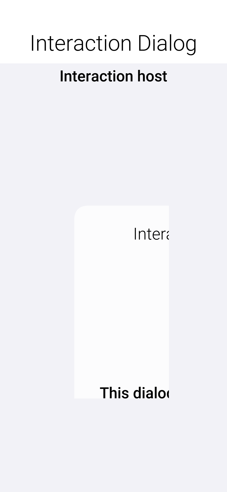

This will show the dialog on the right-hand side of the screen, which is pretty useful for a floating in place dialog.

NOTE: The `InteractionDialog` can be shown at absolute or popup locations. This is inherent to its use case which is "non-blocking." When using this component you need to be aware of its location.

To make popup behavior feel natural on touch devices you can call `setDisposeWhenPointerOutOfBounds(true)` so the dialog automatically dismisses as soon as the user taps outside the title or content area. Internally the dialog listens for pointer pressed/released events and will call `dispose()` for you when the interaction happens beyond its bounds, so you no longer need to wire that logic manually.

By default the dialog is placed on the form's layered pane, but you can switch between the global layered pane and form-specific layered pane using `setFormMode(boolean)`. Setting form mode to `true` keeps the dialog coupled with the showing form even when the global layered pane is used elsewhere in your app.

Finally, recent updates added animation toggles so you can fine-tune presentation. `setAnimateShow(boolean)` turns the show/dispose animations on or off, while `setRepositionAnimation(boolean)` enables a "grow/shrink" reposition effect during those animations when you want a more dynamic transition.

[[label-section]]
=== Label

https://www.codenameone.com/javadoc/com/codename1/ui/Label.html[Label] represents a text, icon, or both. `Label` is also the base class of `Button` which in turn is the base class for `RadioButton` & `CheckBox`. Thus the functionality of the `Label` class extends to all these components.

`Label` text can be positioned in one of 4 locations as such:

[source,java]
----
include::../demos/common/src/main/snippets/developer-guide/the-components-of-codename-one.java[tag=the-components-of-codename-one-java-016,indent=0]
----

.Label positions
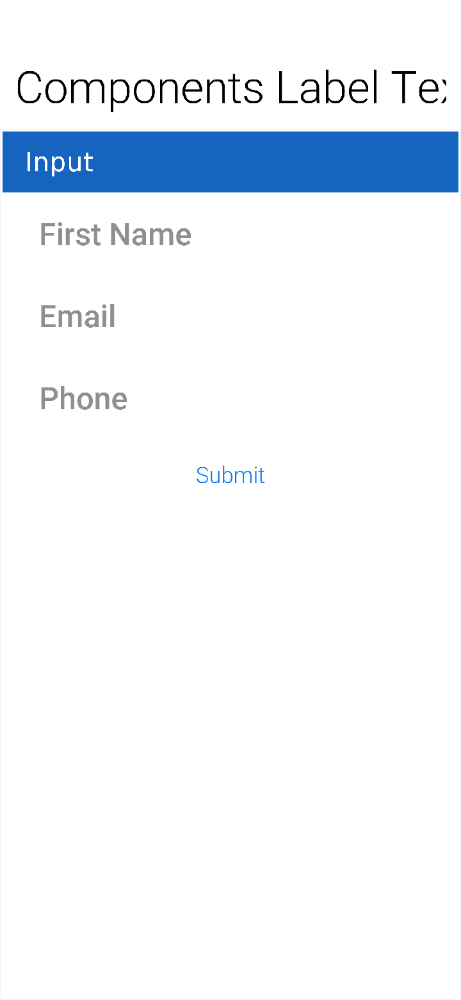

`Label` allows a single line of text, line breaking is an expensive operation on mobile devices footnote:[String width is the real expensive part here, the complexity of font kerning and the recursion required to reflow text is a big performance hurdle] and so the `Label` class doesn't support it.

TIP: <<SpanLabel,SpanLabel>> supports many lines with a single label, notice that it does carry a performance penalty for this functionality.

Labels support tickering and the ability to end with "..." if there isn't enough space to render the label. Developers can determine the placement of the label to its icon in a few powerful ways.

==== Label gap

The gap between the label text & the icon defaults to 2 pixels due to legacy settings. The `setGap` method of `Label` accepts a gap size in pixels.

Two pixels is low for most cases & it's hard to customize for each `Label`.

You can use the theme constant `labelGap` which is a floating point value you can specify in millimeters that will allow you to determine the default gap for a label. You can also customize this manually using the method `Label.setDefaultGap(int)` which determines the default gap in pixels.

==== Autosizing labels

One of the common requests you received over the years is a way to let text "fit" into the allocated space so the font will match almost the width available. In some designs this is important but it's also tricky. Measuring the width of a String is an expensive operation on some OSes., there is no other way other than trial & error to find the "best size."

Still although something is "slow" you might still want to use it for some cases, this isn't something you should use in a renderer, infinite scroll etc. and recommend minimizing the usage of this feature as much as possible.

This feature is applicable to `Label` and its subclasses (for example: `Button`), with components such as `TextArea` (for example: `SpanButton`) the choice between shrinking and line break would require some complex logic.

To activate this feature use `setAutoSizeMode(true)` for example:

[source,java]
----
include::../demos/common/src/main/snippets/developer-guide/the-components-of-codename-one.java[tag=the-components-of-codename-one-java-017,indent=0]
----

.Automatically sizes the fonts of the buttons/labels based on text and available space
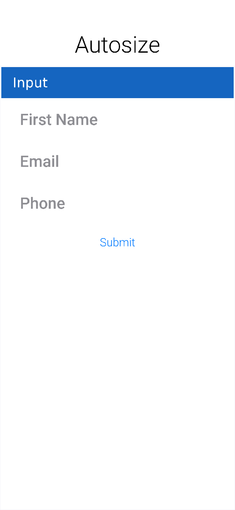

=== TextField and TextArea

The https://www.codenameone.com/javadoc/com/codename1/ui/TextField.html[TextField] class derives from the https://www.codenameone.com/javadoc/com/codename1/ui/TextArea.html[TextArea] class, and both are used for text input in
Codename One.

`TextArea` defaults to multi-line input and `TextField` defaults to single line input but both can be used in both cases. The main differences between `TextField` and `TextArea` are:

- Blinking cursor is rendered on `TextField`
- https://www.codenameone.com/javadoc/com/codename1/ui/events/DataChangedListener.html[DataChangeListener] is available in `TextField`. This is crucial for character by character input event tracking
- https://www.codenameone.com/javadoc/com/codename1/ui/TextField.html#setDoneListener-com.codename1.ui.events.ActionListener-[Done listener] is available in the `TextField`
- Different `UIID`

NOTE: The semantic difference between `TextField` & `TextArea` dates back to the ancestor of Codename One: LWUIT. Feature phones don’t have "proper" in-place editing capabilities & thus `TextField` was introduced to allow such input.

Because it lacks the blinking cursor capability `TextArea` is often used as a multi-line label and is used internally in `SpanLabel`, `SpanButton` etc.

TIP: A common use case is to have an important text component in edit mode as you enter a `Form`. Codename One forms support this exact use case through the https://www.codenameone.com/javadoc/com/codename1/ui/Form.html#setEditOnShow-com.codename1.ui.TextArea-[Form.setEditOnShow(TextArea)] method.

`TextField` & `TextArea` support constraints for various types of input such as `NUMERIC`, `EMAIL`, `URL`, etc. Those usually
affect the virtual keyboard used, but might not limit input in some platforms. For example: on iOS even with `NUMERIC`
constraint you would still be able to input characters.

TIP: If you need to prevent specific types of input check out the <<validation-section,validation section>>.

The following sample shows off simple text field usage:

[[text-component-sample-code]]
[source,java]
----
include::../demos/common/src/main/snippets/developer-guide/the-components-of-codename-one.java[tag=the-components-of-codename-one-java-018,indent=0]
----

.Simple text component sample
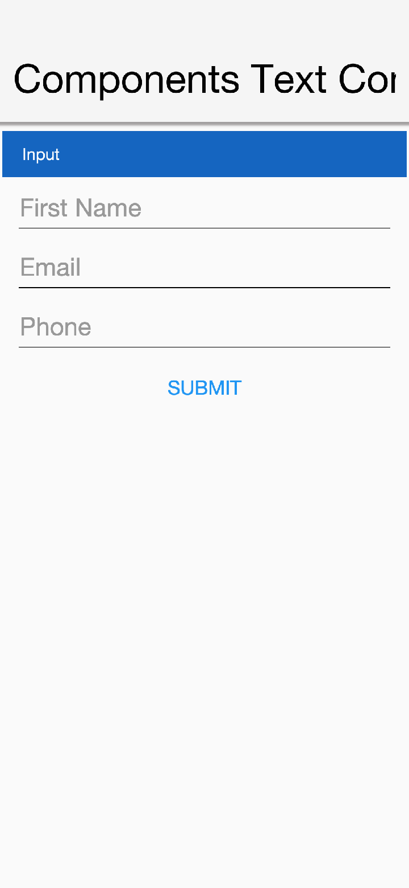

TIP: The <<Advanced-search-code,Toolbar section>> contains an elaborate `TextField` search sample with `DataChangeListener` and rather unique styling.

==== Masking

A common use case when working with text components is the ability to "mask" input for example: in the credit card number above you would want 4 digits for each text field and don't want the user to tap #Next# 3 times.

Masking allows you to accept partial input in one field and implicitly move to the next, this can be used to all types of complex input thanks to the text component API. E.g with the code above you can mask the credit card input so the cursor jumps to the next field implicitly using this code:

[source,java]
----
include::../demos/common/src/main/snippets/developer-guide/the-components-of-codename-one.java[tag=the-components-of-codename-one-java-019,indent=0]
----

Then implement the method `automoveToNext` as:

[source,java]
----
include::../demos/common/src/main/snippets/developer-guide/the-components-of-codename-one.java[tag=the-components-of-codename-one-java-020,indent=0]
----

Notice you can invoke `stopEditing(Runnable)` where you receive a callback as editing is stopped.

==== The virtual keyboard

A common misconception for developers is assuming the virtual keyboard represents "keys." For example: developers often override the "keyEvent" callbacks which are invoked for physical keyboard typing and expect those to occur with a virtual keyboard.

This isn't the case since a virtual keyboard is a different beast. With a virtual keyboard characters typed might produce a different output due to autocorrect. Some keyboards don't even have "keys" in the traditional sense or don't type them in the traditional sense (for example: swiping).

TIP: The constraint property for the `TextField`/`TextArea` is crucial for a virtual keyboard.

TIP: When working with a virtual keyboard it's important that the parent `Container` for the `TextField`/`TextArea` is scrollable. Otherwise the component won't be reachable or the UI might be distorted when the keyboard appears.

===== Action Button client property

By default, the virtual keyboard on Android has a "Done" button, you can customize it to be a search icon, a send icon,
or a go icon using a hint such as this:

[source,java]
----
include::../demos/common/src/main/snippets/developer-guide/the-components-of-codename-one.java[tag=the-components-of-codename-one-java-021,indent=0]
----

This will adapt the icon for the action on the keys.

===== Next and done on iOS

You try to hide a lot of the platform differences in Codename One, input is **** different between OSes. A common reliance is the ability to send the "Done" event when the user presses the #Done# button. This button doesn't always exist for example: if there is an #Enter# button (due to multiline input) or if there is a #Next# button in that place.

To unify the behavior you slightly customized the iOS keyboard as such:

.Next virtual keyboard with toolbar
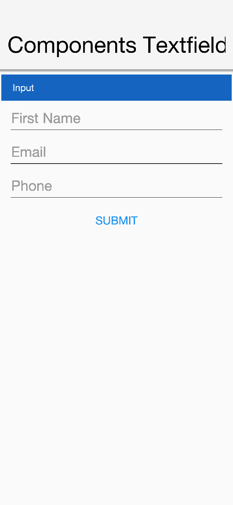

.Done virtual keyboard without toolbar
image::img/components-textfield-vkb-done.png[Done virtual keyboard without toolbar,scaledwidth=20%]

NOTE: This works with 3rd party keyboards too...

For example, this behavior might not be desired so to block that you can do:

[source,java]
----
include::../demos/common/src/main/snippets/developer-guide/the-components-of-codename-one.java[tag=the-components-of-codename-one-java-022,indent=0]
----

This will hide the toolbar for that given field.

NOTE: You can customize the color of the #Done# button in the toolbar by setting the `ios.doneButtonColor` display property. For example: To change the color to red, you could do `Display.getInstance().setProperty("ios.doneButtonColor", String.valueOf(0xff0000))`. `@since 5.0`

==== Clearable text field

iOS has a convention where an X can be placed after the text field to clear it. Some Android apps have it but there is no native support for that as of this writing.

You can wrap a `TextField` with a clearable wrapper to get this effect on all platforms. For example: replace this:

[source,java]
----
include::../demos/common/src/main/snippets/developer-guide/the-components-of-codename-one.java[tag=the-components-of-codename-one-java-023,indent=0]
----

With this:

[source,java]
----
include::../demos/common/src/main/snippets/developer-guide/the-components-of-codename-one.java[tag=the-components-of-codename-one-java-024,indent=0]
----

You can also specify the size of the clear icon if you wish. This is technically a `Container` with the text field style and a button to clear the text at the edge.

=== TextComponent

When building input forms you sometimes want to adapt to the native OS behavior and create a UI that's a bit more distinct to the native OS. `TextField` and `TextArea` are low-level, you can create an Android style UI with such components but it might look out of place in iOS.

For example: this is how most of you would expect the UI to look on iOS and Android respectively:

.Text Input on iOS
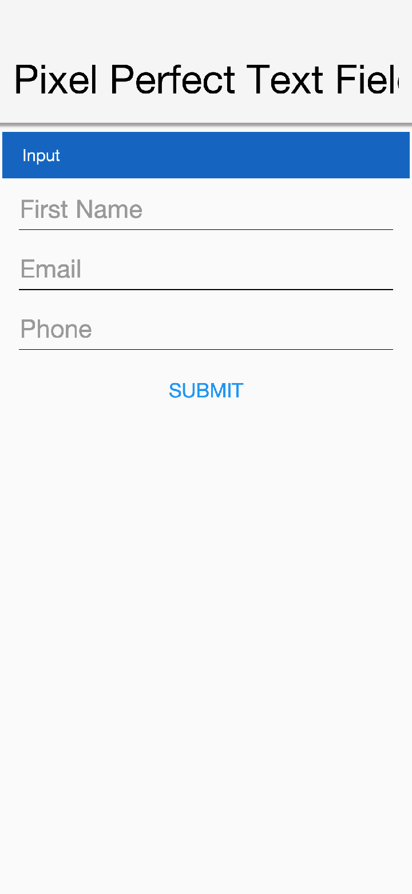

.Text Input on Android
image::img/pixel-perfect-text-field-android-codenameone-font.png[TextModeLayout on Android with the same code,scaledwidth=30%]

Doing this with text fields is possible but would require code that looks a bit different and jumps through hoops. `TextComponent` allows this exact UI without forcing developers to write OS specific code:

[source,java]
----
include::../demos/common/src/main/snippets/developer-guide/the-components-of-codename-one.java[tag=the-components-of-codename-one-java-025,indent=0]
----

TIP: This code uses the `TextModeLayout` which is discussed in the layouts section

The text component uses a builder approach to set various values for example:

[source,java]
----
include::../demos/common/src/main/snippets/developer-guide/the-components-of-codename-one.java[tag=the-components-of-codename-one-java-026,indent=0]
----

The code is pretty self-explanatory and more convenient than typical setters/getters. It automatically handles the floating hint style of animation when running on Android.

==== Error handling

The validator class supports text component and it should "work." But the cool thing is that it uses the material design convention for error handling!

If you add to the sample above a `Validator`:

[source,java]
----
include::../demos/common/src/main/snippets/developer-guide/the-components-of-codename-one.java[tag=the-components-of-codename-one-java-027,indent=0]
----

You would see something that looks like this on Android:

.Error handling when the text is blank
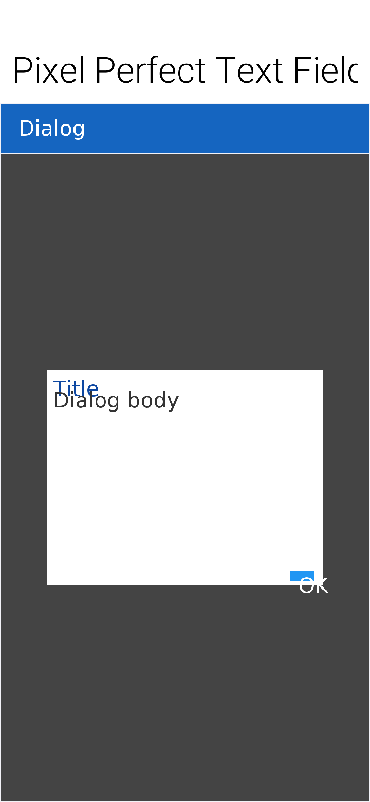

.Error handling when there is some input (notice red title label)
image::img/pixel-perfect-text-field-error-handling-text.png[Error handling when there is some input (notice red title label),scaledwidth=30%]

.On iOS the situation hasn't changed much yet
image::img/pixel-perfect-text-field-error-handling-on-ios.png[On iOS the situation hasn't changed much yet,scaledwidth=30%]

The underlying system is the `errorMessage` method which you can chain like the other methods on `TextComponent` as such:

[source,java]
----
include::../demos/common/src/main/snippets/developer-guide/the-components-of-codename-one.java[tag=the-components-of-codename-one-java-028,indent=0]
----

==== InputComponent and PickerComponent

To keep the code common and generic you use the `InputComponent` abstract base class and derive the other classes from that. `PickerComponent` is the other option.

A picker can work with your existing sample using code like this:

[source,java]
----
include::../demos/common/src/main/snippets/developer-guide/the-components-of-codename-one.java[tag=the-components-of-codename-one-java-029,indent=0]
----

This produces the following which looks pretty standard:

.Picker component taking place in iOS
image::img/pixel-perfect-text-field-picker-ios.png[Picker component taking place in iOS,scaledwidth=30%]

.And in Android
image::img/pixel-perfect-text-field-picker-android.png[And in Android,scaledwidth=30%]

The one tiny thing you should notice with the `PickerComponent` is that you don't construct the picker component using `new PickerComponent()`. Instead you use create methods such as `PickerComponent.createDate(new Date())`. The reason for that's that you have many types of pickers and it wouldn't make sense to have one constructor.

==== Underlying theme constants and UIID's

These varying looks are implemented through a combination of layouts, theme constants and UIID's. The most important UIID's are: `TextComponent`, `FloatingHint` & `TextHint`.

There are many related theme constants that can manipulate some pieces of this functionality:

- `textComponentErrorColor` a hex RGB color which defaults to null in which case this has no effect. When defined this will change the color of the border and label to the given color to match the material design styling. This implements the red border underline in cases of error and the label text color change
- `textComponentErrorLineBorderBool` toggles the material-style underline that appears on validation errors. Set it to `false` if you prefer to supply a different border when errors are shown

- `textComponentOnTopBool` toggles the on top mode which makes things look like they do on Android. This defaults to true on Android and false on other OSes. This can also be manipulated through the `onTopMode(boolean)` method in `InputComponent`, but the layout will use the theme constant

- `textComponentAnimBool` toggles the animation mode which again can be manipulated by a method in `InputComponent`. If you want to keep the UI static without the floating hint effect set this to false. Notice this defaults to true on Android

 - `textComponentFieldUIID` sets the UIID of the text field to something other than `TextField` this is useful for platforms such as iOS where the look of the text field is different within the text component. This allows you to make the background of the text field transparent when it's within the `TextComponent` and make it different from the regular text field
 - `inputComponentErrorMultilineBool` makes error labels multi-line by default so longer validation messages can wrap instead of being clipped

[[button-section]]
=== Button

https://www.codenameone.com/javadoc/com/codename1/ui/Button.html[Button] is a subclass of `Label` and as a result it inherits all its functionality, specifically icon placement, tickering, etc.

Button adds to the mix some more states such as a pressed `UIID` state and pressed icon.

NOTE: `Button` supports more icon states such as rollover and disabled icon.

`Button` also exposes some functionality for subclasses specifically the `setToggle` method call which has no meaning when invoked on a `Button` but has a lot of implications for `CheckBox` & `RadioButton`.

`Button` event handling can be performed through an https://www.codenameone.com/javadoc/com/codename1/ui/events/ActionListener.html[ActionListener] or through a https://www.codenameone.com/javadoc/com/codename1/ui/Command.html[Command].

IMPORTANT: Changes in a `Command` won't be reflected into the `Button` after the command was set to the `Button`.

Here is a trivial hello world style `Button`:

[source,java]
----
include::../demos/common/src/main/snippets/developer-guide/the-components-of-codename-one.java[tag=the-components-of-codename-one-java-030,indent=0]
----

.Simple button in the iOS styling, notice iOS doesn't have borders on buttons...
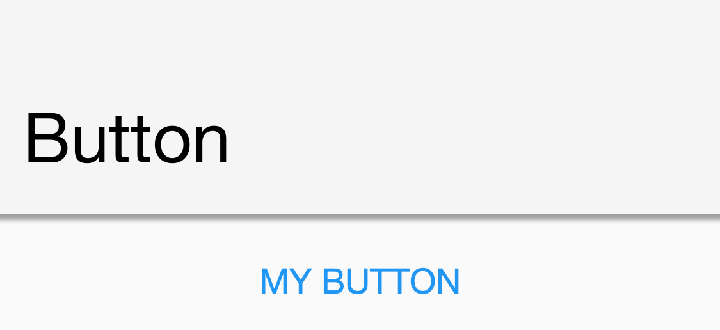

Such a button can be styled to look like a link using code like this or by making these settings in the theme and using code such as `btn.setUIID("Hyperlink")`:

[source,java]
----
include::../demos/common/src/main/snippets/developer-guide/the-components-of-codename-one.java[tag=the-components-of-codename-one-java-031,indent=0]
----

.Button styled to look like a link
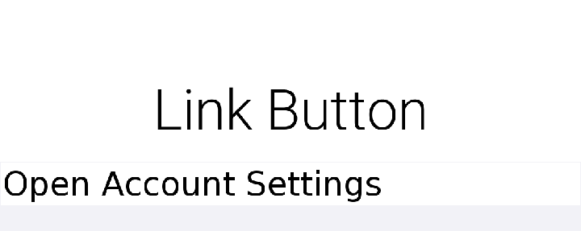

==== Uppercase buttons

Buttons on Android's material design UI use upper case styling which isn't the case for iOS. To solve this you have the method `setCapsText(boolean)` in `Button` which has the corresponding `isCapsText`, `isCapsTextDefault` & `setCapsTextDefault(boolean)`. This is pretty core to Codename One so to prevent this from impacting everything unless you explicitly invoke `setCapsText(boolean)` the default value of `true` will apply when the UIID is `Button`, `RaisedButton` or for the built-in `Dialog` buttons.

You also have a theme constant: `capsButtonTextBool`. This constant controls caps text behavior from the theme and is set to true in the Android native theme.

==== Raised Button

Raised button is a style of button that's available on Android and used to highlight an important action within a form. To confirm with the material design UI guidelines you might want to leverage a raised button UI element on Android but use a regular button everywhere else.

First you need to know whether a raised button exists in the theme. On Android this will return true but on other OSes it will return false. A potential future update might make another platform true based on UI guidelines in other OSes.

For this purpose you have got the theme constant `hasRaisedButtonBool` which will return true on Android but will be false elsewhere. You can use it like this:

[source,java]
----
include::../demos/common/src/main/snippets/developer-guide/the-components-of-codename-one.java[tag=the-components-of-codename-one-java-032,indent=0]
----

To enable this you have the `RaisedButton` UIID that derives from `Button` and will act like it except for the places where `hasRaisedButtonBool` is true in which case it will look like this:

.Raised and flat button in simulator
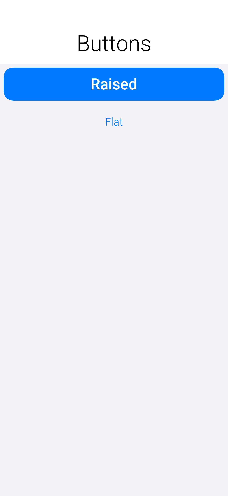

Notice that you can customize the colors of these buttons now since the border respects user colors...

In this case set the background color to purple and the foreground to white:

.Purple raised button
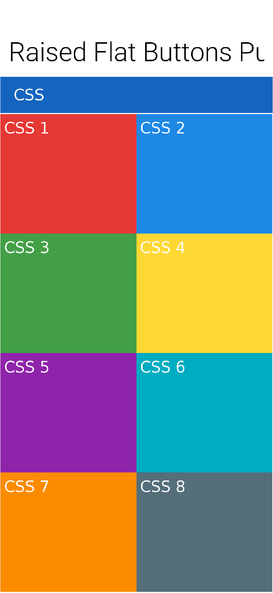

[source,java]
----
include::../demos/common/src/main/snippets/developer-guide/the-components-of-codename-one.java[tag=the-components-of-codename-one-java-033,indent=0]
----

==== Ripple effect

The ripple effect in material design highlights the location of the finger and grows as a circle to occupy the full area of the component as the user presses the button.

You can perform a ripple effect by darkening the touched area and growing that in a quick animation.

Ripple effect can be applied to any component but you have it turned on for buttons on Android which also applies to things like title commands, side menu elements etc. This might not apply at this moment to lead components like multi-buttons but that might change in the future.

`Component` has a property to enable the ripple effect `setRippleEffect(boolean)` and the corresponding `isRippleEffect()`. You can turn it on or off individually in the component level. For example, `Button` has static `setButtonRippleEffectDefault(boolean)` and `isButtonRippleEffectDefault()`. These allow you to define the default behavior for all the buttons and that can be configured through the theme constant `buttonRippleBool` which is on by default on the native Android theme.

=== CheckBox/RadioButton

https://www.codenameone.com/javadoc/com/codename1/ui/CheckBox.html[CheckBox] & https://www.codenameone.com/javadoc/com/codename1/ui/RadioButton.html[RadioButton] are subclasses of button that allow for either a toggle state or exclusive selection state.

Both `CheckBox` & `RadioButton` have a selected state that allows you to determine their selection.

TIP: `RadioButton` doesn't allow you to "deselect" it, the way to "deselect" a `RadioButton` is by selecting another `RadioButton`.

The `CheckBox` can be added to a `Container` like any other `Component` but the `RadioButton` must be associated with a `ButtonGroup` otherwise if you have more than one set of `RadioButton's` in the form you might have an issue.

Notice in the sample below that you associate all the radio buttons with a group but don't do anything with the group as the radio buttons keep the reference internally. You also show the opposite side functionality and icon behavior:

[source,java]
----
include::../demos/common/src/main/snippets/developer-guide/the-components-of-codename-one.java[tag=the-components-of-codename-one-java-034,indent=0]
----

.RadioButton & CheckBox usage
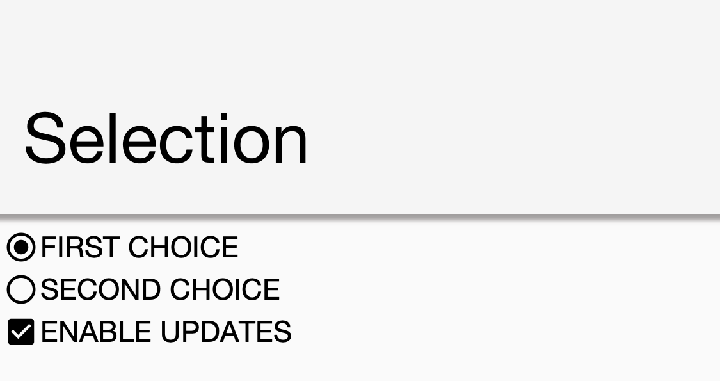

Both of these components can be displayed as toggle buttons (see the toggle button section below), or use the default check mark/filled circle appearance based on the type/OS.

==== Toggle Button

A toggle button is a button that's pressed and stays pressed. When a toggle button is pressed again it's released from the pressed state. Hence the button has a selected state to show if it's pressed or not like the `CheckBox`/`RadioButton` components in Codename One.

To turn any `CheckBox` or `RadioButton` to a toggle button use the `setToggle(true)` method. Or you can use the static `createToggle` method on both `CheckBox` and `RadioButton` to create a toggle button directly.

IMPORTANT: Invoking `setToggle(true)` implicitly converts the `UIID` to `ToggleButton` unless it was changed by the user from its original default value.

You can convert the sample above to use toggle buttons as such:

[source,java]
----
include::../demos/common/src/main/snippets/developer-guide/the-components-of-codename-one.java[tag=the-components-of-codename-one-java-035,indent=0]
----

.Toggle button converted sample
image::img/components-toggle-buttons.png[Toggle button converted sample,scaledwidth=20%]

That's half the story though: to get the full effect of some cool toggle button UI's you can use a https://www.codenameone.com/javadoc/com/codename1/ui/ComponentGroup.html[ComponentGroup]. This allows you to create a button bar effect with the toggle buttons.

For example, to enclose the `CheckBox` components in a vertical `ComponentGroup` and the `RadioButton's` in a horizontal group, change the last line of the code above as such:

[source,java]
----
include::../demos/common/src/main/snippets/developer-guide/the-components-of-codename-one.java[tag=the-components-of-codename-one-java-036,indent=0]
----

.Toggle button converted sample wrapped in ComponentGroup
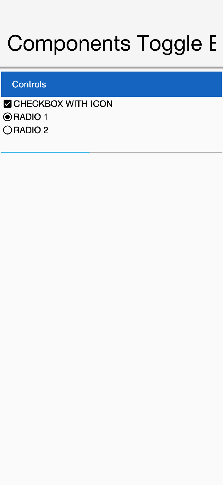

=== ComponentGroup

https://www.codenameone.com/javadoc/com/codename1/ui/ComponentGroup.html[ComponentGroup] is a special container that can be either horizontal or vertical (https://www.codenameone.com/javadoc/com/codename1/ui/layouts/BoxLayout.html[BoxLayout] `X_AXIS` or `Y_AXIS` respectively).

`ComponentGroup` "restyles" the elements within the group to have a `UIID` that allows you to create a "round border" effect that groups elements together.

The following code adds 4 component groups to a `Container` to show the various `UIID` changes:

[source,java]
----
include::../demos/common/src/main/snippets/developer-guide/the-components-of-codename-one.java[tag=the-components-of-codename-one-java-037,indent=0]
----

.ComponentGroup adapts the UIID's of the components added so you can style them
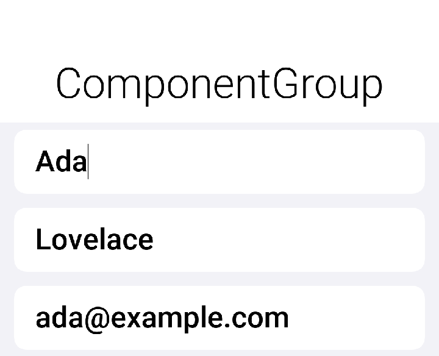

Notice the following about the code above and the resulting image:

- Buttons have a different UIID than other element types. Their styling is slightly different in such UI's so you need to pay attention to that.

- When an element is placed alone within a `ComponentGroup` its a special case `UIID`.

IMPORTANT: By default, `ComponentGroup` does *nothing*. You need to explicitly activate it in the theme by setting a theme property to true. Specifically you need to set `ComponentGroupBool` to `true` for `ComponentGroup` to do something otherwise its a box layout container! The `ComponentGroupBool` flag is true by default in the iOS native theme.

When `ComponentGroupBool` is set to true, the component group will change the styles of all components placed within it to match the element UIID given to it (GroupElement by default) with special caveats to the first/last/ elements. For example:

1. With one element in a component group it will have the UIID: `GroupElementOnly`
2. With two elements in a component group they will have the UIID's `GroupElementFirst`, `GroupElementLast`
3. With three elements in a component group they will have the UIID's `GroupElementFirst`, `GroupElement`, `GroupElementLast`
4. With four elements in a component group they will have the UIID's `GroupElementFirst`, `GroupElement`, `GroupElement`, `GroupElementLast`

This allows you to define special styles for the edges.

You can customize the `UIID` set by the component group by calling `setElementUIID` in the component group for example: `setElementUIID("ToggleButton")` for three elements result in the following `UIID's`:

`ToggleButtonFirst`, `ToggleButton`, `ToggleButtonLast`

=== MultiButton

https://www.codenameone.com/javadoc/com/codename1/components/MultiButton.html[MultiButton] is a <<lead-component-sidebar,composite component (lead component)>> that acts like a versatile https://www.codenameone.com/javadoc/com/codename1/ui/Button.html[Button]. It supports up to 4 lines of text (it doesn't automatically wrap the text), an emblem (usually navigational arrow, or check box) and an icon.

`MultiButton` can be used as a button, a `CheckBox` or a `RadioButton` for creating rich UI’s.

NOTE: The `MultiButton` was inspired by the aesthetics of the `UITableView` iOS component.

A common source of confusion in the `MultiButton` is the difference between the icon and the emblem, since both may have an icon image associated with them. The icon is an image representing the entry while the emblem is an optional visual representation of the action that will be undertaken when the element is pressed. Both may be used simultaneously or individually of one another:

[source,java]
----
include::../demos/common/src/main/snippets/developer-guide/the-components-of-codename-one.java[tag=the-components-of-codename-one-java-038,indent=0]
----

.Multiple usage scenarios for the MultiButton
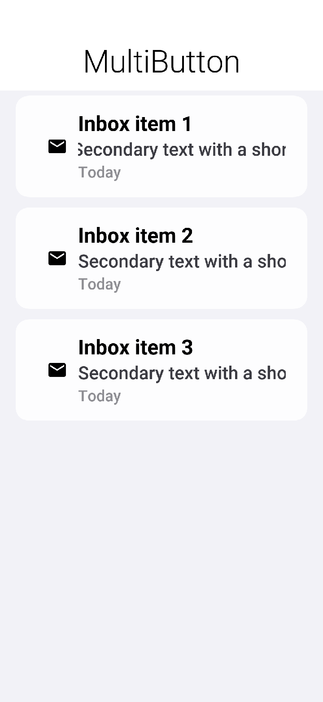

==== Styling the MultiButton

Since the `MultiButton` is a composite component setting its `UIID` will impact the top level UI.

To customize everything you need to customize the UIID's for `MultiLine1`, `MultiLine2`, `MultiLine3`, `MultiLine4` & `Emblem`.

You can customize the individual `UIID's` through the API directly using the `setIconUIID`, `setUIIDLine1`, `setUIIDLine2`, `setUIIDLine3`, `setUIIDLine4` & `setEmblemUIID`.

Recent versions also include a badge overlay that can be rendered in the corner of the main icon. Use `setBadgeText()` to display a value (for example a notification count) and `setBadgeUIID()` if you need a custom UIID instead of the default `Badge` styling. When you need to inspect or adjust the badge style programmatically, `getBadgeStyleComponent()` returns the component whose styles are applied to the badge so you can tweak padding, colors or borders before showing the `MultiButton`.

=== SpanButton

https://www.codenameone.com/javadoc/com/codename1/components/SpanButton.html[SpanButton] is a <<lead-component-sidebar,composite component (lead component)>> that looks/acts like a `Button` but can break lines rather than crop them when the text is long.

Unlike the `MultiButton` it uses the `TextArea` internally to break lines seamlessly. The `SpanButton` is far simpler than the `MultiButton` and as a result isn't as configurable:

[source,java]
----
include::../demos/common/src/main/snippets/developer-guide/the-components-of-codename-one.java[tag=the-components-of-codename-one-java-039,indent=0]
----

.The SpanButton Component
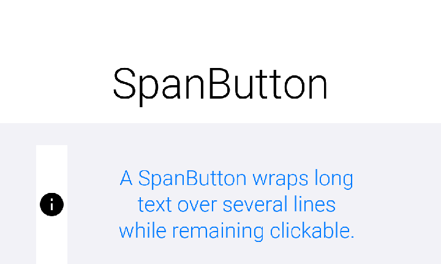

TIP: `SpanButton` is slower than both `Button` and `MultiButton`. Recommend using it when there is a genuine need for its functionality.

[[SpanLabel]]
=== SpanLabel

https://www.codenameone.com/javadoc/com/codename1/components/SpanLabel.html[SpanLabel] is a <<lead-component-sidebar,composite component (lead component)>> that looks/acts like a https://www.codenameone.com/javadoc/com/codename1/ui/Label.html[Label] but can break lines rather than crop them when the text is long.

`SpanLabel` uses the `TextArea` internally to break lines seamlessly and so doesn't provide all the elaborate configuration options of `Label`.

One of the features of label that moved into `SpanLabel` to some extent is the ability to position the icon. For example, unlike a `Label` the icon position is determined by the layout manager of the composite so `setIconPosition` accepts a `BorderLayout` constraint:

[source,java]
----
include::../demos/common/src/main/snippets/developer-guide/the-components-of-codename-one.java[tag=the-components-of-codename-one-java-040,indent=0]
----

.The SpanLabel Component
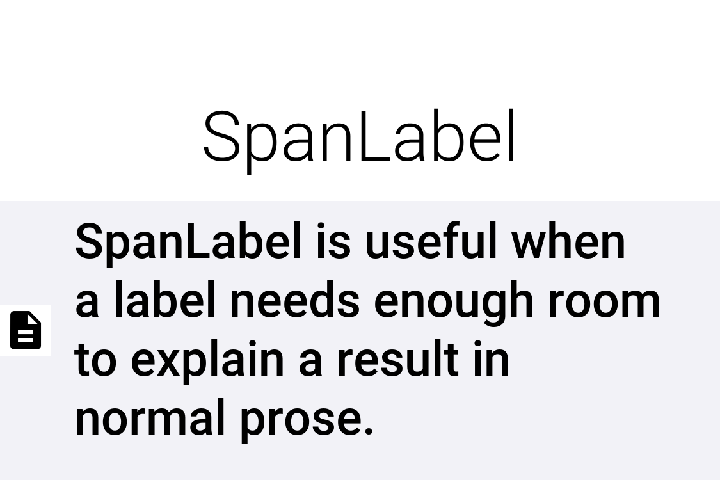

TIP: `SpanLabel` is slower than `Label`. Recommend using it when there is a genuine need for its functionality.

=== OnOffSwitch

The https://www.codenameone.com/javadoc/com/codename1/components/OnOffSwitch.html[OnOffSwitch] allows you to write an application where the user can swipe a switch between two states (on/off). This is a common UI paradigm in Android and iOS, although it's implemented in a radically different way in both platforms.

This is a rather elaborate component because of its unique design on iOS, but you're able to accommodate most of the small behaviors of the component into your version, and it seamlessly adapts between the Android style and the iOS style.

The image below was generated based on the default use of the `OnOffSwitch`:

[source,java]
----
include::../demos/common/src/main/snippets/developer-guide/the-components-of-codename-one.java[tag=the-components-of-codename-one-java-041,indent=0]
----

.The OnOffSwitch component as it appears on/off on iOS (top) and on Android (bottom)
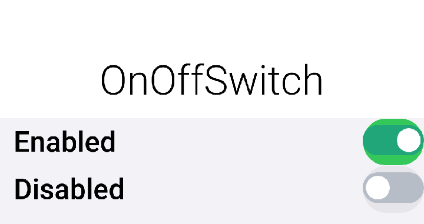

As you can understand the difference between the way iOS and Android render this component has triggered two different implementations within a single component. The Android implementation uses standard buttons and is the default for non-iOS platforms.

TIP: You can force the Android or iOS mode by using the theme constant `onOffIOSModeBool`.

[[validation-section]]
==== Validation

Validation is an inherent part of text input, and the https://www.codenameone.com/javadoc/com/codename1/ui/validation/Validator.html[Validator] class allows that. You can enable validation
through the `Validator` class to add constraints for a specific component.
It's also possible to define components that would be enabled/disabled based on validation state and the way in which validation errors are rendered (change the components `UIID`, paint an emblem on top, etc.). A https://www.codenameone.com/javadoc/com/codename1/ui/validation/Constraint.html[Constraint] is an interface
that represents validation requirements. You can define a constraint in Java or use some built-in
constraints such as https://www.codenameone.com/javadoc/com/codename1/ui/validation/LengthConstraint.html[LengthConstraint], https://www.codenameone.com/javadoc/com/codename1/ui/validation/RegexConstraint.html[RegexConstraint], etc.

This sample below continues from the place where the <<text-component-sample-code,TextField sample above>> stopped by adding validation to that code:

[source,java]
----
include::../demos/common/src/main/snippets/developer-guide/the-components-of-codename-one.java[tag=the-components-of-codename-one-java-042,indent=0]
----

.Validation & Regular Expressions
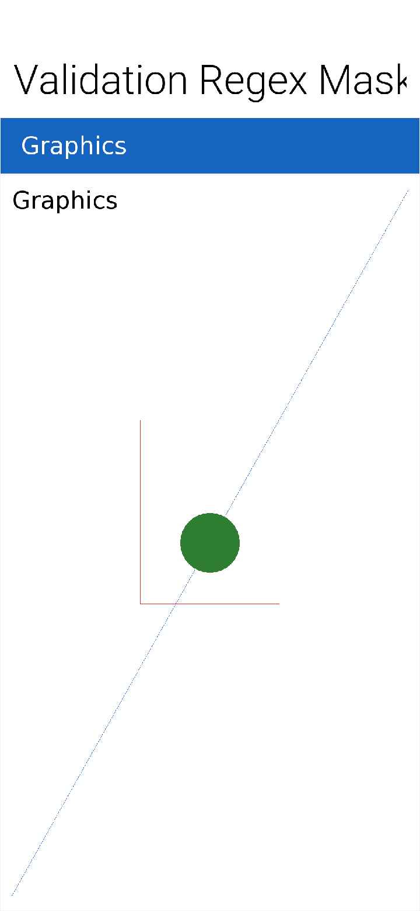

When the form components are bound to a model with `@Bindable`, the
same constraints can be expressed as field annotations -- `@Required`,
`@Length`, `@Regex`, `@Email`, `@Url`, `@Numeric`, `@ExistIn`,
`@Validate` -- and the generated binder wires them into a `Validator`
exposed through `Binding#getValidator()`. See the
<<annotation-binding-validation,Validation annotations>> section in the
component binding chapter for the full reference.

=== InfiniteProgress

The https://www.codenameone.com/javadoc/com/codename1/components/InfiniteProgress.html[InfiniteProgress] indicator spins an image infinitely to show that a background process is still working.

TIP: This style of animation is often nicknamed "washing machine" as it spins endlessly.

`InfiniteProgress` can be used in one of two ways either by embedding the component into the UI through something like this:

[source,java]
----
include::../demos/common/src/main/snippets/developer-guide/the-components-of-codename-one.java[tag=the-components-of-codename-one-java-043,indent=0]
----

`InfiniteProgress` can also appear over the entire screen, thus blocking all input. This tints the background while the infinite progress rotates:

[source,java]
----
include::../demos/common/src/main/snippets/developer-guide/the-components-of-codename-one.java[tag=the-components-of-codename-one-java-044,indent=0]
----

.Infinite progress
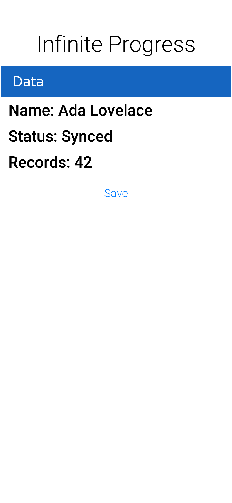

The image used in the `InfiniteProgress` animation is defined by the native theme. You can override that definition either by defining the theme constant `infiniteImage` or by invoking the https://www.codenameone.com/javadoc/com/codename1/components/InfiniteProgress.html#setAnimation-com.codename1.ui.Image-[setAnimation] method.

NOTE: Despite the name of the method `setAnimation` expects a static image that will be rotated internally. Don't use an animated image.

=== InfiniteScrollAdapter and InfiniteContainer

https://www.codenameone.com/javadoc/com/codename1/components/InfiniteScrollAdapter.html[InfiniteScrollAdapter] & https://www.codenameone.com/javadoc/com/codename1/ui/InfiniteContainer.html[InfiniteContainer] allow you to create a scrolling effect that "never" ends with the typical `Container`/`Component` paradigm.

The motivation behind these classes is simple, say you have a lot of data to fetch from storage or from the internet. You can fetch the data in batches and show progress sign while you do this.

Infinite scroll fetches the next batch of data dynamically as you reach the end of the `Container`. `InfiniteScrollAdapter` & `InfiniteContainer` represent two similar ways to do that task.

Let start by exploring how you can achieve this UI that fetches data from a webservice:

.InfiniteScrollAdapter demo code fetching property cross data
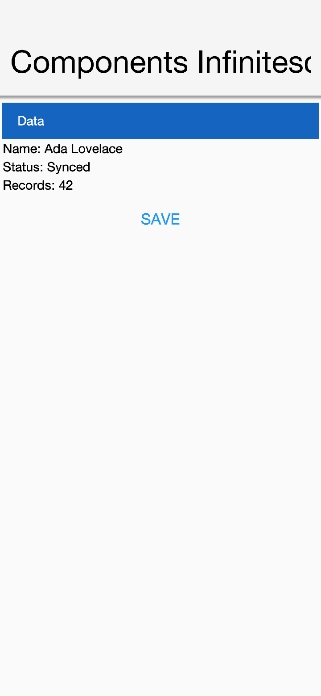

The first step is creating the webservice call, you won't go into too much detail here as webservices & IO are discussed later in the guide:

[source,java]
----
include::../demos/common/src/main/snippets/developer-guide/the-components-of-codename-one.java[tag=the-components-of-codename-one-java-045,indent=0]
----

IMPORTANT: The demo code here doesn't do any error handling! This is a bad practice and it's taken here to keep the code short and readable. Proper error handling is used in the Property Cross demo.

The `fetchPropertyData` is a simplistic tool that fetches the next page of listings for the nestoria webservice. Notice that this method is synchronous and will block the calling thread (legally) until the network operation completes.

Now that you have a webservice lets proceed to create the UI. Check out the code annotations below:

[source,java]
----
include::../demos/common/src/main/snippets/developer-guide/the-components-of-codename-one.java[tag=the-components-of-codename-one-java-046,indent=0]
----

<1> Placeholder is essential for the https://www.codenameone.com/javadoc/com/codename1/ui/URLImage.html[URLImage] class which this guide covers at a different place.

<2> The `InfiniteScrollAdapter` accepts a runnable which is invoked every time you reach the edge of the scrolling. You used a closure instead of the typical run() method override.

<3> This is a blocking call, after the method completes you will have all the data you need. Notice that this method doesn't block the EDT illegally.

<4> If there is no more data you call the `addMoreComponents` method with a false argument. This indicates that there is no more data to fetch.

<5> Here you add the actual components to the end of the form. Notice that you *must not* invoke the `add`/`remove` method of `Container`. Those might conflict with the work of the `InfiniteScrollAdapter`.

<6> You pass true to show that the data isn't "prefilled" so the method should be invoked when the `Form` is first shown

IMPORTANT: Don't violate the EDT in the callback. It's invoked on the event dispatch thread and it's crucial

==== The InfiniteContainer

https://www.codenameone.com/javadoc/com/codename1/ui/InfiniteContainer.html[InfiniteContainer] was introduced to simplify and remove some boilerplate of the `InfiniteScrollAdapter`. It takes a more traditional approach of inheriting the Container class to provide its functionality.

Unlike the `InfiniteScrollAdapter` the `InfiniteContainer` accepts an index and amount to fetch. This is useful for tracking your position but also important since the `InfiniteContainer` also implements #Pull To Refresh# as part of its functionality.

Converting the code above to an `InfiniteContainer` is pretty simple you moved all the code into the callback `fetchComponents` method and returned the array of `Component's` as a response.

Unlike the `InfiniteScrollAdapter` you can't use the `ContentPane` directly so you've to use a `BorderLayout` and place the `InfiniteContainer` there:

[source,java]
----
include::../demos/common/src/main/snippets/developer-guide/the-components-of-codename-one.java[tag=the-components-of-codename-one-java-047,indent=0]
----

=== List, MultiList, renderers & models

// vale-skip: Microsoft.HeadingPunctuation: "vs." is the abbreviation for "versus"; the period is part of the abbreviation, not a heading-end terminator.
==== InfiniteContainer/InfiniteScrollAdapter vs. List/ContainerList

Your recommendation is to always go with `Container`, `InfiniteContainer` or `InfiniteScrollAdapter`.

Recommend avoiding `List` or its subclasses/related classes specifically `ContainerList` & `MultiList`.

NOTE: Recommend replacing `ComboBox` with `Picker` but that's a different discussion.

A `Container` with ~5000 nested containers within it can perform on par with a `List` and probably exceed its performance when used.

Larger sets of data are manageable on phones or tablets so the benefits for lists are dubious.

In API you found that even experienced developers experienced a great deal of pain when wrangling the Swing styled lists and their stateless approach.

Since animation, swiping and other capabilities that are so common in mobile are so hard to do with lists you see no actual reason to use them.

==== Why isn't list deprecated

You deprecated `ContainerList` which performs badly and has some inherent complexity issues. `List` has some unique use cases and is still used all over Codename One.

`MultiList` is a reasonable version of `List` that's far easier to use without most of the pains related to renderer configuration.

Some cases justify using `List` or `MultiList`, but they're rarer than usual, hence the recommendation.

==== MVC in lists

A Codename One https://www.codenameone.com/javadoc/com/codename1/ui/List.html[List] doesn't contain components, but rather arbitrary data; this seems odd at first but makes sense. If you want a list to contain components, use a Container.

The advantage of using a `List` in this way is that you can display it in many ways (for example: fixed focus positions, horizontally, etc.), and that you can have more than a million entries without performance overhead. You can also do some pretty nifty things, like filtering the list on the fly or fetching it dynamically from the Internet as the user scrolls down the list.
To achieve these things the list uses two interfaces: https://www.codenameone.com/javadoc/com/codename1/ui/list/ListModel.html[ListModel] and ListCellRenderer.
https://www.codenameone.com/javadoc/com/codename1/ui/List.html[List] model represents the data; its responsibility is to return the arbitrary object within the list at a given offset. Its second responsibility is to tell the list when the data changes, so the list can refresh.

TIP: Think of the model as an array of objects that can tell you when it changes.

The list renderer is like a rubber stamp that knows how to draw an object from the model, it's called many times per entry in an animated list and must be fast. Unlike standard Codename One components, it's used to draw the entry in the model and is discarded, hence it has no memory overhead, but if it takes too long to process a model value it can be a big bottleneck!

TIP: Think of the render as a translation layer that takes the "data" from the model and translates it to a visual representation.

This is all generic, but a bit too much for most, doing a list correctly requires some understanding. The main source of confusion for developers is the stateless nature of the list and the transfer of state to the model (for example: a checkbox list needs to listen to action events on the list and update the model, in order for the renderer to display that state). Once you understand that it’s easy.

==== Understanding MVC

A quick recap of what MVC is:

- #Model# - Represents the data for the component (list), the model can tell you how many items are in it and which item resides at a given offset within the model. This differs from a simple `Vector` (or array), since all access to the model is controlled (the interface is simpler), and unlike a `Vector`/Array, the model can tell you of changes that occur within it.
- #View# - The view draws the content of the model. It's a "dumb" layer that has no notion of what's displayed and knows how to draw. It tracks changes in the model (the model sends events) and redraws itself when it changes.
- #Controller# - The controller accepts user input and performs changes to the model, which in turn cause the view to refresh.

.Typical MVC Diagram footnote:[Image by RegisFrey - Own work, Public Domain, https://commons.wikimedia.org/w/index.php?curid=10298177]
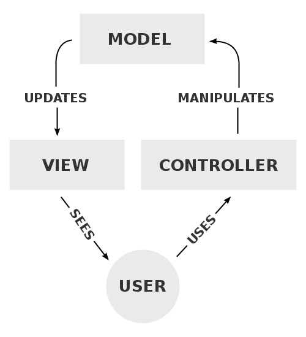

Codename One's https://www.codenameone.com/javadoc/com/codename1/ui/List.html[List] component uses the MVC paradigm in its implementation. `List` itself is the #Controller# (with a bit of the #View# mixed in). The https://www.codenameone.com/javadoc/com/codename1/ui/list/ListCellRenderer.html[ListCellRenderer] interface is the rest of the #View# and the https://www.codenameone.com/javadoc/com/codename1/ui/list/ListModel.html[ListModel] is (you guessed it by now) the #Model#.

When the list is painted, it iterates over the visible elements in the model and asks the model for the data, it then draws them using the renderer. Notice that because of this both the model and the renderer must be fast and that's hard.

===== Why is this useful

Since the model is a lightweight interface, it can be implemented by you and replaced in runtime if so desired, this allows many use cases:

1. A list can contain thousands of entries but load the portion visible to the user. Since the model will be queried for the elements that are visible to the user, it won't need to load the large data set into memory until the user starts scrolling down (at which point other elements may be offloaded from memory).

2. A list can cache efficiently. For example: a list can mirror data from the server into local RAM without actually downloading all the data. Data can also be mirrored from storage for better performance and discarded for better memory use.

3. The is no need for state copying. Since renderers allow you to display any object type, the list model interface can be implemented by the application's data structures (for example: persistence/network engine), which would return internal application data structures saving you the need of copying application state into a list specific data structure. Note that this advantage applies with a custom renderer which is pretty difficult to get right.

4. Using the proxy pattern you can layer logic such as filtering, sorting, caching, etc. On top of existing models without changing the model source code.

5. You can reuse generic models for many views, for example: a model that fetches data from the server can be initialized with different arguments, to fetch different data for different views. View objects in different Forms can display the same model instance in different view instances, thus they would update automatically when you change one global model.

Most of these use cases work best for lists that grow to a larger size, or represent complex data, which is what the list object is designed to do.

==== Important - lists and Layout managers
When working with lists, you want the list to handle the scrolling (otherwise it will perform badly). This means you should place the list in a non-scrollable container (no parent can be scrollable), notice that the content pane is scrollable by default, so you should disable that.

It's also recommended to place the list in the `CENTER` location of a https://www.codenameone.com/javadoc/com/codename1/ui/layouts/BorderLayout.html[BorderLayout] to produce the most effective results. For example:

[source,java]
----
include::../demos/common/src/main/snippets/developer-guide/the-components-of-codename-one.java[tag=the-components-of-codename-one-java-048,indent=0]
----

==== MultiList & DefaultListModel

After this long start, here is the first sample of creating a list using the https://www.codenameone.com/javadoc/com/codename1/ui/list/MultiList.html[MultiList].

The `MultiList` is a preconfigured list that contains a ready made renderer with defaults that make sense for the most common use cases. It still retains most of the power available to the `List` component but reduces the complexity of one of the hardest things to grasp for most developers: rendering.

The full power of the `ListModel` is still available and allows you to create a million entry list with a few lines of code. For example the objects that the model returns should always be in the form of `Map` objects and not an arbitrary object like the standard `List` allows.

Here is a simple example of a `MultiList` containing a highly popular subject matter:

[source,java]
----
include::../demos/common/src/main/snippets/developer-guide/the-components-of-codename-one.java[tag=the-components-of-codename-one-java-049,indent=0]
----

.Basic usage of the MultiList & DefaultListModel]
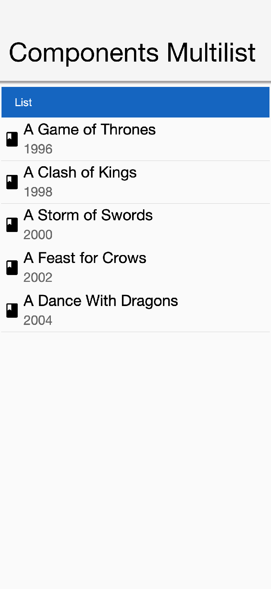

`createListEntry` is trivial:

[source,java]
----
include::../demos/common/src/main/snippets/developer-guide/the-components-of-codename-one.java[tag=the-components-of-codename-one-java-050,indent=0]
----

One major piece is missing here: the cover images for the books. A simple approach would be to place the image objects into the entries using the "icon" property as such:

[source,java]
----
include::../demos/common/src/main/snippets/developer-guide/the-components-of-codename-one.java[tag=the-components-of-codename-one-java-051,indent=0]
----

.With cover images in place
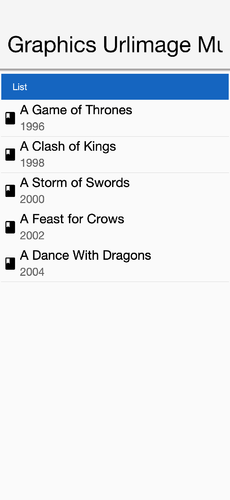

TIP: Since the `MultiList` uses the `GenericListCellRenderer` internally you can use https://www.codenameone.com/javadoc/com/codename1/ui/URLImage.html[URLImage] to dynamically fetch the data. This is discussed in the graphics section of this guide.

===== Going further with the ListModel

Suppose that http://www.georgerrmartin.com/[GRRM] was prolific and wrote 1 million books. The default list model won't make much sense in that case but you would still be able to render everything in a list model.

You will fake it a bit but notice that 1M components won't be created even if you somehow scroll all the way down...

The https://www.codenameone.com/javadoc/com/codename1/ui/list/ListModel.html[ListModel] interface can be implemented by anyone in this case you did a stupid simple implementation:

[source,java]
----
include::../demos/common/src/main/snippets/developer-guide/the-components-of-codename-one.java[tag=the-components-of-codename-one-java-052,indent=0]
----

You can now replace the existing model by removing all the model related logic and changing the constructor call as such:

[source,java]
----
include::../demos/common/src/main/snippets/developer-guide/the-components-of-codename-one.java[tag=the-components-of-codename-one-java-053,indent=0]
----

.It took ages to scroll this far... This goes to a million...
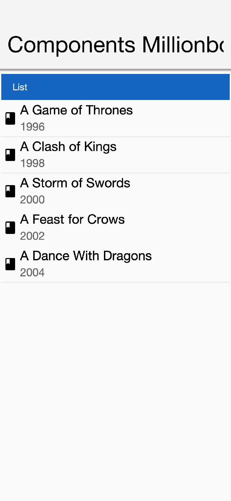

==== List cell renderer

The Renderer is a simple interface with 2 methods:

[source,java]
----
include::../demos/common/src/main/snippets/developer-guide/the-components-of-codename-one.java[tag=the-components-of-codename-one-java-054,indent=0]
----

The most simple/naive implementation may choose to implement the renderer as follows:

[source,java]
----
include::../demos/common/src/main/snippets/developer-guide/the-components-of-codename-one.java[tag=the-components-of-codename-one-java-055,indent=0]
----

This will compile and work, but won't give you much, notice that you won't see the `List` selection move on the List, this is because the renderer returns a https://www.codenameone.com/javadoc/com/codename1/ui/Label.html[Label] with the same style regardless if it's selected or not.

Now make it a bit more useful:

[source,java]
----
include::../demos/common/src/main/snippets/developer-guide/the-components-of-codename-one.java[tag=the-components-of-codename-one-java-056,indent=0]
----

In this renderer you set the `Label.setFocus(true)` if it's selected, calling to this method doesn't give the focus to the Label, it renders the label as selected.

Then you invoke `Label.getAllStyles().setBgTransparency(100)` to give the selection semi transparency, and `0` for full transparency if not selected.

That's still not efficient because you create a new `Label` each time the method is invoked.

To make the code tighter, keep a reference to the `Component` or extend it as https://www.codenameone.com/javadoc/com/codename1/ui/list/DefaultListCellRenderer.html[DefaultListCellRenderer] does:

[source,java]
----
include::../demos/common/src/main/snippets/developer-guide/the-components-of-codename-one.java[tag=the-components-of-codename-one-java-057,indent=0]
----

Now look at a more advanced Renderer:

[source,java]
----
include::../demos/common/src/main/snippets/developer-guide/the-components-of-codename-one.java[tag=the-components-of-codename-one-java-058,indent=0]
----

In this renderer you want to render a `Contact` object to the Screen, you build the `Component` in the constructor and in the getListCellRendererComponent you update the Labels' texts according to the `Contact` object.

Notice that in this renderer you return a focus `Label` with semi transparency, as mentioned before, the focus component can be modified within this method.

For example, you can change the focus `Component` to have an icon:

[source,java]
----
include::../demos/common/src/main/snippets/developer-guide/the-components-of-codename-one.java[tag=the-components-of-codename-one-java-059,indent=0]
----

==== Generic list cell renderer

As part of the GUI builder work, you needed a way to customize rendering for a List, but the renderer/model approach seemed impossible to adapt to a GUI builder (it seems the Swing GUI builders had a similar issue). Your solution was to introduce the `GenericListCellRenderer`, which while introducing limitations and implementation requirements still manages to make life easier, both in the GUI builder and outside of it.

https://www.codenameone.com/javadoc/com/codename1/ui/list/GenericListCellRenderer.html[GenericListCellRenderer] is a renderer designed to be as simple to use as a `Component`-`Container` hierarchy, you effectively crammed most of the common renderer use cases into one class. To enable that, you need to know the content of the objects within the model, so the `GenericListCellRenderer` assumes the model contains `Map` objects. Since `Maps` can contain arbitrary data the list model is still generic and allows storing application specific data. Furthermore a `Map` can still be derived and extended to provide domain specific business logic.

The `GenericListCellRenderer` accepts two container instances (more later on why at least two, and not one), which it maps to individual `Map` entries within the model, by finding the appropriate components within the given container hierarchy. Components are mapped to the `Map` entries based on the name property of the component (`getName`/`setName`) and the key/value within the `Map`, for example:

For a model that contains a `Map` entry like this:

----
"Foo": "Bar"
"X": "Y"
"Not": "Applicable"
"Number": Integer(1)
----

A renderer will loop over the component hierarchy in the container, searching for components whose name matches Foo, X, Not, and Number, and assigning the appropriate value to them.

TIP: You can also use image objects as values, and they will be assigned to labels as expected. For example, you can't assign both an image and a text to a single label, since the key will be taken. That isn't a big problem, since two labels can be used in such a renderer.

To make matters even more attractive the renderer seamlessly supports list tickering when appropriate, and if a https://www.codenameone.com/javadoc/com/codename1/ui/CheckBox.html[CheckBox] appears within the renderer, it will toggle a boolean flag within the `Map` seamlessly.

One issue that crops up with this approach is that, if a value is missing from the `Map`, it's treated as empty and the component is reset.

This can pose an issue if you hardcode an image or text within the renderer and you don't want them replaced (for example: an arrow graphic on a `Label` within the renderer). The solution for this is to name the component with Fixed in the end of the name, for example: `HardcodedIconFixed`.

Naming a component within the renderer with $number will automatically set it as a counter component for the offset of the component within the list.

Styling the `GenericListCellRenderer` is slightly different, the renderer uses the `UIID` of the `Container` passed to the generic list cell renderer, and the background focus uses that same `UIID` with the word "Focus" appended to it.

Note that the generic list cell renderer will grant focus to the child components of the selected entry if they're focusable, thus changing the style of said entries. For example: a https://www.codenameone.com/javadoc/com/codename1/ui/Container.html[Container] might have a child `Label` that has one style when the parent container is unselected and another when it's selected (focused), this can be achieved by defining the label as focusable. Notice that the component will never receive direct focus, since it's still part of a renderer.

Finally, the generic list cell renderer accepts two or four instances of a Container, rather than the obvious choice of accepting one instance. This allows the renderer to treat the selected entry differently, which is important to tickering, although it's also useful for the fisheye effect footnote:[Fisheye is an effect where the selection stays in place as the list moves around it]. Since it might not be practical to seamlessly clone the `Container` for the renderer's needs, Codename One expects the developer to provide two separate instances, they can be identical in all respects, but they must be separate instances for tickering to work. The renderer also allows for a fisheye effect, where the selected entry is actually different from the unselected entry in its structure, it also allows for a pinstripe effect, where odd/even rows have different styles (this is accomplished by providing 4 instances of the containers selected/unselected for odd/even).

The best way to learn about the generic list cell renderer and the `Map` model is by playing with them in the old GUI builder. Notice they can be used in code without any dependency on the GUI builder and can be useful at that.

Here is a simple example of a list with checkboxes that gets updated automatically:

[source,java]
----
include::../demos/common/src/main/snippets/developer-guide/the-components-of-codename-one.java[tag=the-components-of-codename-one-java-060,indent=0]
----

.GenericListCellRenderer demo code
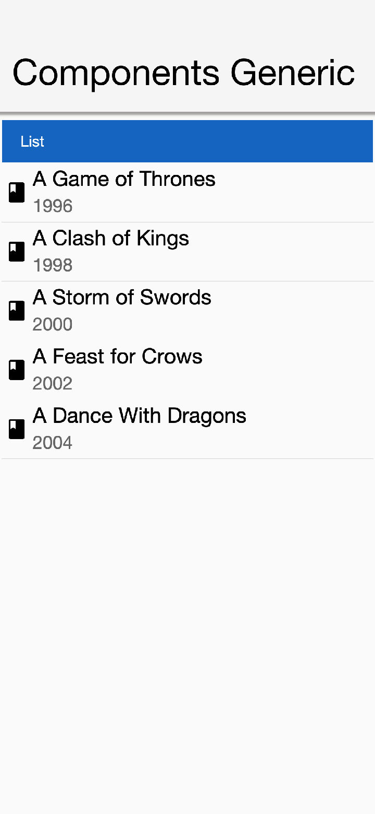

===== Custom UIID of entry in GenenricListCellRenderer/MultiList

With https://www.codenameone.com/javadoc/com/codename1/ui/list/MultiList.html[MultiList]/`GenenricListCellRenderer` one of the common issues is making a UI where a specific component
within the list renderer has a different UIID style based on data. For example: this can be helpful to mark a label within the
list as red, for instance, for a list of monetary transactions.

This can be achieved with a custom renderer, but that's a pretty difficult task. +
`GenericListCellRenderer` (`MultiList` uses `GenericListCellRenderer` internally) has another option.

Normally, to build the model for a renderer of this type, you use something like:

[source,java]
----
include::../demos/common/src/main/snippets/developer-guide/the-components-of-codename-one.java[tag=the-components-of-codename-one-java-061,indent=0]
----

What if you want componentName to be red? Just use:

[source,java]
----
include::../demos/common/src/main/snippets/developer-guide/the-components-of-codename-one.java[tag=the-components-of-codename-one-java-062,indent=0]
----

This will apply the UIID "red" to the component, which you can then style in the theme. Notice that once you start
doing this, you need to define this entry for all entries, for example:

[source,java]
----
include::../demos/common/src/main/snippets/developer-guide/the-components-of-codename-one.java[tag=the-components-of-codename-one-java-063,indent=0]
----

Otherwise the component will stay red for the next entry (since the renderer acts like a rubber stamp).

===== Rendering prototype

Because of the rendering architecture of a `List` its pretty hard to calculate the right preferred size for such a component. The default behavior includes querying a few entries from the model then constructing their renderers to get a "sample" of the preferred size value.

As you might guess this triggers a performance penalty that's paid with every reflow of the UI. The solution is to use `setRenderingPrototype`.

`setRenderingPrototype` accepts a "fake" value that represents a reasonably large amount of data and it will be used to calculate the preferred size. For example: for a multiList that should render 2 lines of text with 20 characters and a 5mm square icon you can do something like this:

[source,java]
----
include::../demos/common/src/main/snippets/developer-guide/the-components-of-codename-one.java[tag=the-components-of-codename-one-java-064,indent=0]
----

==== ComboBox

The https://www.codenameone.com/javadoc/com/codename1/ui/ComboBox.html[ComboBox] is a specialization of `List` that displays a single selected entry. When clicking that entry a popup is presented allowing the user to pick an entry from the full list of entries.

TIP: The `ComboBox` UI paradigm isn't as common on OSes such as iOS where there is no native equivalent to it. Recommend using either the https://www.codenameone.com/javadoc/com/codename1/ui/spinner/Picker.html[Picker] class or the https://www.codenameone.com/javadoc/com/codename1/ui/AutoCompleteTextField.html[AutoCompleteTextField].

`ComboBox` is notoriously hard to style as it relies on a complex dynamic of popup renderer and instantly visible renderer. The `UIID` for the `ComboBox` is `ComboBox`
but if you set it to something else all the other `UIID's` will also change their prefix. For example: the `ComboBoxPopup`
`UIID` will become `MyNewUIIDPopup`.

The combo box defines the following UIID's by default:

- `ComboBox`
- `ComboBoxItem`
- `ComboBoxFocus`
- `PopupContentPane`
- `PopupItem`
- `PopupFocus`

The `ComboBox` also defines theme constants that allow some native themes to manipulate its behavior for example:

- `popupTitleBool` - shows the "label for" value as the title of the popup dialog
- `popupCancelBodyBool` - Adds a cancel button into the popup dialog
- `centeredPopupBool` - shows the popup dialog in the center of the screen instead of under the popup
- `otherPopupRendererBool` - Uses a different list cell render for the popup than the one used for the `ComboBox`
itself. When this is `false` `PopupItem` & `PopupFocus` become irrelevant. Notice that the Android native theme defines this to `true`.

Since a `ComboBox` is a `List` you can use everything you learned about a `List` to build a `ComboBox` including models, `GenericListCellRenderer` etc.

For example: the demo below uses the GRRM demo data from above to build a `ComboBox`:

[source,java]
----
include::../demos/common/src/main/snippets/developer-guide/the-components-of-codename-one.java[tag=the-components-of-codename-one-java-065,indent=0]
----

.GRRM ComboBox
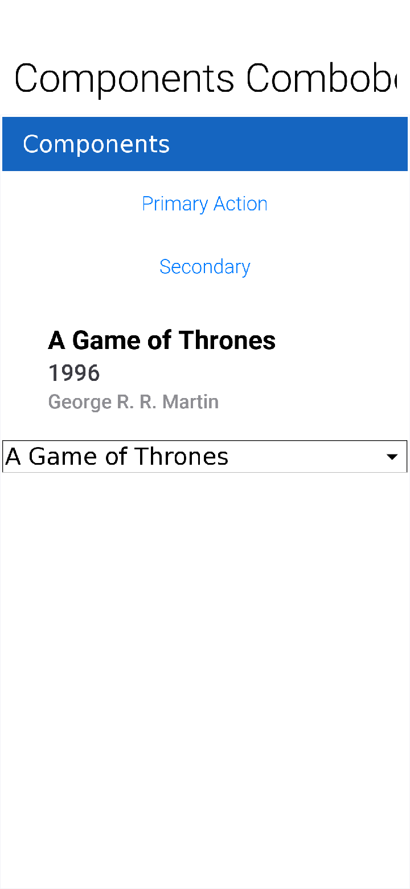

=== Slider

A https://www.codenameone.com/javadoc/com/codename1/ui/Slider.html[Slider] is an empty component that can be filled horizontally or vertically to allow indicating progress, setting volume etc. It can be editable to allow the user to determine its value or none editable to relay that information to the user.
It can have a thumb on top to show its current position.

.Slider
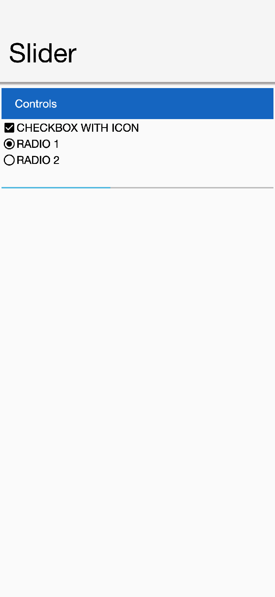

The interesting part about the slider is that it has two separate style `UIID’s`, `Slider` & `SliderFull`. The `Slider` `UIID` is always painted and `SliderFull` is rendered on top based on the amount the `Slider` should be filled.

`Slider` is highly customizable for example: a slider can be used to replicate a 5-star rating widget as such. Notice that this slider will work when its given its preferred size otherwise more stars will appear. That's why you place it within a `FlowLayout`:

[source,java]
----
include::../demos/common/src/main/snippets/developer-guide/the-components-of-codename-one.java[tag=the-components-of-codename-one-java-066,indent=0]
----

The slider itself is initialized in the code below. Notice that you can achieve almost the same result using a theme by setting the `Slider` & `SliderFull` UIID's (both in selected & unselected states).

In fact doing this in the theme might be superior as you could use one image that contains 5 stars already and that way you won't need the preferred size hack below:

[[slider-stars-demo]]
[source,java]
----
include::../demos/common/src/main/snippets/developer-guide/the-components-of-codename-one.java[tag=the-components-of-codename-one-java-067,indent=0]
----

.Star Slider set to 5 (its between 0 - 10)
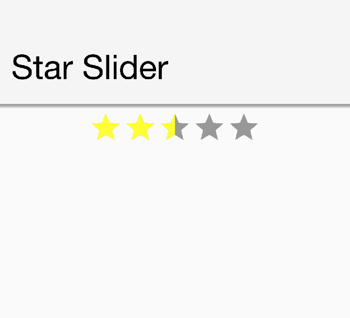

TIP: This slider goes all the way to 0 stars which is less common. You can use a `Label` to represent the first star and have the slider work between 0 - 8 values to provide 4 more stars.

[[table-section]]
=== Table

https://www.codenameone.com/javadoc/com/codename1/ui/table/Table.html[Table] is a composite component (but it isn't a <<lead-component-sidebar,lead component>>), this means it's a subclass of https://www.codenameone.com/javadoc/com/codename1/ui/Container.html[Container]. It's effectively built from many components.

TIP: `Table` is based on the https://www.codenameone.com/javadoc/com/codename1/ui/table/TableLayout.html[TableLayout] class. It's important to be familiar with that layout manager when working with `Table`.

Here is a trivial sample of using the standard table component:

[source,java]
----
include::../demos/common/src/main/snippets/developer-guide/the-components-of-codename-one.java[tag=the-components-of-codename-one-java-068,indent=0]
----

.Simple Table usage
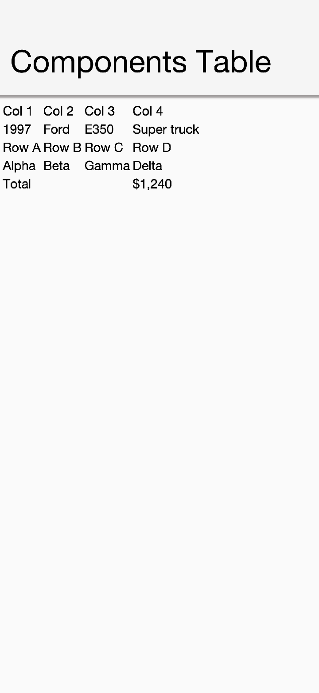

NOTE: In the sample above the title area and first column aren't editable. The other two columns are editable.

The more "interesting" capabilities of the `Table` class can be utilized through the `TableLayout`. You can use the layout constraints (also exposed in the table class) to create spanning and elaborate UI's.

For example:

[source,java]
----
include::../demos/common/src/main/snippets/developer-guide/the-components-of-codename-one.java[tag=the-components-of-codename-one-java-069,indent=0]
----

.Table with spanning & fixed widths to 33%
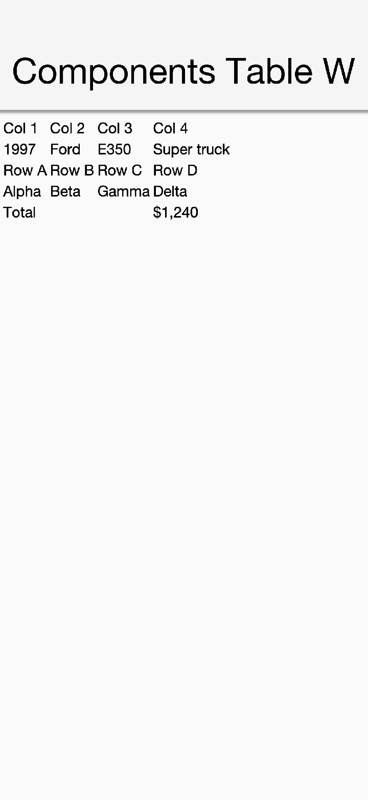

To customize the table cell behavior you can derive the `Table` to create a "renderer like" widget, but unlike the list this component is "kept" and used as is. This means you can bind listeners to this component and work with it as you would with any other component in Codename One.

The example above can be extended to include far more capabilities:
[source,java]
----
include::../demos/common/src/main/snippets/developer-guide/the-components-of-codename-one.java[tag=the-components-of-codename-one-java-070,indent=0]
----

<1> The `createCell` method is invoked once per component but is similar conceptually to the `List` renderer. Notice that it doesn't return a "rubber stamp" though, it returns a full component.
<2> You apply the picker to one cell for simplicities sake.
<3> You need to set the value of the component manually, this is crucial since the `Table` doesn't "see" this.
<4> You need to track the event and update the model in this case as the `Table` isn't aware of the data change.
<5> You set the "pinstripe" effect by coloring even rows. Notice that unlike renderers you need to apply the coloring once as the `Components` are stateful.

.Table with customize cells using the pinstripe effect

.Picker table cell during edit
image::img/components-table-pinstripe-edit.png[Picker table cell during edit,scaledwidth=20%]

To line wrap table cells you can override the `createCell` method and return a https://www.codenameone.com/javadoc/com/codename1/ui/TextArea.html[TextArea] instead of a https://www.codenameone.com/javadoc/com/codename1/ui/TextField.html[TextField] since the `TextArea` defaults to the multi-line behavior this should work seamlessly. For example:

[source,java]
----
include::../demos/common/src/main/snippets/developer-guide/the-components-of-codename-one.java[tag=the-components-of-codename-one-java-071,indent=0]
----

TIP: Notice that you don't need to do anything else as binding to the `TextArea` is built-in to the `Table`.

IMPORTANT: You must set the column width constraint when you want multi-line to work. Otherwise the preferred size of the column might be too wide and the remaining columns might not have space left.

.Multiline table cell in portrait mode
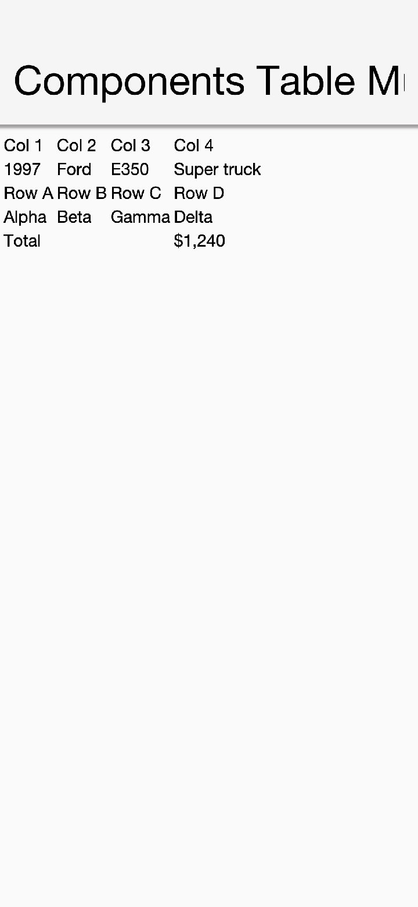

.Multiline table cell in landscape mode. Notice the cell row count adapts seamlessly
image::img/components-table-multiline-landscape.png[Multiline table cell in landscape mode. Notice the cell row count adapts seamlessly,scaledwidth=20%]

==== Sorting tables

Sorting tables by clicking the titles is something that should work out of the box by using an API like `setSortSupported(true)`:

[source,java]
----
include::../demos/common/src/main/snippets/developer-guide/the-components-of-codename-one.java[tag=the-components-of-codename-one-java-072,indent=0]
----

Notice this works with numbers, Strings and might work with dates but you can support any object type by overriding the method `protected Comparator createColumnSortComparator(int column)` which should return a comparator for your custom object type in the column.

[[tree-section]]
=== Tree

https://www.codenameone.com/javadoc/com/codename1/ui/tree/Tree.html[Tree] allows displaying hierarchical data such as folders and files in a collapsible/expandable UI. Like the <<table-section,Table>> it's a composite component (but it isn't a <<lead-component-sidebar,lead component>>).
Like the `Table` it works in consort with a model to construct its user interface on the fly but doesn't use a stateless renderer (as `List` does).

The data of the `Tree` arrives from a model for example: this:

[source,java]
----
include::../demos/common/src/main/snippets/developer-guide/the-components-of-codename-one.java[tag=the-components-of-codename-one-java-073,indent=0]
----

Will result in this:

.Tree
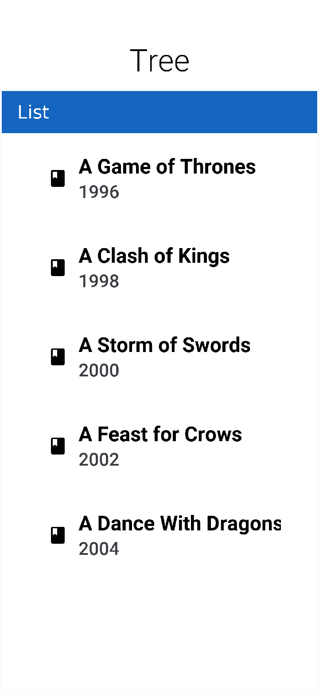

NOTE: Since `Tree` is hierarchy based you can't have a simple model like you've for the `Table` as deep hierarchy is harder to represent with arrays.

A more practical "real world" example would be working with XML data. You can use something like this to show an XML `Tree`:

[source,java]
----
include::../demos/common/src/main/snippets/developer-guide/the-components-of-codename-one.java[tag=the-components-of-codename-one-java-074,indent=0]
----

NOTE: The `try(Stream)` syntax is a try with resources clogic that implicitly closes the stream.

.XML Tree
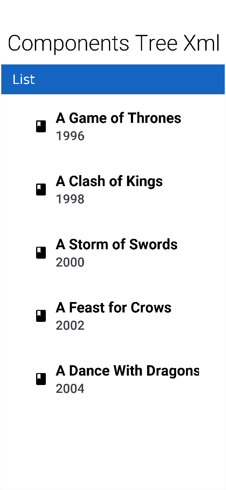

The model for the XML hierarchy is implemented as such:

[source,java]
----
include::../demos/common/src/main/snippets/developer-guide/the-components-of-codename-one.java[tag=the-components-of-codename-one-java-075,indent=0]
----

[[sharebutton-section]]
=== ShareButton

https://www.codenameone.com/javadoc/com/codename1/components/ShareButton.html[ShareButton] is a button you can add into the UI to let a user share an image or block of text.

The `ShareButton` uses a set of predefined share options on the simulator. On Android & iOS the `ShareButton` is mapped to the OS native sharing functionality and can share the image/text with the services configured on the device (for example: Twitter, Facebook etc.).

TIP: Sharing text is trivial but to share an image you need to save it to the https://www.codenameone.com/javadoc/com/codename1/io/FileSystemStorage.html[FileSystemStorage]. Notice that saving to Storage *won't work*!

In the sample code below you take a screenshot which is saved to https://www.codenameone.com/javadoc/com/codename1/io/FileSystemStorage.html[FileSystemStorage] for sharing:

[source,java]
----
include::../demos/common/src/main/snippets/developer-guide/the-components-of-codename-one.java[tag=the-components-of-codename-one-java-076,indent=0]
----

.The share button running on the simulator

IMPORTANT: `ShareButton` behaves differently on the device...

.The share button running on the Android device and screenshot sent into twitter
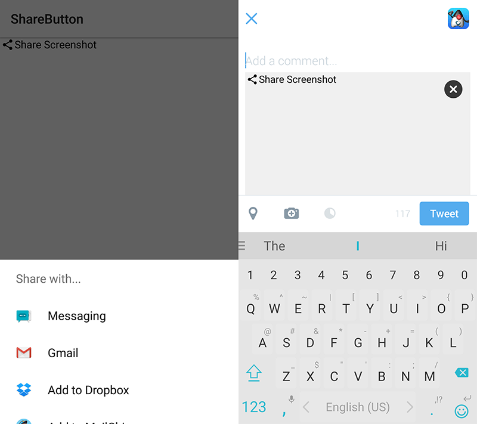

IMPORTANT: The `ShareButton` features some share service classes to allow plugging in more share services. For example, this functionality is relevant to devices where native sharing isn't supported. This code isn't used on iOS/Android...

==== Share Result Callback

The share API can report what the user did with the share sheet. Register a `ShareResultListener` on either `ShareButton` or directly with `Display.share(...)` and you receive a single `ShareResult` describing the outcome:

* `SHARED_TO(packageName)` -- the user picked a destination. `packageName` is the chosen target's identifier: an Android package name (for example, `com.whatsapp`) or, on iOS, a `UIActivityType` such as `com.apple.UIKit.activity.PostToTwitter`. It may be `null` when the platform doesn't expose the selection (for example, older Android, Web Share API).
* `DISMISSED` -- the user cancelled without picking a target. iOS reports this reliably; Android's chooser has no public dismissal signal, so on Android the listener simply doesn't fire on cancel.
* `FAILED` -- the share couldn't be completed. `getError()` may carry a short platform-supplied message.

The listener is always invoked on the EDT, exactly once per share request.

[source,java]
----
include::../demos/common/src/main/snippets/developer-guide/the-components-of-codename-one.java[tag=the-components-of-codename-one-java-077,indent=0]
----

If you call `Display` directly instead of using `ShareButton`, pass the listener as the final argument to the new overload:

[source,java]
----
include::../demos/common/src/main/snippets/developer-guide/the-components-of-codename-one.java[tag=the-components-of-codename-one-java-078,indent=0]
----

When the share is dispatched through the non-native fallback dialog (platforms without `isNativeShareSupported`), the listener still fires: it reports `DISMISSED` when the user picks the Cancel button, and the underlying `ShareService` implementations report `SHARED_TO` once they call `ShareService.finish()`. Custom `ShareService` subclasses can call `deliverResult(ShareResult.failed("..."))` from inside `share(...)` to publish a failure explicitly; otherwise `finish()` falls back to a default `SHARED_TO(commandName)`.

[[ios-share-extension-section]]
=== iOS Share Extension Authoring Helper

An iOS *share extension* is a separate app target that the system shows inside `UIActivityViewController` when the user shares from another app (Safari, Photos, etc.). It runs in a sandboxed process and persists payloads to the host app via an *App Group* shared `NSUserDefaults` suite.

Codename One's build pipeline already wires `.ios.appext` zip archives under `src/main/resources` into the generated Xcode project. The `IOSShareExtensionBuilder` helper generates that archive for you so you don't have to create the extension target in Xcode first.

==== What the helper produces

For a single call the helper writes four files at the root of the extension bundle:

* `Info.plist` -- declares the `NSExtension` dictionary, activation rules (`SupportsText` / `SupportsWebURL` / `SupportsImage`), and the principal class (`ShareViewController`).
* `<ExtensionName>.entitlements` -- declares `com.apple.security.application-groups` with the configured App Group identifier.
* `ShareViewController.swift` -- a `SLComposeServiceViewController` subclass that extracts text / URL / image attachments from `extensionContext`, packs them into a dictionary, and writes that dictionary to `UserDefaults(suiteName: appGroupId)` under the key `cn1.shareExtension.payload`.
* `buildSettings.properties` -- Xcode build setting overrides (deployment target, Swift version, entitlements path, plist path) picked up by the iOS build pipeline.

==== Generating the bundle

Call the builder from a Maven plugin, an Ant task or a one-shot `main`:

[source,java]
----
include::../demos/common/src/main/snippets/developer-guide/the-components-of-codename-one.java[tag=the-components-of-codename-one-java-079,indent=0]
----

The next iOS build picks up the `.ios.appext` archive automatically; no Xcode steps are required.

If you prefer a directory layout (for example, to commit the generated sources or to feed a future `ios/app_extensions/` pipeline) use `writeTo(File)` instead of `writeAppext(File)` -- the file contents are identical.

==== Reading the payload from the host app

The host app reads the most recent payload from the same App Group at startup or when it resumes:

[source,objective-c]
----
include::../demos/common/src/main/snippets/developer-guide/the-components-of-codename-one.m[tag=the-components-of-codename-one-objective-c-001,indent=0]
----

The payload dictionary contains:

* `text` -- the user-composed text (`String`).
* `items` -- an array of `{ kind, value }` dictionaries where `kind` is `"text"`, `"url"` or `"image"`. For images, `value` is a file URL inside the App Group container.
* `timestamp` -- a `Double` UNIX time.

Expose this to your CN1 code via a small native interface and clear the key once handled so the next share is unambiguous.

==== Activation rules and validation

The builder validates its inputs before writing anything:

* `extensionName` must be a non-empty identifier (letters, digits, `_`, `-`). It becomes the Xcode target name and the `.appex` bundle name. The extension's bundle id is set to `<hostBundleId>.<extensionName>` by the iOS build pipeline.
* `appGroupId` must start with `group.` (an Apple requirement). Create the matching App Group in your Apple Developer account and add it to both the host app's and the extension's provisioning profile.
* At least one of `acceptText`, `acceptURLs`, `acceptImages` must be enabled, otherwise iOS will never present your extension.

The default deployment target is iOS 12.0; override with `setDeploymentTarget("13.0")` if you need newer APIs in your customized controller.

==== Customising the generated controller

The generated Swift controller covers the common case (read attachments, persist to App Group, finish the request). If you need bespoke logic -- custom UI, server upload, image transcoding -- treat the helper's output as a starting point: run it once, copy the directory under `ios/app_extensions/MyShareExtension/`, edit `ShareViewController.swift`, and zip it back into `.ios.appext` (or wait for the directory-based pipeline tracked by issue #3427).

NOTE: Provisioning profiles for the extension target aren't generated by the helper. You still need to provision the extension's bundle id (`<hostBundleId>.<extensionName>`) and add the App Group capability to it on the Apple Developer portal, alongside the host app.

=== Tabs

The https://www.codenameone.com/javadoc/com/codename1/ui/Tabs.html[Tabs] `Container` arranges components into groups within "tabbed" containers. `Tabs` is a container type that allows leafing through its children using labeled toggle buttons. The tabs can be placed in many different ways (top, bottom, left or right) with the default being determined by the platform. This class also allows swiping between components to leaf between said tabs (for this purpose the tabs themselves can also be hidden).

Since `Tabs` are a `Container` its a common mistake to try and add a `Tab` using the `add` method. That method won't work since a `Tab` can have both an `Image` and text String associated with it:

[source,java]
----
include::../demos/common/src/main/snippets/developer-guide/the-components-of-codename-one.java[tag=the-components-of-codename-one-java-080,indent=0]
----

.Simple usage of Tabs
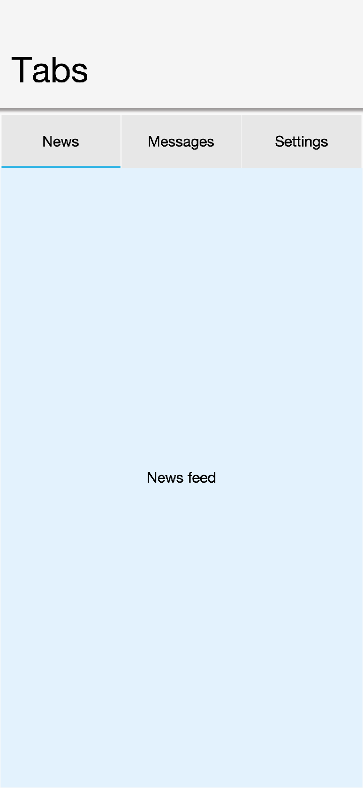

A common usage for `Tabs` is the swipe to proceed effect which is common in iOS applications. In the code below you use https://www.codenameone.com/javadoc/com/codename1/ui/RadioButton.html[RadioButton] and https://www.codenameone.com/javadoc/com/codename1/ui/layouts/LayeredLayout.html[LayeredLayout] with hidden tabs to produce that effect:

[source,java]
----
include::../demos/common/src/main/snippets/developer-guide/the-components-of-codename-one.java[tag=the-components-of-codename-one-java-081,indent=0]
----

.Swipeable Tabs with an iOS carousel effect page 1
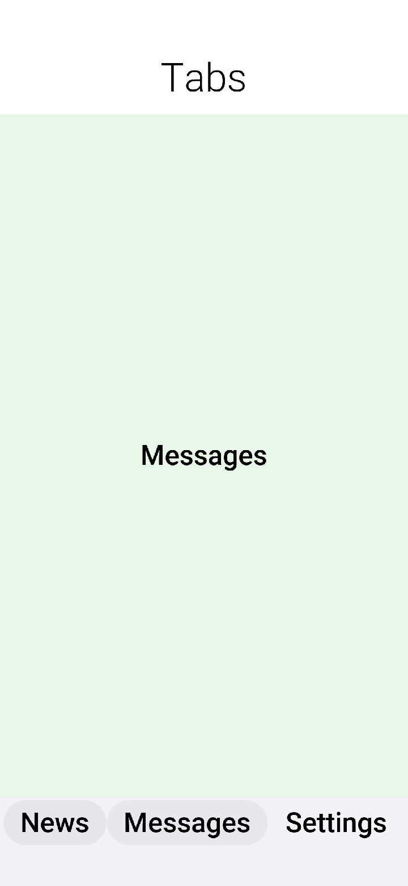

.Swipeable Tabs with an iOS carousel effect page 2
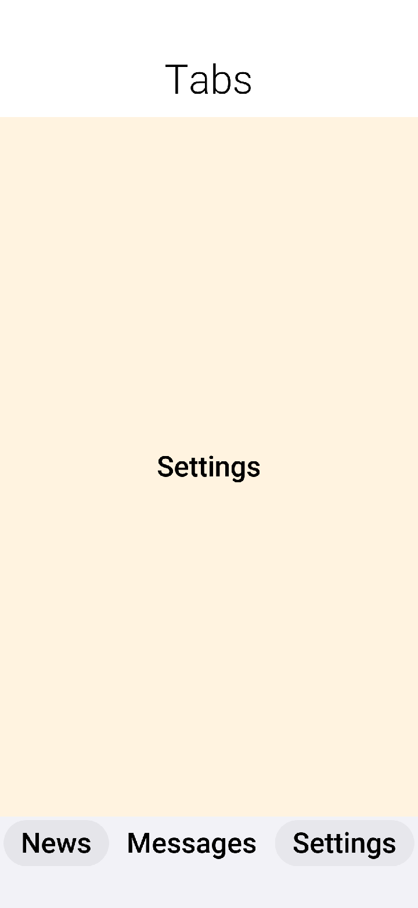

NOTE: Notice that you used `setRadioButtonImages` to explicitly set the radio button images to the look you want for the carousel.

==== Animated tab indicator

Modern Material 3 (`NavigationBar`) and iOS 26 tab bars animate a small
underline between tabs when the user changes selection. `Tabs` ships
this as an opt-in feature gated by the `tabsAnimatedIndicatorBool`
theme constant; the iOS Modern and Android Material themes turn it on
by default, so apps shipping against those themes get the effect for
free.

To enable in a custom theme:

[source,css]
----
include::../demos/common/src/main/snippets/developer-guide/the-components-of-codename-one.css[tag=the-components-of-codename-one-css-001,indent=0]
----

To toggle programmatically (for example, add it to a Tabs instance whose theme
hasn't enabled it):

[source,java]
----
include::../demos/common/src/main/snippets/developer-guide/the-components-of-codename-one.java[tag=the-components-of-codename-one-java-082,indent=0]
----

The indicator animates its `x` / `width` from the previously selected
tab's bounds to the new selection's bounds using a `Motion.createEaseInOutMotion`
over the configured duration (200ms default, matching Material 3's
spec). Rapid double-taps start the animation from the *current
interpolated position* rather than from a stale baseline, so the
indicator chains cleanly.

[[mediamanager-section]]
=== MediaManager & MediaPlayer

// HTML_ONLY_START
IMPORTANT: `MediaPlayer` is a *peer component*, understanding this is crucial if your application depends on such a component. You can learn about peer components and their issues https://www.codenameone.com/manual/advanced-topics.html#native-peer-components[here].
// HTML_ONLY_END
////
//PDF_ONLY
IMPORTANT: `MediaPlayer` is a *peer component*, understanding this is crucial if your application depends on such a component. You can learn about peer components and their issues <<native-peer-components,here>>.
////

The https://www.codenameone.com/javadoc/com/codename1/components/MediaPlayer.html[MediaPlayer] allows you to control video playback. To use the `MediaPlayer` you need to first load the `Media` object from the https://www.codenameone.com/javadoc/com/codename1/media/MediaManager.html[MediaManager].

The `MediaManager` is the core class responsible for media interaction in Codename One.

TIP: You should also check out the https://www.codenameone.com/javadoc/com/codename1/capture/Capture.html[Capture] class for things that aren't covered by the `MediaManager`.

In the demo code below you use the gallery functionality to pick a video from the device's video gallery:

[source,java]
----
include::../demos/common/src/main/snippets/developer-guide/the-components-of-codename-one.java[tag=the-components-of-codename-one-java-083,indent=0]
----

.Video playback running on the simulator
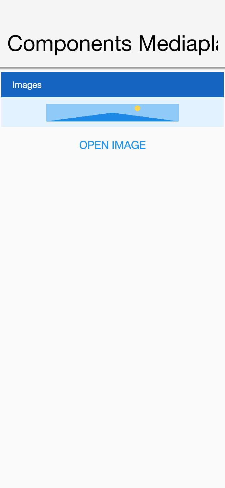

.Video playback running on an Android device. Notice the native playback controls that appear when the video is tapped
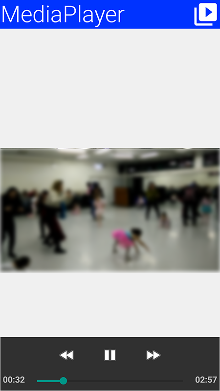

IMPORTANT: Video playback in the simulator will work with JavaFX enabled. This is the default for Java 8 or newer so recommend using that.

=== ImageViewer

The https://www.codenameone.com/javadoc/com/codename1/components/ImageViewer.html[ImageViewer] allows you to inspect, zoom and pan into an image. It also allows swiping between images if
you have a set of images (using an image list model).

IMPORTANT: The `ImageViewer` is a complex rich component designed for user interaction. If you want to display an image use https://www.codenameone.com/javadoc/com/codename1/ui/Label.html[Label] if you want the image to scale seamlessly use https://www.codenameone.com/javadoc/com/codename1/components/ScaleImageLabel.html[ScaleImageLabel].

You can use the `ImageViewer` as a tool to view a single image which allows you to zoom in/out to that image as such:

[source,java]
----
include::../demos/common/src/main/snippets/developer-guide/the-components-of-codename-one.java[tag=the-components-of-codename-one-java-084,indent=0]
----

TIP: You can simulate pinch to zoom on the simulator by dragging the right button away from the top left corner to zoom in and towards the top left corner to zoom out. On Mac touchpads you can drag two fingers to achieve that.

.ImageViewer as the demo loads with the image from the default icon
image::img/components-imageviewer.png[ImageViewer as the demo loads with the image from the default icon,scaledwidth=20%]

.ImageViewer zoomed in
image::img/components-imageviewer-zoomed-in.png[ImageViewer zoomed in,scaledwidth=20%]

You can work with a list of images to produce a swiping effect for the image viewer where you can swipe from one image to the next and also zoom in/out on a specific image:

[source,java]
----
include::../demos/common/src/main/snippets/developer-guide/the-components-of-codename-one.java[tag=the-components-of-codename-one-java-085,indent=0]
----

.An ImageViewer with many elements is indistinguishable from a single ImageViewer except for swipe
image::img/components-imageviewer-multi.png[An ImageViewer with many elements is indistinguishable from a single ImageViewer except for swipe,scaledwidth=20%]

Notice that you use a https://www.codenameone.com/javadoc/com/codename1/ui/list/ListModel.html[ListModel] to allow swiping between images.

`ImageViewer` also supports optional side arrows (material font icons) and an optional thumbnail strip for direct image navigation:

[source,java]
----
include::../demos/common/src/main/snippets/developer-guide/the-components-of-codename-one.java[tag=the-components-of-codename-one-java-086,indent=0]
----

When arrows are enabled, tapping near the left/right edge will move to the previous/next image.
When thumbnails are enabled, tapping a thumbnail jumps directly to that image.

All three options can be configured with theme constants (using the `ImageViewer` UIID prefix):

- `imageviewerNavigationArrowsBool=true|false`
- `imageviewerThumbnailsBool=true|false`
- `imageviewerThumbnailBarHeightMM=<floating point millimeters>`

TIP: `EncodedImage's` aren't always fully loaded and so when you swipe if the images are large you might see delays!

You can dynamically download images directly into the `ImageViewer` with a custom list model like this:

[source,java]
----
include::../demos/common/src/main/snippets/developer-guide/the-components-of-codename-one.java[tag=the-components-of-codename-one-java-087,indent=0]
----

.Dynamically fetching an image URL from the internet footnote:[Image was fetched from http://awoiaf.westeros.org/index.php/Portal:Books]
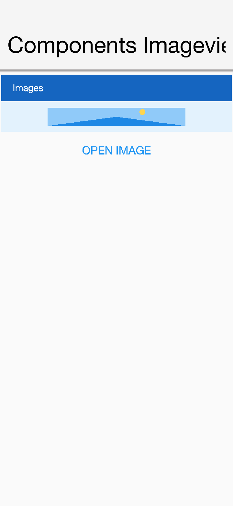

This fetches the images in the URL asynchronously and fires a data change event when the data arrives to automatically refresh the `ImageViewer` when that happens.

=== ScaleImageLabel & ScaleImageButton

https://www.codenameone.com/javadoc/com/codename1/components/ScaleImageLabel.html[ScaleImageLabel] & https://www.codenameone.com/javadoc/com/codename1/components/ScaleImageButton.html[ScaleImageButton] allow you to position an image that will grow/shrink to fit available space. In that sense they differ from <<label-section,Label>> & <<button-section,Button>> which keeps the image at the same size.

TIP: The default UIID of `ScaleImageLabel` is `Label`, but the default UIID of `ScaleImageButton` is `ScaleImageButton`. The reasoning for the difference is that the `Button` UIID includes a border and a lot of legacy.

You can use `ScaleImageLabel`/`ScaleImageButton` interchangeably. The major difference between these components is the buttons ability to handle click events/focus.

Here is a simple example that also shows the difference between the `scale to fill` and `scale to fit` modes:

[source,java]
----
include::../demos/common/src/main/snippets/developer-guide/the-components-of-codename-one.java[tag=the-components-of-codename-one-java-088,indent=0]
----

.ScaleImageLabel/Button, the top row includes scale to fit versions (the default) whereas the bottom row includes the scale to fill versions

WARNING: When styling these components keep in mind that changing attributes such as background behavior might cause an issue with their functionality or might not work.

=== Toolbar

The https://www.codenameone.com/javadoc/com/codename1/ui/Toolbar.html[Toolbar] API provides deep customization of the title bar area with more flexibility for example: placing a https://www.codenameone.com/javadoc/com/codename1/ui/TextField.html[TextField]
for search or buttons in arbitrary title area positions. The `Toolbar` API replicates some native functionality
available on Android/iOS and integrates with features such as the side menu to provide fine grained control over the title area behavior.

The `Toolbar` needs to be installed into the `Form` in order for it to work. You can setup the Toolbar in one of these three ways:

. `form.setToolbar(new Toolbar());` - allows you to activate the `Toolbar` to a specific `Form` and not for the entire application
. `Toolbar.setGlobalToolbar(true);` - enables the `Toolbar` for all the forms in the app
. Theme constant `globalToobarBool` - this is equivalent to `Toolbar.setGlobalToolbar(true);`

The basic functionality of the `Toolbar` includes the ability to add a command to the following 4 places:

- Left side of the title - `addCommandToLeftBar`
- Right side of the title - `addCommandToRightBar`
- Side menu bar (the drawer that opens when you click the icon on the top left or swipe the screen from left to right) - `addCommandToSideMenu`
- Overflow menu (the menu that opens when you tap the 3 vertical dots in the top right corner) - `addCommandToOverflowMenu`

The code below provides a brief overview of these options:

[source,java]
----
include::../demos/common/src/main/snippets/developer-guide/the-components-of-codename-one.java[tag=the-components-of-codename-one-java-089,indent=0]
----

.The Toolbar
image::img/components-toolbar.png[The Toolbar,scaledwidth=25%]

.The default sidemenu of the Toolbar
image::img/components-toolbar-sidemenu.png[The default sidemenu of the Toolbar,scaledwidth=30%]

.The overflow menu of the Toolbar
image::img/components-toolbar-overflow-menu.png[The overflow menu of the Toolbar,scaledwidth=25%]

You can set a title with a `String` but if you would want the component to be a text field or a multi
line label you can use `setTitleComponent(Component)` which allows you to install any component into the
title area.

TIP: The code below demonstrates searching using custom code but the Toolbar also has built-in support for search covered in the next section

The customization of the title area allows for some pretty powerful UI effects for example: the code below allows searching dynamically within a set of entries and uses some neat tricks:

[[Advanced-search-code]]
[source,java]
----
include::../demos/common/src/main/snippets/developer-guide/the-components-of-codename-one.java[tag=the-components-of-codename-one-java-090,indent=0]
----

<1> You use a `TextField` the whole time and style it to make it (and its hint) look like a regular title. An alternative way is to replace the title component dynamically.

<2> You use the `DataChangeListener` to update the search results as you type them.

<3> Hidden & Visible use the opposite flag values to say similar things (for example: when hidden is set to false you would want to set visible to true). +
Visible indicates whether a component can be seen. It will still occupy the physical space on the screen even when it isn't visible. Hidden will remove the space occupied by the component from the screen, but some code might still try to paint it., visible is redundant but you use it with hidden for good measure.

<4> The search button is totally unnecessary here. You can click the `TextField`! +
For example, that isn't intuitive to most users so a button is added to start editing.

.Search field within the toolbar
image::img/components-toolbar-search.png[Search field within the toolbar,scaledwidth=20%]

.Search field after typing a couple of letters
image::img/components-toolbar-search-ongoing.png[Search field after typing a couple of letters,scaledwidth=20%]

==== Search mode

While you can implement search manually, using the built-in search offers a simpler and uniform UI.

.built-in toolbar search functionality
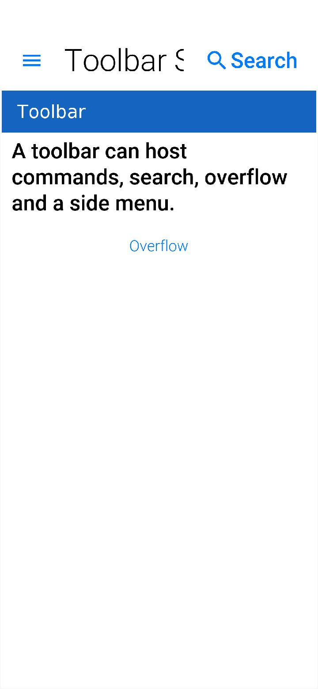

You can customize the appearance of the search bar by using the UIID's: `ToolbarSearch`, `TextFieldSearch` & `TextHintSearch`.

In the sample below you fetch all the contacts from the device and enable search through them, notice it expects and image called `duke.png` which is the default Codename One icon renamed and placed in the src folder:

[source,java]
----
include::../demos/common/src/main/snippets/developer-guide/the-components-of-codename-one.java[tag=the-components-of-codename-one-java-091,indent=0]
----

==== South Component

A common feature in side menu bar is the ability to add a component to the "south" part of the side menu.

Notice that this feature works with the on-top and permanent versions of the side menu and not with the legacy versions:

[source,java]
----
include::../demos/common/src/main/snippets/developer-guide/the-components-of-codename-one.java[tag=the-components-of-codename-one-java-092,indent=0]
----

This places the component below the side menu bar. Notice that this component controls its entire UIID & is separate from the `SideNavigationPanel` UIID so if you set that component you might want to place it within a container that has the `SideNavigationPanel` UIID so it will blend with the rest of the UI.

[[title-animations-section]]
==== Title animations

Modern UI's often animate the title upon scrolling to balance the highly functional smaller title advantage with the gorgeous large image based title. This is pretty easy to do with the Toolbar API through the Title animation API.

The code below shows off an attractive title based on a book by GRRM on top of text footnote:[The text below is from A Wiki of Ice & Fire: http://awoiaf.westeros.org/index.php/A_Game_of_Thrones] that's scrollable. As the text is scrolled the title fades out:

[source,java]
----
include::../demos/common/src/main/snippets/developer-guide/the-components-of-codename-one.java[tag=the-components-of-codename-one-java-093,indent=0]
----

.The Toolbar starts with the large URLImage fetched from the web
image::img/components-toolbar-animation-1.png[The Toolbar starts with the large URLImage fetched from the web,scaledwidth=20%]

.As you scroll down the image fades and the title shrinks in size returning to the default UIID look
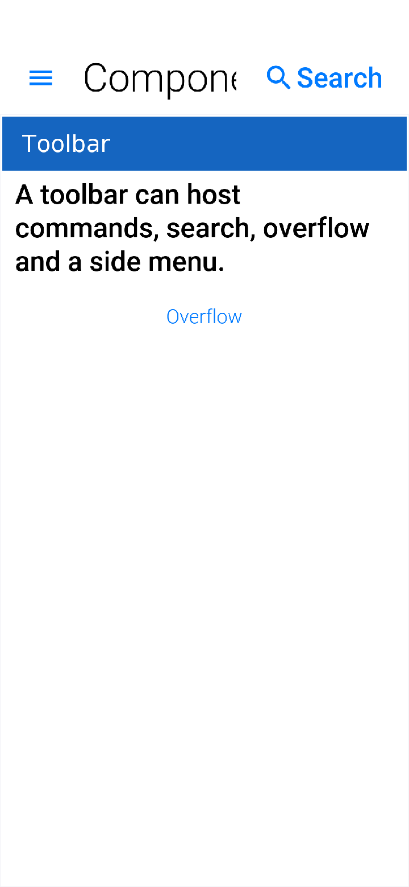

.As scrolling continues the title reaches standard size
image::img/components-toolbar-animation-3.png[As scrolling continues the title reaches standard size,scaledwidth=20%]

Most the code above creates the "look" of the application. The key piece of code above is this:

[source,java]
----
include::../demos/common/src/main/snippets/developer-guide/the-components-of-codename-one.java[tag=the-components-of-codename-one-java-094,indent=0]
----

In the first line you create a style animation that will translate the style from the current settings to the destination UIID (the first argument) within 200 pixels of scrolling. You then bind this animation to the title scrolling animation event.

=== BrowserComponent & WebBrowser

// HTML_ONLY_START
IMPORTANT: `BrowserComponent` is a *peer component*, understanding this is crucial if your application depends on such a component. You can learn about peer components and their issues https://www.codenameone.com/manual/advanced-topics.html#native-peer-components[here].
// HTML_ONLY_END
////
//PDF_ONLY
IMPORTANT: `BrowserComponent` is a *peer component*, understanding this is crucial if your application depends on such a component. You can learn about peer components and their issues <<native-peer-components,here>>.
////

The https://www.codenameone.com/javadoc/com/codename1/components/WebBrowser.html[WebBrowser] component shows the native device web browser when supported by the device and the
https://www.codenameone.com/javadoc/com/codename1/ui/html/HTMLComponent.html[HTMLComponent] when the web browser isn't supported on the given device. If you intend to target smartphones
you should use the https://www.codenameone.com/javadoc/com/codename1/ui/BrowserComponent.html[BrowserComponent] directly instead of the `WebBrowser`.

The `BrowserComponent` can point at an arbitrary URL to load it:

[source,java]
----
include::../demos/common/src/main/snippets/developer-guide/the-components-of-codename-one.java[tag=the-components-of-codename-one-java-095,indent=0]
----

.Browser Component showing the Codename One website on the simulator
image::img/components-browsercomponent.png[Browser Component showing the Codename One website on the simulator,scaledwidth=30%]

NOTE: The scrollbars appear in the simulator, device versions of the browser component act differently and support touch scrolling.

IMPORTANT: A `BrowserComponent` should be in the center of a BorderLayout. Otherwise its preferred size might be zero before the HTML finishes loading/layout in the native layer and layout might be wrong as a result.

You can use `WebBrowser` and `BrowserComponent` interchangeably for most basic usage. For example, if you need access to JavaScript or native browser functionality then there is no use in going through the `WebBrowser` abstraction.

The `BrowserComponent` has full support for executing local web pages from within the jar. The basic support uses the `jar:///` URL as such:

[source,java]
----
include::../demos/common/src/main/snippets/developer-guide/the-components-of-codename-one.java[tag=the-components-of-codename-one-java-096,indent=0]
----

IMPORTANT: On Android a native indicator might show up when the web page is loading. This can be disabled using the `Display.getInstance().setProperty("WebLoadingHidden", "true");` call. You need to invoke this once.

==== Troubleshooting "Failed to create CEF browser" on Linux

In the Simulator, `BrowserComponent` is rendered by the bundled https://bitbucket.org/chromiumembedded/java-cef[CEF] (Chromium Embedded Framework) port. On Linux, `BrowserComponent.isNativeBrowserSupported()` may return `true` and yet creating the component throws `RuntimeException: Failed to create CEF browser`, with a root cause similar to:

[source]
----
java.lang.UnsatisfiedLinkError: .../codenameone-cef-*-linux64.zip-extracted/lib/linux64/libjcef.so:
    .../lib/linux64/libjawt.so: version `SUNWprivate_1.1' not found
    (required by .../lib/linux64/libjcef.so)
----

The native CEF library (`libjcef.so`) is loaded with a sibling `libjawt.so` shipped inside the CEF archive. That copy of `libjawt.so` expects symbols (`SUNWprivate_1.1`) provided by the JDK's own `libjawt.so` and the matching `libjvm.so`. When the JVM running the Simulator doesn't expose those symbols at load time -- typically because the dynamic linker doesn't have the JDK's native library directories on its search path -- the load fails before any browser is created. This is purely a Simulator/desktop concern; the same code runs unchanged on Android and iOS.

The fix is to launch the IDE (and therefore the Simulator JVM) with `JAVA_HOME` and `LD_LIBRARY_PATH` pointing at a supported JDK. For example, on Linux Mint / Ubuntu wrap the IDE startup script:

[source,bash]
----
include::../demos/common/src/main/snippets/developer-guide/the-components-of-codename-one.sh[tag=the-components-of-codename-one-bash-001,indent=0]
----

After relaunching the IDE through this wrapper, `BrowserComponent` instantiation succeeds in the Simulator. Any JDK from 11 through 25 that's supported for running the Simulator works -- the important part is that `LD_LIBRARY_PATH` resolves to that JDK's `lib` and `lib/server` directories so the bundled `libjcef.so` finds a compatible `libjawt`/`libjvm` pair.

TIP: If `BrowserComponent` instantiation fails on Linux, log the environment with `CN.getProperty("java.home", "<unset>")`, `CN.getProperty("JAVA_HOME", "<unset>")` and `CN.getProperty("LD_LIBRARY_PATH", "<unset>")`. An `<unset>` value for `LD_LIBRARY_PATH` while the IDE was launched from a desktop shortcut is the typical fingerprint of this problem -- desktop launchers don't source your shell profile.

NOTE: This issue doesn't affect packaged native applications, only the desktop Simulator running on Linux.

==== BrowserComponent hierarchy

When Codename One packages applications into native apps it hides a lot of details to make the process simpler. One of the things hidden is the fact that you aren't dealing with a JAR anymore, so
`getResource`/`getResourceAsStream` are problematic... Both of these APIs support hierarchies and a concept of package
relativity both of which might not be supported on all OSes.

Codename One has its own getResourceAsSteam in the https://www.codenameone.com/javadoc/com/codename1/ui/Display.html[Display] class and that works fine, but it requires that all files be in the src root directory.

TIP: That's why recommend that you place files inside res files. A resource file allows you to add arbitrary data files and you can have as many resource files as you need.

For web developers this isn't enough since hierarchies are used often to represent the various dependencies, this means that many links & references are relative. To work with such hierarchies place all your resources in a hierarchy under the HTML package in the project source directory (`src/html`). The build server will `tar` the entire content of that package and add an `html.tar` file into the native package. This `tar` is seamlessly extracted on the device when you actually need the resources and with new application versions (not on every launch). Assuming the resources are under the HTML root package they can be displayed with code like this:

[source,java]
----
include::../demos/common/src/main/snippets/developer-guide/the-components-of-codename-one.java[tag=the-components-of-codename-one-java-097,indent=0]
----

Notice that the path is relative to the HTML directory and starts with `/` but inside the HTML files you should use
relative (not absolute) paths.

Also notice that an `IOException` can be thrown due to the process of untarring. Its unlikely to happen but is entirely possible.

==== NavigationCallback

At the core of the `BrowserComponent` you have the https://www.codenameone.com/javadoc/com/codename1/ui/events/BrowserNavigationCallback.html[BrowserNavigationCallback]. It might not seem like the most important interface within the browser but it's the "glue" that allows the JavaScript code to communicate back into the Java layer.

You can bind a `BrowserNavigationCallback` by invoking `setBrowserNavigationCallback` on the `BrowserComponent`. At that point with every navigation within the browser the callback will get invoked.

IMPORTANT: The `shouldNavigate` method from the `BrowserNavigationCallback` is invoked in a native thread and **NOT ON THE EDT**! +
it's crucial that this method returns and that it won't do any changes on the UI.

The `shouldNavigate` indicates to the native code whether navigation should proceed or not. For example: if a user clicks a specific link you might choose to do something in the Java code so you can return false and block the navigation. You can invoke https://www.codenameone.com/javadoc/com/codename1/ui/Display.html#callSerially java.lang.Runnable-[callSerially] to do the actual task in the Java side:

[source,java]
----
include::../demos/common/src/main/snippets/developer-guide/the-components-of-codename-one.java[tag=the-components-of-codename-one-java-098,indent=0]
----

.Before the link is clicked for the "shouldNavigate" call
image::img/components-browsercomponent-callback-before.png[Before the link is clicked for the "shouldNavigate" call,scaledwidth=25%]

.After the link is clicked for the "shouldNavigate" call
image::img/components-browsercomponent-callback-after.png[After the link is clicked for the "shouldNavigate" call,scaledwidth=25%]

NOTE: The JavaScript Bridge is implemented on top of the `BrowserNavigationCallback`.

==== JavaScript

TIP: The JavaScript bridge is sometimes confused with the JavaScript Port. The JavaScript bridge allows you to communicate with JavaScript from Java (and vice versa). The JavaScript port allows you to compile the Codename One application into a JavaScript application that runs in a standard web browser without code changes (think GWT without source changes and with thread support).+
You discuss the JavaScript port further later in the guide.

Codename One 4.0 introduced a new API for interacting with JavaScript in Codename One. This API is part of the `BrowserComponent` class, and effectively replaces the https://www.codenameone.com/javadoc/com/codename1/JavaScript/package-summary.html[com.codename1.JavaScript package], which is now deprecated.

===== What was wrong with the old API

The old API provided a synchronous wrapper around an inherently asynchronous process, and made extensive use of `invokeAndBlock()` underneath the covers. This resulted in a nice API with high-level abstractions that played with a synchronous programming model, but it came with a price-tag in performance, complexity, and predictability. Let’s take a simple example, getting a reference to the "window" object:

[source,java]
----
include::../demos/common/src/main/snippets/developer-guide/the-components-of-codename-one.java[tag=the-components-of-codename-one-java-099,indent=0]
----

This code looks harmless enough, but this is actually expensive. It issues a command to the `BrowserComponent`, and uses `invokeAndBlock()` to wait for the command to go through and send back a response. `invokeAndBlock()` is a magical tool that allows you to "block" without blocking the EDT, but it has its costs, and shouldn’t be overused. Most of the Codename One APIs that use `invokeAndBlock()` show this in their name. For example: `Component.animateLayoutAndWait()`. This provides you the expectation that this call could take some time, and helps to alert you to the underlying cost.

The problem with the `ctx.get("window")` call is that it looks the same as a call to `Map.get(key)`. There’s no sign that this call is expensive and could take time. One call like this probably isn't a big deal, but it doesn't take long before you have dozens or even hundreds of calls like this littered throughout your codebase, and they can be hard to pick out.

===== The new API

The new API fully embraces the asynchronous nature of JavaScript. It uses callbacks instead of return values, and provides convenience wrappers with the appropriate "AndWait()" naming convention to allow for synchronous usage. Let’s look at a simple example:

NOTE: In all the sample code below, you can assume that variables named `bc` represent an instance of https://www.codenameone.com/javadoc/com/codename1/ui/BrowserComponent.html[BrowserComponent]:

[source,java]
----
include::../demos/common/src/main/snippets/developer-guide/the-components-of-codename-one.java[tag=the-components-of-codename-one-java-100,indent=0]
----

This code should output "The result was 7" to the console. It's fully asynchronous, so you can include this code anywhere without worrying about it "bogging down" your code. The full signature of this form of the https://www.codenameone.com/javadoc/com/codename1/ui/BrowserComponent.html#execute-java.lang.String-com.codename1.util.SuccessCallback-[execute()] method is:

[source,java]
----
include::../demos/common/src/main/snippets/developer-guide/the-components-of-codename-one.java[tag=the-components-of-codename-one-java-101,indent=0]
----

The first parameter is a JavaScript expression. This JavaScript *MUST* call either `callback.onSuccess(result)` or `callback.onError(message, errCode)` at some point in order for your callback to be called.

The second parameter is your callback that's executed from the JavaScript side, when `callback.onSuccess(res)` is called. The callback takes a single parameter of type https://www.codenameone.com/javadoc/com/codename1/ui/BrowserComponent.JSRef.html[JSRef] which is a generic wrapper around a JavaScript variable. JSRef has accessors to retrieve the value as some primitive types. For example: `getBoolean()`, `getDouble()`, `getInt()`, `toString()`, and it provides some introspection through the `getType()` method.

NOTE: It's worth noting that the callback method can take a single parameter. If you need to pass many parameters, you may consider including them in a single string which you parse in your callback.

===== Synchronous wrappers

As mentioned before, the new API also provides an `executeAndWait()` wrapper for `execute()` that will work synchronously. It, as its name suggests, uses `invokeAndBlock` under the hood so as not to block the EDT while it's waiting.

For example:

[source, java]
----
include::../demos/common/src/main/snippets/developer-guide/the-components-of-codename-one.java[tag=the-components-of-codename-one-java-102,indent=0]
----

Prints `The result was 7`.

IMPORTANT: When using the `andWait()` variant, it's critical that your JavaScript calls your callback method at some point - otherwise it will block *indefinitely*. You provide variants of executeAndWait() that include a timeout in case you want to hedge against this possibility.

===== Multi-use callbacks

The callbacks you pass to `execute()` and `executeAndWait()` are single-use callbacks. You can’t, for example, store the `callback` variable on the JavaScript side for later use (for example: to respond to a button click event). If you need a "multi-use" callback, you should use the `addJSCallback()` method instead. Its usage looks identical to `execute()`, the difference is that the callback will live on after its first use. For example: Consider the following code:

[source,java]
----
include::../demos/common/src/main/snippets/developer-guide/the-components-of-codename-one.java[tag=the-components-of-codename-one-java-103,indent=0]
----

The above example, assumes that jQuery is loaded in the webpage that you're interacting with, and you're adding a click handler to a button with ID "somebutton." The click handler calls your callback.

If you run this example, the first time the button is clicked, you’ll see "Button was clicked" printed to the console as expected. For example, the 2nd time, you’ll get an exception. This is because the callback passed to `execute()` is single-use.

You need to change this code to use the `addJSCallback()` method as follows:

[source,java]
----
include::../demos/common/src/main/snippets/developer-guide/the-components-of-codename-one.java[tag=the-components-of-codename-one-java-104,indent=0]
----

Now it will work no matter how many times the button is clicked.

===== Passing parameters to JavaScript

Often, the JavaScript expressions that you execute will include parameters from your Java code. Escaping these parameters is tricky at worst, and annoying at best. For example: If you’re passing a string, you need to make sure that it escapes quotes and new lines or it will cause the JavaScript to have a syntax error. You provide variants of `execute()` and https://www.codenameone.com/javadoc/com/codename1/ui/BrowserComponent.html#addJSCallback-java.lang.String-com.codename1.util.SuccessCallback-[addJSCallback()] that allow you to pass your parameters and have them automatically escaped.

For example, suppose you want to pass a string with text to set in a textarea within the webpage. You can do something like:

[source,java]
----
include::../demos/common/src/main/snippets/developer-guide/the-components-of-codename-one.java[tag=the-components-of-codename-one-java-105,indent=0]
----

The gist is that you embed placeholders in the JavaScript expression that are replaced by the corresponding entry in an array of parameters. The `${0}` placeholder is replaced by the first item in the parameters array, the `${1}` placeholder is replaced by the 2nd, etc.

===== Proxy objects

The new API also includes a https://www.codenameone.com/javadoc/com/codename1/ui/BrowserComponent.JSProxy.html[JSProxy] class that encapsulates a JavaScript object simplify the getting and setting of properties on JavaScript objects - and the calling of their methods. It provides essentially three core methods, along with many variants of each to allow for async or synchronous usages, parameters, and timeouts.

For example: You might want to create a proxy for the https://developer.mozilla.org/en-You/docs/Web/API/Window/location[window.location] object so that you can access its properties more from Java:

[source,java]
----
include::../demos/common/src/main/snippets/developer-guide/the-components-of-codename-one.java[tag=the-components-of-codename-one-java-106,indent=0]
----

Then you can retrieve its properties using the `get()` method:

[source,java]
----
include::../demos/common/src/main/snippets/developer-guide/the-components-of-codename-one.java[tag=the-components-of-codename-one-java-107,indent=0]
----

Or synchronously:

[source,java]
----
include::../demos/common/src/main/snippets/developer-guide/the-components-of-codename-one.java[tag=the-components-of-codename-one-java-108,indent=0]
----

You can also set its properties:

[source,java]
----
include::../demos/common/src/main/snippets/developer-guide/the-components-of-codename-one.java[tag=the-components-of-codename-one-java-109,indent=0]
----

And call its methods:

[source,java]
----
include::../demos/common/src/main/snippets/developer-guide/the-components-of-codename-one.java[tag=the-components-of-codename-one-java-110,indent=0]
----

===== Legacy JSObject support

This section describes the now deprecated `JSObject` approach. It's here for reference by developers working with older code. You suggest using the new API when starting a new project.

`BrowserComponent` can communicate with the HTML code using JavaScript calls. For example: you can create HTML like this:

[source,java]
----
include::../demos/common/src/main/snippets/developer-guide/the-components-of-codename-one.java[tag=the-components-of-codename-one-java-111,indent=0]
----

.JavaScript code was invoked to append text into the browser image above
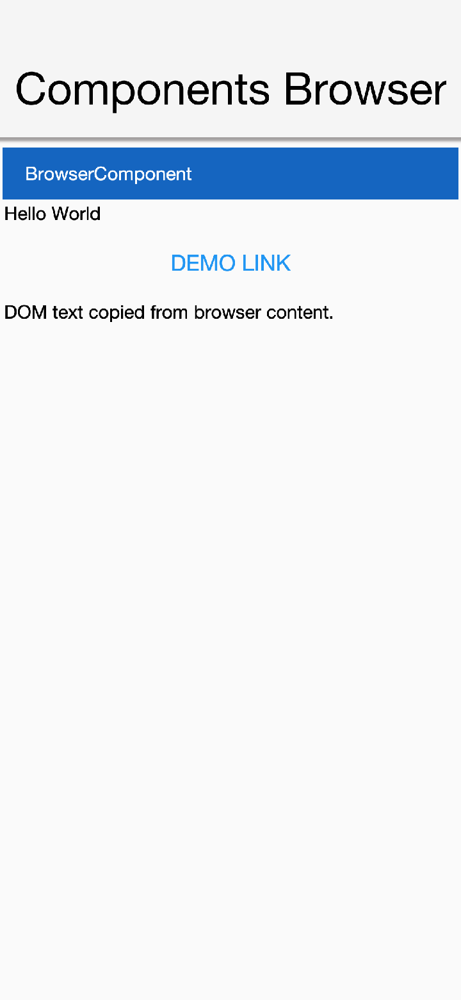

NOTE: Notice that opening an alert in an embedded native browser might not work

You use the `execute` method above to execute custom JavaScript code. You also have an `executeAndReturnString` method that allows you to receive a response value from the JavaScript side.

Coupled with `shouldNavigate` you can effectively do everything which is what the JavaScript Bridge tries to do.

===== The JavaScript bridge

While it's possible to build everything on top of `execute` and `shouldNavigate`, both of these methods have their limits. That's why Codename One introduced the JavaScript package, it allows you to communicate with JavaScript using intuitive code/syntax.

The https://www.codenameone.com/javadoc/com/codename1/JavaScript/JavascriptContext.html[JavascriptContext] class lays the foundation by enabling you to call JavaScript code directly from Java. It provides automatic type conversion between Java and JavaScript types as follows:

.Java to JavaScript
[cols="2*",options="header"]
|====
| Java Type | JavaScript Type
| `String` | `String`
| `Double/Integer/Float/Long` | `Number`
| `Boolean` | `Boolean`
| `JSObject` | `Object`
| `null` | `null`
| `Other` | Not Allowed
|====

.JavaScript to Java
[cols="2*",options="header"]
|====
| JavaScript Type | Java Type
| `String` | `String`
| `Number` | `Double`
| `Boolean` | `Boolean`
| `Object` | `JSObject`
| `Function` | `JSObject`
| `Array` | `JSObject`
| `null` | `null`
| `undefined` | `null`
|====

NOTE: This conversion table is more verbose than necessary, since JavaScript functions and arrays are, in fact Objects themselves, so those rows are redundant. All JavaScript objects are converted to https://www.codenameone.com/javadoc/com/codename1/JavaScript/JSObject.html[JSObject].

You can access JavaScript variables from the context by using code like this:

[source,java]
----
include::../demos/common/src/main/snippets/developer-guide/the-components-of-codename-one.java[tag=the-components-of-codename-one-java-112,indent=0]
----

.The contents were copied from the DOM and placed in the south position of the form
image::img/components-browsercomponent-context.png[The contents were copied from the DOM and placed in the south position of the form,scaledwidth=20%]

Notice that when you work with numeric values or anything related to the types mentioned above your code must be aware of the typing. For example: in this case the type is `Double` and not `String`:

[source,java]
----
include::../demos/common/src/main/snippets/developer-guide/the-components-of-codename-one.java[tag=the-components-of-codename-one-java-113,indent=0]
----

You can also query the context for objects and change their value for example:

[source,java]
----
include::../demos/common/src/main/snippets/developer-guide/the-components-of-codename-one.java[tag=the-components-of-codename-one-java-114,indent=0]
----

This code effectively navigates to the Codename One home page by fetching the DOM's window object and setting its `location` property to https://www.codenameone.com/[https://www.codenameone.com/].

==== Cordova/PhoneGap integration

PhoneGap was one of the first web app packager tools in the market: a tool that's effectively a browser component within a native wrapper coupled with native access APIs, and Cordova is the open source extension of this popular project.

Codename One supports embedding PhoneGap/Cordova applications directly into Codename One applications. This is easy to do with the `BrowserComponent` and JavaScript integration. The main aspect that this integration requires is support for Cordova plugins & its JavaScript APIs.

The effort to integrate Cordova/PhoneGap support into Codename One is handled within an open-source GitHub project https://github.com/codenameone/CN1Cordova[here]. The chief benefits of picking Codename One rather than using Cordova directly are:

- Build Cloud
- Better Native Code Support
- Better Protection Of IP
- IDE Integration Java - JavaScript - HTML
- Easy, doesn't Require A Mac, Automates Certificates/Signing
- Migration To Java

This is discussed further in the https://www.codenameone.com/blog/phonegap-cordova-compatibility-for-codename-one.html[original announcement].

=== RichTextArea

The https://www.codenameone.com/javadoc/com/codename1/ui/RichTextArea.html[RichTextArea] is a visual editor for formatted text (a WYSIWYG / HTML editor). It lets the user select text and apply styling - bold, italic, underline, lists, links, colors, headings - and exchanges the result with your application as HTML. It works on phones and tablets with the on-screen virtual keyboard, and on desktops with a physical keyboard.

`RichTextArea` derives from `AbstractEditorComponent`. By default the editing surface is a `contenteditable` document hosted inside the platform's native web widget (the same one used by `BrowserComponent`), which makes it fully cross-platform and gives correct keyboard, selection and IME behavior on every device. A platform port may transparently replace this with a fully native editing widget without any change to your code.

NOTE: Because the editor is created asynchronously you should treat it like `BrowserComponent`: setters such as `setHtml(String)` are safe to call immediately (they're queued until the editor is ready) while reads such as `getHtml(SuccessCallback)` are asynchronous and deliver their result through a callback.

The following sample places a `RichTextArea` in a form and wires a couple of formatting commands into the `Toolbar`:

[source,java]
----
include::../demos/common/src/main/snippets/developer-guide/the-components-of-codename-one.java[tag=the-components-of-codename-one-java-115,indent=0]
----

.RichTextArea with a formatting toolbar editing styled content
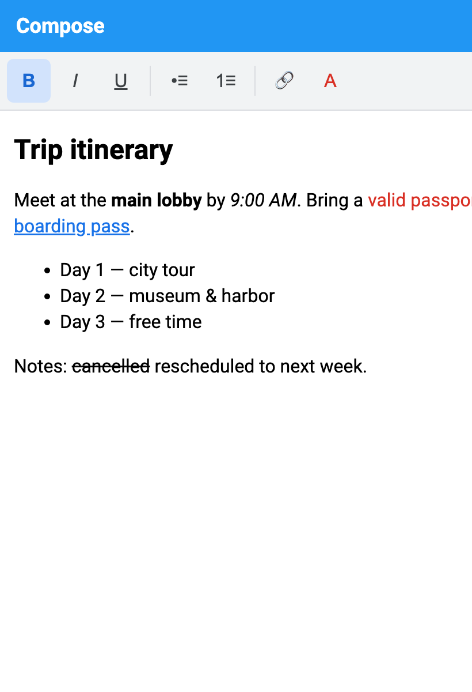

The formatting commands map to the operations you would expect from a word processor and all act on the current selection: `bold()`, `italic()`, `underline()`, `strikeThrough()`, `insertOrderedList()`, `insertUnorderedList()`, `indent()`/`outdent()`, `justifyLeft()`/`justifyCenter()`/`justifyRight()`, `createLink(url)`/`removeLink()`, `setForegroundColor(rgb)`/`setHighlightColor(rgb)`, `setBlockFormat("h1")`, `setFontSize(1..7)`, `removeFormat()`, `undo()` and `redo()`. You can also insert content at the cursor with `insertHtml(String)` and `insertImage(String)`.

TIP: To keep a formatting toolbar in sync with the selection (for example, to highlight the bold button when the caret is inside bold text) register a change listener with `addChangeListener(ActionListener)` and query the active state with `queryCommandState("bold", active -> ...)`.

Reading the edited content is asynchronous:

[source,java]
----
include::../demos/common/src/main/snippets/developer-guide/the-components-of-codename-one.java[tag=the-components-of-codename-one-java-116,indent=0]
----

=== CodeEditor

The https://www.codenameone.com/javadoc/com/codename1/ui/CodeEditor.html[CodeEditor] is an IDE-style source editor with syntax highlighting, a line-number gutter, light/dark themes and asynchronous code completion. Like `RichTextArea` it's designed for both touch devices (with the virtual keyboard) and desktops (with a physical keyboard), and uses the same cross-platform editing backend with an optional native upgrade per platform.

[source,java]
----
include::../demos/common/src/main/snippets/developer-guide/the-components-of-codename-one.java[tag=the-components-of-codename-one-java-117,indent=0]
----

The highlighting language is selected with `setLanguage(String)` and understands common languages such as `java`, `kotlin`, `javascript`, `python`, `css`, `xml`, `json` and `c`. The content is exchanged with `setText(String)` and the asynchronous `getText(SuccessCallback)`, and `setReadOnly(boolean)` turns the editor into a syntax-highlighted code viewer.

.CodeEditor showing Java with the completion popup (light theme)
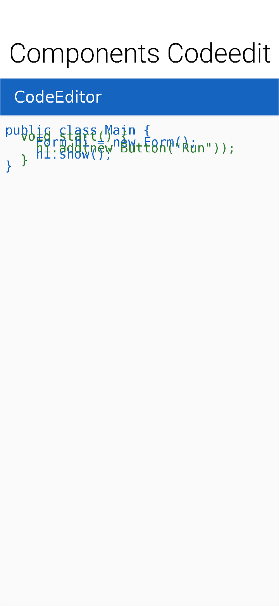

==== Code completion

Code completion is driven by a https://www.codenameone.com/javadoc/com/codename1/ui/CodeCompletionProvider.html[CodeCompletionProvider]. The editor calls the provider as the user types (or when completion is explicitly triggered), passing the full text and the caret offset; the provider returns its proposals asynchronously, which makes it suitable both for fast in-memory completion and for completion backed by a remote language server.

[source,java]
----
include::../demos/common/src/main/snippets/developer-guide/the-components-of-codename-one.java[tag=the-components-of-codename-one-java-118,indent=0]
----

Each https://www.codenameone.com/javadoc/com/codename1/ui/CodeCompletion.html[CodeCompletion] carries the text shown in the popup, the text inserted when it's chosen (which may differ), an optional category used to badge the entry (`"method"`, `"keyword"`, `"class"`, ...) and an optional detail string such as a signature.

The editor honors light and dark themes through `setTheme(String)`:

.CodeEditor in the dark theme
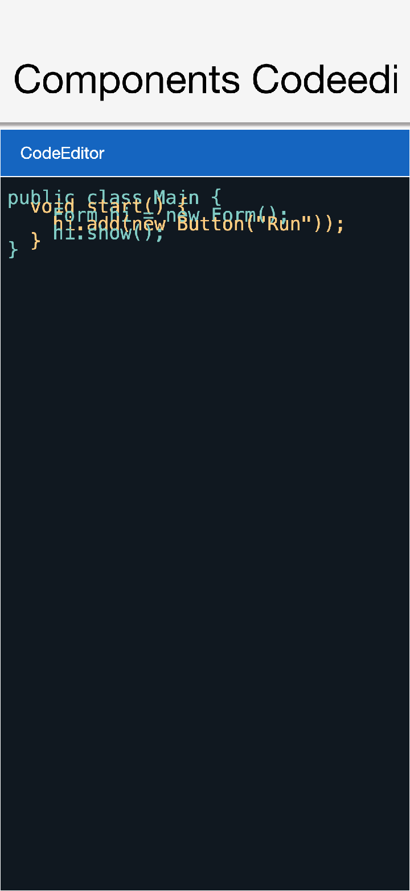

TIP: The built-in editing surface is fully self contained and works offline with no external dependencies. When an app actually references `CodeEditor` the build server can additionally bundle a richer code editor library; apps that don't use `CodeEditor` never pay that cost.

=== AutoCompleteTextField

The https://www.codenameone.com/javadoc/com/codename1/ui/AutoCompleteTextField.html[AutoCompleteTextField] allows you to write text into a text field and select a completion entry from the list in a similar way to a search engine.

This is easy to incorporate into your code, replace your usage of https://www.codenameone.com/javadoc/com/codename1/ui/TextField.html[TextField] with `AutoCompleteTextField` and define the data that the autocomplete should work from. A default implementation accepts a `String` array or a https://www.codenameone.com/javadoc/com/codename1/ui/list/ListModel.html[ListModel] for completion strings, this can work well for a "small" set of thousands (or tens of thousands) of entries.

For example: This is a trivial use case that can work well for smaller sample sizes:

[source,java]
----
include::../demos/common/src/main/snippets/developer-guide/the-components-of-codename-one.java[tag=the-components-of-codename-one-java-119,indent=0]
----

.Autocomplete Text Field
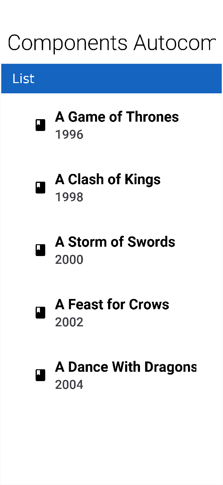

For example, if you wish to query a database or a web service you will need to derive the class and perform more advanced filtering by overriding the `filter` method:

[source,java]
----
include::../demos/common/src/main/snippets/developer-guide/the-components-of-codename-one.java[tag=the-components-of-codename-one-java-120,indent=0]
----

.Autocomplete Text Field with a webservice
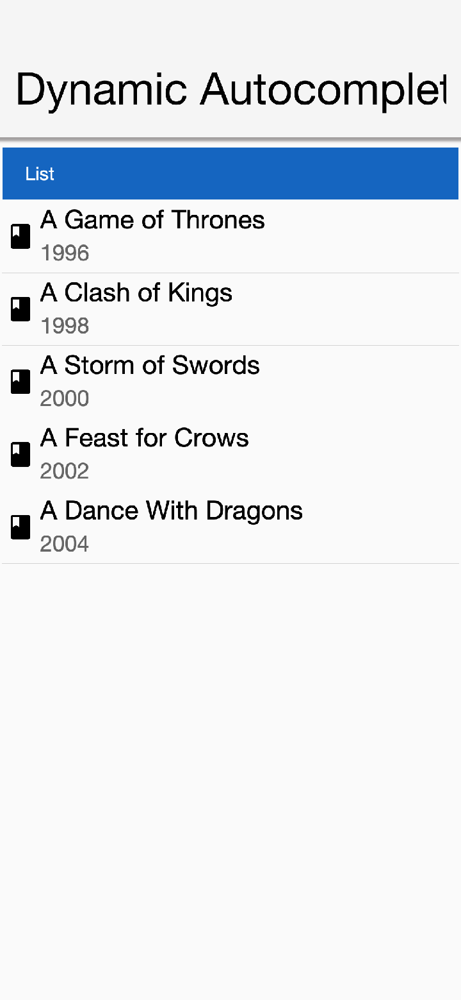

==== Using images in AutoCompleteTextField

One question that comes up frequently is "How do you customize the results of the auto complete field"?

This sounds difficult to most people as you can work with Strings so how do you represent more data or format the date correctly?

The answer is actually pretty simple, you still need to work with Strings because autocomplete is fundamentally a text field. For example, that doesn't preclude your custom renderer from fetching data that might be placed in a different location and associated with the result.

The following source code presents an autocomplete text field with images in the completion popup and two lines for every entry:

[source,java]
----
include::../demos/common/src/main/snippets/developer-guide/the-components-of-codename-one.java[tag=the-components-of-codename-one-java-121,indent=0]
----

<1> you have duplicate arrays that are partial for clarity. This is a separate list of data element but you can fetch the more data from anywhere
<2> You create the renderer UI instantly in the fields with the helper methods for wrapping elements which is pretty cool & terse
<3> In a renderer it's important to always set the value if you don't have a value in place

.Auto complete with images
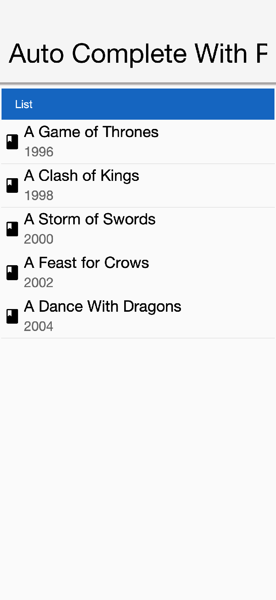

[[picker-section]]
=== Picker

https://www.codenameone.com/javadoc/com/codename1/ui/spinner/Picker.html[Picker] occupies the limbo between native widget and lightweight widget. Picker is more like `TextField`/`TextArea` in the sense that it's a Codename One widget that calls the native code during editing.

The reasoning for this is the highly native UX and functionality related to this widget type which should be obvious from the screenshots below.

At this time there are 4 types of pickers:

- Time
- Date & Time
- Date
- Strings

If a platform doesn't support native pickers an internal fallback implementation is used. This is the implementation you always use in the simulator so assume different behavior when building for the device.

TIP: While Android supports Date, Time native pickers it doesn't support the Date & Time native picker UX and will fall back in that case.

The sample below includes al picker types:

[source,java]
----
include::../demos/common/src/main/snippets/developer-guide/the-components-of-codename-one.java[tag=the-components-of-codename-one-java-122,indent=0]
----

.The various picker components
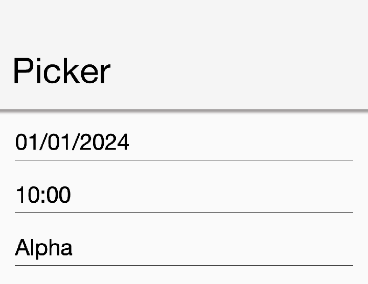

.The date & time picker on the simulator
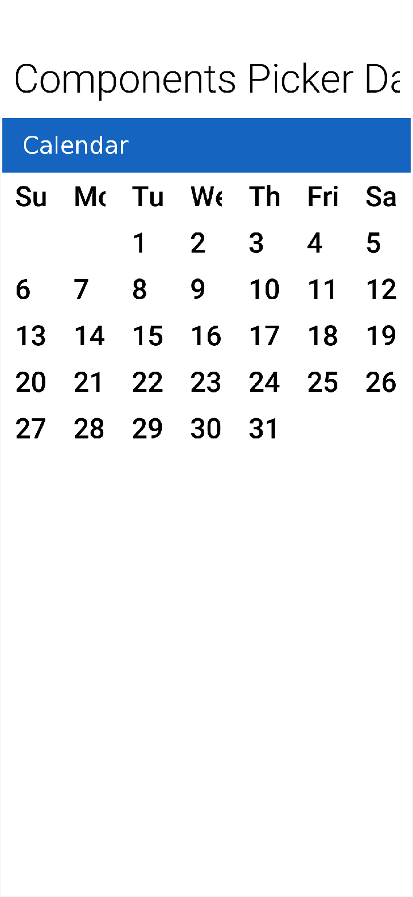

.The date picker component on the Android device
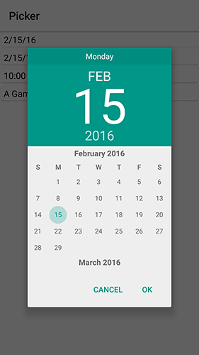

.Date & time picker on Android. Notice it didn't use a built-in widget since there is none
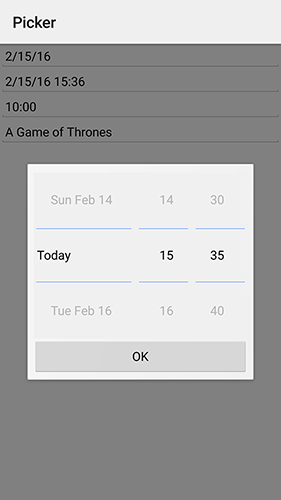

.String picker on the native Android device
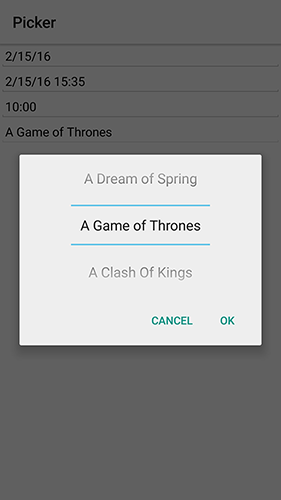

.Time picker on the Android device
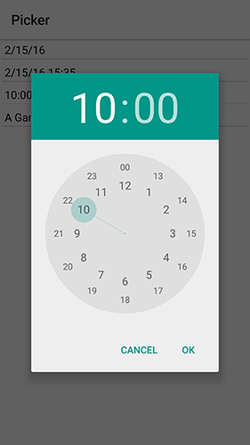

.Duration picker on Android device
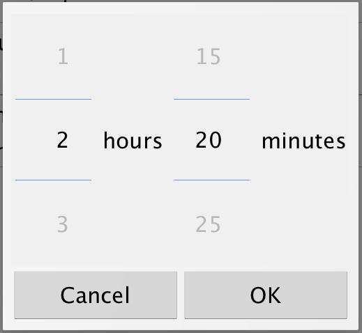

.Hours Duration picker on Android device
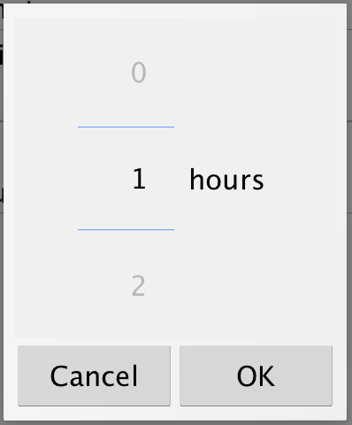

.Minutes Duration picker on Android device
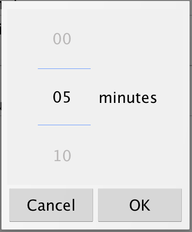

The text displayed by the picker on selection is generated automatically by the `updateValue()` method. You can override it to display a custom formatted value and call `setText(String)` with the correct display string.

A common use case is to format date values based on a specific appearance and `Picker` has built-in support for a custom display formatter. Just use the `setFormatter(SimpleDateFormat)` method and set the appearance for the field.

When using lightweight picker mode (`setUseLightweightPopup(true)`), you can add custom quick-action buttons to the popup. This is useful for actions like setting the date to "Today" or "+7 Days" without scrolling the wheels manually:

[source,java]
----
include::../demos/common/src/main/snippets/developer-guide/the-components-of-codename-one.java[tag=the-components-of-codename-one-java-123,indent=0]
----

Button placement options are:

- `Picker.LightweightPopupButtonPlacement.BETWEEN_CANCEL_AND_DONE` (default)
- `Picker.LightweightPopupButtonPlacement.ABOVE_SPINNER`
- `Picker.LightweightPopupButtonPlacement.BELOW_SPINNER`

=== SwipeableContainer

The https://www.codenameone.com/javadoc/com/codename1/ui/SwipeableContainer.html[SwipeableContainer] allows you to place a component such as a https://www.codenameone.com/javadoc/com/codename1/components/MultiButton.html[MultiButton] on top of more "options"
that can be exposed by swiping the component to the side.

This swipe gesture is commonly used in touch interfaces to expose features such as delete, edit etc. It's trivial to use this component by determining the components placed on top and bottom (the revealed component):

[source,java]
----
include::../demos/common/src/main/snippets/developer-guide/the-components-of-codename-one.java[tag=the-components-of-codename-one-java-124,indent=0]
----

You can combine some demos above including the <<slider-stars-demo,Slider stars demo>> to rank GRRM's books in an interactive way:

[source,java]
----
include::../demos/common/src/main/snippets/developer-guide/the-components-of-codename-one.java[tag=the-components-of-codename-one-java-125,indent=0]
----

.SwipableContainer showing a common use case of ranking on swipe
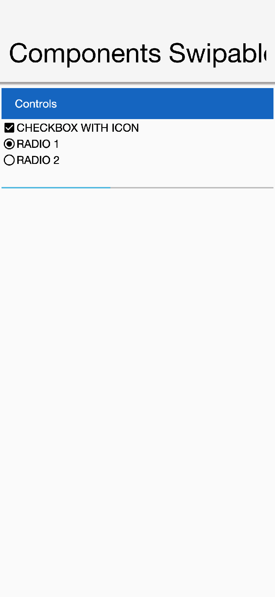

=== EmbeddedContainer

https://www.codenameone.com/javadoc/com/codename1/ui/util/EmbeddedContainer.html[EmbeddedContainer] solves a problem that exists within the GUI builder and the class makes no sense outside of the context of the GUI builder.
The necessity for `EmbeddedContainer` came about due to iPhone inspired designs that relied on tabs (iPhone style tabs at the bottom of the screen) where different features of the application are within a different tab.

This didn't mesh well with the GUI builder navigation logic and so it needed a rethink. The aim was to reuse GUI as much as possible while still enjoying the advantage of navigation being managed for you.

Android does this with Activities and the iPhone itself has a view controller, both approaches are problematic for Codename One. The problem is that you have what's effectively two incompatible hierarchies to mix and match.

The Component/Container hierarchy is powerful enough to represent such a UI but you needed a "marker" to show to the https://www.codenameone.com/javadoc/com/codename1/ui/util/UIBuilder.html[UIBuilder] where a "root" component exists so navigation occurs within the given "root." Here `EmbeddedContainer` comes into play, its a simple container that can contain another GUI from the GUI builder. Nothing else. You can place it in any form of UI and effectively have the UI change appropriately and navigation would default to "sensible values."

Navigation replaces the content of the embedded container; it finds the embedded container based on the component that broadcast the event. If you want to navigate manually use the showContainer() method which accepts a component, you can give any component that's under the `EmbeddedContainer` you want to replace and Codename One will be smart enough to replace that component.

The nice part about using the `EmbeddedContainer` is that the resulting UI can be refactored to provide a more traditional form based UI without duplicating effort and can be adapted to a more tablet oriented UI (with a sidebar) again without much effort.

=== MapComponent

IMPORTANT: The MapComponent uses a somewhat outdated tiling API which isn't as rich as modern native maps. Recommend using the https://github.com/codenameone/codenameone-google-maps/[GoogleMap's Native cn1lib] to integrate native mapping functionality into the Codename One app.

The https://www.codenameone.com/javadoc/com/codename1/maps/MapComponent.html[MapComponent] uses the OpenStreetMap webservice by default to display a navigatable map.

The code was contributed by Roman Kamyk and was originally used for a LWUIT application.

.Map Component
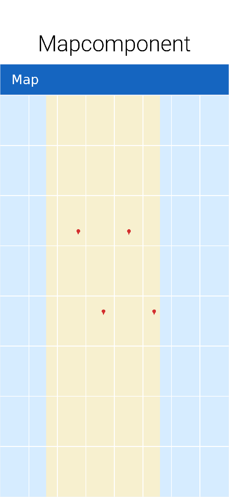

The screenshot above was produced using the following code:

[source,java]
----
include::../demos/common/src/main/snippets/developer-guide/the-components-of-codename-one.java[tag=the-components-of-codename-one-java-126,indent=0]
----

The example below shows how to integrate the https://www.codenameone.com/javadoc/com/codename1/maps/MapComponent.html[MapComponent] with the Google https://www.codenameone.com/javadoc/com/codename1/location/Location.html[Location] API.
Make sure to get your secret API key from the Google https://www.codenameone.com/javadoc/com/codename1/location/Location.html[Location] data API at:
https://developers.google.com/maps/documentation/places/

.MapComponent with Google Location API
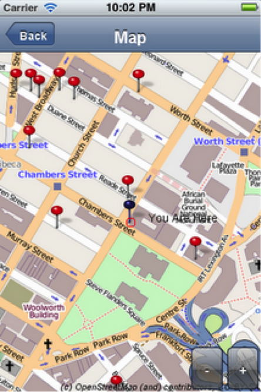

[source,java]
----
include::../demos/common/src/main/snippets/developer-guide/the-components-of-codename-one.java[tag=the-components-of-codename-one-java-127,indent=0]
----

=== Chart Component

The `charts` package enables Codename One developers to add charts and visualizations to their apps without
having to include external libraries or embedding web views. You also wanted to harness the new features in the
graphics pipeline to maximize performance.

==== Device support

Since the charts package makes use of 2D transformations and shapes, it requires some graphics
features that aren't yet available on all platforms. The following platforms are supported:

1. Simulator
2. Android
3. iOS

==== Features

1. **Built-in support for many common types of charts** including bar charts, line charts, stacked charts, scatter
charts, pie charts and more.
2. **Pinch Zoom** - The https://www.codenameone.com/javadoc/com/codename1/charts/ChartComponent.html[ChartComponent] class includes optional pinch zoom support.
3. **Panning Support** - The https://www.codenameone.com/javadoc/com/codename1/charts/ChartComponent.html[ChartComponent] class includes optional support for panning.

==== Chart types

The `com.codename1.charts` package includes models and renderers for many different types of charts. It's also
extensible so that you can add your own chart types if required. The following screenshots show a small
sampling of the types of charts that can be created.

.Line Charts
[float="left"]

.Cubic Line Charts
[float="right"]
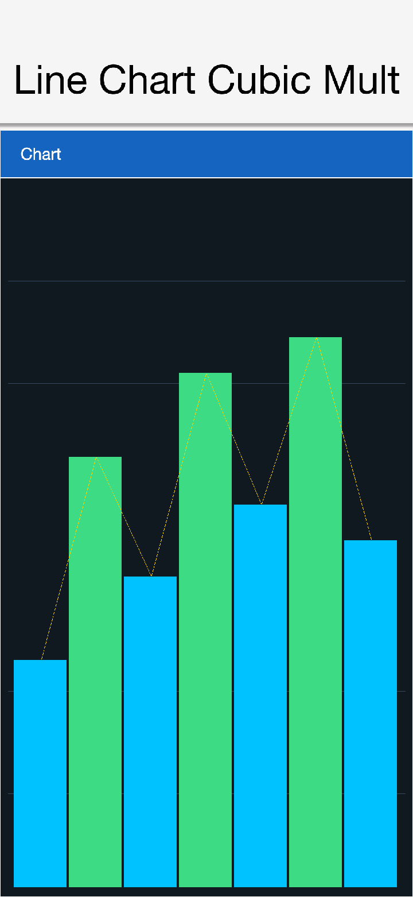
.Bar Charts
[float="left"]
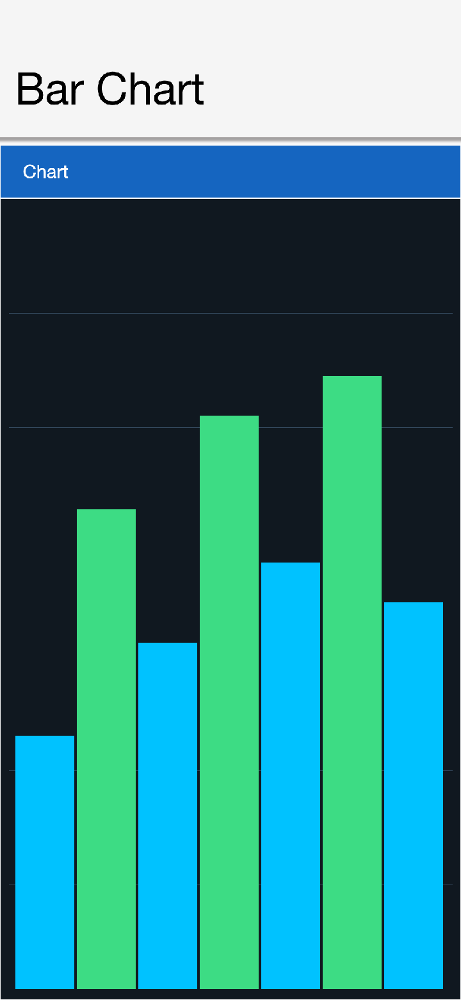
.Stacked Bar Charts
[float="right"]
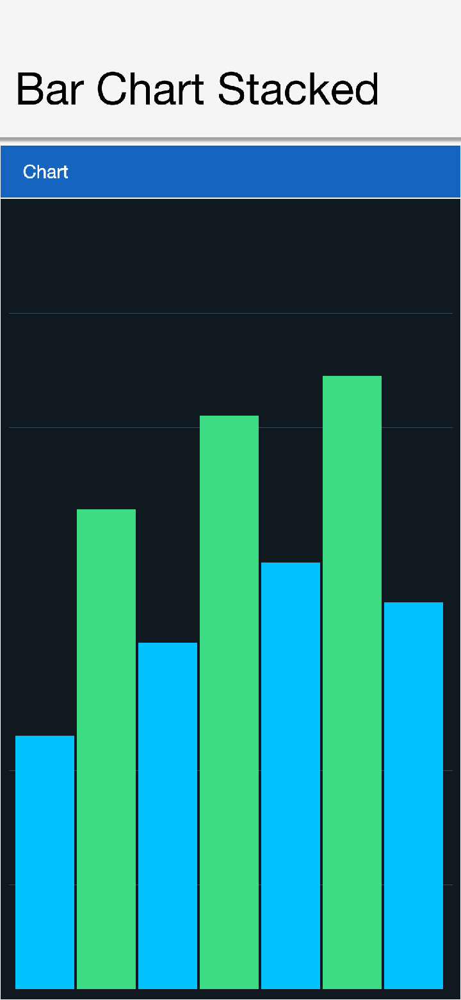
.Range Bar Charts
[float="left"]

.Pie Charts
[float="right",scaledwidth=15%]
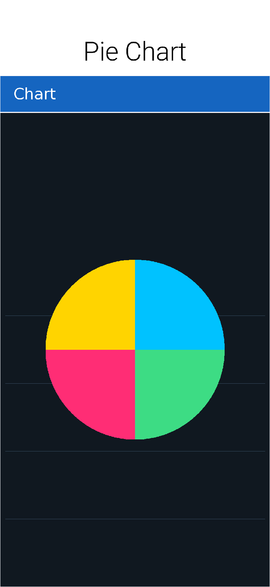
.Doughnut Charts
[float="left"]
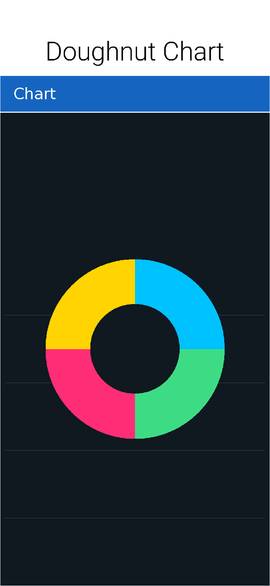
.Scatter Charts
[float="right",scaledwidth=15%]
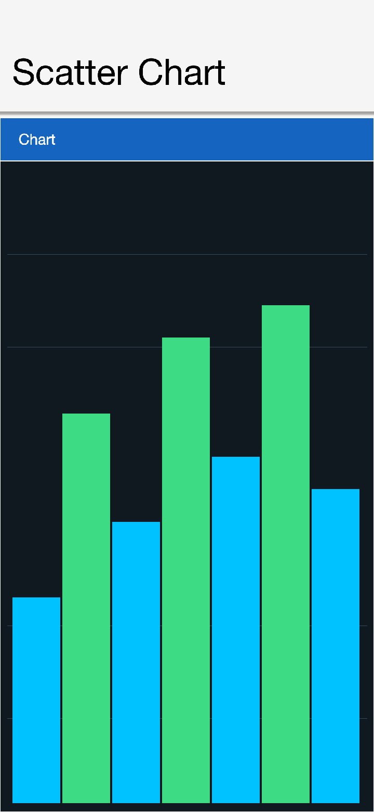
.Dial Charts
[float="left",scaledwidth=15%]
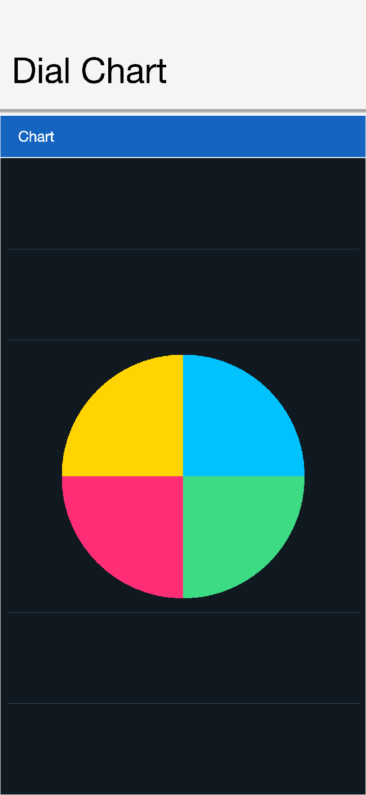
.Combined Charts
[float="right"]
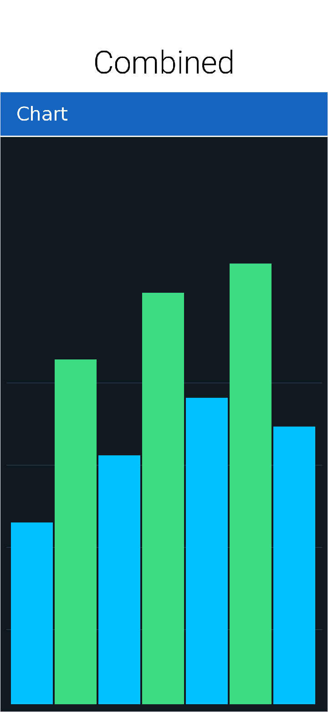
.Bubble Charts
[float="left",scaledwidth=15%]

.Time Charts
[float="right",scaledwidth=15%]

NOTE: The above screenshots were taken from the
https://github.com/codenameone/codenameone-demos/tree/master/ChartsDemo[ChartsDemo app].
You can start playing with this app by checking it out from your git repository.

==== How to create a chart

Adding a chart to your app involves four steps:

1. **Build the model**. You can construct a model (aka data set) for the chart using one of the existing model
classes in the `com.codename1.charts.models` package. Essentially, this is where you add the data that you
want to display.
2. **Set up a renderer**. You can create a renderer for your chart using one of the existing renderer classes in
the `com.codename1.charts.renderers` package. The renderer allows you to specify how the chart should look.
For example: the colors, fonts, styles, to use.
3. **Create the Chart View**. Use one of the existing _view_ classes in the `com.codename1.charts.views` package.
4. **Create a https://www.codenameone.com/javadoc/com/codename1/charts/ChartComponent.html[ChartComponent]**. To add your chart to the UI, you need to wrap it in a https://www.codenameone.com/javadoc/com/codename1/charts/ChartComponent.html[ChartComponent] object.

You can check out the https://github.com/codenameone/codenameone-demos/tree/master/ChartsDemo[ChartsDemo]
app for specific examples, but here is a high-level view of some code that creates a Pie Chart:

[source,java]
----
include::../demos/common/src/main/snippets/developer-guide/the-components-of-codename-one.java[tag=the-components-of-codename-one-java-128,indent=0]
----

=== Calendar

The https://www.codenameone.com/javadoc/com/codename1/ui/Calendar.html[Calendar] class allows you to display a traditional calendar picker and optionally highlight days in various ways.

NOTE: You recommend developers use the <<picker-section,Picker UI>> rather than use the calendar to pick a date. It looks better on the devices.

Simple usage of the `Calendar` class looks something like this:

[source,java]
----
include::../demos/common/src/main/snippets/developer-guide/the-components-of-codename-one.java[tag=the-components-of-codename-one-java-129,indent=0]
----

.The Calendar component
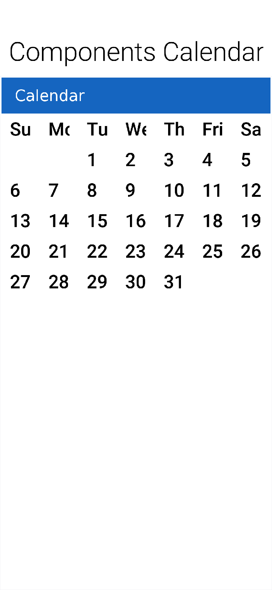

=== ToastBar

The https://www.codenameone.com/javadoc/com/codename1/components/ToastBar.html[ToastBar] class allows you to display none-obtrusive status messages to the user at the bottom of the screen. This is useful for such things as informing the user of a long-running task (like downloading a file in the background), or popping up an error message that doesn't require a response from the user.

Simple usage of the `ToastBar` class looks something like this:

[source,java]
----
include::../demos/common/src/main/snippets/developer-guide/the-components-of-codename-one.java[tag=the-components-of-codename-one-java-130,indent=0]
----

.ToastBar with message
image::img/components-statusbar-message.png[ToastBar with message,scaledwidth=20%]

You can show a progress indicator in the ToastBar like this:

[source,java]
----
include::../demos/common/src/main/snippets/developer-guide/the-components-of-codename-one.java[tag=the-components-of-codename-one-java-131,indent=0]
----

.Status Message with Progress Bar
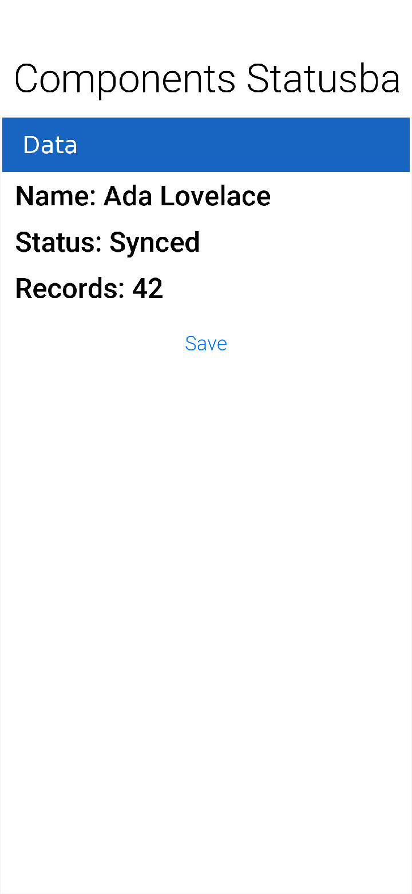

You can automatically clear a status message/progress after a timeout using the `setExpires` method as such:

[source,java]
----
include::../demos/common/src/main/snippets/developer-guide/the-components-of-codename-one.java[tag=the-components-of-codename-one-java-132,indent=0]
----

You can also delay the showing of the status message using `showDelayed` as such:

[source,java]
----
include::../demos/common/src/main/snippets/developer-guide/the-components-of-codename-one.java[tag=the-components-of-codename-one-java-133,indent=0]
----

.ToastBar with a multiline message
image::img/components-statusbar-multiline.png[ToastBar with a multiline message,scaledwidth=20%]

==== Actions in ToastBar

Probably the best usage example for actions in toast is in the gmail style undo. If you aren't a gmail user then the gmail app essentially never prompts for confirmation!

It does whatever you ask and pops a "toast message" with an option to undo. If you clicked by mistake you have 3-4 seconds to take that back.

This simple example shows you how you can undo any addition to the UI in a similar way to gmail:

[source,java]
----
include::../demos/common/src/main/snippets/developer-guide/the-components-of-codename-one.java[tag=the-components-of-codename-one-java-134,indent=0]
----

=== SignatureComponent

The https://www.codenameone.com/javadoc/com/codename1/components/SignatureComponent.html[SignatureComponent] provides a widget that allows users to draw their signature in the app.

Simple usage of the `SignatureComponent` class looks like:

[source,java]
----
include::../demos/common/src/main/snippets/developer-guide/the-components-of-codename-one.java[tag=the-components-of-codename-one-java-135,indent=0]
----

.The signature Component
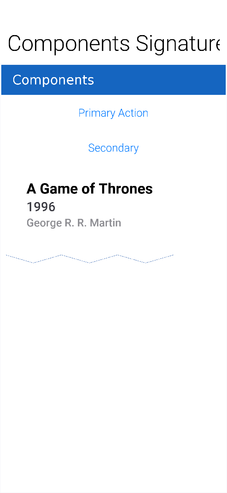

=== Accordion

The https://www.codenameone.com/javadoc/com/codename1/components/Accordion.html[Accordion] displays collapsible content panels.

Simple usage of the `Accordion` class looks like:

[source,java]
----
include::../demos/common/src/main/snippets/developer-guide/the-components-of-codename-one.java[tag=the-components-of-codename-one-java-136,indent=0]
----

.The Accordion Component
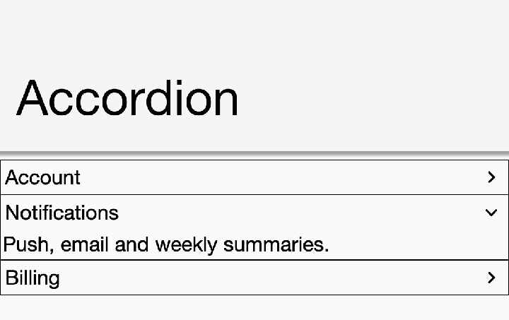

=== Floating hint

https://www.codenameone.com/javadoc/com/codename1/components/FloatingHint.html[FloatingHint] wraps a text component with a special container that can animate the hint label into a title label when the text component is edited or has content within it:

[source,java]
----
include::../demos/common/src/main/snippets/developer-guide/the-components-of-codename-one.java[tag=the-components-of-codename-one-java-137,indent=0]
----

.The FloatingHint component with one component that contains text and another that doesn't
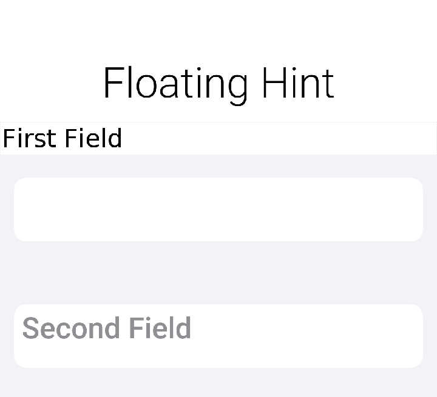

=== Floating Button

The material design floating action button is a powerful tool for promoting an action within your application.

https://www.codenameone.com/javadoc/com/codename1/components/FloatingActionButton.html[FloatingActionButton] is a round button that resides on top of the UI typically in the bottom right-hand side. +
It has a drop shadow to distinguish it from the UI underneath and it can hide two or more actions under the surface. For example: you can create a simple single click button such as this:

[source,java]
----
include::../demos/common/src/main/snippets/developer-guide/the-components-of-codename-one.java[tag=the-components-of-codename-one-java-138,indent=0]
----

Which will place a `+` sign button that will perform the action. Or you can create a nested action
where a click on the button will produce a submenu for users to pick from for example:

[source,java]
----
include::../demos/common/src/main/snippets/developer-guide/the-components-of-codename-one.java[tag=the-components-of-codename-one-java-139,indent=0]
----

.FloatingActionButton with submenu expanded
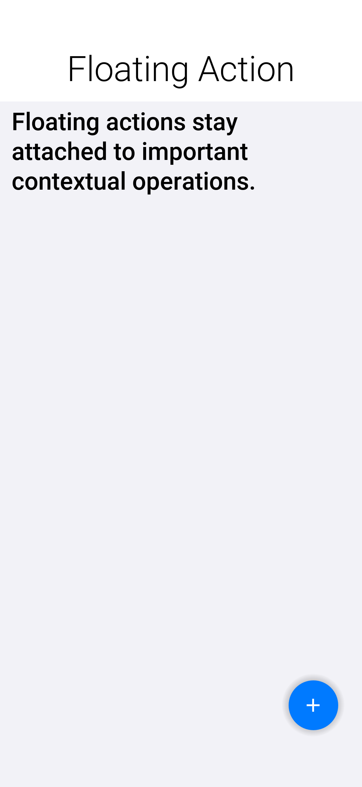

Those familiar with this widget know that there are many nuances to this UI that may be implemented/exposed in the future. The current API is intentionally simple and minimal for the common use cases, with the plan to refine it based on feedback.

==== Using floating Button as a badge

Floating buttons can also be used to badge an arbitrary component in the style popularized by iOS/macOS. A badge appears in the top right corner and includes special numeric details such as `unread count.`.

The code below adds a simple badge to an icon button:

[source,java]
----
include::../demos/common/src/main/snippets/developer-guide/the-components-of-codename-one.java[tag=the-components-of-codename-one-java-140,indent=0]
----

The code above results in this, notice you can type into the text field to change the badge value:

.Badge floating button in action
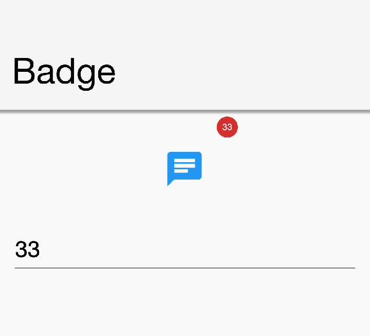

=== SplitPane

The split pane component is a bit desktop specific but works reasonably well on devices. To get the image below you changed `SalesDemo.java` in the kitchen sink by changing this:

[source,java]
----
include::../demos/common/src/main/snippets/developer-guide/the-components-of-codename-one.java[tag=the-components-of-codename-one-java-141,indent=0]
----

To:

[source,java]
----
include::../demos/common/src/main/snippets/developer-guide/the-components-of-codename-one.java[tag=the-components-of-codename-one-java-142,indent=0]
----

.Split Pane in the Kitchen Sink Demo
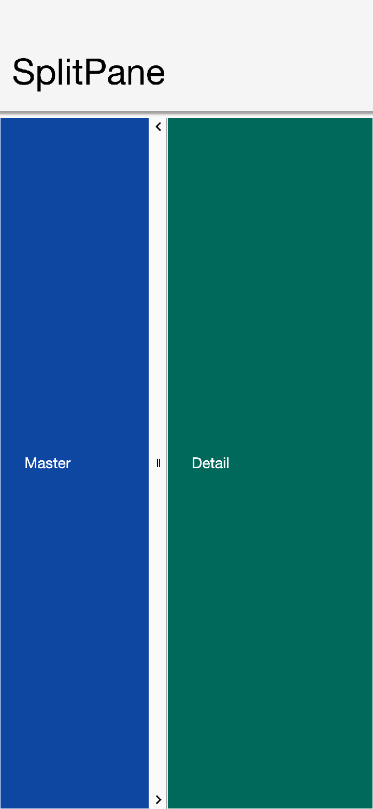

This is self-explanatory but "mostly." you have 5 arguments the first 3 make sense:

- Split orientation
- Components to split

The last 3 arguments seem weird but they also make sense once you understand them, they're:

- The least position of the split - 1/4 of available space
- The default position of the split - middle of the screen
- The most position of the split - 3/4 of available space

The units don't have to be percentages they can be mm (millimeters) or px (pixels).
