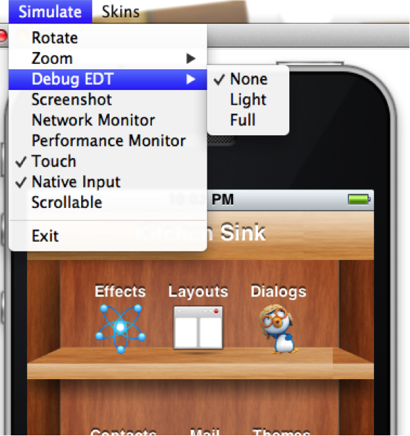

== The EDT - event dispatch thread

[[edt-section]]
=== What is the EDT

Codename One allows developers to create as many threads as they want; but to interact with the Codename One user interface components a developer must use the EDT. The EDT stands for "Event Dispatch Thread" but it handles a lot more than "events."

The EDT is the main thread of Codename One, by using one thread Codename One can avoid complex synchronization code and focus on simple functionality that assumes one thread.

TIP: This has huge advantages for your code. You can assume that all code will occur on a single thread and avoid complex synchronization logic.

You can visualize the EDT as a loop such as this:

[source,java]
----
while(codenameOneRunning) {
     performEventCallbacks();
     performCallSeriallyCalls();
     drawGraphicsAndAnimations();
     sleepUntilNextEDTCycle();
}
----

Normally, every call you receive from Codename One will occur on the EDT. For example, every event, calls to paint(), lifecycle calls (start etc.) should all occur on the EDT.

This is pretty powerful, but it means that as long as your code is processing nothing else can happen in Codename One!

IMPORTANT: **If your code takes too long to execute then no painting or event processing will occur during that time, so a call to `Thread.sleep()` will actually stop everything!**

The solution is pretty simple, if you need to perform something that requires intensive CPU you can spawn a thread.

Codename One’s networking code automatically spawns its own network thread (see the https://www.codenameone.com/javadoc/com/codename1/io/NetworkManager.html[NetworkManager]). But, this also poses a problem...

Codename One assumes all modifications to the UI
are performed on the EDT but if you spawned a separate thread. How do you force your modifications back into the EDT?

Codename One includes helper methods in the https://www.codenameone.com/javadoc/com/codename1/ui/Display.html[Display] class to help in these situations: `isEDT()`, `callSerially(Runnable)`, `callSeriallyOnIdle(Runnable)`, and `callSeriallyAndWait(Runnable)` (with an optional timeout overload).

`isEDT()` is useful for generic code that needs to test whether the current code is executing on the EDT.

=== Call serially (and wait)

`callSerially(Runnable)` should be called off the EDT (in a separate thread), the run method within the submitted runnable will be invoked on the EDT.

IMPORTANT: The Runnable passed to the `callSerially` and `callSeriallyAndWait` methods isn't a `Thread`. use the `Runnable` interface as a convenient callback interface.

[source,java]
----
// this code is executing in a separate thread
final String res = methodThatTakesALongTime();
Display.getInstance().callSerially(new Runnable() {
     public void run() {
          // this occurs on the EDT so I can make changes to UI components
          resultLabel.setText(res);
     }
});
----

TIP: You can write this code more concisely using Java 8 lambda code as such:

[source,java]
----
// this code is executing in a separate thread
String res = methodThatTakesALongTime();
Display.getInstance().callSerially(() -> resultLabel.setText(res));
----

This allows code to leave the EDT and then later on return to it to perform things within the EDT.

The `callSeriallyAndWait(Runnable)` method blocks the current thread until the method completes, this is useful for cases such as user notification e.g.:

[source,java]
----
// this code is executing in a separate thread
methodThatTakesALongTime();
Display.getInstance().callSeriallyAndWait(() -> {
  // this occurs on the EDT so I can make changes to UI components
  globalFlag = Dialog.show("Are You Sure?", "Do you want to continue?", "Continue", "Stop");
});
// this code is executing the separate thread
// global flag was already set by the call above
if(!globalFlag) {
   return;
}
otherMethod();
----

TIP: If you're unsure use `callSerially`. The use cases for `callSeriallyAndWait` are rare. When you do need to wait, the overload that accepts a timeout lets background threads marshal results back to the EDT without risking an indefinite stall if the EDT is busy.

If the work you're posting back to the EDT is expensive and can wait until the UI finishes its current pass, use `callSeriallyOnIdle()`. This queues the runnable for execution after the EDT completes painting, animations, and any other queued tasks. Deferring longer tasks to the idle queue helps avoid starving animations and transitions when bursts of background callbacks arrive together.

==== Callserially on the EDT

One of the misunderstood topics is why would you ever want to invoke `callSerially` when you're still on the EDT. This is best explained by example. Say you've a button that has quite a bit of functionality tied to its events e.g.:

1. A user added an action listener to show a Dialog.

2. A framework the user installed added some logging to the button.

3. The button repaints a release animation as its being released.

But, this might cause a problem if the first event that you handle (the dialog) might cause an issue to the
following events. For example, a dialog will block the EDT (using `invokeAndBlock`), events will keep happening but since
the event you're in "already happened" the button repaint and the framework logging won't occur. This might
also happen if you show a form which might trigger logic that relies on the current form still being present.

One of the solutions to this problem is to wrap the action listeners body with a `callSerially`. In this case the `callSerially`
will postpone the event to the next cycle (loop) of the EDT and let the other events in the chain complete. Notice
that you shouldn't use this since it includes an overhead and complicates application flow, but when
you run into issues in event processing, try this to see if it's the cause.

IMPORTANT: You should never invoke callSeriallyAndWait on the EDT since this would effectively mean sleeping on the
EDT. You made that method throw an exception if its invoked from the EDT.

If you need to run logic on the EDT but must ensure nothing inside it blocks, the `Display` class also provides `invokeWithoutBlocking()` and `invokeWithoutBlockingWithResultSync()`. These helpers temporarily disable `invokeAndBlock()` during the runnable. Any nested call to `invokeAndBlock()` while blocking is disabled results in a `BlockingDisallowedException`. Framework code that wraps user callbacks can use these methods to guard against accidental nested blocking that would otherwise deadlock or stall the UI, yet still get a return value when needed via `invokeWithoutBlockingWithResultSync()`.

=== Debugging EDT violations

two types of EDT violations:

1.	Blocking the EDT thread so the UI performance is considerably slower.
2.	Invoking UI code on a separate thread

Codename One provides a tool to help you detect some of these violations some caveats may apply though…

It’s an imperfect tool. It might fire "false positives" meaning it might detect a violation for legal code and it might miss some illegal calls. But, it's a valuable tool while detecting hard to track bugs that are sometimes reproducible on the devices (due to race condition behavior).

To activate this tool select the Debug EDT menu option in the simulator and pick the level of output you wish to receive:

.Debug EDT

Full output will include stack traces to the area in the code that's suspected in the violation.

[[invoke-And-Block-section]]
=== Invoke and block

Invoke and block is the exact opposite of `callSeriallyAndWait()`, it blocks the EDT and opens a separate thread for the runnable call. This functionality is inspired by the http://foxtrot.sourceforge.net/[Foxtrot] API, which is
a powerful tool most Swing developers don't know about.

This is best explained by an example. When you write typical code in Java you like that code is in sequence as such:

[source,java]
----
doOperationA();
doOperationB();
doOperationC();
----

This works well but on the EDT it might be a problem, if one of the operations is slow it might slow the whole EDT (painting, event processing etc.). You can move operations into a separate thread e.g.:
[source,java]

----
doOperationA();
new Thread() {
    public void run() {
         doOperationB();
    }
}).start();
doOperationC();
----

Unfortunately, this means that operation C will happen in parallel to operation B which might be a problem... +
For example, instead of using operation names lets use a more "real world" example:

[source,java]
----
updateUIToLoadingStatus();
readAndParseFile();
updateUIWithContentOfFile();
----

Notice that the first and last operations must be conducted on the EDT but the middle operation might be slow!
Since `updateUIWithContentOfFile` needs `readAndParseFile` to occur before it starts doing the new thread won't be enough.

A simplistic approach is to do something like this:

[source,java]
----
updateUIToLoadingStatus();
new Thread() {
    public void run() {
          readAndParseFile();
          updateUIWithContentOfFile();
    }
}).start();
----

However, `updateUIWithContentOfFile` should be executed on the EDT and not on a random thread. the right way to do this would be something like this:

[source,java]
----
updateUIToLoadingStatus();
new Thread() {
    public void run() {
          readAndParseFile();
          Display.getInstance().callSerially(new Runnable() {
               public void run() {
                     updateUIWithContentOfFile();
               }
          });
    }
}).start();
----

This is legal and would work reasonably well, but it gets complicated as you add more and more features that need to be chained serially after all these are 3 methods!

Invoke and block solves this in a unique way you can get almost the exact same behavior by using this:

[source,java]
----
updateUIToLoadingStatus();
Display.getInstance().invokeAndBlock(new Runnable() {
    public void run() {
          readAndParseFile();
    }
});
updateUIWithContentOfFile();
----

Or this with Java 8 syntax:

[source,java]
----
updateUIToLoadingStatus();
Display.getInstance().invokeAndBlock(() -> readAndParseFile());
updateUIWithContentOfFile();
----

Invoke and block effectively blocks the current EDT in a legal way. It spawns a separate thread that runs the `run()` method and when that run method completes it goes back to the EDT.

All events and EDT behavior still work while `invokeAndBlock` is running, this is because `invokeAndBlock()` keeps calling the main thread loop internally.

IMPORTANT: Notice that `invokeAndBlock` comes at a slight performance penalty. Also notice that nesting `invokeAndBlock` calls (or over using them) isn't recommended. +
But, they are convenient when working with multiple threads/UI.

Even if you never call `invokeAndBlock` directly you're probably using it indirectly in API's such as https://www.codenameone.com/javadoc/com/codename1/ui/Dialog.html[Dialog] that show a dialog while blocking the current thread e.g.:

[source,java]
----
public void actionPerformed(ActionEvent ev) {
  // will return true if the user clicks "OK"
  if(!Dialog.show("Question", "How Are You", "OK", "Not OK")) {
  // ask what went wrong...
  }
}
----

Notice that the dialog show method will block the calling thread until the user clicks OK or Not OK...

NOTE: Other API's such as `NetworkManager.addToQueueAndWait()` also make use of this feature. Pretty much every "AndWait" method or blocking method uses this API internally!

To explain how invokeAndBlock works you can return to the sample above of how the EDT works:

[source,java]
----
while(codenameOneRunning) {
     performEventCallbacks();
     performCallSeriallyCalls();
     drawGraphicsAndAnimations();
     sleepUntilNextEDTCycle();
}
----

`invokeAndBlock()` works in a similar way to this pseudo code:

[source,java]
----
void invokeAndBlock(Runnable r) {
    openThreadForR(r);
    while(r is still running) {
         performEventCallbacks();
         performCallSeriallyCalls();
         drawGraphicsAndAnimations();
         sleepUntilNextEDTCycle();
    }
}
----

the EDT is effectively "blocked" but you "redo it" within the `invokeAndBlock` method...

As you can see this is a simple approach for thread programming in UI, you don't need to block your flow and
track the UI thread. You can program in a way that seems sequential (top to bottom) but uses multi-threading
correctly without blocking the EDT.
