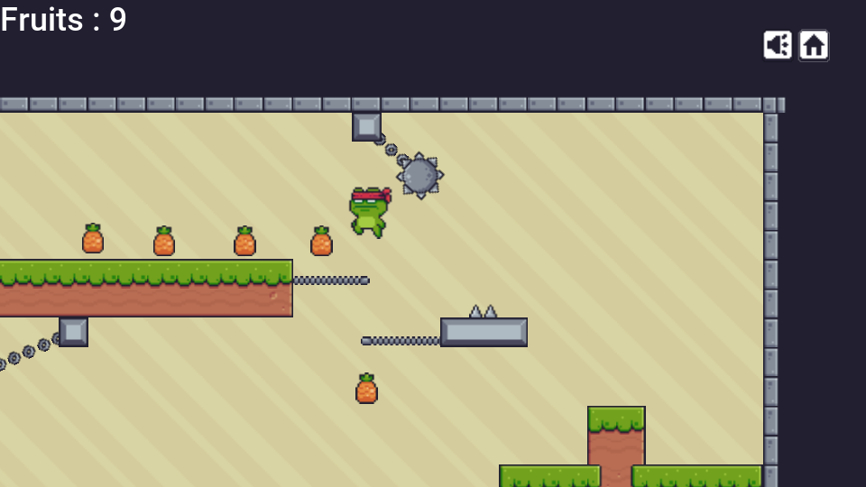
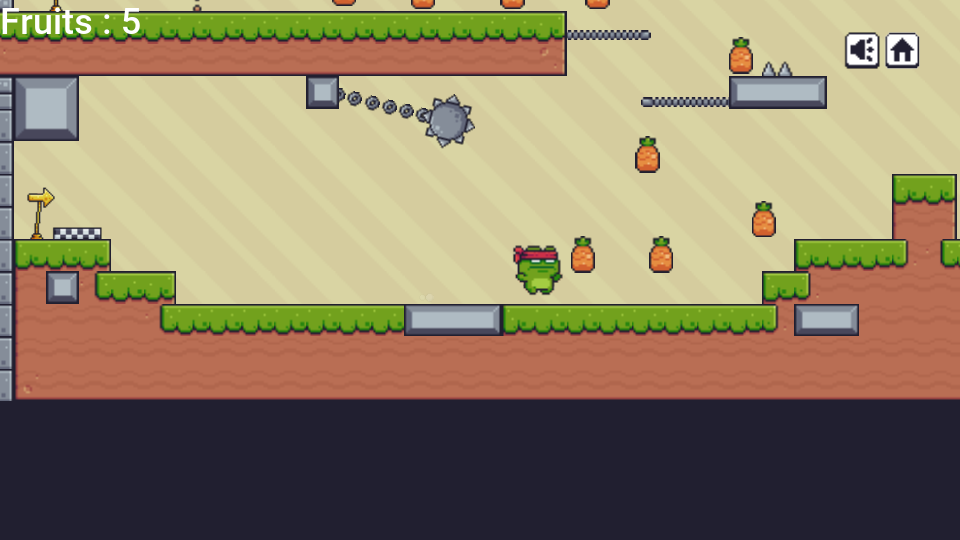
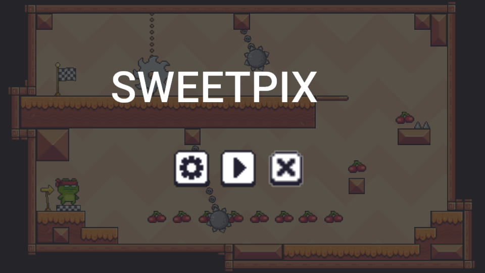
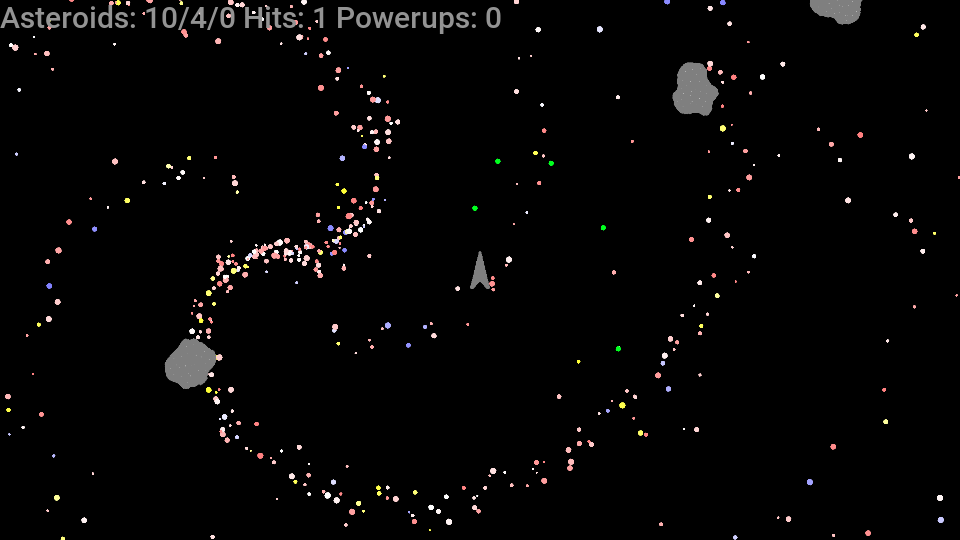
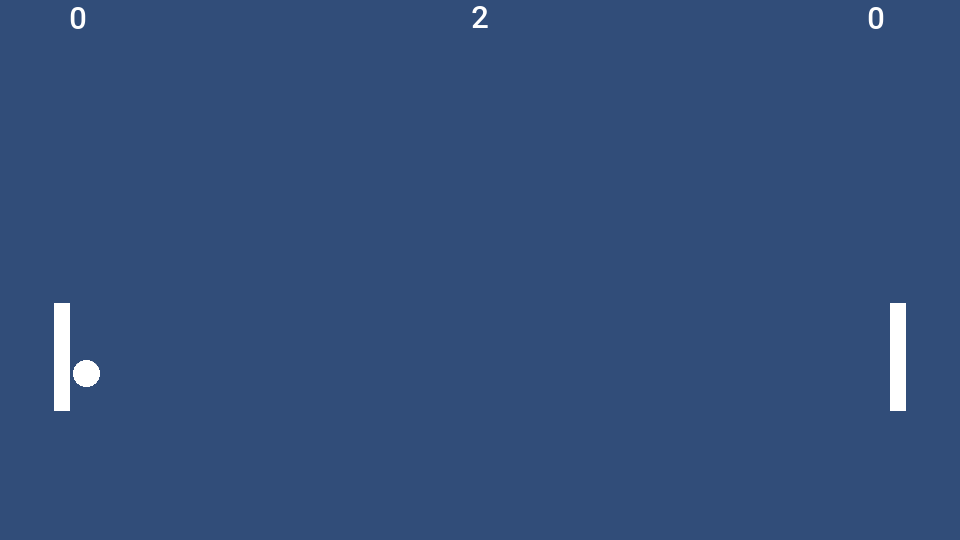
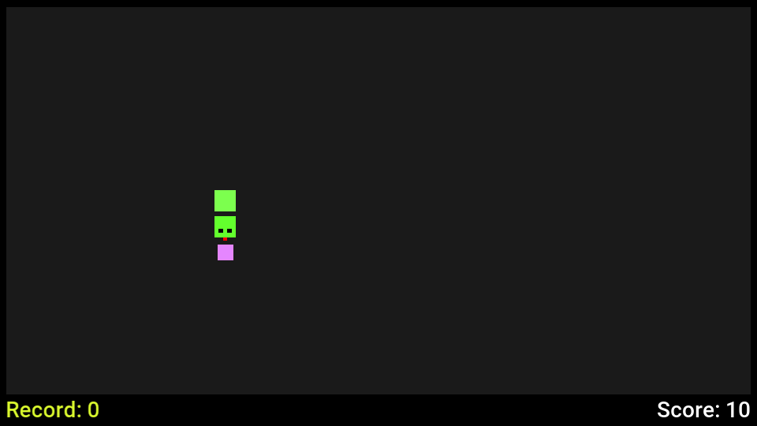
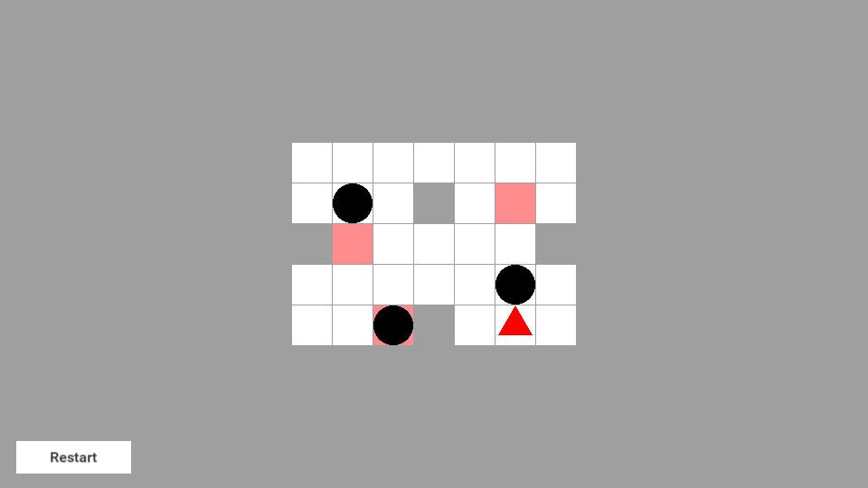
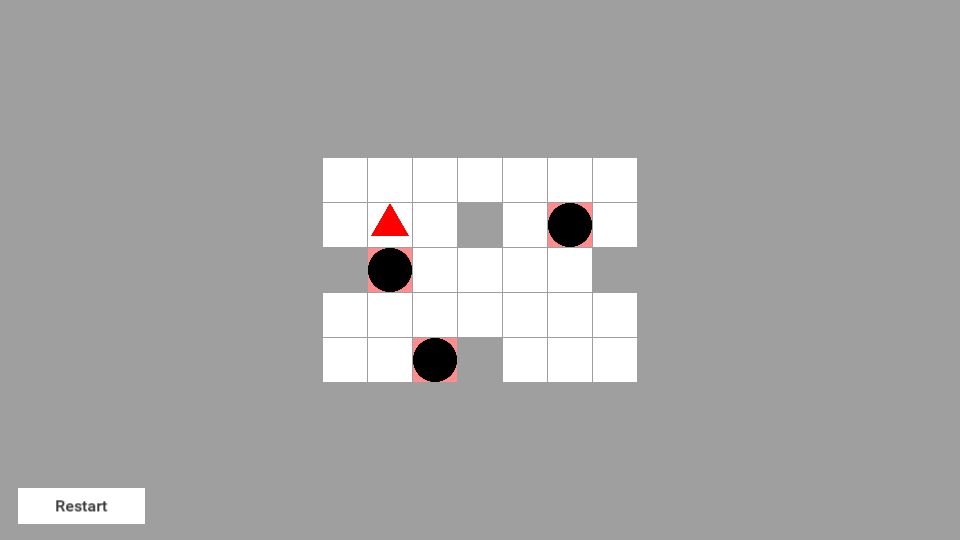

== Running Unity 2D games

A Unity 2D project -- C# scripts, scenes, prefabs, sprites and project
settings -- builds and runs as a Codename One application without changes to
its scripts or its assets. You copy the project into a Codename One project,
the build compiles the C# and translates it to Java bytecode, and the game
runs on every Codename One target: iOS, Android, the JavaScript port, the
desktop ports and the simulator.

No Unity player and no .NET runtime ship with the application. Scripts become
ordinary classes, scenes and prefabs become generated code that creates their
objects, and a runtime that implements the `UnityEngine` API draws the game
into a Codename One component.

That component is the point. The game sits on a Codename One form, inside a
Codename One application, so the same project can put a toolbar and a side
menu around it, show a settings screen or a store, and use sign-in, in-app
purchase, push, advertising and sharing from one Java codebase on every
target. Scripts and Java call each other;
<<unity-interop-codename-one,Using Codename One from your game>> shows how.

The scope is 2D games built from sprites, tile maps, 2D physics, animation
controllers, particle effects, a canvas interface and scripts. Five open
source games run unmodified today, among them the platformer in the image
above; see <<unity-interop-games,Games that run>>. Read
<<unity-interop-scope,Scope and porting notes>> before you plan a port.

=== Requirements

Besides what every Codename One project needs, a project with Unity sources
needs the https://dotnet.microsoft.com/download[.NET SDK], version 6 or newer,
on the machine that runs the build. The build uses its C# compiler and nothing
else: no package is downloaded and no Unity installation or Unity license is
needed.

The build looks for the `dotnet` command in this order:

. The `cn1.unity.dotnet` property, which names the command or its directory.
. The `DOTNET_ROOT` environment variable.
. The `PATH`.

[source,bash]
----
include::../demos/common/src/main/snippets/developer-guide/unity-interop.sh[tag=unity-interop-bash-003,indent=0]
----

A project with no Unity sources doesn't need the SDK. An unchanged Unity
project isn't compiled again, so only the builds that follow a change to a
script or an asset use it.

The Unity project must store its assets as text, which is the default in
current Unity versions (*Edit > Project Settings > Editor > Asset
Serialization > Force Text*). The
build reads scenes, prefabs and `.meta` files as the YAML text Unity writes in
that mode.

=== Quick start

Create a Codename One application project (for example from
https://start.codenameone.com[the initializr]), then import the Unity project
into it:

[source,bash]
----
include::../demos/common/src/main/snippets/developer-guide/unity-interop.sh[tag=unity-interop-bash-001,indent=0]
----

Then run and build as usual:

[source,bash]
----
include::../demos/common/src/main/snippets/developer-guide/unity-interop.sh[tag=unity-interop-bash-002,indent=0]
----

The next section walks through the same steps and what each one prints.

[[unity-interop-porting]]
=== Porting a project, step by step

==== 1. Import the project

Run `cn1:import-unity-project` from the root of the Codename One project and
point `-Dsource` at the directory that holds `Assets` and `ProjectSettings`.
The goal does four things:

* Copies `Assets` and `ProjectSettings` into `common/src/main/unity`. It
  leaves out what the Unity editor derives from them (`Library`, `Temp`,
  `obj`) and the version control directories.
* Adds the `codenameone-unity-compat` runtime and the `compile-unity` goal to
  the `common` module's `pom.xml`.
* Rewrites the Codename One main class so that it starts the game. The
  previous class is kept beside it with a `.pre-unity-import` suffix.
* Prints what it copied, and lists every file the build won't use. A
  compiled plugin shows up here as `not built: Assets/Plugins/Foo.dll
  (compiled code: only C# source is translated)`.

The copy mirrors the Unity project. Keep editing the game in Unity and run
the import again: it replaces the files it copied, removes the ones the Unity
project no longer has, and leaves alone both the files you added by hand and
a main class you changed since the last import.

You can also copy the files by hand. The directory mirrors the root of a Unity
project:

----
common/src/main/unity/
    Assets/            scripts, scenes, prefabs, sprites and their .meta files
    ProjectSettings/   the input axes, tags, layers and physics settings
----

Keep the `.meta` files. Unity identifies an asset by the identifier in its
`.meta` file, and that's how a scene finds the sprite or the script it refers
to.

==== 2. Run the first build

Build the project. This is the step that needs the .NET SDK:

[source,bash]
----
include::../demos/common/src/main/snippets/developer-guide/unity-interop.sh[tag=unity-interop-bash-005,indent=0]
----

The build compiles the scripts, translates them and compiles the scenes. A
project inside the supported surface ends with the line `Compiled the Unity
project`. A script that uses an API outside the surface stops the build here
with the script file, the line and the name of the missing member, so the list of
changes a port needs is in front of you after the first build rather than
after the first crash. <<unity-interop-troubleshooting,Troubleshooting>> shows
both forms of that message.

==== 3. Read the build report

The translator and the scene compiler report everything they left out or
approximated. Maven and Gradle print each line in the build output, prefixed
`src/main/unity:`:

* A *warning* names something that changes how the game behaves or looks: a
  component the runtime doesn't have, a perspective camera made orthographic,
  a sprite a scene refers to that isn't under `Assets`, a script method Unity
  would call and the runtime doesn't. The build log shows
  these at warning level, and the last line counts them: `Compiled the Unity
  project with 2 warning(s): what they name will not behave as it does in
  Unity`.
* A *note* names something left out that doesn't change the game, or a
  substitution you might want to know about. Maven shows notes at info level.

A line about a scene names the scene or prefab file, the GameObject and the
component's file ID, the number after the `&` in the scene's YAML. A warning
about a script names the class, the method, the file and the line. This is the
complete report of the Sokoban game from
<<unity-interop-games,Games that run>>, seven notes and no warnings, shown
without the prefix:

----
Sokoban.unity: the FlareLayer component of GameObject 'Camera with script' (component file ID 1187623029) was left out; nothing in a 2D scene is drawn through it
Sokoban.unity: the GUILayer component of GameObject 'Camera with script' (component file ID 1187623030) was left out; nothing in a 2D scene is drawn through it
Sokoban.unity: the StandaloneInputModule of GameObject 'EventSystem' (component file ID 1460168504) was left out; the event system beside it routes the pointer to the controls itself, and nothing moves between controls by keyboard
Hero.png is a polygon sprite: it was cut to its outline when the project was built, into unity-polygon-Hero.png (256 by 256 pixels), and is drawn as that image
Ball.png is a polygon sprite: it was cut to its outline when the project was built, into unity-polygon-Ball.png (256 by 256 pixels), and is drawn as that image
Sokoban.unity: the image of GameObject 'RestartButton' (file ID 1532672074) uses Unity's built-in interface sprite 10905, which is not in the project; a plain rectangle of the image's colour is drawn instead
the input settings define joystick axes; those read as zero, and the keys of the same axes work
----

The full output of each tool is in `common/target/unity`:

[source,bash]
----
include::../demos/common/src/main/snippets/developer-guide/unity-interop.sh[tag=unity-interop-bash-008,indent=0]
----

==== 4. Run in the simulator

`mvn cn1:run` opens the game in the Codename One simulator. It shows the
first scene of the Unity build settings in a form that fills the screen. If
the build settings list no scene, every scene under `Assets` is compiled in
order of path and the first one starts.

The simulator has a keyboard, so a game written for the desktop plays as it
is. Keys reach `Input` under Unity's key codes, the arrow keys drive the
default `Horizontal` and `Vertical` axes beside WASD, and the pointer is the
mouse.

==== 5. Plan the input for a phone

Touches reach a script two ways. `Input.touchCount`, `Input.touches` and
`Input.GetTouch` report every finger on the screen with its phase, so a game
written for touch plays as it is. The first finger also reads as mouse
button 0, with `Input.mousePosition` at the touch, and canvas buttons respond
to it. A game played with the mouse or with canvas buttons therefore needs
nothing more on a phone.

A script that shows its touch controls only on a handheld can keep asking
`Application.isMobilePlatform`, which is true on iOS and on Android. In a
browser, ask `Input.touchSupported` instead: it reports whether the device has
a touch screen, which is the question on a phone's browser and a laptop's
alike.

A game played with keys needs a way to press them on a device that has none.
The game's view accepts key events from Java code: call `keyPressed` and
`keyReleased` on it with the character of the key, and the script sees
`Input.GetKey` exactly as if a keyboard had sent it. Add Codename One buttons
around the game for that, as
<<unity-interop-codename-one,Using Codename One from your game>>
describes.

==== 6. Build for a device

Device builds are ordinary Codename One builds. Nothing about them is
specific to Unity sources:

[source,bash]
----
include::../demos/common/src/main/snippets/developer-guide/unity-interop.sh[tag=unity-interop-bash-006,indent=0]
----

==== 7. Iterate

After a change to a script, a scene or an asset, build again. The build
fingerprints `Assets` and `ProjectSettings` and repeats the C# compile, the
translation and the scene compile only when one of those files changed. A
change to your Java code alone doesn't run the .NET SDK.

To leave the Unity project out of one build, set `cn1.unity.skip`. The classes
an earlier build produced stay in place:

[source,bash]
----
include::../demos/common/src/main/snippets/developer-guide/unity-interop.sh[tag=unity-interop-bash-007,indent=0]
----

[[unity-interop-codename-one]]
=== Using Codename One from your game

The game isn't the whole application. It's one component, a `UnityGameView`,
on a Codename One form, in an application whose main class is Java. The rest
of this guide therefore applies to the same project and reaches every target
the game does: the user interface toolkit and its themes, sign-in, in-app
purchase, push, advertising, sharing, storage, and networking.

Code travels in three directions, and this section takes them in turn:

* Codename One around the game: forms, a toolbar, a side menu and other
  screens, written in Java.
* Java calling the game: reading a score, or restarting a level.
* The game calling Codename One: a script that asks to sign in, to share a
  result or to open a leaderboard.

The samples are one small application. Its Unity project has two scripts
besides the game's own, and its Java side is two classes.

[[unity-interop-entry-point]]
==== The entry point

The import writes a main class that extends
`com.codename1.unitycompat.app.UnityApplication`. A project that has no main
class of its own gets the same class generated by the build. This is the whole
class, for an application whose main class is `com.example.mygame.MyGame`:

[source]
----
include::../demos/common/src/main/snippets/developer-guide/unity-interop.txt[tag=unityInteropMainClass,indent=0]
----

`installProject` is the one method you must have. It names the class the
scene compiler generated, in source, because a device build has no reflection
to find it by name. `UnityApplication` gives you more places to work from, in
the order they're called:

* `onProjectInstalled()` runs once the project is installed and before the
  first scene is built, so before the first `Awake` of any script.
* `createForm(UnityGameView gameView)` returns the form the game is shown in.
* `onStarted(Form gameForm, UnityGameView gameView)` runs once, after the
  first scene is loaded and the game loop runs.
* `getForm()` and `getView()` return the same two objects later.
* `callInFrame(Runnable)` is static, and runs your code inside the game's
  frame. <<unity-interop-java-to-game,Calling the game from Java>> explains
  when you need it.

==== Codename One screens around the game

Override `createForm` to decide what surrounds the game. The default returns a
form with a `BorderLayout`, a hidden title area and the view in the center.
Return your own form instead; the one rule is that it must contain the view.
This main class gives the game a title bar with a leaderboard command, a side
menu with a Restart command and a score label under the playfield:

[source]
----
include::../demos/common/src/main/snippets/developer-guide/unity-interop.txt[tag=unityInteropApplication,indent=0]
----

`UnityGameView` is in `com.codename1.unitycompat.unityengine.ui`. It extends
the `GameView` of the `com.codename1.gaming` package, so it sizes and lays out
like any other component. Here it takes the center of a `BorderLayout`, and
the game draws into whatever size the layout gives the view.

Everything around the view is ordinary Codename One user interface. The
toolbar, the side menu and the label take their look from the application's
theme, so you style them in `theme.css` as
<<working-with-css-themes,Working with CSS themes>> describes, and
<<_toolbar,Toolbar>> covers the commands, the search field and the side menu.
The theme doesn't reach inside the view: what the game draws is the game's
own.

==== Another form, and back to the game

A settings screen, a store or a leaderboard is a second form. Pause the view
before you show it and resume the view when the player returns. A paused view
runs no script and advances no game time; it keeps its last frame. Scripts
that declare `OnApplicationPause` or `OnApplicationFocus` are told of both:

[source]
----
include::../demos/common/src/main/snippets/developer-guide/unity-interop.txt[tag=unityInteropServices,indent=0]
----

`showLeaderboard` at the end of the class is the part that matters here: it
pauses the view, shows a form with a back command, and the back command shows
the game's form again and resumes.

`UnityApplication` already pauses the game when the application goes to the
background and resumes it on return, so no frame is simulated while nobody
sees it and `Time.time` doesn't jump. A script that calls `Application.Quit()`
exits the application.

==== Stepping the game by hand

A test that captures a scene, or a tool that renders one, needs the same
picture on a fast device and on a slow one. The view normally simulates the
time that passed since its last frame, so the picture depends on how fast the
frames came. `gameView.holdClock()` takes the clock away from the game: a
frame then simulates nothing and draws the scene as it stands.
`gameView.advance(90, 1f / 60)` asks for 90 steps of a sixtieth of a second
each, and the next frame the view draws runs all of them, however long that
frame took. `framesAdvanced()` grows by the number of steps once they've been
run and the scene shows the last of them, which is the moment to capture.
`releaseClock()` hands the clock back.

A view whose clock is held takes no input: keys and touches that arrive are
dropped, so nothing but the steps you ask for moves the scene. Calls queued
with `callInFrame` still run.

To show one scene of a project by itself, start the runtime with
`UnityRuntime.begin(index)` where `UnityApplication` calls `begin()`. The index is the
scene's place in the build settings. `UnityRuntime.reset()` takes everything
down again, the objects, the clock and the application's settings, so the next
scene starts from nothing. Call `Random.InitState` before `begin` when the
scene has particle systems or scripts that ask for random numbers.

==== On-screen controls

For a game that reads keys, add buttons in `createForm` and forward their
press and release to the view. `gameView.keyPressed('a')` followed by
`gameView.keyReleased('a')` is one tap of the A key, and the script's
`Input.GetKey(KeyCode.A)` is true from one call to the other. Letters, digits and the space
character are passed as themselves. For the arrow keys pass the key code of
the matching game action, which `Display.getInstance().getKeyCode(Display.GAME_LEFT)`
returns. The view queues these calls and hands them to the game at the start
of its next frame, so a button's listener makes them directly.

[[unity-interop-java-to-game]]
==== Calling the game from Java

A translated script is an ordinary class, and Java code in the same module
calls it by name. A script with no namespace is in the package `global`; a
script in a namespace is in the package of that name. This is the script the
samples read:

[source,csharp]
----
include::../demos/common/src/main/snippets/developer-guide/unity-interop.cs[tag=unity-interop-csharp-003,indent=0]
----

And this is Java finding it and reading it, in code that runs inside a frame:

[source]
----
include::../demos/common/src/main/snippets/developer-guide/unity-interop.txt[tag=unityInteropCallingRules,indent=0]
----

The rules a Java author needs:

* *Finding an object.* `GameObject.Find` takes the object's name and returns
  `null` when the scene has none. `GetComponent` and `FindObjectOfType` take
  the script's class where C# takes a type argument, and return an `Object`
  to cast. The engine's classes are in
  `com.codename1.unitycompat.unityengine`; its own `Object` class shares a
  name with `java.lang.Object`, so write that one in full.
* *When.* A scene's objects exist once the scene is loaded, so from
  `onStarted` on. A scene load replaces them, apart from the ones a script
  kept with `DontDestroyOnLoad`, so find an object again after one.
* *Fields and methods* keep their C# names, capitals included.
* *Properties* are a pair of methods: `Best` is `get_Best()` and
  `set_Best(int)`.
* *Types.* `int`, `float` and `bool` are `int`, `float` and `boolean`. A
  `string` is a `java.lang.String`. An enumeration is an `int`. A C# array of
  those is the Java array. A `List<T>` is a
  `com.codename1.unitycompat.system.collections.generic.List_1`, without its
  type argument.
* *Value types.* `Vector2`, `Vector3`, `Color` and the other `UnityEngine`
  value types are classes of the Java package `UnityEngine`, with their fields
  public. A method that returns one takes an extra last argument, the object
  the result is written into: `Where()` in C# is `Where(new Vector2())` in
  Java.
* *Access.* The translated members are all public. A member the script
  declared private isn't part of what the script offers; leave it alone.

One rule covers threads. Scripts run inside the game's frame, on the thread
that draws it, and on some ports that isn't the event dispatch thread your
listeners run on. So:

* Touch game objects and scripts inside `callInFrame`.
* Touch Codename One components on the event dispatch thread.

`callInFrame(Runnable)` runs the code at the start of the next frame, before
any script. It's a static method of `UnityApplication`, and the view has the
same method. Calls run in the order they were made, and they run while the
view is paused too. The main class above uses it three times. The Restart
command sets a field of the script. The leaderboard command reads the best
score and hands it on. The timer reads the points inside the frame and then
passes the number to `CN.callSerially`, which sets the label on the event
dispatch thread.

Code that a script calls is already inside the frame, and may use any script
directly.

[[unity-interop-game-to-java]]
==== Calling Codename One from the game

A script compiles against the `UnityEngine` API and the .NET base library, so
it can't name a Java class. It can name an interface of its own. Declare, in
the Unity project, what the game needs from the application, and a static
field to hold the object that provides it:

[source,csharp]
----
include::../demos/common/src/main/snippets/developer-guide/unity-interop.cs[tag=unity-interop-csharp-002,indent=0]
----

The interface is translated with the scripts and becomes the Java interface
`global.IPlatformServices`. Implement it in Java, with the whole Codename One
API at hand. `GameServices`, shown earlier, is that implementation: `SignIn`
uses `GoogleConnect`, `Share` opens the platform's share sheet through
`CN.share` and `ShowLeaderboard` shows a form.

Three things make the bridge work:

* *Register it before the first scene loads.* The main class assigns
  `Platform.Services` in `onProjectInstalled`. Every `Awake` and `Start` then
  finds it set; `Score` calls `SignIn()` from its `Start`.
* *Hand the work to the event dispatch thread.* A script calls the interface
  from inside a frame. Each method wraps what it does in `CN.callSerially`,
  and returns at once so the frame isn't held up.
* *Keep the interface to simple types.* `int`, `float`, `bool` and `string`
  cross unchanged. A method that returns a value answers on the game's
  thread: return something the application already holds, and don't touch a
  component there.

The script side stays plain C#. `Platform.Services?.Share("I scored " + Best)`
does nothing when no object is registered, so the scripts don't depend on the
application being there.

From the Java side of that interface the whole platform is in reach:

* *Sign-in* with Google, Apple, Facebook, Microsoft or any OpenID Connect
  provider: <<authentication-and-identity,Authentication and Identity>>.
* *In-app purchase and subscriptions* through `Purchase`:
  <<_in_app_purchase,In-app purchase>>.
* *Advertising*, including rewarded and interstitial formats between levels:
  <<_advertising,Advertising>>.
* *Push notifications*: <<_push_notifications,Push notifications>>.
* *Sharing* a score or a screenshot: `CN.share`, or the
  <<sharebutton-section,ShareButton>> component.
* *Storage and networking* for saved games and online scores: `Preferences`,
  <<_storage,Storage>> and
  <<_network_manager_connection_request,`ConnectionRequest`>>.
* *Anything a platform SDK offers* that Codename One doesn't wrap:
  <<_native_interfaces,native interfaces>>.

`PlayerPrefs` needs no bridge. The runtime keeps it in Codename One's
`Preferences` storage, so a high score outlives the application on every
target.

=== How the build works

A single step runs as part of the normal build of the `common` module:
*`compile-unity`*, in `generate-sources`. It does three things:

. The .NET SDK compiles every `.cs` file under `Assets` to one assembly,
  with the language level set to C# 9. It leaves out the scripts in an `Editor` directory, as Unity leaves them
  out of a player build. The scripts compile against a `UnityEngine` assembly
  that ships with the runtime, so a script that uses a `UnityEngine` member
  the runtime doesn't have fails here, with the C# compiler's own file and
  line.
. The translator reads the assembly and writes Java class files, one class
  for each C# type. A type in a namespace lands in the package of the same
  name. A type with no namespace, which is what most Unity scripts are, lands
  in the package `global`, because a Java class in the default package can't
  be imported. The translator also checks every call into the .NET base
  library against the runtime and lists the members the runtime lacks.
. The scene compiler turns every scene and prefab into Java source: a
  generated class, `com.codename1.generated.unity.UnityAppImpl`, that creates
  the objects with `new`, assigns the values the Inspector stored and connects
  the references. It copies the sprites, sounds and text assets next to it.

Nothing is created by reflection and no scene file is parsed on the device.
That's what lets the same code run on iOS and in the browser, where the
translated application keeps only the code something refers to. Three things
Unity resolves by name at run time are resolved by the build instead:

* `Invoke("Fire", 1f)` and `InvokeRepeating` call a dispatcher the translator
  writes into each script, which maps the method names of that script to
  calls.
* A button's persistent `onClick` calls, the ones set up in the Inspector,
  become direct calls in the generated scene code.
* `Resources.Load("level1")` is a lookup the scene compiler writes from the
  files it found under the `Resources` folders. The asset is already part of
  the application when a script asks for it.

Two representations are worth knowing as a script author:

* *Value types keep C#'s copy semantics.* `Vector2`, `Vector3`, `Quaternion`,
  `Color`, `Bounds` and your own structs are copied on assignment and when
  passed, exactly as C# specifies. Arithmetic on them writes into storage the
  caller owns instead of allocating an object for each result, so vector math
  in `Update` doesn't produce garbage.
* *A rectangular array is one flat array.* `int[,]` and arrays of higher rank
  are stored as a single array with every index checked against its own
  dimension. A tile grid costs one allocation and each access is one multiply
  and one add.

The `codenameone-unity-compat` dependency is added to the `common` module by
the project's `unity-compat` profile, which activates when `src/main/unity`
exists.

=== Gradle projects

A Gradle project builds a Unity project the same way. The plugin sees
`src/main/unity`, adds the `codenameone-unity-compat` runtime to the
application and runs a `compileUnity` task before the Java sources compile, so
there is no dependency to declare and no task to call. A Maven project that
has a Unity project keeps it when you convert it with `cn1:convert-to-gradle`.

The import is a Maven goal. In a project that was created for Gradle, copy
`Assets` and `ProjectSettings` into `src/main/unity` by hand. Then either
delete the main class the project came with, and the build generates one that
starts the game, or change it as <<unity-interop-entry-point,The entry point>>
describes.

Name the .NET SDK with `-Pcn1.unity.dotnet` when it isn't on the `PATH`:

[source,bash]
----
include::../demos/common/src/main/snippets/developer-guide/unity-interop.sh[tag=unity-interop-bash-004,indent=0]
----

Gradle skips `compileUnity` as up to date while the Unity project is
unchanged. To leave the Unity project out of one build, exclude the task with
`-x compileUnity`; the classes an earlier build produced stay in place. The
work files and the logs of the C# compiler, the translator and the scene
compiler are in `build/cn1-unity/state/unity`.

[[unity-interop-supported]]
=== What a project can use

This is the surface the five games in the next sections were built on. It
covers what a 2D game with sprites, tile maps, physics, animation and a
canvas interface is made of.

==== C# and the base library

* The language as Unity projects use it: classes, structs, interfaces, enums,
  generics, delegates and events, lambdas and closures, iterators, `foreach`,
  `ref` and `out` parameters, `switch` on strings and switch expressions,
  tuples, string interpolation, exceptions, properties, indexers and operator
  overloading.
* Strings: concatenation, `Format` with plain `{0}` items, `Join`, `Split`
  on characters or on strings with or without `StringSplitOptions`,
  `Substring`, `IndexOf`, `Contains`, `StartsWith`, `EndsWith`, `Replace`,
  `Trim`, and the invariant case conversions.
* Numbers: `int.Parse`, `int.TryParse`, `System.Math` and `Mathf`.
* `List<T>` and `Dictionary<K,V>`. A dictionary enumerates in insertion
  order and has `TryGetValue`, `ContainsKey`, `Remove`, `Keys`, `Values` and
  `foreach` over its pairs.
* Arrays, including rectangular arrays of any rank with `GetLength`.
* The `Action` and `Func` delegates and these LINQ operators: `Where`,
  `Select`, `Any`, `All`, `Count`, `Contains`, `First`, `FirstOrDefault`,
  `Last`, `LastOrDefault`, `ElementAt`, `Take`, `Skip`, `Distinct`, `Concat`,
  `Reverse`, `ToList` and `ToArray`.

The script below uses several of these together: a level read from a text
asset in a `Resources` folder into a two-dimensional array, with the tiles it
creates tracked in a dictionary. It builds as written.

[source,csharp]
----
include::../demos/common/src/main/snippets/developer-guide/unity-interop.cs[tag=unity-interop-csharp-001,indent=0]
----

==== Scripts and objects

* `MonoBehaviour` with these messages: `Awake`, `OnEnable`, `Start`,
  `FixedUpdate`, `Update`, `LateUpdate`, `OnDisable`, `OnDestroy`, and the 2D
  collision and trigger messages (`OnCollisionEnter2D`, `OnCollisionStay2D`,
  `OnCollisionExit2D` and the three `OnTrigger` equivalents).
* `OnMouseDown` and `OnMouseUp` on an object with a 2D collider, with the
  pointer placed in the world by the main camera. `OnApplicationPause(bool)`
  and `OnApplicationFocus(bool)` when the game is paused and resumed.
* Coroutines with `yield return null`, `WaitForSeconds`, `WaitForEndOfFrame`
  and `WaitForFixedUpdate`, a `Start` written as a coroutine,
  `StopCoroutine` and `StopAllCoroutines`.
* `Invoke`, `InvokeRepeating`, `CancelInvoke` and `IsInvoking`.
* `GameObject` and `Transform` hierarchies, `Instantiate` with or without a
  position, a rotation and a parent, `Destroy` with an optional delay, `SetActive`, tags and layers,
  `Find`, `FindWithTag`, `FindGameObjectsWithTag`, `FindObjectOfType`,
  `AddComponent`, and `GetComponent` with its `InChildren` and `InParent`
  forms.
* Serialized fields of scripts, as the Inspector stored them: numbers,
  strings, enums, vectors, colors, arrays and lists, structs, and references to objects, components, prefabs, sprites, audio
  clips and text assets.
* Prefabs, prefab instances placed in a scene with their property overrides,
  and nested prefabs.
* `SceneManager.LoadScene` by name or by build index, `Time` with
  `timeScale` and `timeSinceLevelLoad`, `Random`, `Screen.width` and
  `Screen.height`, `Debug.Log` and its warning and error forms, and
  `UnityEngine.Assertions.Assert`.
* `Application.platform` and `Application.isMobilePlatform`, answered from the
  device the game runs on: `IPhonePlayer` on iOS, `Android` on Android,
  `WebGLPlayer` in a browser, and the desktop's own player on macOS, Windows
  and Linux. The simulator reports the desktop it runs on.

==== Rendering

* `SpriteRenderer` with sorting layers and orders, flipping and tinting.
* Sprites imported as single images, sprite sheets sliced in the Sprite
  Editor, pivots and pixels per unit. A polygon sprite is cut to its outline
  when the project is built and drawn as that image.
* An orthographic `Camera` with its background color and the conversions
  between screen, viewport and world points.

==== Animation

* `Animator` with the controllers and clips of the project. The build
  compiles each `.controller` and `.anim` file into code, so nothing is
  parsed on the device.
* State machines with float, integer, bool and trigger parameters,
  transitions with conditions and exit time, and transitions from Any State.
* Curves that animate a sprite renderer's sprite, color and enabled flag, a
  transform's position, scale and rotation about z, and whether a GameObject
  is active.
* Animation events, which call the method they name on the scripts of the
  animated object.
* From a script: `Play`, `CrossFade`, `SetFloat`, `SetInteger`, `SetBool`,
  `SetTrigger`, `ResetTrigger` and their getters, `speed`,
  `GetCurrentAnimatorStateInfo`, `IsInTransition`, `StringToHash`, and
  assigning `runtimeAnimatorController` to swap the controller.

==== Tile maps

* `Grid`, `Tilemap` and `TilemapRenderer`, with the cells the Tile Palette
  painted.
* `TilemapCollider2D`, alone or merged into outlines by a
  `CompositeCollider2D`.
* From a script: `GetTile`, `SetTile`, `HasTile`, `GetSprite`,
  `ClearAllTiles`, `WorldToCell`, `CellToWorld` and `GetCellCenterWorld`.

==== Particles

* `ParticleSystem`, simulated on the CPU from a seeded sequence, so an effect
  plays the same way on every target.
* The main module, emission by rate and in bursts, the emitter shape, and the
  velocity, color, size and rotation over lifetime modules, as the scene
  stores them.
* From a script: `Play`, `Stop`, `Pause`, `Clear` and `Emit`, the playing
  state and `particleCount`, and the `main`, `emission` and
  `velocityOverLifetime` modules.

==== Physics

* `Rigidbody2D`: dynamic, kinematic and static bodies, velocity, forces and
  torques, `MovePosition` and `MoveRotation`, mass, drag, gravity scale,
  `constraints` and `collisionDetectionMode`.
* Box, circle, polygon, capsule and edge colliders, tile map and composite
  colliders, triggers, and `Collision2D` with its contacts.
* `PlatformEffector2D` for one-way platforms.
* Physics materials (friction and bounciness), the project's gravity and the
  layer collision matrix, with `Physics2D.IgnoreLayerCollision` to change it
  from a script.
* Casts: `Physics2D.Raycast`, `Linecast`, `CircleCast`, `BoxCast` and
  `CapsuleCast`. Each has the form that returns the nearest hit, the `All`
  form, the `NonAlloc` form and the form that takes a `ContactFilter2D` with
  an array or a list for the results.
* Overlap tests: `OverlapPoint`, `OverlapCircle`, `OverlapBox`, `OverlapArea`
  and `OverlapCapsule`, in the same four forms.
* `RaycastHit2D`, `ContactFilter2D` and `LayerMask`, including a `LayerMask`
  field set in the Inspector, with `Physics2D.queriesHitTriggers`,
  `queriesStartInColliders` and `SyncTransforms`.
* On a collider or a body: `OverlapPoint`, `IsTouching`, `IsTouchingLayers`
  and `Cast`, and `Collider2D.bounds`.

A cast isn't stepped along its path. The runtime solves each one in closed
form, so the distance, the normal and the point it reports are exact to the
rounding of the arithmetic, and a fast or thin shape can't slip past a
collider. A query sees bodies where the last physics step put them; call
`Physics2D.SyncTransforms` after a script moves a transform and before it
asks.

==== Input

* `GetKey`, `GetKeyDown` and `GetKeyUp` by `KeyCode` or by name, `anyKey` and
  `anyKeyDown`.
* The axes and buttons the project's input settings define on keys, through
  `GetAxis`, `GetAxisRaw` and `GetButton`.
* The mouse: `GetMouseButton`, `GetMouseButtonDown`, `GetMouseButtonUp` and
  `mousePosition`, and the `Mouse X` and `Mouse Y` axes for its movement.
* Touch: `touchCount`, `touches` and `GetTouch`, with a `Touch` that carries
  its `fingerId`, `position`, `deltaPosition`, `tapCount` and a `phase` of
  `Began`, `Moved`, `Stationary` or `Ended`. `multiTouchEnabled` and
  `simulateMouseWithTouches` work as documented.

==== User interface, audio and data

* A `Canvas` in Screen Space, overlay or camera, with a `CanvasScaler` and
  `RectTransform` anchoring.
* `Text` with size, style, alignment, wrapping and best fit.
* TextMesh Pro text, as `TMP_Text`, `TextMeshPro` and `TextMeshProUGUI`:
  `text`, `SetText`, size, style, alignment, wrapping and auto sizing, drawn
  in the platform's font.
* `Image`, simple or filled horizontally or vertically (`fillAmount` drives a
  health bar).
* `Button` with its color tint states, the `onClick` calls set up in the
  Inspector, and `onClick.AddListener` from a script.
* `AudioSource` and `AudioClip`, played through Codename One's media API:
  `Play`, `PlayOneShot`, `Stop`, `Pause`, `loop`, `volume` and
  `PlayClipAtPoint`.
* `PlayerPrefs` for integers, floats and strings, saved on the device.
* `Resources.Load` for text assets, images imported as one sprite, audio
  clips and prefabs, and `TextAsset` with `text` and `bytes`.

==== Follow cameras

* Cinemachine's `CinemachineBrain` and `CinemachineVirtualCamera` with a
  `CinemachineFramingTransposer` or a `CinemachineTransposer` body: a camera
  that follows its target with the offset, damping, dead zone and soft zone
  the scene sets.
* Several virtual cameras by priority, with a cut from one to the next, and
  `Follow` assigned from a script.

[[unity-interop-determinism]]
=== The same game on every target

Arithmetic on `float` gives the same result on every target, and
`UnityEngine.Random` produces the same sequence from the same seed. A game
that's given a fixed seed and the same input plays the same way in the
simulator, in a native build and in the browser.

That takes work in two places, because the targets don't agree by default.
The C compiler that builds the iOS and desktop binaries may fuse a multiplication
and an addition into one instruction that rounds once instead of twice, so the
native builds turn that contraction off. A JavaScript number is a double, so
on the JavaScript port every `float` result is rounded back to single
precision before it's used.

The evidence is a trace comparison. Each game in the next section was run
from a fixed seed with scripted input on three targets: a JVM, the C code
ParparVM generates, and the JavaScript port under Node.js. Each run wrote a
trace of the game's log lines, its object counts and its draw list, with
positions in hundredths of a pixel and rotations in hundredths of a degree.
The three traces of each game are byte for byte the same: 3,503 lines for
Fruitopia, 220 for Asteroids, 852 for Pong, 244 for Snake and 445 for
Sokoban. Fruitopia's run goes through its menu and its lobby, plays a level
to the flag and returns to the lobby, 1,400 frames of animation, particles,
tile map collisions and a follow camera. Asteroids moves
more than 1,100 objects every frame, so one differently rounded multiply
shows up in its trace within a few hundred frames.

`Random` is seeded from the clock unless you set a seed. To make a run
repeatable, set the `unity.seed` display property before the game starts, for
example `Display.getInstance().setProperty("unity.seed", "7")` at the top of
the main class's `init` method.

[[unity-interop-games]]
=== Games that run

Five open source Unity games build and run with no change to their scripts,
scenes or assets. Each is a repository its author published under the MIT
license. They aren't part of Codename One; clone one and import it to try it.

Every image in this section is a frame the Codename One runtime drew from the
game's own scenes and sprites, at 960 by 540 pixels.

==== Fruitopia

https://github.com/thisshrek/Fruitopia[`thisshrek/Fruitopia`], MIT license,
copyright 2024 Mohamed Kharrat. Twelve scripts, 733 lines. Its art is the
Pixel Adventure set by Pixel Frog, released under CC0 and credited in the
game's README.

A pixel-art platformer with a menu, a lobby and levels to run through:
collect the fruit, avoid the traps, reach the flag. It's the widest test of
the five. Its levels are tile maps with composite colliders and one-way
platforms. Its hero, fruit, traps and menus are driven by 65 `Animator`
components that play 40 clips. The dust behind the hero is a particle
system, the labels are TextMesh Pro text, and a Cinemachine virtual camera
follows the hero. The hero moves through `Rigidbody2D` and finds the ground
with `Physics2D.OverlapBox`.

The text in these frames is in the platform's font rather than the game's
font asset, which is how the runtime draws TextMesh Pro text.

The build reports six warnings for this project, and each names something
the project itself is missing or does that Unity also drops. Two levels place
a prefab whose file isn't in the repository, one object carries a script
that isn't under `Assets`, and three objects carry a static class as a
component. The menu, the lobby and the first level play from start to finish.

==== Asteroids

https://github.com/sdxsharp/unity-asteroids[`sdxsharp/unity-asteroids`], MIT
license, copyright 2022 `sdxsharp`. Five scripts, 546 lines, saved by Unity
2021.3.

An arcade shooter that keeps between 1,157 and 1,180 objects alive, most of
them the stars of its background. It exercises rigid bodies driven by
velocity, polygon and circle colliders, collision messages, prefabs
instantiated and destroyed as the game runs, seeded `Random`, the input axes
and a canvas with a score line.

==== Pong

https://github.com/MalachiMackie/Unity-Pong[MalachiMackie/Unity-Pong], MIT
license, copyright 2021 Malachi Mackie. Seven scripts, 557 lines, saved by
Unity 2021.1.

A two-player ball game. It uses prefab instances with property overrides,
physics materials for the bounce, audio clips, C# events and delegates with
tuple payloads, LINQ and switch expressions.

==== Snake

https://github.com/Wesley-Oliveira/Classic-Snake-Game-Unity-2D[Wesley-Oliveira/Classic-Snake-Game-Unity-2D],
MIT license, copyright 2020 Wesley Oliveira. Two scripts, 184 lines, saved
by Unity 2019.3.

A grid game with a menu. Its menu is canvas buttons whose `onClick` calls
were set up in the Inspector, its record is kept in `PlayerPrefs`, and the
snake moves on a coroutine that respects `Time.timeScale`.

==== Sokoban

https://github.com/juwalbose/UnityTileBasedSokoban[`juwalbose/UnityTileBasedSokoban`],
MIT license, copyright 2017 Juwal Bose. One script, 264 lines, saved by
Unity 2017.1.

A tile puzzle. The level is a text file loaded with `Resources.Load`, split
and parsed into an `int[,]` grid, with the tile objects tracked in a
`Dictionary<GameObject, Vector2>`. The script creates every tile as a
`GameObject` with a `SpriteRenderer` it adds itself. The hero and the balls
are polygon sprites, and the Restart button reloads the scene through a persistent call to
`SceneManager.LoadScene`.

[[unity-interop-measurements]]
=== Measurements

The table covers the four smaller games above; Fruitopia follows it. The
numbers measure the game and the
compatibility runtime alone, in a harness that runs the game without a
display: the same scripted run that produced the traces, three runs each,
median reported. A shipped application adds the Codename One port for its
platform on top.

[cols="2,1,1,1,1",options="header"]
|===
|Game |Objects alive |Native executable |JavaScript, gzip |Peak memory, native
|Asteroids |1,157 to 1,180 |1.33 MB |246 KB |15.7 MB
|Pong |13 |1.36 MB |244 KB |6.2 MB
|Snake |26 to 31 |1.33 MB |243 KB |5.1 MB
|Sokoban |40 |1.30 MB |241 KB |4.8 MB
|===

* *Native executable* is the stripped macOS binary of the game, the runtime
  and the Java class library, translated to C by ParparVM and linked with
  link-time optimization.
* *JavaScript, gzip* is the script the JavaScript port loads for the same
  code, compressed with `gzip -9`.
* *Peak memory* is the most physical memory that native executable held
  over an 1,800-frame run, as `/usr/bin/time -l` reports it.

The translated code is small next to the runtime it runs on. Sokoban's
classes and the whole compatibility runtime pack into a 268 KB jar, of which
the runtime is 252 KB. The games were measured against successive builds of
the runtime, so a difference of 2% or 3% between rows isn't
significant.

Fruitopia is the largest of the five. These figures are from its scripted
1,400-frame run in the same harness. Between 59 and 80 objects are alive and each frame issues 350
to 500 draw commands.

* The compatibility runtime it ships with is 382 KB. The rest of its jar is
  the game's own audio.
* The native executable, linked with link-time optimization and stripped, is
  2.67 MB.
* The JavaScript for the same code is 387 KB after `gzip -9`.
* Peak memory over the run was about 10 MB for the native executable, about
  99 MB on a JVM and about 176 MB under Node.js.
* On the JVM the simulation allocated under 2 KB per frame over the whole
  run, three scene loads included.

On speed: Asteroids, the heaviest of the four in the table, spent under half a millisecond
of CPU per frame in the native build, simulation and draw list together, on a
development machine that was busy with other builds. The other three were
below what the timer resolves. Treat that as an order of magnitude and
measure your own game on the device you ship for.

[[unity-interop-scope]]
=== Scope and porting notes

The compatibility layer targets 2D games built from sprites, tile maps, 2D
physics, animation controllers, particles, a canvas interface and scripts.
This section lists what's outside that surface
today, what the build does when it meets each item, and what to do about it.

==== How the build tells you

A port doesn't fail at run time for a reason the build could have named.
There are four places it speaks up:

* A `UnityEngine` member the runtime doesn't have is a C# compiler error with
  the file and the line.
* A .NET base library member the runtime doesn't have stops the build at the
  translation step, with every such member listed at once and, under each,
  the script file, the line and the method that uses it.
* A component a scene has and the runtime doesn't is a warning that names the
  scene, the GameObject and the component. The component is left out and the
  rest of the scene still builds.
* A script method Unity would call by name and the runtime doesn't is a
  warning with the class, the method, the file and the line.

==== Rendering notes

* *3D.* Meshes, lights, 3D physics, shaders and materials other than the
  default sprite material are outside the scope. Their components are left
  out with a warning. A perspective camera is made orthographic, and a
  rotation about the x-axis or the y-axis is dropped, each with a warning.
* *Animation controllers.* The first layer of a controller is played, and
  the build warns when a controller has more. A state that plays a blend tree
  shows nothing, and a transition into a sub-state machine is left out, each
  with a warning. Give such a state a plain clip, or drive the blend from a
  script with `Play` and `CrossFade`. An override controller plays nothing,
  with a warning; assign `runtimeAnimatorController` from a script instead.
* *Animated properties.* A clip animates a sprite renderer's sprite, color
  and enabled flag, a transform's position, scale and rotation about z, and
  a GameObject's active flag. A curve on another property is left out with a
  warning that names it; set that property from an animation event or from
  `Update`.
* *Timelines* aren't run. Sequence the same steps in a coroutine.
* *Particle modules.* The main, emission, shape, and velocity, color, size
  and rotation over lifetime modules are simulated. Another module that's
  switched on, such as Noise, Collision, Trails, Sub Emitters or Texture
  Sheet Animation, does nothing, and the build warns for each. A system that
  emits from a mesh, a donut or a sprite emits from its own position, one
  that stretches its particles or draws meshes draws plain sprites facing the
  camera, and a system with `Prewarm` on starts empty. Of the modules a script can
  reach, `main`, `emission` and `velocityOverLifetime` are in the API.
* *Scripted tiles.* A rule tile or an animated tile isn't run. The cells a
  scene was painted with show the sprites the editor chose for them, and a
  cell a script sets with such a tile shows its default sprite, with a note.
  Use plain tiles for cells a script changes.
* *Line and trail renderers, sprite masks.* The components are left out with
  a warning. An effect made of short-lived sprite objects that a script
  instantiates and destroys carries over as it is.
* *Sliced and tiled sprites.* A nine-sliced or tiled `SpriteRenderer` or
  `Image` draws its sprite stretched, with a warning. A radial fill draws
  whole.
* *Built-in and package sprites.* The sprites that belong to the Unity editor
  or to a Unity package aren't in the project, so the build draws a plain
  rectangle or a white disc in their place and says so. Add your own sprite
  to the project to control the look.

==== Physics notes

* *Queries.* The casts and overlap tests are listed under
  <<unity-interop-supported,What a project can use>>. `Physics2D.Distance`,
  `Collider2D.Raycast` and `Physics2D.GetRayIntersection` aren't in the API,
  so a script that calls one is a compile error. `Physics2D.Raycast` with a
  layer mask or a `ContactFilter2D` answers what `Collider2D.Raycast` is
  usually asked, and `OverlapPoint` at the pointer's world position does the
  job of `GetRayIntersection` in a 2D scene.
* *Edge radius.* An `EdgeCollider2D` with an edge radius collides as a thin
  line, with a warning. Use a capsule or a box collider where the thickness
  matters.
* *Continuous collision detection.* A body set to Continuous is swept so that
  it can't pass through a thin collider. The physics engine decides this for
  the whole world: one Continuous body makes it sweep the others too.
* *Joints and other effectors.* Joints are left out with a warning.
  `PlatformEffector2D` is the effector that's supported; a collider used by
  another effector collides as itself, with a warning. Apply the force of an
  area or point effector from `OnTriggerStay2D`.
* *Automatic mass.* A body set to *Use Auto Mass* uses the mass the file
  records, with a warning.

==== Script notes

* *Messages.* The runtime calls the messages listed under
  <<unity-interop-supported,What a project can use>>. A method named for
  another Unity message, such as `OnBecameInvisible`, `OnMouseDrag` or
  `OnGUI`, compiles and is never called. The build warns for each one, with
  the class, the method, the file and the line, so the list is in the build
  output. A drag can be read in `Update` from `Input.GetMouseButton` and
  `Camera.ScreenToWorldPoint`.
* *Coroutine waits.* `WaitUntil`, `WaitWhile` and `WaitForSecondsRealtime`
  aren't in the API. A `while` loop around `yield return null` does the same
  job.
* *Scenes.* One scene is loaded at a time. `DontDestroyOnLoad` keeps a root
  object across a load, with everything below it and its running coroutines
  and pending `Invoke` calls. Called for a child object it logs a message and
  keeps nothing, as in Unity.
* *The base library.* The runtime implements the part of .NET listed above,
  not the whole library. `List<T>.Sort`, `StringBuilder`, format strings such as
  `ToString("F2")`, `float.Parse`, `HashSet<T>`, `Queue<T>`, `Stack<T>`,
  `DateTime` and `System.Random` are the ones a port meets first. The
  translation step lists each use; the usual replacement is a few lines in
  the script, such as a hand-written insertion sort or `UnityEngine.Random`.
* *Reflection, `System.IO`, threads, `async` and `await`, networking and
  `unsafe` code.* None of these are translated. Keep saved data in
  `PlayerPrefs`, load bundled data with `Resources.Load`, and run timed work
  in coroutines. Networking belongs on the Java side of the application.
* *Compiled plugins.* Only C# source is translated. The import lists every
  `.dll` and native library under `Assets` as not built. Use the source of
  the library where its license allows.
* *Packages from the Package Manager.* The build compiles what's under
  `Assets`. Copy the source of a package the scripts need into `Assets`.
* *Serialized fields.* A field whose type is a serializable class of your
  own keeps the value its constructor gave it, and the build warns with the
  field's name. Make the type a struct, which is read, or assign the value in
  `Awake`.
* *Editor scripts and custom inspectors.* Scripts in an `Editor` directory
  are left out, the way Unity leaves them out of a player build.

==== Input notes

* *The Input System package.* The runtime implements the `UnityEngine.Input`
  class. A script written against the newer Input System package doesn't
  compile; read the same keys, axes and touches through `Input`.
* *Touch phases.* A touch goes through `Began`, `Moved`, `Stationary` and
  `Ended`. `Canceled` is never reported, so move the cleanup a
  script keeps there into `Ended`.
* *Joystick axes and the scroll wheel.* An axis the input settings bind to a
  joystick reads as zero, with a note, and so does `Mouse ScrollWheel`. The
  keys bound to the same axis work.
* *Space and Return.* The desktop port reports the space bar and the Enter
  key as one fire button, so on the desktop both `KeyCode.Space` and
  `KeyCode.Return` read as pressed when either is. A game that gives the two
  keys different meanings on the same screen sees both.

==== User interface notes

* *Controls.* `Canvas`, `CanvasScaler`, `Text`, `Image`, `Button`,
  `GraphicRaycaster` and `EventSystem` are supported. Another control of
  Unity's interface package -- a slider, a toggle, an input field, a scroll
  view or a layout group -- is left out with a warning
  that names the scene, the GameObject and the Unity type, and the build
  continues. A script field that pointed at the control is `null`, so guard
  the script's use of it. Replace the control with buttons and images, or
  show that screen with Codename One components around the game, where every
  Codename One control is available.
* *World Space canvases* aren't drawn, with a warning.
* *Fonts.* Text is drawn in the platform's font at the size, style and
  alignment the scene sets. A font asset the project names isn't used, which
  the build notes for each text.
* *TextMesh Pro.* TextMesh Pro text is drawn the same way: the platform's
  font at the size asked for, without the font asset, its material, an
  outline or rich text tags, with a note for the scene. Tags in a string are
  therefore drawn as written; keep them out of text shown here.
* *Button transitions.* Color tint is supported and changes at once rather
  than fading. A sprite swap or animation transition leaves the button
  looking the same in every state; it still works.
* *Keyboard navigation between controls* isn't implemented. Controls respond
  to the pointer.

==== Camera notes

* *Cinemachine.* A virtual camera follows its target through a framing
  transposer or a transposer, and the brain cuts between virtual cameras.
  Blends, aim behaviors, noise and extensions such as a confiner aren't
  implemented, which the build notes once for a scene. A look-ahead time on a
  framing transposer is ignored, with a note. To keep the camera inside a
  level, clamp its position in `LateUpdate`.

==== Audio and asset notes

* *Formats.* Clips are played by each platform's own media player, so try
  the game's sound files on every target you build for.
* *Pitch and looping.* A clip plays at its recorded speed whatever
  `AudioSource.pitch` says, and a looped clip restarts when it ends, which can
  leave a short gap.
* *`Resources`.* `Resources.Load` finds text assets, single-sprite images,
  audio clips and prefabs. `LoadAll` isn't in the API. An image sliced into
  several sprites isn't found by `Resources.Load`, with a note; refer to its
  sprites from a serialized field instead.
* *Asset bundles and the `Addressables` package* aren't supported. Refer to assets from a
  scene, a prefab or a `Resources` folder.
* *`Texture2D`* and run-time texture generation aren't in the API.
* *File names.* Images and sounds become application resources, which have
  no folders. Two images with the same file name in different folders both
  ship, each under a name of its own, and every sprite shows its own image.
  Two audio clips with the same file name still collide, and the build warns
  about each pair. Rename one.
* *Scripts that can't be components.* A scene that attaches a static class,
  an abstract class or a class that isn't a `MonoBehaviour` as a component
  gets a warning, and the component is left out, as Unity leaves it out.

[[unity-interop-troubleshooting]]
=== Troubleshooting

*The build can't find the .NET SDK.* The message names the three places it
looked:

----
src/main/unity holds a Unity project, and compiling its C# scripts needs the .NET SDK, which was not found.
----

Install the SDK and put `dotnet` on the `PATH`, or pass
`-Dcn1.unity.dotnet=/path/to/dotnet`. A .NET runtime without the SDK isn't
enough, and the build says so when `dotnet --version` reports no SDK. An SDK
older than version 6 is reported as too old.

*The C# scripts don't compile.* A script uses a `UnityEngine` type or
member outside the runtime's API. The build prints the C# compiler's errors,
each with its file, line and column:

----
The C# scripts in src/main/unity/Assets did not compile:
/work/mygame/common/src/main/unity/Assets/Scripts/Player.cs(14,38): error CS0117: 'Physics2D' does not contain a definition for 'Distance'
----

The complete compiler output is in `dotnet.log`. Change the script, or check
<<unity-interop-scope,Scope and porting notes>> for the replacement.

*The translation step fails.* The scripts compiled, and they use
a part of the .NET base library the runtime doesn't have. The translator
lists every missing member, and under it each place that uses it:

----
The C# scripts in src/main/unity could not be translated:
error: the runtime library lacks 2 members the code uses:
  class  com/codename1/unitycompat/system/text/StringBuilder
      used by HighScores.cs:17, in HighScores::Print() : string
  method com/codename1/unitycompat/system/collections/generic/List_1.Sort()V
      used by HighScores.cs:12, in HighScores::Start() : void
----

The class after `unitycompat/system/` is the .NET class, and each `used by`
line is the script file, the line and the method to change.

*A control or a package component is left out.* A scene or prefab has a
component whose script isn't under `Assets`: an interface control outside the
supported set, or a component of a Package Manager package. The build goes on
and warns, once for the component and once for each script field that
referred to it:

----
First.unity: GameObject 'Gauge' (component file ID 202) has a UnityEngine.UI.Slider component (script GUID 67db9e8f0e2ae9c40bc1e2b64352a6b4), and the compatibility runtime has no UnityEngine.UI.Slider; the component was left out, and whatever refers to it is left null
First.unity: field gauge of the Keeper script on GameObject 'Keeper' (component file ID 102) refers to a UnityEngine.UI.Slider component (script GUID 67db9e8f0e2ae9c40bc1e2b64352a6b4) of GameObject 'Gauge' (component file ID 202), which was left out; it was left null
----

Replace the control, or make the script check the field for `null`. For a
package whose source you have, copying its scripts into `Assets` compiles
them with the project. A scene the build settings list that isn't in the
project is left out with a warning too.

*A script method is never called.* Unity calls some methods by name, and the
runtime sends the ones listed under
<<unity-interop-supported,What a project can use>>. The build warns about
any other:

----
Keeper.OnBecameInvisible (Keeper.cs:98): Unity calls this method by its name and the compatibility runtime does not send the OnBecameInvisible message; the method is never called
----

*A component is missing in the running game.* Read the warnings of the last
build that compiled the Unity project; a build that found the project
unchanged doesn't repeat them. `translate.log` and `scene-compiler.log` in
`common/target/unity` keep them, each prefixed `warning:` or `note:`.

*The game looks or behaves differently.* Check, in this order: the warnings
in those two logs; the notes there about substituted sprites and fonts; and
whether a script relies on something listed under
<<unity-interop-scope,Scope and porting notes>>. `Debug.Log` output appears in the simulator's
console.

*The main class wasn't updated by a second import.* The import leaves a main
class you changed after the first import untouched, and says so. Delete the
class and import again to regenerate it.

=== Independent implementation

The runtime is an independent implementation of the parts of the Unity
scripting API this chapter lists, written from Unity's public documentation
and from the observable behavior of projects. It contains no Unity code and
no Unity assemblies, and the build doesn't read or need a Unity installation.
The same holds for the two packages the runtime answers for. Its TextMesh Pro
and Cinemachine classes are Codename One's own implementations of the parts
of those documented APIs this chapter lists, and contain no code from either
package.
Codename One isn't affiliated with or endorsed by Unity Technologies. Unity
is a trademark of Unity Technologies.

Your scripts and assets stay under the terms you hold them under. Assets from
the Unity Asset Store and other third parties have their own license terms.
Check that those terms allow use outside the Unity engine before you ship a
port that includes them.
