[[wayline-users-guide]]
== Wayline: A ride-hailing app from three sides

Wayline is a sample app with a server behind it. A rider asks for a ride, the
nearest suitable driver is offered it, both follow the trip on a map, the ride is
paid for when it ends, and an administrator runs the service. The app and the
server are one Maven project in `scripts/wayline`, written in Java on both sides,
and the Initializr generates the same project under your own name.

This chapter is the user's guide: what each of the three kinds of user sees and
can do. <<wayline-implementors-guide>> is the other half. It explains how the
project is built and what to change to make it yours.

One app serves all three. The server gives every account a set of roles, and the
app opens on the screen that fits them: a rider on the map, a driver on the
driving screen, an administrator on the operations console. Someone who holds
more than one role switches between them from the menu.

[cols="1,3"]
|===
| Role | What it adds

| Rider
| Every account is a rider. Search for a destination, compare three kinds of
  car, choose how to pay, follow the driver, rate the ride, tip and keep the
  receipt.

| Driver
| Granted when an administrator approves a driving application. Go online,
  accept or decline the rides offered, drive them, and see and cash out what
  they earned.

| Admin
| Granted by another administrator. See the service in numbers and charts,
  review driving applications, flag or block accounts, cancel and refund rides,
  read the payments and set the prices.
|===

=== Trying it

Start the server on its development profile and it creates a set of accounts,
all with the password `wayline-demo`, and two weeks of rides so that the charts
have something to draw. <<wayline-launch>> has the commands.

[cols="2,3"]
|===
| Account | Role

| `rider@wayline.example`, `rider2@wayline.example`
| Riders, each with a saved test card.

| `rider3@wayline.example`
| A rider an administrator has flagged.

| `driver@wayline.example`, `driver2@wayline.example`
| Approved drivers of the standard kind of car.

| `driver3@wayline.example`, `driver4@wayline.example`
| Approved drivers of the two larger kinds. The last one takes a wheelchair.

| `applicant@wayline.example`
| Has applied to drive and is waiting for a decision.

| `admin@wayline.example`
| Runs the service.
|===

Sign in as the rider in one simulator and as a driver in another to follow a
ride from both ends.

No money moves on a server that hasn't been given a payment provider's key.
Cards are simulated, and three numbers behave in three ways:

[cols="2,3"]
|===
| Card number | What happens

| `4242 4242 4242 4242`
| Accepted, and every charge succeeds.

| `4000 0000 0000 0002`
| Declined when you try to add it.

| `4000 0000 0000 0341`
| Accepted when added, then declined when a ride is charged.
|===

Any expiry date in the future and any security code work with them.

=== Getting in

The welcome screen offers to sign in or to create an account. **Server address**
is there for a phone on the same network as a development server: `localhost`
on a phone is the phone, so the app has to be told where the server is.

.The welcome screen
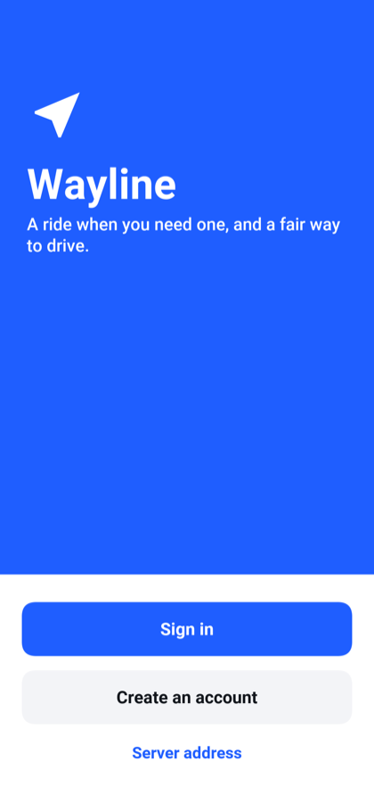

Creating an account takes a name, an e-mail address, a mobile number and a
password. The e-mail address is what you sign in with.
// vale-skip: Microsoft.FirstPerson: "I want to" is the label on the screen.
Under **I want to**, you say
whether you plan to ride or to drive. Choosing **Drive** doesn't make you a
driver; it takes you to the driving application once the account exists.

.Creating an account
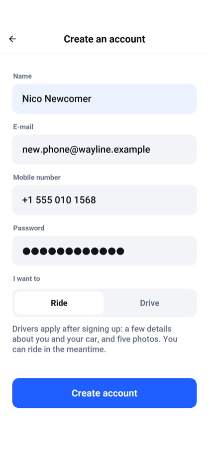

The app then asks for the six-digit code sent to the mobile number. A code is
good for five minutes and five attempts, and a new one can be requested after
half a minute. A server with no text-message provider configured can't send a
text, so on a development profile it shows the code on the screen instead. You
can skip this step with **Not now**, but the server refuses a ride request from
an account whose number isn't verified.

.Verifying the mobile number on a development server
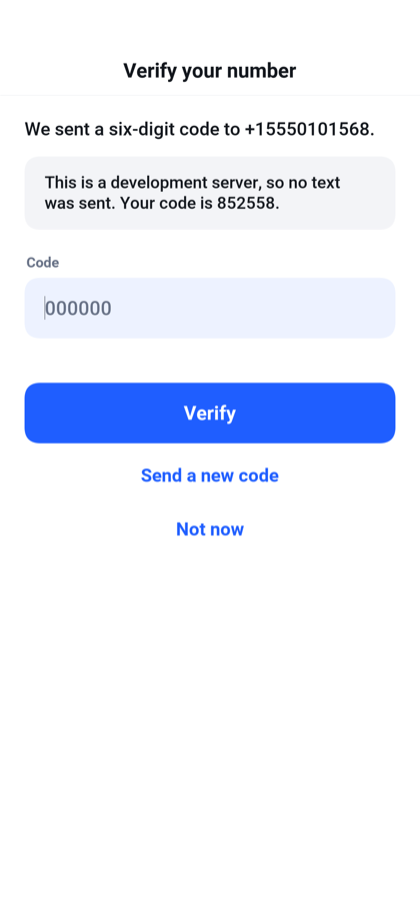

Signing in is the app's own form. Behind it, the app runs an OAuth 2.0
authorization-code flow against the server without opening a browser, and keeps
the tokens it gets in the device's secure storage. Signing out revokes the
refresh token at the server.

After the first sign-in the app asks once whether it may share usage
statistics: which screens are opened and which features are used, and never a
name, an e-mail address, a phone number, a place or a card. **Share usage
statistics** agrees and **Not now** declines, and the app works the same
either way. The answer can be changed at any time in the settings.

.The question about usage statistics
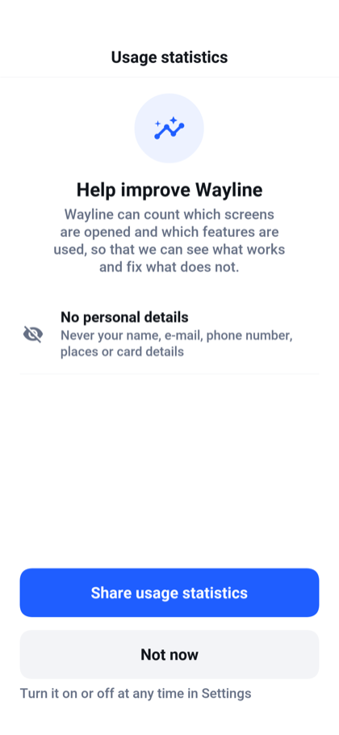

=== The rider

A rider can:

* Search for a destination by name or address, or pick the saved **Home** or
  **Work**.
* See the route, its length and how long it takes before asking.
* Compare three kinds of ride with a price each: the standard car, a more
  comfortable one, and a larger one for up to six people.
* See how far the nearest car of each kind is, and the free cars on the map.
* Pay with a saved card or with cash.
* Ask for a quiet ride, an accessible vehicle, a car that takes pets, or a
  woman driver.
* Follow the driver to the pickup and along the trip.
* Call or message the driver, share the trip, or cancel before the trip starts.
* Rate the ride from one to five stars and add a tip.
* Read the list of past rides and the receipt of each.

The home screen is a map with a search card over it and a sheet at the bottom.
The round button at the top opens the menu, and the one at the side puts the
map back on where you are.

.The rider's home screen
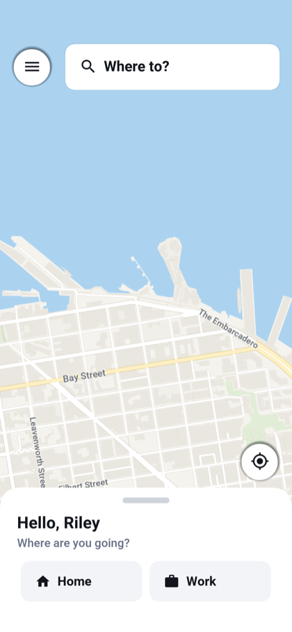

.The rider's home screen in the dark theme
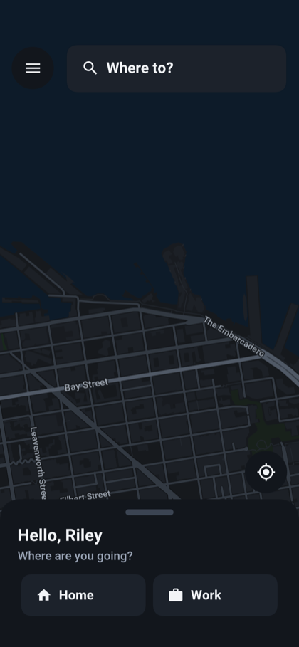

The map starts on where you are. While the device is still finding that, a
notice at the top of the map says **Looking for your location**. If it has no
answer after eight seconds, the notice becomes **Still looking for your
location. Try again**. When the device can't work out its position, the notice is
**Can't find your location. Try again**, and when the app has no permission to
ask, it's **Location is turned off. Try again**. Tapping the notice asks again.
Until a position arrives the map shows the service's default city, and you can
still search for a pickup and a destination.

Pick a destination and the app draws the route and asks the server for a quote.
The sheet lists the three kinds of ride with what each costs, how many it seats
and how many minutes away the nearest one is. Under them is the way to pay,
which you can change by tapping it. The price shown is the fare with the
service fee included.

.Choosing a ride
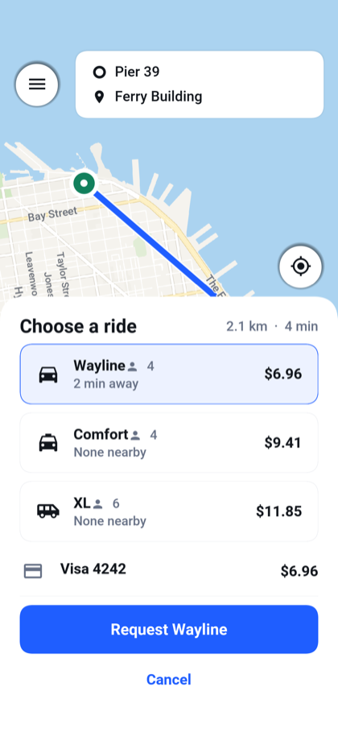

The quote is for information. When you ask for the ride, the server works the
fare out again from its own prices and fixes it for that ride. A price change an
administrator makes a minute later applies to the next ride, not to this one.

The server offers the ride to the nearest free driver who fits what you asked
for. That driver has fifteen seconds to accept. If they decline or let the time
pass, the next nearest is offered it, and after a short while the search widens
from three kilometers to eight. If nobody takes the ride within a minute and a
half the app says so, and nothing is charged.

Once a driver accepts, the sheet shows their name, rating, car and license
plate, and the car moves on the map as the driver reports in.

.A driver on the way to the pickup
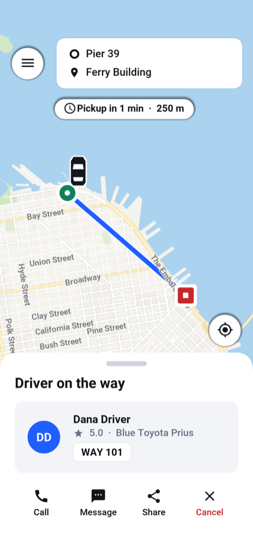

**Call** and **Message** open the phone's dialer and its messaging app, so
they're offered only on a device that can dial. **Share** opens the device's
share sheet with a sentence naming the destination, the driver and the car.
**Cancel** ends the ride at any point before the trip starts. The sample charges
nothing for a cancelled ride.

When the driver completes the trip the server charges the card, and the sheet
asks how the ride was.

.The end of a ride
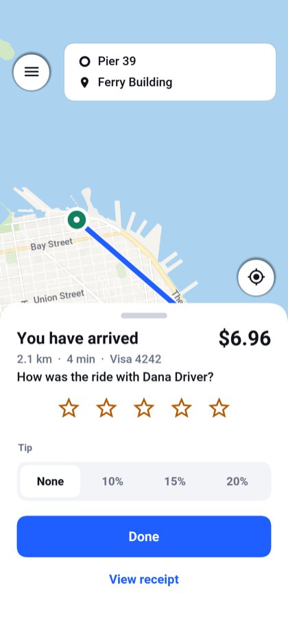

The tip is a percentage of the fare or, from the receipt, any amount. It's a
second charge to the same card, made once, and the whole of it goes to the driver. On
a ride paid in cash the tip is recorded on the receipt and in the driver's
earnings, and no card is charged for it.

==== Wallet and receipts

**Wallet** in the menu lists the saved cards and cash, which is always there.
Tapping a card makes it the one that pays unless you choose otherwise when you
ask for a ride. An account holds up to eight cards.

.The wallet
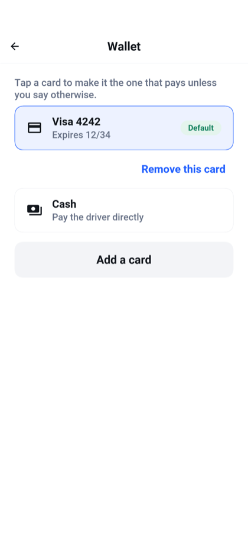

How a card is added depends on the server. With simulated payments the card is
typed into the app. With a real provider the app opens the provider's own page
in the browser, so the card number never reaches the app or the server, and the
app picks the result up when you come back to it.

Past rides are listed under **Your rides**. Pull the list down to load it
again. Each ride opens a receipt with the trip, the driver and the fare broken
into its parts.

.A receipt
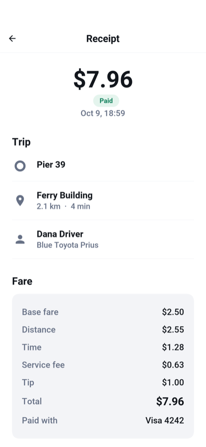

=== The driver

A driver can:

* Apply to drive, and correct and resend an application that was sent back.
* Go online and offline.
* See each ride offered with its pickup, destination, distance and fare, and
  accept or decline it within the time allowed.
* See what the rider asked for: a quiet ride, an accessible vehicle, a pet.
* Mark the arrival at the pickup, the start of the trip and its end.
* Call or message the rider, or cancel before the trip starts.
* See today's and this week's earnings, the last two weeks day by day, and the
  list of past trips.
* Register a bank account and cash out the balance.

==== Applying to drive

Anyone with an account can apply, from **Drive with Wayline** in the rider's
menu. The application has five steps, and each is saved as you leave it, so an
application can be finished later:

. Your legal name, date of birth and gender.
. The driving license: its number and when it expires.
. The car: make, model, year, color, plate, how many it seats, the kind of ride
  it suits, and whether it takes a wheelchair or pets.
. Five photographs: an identity document, the license, a picture of you, the
  vehicle registration and the insurance.
. A review of the whole application before it's sent.

.The documents step of a driving application
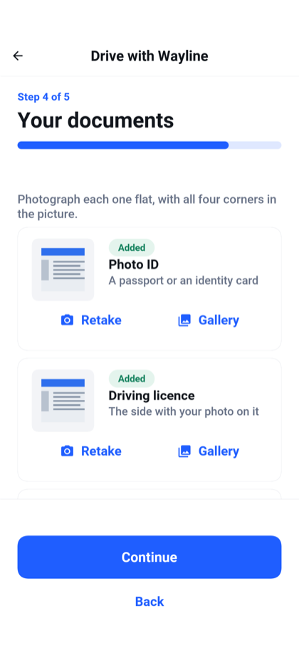

Each photograph comes from the camera or the gallery. The app shrinks it before
sending, and the server accepts JPEG and PNG files of up to 1.5 MB.

Once sent, an application waits for an administrator. Until one decides, the applicant
sees where it stands and goes on riding.

.An application waiting for a decision
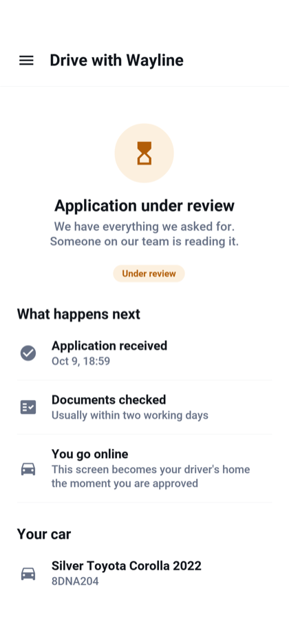

Approval gives the account the driver role, and the app opens on the driving
screen from then on. A rejection comes with the administrator's reason. The
applicant can change what was wrong and send the application again.

==== Driving

The driving screen is a map with the day's earnings at the top and a badge
that reads **Offline** or **Online**. A driver starts offline. The sheet says
**You are offline** and, under it, **Go online to start taking rides**.

.A driver who is offline
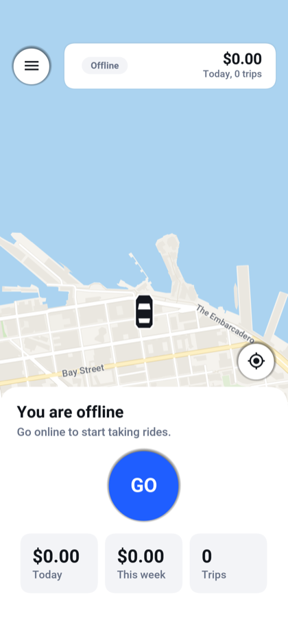

**GO** puts the driver online. The badge changes to **Online**, the sheet says
**Looking for rides**, and the app reports the car's position to the server
every few seconds. **Go offline** stops the offers. A driver who is online and
stops reporting for a minute is no longer offered rides either.

An offer shows the fare, how far the pickup is and how long the trip is, with a
ring counting down the time left to answer.

.A ride offered to a driver
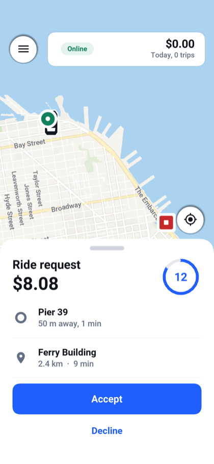

After accepting, the driver follows the route to the pickup, taps **I have
arrived**, then **Start trip** when the rider is in the car and **Complete
trip** at the destination. For a ride paid in cash the sheet says how much to
collect.

.A trip under way, paid in cash
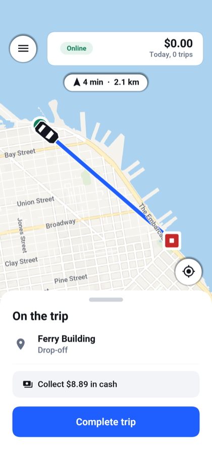

A driver can cancel after accepting and before the trip starts. A trip that has
started can only be completed, or cancelled by an administrator.

==== Earnings

**Earnings** in the driver's menu shows the balance ready to cash out, the
totals for today, this week and this month, a chart of the last two weeks, the
number of trips, the tips, the rating and the share of offers accepted. Under
them are the payouts already made.

.A driver's earnings
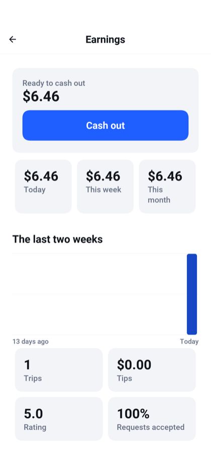

A driver earns the fare less the service's commission, and every tip in full.
**Cash out** asks for a bank account the first time: the holder's name, the bank
and the last four digits of the account number.

NOTE: Cashing out records a payout and sets the balance to zero. The sample
moves no money to a bank. <<wayline-billing>> says what that takes.

=== The administrator

An administrator can:

* See what's happening now: rides today, rides under way, drivers online and
  fares collected.
* See trends over 7, 14 or 30 days: rides and fares by day, the share
  completed, the average fare and wait, requests by hour of the day, rides by
  outcome and by kind, and the drivers with the most rides.
* Review driving applications with their documents, and approve them or send
  them back with a reason.
* Search the accounts, see each one's rides, spending, earnings and rating, and
  give or take away the driver and admin roles.
* Flag an account, which marks it for the other administrators, or block it,
  which signs it out and refuses it until the block is lifted. Both take a
  reason, and both are kept in the account's history with who did it and when.
* See every ride, cancel one under way, and refund one that was paid by
  card.
* See every payment.
* Set the prices.
* Watch the cars that are online move on a map.

The same screens are laid out in two ways. On a phone the console is one screen
at a time with a menu. In a window at least 165 mm wide, which is a tablet, a
desktop or a browser, it's a console with its sections down the side and a list
beside the item picked from it.

==== On a phone

The dashboard opens with what needs attention, as buttons that lead to it, then
the four numbers and the charts.

.The dashboard on a phone
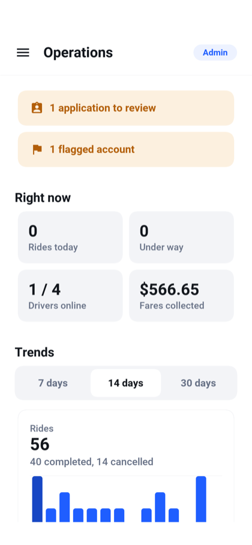

.Trends, further down the dashboard
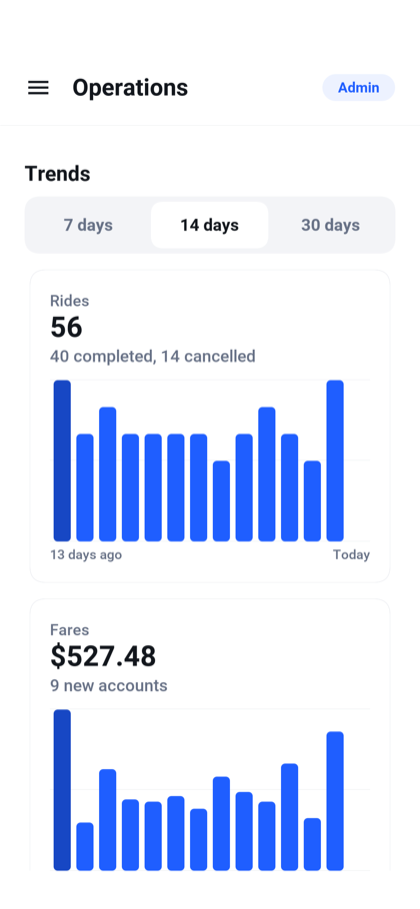

The lists of applications and of rides are loaded again by pulling them down.
A desktop window has no such gesture, and its lists load when the section
opens.

An application opens with everything the applicant entered and the five
documents, each of which opens full size. **Approve** and **Send back** are at
the end of it.

.A driving application under review
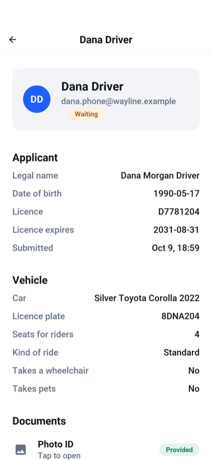

An account opens with its standing, its numbers, its contact details, the two
role switches, the moderation buttons and its history.

.A blocked account
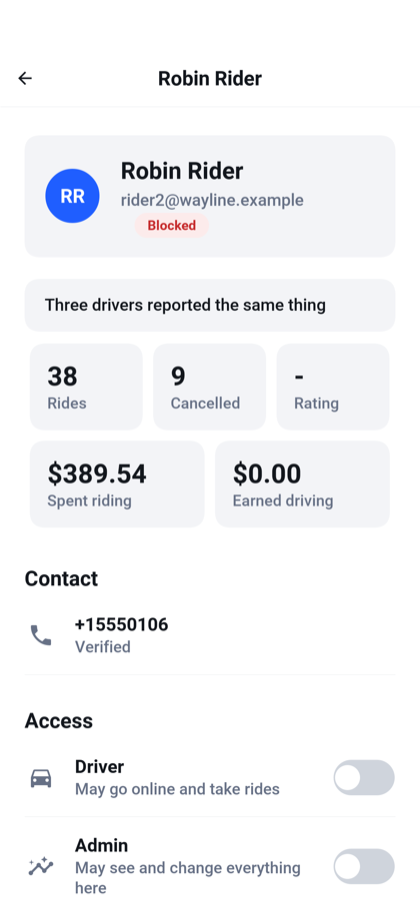

==== On a wide screen

The desktop build takes the look of the operating system it runs on, in its
colors, fonts, and controls.

.The dashboard in a desktop window
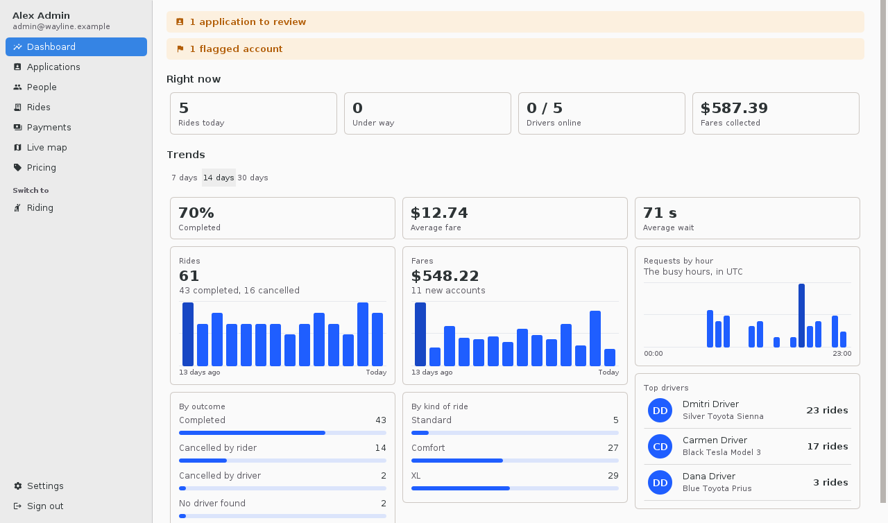

**Applications** lists them by status, and the one picked opens beside the
list.

.Applications, with one open beside the list
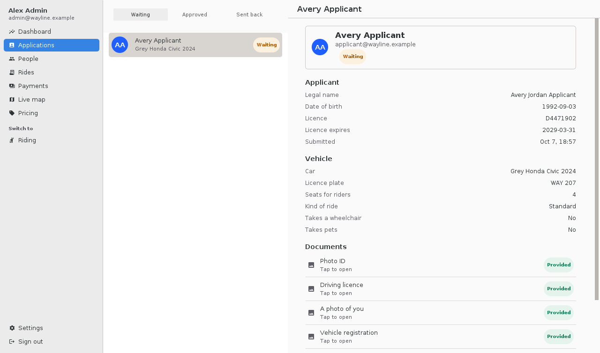

**People** has a search field and filters for riders, drivers, admins, flagged
and blocked accounts.

.People, with an account open
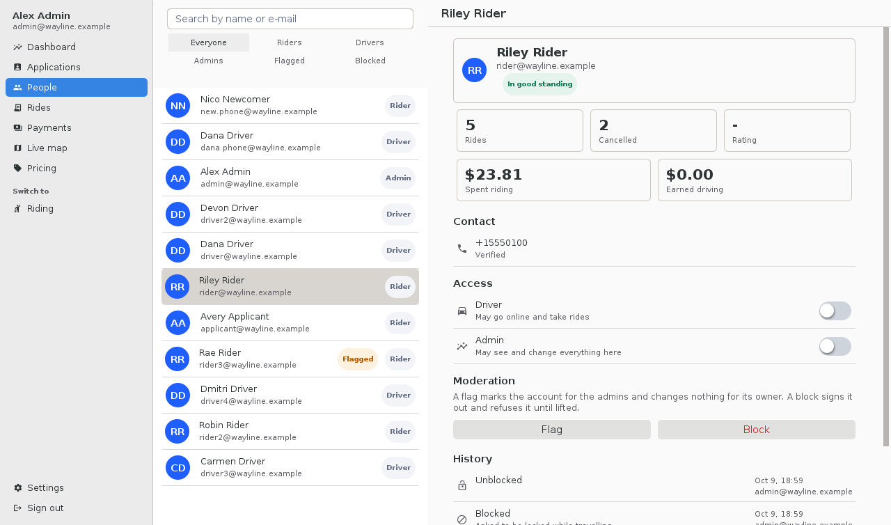

**Rides** lists the most recent rides with their state: every ride, or only
those under way, completed, or cancelled. A ride opens with the trip, the fare
and how it was paid. From there an administrator can cancel a ride that hasn't
finished and refund one that was paid by card. A refund returns
the fare, the service fee and the tip. A ride paid in cash has nothing to
refund.

.Rides
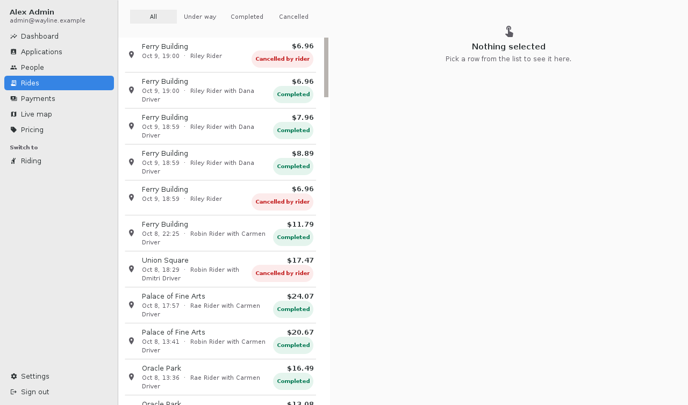

**Payments** lists what was charged for each ride, by which method and with
what result.

.Payments
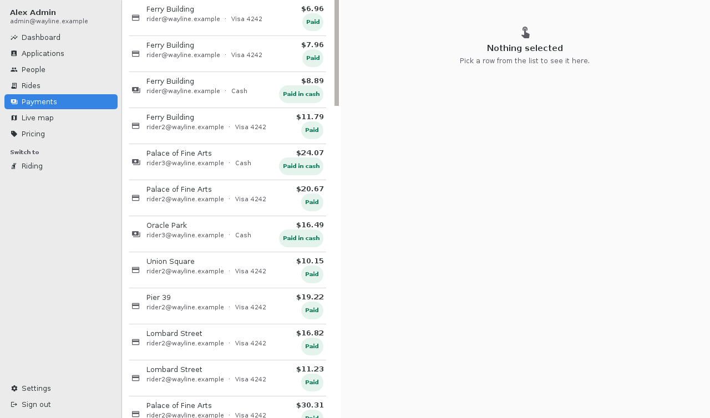

**Pricing** holds the numbers every fare is worked out from: a base fare, a
price for each kilometer and each minute, a minimum, the service fee added on
top for the rider, the commission kept from the driver, and a multiplier for
each of the two larger kinds of ride and for times of high demand. The currency
is a setting of the server and isn't changed here.

.Pricing
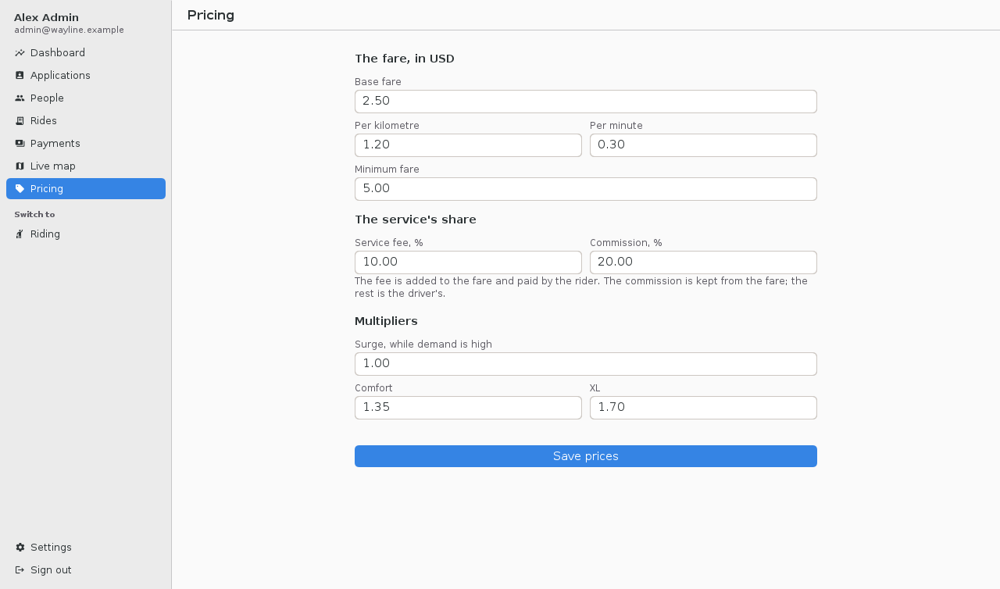

**Live map** fills the window with a map of the cars that are online, which
move as their drivers report in.

.The live map
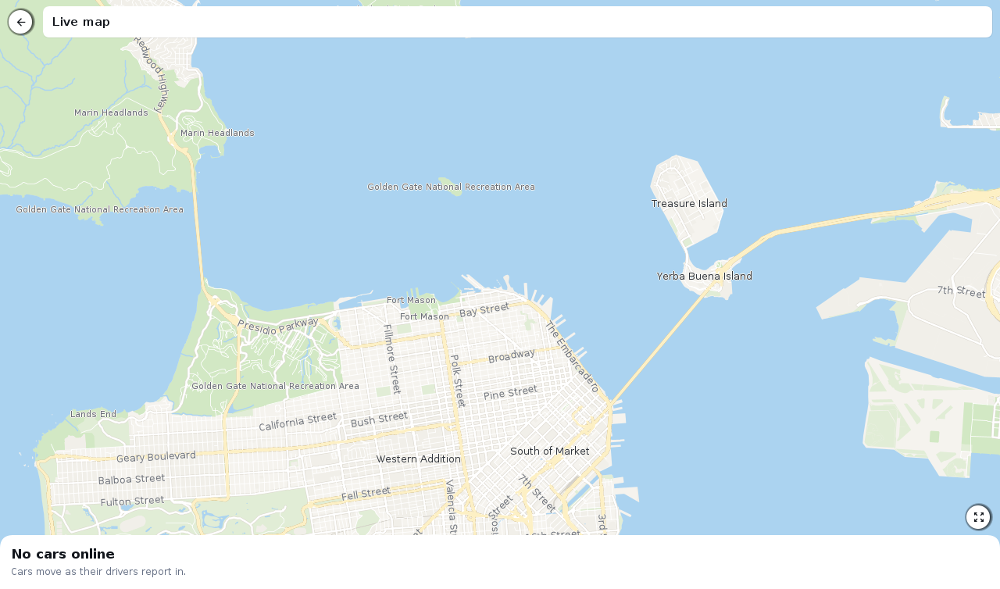

The screens the console doesn't own, such as the settings, keep their phone
layout in a column in the middle of the window. An administrator is a rider too,
and **Riding** under **Switch to** opens the rider's map.

.The rider's home screen in a desktop window
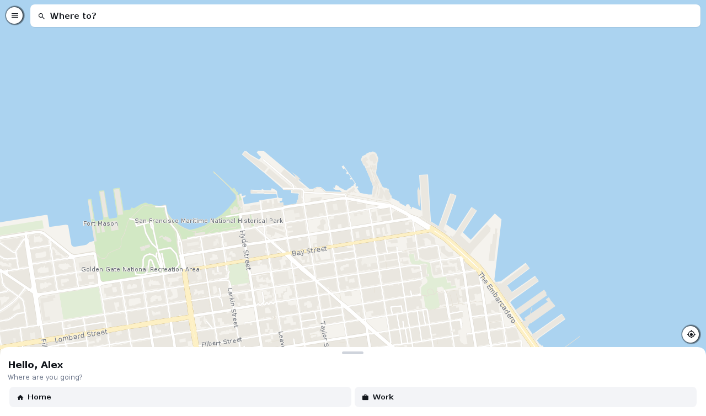

=== Settings

The **Settings** screen is in every role's menu and is the same in each. What's
chosen there is stored on the server with the account, so it follows the user
to another device.

.Settings
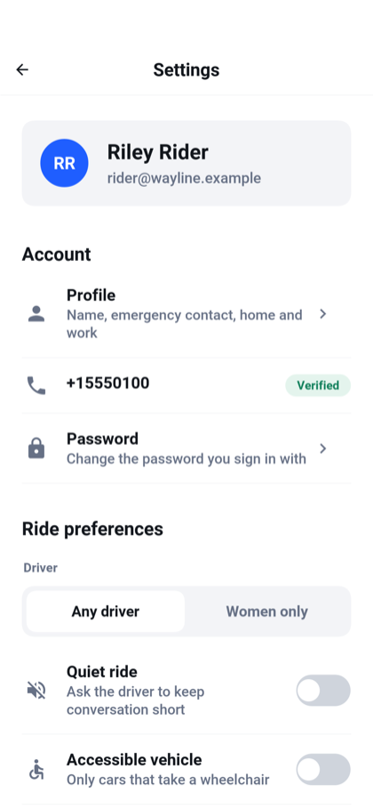

.Settings in the dark theme
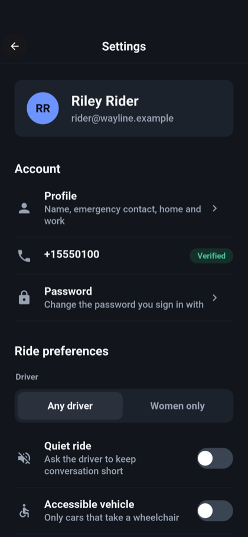

[cols="1,3"]
|===
| Section | What it holds

| Account
| The profile, which is the name, gender, an emergency contact and the saved
  home and work addresses. The mobile number and whether it's verified.
  Changing the password, which asks for the current one.

| Ride preferences
| Any driver or women only, a quiet ride, an accessible vehicle, and a
  pet-friendly car. They're sent with every ride request.

| Payment
| The wallet, the method that pays by default, and the tip offered first.

| Notifications
| Switches for ride updates, receipts and offers.

| Appearance
| The language, the theme, and whether distances are in kilometers or miles.

| Privacy and safety
| Whether to share trips, the emergency contact, and **Usage statistics**.

| About
| The terms of service, the privacy policy, the server address, and deleting
  the account.
|===

The app is translated into English, Spanish, French, German, and Hebrew. Hebrew
is laid out right to left. The theme follows the device, or is fixed to light or
dark, and the map changes with it.

.Settings in Hebrew
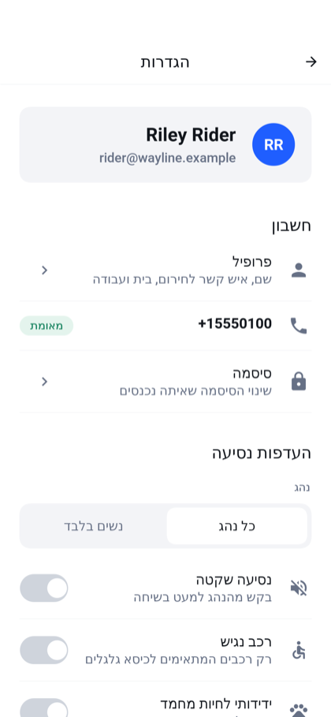

.Settings in a desktop window
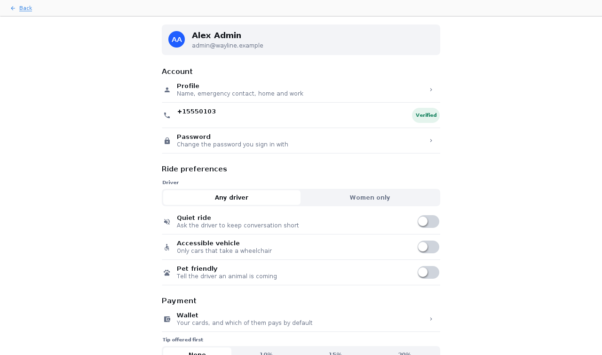

**Usage statistics** is the answer to the question asked after the first
sign-in. Unlike the rest of the screen it's kept on the device and not with
the account, so each device has its own answer. While it's off the app reports
nothing. Deleting the account also resets the anonymous id the statistics
carry.

.The usage statistics switch
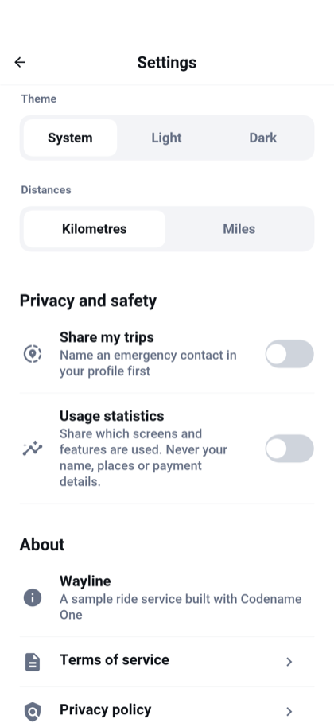

Three of these settings are stored and do nothing more in the sample:

* The notification switches are saved with the account, but the server sends no
  push notifications.
// vale-skip: Microsoft.FirstPerson: "Share my trips" is the label on the screen.
* **Share my trips** and the emergency contact are saved with the account, and
  the screen says that no message is sent. Sharing a trip is the **Share**
  button during a ride.
* **Women only** limits the offer to drivers whose profile says they're women.
  The server doesn't check the gender of the rider who asks.

Deleting the account removes the sign-in, the profile, the saved cards and any
driving application. The server refuses while a ride is under way.

=== In a browser

The server can host the app itself, so that opening the server's address in a
browser is using the app with nothing installed. It's the same app compiled to
JavaScript, with the same screens.

A browser gives a page less than a phone gives an app, and the app says so where
it matters. Calling and messaging are offered only where the device can dial.
The map opens on a default position when the browser won't say where it is.

<<wayline-launch>> has the commands, and
<<backend-hosting-the-app>> explains how a server hosts an app.
