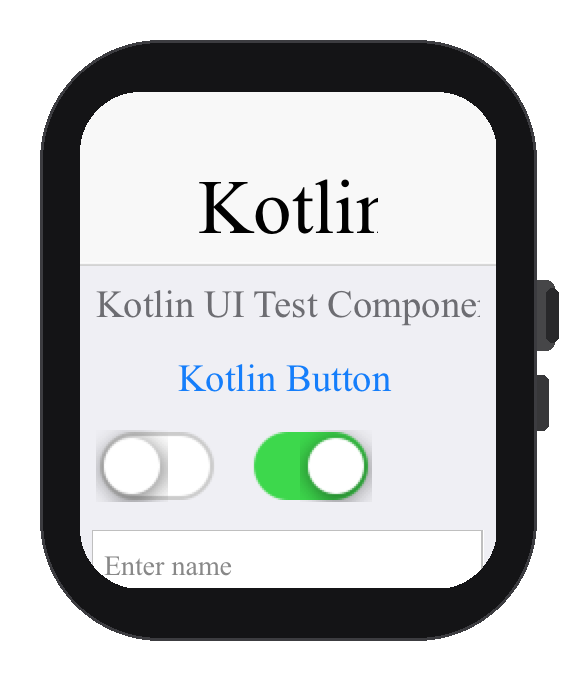

== Wearables (Apple Watch and Wear OS)

Codename One can build and run your application UI on smartwatches: Apple Watch
(watchOS) and Android Wear OS. The same Java/Kotlin code base that drives your
phone app drives the watch app -- you write Codename One UI as usual, and the
build pipeline produces the appropriate watch artifact for each platform.

The two platforms reach the watch through different mechanisms, and
understanding the difference explains why the build hints and the supported
feature sets differ:

* *Wear OS is Android.* A Wear OS app is an ordinary Android app that declares
  the watch hardware feature. The existing Codename One Android port renders the
  UI through exactly the same pipeline it uses on phones and tablets, so almost
  everything that works on Android works on the watch.
* *watchOS isn't iOS.* watchOS has no UIKit view hierarchy, no OpenGL ES and no
  Metal. The Codename One watchOS port therefore ships a dedicated *Core
  Graphics* rendering backend and a separate watch application target that hosts
  the Codename One runtime (the ParparVM-translated app) inside a SwiftUI shell.
  The graphics-heavy, GPU-bound and UIKit-peer APIs that have no watchOS
  equivalent are unavailable on the watch (see <<watch-supported-apis>>).

In both cases the build is *additive*: with the watch hints turned off your
phone build is byte-for-byte unchanged.

=== Detecting the Watch Form Factor

Use `CN.isWatch()` (or `Display.getInstance().isWatch()`) to branch your UI for
the watch at runtime. This is the wearable analog of the existing `isTablet()`
and `isDesktop()` checks:

[source,java]
----
include::../demos/common/src/main/java/com/codenameone/developerguide/snippets/generated/WearablesJava001Snippet.java[tag=wearables-java-001,indent=0]
----

On Android `isWatch()` is derived from `PackageManager.FEATURE_WATCH`
(`android.hardware.type.watch`); on iOS it's reported natively by the watchOS
runtime. On every other platform it returns `false`.

NOTE: `isWatch()` describes the device form factor, not the screen shape. A Wear
OS device can be round or square; query the display safe-area insets (see
<<designing-for-the-watch>>) rather than assuming a rectangle.

=== Designing for the Watch
[[designing-for-the-watch]]

A watch screen is small and is frequently round. A few practical guidelines:

* Prefer a single vertical column (`BoxLayout.y()` inside a `Form` that scrolls
  on the Y axis). The Digital Crown on Apple Watch and the rotary input on Wear
  OS scroll the focused scrollable container.
* Keep interactive targets large and few. There is little room for a `Toolbar`,
  side menu or tabs -- hide the title area when you don't need it.
* On round screens, keep content away from the corners. Use the form's safe-area
  insets so important content isn't clipped by the rounded bezel.
* Use the `"watch"` theme/constant overrides if you want a distinct watch look
  without forking your code (the override layer activates on watch devices the
  same way platform overrides do elsewhere).

TIP: You can lay out and iterate on a watch UI in the simulator by guarding the
watch layout with `CN.isWatch()` and exercising both branches; the device build
then renders the same code on the real watch.

=== Apple Watch (watchOS)

The watchOS build adds a second Xcode target to the generated project. It
compiles the shared, translated application sources for the watch architecture
(`arm64_32` on device), renders through the Core Graphics backend, and -- in the
default _companion_ distribution -- embeds the watch app inside your iOS app so
the pair installs together. The watch app is rooted in a generated SwiftUI
`@main` shell that hosts the Codename One frames and forwards Digital Crown and
tap input into the runtime.

.Codename One UI rendered on the watchOS simulator via the Core Graphics backend

==== Enabling the watchOS Build

Set the build hint:

[source,properties]
----
include::../demos/common/src/main/snippets/developer-guide/wearables.properties[tag=wearables-properties-001,indent=0]
----

Alternatively, declare a watch entry point and the watch slice is produced
automatically as part of the regular iOS build:

[source,properties]
----
include::../demos/common/src/main/snippets/developer-guide/wearables.properties[tag=wearables-properties-002,indent=0]
----

If you don't declare a distinct `watchMain`, the watch app reuses your phone
main class as its lifecycle entry point.

NOTE: `codename1.watchMain` (and `watchNative.enabled`) affect only the Apple
Watch (watchOS) build. They have no effect on Android: a Wear OS build is never
produced implicitly -- you enable it explicitly with `android.wear=true` (see
<<wear-os-android>>). A project can target both wearables at once by setting a
`watchMain` (or `watchNative.enabled=true`) and `android.wear=true` together.

==== watchOS Build Hints

[cols="2,1,4"]
|===
|Build hint |Default |Description

|`watchNative.enabled`
|`false`
|Force the watch target on even without a distinct `watchMain`.

|`codename1.watchMain` (a.k.a. `watchMain`)
|_(none)_
|Fully-qualified watch lifecycle entry class. Setting it also turns on the watch
build.

|`watchNative.distribution`
|`companion`
|`companion` embeds the watch app in the iOS app; `standalone` builds a
watch-only app with no paired phone app.

|`watchNative.bundleId`
|`<package>.watchkitapp`
|Bundle identifier of the watch app.

|`watchNative.minDeploymentTarget`
|`10.0`
|`WATCHOS_DEPLOYMENT_TARGET` for the watch target.

|`watchNative.displayName`
|_(app display name)_
|The watch app name shown on the watch.

|`watchNative.teamId`
|_(falls back to the iOS team id)_
|Apple Developer Team ID used to sign the watch target.

|`watchNative.embedCompanion`
|`false`
|Embed the watch app into the iOS app as a build dependency. Off by default so
the iOS build is unaffected; enable it for a packaged companion submission.
|===

==== Supported and Unsupported APIs on watchOS
[[watch-supported-apis]]

Because watchOS lacks UIKit views, GPU rendering and several iOS frameworks, the
APIs that depend on them aren't available on the watch slice. They're guarded
so that the shared sources still link, and they degrade rather than crash:

* *Unavailable:* `BrowserComponent` / web view, camera capture, `MediaPlayer`
  video, inline native text editors (text input routes through the watch text
  input controller), `MapComponent` native maps, and StoreKit in-app purchase.
* *Available:* the full Codename One UI and layout system, drawing and
  `Graphics` (rendered via Core Graphics, including gradients, transforms,
  clipping and Gaussian blur via Accelerate/vImage), `FontImage`/material icons,
  images and mutable images, networking and storage, JSON/XML, and the property
  and binding frameworks.

NOTE: The watch slice runs the same garbage-collected ParparVM runtime as the
iOS app. Memory and CPU budgets on the watch are far smaller than on the phone,
so keep watch screens light.

==== Building and Debugging

A `companion` build produces an iOS `.ipa` that carries the embedded watch app;
a `standalone` build produces a watch-only product. The generated project is a
standard Xcode project, so you can open it and debug/profile the watch target
with the native Xcode tools as usual. Cloud builds support the watch target
through the same iOS build -- set the hints above and build for iOS.

=== Android (Wear OS)
[[wear-os-android]]

A Wear OS app is a regular Android app. The Codename One Android port renders the
UI with the same pipeline it uses on phones, so no special rendering backend is
required -- you only need to mark the build as a watch app.

==== Enabling the Wear OS Build

[source,properties]
----
include::../demos/common/src/main/snippets/developer-guide/wearables.properties[tag=wearables-properties-003,indent=0]
----

This injects the watch hardware feature into the manifest:

[source,xml]
----
include::../demos/common/src/main/snippets/developer-guide/wearables.xml[tag=wearables-xml-001,indent=0]
----

By default it also declares the app *standalone*, so it installs and runs
directly on the watch without a paired phone app:

[source,xml]
----
include::../demos/common/src/main/snippets/developer-guide/wearables.xml[tag=wearables-xml-002,indent=0]
----

Setting `android.wear=true` also raises the minimum SDK to API 23 (the Wear OS
2.0 standalone baseline) if your project requests a lower level.

==== Wear OS Build Hints

[cols="2,1,4"]
|===
|Build hint |Default |Description

|`android.wear`
|`false`
|Mark the build as a Wear OS app (manifest feature + standalone meta-data +
minimum SDK floor).

|`android.wear.standalone`
|`true`
|Declare the app standalone. Set to `false` for a watch app that requires a
companion phone app.

|`android.playService.wearable`
|`false`
|Add the `play-services-wearable` dependency (only needed if you use the
Wearable Data Layer / message APIs directly).
|===

TIP: Because a Wear OS app is an ordinary Android app, you can also declare any
additional manifest features and permissions with the generic
`android.uses_feature.<name>` and `android.uses_permission.<name>` hints.

=== Summary

[cols="1,2,2"]
|===
| |Apple Watch (watchOS) |Wear OS (Android)

|Enable
|`watchNative.enabled=true` or `codename1.watchMain`
|`android.wear=true`

|Rendering
|Dedicated Core Graphics backend + separate watch target
|Standard Android rendering pipeline

|Distribution
|Companion (embedded in iOS app) or standalone
|Standalone (default) or companion

|Runtime detection
|`CN.isWatch()`
|`CN.isWatch()`
|===

The wearable build is additive on both platforms: with the hints off, your phone
builds are unchanged.
