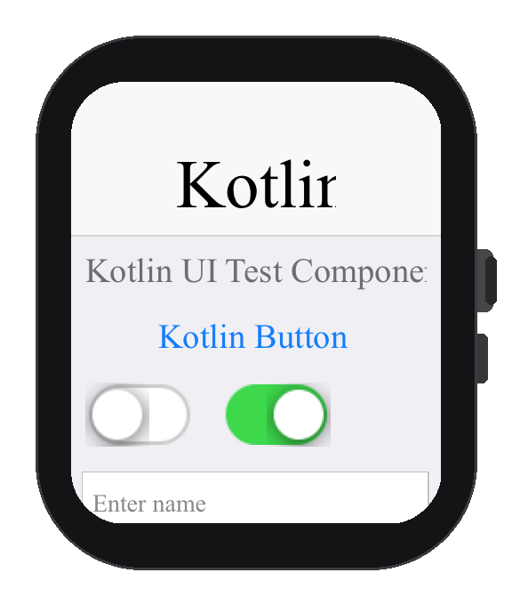

== Wearables (Apple Watch and Wear OS)

Codename One builds a watch app from the same project as your phone app, on both
Apple Watch and Wear OS. This chapter covers the whole picture: how one project
produces two apps, how you run the pair while you develop, how the two apps
exchange information, and how to put a complication on a watch face.

=== One Project, Two Apps

Declaring a watch lifecycle class next to your phone main class is the entire
opt-in:

[source,properties]
----
include::../demos/common/src/main/snippets/developer-guide/wearables.properties[tag=wearables-properties-001,indent=0]
----

There are no wearable build hints. The watch bundle identifier, deployment
target, signing team and display name are all derived from settings your project
already has, and one declaration builds the watch app on both platforms.

Note the asymmetry: `codename1.mainName` is a simple class name resolved against
`codename1.packageName`, while `codename1.watchMain` is fully qualified.

What the two apps share is the code base: your classes, your resources, your
theme and your CSS. What they don't share is anything at runtime. They're two
apps, on two devices, in two sandboxes, with separate lifecycles. In particular
`Storage`, `Preferences` and the SQLite database are *per device*: writing on
the phone doesn't make the value appear on the watch. Moving information
between them is what <<wearable-data>> is for.

The two platforms get there by different routes, which is why their supported
feature sets differ:

* *Wear OS is Android.* A Wear OS app is an ordinary Android app that declares
  the watch hardware feature. The existing Codename One Android port renders the
  UI through exactly the same pipeline it uses on phones and tablets, so almost
  everything that works on Android works on the watch.
* *watchOS isn't iOS.* watchOS has no UIKit view hierarchy, no OpenGL ES and no
  Metal. The Codename One watchOS port therefore ships a dedicated *Core
  Graphics* rendering backend and a separate watch application target that hosts
  the Codename One runtime (the ParparVM-translated app) inside a SwiftUI shell.
  The graphics-heavy, GPU-bound and UIKit-peer APIs that have no watchOS
  equivalent are unavailable on the watch (see <<watch-supported-apis>>).

Without a watch main class the build is byte-for-byte what it was, so adding one
never changes a phone build you already ship.

=== Companion or Standalone

By default the watch app is a *companion*: it ships inside the phone app and the
pair installs together. If the watch app is the product and there is no phone app
to pair with, declare it standalone:

[source,properties]
----
include::../demos/common/src/main/snippets/developer-guide/wearables.properties[tag=wearables-properties-002,indent=0]
----

A standalone build produces a watch-only product on Apple, and on Android turns
the single APK into the Wear OS app.

=== Running the Pair While You Develop

The simulator can run both halves. Choose a watch skin (Apple Watch 41mm or 45mm,
Wear round or Wear square) to develop the watch UI on its own, or pick *Watch ->
Launch Watch App* to start the watch app beside the phone app.

The watch app runs in its own process rather than in another window of the same
one, because that's what it becomes on a device -- a second app with its own sandbox.
The two processes find each other, so `sendMessage` and `putData` genuinely
round-trip on your desktop and you can develop the conversation between the two
apps without deploying anything.

TIP: Check your layout against the *Wear round* skin. A round face is where a
design that assumes a rectangle falls apart, and its safe area is inset
accordingly.

=== Detecting the Watch Form Factor

Use `CN.isWatch()` (or `Display.getInstance().isWatch()`) to branch your UI for
the watch at runtime. This is the wearable analog of the existing `isTablet()`
and `isDesktop()` checks:

[source,java]
----
include::../demos/common/src/main/java/com/codenameone/developerguide/snippets/generated/WearablesJava001Snippet.java[tag=wearables-java-001,indent=0]
----

On Android `isWatch()` is derived from `PackageManager.FEATURE_WATCH`
(`android.hardware.type.watch`); on iOS it's reported natively by the watchOS
runtime. On every other platform it returns `false`.

NOTE: `isWatch()` describes the device form factor, not the screen shape. A Wear
OS device can be round or square; query the display safe-area insets (see
<<designing-for-the-watch>>) rather than assuming a rectangle.

=== Designing for the Watch
[[designing-for-the-watch]]

A watch screen is small and is frequently round. A few practical guidelines:

* Prefer a single vertical column (`BoxLayout.y()` inside a `Form` that scrolls
  on the Y axis). The Digital Crown on Apple Watch and the rotary input on Wear
  OS scroll the focused scrollable container.
* Keep interactive targets large and few. There is little room for a `Toolbar`,
  side menu or tabs -- hide the title area when you don't need it.
* On round screens, keep content away from the corners. Use the form's safe-area
  insets so important content isn't clipped by the rounded bezel.
* Use the `"watch"` theme/constant overrides if you want a distinct watch look
  without forking your code (the override layer activates on watch devices the
  same way platform overrides do elsewhere).

=== Sharing Data Between the Phone and the Watch
[[wearable-data]]

The two apps share no storage. `Storage`, `Preferences` and the SQLite database
are per device, and there's no container that spans the pair, so a value written
on the phone is simply not on the watch. `com.codename1.wearable` is the channel
between them, and it's the same API on Apple Watch and Wear OS.

The platforms offer three transports because they answer three different
questions. Choosing the wrong one is the usual reason a watch app "never gets the
update":

[cols="2,2,2"]
|===
|You need |Use |Delivered

|An answer, now, while both apps are awake
|`WearableConnection.sendMessage`
|Immediately, or it fails

|The peer to end up with the latest value, whenever it next looks
|`WearableConnection.putData`
|Eventually, survives sleep and relaunch

|To move a file or a large blob
|`WearableConnection.transferFile`
|In the background, possibly much later

|Data the watch needs with no phone involved at all
|Ordinary `Storage` plus the network
|As usual

|Something rendered while your app isn't running
|`com.codename1.surfaces` (see <<watch-complications>>)
|By the system, from a published timeline
|===

A message is a phone call: it only connects if someone picks up. Replicated data
is a noticeboard: you pin the current value at a path, and the peer reads it
whenever it wakes. Reach for data by default and for messages only when you
genuinely need an answer now.

==== Replicating State

Publish on one side:

[source,java]
----
include::../demos/common/src/main/java/com/codenameone/developerguide/snippets/generated/WearablesJava001Snippet.java[tag=wearables-java-002,indent=0]
----

React on the other:

[source,java]
----
include::../demos/common/src/main/java/com/codenameone/developerguide/snippets/generated/WearablesJava001Snippet.java[tag=wearables-java-003,indent=0]
----

Each path holds one value, so this replicates state rather than queueing events:
two rapid updates to the same path may reach the peer as one. That's what makes
it the right default -- the peer always converges on the latest value, however
long it was away.

IMPORTANT: Register listeners from your app's `init()`. The platform starts an
app purely to hand it a payload, so what arrives may well be the thing that
launched you. Codename One queues those deliveries and replays them on the EDT,
but only to listeners that exist by the time it does.

==== Asking a Question

When you need an answer rather than a value, send a message and handle the reply:

[source,java]
----
include::../demos/common/src/main/java/com/codenameone/developerguide/snippets/generated/WearablesJava001Snippet.java[tag=wearables-java-004,indent=0]
----

Then answer it on the other side:

[source,java]
----
include::../demos/common/src/main/java/com/codenameone/developerguide/snippets/generated/WearablesJava001Snippet.java[tag=wearables-java-005,indent=0]
----

A reply is never guaranteed: the peer may be asleep, out of range, or running a
version of your app that doesn't know the path. `replyFailed` is the normal
case, not the exceptional one.

==== Knowing What's There

`isSupported()` is false where there is nothing to talk to at all, and every call
is then a harmless no-op, so this API needs no platform conditionals around it.
`isPaired()`, `isCompanionAppInstalled()` and `isReachable()` distinguish the
cases worth telling a user about: no watch, a watch without your watch app
installed, and a sleeping watch. Add a `WearableStateListener`
rather than polling.

=== Complications and Tiles
[[watch-complications]]

A complication -- the small live readout on a watch face -- is the same idea as a
home-screen widget: content-driven, rendered while your app isn't running, fed
by a timeline. Codename One models it as such, so a complication is a watch
*family* of `com.codename1.surfaces` rather than an API of its own:

[source,java]
----
include::../demos/common/src/main/java/com/codenameone/developerguide/snippets/generated/WearablesJava001Snippet.java[tag=wearables-java-006,indent=0]
----

Everything you already know about surfaces applies: the same node catalog, the
same `${key}` state interpolation, the same timeline that lets the OS advance
content on its own clock with no app wake-ups. `SurfaceVector` is especially at
home here, because most complications are a gauge, a dial or a ring.

[cols="2,2,2"]
|===
|Family |Apple Watch |Wear OS

|`WATCH_CIRCULAR`
|`accessoryCircular`
|Ranged-value or monochromatic-image complication

|`WATCH_RECTANGULAR`
|`accessoryRectangular`
|Long-text complication, or a Tile for a richer layout

|`WATCH_INLINE`
|`accessoryInline`
|Short-text complication. Text only -- anything else is dropped

|`WATCH_CORNER`
|`accessoryCorner`
|Renders as circular; Wear OS has no corner slot
|===

Design for a glance. A complication is a few dozen pixels someone reads in under
a second, so one number or one gauge beats any layout that has to be read.

NOTE: `WATCH_RECTANGULAR` and `LOCKSCREEN` share a family on Apple. If you
publish both, each surface gets the layout you designed for it; if you publish
only one, it's used for both.

IMPORTANT: The watch families and the descriptor pipeline behind them are in
place, and declaring them is forward-compatible. The platform targets that render
them on a watch face -- the watchOS widget extension and the Wear OS complication
data source and Tile service -- aren't generated yet, so a kind that declares
only watch families produces no on-device surface today. Declaring a phone family
alongside them keeps the widget working meanwhile.

=== Apple Watch (watchOS)

The watchOS build adds a second Xcode target to the generated project. It
compiles the shared, translated application sources for the watch architecture
(`arm64_32` on device), renders through the Core Graphics backend, and -- in the
default _companion_ distribution -- embeds the watch app inside your iOS app so
the pair installs together. The watch app is rooted in a generated SwiftUI
`@main` shell that hosts the Codename One frames and forwards Digital Crown and
tap input into the runtime.

.Codename One UI rendered on the watchOS simulator via the Core Graphics backend

==== What the Watch App Runs Today
[[watch-entry-point]]

Two properties of the watchOS build are worth knowing before you plan around it,
because neither is obvious from the setting you wrote.

The watch target compiles the same translated application sources as the phone
and starts the phone lifecycle class. On watchOS `codename1.watchMain` therefore
selects and enables the watch build, but it doesn't yet root the watch app at a
different entry point. Branch on `CN.isWatch()` to decide what the watch shows.
On Wear OS the declared class *is* the watch launcher, so a project that keeps
its watch screens behind that check behaves the same on both platforms -- which is
the pattern to write today regardless.

Submitting the companion pair to the App Store also needs an app icon for the
watch app, which the generated project doesn't produce. Building, running and
testing on the simulator and on a device don't require one; add an `AppIcon` set
to the watch target before you archive for submission.

==== Supported and Unsupported APIs on watchOS
[[watch-supported-apis]]

Because watchOS lacks UIKit views, GPU rendering and several iOS frameworks, the
APIs that depend on them aren't available on the watch slice. They're guarded
so that the shared sources still link, and they degrade rather than crash:

* *Unavailable:* `BrowserComponent` / web view, camera capture, `MediaPlayer`
  video, inline native text editors (text input routes through the watch text
  input controller), `MapComponent` native maps, and StoreKit in-app purchase.
* *Available:* the full Codename One UI and layout system, drawing and
  `Graphics` (rendered via Core Graphics, including gradients, transforms,
  clipping and Gaussian blur via Accelerate/vImage), `FontImage`/material icons,
  images and mutable images, networking and storage, JSON/XML, and the property
  and binding frameworks.

NOTE: The watch slice runs the same garbage-collected ParparVM runtime as the
iOS app. Memory and CPU budgets on the watch are far smaller than on the phone,
so keep watch screens light.

==== Building and Debugging

A companion build produces an iOS `.ipa` that carries the embedded watch app; a
standalone build produces a watch-only product. The generated project is a
standard Xcode project, so you can open it and debug or profile the watch target
with the native Xcode tools as usual. Cloud builds produce the watch app through
the same iOS build -- declare the watch main class and build for iOS.

=== Android (Wear OS)
[[wear-os-android]]

A Wear OS app is a regular Android app. The Codename One Android port renders the
UI with the same pipeline it uses on phones, so no special rendering backend is
required. The same `codename1.watchMain` declaration drives both platforms.

What it produces differs, though, and that difference is worth stating precisely.
Set `codename1.watchStandalone` and the Android build *is* the watch app: one APK
that installs and runs on the watch. Leave it unset and the Android build stays a
phone build -- a companion Wear APK alongside the phone APK isn't generated yet,
so on Android the companion configuration currently gives you the phone app and
the wearable link, not a second artifact. The build logs this rather than leaving
you to discover it. On Apple the companion case does produce and embed the watch
app, which is why the two platforms have a section each.

A standalone Wear app declares the watch hardware feature in the manifest:

[source,xml]
----
include::../demos/common/src/main/snippets/developer-guide/wearables.xml[tag=wearables-xml-001,indent=0]
----

It also marks itself standalone, so it installs and runs directly on the watch
without a paired phone app:

[source,xml]
----
include::../demos/common/src/main/snippets/developer-guide/wearables.xml[tag=wearables-xml-002,indent=0]
----

A standalone Wear build also raises the minimum SDK to API 23, the Wear OS 2.0
standalone baseline, if your project requests a lower level.

==== Wear OS Input and Screen Shape

Two things behave differently on a watch and are handled for you:

* *Rotary input.* The rotating side button or bezel scrolls the focused
  scrollable container, exactly as the Digital Crown does on Apple Watch. It
  arrives on its own input source rather than the mouse-wheel axes, and is scaled
  by the device's own scroll factor.
* *Round screens.* A circular face reports no display cutout, so a layout drawn
  to the full rectangle would have its corners eaten by the bezel. The safe area
  is inset to the largest rectangle that fits inside the circle -- about 15% a
  side -- so honoring the form's safe-area insets is enough.

TIP: Because a Wear OS app is an ordinary Android app, you can also declare any
additional manifest features and permissions with the generic
`android.uses_feature.<name>` and `android.uses_permission.<name>` hints.

NOTE: Referencing `com.codename1.wearable` adds the `play-services-wearable`
dependency and the listener service automatically. The
`android.playService.wearable` hint remains for apps that want to call the Data
Layer APIs directly.

=== Summary

[cols="1,2,2"]
|===
| |Apple Watch (watchOS) |Wear OS (Android)

|Enable
|`codename1.watchMain`
|`codename1.watchMain`

|Rendering
|Dedicated Core Graphics backend + separate watch target
|Standard Android rendering pipeline

|Distribution
|Companion (embedded in the phone app) or standalone
|Companion or standalone

|Runtime detection
|`CN.isWatch()`
|`CN.isWatch()`

|Talking to the phone app
|`com.codename1.wearable` over WatchConnectivity
|`com.codename1.wearable` over the Wearable Data Layer

|Complications
|WidgetKit accessory families
|Complication data source and Tiles
|===

The wearable build is additive on both platforms: without a watch main class,
your phone builds are unchanged.
