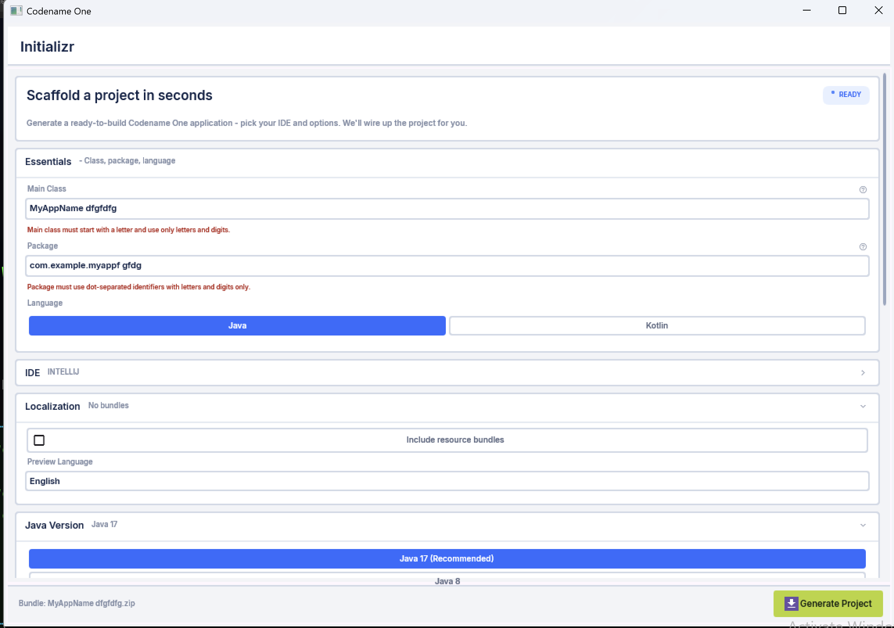

== Working with the native Windows port

The native Windows port compiles a Codename One app to a real, standalone Win32
executable -- a single `.exe` with *no JVM and no runtime dependencies*. It is the
Windows analog of the iOS port: the same ParparVM pipeline that turns your Java/
Kotlin bytecode into C and then into a native binary, here targeting Windows with
the LLVM toolchain and rendering through Direct2D / DirectWrite.

This is distinct from the long-standing *Windows desktop* build, which packages
the app to run on a Java Virtual Machine (see <<_native_windows_vs_the_desktop_jvm_app_vs_the_jar>>
for a practical comparison). The native port needs no JVM on the target machine.

.The Codename One Initializr app running as a native Windows `.exe` (ParparVM + Direct2D/DirectWrite, no JVM)

NOTE: The native Windows port is a young port. It renders, runs and edits text,
but several platform services are still being filled in. Treat it as a foundation
to build on rather than a feature-complete replacement for the desktop build, and
consult the port's `status.md` for the current gap list.

=== How it works (the technology stack)

The port reuses Codename One's portable architecture and swaps in a Win32 /
Direct2D implementation layer:

- *ParparVM "clean" C target.* The same VM that powers iOS translates your app +
  the Codename One core + the minimal Java runtime to C. A CMake project is
  generated and compiled with *clang-cl* (LLVM on the MSVC ABI) + *Ninja* into a
  native `.exe`. There is no bytecode interpreter and no JNI -- your code *is* the
  native binary.
- *Concurrent garbage collector.* ParparVM's non-blocking GC runs natively, the
  same collector used on iOS.
- *Direct2D + DirectWrite + WIC.* All 2D graphics (primitives, gradients,
  clipping, affine and perspective transforms, images) go through Direct2D;
  glyph layout, measurement and rasterization use DirectWrite; image decode/encode
  uses Windows Imaging Component (WIC). Rendering is GPU-accelerated.
- *Media Foundation* backs `Media` playback, and *WebView2* backs
  `BrowserComponent` (when the WebView2 SDK is present at build time).
- *WinHTTP* backs networking; raw sockets and WebSockets use Winsock.
- *Single self-contained executable.* There is no `.app`-style bundle directory on
  Windows, so the app's classpath resources -- the theme `.res`, images,
  localization, the material icon font -- are embedded directly into the
  executable's PE resource section and read back at runtime through
  `getResourceAsStream`. The result is one file you can copy and run.

=== Building a native Windows app

A native Windows build runs through the `codenameone-maven-plugin` like every
other target; the project produced by the Codename One Initializr already knows
how to build it. The heavy lifting -- translate to C, generate the CMake project,
configure and build with clang-cl/Ninja, collect the `.exe` -- is handled by the
builder, so the configuration on your side is trivial.

A runnable build must happen *on Windows*: the native compile links against the
Windows SDK (Direct2D / DirectWrite / WIC / Media Foundation / WinHTTP / Win32)
and uses clang-cl + CMake + Ninja inside a Visual Studio developer environment.
Direct2D/DirectWrite also need a real Windows GPU/display stack, so the rendering
cannot be validated under emulation. A Windows 11 VM (Parallels, Hyper-V, …) or a
real machine is the development environment.

Both *x64* and *arm64* are supported. clang-cl cross-compiles to either
architecture, so an arm64 host can produce an x64 binary and vice versa; pick the
target with the `windows.arch` build hint.

=== Build hints

The native Windows port adds the build hints below. They use the `windows.`
prefix; do not confuse them with the older `win.` hints, which configure the
*JVM-based Windows desktop installer* (`win.installDirName`, `win.shortcutName`,
…) and have no effect on the native port.

.Native Windows port build hints
|===
|Name |Description

|windows.arch
|Target CPU architecture for the `.exe`: `x64` (default) or `arm64`. Synonyms
`x86_64`/`amd64` and `aarch64` are accepted. clang-cl cross-compiles to the chosen
architecture from either host.

|windows.debug
|`true`/`false` (default `false`). When `false`, the `.exe` is optimized and
*stripped* -- no PDB, with the linker dead-stripping unreferenced code (`/OPT:REF`)
and folding identical functions (`/OPT:ICF`). Set `true` to keep debug symbols (a
`.pdb` next to the exe) so a native crash address can be symbolized while you are
developing. Optimizations stay on in either case.
|===

The full cross-platform build-hints reference is in the
link:#_sending_arguments_to_the_build_server[Advanced topics chapter].

=== Optimized and stripped by default

The shipping build is optimized (`/O2`) and stripped: no debug information is
embedded, and the linker removes unused functions and folds identical ones, which
keeps the single self-contained executable as small as the translated code allows.
As a concrete data point, the Codename One Initializr sample builds to a roughly
13 MB stripped `.exe` with no `.pdb`. Setting `windows.debug=true` keeps the
symbols: the same app produces a ~14 MB exe *plus a ~97 MB `.pdb`* -- the
debug data dwarfs the binary, which is exactly why it is not in the default. The
build stays optimized either way; with the `.pdb` present a faulting address can be
turned back into a function name and source line with `llvm-symbolizer`.

=== Native Windows vs. the desktop (JVM) app vs. the jar

Codename One can produce three different Windows artifacts from the same project.
They trade off self-containment, size, startup and maturity differently:

[cols="1,1,1,1",options="header"]
|===
| | Native Windows `.exe` | Desktop app (JVM) | Executable jar

|What it is
|A real Win32 binary (ParparVM → C → native), Direct2D/DirectWrite rendering.
|Your app running on a JVM with the Java SE port (Swing-hosted rendering),
packaged as a Windows installer.
|A runnable `.jar` of your app plus the Codename One jars.

|JVM required on the target?
|No -- fully self-contained.
|No if the installer bundles a JRE; otherwise it relies on one.
|Yes -- a compatible JDK (11–25) must be installed on the machine.

|Artifact size
|One `.exe`, on the order of 10–15 MB (everything -- VM, GC, your code,
resources -- is inside; ~13 MB for the Initializr sample).
|Largest: app + a bundled JRE (the JRE alone is ~40–70 MB).
|Smallest: a few MB (just bytecode); the JVM lives outside it.

|Startup
|Native process start -- no VM warm-up.
|JVM start-up cost.
|JVM start-up cost.

|CPU architecture
|Native x64 *and* arm64 binaries (`windows.arch`).
|Whatever the bundled/installed JVM supports.
|Whatever the installed JVM supports.

|Look & rendering
|Direct2D/DirectWrite, GPU-accelerated; the material native theme.
|Swing-hosted Codename One rendering (the simulator's pipeline).
|Same as the desktop app.

|Portability of the artifact
|Windows-only, and per-architecture.
|Windows-only installer.
|Cross-platform -- the same jar runs anywhere a supported JVM exists.

|Maturity
|Young -- a foundation, with gaps (see `status.md`).
|Mature, battle-tested.
|Mature, battle-tested.
|===

In practical terms: reach for the *native `.exe`* when you want to ship a single
self-contained, JVM-free, architecture-native Windows app that starts instantly;
reach for the *desktop (JVM) app* when you want the mature, fully-featured desktop
experience and don't mind shipping (or depending on) a JVM; and reach for the
*jar* when you want the smallest, most portable artifact for machines that already
have a JDK.
