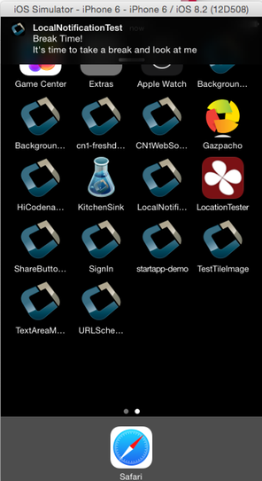

== Working with iOS

=== Troubleshooting iOS debug build installs

If you've access to a Mac, connect the device, open Xcode, and use the device explorer console to inspect messages that may explain what went wrong. If not, check the following:

- Make sure the build is the debug version and not the App Store version. The App Store version won't install on the device and can be distributed through Apple's store or TestFlight.

- Check that the UDID is correct. If you got the UDID from an app, it's probably wrong because apps no longer have access to the device UDID. Get it from the iOS Settings app or iTunes.

- Make sure the device isn't locked for installing third-party apps. This can happen on devices configured with parental controls.

- Check that you own the package name. For example, if you earlier installed an app with the same package name but a different certificate, a new install will fail. This is true for Android too. If you installed the kitchen sink from the store and then built your own app with the same package name, the installation will collide.
- This can be a problem if you use a generic package name that someone else already claimed, so use your own domain.

- Make sure the device has a recent enough version of iOS for the dependencies. Codename One builds target iOS 14 unless you say otherwise, and never drop below iOS 13 whatever is asked for. Raise the floor with the `ios.deployment_target` build hint when a library needs a newer version.

- Verify that you're using Safari when installing on the device. If you used a cable, that isn't a problem. Some developers had issues with Firefox not launching the install process.

- Check that the `ios.includePush` build hint matches your iOS provisioning. It must be false if your provisioning profile doesn't include push.

[[section-ios-launch-screen]]
[[ios-launch-storyboard]]
=== Launch screen best practices

Every iOS build declares a launch screen. Apps linked with the iOS 27 SDK or later are rejected unless the bundle declares one of `UILaunchStoryboardName`, `UILaunchStoryboards`, `UILaunchScreen` or `UILaunchScreens`, and `UIRequiresFullScreen` isn't a substitute for any of them. The build checks the finished `Info.plist` and fails if none of the four is there, so an `ios.plistInject` that removes the generated key stops the build rather than producing an archive the App Store refuses.

What the build declares by default is `UILaunchScreen`: the system background color, which follows light and dark mode on its own, with `Launch.Foreground.png` centered on it. That's deliberate rather than a simplification. Every Codename One app runs on the UIScene lifecycle, and SplashBoard doesn't render a launch *storyboard* for a scene-based app -- it animates from a black frame instead. Since iOS prefers the storyboard whenever both keys are present, declaring one would mean a black launch.

You can still take the storyboard, and the build still ships `LaunchScreen.storyboard` for you to point at. Declare the key yourself, which overrides the generated one:

[source]
----
codename1.arg.ios.plistInject=<key>UILaunchStoryboardName</key><string>LaunchScreen</string>
----

Do that only if you've verified the result on the devices you ship to. The same applies to `UILaunchStoryboards` and `UILaunchScreens`: declare either one through `ios.plistInject` and the build leaves your launch experience alone.

The `ios.generateSplashScreens`, `ios.uiscene` and `ios.launchStoryboardName` build hints have been removed, and a build that still sets one fails with a message explaining what replaced it. The first named the pre-storyboard `Default*.png` generator, which iOS stopped using long ago; the second selected the legacy `UIApplicationDelegate` lifecycle, which Apple no longer permits; the third named the storyboard for a key only that legacy lifecycle emitted.

==== Key files

The build provides the default launch screen automatically. Customize it by adding either of the following files under your project's `ios/src/main/resources` directory:

. `Launch.Foreground.png` - Shown in the center of the screen instead of your app icon. Used by the default `UILaunchScreen`.
. `Launch.Background.png` - Drawn behind the content to provide a color or illustration. Read by `LaunchScreen.storyboard`, so it only applies if you opt into the storyboard as shown above.

You can also replace `LaunchScreen.storyboard` itself with a custom storyboard created in Xcode.

==== Designing a flexible Layout

Keep the launch storyboard simple and static. The layout is rendered before your app code runs, so avoid views that depend on live data or animation. Follow these guidelines when editing `LaunchScreen.storyboard` in Xcode:

* Use Auto Layout constraints and safe-area guides so the design scales to every device, including split view on iPad.
* Prefer system colors or vector/PDF assets for logos so the result stays crisp on high-density screens and supports Dark Mode.
* Reserve text for short taglines or status messages that don't need localization at launch. Dynamic localization isn't available.
* Avoid referencing application delegate outlets or custom classes. Only design-time UIKit elements are supported.

==== Asset reference

The default storyboard expects PNG assets with the following characteristics. All sizes are specified in points (pt). Supply @2x and @3x variants for Retina displays when possible.

.Launch Screen Asset Reference
|===
|Asset | Purpose | Suggested 1x dimensions | Notes

|`Launch.Foreground.png`
|Brand mark centered on screen
|152×152
|Provide optional `Launch.Foreground@2x.png` (304×304) and `Launch.Foreground@3x.png` (456×456) for sharper output. Use transparency to let the background show through.

|`Launch.Background.png`
|Full-screen backdrop, storyboard only
|1024×1024
|Supply complementary `Launch.Background@2x.png` (2048×2048) and `Launch.Background@3x.png` (3072×3072) if you rely on artwork instead of a flat color. Keep file sizes small (<2 MB) to avoid slowing startup.

|`LaunchScreen.storyboard`
|Complete custom layout
|N/A
|Only used if you declare `UILaunchStoryboardName` through `ios.plistInject`. Enable Auto Layout and include constraints for every view. Avoid timers or code connections.
|===

==== Testing changes

NOTE: Changes to the launch screen don't take effect until the device has been restarted. If you install your app on a device, then change the launch screen and update the app, the launch screen won't change until the device is restarted.

When iterating locally with a Mac, open the generated Xcode project and run it on a device or simulator to verify that the layout adapts. On Windows or Linux, submit a TestFlight or Ad-Hoc build and check on hardware before shipping.

=== Local notifications on iOS and Android

Local notifications are like push notifications, except that they're initiated locally by the app, rather than remotely. They're useful for communicating information to the user while the app is running in the background, since they manifest themselves as pop-up notifications on supported devices.

TIP: To set the notification icon on Android place a 24×24 icon named `ic_stat_notify.png` under `android/src/main/resources`. The icon can be white with transparency areas

==== Sending notifications

The process for sending a notification is:

. Create a https://www.codenameone.com/javadoc/com/codename1/notifications/LocalNotification.html[LocalNotification] object with the information you want to send in the notification.
. Pass the object to `Display.scheduleLocalNotification()`.

Notifications can either be set up as one-time or as repeating.

===== Example sending notification

NOTE: On iOS, scheduling a local notification with an `id` that already exists now replaces the earlier scheduled notification with that same `id` instead of keeping duplicates.

The resulting notification will look like

.Resulting notification in iOS

==== Receiving notifications

The API for receiving/handling local notifications is also like push. Your application's main lifecycle class needs to implement the `com.codename1.notifications.LocalNotificationCallback` interface which includes a single method:

[source,java]
-----
include::../demos/common/src/main/java/com/codenameone/developerguide/snippets/generated/WorkingWithIosJava002Snippet.java[tag=working-with-ios-java-002,indent=0]
-----

The `notificationId` parameter will match the `id` value of the notification as set using `LocalNotification.setId()`.

===== Example receiving notification

NOTE: `localNotificationReceived()` is called when the user responds to the notification by tapping on the alert. If the user doesn't click on the notification, then this event handler will never be fired.

==== Canceling notifications

Repeating notifications will continue until they're canceled by the app. You can cancel a single notification by calling:

[source,java]
----
include::../demos/common/src/main/java/com/codenameone/developerguide/snippets/generated/WorkingWithIosJava003Snippet.java[tag=working-with-ios-java-003,indent=0]
----

Where `notificationId` is the string id that was set for the notification using `LocalNotification.setId()`.

=== iOS beta testing (testflight)

Apple provides the ability to distribute beta versions of your application to beta testers using testflight. This allows you to recruit up to 1000 beta testers without the typical UDID limits a typical Apple account has.

NOTE: This is supported for pro users as part of the crash protection feature.

To take advantage of that capability use the build hint `ios.testFlight=true` and then submit the app to the store for
beta testing. Make sure to use a release build target.

=== Metal renderer

iOS builds render through Metal. The pipeline drives a `CAMetalLayer`; there is no second renderer to choose between, and nothing to configure to get it.

=== Choosing a color space for the Metal renderer

The `CAMetalLayer` is configured with the sRGB color space. CG-rasterized images and gradients, which are tagged `DeviceRGB` in their `CGBitmapContext`, are displayed with the brightness their tag implies.

// vale-skip: Microsoft.Adverbs: "strictly device-RGB" is a precise color-pipeline qualifier (excluding sRGB conversion), not a softener.
For most apps the default is the right choice. Apps that need a different color profile -- for example, wide-gamut artwork that should be displayed in Display P3, or a strictly device-RGB pipeline that matches a custom rendering toolchain -- can override the choice with the `ios.metal.colorSpace` build hint:

[cols="1,3"]
|===
| Value | Effect

| `sRGB` (default)
| Sets `metalLayer.colorspace` to `kCGColorSpaceSRGB`. Use this unless you have a specific reason not to.

| `displayP3`
| Sets `metalLayer.colorspace` to `kCGColorSpaceDisplayP3`. Use for wide-gamut content on devices with a P3 display.

| `deviceRGB`
| Calls `CGColorSpaceCreateDeviceRGB()`. Skips sRGB gamma encoding -- raw bytes are written to the layer.

| `linearSRGB`
| Sets `metalLayer.colorspace` to `kCGColorSpaceLinearSRGB` for linear (non-gamma-encoded) sRGB output.

| `extendedSRGB`
| Sets `metalLayer.colorspace` to `kCGColorSpaceExtendedSRGB` (extended-range sRGB, allows values outside [0,1]).

| `extendedLinearSRGB`
| Sets `metalLayer.colorspace` to `kCGColorSpaceExtendedLinearSRGB`.

| `none`
| Leaves `metalLayer.colorspace` unset, so Metal uses the system default for the device.
|===

=== Accessing insecure URLs

Due to security exploits Apple blocked some access to insecure URLs which means that http code that worked before could stop working for you on iOS 9+. This is a good move, you should use https and avoid http as much as possible but that's sometimes impractical when working with an internal or debug environment.

You can disable the strict URL checks from Apple by using the venerable `ios.plistInject` build hint and setting it to:

[source,xml]
-----
include::../demos/common/src/main/snippets/developer-guide/working-with-ios.xml[tag=working-with-ios-xml-001,indent=0]
-----

For example, it seems that Apple will reject your app if you include that and don't have a good reason.

=== Using Cocoapods

NOTE: CocoaPods remains fully supported, but it's no longer the only supported iOS dependency path. Swift Package Manager (SPM) is also supported. The current guidance is documented in this section.

https://cocoapods.org/[CocoaPods] is a dependency manager for Swift and Objective-C Cocoa projects. It has over eighteen thousand libraries and can help you scale your projects. Cocoapods can be used in your Codename One project to include native iOS libraries without having to go through the hassle of bundling the actual library into your project. Rather than bundling `.h` and `.a` files in your `ios/src/main/resources` directory, you can specify which "pods" your app uses through the `ios.pods` build hint. (Other build hints also exist if you need more advanced features.)

**Examples**

Include the https://github.com/AFNetworking/AFNetworking[AFNetworking] library in your app:

----
ios.pods=AFNetworking
----

Include the https://github.com/AFNetworking/AFNetworking[AFNetworking] version 3.0.x library in your app:

----
ios.pods=AFNetworking ~> 3.0
----

For full versioning syntax specifying pods see the https://guides.cocoapods.org/syntax/podfile.html#pod[Podfile spec for the "pod" directive].

==== Including multiple pods

Multiple pods can be separated by either commas or semi-colons in the value of the `ios.pods` build hint. For example: To include GoogleMaps and AFNetworking, you could:

----
ios.pods=GoogleMaps,AFNetworking
----

Or specifying versions:

----
ios.pods=AFNetworking ~> 3.0,GoogleMaps
----

==== Other pod related build hints

`ios.pods.platform` : The least platform to target. Sometimes, Cocoapods require functionality that isn't in older version of iOS. For example, the GoogleMaps pod requires iOS 7.0 or higher, so you would need to add the `ios.pods.platform=7.0` build hint.

`ios.pods.sources` : Some pods require that you specify a URL of the source of the pod spec. This may be optional if the spec is hosted in the central CocoaPods source (`https://github.com/CocoaPods/Specs.git`).

==== Converting PodFile to build hints

Most documentation for Cocoapods "pods" provide instructions on what you need to add to your Xcode project's PodFile. Here is an example from the GoogleMaps cocoapod to show you how a PodFile can be converted into equivalent build hints in a Codename One project.

The GoogleMaps cocoapod directs you to add the following to your PodFile:

----
source 'https://github.com/CocoaPods/Specs.git'
platform :ios, '7.0'
pod 'GoogleMaps'
----

This would translate to the following build hints in your Codename One project:

----
ios.pods.sources=https://github.com/CocoaPods/Specs.git
ios.pods.platform=7.0
ios.pods=GoogleMaps
----

(Note that the `ios.pods.sources` directive is optional).

=== Using Swift package manager

Swift Package Manager can be used as an alternative to CocoaPods for remote Swift package dependencies on iOS. Select the dependency path with `ios.dependencyManager`. Supported values are `auto`, `CocoaPods`, `spm`, and `both`.

For an SPM-only configuration, declare the packages in `ios.spm.packages` using the format `<identity>|<url>|<requirement>` and then declare the products to link using `ios.spm.products.<identity>`.

----
ios.dependencyManager=spm
ios.spm.packages=swift-collections|https://github.com/apple/swift-collections.git|from:1.1.0
ios.spm.products.swift-collections=Collections
----

Supported need formats are `from:`, `exact:`, `branch:`, `revision:`, and `range:`.

`ios.dependencyManager=auto` preserves backward compatibility. Existing projects with `ios.pods` continue to use CocoaPods. Projects with `ios.spm.*` use SPM. If both hint families are present, both are applied.

Explicit dependency-manager modes are validated rather than dropping
dependencies. `ios.dependencyManager=spm` fails when the project or a built-in
API requires a CocoaPod; use `auto` or `both`. Likewise,
`ios.dependencyManager=none` fails while pod or SPM hints are present; remove
the dependency hints only if suppression is intentional, or switch to
`auto`. This is a migration-visible change for older projects that used
`spm` or `none` to ignore declared native dependencies.

=== Including dynamic frameworks

If you need to use a dynamic framework (for example: SomeThirdPartySDK.framework), and it isn't available through CocoaPods, then you can add it to your project by zipping up the framework and copying it to `ios/src/main/resources`.

For example: `ios/src/main/resources/SomeThirdPartySDK.framework.zip`

No build hints necessary for this approach. The build server will automatically detect the framework and link it into your app.
